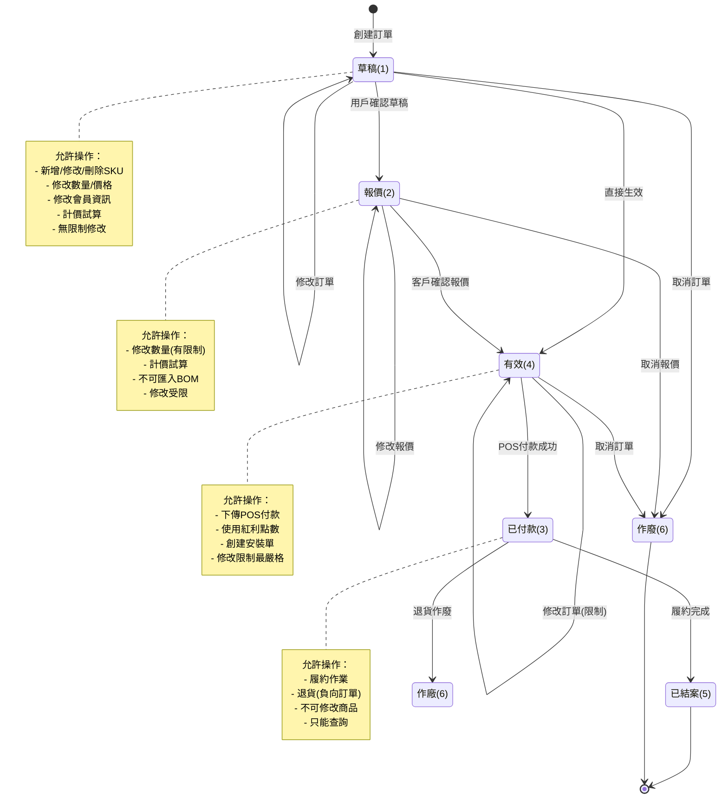

# 01. 訂單狀態生命週期

## 文檔資訊

- **文檔編號**: 01
- **版本**: v1.0
- **創建日期**: 2025-01-27
- **作者**: Claude Code Analysis
- **相關文檔**: 02-Order-Creation-Flow.md, 03-Order-Payment-Fulfillment-Flow.md

---

## 1. 訂單狀態定義

### 1.1 狀態常數定義

**源碼位置**: `SoConstant.java:123-145`

```java
public class SoConstant {
    /**
     * 客戶訂單狀態代碼-草稿
     */
    public static final String SO_STATUS_ID_DRAFTS = "1";

    /**
     * 客戶訂單狀態代碼-報價
     */
    public static final String SO_STATUS_ID_QUOTE = "2";

    /**
     * 客戶訂單狀態代碼-有效
     */
    public static final String SO_STATUS_ID_VALID = "4";

    /**
     * 客戶訂單狀態代碼-已付款 Paid
     */
    public static final String SO_STATUS_ID_PAID = "3";

    /**
     * 客戶訂單狀態代碼-已結案
     */
    public static final String SO_STATUS_ID_CLOSE = "5";

    /**
     * 客戶訂單狀態代碼-作廢
     */
    public static final String SO_STATUS_ID_INVALID = "6";
}
```

### 1.2 狀態對照表

| 狀態ID | 狀態名稱 | 常數名稱 | 英文名稱 | 業務含義 |
|--------|---------|----------|---------|---------|
| 1 | 草稿 | SO_STATUS_ID_DRAFTS | Draft | 訂單草稿，可任意修改 |
| 2 | 報價 | SO_STATUS_ID_QUOTE | Quotation | 報價單，給客戶確認用 |
| 4 | 有效 | SO_STATUS_ID_VALID | Valid | 訂單生效，可進行付款 |
| 3 | 已付款 | SO_STATUS_ID_PAID | Paid | 已完成付款，等待履約 |
| 5 | 已結案 | SO_STATUS_ID_CLOSE | Closed | 訂單完成，所有流程結束 |
| 6 | 作廢 | SO_STATUS_ID_INVALID | Invalid | 訂單取消，不再處理 |

**⚠️ 注意**: 狀態ID不是連續的（1, 2, 3, 4, 5, 6），實際順序為 1 → 2 → 4 → 3 → 5

---

## 2. 訂單狀態轉換圖

### 2.1 完整狀態機



### 2.2 狀態轉換矩陣

| 從狀態 ↓ / 到狀態 → | 草稿(1) | 報價(2) | 有效(4) | 已付款(3) | 已結案(5) | 作廢(6) |
|-------------------|---------|---------|---------|----------|----------|---------|
| **草稿(1)** | ✅ 修改 | ✅ 確認 | ✅ 生效 | ❌ | ❌ | ✅ 取消 |
| **報價(2)** | ❌ | ✅ 修改 | ✅ 確認 | ❌ | ❌ | ✅ 取消 |
| **有效(4)** | ❌ | ❌ | ✅ 修改 | ✅ 付款 | ❌ | ✅ 取消 |
| **已付款(3)** | ❌ | ❌ | ❌ | ❌ | ✅ 完成 | ✅ 退貨 |
| **已結案(5)** | ❌ | ❌ | ❌ | ❌ | ❌ | ❌ |
| **作廢(6)** | ❌ | ❌ | ❌ | ❌ | ❌ | ❌ |

**圖例**:
- ✅ = 允許轉換
- ❌ = 不允許轉換

---

## 3. 各狀態詳細說明

### 3.1 狀態1: 草稿 (Draft)

#### 業務特徵
- 訂單初始狀態
- 完全可編輯
- 可無限次修改
- 可暫存後繼續編輯

#### 允許的操作
✅ **商品管理**
- 新增商品SKU
- 刪除商品SKU
- 修改商品數量
- 修改商品價格

✅ **訂單資訊修改**
- 修改會員資訊
- 修改收貨地址
- 修改備註說明
- 修改工種資訊

✅ **計價操作**
- 點擊「試算」按鈕進行計價
- 查看折扣明細
- 調整變價

✅ **狀態轉換**
- 保存為報價單 (狀態 → 2)
- 直接生效 (狀態 → 4)
- 作廢訂單 (狀態 → 6)

#### 限制條件
⚠️ **匯入BOM限制**
```javascript
// soCreate.jsp:101
if($('#loadBOMFileButton').prop('disabled')) {
    if($('#orderStatusId').val() === '1') {
        msg = '有【匯入BOM表】資料，存檔狀態只能是報價或有效';
        // 不能保存為草稿
    }
}
```

#### 前端驗證邏輯
**位置**: `soCreate.jsp:115-367`

```javascript
function validateOrder() {
    // 252行驗證邏輯

    // 1. 必填欄位驗證
    if (!$('#memberCardId').val()) {
        alert('請選擇會員');
        return false;
    }

    // 2. 商品數量驗證
    if (lstSkuInfo.length === 0) {
        alert('至少需要一個商品');
        return false;
    }

    // 3. 商品明細驗證
    for (let i = 0; i < lstSkuInfo.length; i++) {
        if (lstSkuInfo[i].quantity <= 0) {
            alert('商品數量必須大於0');
            return false;
        }
    }

    // ... 共252行驗證邏輯

    return true;
}
```

#### 後端處理
**位置**: `SoController.java:759`

```java
@RequestMapping(value = "/ajaxCreateSO", method = {RequestMethod.POST, RequestMethod.GET})
public @ResponseBody String callAjaxCreateSO(String boStr) throws Exception {
    LoginUserInfoVO loginUserInfoVO = commonInfoServices.getLoginUserInfoVOByServletRequest();
    SoBO soBO = JSON.parseObject(boStr, SoBO.class, Feature.DisableASM);
    soBO.setReinstall("N");

    // 檢查5秒內重複提交
    String orderId = getOrderId(loginUserInfoVO.getEmpId(), soBO);
    if (orderId == null) {
        bzSoServices.doCreateSo(soBO, loginUserInfoVO);  // 創建訂單
        orderId = soBO.getOrderId();
    }

    result.put("orderId", orderId);
    return JSON.toJSONString(result);
}
```

---

### 3.2 狀態2: 報價 (Quotation)

#### 業務特徵
- 給客戶確認的報價單
- 部分可編輯
- 修改受到限制
- 可列印報價單

#### 允許的操作
✅ **有限修改**
- 修改數量（有限制）
- 修改備註
- 計價試算

✅ **狀態轉換**
- 確認報價轉為有效 (狀態 → 4)
- 作廢報價 (狀態 → 6)
- 繼續修改報價 (狀態 → 2)

#### 禁止的操作
❌ **嚴格限制**
- 不可匯入BOM表
- 不可使用紅利點數折抵

```javascript
// soBonusPointsSubPage.jsp:57-58
if (orderStatusId === '1' || orderStatusId === '2') {
    let orderStatusName = orderStatusId === '1' ? '草稿' : '報價';
    alert(orderStatusName + "狀態無法使用紅利點數加價購折抵，請變更訂單狀態為「有效」再使用");
    return;
}
```

#### 業務規則
1. 報價單有效期通常為15天
2. 超過15天仍未確認的報價單需要追蹤
3. 報價單可轉為正式訂單

---

### 3.3 狀態4: 有效 (Valid)

#### 業務特徵
- 正式生效的訂單
- 可以進行付款
- 可以下傳POS
- 修改限制最嚴格

#### 允許的操作
✅ **付款相關**
- 下傳POS進行付款
- 使用紅利點數折抵
- 選擇發票類型

✅ **履約準備**
- 創建安裝單
- 創建運送單
- 排程丈量作業

✅ **有限修改**
- 修改備註（不影響金額）
- 修改收貨時間

✅ **狀態轉換**
- 付款成功轉為已付款 (狀態 → 3)
- 作廢訂單 (狀態 → 6)

#### 禁止的操作
❌ **嚴格限制**
- 不可修改商品SKU
- 不可修改商品數量
- 不可修改會員資訊
- 不可修改價格

#### POS下傳條件
**位置**: `PosSoInfoEndpoint.java:241-242`

```java
// 檢查訂單狀態必須為 4(有效) 或 3(已付款)
if (tblOrder != null &&
    !(SoConstant.SO_STATUS_ID_VALID.equals(tblOrder.getOrderStatusId()) ||
      SoConstant.SO_STATUS_ID_PAID.equals(tblOrder.getOrderStatusId()))) {
    doPosSoInfoResponse.setStatus("N");
    doPosSoInfoResponse.setErrCode(PosSoInfoConstant.ERR_CODE_100);
    doPosSoInfoResponse.setErrMsg(PosSoInfoConstant.ERR_MSG_100);
    return;
}
```

---

### 3.4 狀態3: 已付款 (Paid)

#### 業務特徵
- 已完成POS付款
- 等待履約完成
- 幾乎不可修改
- 可以進行退貨

#### 允許的操作
✅ **履約作業**
- 安裝單派工
- 運送單派車
- 丈量單排程
- 驗收作業

✅ **查詢操作**
- 查詢訂單狀態
- 查詢付款記錄
- 查詢履約進度

✅ **狀態轉換**
- 履約完成轉為已結案 (狀態 → 5)
- 退貨作廢 (狀態 → 6)

#### 禁止的操作
❌ **完全禁止**
- 不可修改任何訂單資訊
- 不可修改商品
- 不可修改金額
- 不可取消付款

#### 付款狀態更新邏輯
**位置**: `PosSoPaidResultServices.java:774`

```java
// Step 8: 更新訂單狀態為已付款
private void step8(TblTransMast transMast) {
    // SET
    TblOrder tblOrderBySet = new TblOrder();
    tblOrderBySet.setOrderStatusId(SoConstant.SO_STATUS_ID_PAID);  // 狀態 = 3

    // WHERE
    TblOrderCriteria TblOrderByWhere = new TblOrderCriteria();
    TblOrderByWhere.createCriteria()
        .andOrderIdEqualTo(transMast.getOrderId())
        .andStoreIdEqualTo(transMast.getStoreId());

    tblOrderMapper.updateByExampleSelective(tblOrderBySet, TblOrderByWhere);
}
```

#### 退貨處理
**位置**: `PosSoReturnInfoEndpoint.java:203-204`

```java
// 檢查訂單狀態必須為 3(已付款) 或 5(已結案)
if (tblOrder == null ||
    !(StringUtils.equals(tblOrder.getOrderStatusId(), SoConstant.SO_STATUS_ID_PAID) ||
      StringUtils.equals(tblOrder.getOrderStatusId(), SoConstant.SO_STATUS_ID_CLOSE))) {
    doPosSoReturnInfoResponse.setStatus("N");
    doPosSoReturnInfoResponse.setErrCode(PosSoReturnInfoConstant.ERR_CODE_100);
    doPosSoReturnInfoResponse.setErrMsg(PosSoReturnInfoConstant.ERR_MSG_100);
    return;
}
```

---

### 3.5 狀態5: 已結案 (Closed)

#### 業務特徵
- 訂單生命週期結束
- 所有履約完成
- 終態，不可轉換
- 只能查詢

#### 結案條件
1. ✅ 已完成付款
2. ✅ 商品已驗收完成
3. ✅ 安裝已完成
4. ✅ 無未完成的工單

#### 允許的操作
✅ **查詢操作**
- 查詢訂單歷史
- 查詢付款記錄
- 查詢履約記錄
- 列印訂單報表

✅ **售後操作**
- 退貨（轉為作廢）
- 補開發票
- 客訴處理

#### 禁止的操作
❌ **完全禁止**
- 不可修改任何資訊
- 不可轉換為其他狀態（除退貨外）
- 不可重新付款

---

### 3.6 狀態6: 作廢 (Invalid)

#### 業務特徵
- 訂單已取消
- 終態，不可轉換
- 保留歷史記錄
- 可能有退款

#### 作廢原因代碼
**位置**: `SoConstant.java:241-247`

```java
/**
 * SO訂單作廢原因 - 客戶更換商品
 */
public static final String SO_INVALID_C0502 = "C0502";

/**
 * SO訂單作廢原因 - Restful updateSO 作廢
 */
public static final String SO_INVALID_C0510 = "C0510";
```

#### 作廢條件檢查
**位置**: `UpdateSOServices.java:82-86`

```java
// 檢查訂單狀態是否可以作廢
if (SoConstant.SO_STATUS_ID_CLOSE.equals(updateSORequest.getTblOrder().getOrderStatusId())) {
    throwOrderError(updateSORequest.getOrderId(), UpdateSOConstant.ERR_CODE_608);
} else if (SoConstant.SO_STATUS_ID_INVALID.equals(updateSORequest.getTblOrder().getOrderStatusId())) {
    throwOrderError(updateSORequest.getOrderId(), UpdateSOConstant.ERR_CODE_607);
}
```

#### 作廢流程
1. 檢查訂單狀態（已結案不可作廢）
2. 記錄作廢原因
3. 記錄作廢人員
4. 更新訂單狀態為6
5. 如有付款，處理退款
6. 通知相關系統（POS、HISU）

---

## 4. 狀態轉換觸發條件

### 4.1 用戶操作觸發

| 操作 | 從狀態 | 到狀態 | 觸發位置 |
|------|--------|--------|---------|
| 點擊「保存草稿」 | - | 1 | soCreate.jsp:88 |
| 點擊「保存為報價」 | 1 | 2 | soCreate.jsp |
| 點擊「訂單生效」 | 1/2 | 4 | SoController |
| 點擊「取消訂單」 | 1/2/4 | 6 | SoController |

### 4.2 系統自動觸發

| 事件 | 從狀態 | 到狀態 | 觸發位置 |
|------|--------|--------|---------|
| POS付款成功 | 4 | 3 | PosSoPaidResultServices.java:774 |
| 履約全部完成 | 3 | 5 | 履約系統 |
| POS退貨成功 | 3/5 | 6 | PosSoReturnResultServices.java |
| 超時未付款 | 4 | 6 | Batch Job (定時任務) |

### 4.3 批次作業觸發

**超時報價單作廢**
```java
// CancelQuotationNightRun.java
// 超過15天仍為報價狀態的訂單自動作廢
if (orderStatusId.equals("2") && daysDiff > 15) {
    updateOrderStatus(orderId, "6");
}
```

---

## 5. 狀態轉換驗證規則

### 5.1 前置條件檢查

```java
public boolean canTransitionTo(String fromStatus, String toStatus) {
    // 終態不可轉換
    if ("5".equals(fromStatus) || "6".equals(fromStatus)) {
        return false;
    }

    // 草稿 → 報價/有效/作廢
    if ("1".equals(fromStatus)) {
        return "2".equals(toStatus) || "4".equals(toStatus) || "6".equals(toStatus);
    }

    // 報價 → 有效/作廢
    if ("2".equals(fromStatus)) {
        return "4".equals(toStatus) || "6".equals(toStatus);
    }

    // 有效 → 已付款/作廢
    if ("4".equals(fromStatus)) {
        return "3".equals(toStatus) || "6".equals(toStatus);
    }

    // 已付款 → 已結案/作廢(退貨)
    if ("3".equals(fromStatus)) {
        return "5".equals(toStatus) || "6".equals(toStatus);
    }

    return false;
}
```

### 5.2 業務規則驗證

```java
public void validateTransition(String orderId, String fromStatus, String toStatus) {
    // 1. 草稿 → 有效：必須有商品明細
    if ("1".equals(fromStatus) && "4".equals(toStatus)) {
        if (getOrderItemCount(orderId) == 0) {
            throw new BusinessException("訂單沒有商品，不能生效");
        }
    }

    // 2. 有效 → 已付款：必須已下傳POS
    if ("4".equals(fromStatus) && "3".equals(toStatus)) {
        if (!isPosDownloaded(orderId)) {
            throw new BusinessException("訂單未下傳POS，不能標記為已付款");
        }
    }

    // 3. 已付款 → 已結案：必須完成履約
    if ("3".equals(fromStatus) && "5".equals(toStatus)) {
        if (!isFullfillmentCompleted(orderId)) {
            throw new BusinessException("履約未完成，不能結案");
        }
    }
}
```

---

## 6. 重新設計建議

### 6.1 狀態機模式實現

**新系統建議使用狀態機模式**:

```java
public interface OrderState {
    String getStatusId();
    String getStatusName();
    List<String> getAllowedTransitions();
    boolean canTransitionTo(String targetStatus);
    void onEnter(Order order);
    void onExit(Order order);
}

public class DraftState implements OrderState {
    @Override
    public String getStatusId() {
        return "1";
    }

    @Override
    public List<String> getAllowedTransitions() {
        return Arrays.asList("2", "4", "6");
    }

    @Override
    public boolean canTransitionTo(String targetStatus) {
        return getAllowedTransitions().contains(targetStatus);
    }

    @Override
    public void onEnter(Order order) {
        // 進入草稿狀態的邏輯
        log.info("訂單 {} 進入草稿狀態", order.getOrderId());
    }

    @Override
    public void onExit(Order order) {
        // 離開草稿狀態的邏輯
        log.info("訂單 {} 離開草稿狀態", order.getOrderId());
    }
}
```

### 6.2 事件驅動狀態轉換

```java
@Service
public class OrderStateMachine {

    @Autowired
    private ApplicationEventPublisher eventPublisher;

    public void transitionTo(Order order, String targetStatus) {
        // 1. 獲取當前狀態
        OrderState currentState = getState(order.getOrderStatusId());
        OrderState targetState = getState(targetStatus);

        // 2. 檢查是否可以轉換
        if (!currentState.canTransitionTo(targetStatus)) {
            throw new IllegalStateException(
                String.format("不能從 %s 轉換到 %s",
                    currentState.getStatusName(),
                    targetState.getStatusName())
            );
        }

        // 3. 執行轉換前檢查
        validateTransition(order, currentState, targetState);

        // 4. 執行狀態轉換
        currentState.onExit(order);
        order.setOrderStatusId(targetStatus);
        targetState.onEnter(order);

        // 5. 保存狀態
        orderRepository.save(order);

        // 6. 發布事件
        eventPublisher.publishEvent(new OrderStatusChangedEvent(
            order.getOrderId(),
            currentState.getStatusId(),
            targetStatus
        ));
    }
}
```

### 6.3 Angular狀態管理 (NgRx)

```typescript
// order.state.ts
export interface OrderState {
  orderId: string;
  orderStatusId: string;
  orderStatusName: string;
  allowedTransitions: string[];
  isTransitioning: boolean;
}

// order.actions.ts
export const changeOrderStatus = createAction(
  '[Order] Change Status',
  props<{ orderId: string; targetStatus: string }>()
);

export const changeOrderStatusSuccess = createAction(
  '[Order] Change Status Success',
  props<{ orderId: string; newStatus: string }>()
);

// order.effects.ts
@Effect()
changeOrderStatus$ = this.actions$.pipe(
  ofType(changeOrderStatus),
  switchMap(action =>
    this.orderService.changeStatus(action.orderId, action.targetStatus).pipe(
      map(response => changeOrderStatusSuccess({
        orderId: action.orderId,
        newStatus: response.orderStatusId
      })),
      catchError(error => of(changeOrderStatusFailure({ error })))
    )
  )
);
```

---

## 7. 常見問題與解決方案

### Q1: 為什麼狀態ID不是連續的？

**A**: 歷史設計原因，實際順序為 1 → 2 → 4 → 3 → 5。建議新系統重新設計為連續ID。

### Q2: 訂單可以從「已付款」退回到「有效」嗎？

**A**: 不可以。付款是單向操作，如需取消需走退貨流程（轉為作廢）。

### Q3: 如何處理批次修改訂單狀態？

**A**: 使用批次API，每個訂單仍需經過狀態驗證，建議使用異步處理。

### Q4: 訂單狀態變更需要記錄日誌嗎？

**A**: 是的，必須記錄在 `TBL_PROJECT_TIMELINE` 表中，包含變更時間、操作人、變更原因。

---

## 8. 參考資料

### 8.1 相關源碼文件

- `SoConstant.java:123-145` - 狀態常數定義
- `SoController.java:759` - 訂單創建
- `PosSoPaidResultServices.java:774` - 付款狀態更新
- `UpdateSOServices.java:82-86` - 作廢邏輯
- `soCreate.jsp:101` - 前端狀態檢查

### 8.2 相關文檔

- 02-Order-Creation-Flow.md - 訂單創建流程
- 03-Order-Payment-Fulfillment-Flow.md - 付款履約流程
- 12-API-Order-Management.md - 訂單管理API

### 8.3 數據庫表

- `TBL_ORDER` - 訂單主檔
- `TBL_ORDER_DETL` - 訂單明細
- `TBL_PROJECT_TIMELINE` - 訂單時間軸

---

**文檔結束**
