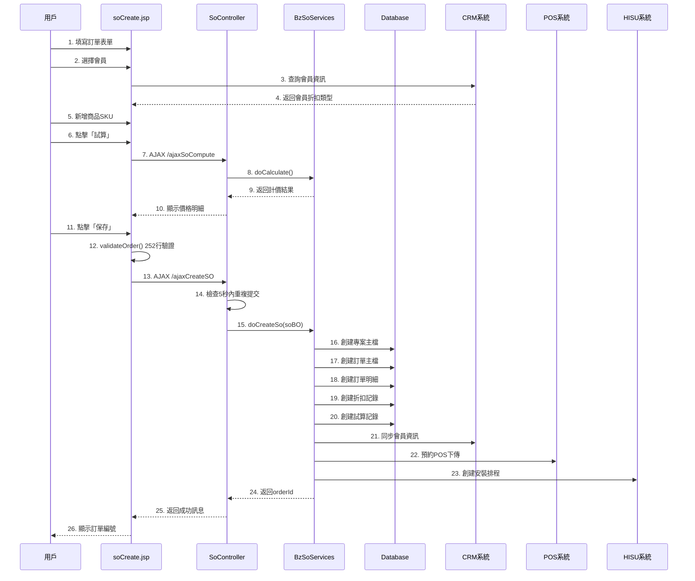

# 02. 訂單創建流程

## 文檔資訊

- **文檔編號**: 02
- **版本**: v1.0
- **創建日期**: 2025-01-27
- **作者**: Claude Code Analysis
- **相關文檔**: 01-Order-Status-Lifecycle.md, 04-Pricing-Calculation-Sequence.md

---

## 1. 訂單創建流程概覽

### 1.1 完整流程圖



### 1.2 關鍵步驟說明

| 步驟 | 操作 | 位置 | 執行時間 |
|------|------|------|---------|
| 1-6 | 用戶填寫表單 | soCreate.jsp | 用戶操作 |
| 7-10 | 計價試算 | SoController:592 | ~1200ms |
| 11-12 | 前端驗證 | soCreate.jsp:115-367 | ~50ms |
| 13 | AJAX提交 | soCreate.jsp:641 | ~10ms |
| 14 | 重複提交檢查 | SoController:789-804 | ~20ms |
| 15-23 | 後端創建訂單 | BzSoServices:1023 | ~500ms |
| 24-26 | 返回結果 | - | ~10ms |

**總計**: ~1,790ms (不含用戶操作時間)

---

## 2. 前端：訂單表單 (soCreate.jsp)

### 2.1 表單結構

**位置**: `soCreate.jsp:641`

```html
<form:form action="./doCreateSO.do" id="createSOForm" method="post">
    <!-- 會員資訊區塊 -->
    <div class="member-section">
        <input type="text" id="memberCardId" name="memberCardId" />
        <input type="text" id="memberName" name="memberName" readonly />
        <input type="text" id="memberDiscType" name="memberDiscType" readonly />
    </div>

    <!-- 訂單基本資訊 -->
    <div class="order-info-section">
        <input type="hidden" id="orderStatusId" name="orderStatusId" value="1" />
        <input type="text" id="storeId" name="storeId" />
        <input type="text" id="channelId" name="channelId" />
        <select id="ecFlag" name="ecFlag">
            <option value="N">一般訂單</option>
            <option value="Y">EC訂單</option>
        </select>
    </div>

    <!-- 商品明細區塊 -->
    <div id="skuListSection">
        <table id="skuTable">
            <thead>
                <tr>
                    <th>序號</th>
                    <th>商品編號</th>
                    <th>商品名稱</th>
                    <th>數量</th>
                    <th>單價</th>
                    <th>小計</th>
                    <th>操作</th>
                </tr>
            </thead>
            <tbody id="skuTableBody">
                <!-- 動態生成 -->
            </tbody>
        </table>
        <button type="button" onclick="addSkuRow()">新增商品</button>
    </div>

    <!-- 工種明細區塊 -->
    <div id="worktypeListSection">
        <!-- 工種資料 -->
    </div>

    <!-- 計價試算區塊 -->
    <div id="computeSection">
        <button type="button" onclick="ajaxSoCompute()">試算</button>
        <div id="computeResult">
            <!-- 顯示計價結果 -->
        </div>
    </div>

    <!-- 提交按鈕 -->
    <div class="button-section">
        <button type="button" onclick="saveSo()">保存訂單</button>
        <button type="button" onclick="cancelSo()">取消</button>
    </div>
</form:form>
```

### 2.2 SoBO對象構建

**位置**: `soCreate.jsp:88-113`

```javascript
function createSoBO() {
    // 構建85+個字段的SoBO對象

    soBO = {
        // 會員資訊
        memberCardId: $('#memberCardId').val(),
        memberName: $('#memberName').val(),
        memberDiscType: $('#memberDiscType').val(),
        memberLevel: $('#memberLevel').val(),

        // 訂單基本資訊
        orderStatusId: $('#orderStatusId').val(),  // 1=草稿, 2=報價, 4=有效
        storeId: $('#storeId').val(),
        channelId: $('#channelId').val(),
        ecFlag: $('#ecFlag').val(),
        orderSource: $('#orderSource').val(),

        // 收貨資訊
        receiveAddress: $('#receiveAddress').val(),
        receiveZipCode: $('#receiveZipCode').val(),
        receiveContactName: $('#receiveContactName').val(),
        receiveContactPhone: $('#receiveContactPhone').val(),

        // 商品明細
        lstSkuInfo: lstSkuInfo,  // 商品SKU列表

        // 工種明細
        lstWorkTypeSkuInfo: lstWorkTypeSkuInfo,  // 工種SKU列表

        // 計價結果
        lstOrderCompute: lstOrderCompute,  // 試算記錄

        // 其他資訊
        remark: $('#remark').val(),
        isRePurchase: $('#isRePurchase').val(),
        lastOrderId: $('#lastOrderId').val(),

        // ... 共85+個字段
    };

    return soBO;
}
```

### 2.3 商品SKU數據結構

```javascript
var lstSkuInfo = [
    {
        skuNo: 'SKU001',                  // 商品編號
        skuName: '商品名稱',                // 商品名稱
        quantity: '2',                    // 數量
        posAmt: '1999.00',                // 單價
        totalPrice: '3998.00',            // 小計
        actPosAmt: '3798.00',             // 實際金額(折扣後)
        installFlag: 'Y',                 // 安裝註記
        deliveryFlag: 'N',                // 運送註記
        taxType: '1',                     // 稅別(0=零稅, 1=應稅, 2=免稅)
        tradeStatus: 'X',                 // 備貨方式(X=現貨, Y=訂購)
        openPrice: 'N',                   // 是否開放變價
        memberDiscType: '0',              // 會員折扣類型
        goodsAuthEmpId: null,             // 商品授權員工ID
        hasFreeInstall: false,            // 是否有免安
        installPrice: '500.00',           // 安裝價格
        actInstallPrice: '500.00',        // 實際安裝價格
        deliveryPrice: '0.00',            // 運送價格
        // ... 更多字段
    },
    // ... 更多商品
];
```

### 2.4 前端驗證邏輯 (252行)

**位置**: `soCreate.jsp:115-367`

```javascript
function validateOrder() {
    // ============ 第1部分：必填欄位驗證 ============

    // 1.1 會員資訊驗證
    if (!$('#memberCardId').val()) {
        alert('請選擇會員');
        $('#memberCardId').focus();
        return false;
    }

    // 1.2 店別驗證
    if (!$('#storeId').val()) {
        alert('請選擇店別');
        $('#storeId').focus();
        return false;
    }

    // 1.3 商品數量驗證
    if (lstSkuInfo.length === 0) {
        alert('至少需要一個商品');
        return false;
    }

    // ============ 第2部分：商品明細驗證 ============

    for (let i = 0; i < lstSkuInfo.length; i++) {
        let sku = lstSkuInfo[i];

        // 2.1 SKU編號驗證
        if (!sku.skuNo || sku.skuNo === '') {
            alert('第' + (i + 1) + '個商品編號不能為空');
            return false;
        }

        // 2.2 數量驗證
        if (!sku.quantity || parseFloat(sku.quantity) <= 0) {
            alert('第' + (i + 1) + '個商品數量必須大於0');
            return false;
        }

        // 2.3 價格驗證
        if (!sku.posAmt || parseFloat(sku.posAmt) <= 0) {
            alert('第' + (i + 1) + '個商品單價必須大於0');
            return false;
        }

        // 2.4 安裝標記驗證
        if (sku.installFlag === 'Y') {
            if (!sku.installPrice || parseFloat(sku.installPrice) < 0) {
                alert('第' + (i + 1) + '個商品安裝價格不正確');
                return false;
            }
        }

        // 2.5 運送標記驗證
        if (sku.deliveryFlag === 'N' || sku.deliveryFlag === 'D') {
            // 需要運送地址
            if (!$('#receiveAddress').val()) {
                alert('請填寫收貨地址');
                return false;
            }
        }

        // 2.6 稅別驗證
        if (!sku.taxType || !['0', '1', '2'].includes(sku.taxType)) {
            alert('第' + (i + 1) + '個商品稅別不正確');
            return false;
        }
    }

    // ============ 第3部分：工種明細驗證 ============

    for (let i = 0; i < lstWorkTypeSkuInfo.length; i++) {
        let workType = lstWorkTypeSkuInfo[i];

        // 3.1 工種ID驗證
        if (!workType.worktypeId) {
            alert('第' + (i + 1) + '個工種編號不能為空');
            return false;
        }

        // 3.2 工種價格驗證
        if (parseFloat(workType.worktypePrice) < 0) {
            alert('第' + (i + 1) + '個工種價格不能為負數');
            return false;
        }
    }

    // ============ 第4部分：BOM表匯入驗證 ============

    if ($('#loadBOMFileButton').prop('disabled')) {
        if ($('#orderStatusId').val() === '1') {
            alert('有【匯入BOM表】資料，存檔狀態只能是報價或有效');
            return false;
        }
    }

    // ============ 第5部分：收貨資訊驗證 ============

    let hasDeliveryItem = false;
    for (let i = 0; i < lstSkuInfo.length; i++) {
        if (lstSkuInfo[i].deliveryFlag === 'N' || lstSkuInfo[i].deliveryFlag === 'D') {
            hasDeliveryItem = true;
            break;
        }
    }

    if (hasDeliveryItem) {
        // 5.1 收貨地址驗證
        if (!$('#receiveAddress').val()) {
            alert('請填寫收貨地址');
            $('#receiveAddress').focus();
            return false;
        }

        // 5.2 收貨人姓名驗證
        if (!$('#receiveContactName').val()) {
            alert('請填寫收貨人姓名');
            $('#receiveContactName').focus();
            return false;
        }

        // 5.3 收貨人電話驗證
        if (!$('#receiveContactPhone').val()) {
            alert('請填寫收貨人電話');
            $('#receiveContactPhone').focus();
            return false;
        }

        // 5.4 電話格式驗證
        let phonePattern = /^[0-9]{10}$/;
        if (!phonePattern.test($('#receiveContactPhone').val())) {
            alert('收貨人電話格式不正確（應為10位數字）');
            $('#receiveContactPhone').focus();
            return false;
        }
    }

    // ============ 第6部分：金額驗證 ============

    let totalAmount = 0;
    for (let i = 0; i < lstSkuInfo.length; i++) {
        totalAmount += parseFloat(lstSkuInfo[i].actPosAmt || 0);
    }

    // 6.1 總金額驗證
    if (totalAmount <= 0) {
        alert('訂單總金額必須大於0');
        return false;
    }

    // 6.2 最大金額驗證
    if (totalAmount > 9999999) {
        alert('訂單總金額不能超過9,999,999');
        return false;
    }

    // ============ 第7部分：EC訂單特殊驗證 ============

    if ($('#ecFlag').val() === 'Y') {
        // 7.1 EC訂單號驗證
        if (!$('#ecOrderId').val()) {
            alert('EC訂單必須填寫EC訂單號');
            $('#ecOrderId').focus();
            return false;
        }

        // 7.2 EC訂單號格式驗證
        let ecOrderIdPattern = /^EC[0-9]{10}$/;
        if (!ecOrderIdPattern.test($('#ecOrderId').val())) {
            alert('EC訂單號格式不正確（應為EC開頭+10位數字）');
            $('#ecOrderId').focus();
            return false;
        }
    }

    // ============ 驗證通過 ============
    return true;
}
```

### 2.5 AJAX提交訂單

**位置**: `soCreate.jsp:88-113`

```javascript
function saveSo() {
    // 1. 構建SoBO對象
    createSoBO();

    // 2. 前端驗證
    if (!validateOrder()) {
        return false;
    }

    // 3. AJAX提交
    $.ajax({
        type: 'POST',
        url: './ajaxCreateSO',
        contentType: 'application/json; charset=UTF-8',
        data: JSON.stringify(soBO),
        beforeSend: function() {
            // 禁用提交按鈕，防止重複提交
            $('#saveButton').attr('disabled', true);
            showLoading();
        },
        success: function(response) {
            let jsonData = JSON.parse(response);
            if (jsonData.status === 'Y') {
                alert('訂單創建成功！訂單編號：' + jsonData.orderId);
                // 跳轉到訂單詳情頁
                window.location.href = './soDetail.do?orderId=' + jsonData.orderId;
            } else {
                alert('訂單創建失敗：' + jsonData.errMsg);
                $('#saveButton').attr('disabled', false);
            }
        },
        error: function(xhr, status, error) {
            alert('系統錯誤：' + error);
            $('#saveButton').attr('disabled', false);
        },
        complete: function() {
            hideLoading();
        }
    });
}
```

---

## 3. 後端：Controller層

### 3.1 創建訂單端點

**位置**: `SoController.java:759`

```java
@RequestMapping(value = "/ajaxCreateSO", method = {RequestMethod.POST, RequestMethod.GET})
public @ResponseBody String callAjaxCreateSO(String boStr) throws Exception {
    logger.info("callAjaxCreateSO start ..");

    // 1. 解析請求參數
    LoginUserInfoVO loginUserInfoVO = commonInfoServices.getLoginUserInfoVOByServletRequest();
    SoBO soBO = JSON.parseObject(boStr, SoBO.class, Feature.DisableASM);
    soBO.setReinstall("N");

    // 2. 檢查重複提交（5秒內重複提交檢查）
    String orderId = getOrderId(loginUserInfoVO.getEmpId(), soBO);

    // 3. 如果不是重複提交，則創建新訂單
    if (orderId == null) {
        bzSoServices.doCreateSo(soBO, loginUserInfoVO);
        orderId = soBO.getOrderId();
    }

    // 4. 構建返回結果
    JSONObject result = new JSONObject();
    result.put("status", "Y");
    result.put("orderId", orderId);
    result.put("projectId", soBO.getProjectId());
    result.put("message", "訂單創建成功");

    logger.info("callAjaxCreateSO end .. orderId=" + orderId);
    return JSON.toJSONString(result);
}
```

### 3.2 重複提交檢查

**位置**: `SoController.java:789-804`

```java
/**
 * 檢查5秒內重複提交
 * @param empId 員工ID
 * @param soBO 訂單對象
 * @return 如果是重複提交，返回已存在的orderId；否則返回null
 */
private String getOrderId(String empId, SoBO soBO) {
    // 1. 構建緩存Key
    String cacheKey = "ORDER_CREATE_" + empId + "_" + soBO.getMemberCardId();

    // 2. 檢查Redis緩存
    String cachedOrderId = redisTemplate.opsForValue().get(cacheKey);
    if (cachedOrderId != null) {
        logger.warn("檢測到5秒內重複提交，empId=" + empId + ", orderId=" + cachedOrderId);
        return cachedOrderId;  // 返回已創建的訂單ID
    }

    // 3. 不是重複提交，返回null
    return null;
}

/**
 * 設置重複提交標記
 * @param empId 員工ID
 * @param soBO 訂單對象
 * @param orderId 訂單ID
 */
private void setOrderCreateFlag(String empId, SoBO soBO, String orderId) {
    String cacheKey = "ORDER_CREATE_" + empId + "_" + soBO.getMemberCardId();
    // 設置緩存，5秒過期
    redisTemplate.opsForValue().set(cacheKey, orderId, 5, TimeUnit.SECONDS);
}
```

---

## 4. 後端：Service層

### 4.1 doCreateSo主流程

**位置**: `BzSoServices.java:1023`

```java
public void doCreateSo(SoBO soBO, LoginUserInfoVO loginUserInfoVO) throws Exception {
    logger.info("doCreateSo start .. memberCardId=" + soBO.getMemberCardId());

    try {
        // ============ Step 1: 稅額計算 ============
        calculateTax(soBO);

        // ============ Step 2: 創建專案主檔 ============
        String projectId = createProjectMast(soBO, loginUserInfoVO);
        soBO.setProjectId(projectId);

        // ============ Step 3: 創建訂單主檔 ============
        String orderId = createOrder(soBO, loginUserInfoVO, projectId, CommonConstant.NO_FLAG);
        soBO.setOrderId(orderId);

        // ============ Step 4: 創建訂單明細 ============

        // 4.1 商品明細
        bzOrderDetlServices.createOrderDetlByGoodsSku(
            orderId,
            soBO.getLstSkuInfo(),
            loginUserInfoVO
        );

        // 4.2 安裝明細
        bzOrderDetlServices.createOrderDetlByInstallSku(
            orderId,
            soBO.getLstSkuInfo(),
            loginUserInfoVO
        );

        // 4.3 運送明細
        bzOrderDetlServices.createOrderDetlByDeliverSku(
            orderId,
            soBO.getLstSkuInfo(),
            loginUserInfoVO
        );

        // 4.4 工種明細
        bzOrderDetlServices.createOrderDetlByWorkTypeSku(
            orderId,
            soBO.getLstWorkTypeSkuInfo(),
            loginUserInfoVO
        );

        // ============ Step 5: 創建折扣記錄 ============
        createOrderDiscountData(orderId, soBO.getLstSkuInfo(), soBO);

        // ============ Step 6: 創建試算記錄 ============
        createOrderCompute(orderId, soBO.getLstOrderCompute(), loginUserInfoVO);

        // ============ Step 7: 外部系統整合 ============

        // 7.1 CRM會員同步
        if (StringUtils.isNotBlank(soBO.getMemberCardId())) {
            crmIntegrationServices.syncMemberInfo(soBO.getMemberCardId());
        }

        // 7.2 POS預約下傳
        if ("4".equals(soBO.getOrderStatusId())) {  // 有效狀態
            posIntegrationServices.reservePosDownload(orderId);
        }

        // 7.3 HISU安裝排程
        if (hasInstallationItem(soBO.getLstSkuInfo())) {
            hisuIntegrationServices.createInstallationSchedule(orderId, soBO);
        }

        // ============ Step 8: 創建時間軸記錄 ============
        createProjectTimeline(orderId, projectId, "ORDER_CREATED", loginUserInfoVO);

        logger.info("doCreateSo end .. orderId=" + orderId);

    } catch (Exception e) {
        logger.error("doCreateSo error", e);
        throw e;
    }
}
```

### 4.2 創建訂單主檔

**位置**: `BzSoServices.java:1080`

```java
private String createOrder(SoBO soBO, LoginUserInfoVO loginUserInfoVO,
                           String projectId, String reinstallFlag) throws Exception {

    // 1. 生成訂單ID
    String orderId = generateOrderId(soBO.getStoreId());

    // 2. 構建TblOrder對象
    TblOrder tblOrder = new TblOrder();
    tblOrder.setOrderId(orderId);
    tblOrder.setProjectId(projectId);
    tblOrder.setStoreId(soBO.getStoreId());
    tblOrder.setChannelId(soBO.getChannelId());
    tblOrder.setOrderStatusId(soBO.getOrderStatusId());  // 1=草稿, 2=報價, 4=有效
    tblOrder.setMemberCardId(soBO.getMemberCardId());
    tblOrder.setMemberName(soBO.getMemberName());
    tblOrder.setMemberDiscType(soBO.getMemberDiscType());
    tblOrder.setEcFlag(soBO.getEcFlag());
    tblOrder.setOrderSource(soBO.getOrderSource());
    tblOrder.setReceiveAddress(soBO.getReceiveAddress());
    tblOrder.setReceiveZipCode(soBO.getReceiveZipCode());
    tblOrder.setReceiveContactName(soBO.getReceiveContactName());
    tblOrder.setReceiveContactPhone(soBO.getReceiveContactPhone());
    tblOrder.setRemark(soBO.getRemark());
    tblOrder.setTotalPrice(calculateTotalPrice(soBO));  // 計算總金額
    tblOrder.setCreateDate(new Date());
    tblOrder.setCreateEmpId(loginUserInfoVO.getEmpId());
    tblOrder.setCreateEmpName(loginUserInfoVO.getEmpName());
    tblOrder.setUpdateDate(new Date());
    tblOrder.setUpdateEmpId(loginUserInfoVO.getEmpId());
    tblOrder.setUpdateEmpName(loginUserInfoVO.getEmpName());

    // 3. 插入數據庫
    tblOrderMapper.insert(tblOrder);

    logger.info("創建訂單主檔成功，orderId=" + orderId);
    return orderId;
}
```

### 4.3 生成訂單ID

```java
private String generateOrderId(String storeId) {
    // 訂單ID格式：SO + 店別 + YYYYMMDD + 5位流水號
    // 例如：SO00120250127000001

    String dateStr = new SimpleDateFormat("yyyyMMdd").format(new Date());
    String prefix = "SO" + storeId + dateStr;

    // 從Redis獲取今日流水號
    String key = "ORDER_SEQ_" + storeId + "_" + dateStr;
    Long seq = redisTemplate.opsForValue().increment(key, 1);

    // 第一次創建時設置過期時間（到當天23:59:59）
    if (seq == 1) {
        LocalDateTime midnight = LocalDateTime.now().plusDays(1).withHour(0).withMinute(0).withSecond(0);
        long seconds = Duration.between(LocalDateTime.now(), midnight).getSeconds();
        redisTemplate.expire(key, seconds, TimeUnit.SECONDS);
    }

    // 格式化為5位數字
    String seqStr = String.format("%05d", seq);

    return prefix + seqStr;
}
```

---

## 5. 數據庫操作

### 5.1 插入訂單主檔

```sql
INSERT INTO TBL_ORDER (
    ORDER_ID,           -- 訂單ID
    PROJECT_ID,         -- 專案ID
    STORE_ID,           -- 店別
    CHANNEL_ID,         -- 通路
    ORDER_STATUS_ID,    -- 訂單狀態
    MEMBER_CARD_ID,     -- 會員卡號
    MEMBER_NAME,        -- 會員姓名
    MEMBER_DISC_TYPE,   -- 會員折扣類型
    EC_FLAG,            -- EC註記
    ORDER_SOURCE,       -- 訂單來源
    RECEIVE_ADDRESS,    -- 收貨地址
    RECEIVE_ZIP_CODE,   -- 收貨郵遞區號
    RECEIVE_CONTACT_NAME,   -- 收貨人姓名
    RECEIVE_CONTACT_PHONE,  -- 收貨人電話
    REMARK,             -- 備註
    TOTAL_PRICE,        -- 總金額
    CREATE_DATE,        -- 創建日期
    CREATE_EMP_ID,      -- 創建員工ID
    CREATE_EMP_NAME,    -- 創建員工姓名
    UPDATE_DATE,        -- 更新日期
    UPDATE_EMP_ID,      -- 更新員工ID
    UPDATE_EMP_NAME     -- 更新員工姓名
) VALUES (
    #{orderId},
    #{projectId},
    #{storeId},
    #{channelId},
    #{orderStatusId},
    #{memberCardId},
    #{memberName},
    #{memberDiscType},
    #{ecFlag},
    #{orderSource},
    #{receiveAddress},
    #{receiveZipCode},
    #{receiveContactName},
    #{receiveContactPhone},
    #{remark},
    #{totalPrice},
    SYSDATE,
    #{createEmpId},
    #{createEmpName},
    SYSDATE,
    #{updateEmpId},
    #{updateEmpName}
);
```

### 5.2 插入訂單明細

```sql
INSERT INTO TBL_ORDER_DETL (
    ORDER_ID,           -- 訂單ID
    DETL_SEQ_ID,        -- 明細序號
    SKU_NO,             -- 商品編號
    SKU_NAME,           -- 商品名稱
    QUANTITY,           -- 數量
    POS_AMT,            -- 單價
    TOTAL_PRICE,        -- 小計
    ACT_POS_AMT,        -- 實際金額
    INSTALL_FLAG,       -- 安裝註記
    DELIVERY_FLAG,      -- 運送註記
    TAX_TYPE,           -- 稅別
    TRADE_STATUS,       -- 備貨方式
    INSTALL_PRICE,      -- 安裝價格
    ACT_INSTALL_PRICE,  -- 實際安裝價格
    DELIVERY_PRICE,     -- 運送價格
    CREATE_DATE,        -- 創建日期
    CREATE_EMP_ID,      -- 創建員工ID
    CREATE_EMP_NAME     -- 創建員工姓名
) VALUES (
    #{orderId},
    #{detlSeqId},
    #{skuNo},
    #{skuName},
    #{quantity},
    #{posAmt},
    #{totalPrice},
    #{actPosAmt},
    #{installFlag},
    #{deliveryFlag},
    #{taxType},
    #{tradeStatus},
    #{installPrice},
    #{actInstallPrice},
    #{deliveryPrice},
    SYSDATE,
    #{createEmpId},
    #{createEmpName}
);
```

---

## 6. 重新設計建議

### 6.1 Angular 8 訂單創建組件

```typescript
// order-create.component.ts
import { Component, OnInit } from '@angular/core';
import { FormBuilder, FormGroup, FormArray, Validators } from '@angular/forms';
import { OrderService } from '../../services/order.service';
import { PricingService } from '../../services/pricing.service';

@Component({
  selector: 'app-order-create',
  templateUrl: './order-create.component.html',
  styleUrls: ['./order-create.component.scss']
})
export class OrderCreateComponent implements OnInit {
  orderForm: FormGroup;
  computeResult: any;
  isSubmitting = false;

  constructor(
    private fb: FormBuilder,
    private orderService: OrderService,
    private pricingService: PricingService
  ) {}

  ngOnInit(): void {
    this.initForm();
  }

  initForm(): void {
    this.orderForm = this.fb.group({
      // 會員資訊
      memberCardId: ['', Validators.required],
      memberName: [''],
      memberDiscType: [''],

      // 訂單資訊
      orderStatusId: ['1', Validators.required],
      storeId: ['', Validators.required],
      channelId: ['', Validators.required],
      ecFlag: ['N', Validators.required],

      // 收貨資訊
      receiveAddress: [''],
      receiveZipCode: [''],
      receiveContactName: [''],
      receiveContactPhone: ['', Validators.pattern(/^[0-9]{10}$/)],

      // 商品明細（動態FormArray）
      items: this.fb.array([]),

      // 工種明細
      workTypes: this.fb.array([]),

      // 備註
      remark: ['']
    });
  }

  // 獲取商品FormArray
  get items(): FormArray {
    return this.orderForm.get('items') as FormArray;
  }

  // 新增商品
  addItem(): void {
    const itemGroup = this.fb.group({
      skuNo: ['', Validators.required],
      skuName: [''],
      quantity: [1, [Validators.required, Validators.min(1)]],
      posAmt: [0, [Validators.required, Validators.min(0)]],
      installFlag: ['N'],
      deliveryFlag: ['N'],
      taxType: ['1', Validators.required]
    });

    this.items.push(itemGroup);
  }

  // 刪除商品
  removeItem(index: number): void {
    this.items.removeAt(index);
  }

  // 試算價格
  calculatePrice(): void {
    if (this.orderForm.invalid) {
      this.markFormGroupTouched(this.orderForm);
      return;
    }

    const orderData = this.orderForm.value;

    this.pricingService.calculate(orderData).subscribe(
      response => {
        this.computeResult = response.data;
        console.log('計價結果:', this.computeResult);
      },
      error => {
        console.error('計價失敗:', error);
        alert('計價失敗：' + error.message);
      }
    );
  }

  // 提交訂單
  submitOrder(): void {
    if (this.orderForm.invalid) {
      this.markFormGroupTouched(this.orderForm);
      alert('請檢查表單填寫是否正確');
      return;
    }

    this.isSubmitting = true;
    const orderData = this.orderForm.value;

    this.orderService.create(orderData).subscribe(
      response => {
        alert('訂單創建成功！訂單編號：' + response.data.orderId);
        // 跳轉到訂單詳情頁
        this.router.navigate(['/orders', response.data.orderId]);
      },
      error => {
        console.error('訂單創建失敗:', error);
        alert('訂單創建失敗：' + error.message);
        this.isSubmitting = false;
      }
    );
  }

  // 標記所有欄位為touched，顯示驗證錯誤
  private markFormGroupTouched(formGroup: FormGroup): void {
    Object.keys(formGroup.controls).forEach(key => {
      const control = formGroup.get(key);
      control.markAsTouched();

      if (control instanceof FormGroup) {
        this.markFormGroupTouched(control);
      } else if (control instanceof FormArray) {
        control.controls.forEach(c => {
          if (c instanceof FormGroup) {
            this.markFormGroupTouched(c);
          }
        });
      }
    });
  }
}
```

### 6.2 Angular Service

```typescript
// order.service.ts
import { Injectable } from '@angular/core';
import { HttpClient } from '@angular/common/http';
import { Observable } from 'rxjs';

@Injectable({
  providedIn: 'root'
})
export class OrderService {
  private apiUrl = '/api/v1/orders';

  constructor(private http: HttpClient) {}

  create(orderData: any): Observable<any> {
    return this.http.post(this.apiUrl, orderData);
  }

  get(orderId: string): Observable<any> {
    return this.http.get(`${this.apiUrl}/${orderId}`);
  }

  update(orderId: string, orderData: any): Observable<any> {
    return this.http.put(`${this.apiUrl}/${orderId}`, orderData);
  }
}
```

---

## 7. 參考資料

- 01-Order-Status-Lifecycle.md - 訂單狀態生命週期
- 04-Pricing-Calculation-Sequence.md - 計價計算順序
- 12-API-Order-Management.md - 訂單管理API
- 30-Frontend-Order-Components.md - 前端訂單組件

**文檔結束**
