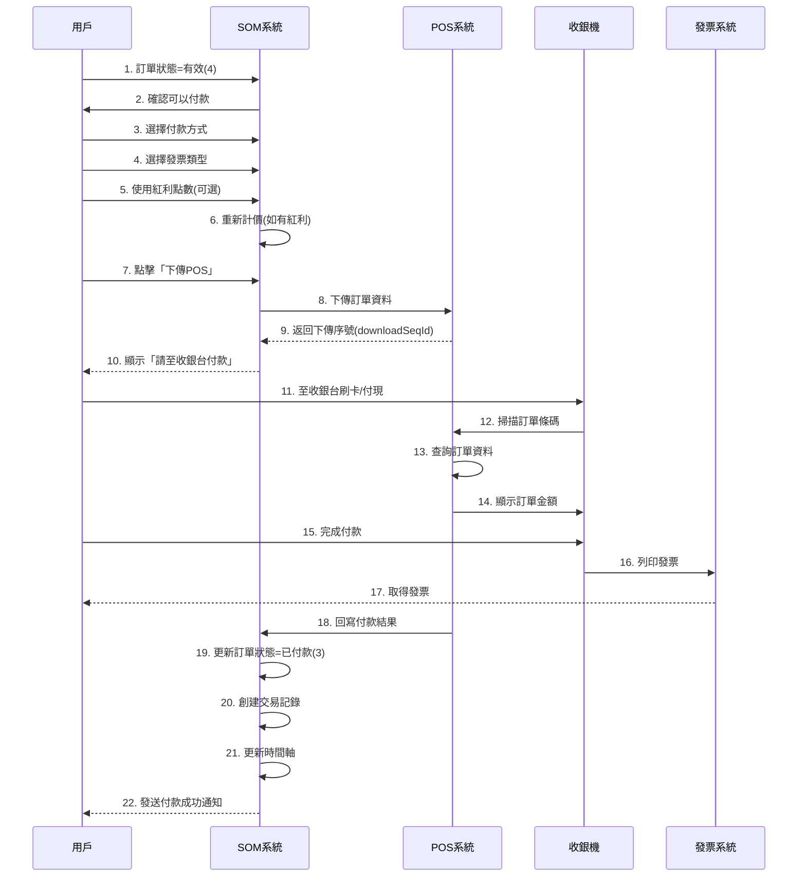
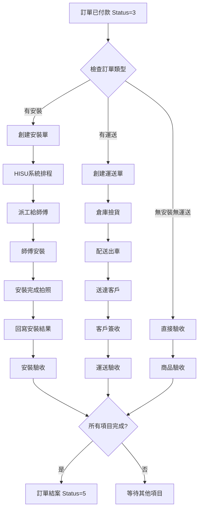
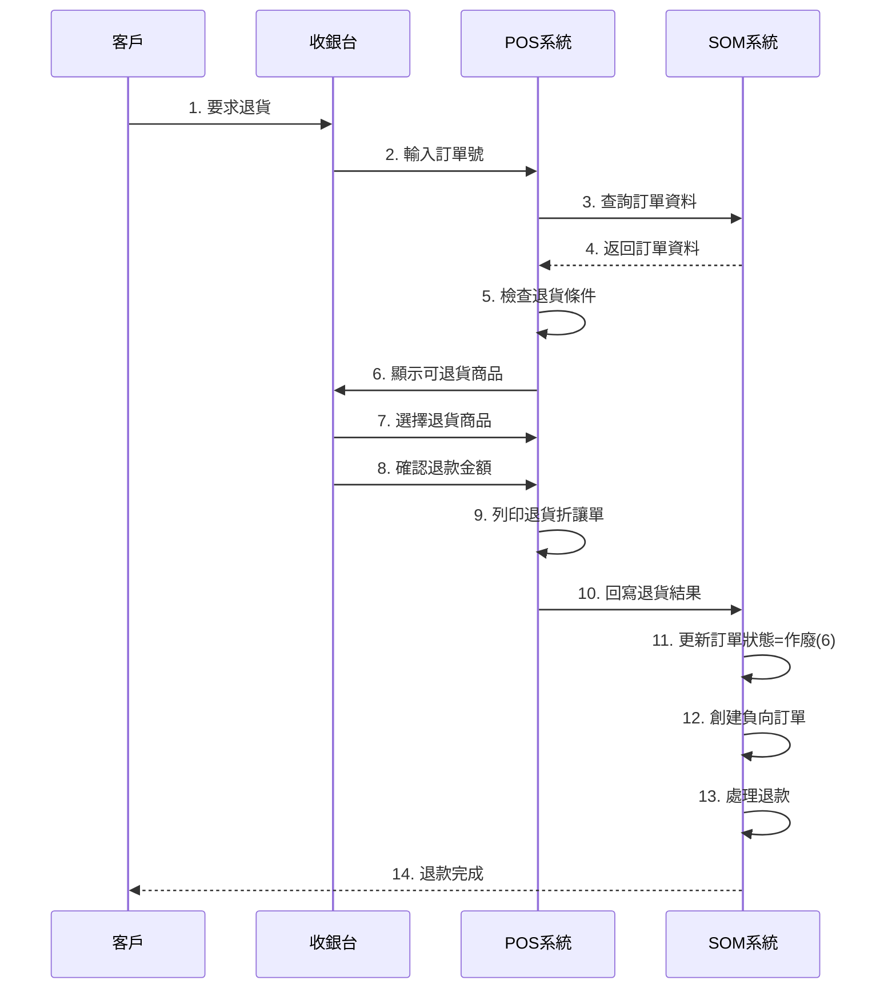

# 03. 訂單付款與履約流程

## 文檔資訊

- **文檔編號**: 03
- **版本**: v1.0
- **創建日期**: 2025-01-27
- **作者**: Claude Code Analysis
- **相關文檔**: 01-Order-Status-Lifecycle.md, 14-API-Payment-Service.md

---

## 1. 付款流程概覽

### 1.1 完整付款流程圖



### 1.2 關鍵步驟說明

| 步驟 | 操作 | 位置 | 執行時間 |
|------|------|------|---------|
| 1-7 | 用戶選擇付款方式 | SOM前端 | 用戶操作 |
| 8-9 | 下傳POS | PosSoInfoEndpoint | ~200ms |
| 10-17 | 收銀台付款 | POS系統 | 用戶操作 |
| 18 | 付款結果回寫 | PosSoPaidResultServices | ~500ms |
| 19-22 | 更新訂單狀態 | - | ~100ms |

**總計**: ~800ms (不含用戶操作時間)

---

## 2. 付款前置條件

### 2.1 訂單狀態檢查

**前置條件**:
1. ✅ 訂單狀態必須為 `4` (有效) 或 `3` (已付款)
2. ✅ 訂單必須有商品明細
3. ✅ 訂單總金額 > 0
4. ❌ 訂單狀態不能為 `5` (已結案) 或 `6` (作廢)

**位置**: `PosSoInfoEndpoint.java:241-242`

```java
// 檢查訂單狀態必須為 4(有效) 或 3(已付款)
if (tblOrder != null &&
    !(SoConstant.SO_STATUS_ID_VALID.equals(tblOrder.getOrderStatusId()) ||
      SoConstant.SO_STATUS_ID_PAID.equals(tblOrder.getOrderStatusId()))) {

    doPosSoInfoResponse.setStatus("N");
    doPosSoInfoResponse.setErrCode(PosSoInfoConstant.ERR_CODE_100);
    doPosSoInfoResponse.setErrMsg("訂單狀態不正確，無法下傳POS");
    return;
}
```

### 2.2 使用紅利點數的條件

**限制**: 草稿(1)和報價(2)狀態不能使用紅利點數

**位置**: `soBonusPointsSubPage.jsp:57-60`

```javascript
let orderStatusId = $('#orderStatusId').val();

// 草稿或報價狀態的訂單不能使用商品紅利
if (orderStatusId === '1' || orderStatusId === '2') {
    let orderStatusName = orderStatusId === '1' ? '草稿' : '報價';
    alert(orderStatusName + "狀態無法使用紅利點數加價購折抵，請變更訂單狀態為「有效」再使用");
    return;
}

// 檢查可用紅利點數
if (availableBonusPoints < useBonusPoints) {
    alert('可用紅利點數不足');
    return;
}
```

### 2.3 需要重新計價的情況

| 操作 | 是否重新計價 | 原因 |
|------|------------|------|
| 單純下傳POS | ❌ | 使用已計算的金額 |
| 使用紅利點數 | ✅ | 需重新計算折扣 |
| 修改發票類型 | ❌ | 不影響金額 |
| 修改付款方式 | ❌ | 不影響金額 |
| 修改商品數量 | ✅ | 金額變動，需重新生效 |

---

## 3. 下傳POS流程

### 3.1 下傳POS端點

**位置**: `PosSoInfoEndpoint.java:236-247`

```java
@PayloadRoot(namespace = NAMESPACE_URI, localPart = "doPosSoInfoRequest")
@ResponsePayload
public DoPosSoInfoResponse doPosSoInfo(@RequestPayload DoPosSoInfoRequest request) {
    logger.info("doPosSoInfo start .. orderId=" + request.getOrderId());

    DoPosSoInfoResponse response = new DoPosSoInfoResponse();

    try {
        // 1. 查詢訂單資料
        TblOrder tblOrder = tblOrderMapper.selectByPrimaryKey(request.getOrderId());

        // 2. 檢查訂單是否存在
        if (tblOrder == null) {
            response.setStatus("N");
            response.setErrCode(PosSoInfoConstant.ERR_CODE_102);
            response.setErrMsg("訂單不存在");
            return response;
        }

        // 3. 檢查訂單狀態
        if (!(SoConstant.SO_STATUS_ID_VALID.equals(tblOrder.getOrderStatusId()) ||
              SoConstant.SO_STATUS_ID_PAID.equals(tblOrder.getOrderStatusId()))) {
            response.setStatus("N");
            response.setErrCode(PosSoInfoConstant.ERR_CODE_100);
            response.setErrMsg("訂單狀態不正確，無法下傳POS");
            return response;
        }

        // 4. 生成下傳序號
        String downloadSeqId = generateDownloadSeqId(tblOrder.getStoreId());

        // 5. 創建下傳記錄
        createDownloadPos(tblOrder, downloadSeqId);

        // 6. 創建下傳商品明細
        createDownloadPosSku(tblOrder.getOrderId(), downloadSeqId);

        // 7. 返回成功結果
        response.setStatus("Y");
        response.setDownloadSeqId(downloadSeqId);
        response.setOrderId(tblOrder.getOrderId());
        response.setTotalAmount(tblOrder.getTotalPrice().toString());

        logger.info("doPosSoInfo end .. downloadSeqId=" + downloadSeqId);

    } catch (Exception e) {
        logger.error("doPosSoInfo error", e);
        response.setStatus("N");
        response.setErrCode("999");
        response.setErrMsg("系統錯誤：" + e.getMessage());
    }

    return response;
}
```

### 3.2 創建下傳記錄

**數據表**: `TBL_DOWNLOAD_POS`

```java
private void createDownloadPos(TblOrder order, String downloadSeqId) {
    TblDownloadPos downloadPos = new TblDownloadPos();

    downloadPos.setDownloadSeqId(downloadSeqId);
    downloadPos.setOrderId(order.getOrderId());
    downloadPos.setStoreId(order.getStoreId());
    downloadPos.setChannelId(order.getChannelId());
    downloadPos.setMemberCardId(order.getMemberCardId());
    downloadPos.setMemberName(order.getMemberName());
    downloadPos.setTotalPrice(order.getTotalPrice());
    downloadPos.setTotalDiscount(order.getTotalDiscount());
    downloadPos.setActTotalPrice(order.getActTotalPrice());
    downloadPos.setEcFlag(order.getEcFlag());
    downloadPos.setDownloadDate(new Date());
    downloadPos.setDownloadStatus("0");  // 0=已下傳未付款, 1=已付款
    downloadPos.setPrnSku("N");  // 是否列印商品明細
    downloadPos.setPrnDetl("N"); // 是否列印訂單明細
    downloadPos.setCreateDate(new Date());
    downloadPos.setCreateEmpId("SYSTEM");

    tblDownloadPosMapper.insert(downloadPos);
}
```

### 3.3 生成下傳序號

```java
private String generateDownloadSeqId(String storeId) {
    // 下傳序號格式：DL + 店別 + YYYYMMDD + 5位流水號
    // 例如：DL00120250127000001

    String dateStr = new SimpleDateFormat("yyyyMMdd").format(new Date());
    String prefix = "DL" + storeId + dateStr;

    // 從Redis獲取今日流水號
    String key = "DOWNLOAD_SEQ_" + storeId + "_" + dateStr;
    Long seq = redisTemplate.opsForValue().increment(key, 1);

    // 第一次創建時設置過期時間
    if (seq == 1) {
        LocalDateTime midnight = LocalDateTime.now().plusDays(1)
            .withHour(0).withMinute(0).withSecond(0);
        long seconds = Duration.between(LocalDateTime.now(), midnight).getSeconds();
        redisTemplate.expire(key, seconds, TimeUnit.SECONDS);
    }

    // 格式化為5位數字
    String seqStr = String.format("%05d", seq);

    return prefix + seqStr;
}
```

---

## 4. POS付款回寫流程

### 4.1 付款結果回寫端點

**位置**: `PosSoPaidResultServices.java`

```java
@Service
public class PosSoPaidResultServices {

    @Autowired
    private TblOrderMapper tblOrderMapper;

    @Autowired
    private TblTransMastMapper tblTransMastMapper;

    /**
     * POS付款結果回寫
     */
    public DoPosSoPaidResultResponse doPosSoPaidResult(DoPosSoPaidResultRequest request) {
        logger.info("doPosSoPaidResult start .. downloadSeqId=" + request.getDownloadSeqId());

        DoPosSoPaidResultResponse response = new DoPosSoPaidResultResponse();

        try {
            // Step 1: 查詢下傳記錄
            TblDownloadPos downloadPos = getDownloadPos(request.getDownloadSeqId());
            if (downloadPos == null) {
                response.setStatus("N");
                response.setErrCode("101");
                response.setErrMsg("下傳序號不存在");
                return response;
            }

            // Step 2: 檢查是否已處理
            if ("1".equals(downloadPos.getDownloadStatus())) {
                response.setStatus("Y");
                response.setMessage("此筆訂單已處理過付款");
                return response;
            }

            // Step 3: 查詢訂單資料
            TblOrder order = tblOrderMapper.selectByPrimaryKey(downloadPos.getOrderId());

            // Step 4: 檢查訂單狀態
            if (!SoConstant.SO_STATUS_ID_VALID.equals(order.getOrderStatusId()) &&
                !SoConstant.SO_STATUS_ID_PAID.equals(order.getOrderStatusId())) {
                response.setStatus("N");
                response.setErrCode("102");
                response.setErrMsg("訂單狀態不正確");
                return response;
            }

            // Step 5: 創建交易主檔
            TblTransMast transMast = createTransMast(request, downloadPos, order);

            // Step 6: 創建交易明細
            createTransDetl(transMast, downloadPos);

            // Step 7: 更新下傳狀態
            updateDownloadStatus(downloadPos.getDownloadSeqId(), "1");

            // Step 8: 更新訂單狀態為已付款
            updateOrderStatus(order.getOrderId(), SoConstant.SO_STATUS_ID_PAID);

            // Step 9: 創建時間軸記錄
            createTimeline(order.getOrderId(), "ORDER_PAID", request);

            // Step 10: 發送通知
            sendPaymentNotification(order);

            response.setStatus("Y");
            response.setMessage("付款結果處理成功");
            response.setOrderId(order.getOrderId());

            logger.info("doPosSoPaidResult end .. orderId=" + order.getOrderId());

        } catch (Exception e) {
            logger.error("doPosSoPaidResult error", e);
            response.setStatus("N");
            response.setErrCode("999");
            response.setErrMsg("系統錯誤：" + e.getMessage());
        }

        return response;
    }
}
```

### 4.2 更新訂單狀態為已付款

**位置**: `PosSoPaidResultServices.java:774`

```java
// Step 8: 更新訂單狀態為已付款
private void updateOrderStatus(String orderId, String statusId) {
    // SET
    TblOrder tblOrderBySet = new TblOrder();
    tblOrderBySet.setOrderStatusId(statusId);  // 狀態 = 3 (已付款)
    tblOrderBySet.setUpdateDate(new Date());
    tblOrderBySet.setUpdateEmpId("POS_SYSTEM");
    tblOrderBySet.setUpdateEmpName("POS系統");

    // WHERE
    TblOrderCriteria criteria = new TblOrderCriteria();
    criteria.createCriteria()
        .andOrderIdEqualTo(orderId);

    // UPDATE
    int count = tblOrderMapper.updateByExampleSelective(tblOrderBySet, criteria);

    if (count == 0) {
        throw new BusinessException("更新訂單狀態失敗");
    }

    logger.info("訂單狀態已更新：orderId=" + orderId + ", newStatus=" + statusId);
}
```

### 4.3 創建交易記錄

**數據表**: `TBL_TRANS_MAST` (交易主檔)

```java
private TblTransMast createTransMast(DoPosSoPaidResultRequest request,
                                     TblDownloadPos downloadPos,
                                     TblOrder order) {
    TblTransMast transMast = new TblTransMast();

    transMast.setOrderId(order.getOrderId());
    transMast.setStoreId(order.getStoreId());
    transMast.setTransDate(request.getTransDate());  // 交易日期 YYYYMMDD
    transMast.setPosNo(request.getPosNo());          // 收銀機台號
    transMast.setPosSeqNo(request.getPosSeqNo());    // 收銀機交易序號
    transMast.setDownloadSeqId(downloadPos.getDownloadSeqId());
    transMast.setMemberCardId(order.getMemberCardId());
    transMast.setMemberName(order.getMemberName());
    transMast.setTotalPrice(order.getTotalPrice());
    transMast.setActTotalPrice(order.getActTotalPrice());
    transMast.setPaymentMethod(request.getPaymentMethod());  // 付款方式
    transMast.setInvoiceId(request.getInvoiceId());          // 發票號碼
    transMast.setInvoiceType(request.getInvoiceType());      // 發票類型
    transMast.setEcFlag(order.getEcFlag());
    transMast.setCasaAr(CommonConstant.NO_FLAG);  // 是否為CASA沖銷應收作業
    transMast.setCreateDate(new Date());
    transMast.setCreateEmpId("POS_SYSTEM");

    tblTransMastMapper.insert(transMast);

    logger.info("創建交易主檔成功：orderId=" + order.getOrderId());
    return transMast;
}
```

---

## 5. 履約流程

### 5.1 履約流程概覽



### 5.2 安裝單創建

**觸發時機**: 訂單付款完成 + 有安裝商品

**位置**: `BzInstallationServices.java`

```java
public String createInstallation(String orderId) {
    logger.info("createInstallation start .. orderId=" + orderId);

    // 1. 查詢訂單資料
    TblOrder order = tblOrderMapper.selectByPrimaryKey(orderId);

    // 2. 查詢需要安裝的商品
    List<TblOrderDetl> installItems = getInstallItems(orderId);
    if (installItems.isEmpty()) {
        logger.info("訂單無安裝商品，不需創建安裝單");
        return null;
    }

    // 3. 生成安裝單號
    String installationId = generateInstallationId(order.getStoreId());

    // 4. 創建安裝單主檔
    TblInstallation installation = new TblInstallation();
    installation.setInstallationId(installationId);
    installation.setOrderId(orderId);
    installation.setProjectId(order.getProjectId());
    installation.setStoreId(order.getStoreId());
    installation.setMemberCardId(order.getMemberCardId());
    installation.setMemberName(order.getMemberName());
    installation.setInstallAddress(order.getReceiveAddress());
    installation.setInstallContactName(order.getReceiveContactName());
    installation.setInstallContactPhone(order.getReceiveContactPhone());
    installation.setStatus("1");  // 1=待排程
    installation.setCreateDate(new Date());
    installation.setCreateEmpId("SYSTEM");

    tblInstallationMapper.insert(installation);

    // 5. 創建安裝單明細
    for (TblOrderDetl item : installItems) {
        createInstallDetl(installationId, item);
    }

    // 6. 通知HISU系統排程
    notifyHisuSchedule(installationId, order);

    logger.info("createInstallation end .. installationId=" + installationId);
    return installationId;
}
```

### 5.3 HISU系統整合

**HISU系統**: 安裝排程系統

```java
public void notifyHisuSchedule(String installationId, TblOrder order) {
    try {
        // 1. 構建HISU排程請求
        HisuScheduleRequest request = new HisuScheduleRequest();
        request.setInstallationId(installationId);
        request.setOrderId(order.getOrderId());
        request.setStoreId(order.getStoreId());
        request.setInstallAddress(order.getReceiveAddress());
        request.setInstallContactName(order.getReceiveContactName());
        request.setInstallContactPhone(order.getReceiveContactPhone());
        request.setPreferredDate(order.getPreferredInstallDate());  // 客戶期望安裝日期

        // 2. 調用HISU API
        HisuScheduleResponse response = hisuWebService.createSchedule(request);

        // 3. 檢查返回結果
        if ("Y".equals(response.getStatus())) {
            logger.info("HISU排程成功：installationId=" + installationId +
                       ", hisuScheduleId=" + response.getScheduleId());

            // 4. 更新安裝單的HISU排程ID
            updateHisuScheduleId(installationId, response.getScheduleId());
        } else {
            logger.error("HISU排程失敗：" + response.getErrMsg());
            throw new BusinessException("HISU排程失敗：" + response.getErrMsg());
        }

    } catch (Exception e) {
        logger.error("notifyHisuSchedule error", e);
        throw new BusinessException("通知HISU系統失敗", e);
    }
}
```

### 5.4 安裝完成回寫

**位置**: `AcceptanceInstallEndpoint.java`

```java
@PayloadRoot(namespace = NAMESPACE_URI, localPart = "doAcceptanceInstallRequest")
@ResponsePayload
public DoAcceptanceInstallResponse doAcceptanceInstall(
        @RequestPayload DoAcceptanceInstallRequest request) {

    logger.info("doAcceptanceInstall start .. installationId=" + request.getInstallationId());

    DoAcceptanceInstallResponse response = new DoAcceptanceInstallResponse();

    try {
        // 1. 查詢安裝單
        TblInstallation installation = tblInstallationMapper
            .selectByPrimaryKey(request.getInstallationId());

        // 2. 檢查安裝單狀態
        if (!"3".equals(installation.getStatus())) {  // 3=安裝中
            response.setStatus("N");
            response.setErrMsg("安裝單狀態不正確");
            return response;
        }

        // 3. 更新安裝單狀態為已完成
        installation.setStatus("4");  // 4=已完成
        installation.setCompleteDate(request.getCompleteDate());
        installation.setCompleteEmpId(request.getInstallerId());
        installation.setCompleteEmpName(request.getInstallerName());
        installation.setInstallPhoto(request.getPhotoUrl());  // 安裝完成照片
        installation.setCustomerSignature(request.getSignatureUrl());  // 客戶簽名
        installation.setUpdateDate(new Date());

        tblInstallationMapper.updateByPrimaryKey(installation);

        // 4. 檢查訂單是否可以結案
        checkOrderCompletion(installation.getOrderId());

        response.setStatus("Y");
        response.setMessage("安裝驗收成功");

        logger.info("doAcceptanceInstall end ..");

    } catch (Exception e) {
        logger.error("doAcceptanceInstall error", e);
        response.setStatus("N");
        response.setErrMsg("系統錯誤：" + e.getMessage());
    }

    return response;
}
```

---

## 6. 訂單結案流程

### 6.1 結案條件檢查

```java
public void checkOrderCompletion(String orderId) {
    logger.info("checkOrderCompletion start .. orderId=" + orderId);

    // 1. 查詢訂單
    TblOrder order = tblOrderMapper.selectByPrimaryKey(orderId);

    // 2. 檢查訂單狀態必須為已付款
    if (!SoConstant.SO_STATUS_ID_PAID.equals(order.getOrderStatusId())) {
        logger.info("訂單狀態非已付款，不檢查結案條件");
        return;
    }

    // 3. 檢查所有安裝單是否完成
    List<TblInstallation> installations = getOrderInstallations(orderId);
    for (TblInstallation installation : installations) {
        if (!"4".equals(installation.getStatus())) {  // 4=已完成
            logger.info("安裝單未完成：installationId=" + installation.getInstallationId());
            return;  // 有未完成的安裝單，不能結案
        }
    }

    // 4. 檢查所有運送單是否完成
    List<TblDelivery> deliveries = getOrderDeliveries(orderId);
    for (TblDelivery delivery : deliveries) {
        if (!"4".equals(delivery.getStatus())) {  // 4=已完成
            logger.info("運送單未完成：deliveryId=" + delivery.getDeliveryId());
            return;  // 有未完成的運送單，不能結案
        }
    }

    // 5. 檢查所有商品是否驗收
    List<TblOrderDetl> items = getOrderItems(orderId);
    for (TblOrderDetl item : items) {
        if (!"Y".equals(item.getAcceptanceFlag())) {
            logger.info("商品未驗收：detlSeqId=" + item.getDetlSeqId());
            return;  // 有未驗收的商品，不能結案
        }
    }

    // 6. 所有條件滿足，執行結案
    closeOrder(orderId);

    logger.info("checkOrderCompletion end .. orderId=" + orderId);
}
```

### 6.2 執行結案

```java
private void closeOrder(String orderId) {
    logger.info("closeOrder start .. orderId=" + orderId);

    try {
        // 1. 更新訂單狀態為已結案
        TblOrder order = new TblOrder();
        order.setOrderStatusId(SoConstant.SO_STATUS_ID_CLOSE);  // 5=已結案
        order.setCloseDate(new Date());
        order.setUpdateDate(new Date());
        order.setUpdateEmpId("SYSTEM");

        TblOrderCriteria criteria = new TblOrderCriteria();
        criteria.createCriteria().andOrderIdEqualTo(orderId);

        tblOrderMapper.updateByExampleSelective(order, criteria);

        // 2. 創建時間軸記錄
        createTimeline(orderId, "ORDER_CLOSED", "系統自動結案");

        // 3. 發送結案通知
        sendCloseNotification(orderId);

        // 4. 觸發結案後處理（如：計算業績、生成報表等）
        triggerPostCloseProcess(orderId);

        logger.info("closeOrder end .. orderId=" + orderId);

    } catch (Exception e) {
        logger.error("closeOrder error", e);
        throw new BusinessException("訂單結案失敗", e);
    }
}
```

---

## 7. 退貨流程

### 7.1 退貨條件檢查

**位置**: `PosSoReturnInfoEndpoint.java:203-209`

```java
// 檢查訂單狀態必須為 3(已付款) 或 5(已結案)
TblOrder tblOrder = tblOrderMapper.selectByPrimaryKey(doPosSoReturnInfoRequest.getOrderId());

if (tblOrder == null ||
    !(StringUtils.equals(tblOrder.getOrderStatusId(), SoConstant.SO_STATUS_ID_PAID) ||
      StringUtils.equals(tblOrder.getOrderStatusId(), SoConstant.SO_STATUS_ID_CLOSE))) {

    doPosSoReturnInfoResponse.setStatus("N");
    doPosSoReturnInfoResponse.setErrCode(PosSoReturnInfoConstant.ERR_CODE_100);
    doPosSoReturnInfoResponse.setErrMsg("訂單狀態不正確，無法退貨");
    return;
}
```

### 7.2 退貨流程圖



---

## 8. 重新設計建議

### 8.1 付款服務API設計

```typescript
// payment.service.ts (Angular 8)
import { Injectable } from '@angular/core';
import { HttpClient } from '@angular/common/http';
import { Observable } from 'rxjs';

@Injectable({
  providedIn: 'root'
})
export class PaymentService {
  private apiUrl = '/api/v1/payments';

  constructor(private http: HttpClient) {}

  // 創建付款請求
  createPayment(paymentData: PaymentRequest): Observable<PaymentResponse> {
    return this.http.post<PaymentResponse>(this.apiUrl, paymentData);
  }

  // 查詢付款狀態
  getPaymentStatus(orderId: string): Observable<PaymentStatus> {
    return this.http.get<PaymentStatus>(`${this.apiUrl}/status/${orderId}`);
  }

  // 下傳POS
  downloadToPos(orderId: string): Observable<DownloadResponse> {
    return this.http.post<DownloadResponse>(
      `${this.apiUrl}/download-pos`,
      { orderId }
    );
  }
}

// 數據接口
interface PaymentRequest {
  orderId: string;
  paymentMethod: string;
  paymentAmount: number;
  bonusPoints?: number;
  invoiceType: string;
  companyCode?: string;
}

interface PaymentResponse {
  code: number;
  message: string;
  data: {
    paymentId: string;
    orderId: string;
    downloadSeqId: string;
    paymentStatus: string;
    createTime: string;
  };
}
```

### 8.2 Spring Boot付款服務

```java
@RestController
@RequestMapping("/api/v1/payments")
public class PaymentController {

    @Autowired
    private PaymentService paymentService;

    /**
     * 創建付款請求
     */
    @PostMapping
    public ApiResponse<PaymentVO> createPayment(@RequestBody @Valid PaymentRequest request) {
        PaymentVO payment = paymentService.createPayment(request);
        return ApiResponse.success(payment);
    }

    /**
     * 查詢付款狀態
     */
    @GetMapping("/status/{orderId}")
    public ApiResponse<PaymentStatus> getPaymentStatus(@PathVariable String orderId) {
        PaymentStatus status = paymentService.getPaymentStatus(orderId);
        return ApiResponse.success(status);
    }

    /**
     * 下傳POS
     */
    @PostMapping("/download-pos")
    public ApiResponse<DownloadResponse> downloadToPos(@RequestBody DownloadRequest request) {
        DownloadResponse response = paymentService.downloadToPos(request.getOrderId());
        return ApiResponse.success(response);
    }

    /**
     * POS付款回調（SOAP轉REST）
     */
    @PostMapping("/callback/pos")
    public ApiResponse<Void> posPaymentCallback(@RequestBody PosCallbackRequest request) {
        paymentService.handlePosCallback(request);
        return ApiResponse.success();
    }
}
```

---

## 9. 參考資料

- 01-Order-Status-Lifecycle.md - 訂單狀態生命週期
- 14-API-Payment-Service.md - 付款服務API
- 22-Roadmap-Phase4-Payment-Fulfillment.md - Phase 4實施路線圖

**文檔結束**
