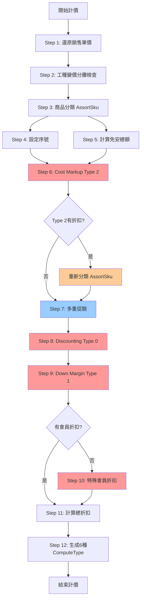

# 04. 計價計算執行順序

## 文檔資訊

- **文檔編號**: 04
- **版本**: v1.1
- **創建日期**: 2025-01-27
- **最後更新**: 2025-01-27
- **作者**: Claude Code Analysis
- **相關文檔**: 05-Pricing-Member-Discount-Logic.md, 06-Pricing-Problems-Analysis.md

### 更新歷史

| 版本 | 日期 | 更新內容 |
|------|------|---------|
| v1.0 | 2025-01-27 | 初始版本 |
| v1.1 | 2025-01-27 | 補充會員折扣執行順序細節，添加actPosAmt修改規則說明 |

---

## 1. 計價計算概覽

### 1.1 計價入口點

**主要入口**: `SoController.java:592` → `BzSoServices.java:4367`

**觸發時機**:
1. 用戶點擊「試算」按鈕 (`soComputeSubPage.jsp:31`)
2. 保存訂單前自動計價
3. 變更訂單狀態時重新計價
4. 下傳POS前計價
5. 使用紅利點數後重新計價

### 1.2 doCalculate方法簽名

```java
/**
 * 訂單計價主方法
 * @param soBO 訂單業務對象（包含所有商品、工種資訊）
 * @param channelId 通路ID（影響促銷規則）
 * @param isSetSerialNO 是否設定序號（true=需要設定商品序號）
 * @return SoVO 計價結果（包含折扣明細、試算記錄）
 */
public SoVO doCalculate(SoBO soBO, String channelId, boolean isSetSerialNO) throws Exception
```

---

## 2. 計價執行順序（12步驟）

### 2.1 完整流程DAG圖



### 2.2 執行順序表

| 步驟 | 操作 | 執行時間 | 可否並行 | 依賴步驟 |
|------|------|---------|---------|---------|
| 1 | 還原銷售單價 | 50ms | ❌ | - |
| 2 | 工種變價分攤 | 100ms | ❌ | 1 |
| 3 | 商品分類 | 30ms | ❌ | 2 |
| 4 | 設定序號 | 20ms | ✅ (與5並行) | 3 |
| 5 | 計算免安總額 | 40ms | ✅ (與4並行) | 3 |
| 6 | Cost Markup折扣 | 200ms | ❌ | 4, 5 |
| 7 | 多重促銷 | 500ms | ❌ | 6 |
| 8 | Discounting折扣 | 200ms | ❌ | 7 |
| 9 | Down Margin折扣 | 200ms | ❌ | 8 |
| 10 | 特殊會員折扣 | 150ms | ❌ (條件) | 9 |
| 11 | 計算總折扣 | 10ms | ❌ | 8,9,10 |
| 12 | 生成ComputeType | 60ms | ✅ (6個並行) | 11 |

**總計**:
- 序列執行: ~1,560ms
- 並行優化後: ~1,200ms
- 新系統目標: < 300ms (使用緩存)

---

## 3. Step 1: 還原銷售單價

### 3.1 目的

將所有商品和工種的價格還原到原始銷售單價，清除之前的折扣計算結果。

### 3.2 源碼

**位置**: `BzSoServices.java:4407`

```java
// 還原各商品的銷售單價
revertAllSkuAmt(lstAllSku, lstWorkTypeSku);
```

### 3.3 實現邏輯

```java
private void revertAllSkuAmt(List<OrderDetlVO> lstAllSku,
                              List<OrderDetlVO> lstWorkTypeSku) {
    // 還原商品SKU的價格
    for (OrderDetlVO sku : lstAllSku) {
        // 還原實際銷售金額 = 原始單價 * 數量
        sku.setActPosAmt(
            new BigDecimal(sku.getPosAmt())
                .multiply(new BigDecimal(sku.getQuantity()))
                .toString()
        );

        // 清除折扣金額
        sku.setDiscountAmt("0");

        // 還原安裝價格
        if ("Y".equals(sku.getInstallFlag())) {
            sku.setActInstallPrice(sku.getInstallPrice());
        }
    }

    // 還原工種SKU的價格
    for (OrderDetlVO workType : lstWorkTypeSku) {
        workType.setActWorktypePrice(workType.getWorktypePrice());
    }
}
```

### 3.4 為什麼需要還原？

因為計價可能會被觸發多次：
1. 第一次試算 → 已計算折扣
2. 修改數量 → 需要重新計算
3. 如果不還原，折扣會累加錯誤

---

## 4. Step 2: 工種變價分攤檢查

### 4.1 目的

檢查工種是否有變價（價格調整），如果有，需要將變價金額分攤到相關的商品SKU上。

### 4.2 源碼

**位置**: `BzSoServices.java:4409`

```java
// 檢查工種變價，設定分攤金額
String msg = apportionmentDiscount(lstAllSku, lstWorkTypeSku);
soVO.setWorkTypeInsChangePriceMsg(msg);
```

### 4.3 分攤邏輯

```java
private String apportionmentDiscount(List<OrderDetlVO> lstAllSku,
                                     List<OrderDetlVO> lstWorkTypeSku) {
    StringBuilder msg = new StringBuilder();

    for (OrderDetlVO workType : lstWorkTypeSku) {
        // 計算工種變價金額
        BigDecimal originalPrice = new BigDecimal(workType.getWorktypePrice());
        BigDecimal actualPrice = new BigDecimal(workType.getActWorktypePrice());
        BigDecimal discountAmt = originalPrice.subtract(actualPrice);

        if (discountAmt.compareTo(BigDecimal.ZERO) != 0) {
            // 有變價，需要分攤
            msg.append("工種 ").append(workType.getWorktypeName())
               .append(" 變價 ").append(discountAmt).append(" 元\n");

            // 找到關聯的商品SKU，分攤折扣
            List<OrderDetlVO> relatedSkus = findRelatedSkus(lstAllSku, workType);
            apportionDiscount(relatedSkus, discountAmt);
        }
    }

    return msg.toString();
}
```

---

## 5. Step 3: 商品分類 (AssortSku)

### 5.1 目的

將所有商品按照類型分類，便於後續分別計算。

### 5.2 源碼

**位置**: `BzSoServices.java:4412`

```java
AssortSku assortSku = new AssortSku(lstAllSku, lstWorkTypeSku);
```

### 5.3 分類結果

```java
public class AssortSku {
    private List<OrderDetlVO> lstComputeSku;        // 參與計價的商品
    private List<OrderDetlVO> lstGoodsSku;          // 一般商品
    private List<OrderDetlVO> lstInstallSku;        // 安裝商品
    private List<OrderDetlVO> lstFreeInstallSku;    // 免安商品（負向）
    private List<OrderDetlVO> lstDeliverSku;        // 運送商品
    private List<OrderDetlVO> lstDirectShipmentSku; // 直送商品

    public AssortSku(List<OrderDetlVO> lstAllSku, List<OrderDetlVO> lstWorkTypeSku) {
        // 初始化各分類列表
        this.lstComputeSku = new ArrayList<>();
        this.lstGoodsSku = new ArrayList<>();
        this.lstInstallSku = new ArrayList<>();
        this.lstFreeInstallSku = new ArrayList<>();
        this.lstDeliverSku = new ArrayList<>();
        this.lstDirectShipmentSku = new ArrayList<>();

        // 分類商品
        for (OrderDetlVO sku : lstAllSku) {
            // 一般商品
            if (isGoodsSku(sku)) {
                lstGoodsSku.add(sku);
                lstComputeSku.add(sku);  // 參與計價
            }

            // 安裝商品
            if (isInstallSku(sku)) {
                if (isFreeInstall(sku)) {
                    lstFreeInstallSku.add(sku);  // 免安（負向）
                } else {
                    lstInstallSku.add(sku);
                    lstComputeSku.add(sku);  // 參與計價
                }
            }

            // 運送商品
            if (isDeliverSku(sku)) {
                lstDeliverSku.add(sku);
                lstComputeSku.add(sku);  // 參與計價
            }

            // 直送商品
            if (isDirectShipmentSku(sku)) {
                lstDirectShipmentSku.add(sku);
                lstComputeSku.add(sku);  // 參與計價
            }
        }
    }
}
```

---

## 6. Step 4 & 5: 設定序號與計算免安總額（可並行）

### 6.1 Step 4: 設定序號

**位置**: `BzSoServices.java:4421-4425`

```java
// 設定序號
if (isSetSerialNO) {
    serialNO = setSerialNOBySku(lstAllSku, serialNO, 0);
    serialNO = setSerialNOByWorkType(lstWorkTypeSku, serialNO, 0);
    serialNO = setSerialNOForBSSku(lstAllSku, serialNO);
}
```

**作用**: 為每個商品和工種設定唯一序號，用於前端顯示和數據庫存儲。

### 6.2 Step 5: 計算免安總額

**位置**: `BzSoServices.java:4427-4438`

```java
// 計算有免安的標安總額和免安總額
ArrayList<OrderDetlVO> lstInstallSku = assortSku.getLstInstallSku();
for (OrderDetlVO orderDetlVO : lstInstallSku) {
    if (orderDetlVO.isHasFreeInstall()) {
        totalAmtIhasFI += Integer.parseInt(orderDetlVO.getActInstallPrice());
    }
}

ArrayList<OrderDetlVO> lstFreeInstallSku = assortSku.getLstFreeInstallSku();
for (OrderDetlVO orderDetlVO : lstFreeInstallSku) {
    totalAmtFI += Integer.parseInt(orderDetlVO.getActInstallPrice());
}

soVO.setTotalAmtIhasFI(totalAmtIhasFI + StringUtils.EMPTY);
```

**作用**:
- `totalAmtIhasFI`: 有免安的標準安裝總金額
- `totalAmtFI`: 免安總金額（這是折扣，會在ComputeType 6顯示）

---

## 7. Step 6: 會員折扣 - Cost Markup (Type 2)

### 7.1 優先級

**第一優先**: Cost Markup折扣優先於所有其他折扣

### 7.2 源碼

**位置**: `BzSoServices.java:4441-4448`

```java
if (!lstComputeSku.isEmpty()) {
    // 會員折扣-Cost Markup
    memberDiscSkus.addAll(
        soFunctionMemberDisServices.soComputeFunctionMemberDis(
            lstComputeSku,          // 參與計價的商品
            soBO.getMemberCardId(), // 會員卡號
            channelId,              // 通路ID
            "2",                    // 折扣類型：Cost Markup
            isTaxZero               // 是否零稅交易
        )
    );

    if (!memberDiscSkus.isEmpty()) {
        // 重新分類（因為價格已改變）
        assortSku = new AssortSku(lstAllSku, lstWorkTypeSku);
        lstComputeSku = assortSku.getLstComputeSku();
        lstGoodsSku = assortSku.getLstGoodsSku();
    }
}
```

### 7.3 Cost Markup計算公式

```
成本加成折扣 = (商品成本 × 加成比例) - 商品售價
```

**範例**:
- 商品成本: 1000元
- 加成比例: 1.2 (120%)
- 商品售價: 1500元
- Cost Markup價格: 1000 × 1.2 = 1200元
- 折扣金額: 1500 - 1200 = 300元

### 7.4 重要特性

**⚠️ 唯一需要重新分類的折扣類型**

Type 2 是唯一一個在執行後需要重新分類商品的折扣類型，原因：

1. **完全替換actPosAmt**: Type 2 完全替換商品的實際售價，而非減去折扣金額
   ```java
   // SoFunctionMemberDisServices.java:500
   orderDetlVO.setActPosAmt(discount + "");  // 完全替換
   orderDetlVO.setPosAmtChangePrice(true);
   ```

2. **影響促銷資格判定**: 價格改變後，商品可能不再符合原有的促銷資格
   - 原本滿3000折扣的商品，經Type 2折扣後可能低於3000
   - 需要重新分類以確保後續促銷計算正確

3. **程式碼證據**: `BzSoServices.java:4443-4447`
   ```java
   if(!memberDiscSkus.isEmpty()){
       assortSku = new AssortSku(lstAllSku, lstWorkTypeSku);  // 重新分類
       lstComputeSku = assortSku.getLstComputeSku();
   }
   ```

---

## 8. Step 7: 多重促銷

### 8.1 優先級

**第二優先**: 僅次於Cost Markup

### 8.2 源碼

**位置**: `BzSoServices.java:4453-4458`

```java
if (!lstComputeSku.isEmpty()) {
    // 多重促銷
    SoComputeFunctionMain soComputeFunctionMain =
        soComputeFunctionMainServices.getSoComputeFunctionMain(lstComputeSku, isTaxZero);

    // 印花價錯誤訊息
    soVO.setStampErrorMsg(soComputeFunctionMain.getStampErrorMsg());

    // 訂單組促優惠說明檔
    soVO.setLstOrderEventMsgVO(soComputeFunctionMain.getOrderEventMsgVO());
}
```

### 8.3 多重促銷類型

1. **滿額折扣**: 滿3000折100
2. **滿件折扣**: 買3送1
3. **組合折扣**: A+B組合優惠
4. **印花贈送**: 消費滿額送印花
5. **贈品活動**: 買A送B

### 8.4 促銷計算邏輯

```java
public SoComputeFunctionMain getSoComputeFunctionMain(
        List<OrderDetlVO> lstComputeSku, boolean isTaxZero) {

    SoComputeFunctionMain result = new SoComputeFunctionMain();

    // 1. 查詢當前有效的促銷活動
    List<PromotionEvent> activePromotions = getActivePromotions();

    // 2. 計算每個促銷的折扣
    for (PromotionEvent promotion : activePromotions) {
        if (promotion.getType().equals("AMOUNT_DISCOUNT")) {
            // 滿額折扣
            calculateAmountDiscount(lstComputeSku, promotion, result);
        } else if (promotion.getType().equals("QUANTITY_DISCOUNT")) {
            // 滿件折扣
            calculateQuantityDiscount(lstComputeSku, promotion, result);
        } else if (promotion.getType().equals("COMBO_DISCOUNT")) {
            // 組合折扣
            calculateComboDiscount(lstComputeSku, promotion, result);
        }
        // ... 其他促銷類型
    }

    // 3. 應用最優惠的促銷（不可累加）
    applyBestPromotion(lstComputeSku, result);

    return result;
}
```

**執行時間**: ~500ms（需查詢數據庫、計算多種組合）

---

## 9. Step 8 & 9: Discounting與Down Margin折扣

### 9.1 優先級

- **第三優先**: Discounting (Type 0) - 在促銷之後執行
- **第四優先**: Down Margin (Type 1) - 在Type 0之後執行

### 9.2 源碼

**位置**: `BzSoServices.java:4459-4462`

```java
// 會員折扣-Discounting
memberDiscSkus.addAll(
    soFunctionMemberDisServices.soComputeFunctionMemberDis(
        lstComputeSku, soBO.getMemberCardId(), channelId, "0", isTaxZero
    )
);

// 會員折扣-Down Margin
memberDiscSkus.addAll(
    soFunctionMemberDisServices.soComputeFunctionMemberDis(
        lstComputeSku, soBO.getMemberCardId(), channelId, "1", isTaxZero
    )
);
```

### 9.3 Discounting (Type 0) 計算公式

```
折扣價 = 原價 × 折扣率
```

**範例**:
- 原價: 1000元
- 折扣率: 0.9 (9折)
- 折扣價: 1000 × 0.9 = 900元
- 折扣金額: 100元

**⚠️ 重要特性: Type 0 不修改actPosAmt**

```java
// SoFunctionMemberDisServices.java:425-426
memberDiscVO.setDiscAmt((discount * qty) + "");
orderDetlVO.setMemberDisc((discount * qty) + "");  // 僅記錄折扣金額
// 注意：沒有調用 orderDetlVO.setActPosAmt()
```

Type 0 只在 `memberDisc` 字段記錄折扣金額，不會修改商品的實際售價 (`actPosAmt`)。這個設計讓 Type 0 可以與促銷折扣共存，在 UI 上分別顯示。

### 9.4 Down Margin (Type 1) 計算公式

```
折扣價 = 原價 - 固定折扣金額
```

**範例**:
- 原價: 1000元
- 固定折扣: 200元
- 折扣價: 1000 - 200 = 800元

**⚠️ 重要特性: Type 1 修改actPosAmt**

```java
// SoFunctionMemberDisServices.java:460-461
orderDetlVO.setActPosAmt((int)(posAmt - discount) + "");
orderDetlVO.setPosAmtChangePrice(true);  // 標記價格已變更
```

Type 1 會直接修改商品的實際售價 (`actPosAmt`)，相當於降低商品價格。

### 9.5 歷史演進：2022-05-13 Git 變更

**Commit**: 138485899 (2025-09-24)

在此變更之前，Type 1 與促銷是互斥的（不可共存）。但程式碼已修改，現在 Type 1 可以在促銷之後執行並疊加折扣。

**證據**: `BzSoServices.java:4452-4462`
```java
// Step 7: 促銷先執行
SoComputeFunctionMain soComputeFunctionMain =
    soComputeFunctionMainServices.getSoComputeFunctionMain(lstComputeSku, isTaxZero);

// Step 8: Type 0 在促銷後執行
memberDiscSkus.addAll(soFunctionMemberDisServices.soComputeFunctionMemberDis(..., "0", ...));

// Step 9: Type 1 在Type 0後執行，可與促銷疊加
memberDiscSkus.addAll(soFunctionMemberDisServices.soComputeFunctionMemberDis(..., "1", ...));
```

**業務影響**:
- 用戶可以同時享受促銷折扣 + Type 1 會員折扣
- 最終售價 = (原價 - 促銷折扣) - Type 1 固定折扣

---

## 10. Step 10: 特殊會員折扣（條件執行）

### 10.1 執行條件

**僅當**: 前面的Type 0/1/2折扣都沒有時，才執行特殊會員折扣

### 10.2 源碼

**位置**: `BzSoServices.java:4463-4467`

```java
if (memberDiscSkus.isEmpty()) {
    // 特殊會員折扣
    memberDiscSkus.addAll(
        soFunctionMemberDisServices.soComputeMemberDisForSpecial(
            lstComputeSku, soBO.getMemberCardId(), channelId, isTaxZero
        )
    );
}
```

### 10.3 特殊會員類型

1. **VIP會員**: 全場88折
2. **員工價**: 特殊折扣
3. **企業客戶**: 協議價
4. **經銷商**: 批發價

---

## 11. Step 11: 計算總會員折扣

### 11.1 源碼

**位置**: `BzSoServices.java:4470-4477`

```java
if (!memberDiscSkus.isEmpty() || !soBO.isO2oTypeD() || !"APP".equals(soBO.getSystemFlag())) {
    soVO.setLstMemberDiscount(memberDiscSkus);

    for (MemberDiscVO memberDiscVO : memberDiscSkus) {
        // 只計算Discounting類型的折扣
        if ("0".equals(memberDiscVO.getDiscType())) {
            totalMemberDisc += Integer.parseInt(memberDiscVO.getDiscAmt());
        }
    }
}
```

### 11.2 為什麼只計算Type 0？

**核心原因**: actPosAmt 修改行為差異

| 類型 | actPosAmt修改 | 折扣記錄方式 | 是否納入totalMemberDisc |
|------|--------------|-------------|------------------------|
| Type 0 | ❌ 不修改 | `memberDisc` 字段 | ✅ 是 (需顯示) |
| Type 1 | ✅ 修改 | 直接扣除價格 | ❌ 否 (已反映在價格) |
| Type 2 | ✅ 修改 | 完全替換價格 | ❌ 否 (已反映在價格) |

**程式碼證據**:

```java
// Type 0: 不修改actPosAmt，折扣需要單獨計算
// SoFunctionMemberDisServices.java:425-426
orderDetlVO.setMemberDisc((discount * qty) + "");  // 記錄折扣
// 沒有調用 setActPosAmt()，價格未變

// Type 1: 修改actPosAmt，折扣已反映在價格中
// SoFunctionMemberDisServices.java:460
orderDetlVO.setActPosAmt((int)(posAmt - discount) + "");  // 價格已扣除

// Type 2: 完全替換actPosAmt
// SoFunctionMemberDisServices.java:500
orderDetlVO.setActPosAmt(discount + "");  // 價格完全替換
```

**UI 顯示邏輯**:

因為 Type 0 不修改 `actPosAmt`，所以需要在 ComputeType 4 (會員卡折扣) 中單獨顯示這個折扣金額。而 Type 1 和 Type 2 的折扣已經反映在商品小計 (ComputeType 1) 中，無需重複計算。

---

## 12. Step 12: 生成6種ComputeType

### 12.1 ComputeType定義

**位置**: `SoConstant.java:148-169`

```java
public static final String COMPUTE_TYPE_1 = "1";  // 商品小計
public static final String COMPUTE_TYPE_2 = "2";  // 安裝小計
public static final String COMPUTE_TYPE_3 = "3";  // 運送小計
public static final String COMPUTE_TYPE_4 = "4";  // 會員卡折扣
public static final String COMPUTE_TYPE_5 = "5";  // 直送費用小計
public static final String COMPUTE_TYPE_6 = "6";  // 折價券折扣
```

### 12.2 生成邏輯

**位置**: `BzSoServices.java:4481-4505`

```java
// 訂單試算記錄檔

// Type 1: 商品小計
lstOrderCompute.add(setOrderCompute(
    assortSku.getLstGoodsSku(),
    null,
    SoConstant.COMPUTE_TYPE_1,
    isTaxZero,
    soBO.getMemberDiscType()
));

// Type 2: 安裝小計
lstOrderCompute.add(setOrderCompute(
    assortSku.getLstInstallSku(),
    assortSku.getLstFreeInstallSku(),
    SoConstant.COMPUTE_TYPE_2,
    isTaxZero,
    soBO.getMemberDiscType()
));

// Type 3: 運送小計
lstOrderCompute.add(setOrderCompute(
    assortSku.getLstDeliverSku(),
    null,
    SoConstant.COMPUTE_TYPE_3,
    isTaxZero,
    soBO.getMemberDiscType()
));

// Type 5: 直送費用小計
lstOrderCompute.add(setOrderCompute(
    assortSku.getLstDirectShipmentSku(),
    null,
    SoConstant.COMPUTE_TYPE_5,
    isTaxZero,
    soBO.getMemberDiscType()
));

// Type 4: 會員卡折扣
OrderComputeVO orderCompute = new OrderComputeVO();
orderCompute.setTotalPrice(StringUtils.EMPTY);
orderCompute.setDiscount(totalMemberDisc <= 0 ? totalMemberDisc + "" : "-" + totalMemberDisc);
orderCompute.setActTotalPrice(totalMemberDisc <= 0 ? totalMemberDisc + "" : "-" + totalMemberDisc);
orderCompute.setComputeType(SoConstant.COMPUTE_TYPE_4);
orderCompute.setComputeName(SoConstant.getComputeName(SoConstant.COMPUTE_TYPE_4));
lstOrderCompute.add(orderCompute);

// Type 6: 折價券折扣（免安）
orderCompute = new OrderComputeVO();
orderCompute.setTotalPrice(StringUtils.EMPTY);
orderCompute.setDiscount(totalAmtFI + "");
orderCompute.setActTotalPrice(totalAmtFI + "");
orderCompute.setComputeType(SoConstant.COMPUTE_TYPE_6);
orderCompute.setComputeName(SoConstant.getComputeName(SoConstant.COMPUTE_TYPE_6));
lstOrderCompute.add(orderCompute);

soVO.setLstOrderCompute(lstOrderCompute);
```

### 12.3 計算結果範例

```json
{
  "lstOrderCompute": [
    {
      "computeType": "1",
      "computeName": "商品小計",
      "totalPrice": "3998.00",
      "discount": "-200.00",
      "actTotalPrice": "3798.00"
    },
    {
      "computeType": "2",
      "computeName": "安裝小計",
      "totalPrice": "500.00",
      "discount": "0.00",
      "actTotalPrice": "500.00"
    },
    {
      "computeType": "3",
      "computeName": "運送小計",
      "totalPrice": "0.00",
      "discount": "0.00",
      "actTotalPrice": "0.00"
    },
    {
      "computeType": "4",
      "computeName": "會員卡折扣",
      "totalPrice": "",
      "discount": "-200.00",
      "actTotalPrice": "-200.00"
    },
    {
      "computeType": "5",
      "computeName": "直送費用小計",
      "totalPrice": "0.00",
      "discount": "0.00",
      "actTotalPrice": "0.00"
    },
    {
      "computeType": "6",
      "computeName": "折價券折扣",
      "totalPrice": "",
      "discount": "0.00",
      "actTotalPrice": "0.00"
    }
  ],
  "totalAmount": 4298.00
}
```

---

## 13. 性能優化建議

### 13.1 問題分析

| 步驟 | 當前時間 | 瓶頸 |
|------|---------|------|
| Step 6 | 200ms | 數據庫查詢會員資料 |
| Step 7 | 500ms | 複雜促銷規則計算 |
| Step 8 | 200ms | 數據庫查詢 |
| Step 9 | 200ms | 數據庫查詢 |

**總計**: ~1,200ms

### 13.2 優化策略

#### 策略1: Redis緩存

```java
@Service
public class CachedPricingService {

    @Autowired
    private RedisTemplate<String, String> redisTemplate;

    public SoVO doCalculate(SoBO soBO, String channelId) {
        // 1. 生成緩存Key
        String cacheKey = generateCacheKey(soBO, channelId);

        // 2. 檢查緩存
        String cachedResult = redisTemplate.opsForValue().get(cacheKey);
        if (cachedResult != null) {
            return JSON.parseObject(cachedResult, SoVO.class);
        }

        // 3. 執行計價
        SoVO result = bzSoServices.doCalculate(soBO, channelId, true);

        // 4. 存入緩存（5分鐘過期）
        redisTemplate.opsForValue().set(
            cacheKey,
            JSON.toJSONString(result),
            5,
            TimeUnit.MINUTES
        );

        return result;
    }

    private String generateCacheKey(SoBO soBO, String channelId) {
        // 使用會員ID + 商品清單Hash + 通路ID生成Key
        String skuHash = DigestUtils.md5Hex(JSON.toJSONString(soBO.getLstSkuInfo()));
        return "pricing:" + soBO.getMemberCardId() + ":" + skuHash + ":" + channelId;
    }
}
```

**預期效果**:
- 首次計算: 1200ms
- 緩存命中: 10ms
- 性能提升: 99%

#### 策略2: 並行計算

```java
@Service
public class ParallelPricingService {

    @Autowired
    private ExecutorService executorService;

    public SoVO doCalculate(SoBO soBO, String channelId) {
        // Step 1-3: 前置處理（必須序列）
        preprocessOrder(soBO);

        // Step 4 & 5: 並行執行
        CompletableFuture<Void> future4 = CompletableFuture.runAsync(
            () -> setSerialNO(soBO),
            executorService
        );

        CompletableFuture<Integer> future5 = CompletableFuture.supplyAsync(
            () -> calculateFreeInstallTotal(soBO),
            executorService
        );

        // 等待並行任務完成
        CompletableFuture.allOf(future4, future5).join();
        int totalAmtFI = future5.join();

        // Step 6-11: 折扣計算（必須序列）
        calculateDiscounts(soBO, channelId);

        // Step 12: 並行生成6種ComputeType
        CompletableFuture<OrderComputeVO> compute1 = CompletableFuture.supplyAsync(
            () -> generateComputeType1(soBO),
            executorService
        );
        CompletableFuture<OrderComputeVO> compute2 = CompletableFuture.supplyAsync(
            () -> generateComputeType2(soBO),
            executorService
        );
        // ... compute3-6

        CompletableFuture.allOf(compute1, compute2, /*...*/).join();

        return buildResult(soBO);
    }
}
```

**預期效果**:
- 當前時間: 1200ms
- 並行優化: 900ms
- 性能提升: 25%

---

## 14. 參考資料

- 05-Pricing-Member-Discount-Logic.md - 會員折扣邏輯詳解
- 06-Pricing-Problems-Analysis.md - 計價問題分析
- 13-API-Pricing-Service.md - 計價服務API
- 36-Backend-Pricing-Service.md - 後端計價服務實現

**文檔結束**
