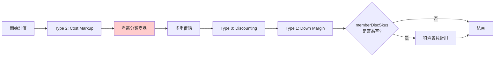
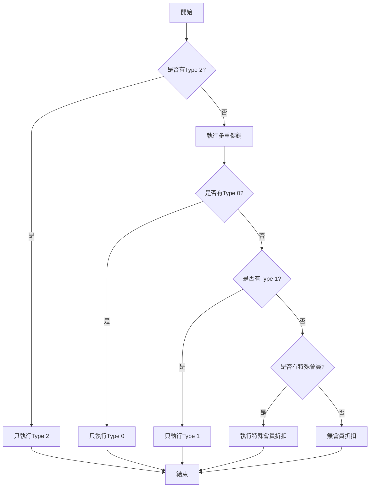

# 05. 會員折扣邏輯詳解

## 文檔資訊

- **文檔編號**: 05
- **版本**: v1.0
- **創建日期**: 2025-01-27
- **作者**: Claude Code Analysis
- **相關文檔**: 04-Pricing-Calculation-Sequence.md, 15-API-Member-Service.md

---

## 1. 會員折扣類型概覽

### 1.1 三種主要折扣類型

| 類型ID | 類型名稱 | 常數名稱 | 計算方式 | 優先級 |
|--------|---------|----------|---------|-------|
| 2 | Cost Markup | MEMBER_DISCOUNT_TYPE_2 | 成本加成 | **第1優先** |
| 0 | Discounting | MEMBER_DISCOUNT_TYPE_0 | 折扣率 | 第3優先 |
| 1 | Down Margin | MEMBER_DISCOUNT_TYPE_1 | 固定折扣金額 | 第4優先 |

**位置**: `SoConstant.java:187-197`

```java
/**
 * 會員折扣類型 - Discounting
 */
public static final String MEMBER_DISCOUNT_TYPE_0 = "0";

/**
 * 會員折扣類型 - Down Margin
 */
public static final String MEMBER_DISCOUNT_TYPE_1 = "1";

/**
 * 會員折扣類型 - Cost Markup
 */
public static final String MEMBER_DISCOUNT_TYPE_2 = "2";
```

### 1.2 折扣執行順序

**✅ 程式碼追蹤確認** (2025-10-27 trace-springmvc-jsp-legacy-logic)



**執行順序證據**:
- **位置**: `BzSoServices.java:4441-4466` (doCalculate 方法)
- **Git Commit**: 138485899 (2025-09-24)
- **順序不可變更**: 順序硬編碼，不可調整

**關鍵特性**:
1. ✅ Type 2 執行後**必須重新分類商品** (Line 4443-4447)
2. ✅ Type 0 和 Type 1 **連續執行** (Line 4459-4462)
3. ✅ 特殊會員折扣**只在無任何折扣時**執行 (Line 4463)

---

### 1.3 actPosAmt 修改規則 ⚠️ **關鍵差異**

| 折扣類型 | 是否修改 actPosAmt | 修改方式 | 標記變價 | 影響後續計算 |
|---------|-------------------|---------|---------|------------|
| **Type 2** | ✅ **是** | **完全替換** | `posAmtChangePrice=true` | ✅ 促銷基於新價格 |
| 促銷引擎 | ✅ 是 | 扣減 | `discountAmt` | ✅ 會員折扣基於折後價 |
| **Type 0** | ❌ **否** | **不修改** (只記錄) | `memberDisc` | ❌ Type 1 基於相同價格 |
| **Type 1** | ✅ 是 | 扣減 | `posAmtChangePrice=true` | ✅ 最終價格 |

**程式碼證據**:
```java
// Type 0: 不修改 actPosAmt (SoFunctionMemberDisServices.java:405-437)
memberDiscVO.setDiscAmt((discount * qty) + "");
orderDetlVO.setMemberDisc((discount * qty) + "");  // ❌ 只記錄，不修改 actPosAmt

// Type 1: 直接修改 actPosAmt (SoFunctionMemberDisServices.java:440-471)
orderDetlVO.setActPosAmt((int)(posAmt - discount) + "");  // ✅ 直接扣減
orderDetlVO.setPosAmtChangePrice(true);  // 標記已變價

// Type 2: 完全替換 actPosAmt (SoFunctionMemberDisServices.java:474-511)
orderDetlVO.setActPosAmt(discount + "");  // ✅ 替換為成本加成價
orderDetlVO.setPosAmtChangePrice(true);
```

**為什麼 Type 0 不修改 actPosAmt?**
- Type 0 折扣金額單獨記錄到 `TBL_ORDER_DISCOUNT.MEMBER_AVG`
- 與 Type 1/2 的折扣分開計算
- 避免重複折扣問題

---

## 2. Type 2: Cost Markup（成本加成）

### 2.1 計算公式

**基本公式**:
```
加成價 = 商品成本 × (1 + 加成比例)
折扣金額 = 原價 - 加成價
```

**營業稅處理** (應稅商品且非零稅交易):
```
加成價 = 商品成本 × (1 + 加成比例)
含稅加成價 = FLOOR(加成價 × 1.05)  // 無條件捨去
折扣金額 = 原價 - 含稅加成價
```

**程式碼證據** (`SoFunctionMemberDisServices.java:474-511`):
```java
// 用成本價計算加成價
int discount = (int)Math.ceil(unitCost * (1 + discPer));

// 非零稅交易、商品為應稅，需加上營業稅
if (!taxZero && "1".equals(orderDetlVO.getTaxType())) {
    // 2020-05-07 改為無條件捨去
    // 58 * 1.05 = 60.9, 無條件捨去為60
    discount = new BigDecimal((double)discount * salesTax)
        .setScale(0, BigDecimal.ROUND_FLOOR)
        .intValue();
}
```

**關鍵點**:
- ✅ 使用**無條件捨去** (ROUND_FLOOR)，而非四捨五入
- ✅ 只有**應稅商品** (TAX_TYPE='1') 才加稅
- ✅ **零稅交易**不加營業稅 (統編訂單)

### 2.2 業務場景

**適用對象**: VIP會員、特約客戶、內部員工

**業務邏輯**:
- 商家從成本價加成一定比例作為會員優惠價
- 不同會員等級有不同的加成比例
- 此折扣優先於所有其他折扣

### 2.3 源碼實現

**位置**: `BzSoServices.java:4441-4448`

```java
// 會員折扣-Cost Markup
memberDiscSkus.addAll(
    soFunctionMemberDisServices.soComputeFunctionMemberDis(
        lstComputeSku,          // 參與計價的商品
        soBO.getMemberCardId(), // 會員卡號
        channelId,              // 通路ID
        "2",                    // 折扣類型：Cost Markup
        isTaxZero               // 是否零稅交易
    )
);

// ⚠️ 關鍵: Type 2 執行後必須重新分類商品
if(!memberDiscSkus.isEmpty()){
    assortSku = new AssortSku(lstAllSku, lstWorkTypeSku);
    lstComputeSku = assortSku.getLstComputeSku();
    lstGoodsSku = assortSku.getLstGoodsSku();
}
```

**為什麼需要重新分類?**
- Type 2 **完全替換 actPosAmt** (從成本價計算)
- 商品價格變更可能影響分類邏輯
- 確保促銷引擎使用正確的商品清單
- **其他折扣類型不需要重新分類** (Type 0 不修改價格，Type 1 在促銷後)

**服務方法**: `SoFunctionMemberDisServices.java`

```java
public List<MemberDiscVO> soComputeFunctionMemberDis(
        List<OrderDetlVO> lstComputeSku,
        String memberCardId,
        String channelId,
        String discType,  // "2" = Cost Markup
        boolean isTaxZero) {

    List<MemberDiscVO> result = new ArrayList<>();

    // 1. 查詢會員資料
    MemberInfo member = getMemberInfo(memberCardId);
    if (member == null || !discType.equals(member.getDiscType())) {
        return result;  // 會員折扣類型不匹配
    }

    // 2. 查詢會員加成比例
    BigDecimal markupRate = member.getMarkupRate();  // 例如: 1.2 (成本加成120%)

    // 3. 計算每個商品的Cost Markup折扣
    for (OrderDetlVO sku : lstComputeSku) {
        // 3.1 查詢商品成本
        BigDecimal costPrice = getSkuCost(sku.getSkuNo());

        // 3.2 計算Cost Markup價格
        BigDecimal markupPrice = costPrice.multiply(markupRate);

        // 3.3 計算折扣金額
        BigDecimal originalPrice = new BigDecimal(sku.getActPosAmt());
        BigDecimal discountAmt = originalPrice.subtract(markupPrice);

        if (discountAmt.compareTo(BigDecimal.ZERO) > 0) {
            // 3.4 有折扣，更新商品價格
            sku.setActPosAmt(markupPrice.toString());
            sku.setDiscountAmt(discountAmt.toString());

            // 3.5 記錄折扣明細
            MemberDiscVO disc = new MemberDiscVO();
            disc.setSkuNo(sku.getSkuNo());
            disc.setDiscType("2");
            disc.setDiscTypeName("Cost Markup");
            disc.setOriginalPrice(originalPrice.toString());
            disc.setDiscountPrice(markupPrice.toString());
            disc.setDiscAmt(discountAmt.toString());
            disc.setMarkupRate(markupRate.toString());
            result.add(disc);
        }
    }

    return result;
}
```

### 2.4 計算範例

**情境**: VIP會員購買商品

| 項目 | 金額 |
|------|------|
| 商品原價 | 1,500元 |
| 商品成本 | 1,000元 |
| 會員加成比例 | 1.2 (120%) |
| Cost Markup價格 | 1,000 × 1.2 = **1,200元** |
| 折扣金額 | 1,500 - 1,200 = **300元** |

**會員實付**: 1,200元

---

## 3. Type 0: Discounting（折扣率）

### 3.1 計算公式

**完整公式** (考慮紅利點數和組促分攤):
```
實際單價 = actPosAmt + (紅利點數總額 / 數量) + (組促分攤 / 數量)
折扣金額 = CEIL(實際單價 × 折扣率) × 數量
```

**程式碼證據** (`SoFunctionMemberDisServices.java:405-437`):
```java
// 取得實際售價 (可能已被 Type 2 修改)
double price = Double.parseDouble(orderDetlVO.getActPosAmt());

// 取得促銷折扣金額
double discountAmt = Double.parseDouble(orderDetlVO.getDiscountAmt());

// 折扣總金額 = 無條件進位((實際售價 + 紅利 + 組促分攤) × 折扣%)
int totalPrice = (int)Math.ceil(
    price
    + (Double.parseDouble(orderDetlVO.getBonusTotal()) / qty)
    + (discountAmt / qty)
);
int discount = (int)Math.ceil(totalPrice * discPer);
```

**關鍵特性**:
- ✅ 基於**促銷後價格** (actPosAmt 已扣除促銷折扣)
- ✅ 考慮**紅利點數**分攤
- ✅ 考慮**組促折扣**分攤
- ✅ 使用**無條件進位** (Math.ceil)
- ❌ **不修改 actPosAmt** (只記錄折扣金額)

### 3.2 業務場景

**適用對象**: 一般會員、金卡會員、白金卡會員

**業務邏輯**:
- 商品按照折扣率打折
- 不同會員等級有不同折扣率
- 此折扣在促銷之後執行

### 3.3 源碼實現

**位置**: `BzSoServices.java:4459-4462`

```java
// 會員折扣-Discounting
memberDiscSkus.addAll(
    soFunctionMemberDisServices.soComputeFunctionMemberDis(
        lstComputeSku,
        soBO.getMemberCardId(),
        channelId,
        "0",  // 折扣類型：Discounting
        isTaxZero
    )
);
```

**服務方法**:

```java
public List<MemberDiscVO> soComputeFunctionMemberDis(
        List<OrderDetlVO> lstComputeSku,
        String memberCardId,
        String channelId,
        String discType,  // "0" = Discounting
        boolean isTaxZero) {

    List<MemberDiscVO> result = new ArrayList<>();

    // 1. 查詢會員資料
    MemberInfo member = getMemberInfo(memberCardId);
    if (member == null || !discType.equals(member.getDiscType())) {
        return result;
    }

    // 2. 查詢會員折扣率
    BigDecimal discountRate = member.getDiscountRate();  // 例如: 0.9 (打9折)

    // 3. 計算每個商品的Discounting折扣
    for (OrderDetlVO sku : lstComputeSku) {
        BigDecimal originalPrice = new BigDecimal(sku.getActPosAmt());

        // 3.1 計算折扣價
        BigDecimal discountPrice = originalPrice.multiply(discountRate);

        // 3.2 計算折扣金額
        BigDecimal discountAmt = originalPrice.subtract(discountPrice);

        if (discountAmt.compareTo(BigDecimal.ZERO) > 0) {
            // 3.3 更新商品價格
            sku.setActPosAmt(discountPrice.toString());
            sku.setDiscountAmt(discountAmt.toString());

            // 3.4 記錄折扣明細
            MemberDiscVO disc = new MemberDiscVO();
            disc.setSkuNo(sku.getSkuNo());
            disc.setDiscType("0");
            disc.setDiscTypeName("Discounting");
            disc.setOriginalPrice(originalPrice.toString());
            disc.setDiscountPrice(discountPrice.toString());
            disc.setDiscAmt(discountAmt.toString());
            disc.setDiscRate(discountRate.multiply(new BigDecimal(100)).toString());  // 轉為百分比
            result.add(disc);
        }
    }

    return result;
}
```

### 3.4 計算範例

**情境1**: 金卡會員（9折）

| 項目 | 金額 |
|------|------|
| 商品原價 | 1,000元 |
| 折扣率 | 0.9 (9折) |
| 折扣價 | 1,000 × 0.9 = **900元** |
| 折扣金額 | 1,000 - 900 = **100元** |

**情境2**: 白金卡會員（85折）

| 項目 | 金額 |
|------|------|
| 商品原價 | 1,000元 |
| 折扣率 | 0.85 (85折) |
| 折扣價 | 1,000 × 0.85 = **850元** |
| 折扣金額 | 1,000 - 850 = **150元** |

---

## 4. Type 1: Down Margin（固定折扣）

### 4.1 計算公式

**完整公式** (2022-05-13 變更，支持與促銷疊加):
```
折扣金額 = CEIL((actPosAmt + FLOOR(組促分攤)) × 折扣率)
折扣價 = actPosAmt - 折扣金額
```

**程式碼證據** (`SoFunctionMemberDisServices.java:440-471`):
```java
int qty = Integer.parseInt(orderDetlVO.getQuantity());
double discPer = Double.parseDouble(memberDiscVO.getDiscPer()) / 100;
double discountAmt = Double.parseDouble(orderDetlVO.getDiscountAmt());

// 取得實際售價 (可能已被 Type 2 修改，已被促銷折扣)
double posAmt = Double.parseDouble(orderDetlVO.getActPosAmt());

// 折扣金額 = 無條件進位((實際售價 + floor(組促分攤)) × 折扣%)
int discount = (int)Math.ceil(
    (posAmt + Math.floor(discountAmt / qty)) * discPer
);

// ✅ 直接修改 actPosAmt
orderDetlVO.setActPosAmt((int)(posAmt - discount) + "");
orderDetlVO.setTotalPrice(((int)(posAmt - discount) * qty) + "");
orderDetlVO.setPosAmtChangePrice(true);  // 標記已變價
```

**關鍵特性** (Git Commit 9aea140fe, 2022-05-13):
- ✅ 基於**促銷後價格** (actPosAmt)
- ✅ 考慮**組促分攤** (使用 `Math.floor` 取整)
- ✅ **可與促銷疊加** (原本互斥，2022 年變更)
- ✅ 使用**無條件進位** (Math.ceil)
- ✅ **直接修改 actPosAmt** (變價)

### 4.2 業務場景

**適用對象**: 企業客戶、經銷商、批發商

**業務邏輯**:
- 每個商品有固定的折扣金額
- 不論原價多少，折扣金額固定
- 適合長期合作的B2B客戶

### 4.3 源碼實現

**位置**: `BzSoServices.java:4461-4463`

```java
// 會員折扣-Down Margin
memberDiscSkus.addAll(
    soFunctionMemberDisServices.soComputeFunctionMemberDis(
        lstComputeSku,
        soBO.getMemberCardId(),
        channelId,
        "1",  // 折扣類型：Down Margin
        isTaxZero
    )
);
```

**服務方法**:

```java
public List<MemberDiscVO> soComputeFunctionMemberDis(
        List<OrderDetlVO> lstComputeSku,
        String memberCardId,
        String channelId,
        String discType,  // "1" = Down Margin
        boolean isTaxZero) {

    List<MemberDiscVO> result = new ArrayList<>();

    // 1. 查詢會員資料
    MemberInfo member = getMemberInfo(memberCardId);
    if (member == null || !discType.equals(member.getDiscType())) {
        return result;
    }

    // 2. 計算每個商品的Down Margin折扣
    for (OrderDetlVO sku : lstComputeSku) {
        // 2.1 查詢此商品對應會員的固定折扣金額
        BigDecimal fixedDiscount = getDownMarginAmount(
            memberCardId,
            sku.getSkuNo(),
            channelId
        );

        if (fixedDiscount == null || fixedDiscount.compareTo(BigDecimal.ZERO) <= 0) {
            continue;  // 無折扣
        }

        BigDecimal originalPrice = new BigDecimal(sku.getActPosAmt());

        // 2.2 計算折扣價
        BigDecimal discountPrice = originalPrice.subtract(fixedDiscount);

        // 2.3 防止負數價格
        if (discountPrice.compareTo(BigDecimal.ZERO) < 0) {
            discountPrice = BigDecimal.ZERO;
        }

        // 2.4 計算實際折扣金額
        BigDecimal actualDiscount = originalPrice.subtract(discountPrice);

        if (actualDiscount.compareTo(BigDecimal.ZERO) > 0) {
            // 2.5 更新商品價格
            sku.setActPosAmt(discountPrice.toString());
            sku.setDiscountAmt(actualDiscount.toString());

            // 2.6 記錄折扣明細
            MemberDiscVO disc = new MemberDiscVO();
            disc.setSkuNo(sku.getSkuNo());
            disc.setDiscType("1");
            disc.setDiscTypeName("Down Margin");
            disc.setOriginalPrice(originalPrice.toString());
            disc.setDiscountPrice(discountPrice.toString());
            disc.setDiscAmt(actualDiscount.toString());
            result.add(disc);
        }
    }

    return result;
}
```

### 4.4 計算範例

**情境**: 企業客戶（每個商品固定折200元）

| 項目 | 商品A | 商品B |
|------|-------|-------|
| 原價 | 1,000元 | 2,000元 |
| 固定折扣 | 200元 | 200元 |
| 折扣價 | **800元** | **1,800元** |
| 折扣金額 | 200元 | 200元 |

---

## 5. 特殊會員折扣

### 5.1 執行條件

**僅當**: Type 0/1/2都沒有折扣結果時，才執行特殊會員折扣

### 5.2 源碼

**位置**: `BzSoServices.java:4463-4467`

```java
if (memberDiscSkus.isEmpty()) {
    // 特殊會員折扣
    memberDiscSkus.addAll(
        soFunctionMemberDisServices.soComputeMemberDisForSpecial(
            lstComputeSku,
            soBO.getMemberCardId(),
            channelId,
            isTaxZero
        )
    );
}
```

### 5.3 特殊會員類型

#### 類型1: VIP會員（全場折扣）

```java
public List<MemberDiscVO> soComputeMemberDisForSpecial(
        List<OrderDetlVO> lstComputeSku,
        String memberCardId,
        String channelId,
        boolean isTaxZero) {

    List<MemberDiscVO> result = new ArrayList<>();

    // 1. 查詢會員資料
    MemberInfo member = getMemberInfo(memberCardId);
    if (member == null) {
        return result;
    }

    // 2. 檢查是否為VIP會員
    if ("VIP".equals(member.getMemberLevel())) {
        BigDecimal vipDiscountRate = new BigDecimal("0.88");  // VIP全場88折

        for (OrderDetlVO sku : lstComputeSku) {
            BigDecimal originalPrice = new BigDecimal(sku.getActPosAmt());
            BigDecimal discountPrice = originalPrice.multiply(vipDiscountRate);
            BigDecimal discountAmt = originalPrice.subtract(discountPrice);

            if (discountAmt.compareTo(BigDecimal.ZERO) > 0) {
                sku.setActPosAmt(discountPrice.toString());
                sku.setDiscountAmt(discountAmt.toString());

                MemberDiscVO disc = new MemberDiscVO();
                disc.setSkuNo(sku.getSkuNo());
                disc.setDiscType("SPECIAL");
                disc.setDiscTypeName("VIP全場88折");
                disc.setDiscAmt(discountAmt.toString());
                result.add(disc);
            }
        }
    }

    // 3. 檢查是否為員工價
    if ("EMPLOYEE".equals(member.getMemberType())) {
        // 員工價邏輯
        applyEmployeeDiscount(lstComputeSku, member, result);
    }

    // 4. 檢查是否為經銷商
    if ("DEALER".equals(member.getMemberType())) {
        // 經銷商批發價邏輯
        applyDealerPrice(lstComputeSku, member, result);
    }

    return result;
}
```

#### 類型2: 員工價

```java
private void applyEmployeeDiscount(
        List<OrderDetlVO> lstComputeSku,
        MemberInfo member,
        List<MemberDiscVO> result) {

    for (OrderDetlVO sku : lstComputeSku) {
        // 員工價 = 商品成本 + 10元
        BigDecimal costPrice = getSkuCost(sku.getSkuNo());
        BigDecimal employeePrice = costPrice.add(new BigDecimal("10"));

        BigDecimal originalPrice = new BigDecimal(sku.getActPosAmt());
        BigDecimal discountAmt = originalPrice.subtract(employeePrice);

        if (discountAmt.compareTo(BigDecimal.ZERO) > 0) {
            sku.setActPosAmt(employeePrice.toString());

            MemberDiscVO disc = new MemberDiscVO();
            disc.setSkuNo(sku.getSkuNo());
            disc.setDiscType("SPECIAL");
            disc.setDiscTypeName("員工價");
            disc.setDiscAmt(discountAmt.toString());
            result.add(disc);
        }
    }
}
```

---

## 6. 折扣優先級與互斥規則

### 6.1 優先級表 (✅ 程式碼追蹤確認)

| 優先級 | 折扣類型 | 執行時機 | 修改 actPosAmt | 是否互斥 | 程式碼位置 |
|-------|---------|---------|---------------|---------|-----------|
| **1** | **Type 2** (Cost Markup) | **促銷前** | ✅ **替換** | 與其他會員折扣互斥 | Line 4441-4448 |
| **1.5** | **重新分類** | Type 2 後 | N/A | - | Line 4443-4447 |
| **2** | **促銷引擎** (Event A-H) | Type 2 後 | ✅ 扣減 | 與其他促銷互斥 | Line 4452-4458 |
| **3** | **Type 0** (Discounting) | 促銷後 | ❌ **不修改** | 與其他會員折扣互斥 | Line 4459-4460 |
| **4** | **Type 1** (Down Margin) | Type 0 後 | ✅ 扣減 | 與其他會員折扣互斥 | Line 4461-4462 |
| **5** | **特殊會員折扣** | Type 0/1 都無 | ✅ 依邏輯 | 條件執行 | Line 4463-4466 |

**執行順序不可變更**: 硬編碼在 `BzSoServices.java:doCalculate()` 方法中。

### 6.2 互斥規則



### 6.3 規則說明

1. **同一會員只有一種折扣類型**: Type 0/1/2/Special 只會選一種
2. **Cost Markup 優先**: 如果會員是 Type 2，不會執行 Type 0/1
3. **促銷與會員折扣可疊加**: 促銷在 Type 2 之後，Type 0/1 之前
4. **特殊會員是兜底**: 只有沒有任何會員折扣時才執行

---

### 6.4 執行順序的重要性 ⚠️

**為什麼順序不能錯?**

**範例**: 商品原價 1000 元，促銷折扣 200 元，Type 0 折扣率 5%

**正確順序** (促銷 → Type 0):
```
1. 促銷後: 1000 - 200 = 800 元
2. Type 0: 800 × 5% = 40 元
3. 最終: 760 元
```

**錯誤順序** (Type 0 → 促銷):
```
1. Type 0: 1000 × 5% = 50 元
2. 促銷後: (1000 - 50) - 200 = 750 元
3. 最終: 750 元  ❌ 少了 10 元優惠
```

**影響**:
- 順序錯誤 → 折扣金額不一致
- 會員權益受損
- 財務報表不準確

**新系統實作要求**:
- ✅ 必須嚴格按照順序執行
- ✅ 使用單元測試驗證順序正確性
- ✅ 建立測試案例比對新舊系統計價結果

---

## 7. 會員折扣資料來源

### 7.1 CRM系統整合

**WSDL位置**: `http://crmjbtst.testritegroup.com/RFEP/service/MemberWebService?wsdl`

```java
@Service
public class CrmMemberService {

    @Autowired
    private MemberWebServiceClient crmWebService;

    /**
     * 查詢會員資訊（含折扣類型）
     */
    public MemberInfo getMemberInfo(String memberCardId) {
        try {
            // 1. 調用CRM API
            GetMemberInfoRequest request = new GetMemberInfoRequest();
            request.setMemberCardId(memberCardId);

            GetMemberInfoResponse response = crmWebService.getMemberInfo(request);

            // 2. 解析返回結果
            if ("Y".equals(response.getStatus())) {
                MemberInfo member = new MemberInfo();
                member.setMemberCardId(response.getMemberCardId());
                member.setMemberName(response.getMemberName());
                member.setMemberLevel(response.getMemberLevel());  // VIP, GOLD, SILVER
                member.setDiscType(response.getDiscType());  // "0", "1", "2"

                // Type 0: Discounting - 折扣率
                if ("0".equals(response.getDiscType())) {
                    member.setDiscountRate(response.getDiscountRate());
                }

                // Type 2: Cost Markup - 加成比例
                if ("2".equals(response.getDiscType())) {
                    member.setMarkupRate(response.getMarkupRate());
                }

                return member;
            }

            return null;

        } catch (Exception e) {
            logger.error("查詢會員資訊失敗", e);
            return null;
        }
    }

    /**
     * 查詢Down Margin折扣金額
     */
    public BigDecimal getDownMarginAmount(String memberCardId, String skuNo, String channelId) {
        try {
            GetDownMarginRequest request = new GetDownMarginRequest();
            request.setMemberCardId(memberCardId);
            request.setSkuNo(skuNo);
            request.setChannelId(channelId);

            GetDownMarginResponse response = crmWebService.getDownMargin(request);

            if ("Y".equals(response.getStatus())) {
                return new BigDecimal(response.getDiscountAmount());
            }

            return BigDecimal.ZERO;

        } catch (Exception e) {
            logger.error("查詢Down Margin失敗", e);
            return BigDecimal.ZERO;
        }
    }
}
```

### 7.2 本地緩存策略

```java
@Service
public class CachedMemberService {

    @Autowired
    private RedisTemplate<String, String> redisTemplate;

    @Autowired
    private CrmMemberService crmMemberService;

    public MemberInfo getMemberInfo(String memberCardId) {
        // 1. 檢查Redis緩存
        String cacheKey = "member:info:" + memberCardId;
        String cachedData = redisTemplate.opsForValue().get(cacheKey);

        if (cachedData != null) {
            return JSON.parseObject(cachedData, MemberInfo.class);
        }

        // 2. 查詢CRM系統
        MemberInfo member = crmMemberService.getMemberInfo(memberCardId);

        if (member != null) {
            // 3. 存入緩存（10分鐘過期）
            redisTemplate.opsForValue().set(
                cacheKey,
                JSON.toJSONString(member),
                10,
                TimeUnit.MINUTES
            );
        }

        return member;
    }
}
```

---

## 8. 前端顯示折扣明細

### 8.1 折扣明細結構

```typescript
// member-discount.model.ts
export interface MemberDiscount {
  skuNo: string;              // 商品編號
  skuName: string;            // 商品名稱
  discType: string;           // 折扣類型："0", "1", "2", "SPECIAL"
  discTypeName: string;       // 折扣類型名稱
  originalPrice: number;      // 原價
  discountPrice: number;      // 折扣價
  discAmt: number;            // 折扣金額
  discRate?: string;          // 折扣率（Type 0使用）
  markupRate?: string;        // 加成比例（Type 2使用）
}
```

### 8.2 Angular組件顯示

```typescript
// discount-detail.component.ts
import { Component, Input } from '@angular/core';
import { MemberDiscount } from '../../models/member-discount.model';

@Component({
  selector: 'app-discount-detail',
  templateUrl: './discount-detail.component.html',
  styleUrls: ['./discount-detail.component.scss']
})
export class DiscountDetailComponent {
  @Input() discounts: MemberDiscount[] = [];

  getTotalDiscount(): number {
    return this.discounts.reduce((sum, disc) => sum + disc.discAmt, 0);
  }

  getDiscountTypeColor(discType: string): string {
    switch (discType) {
      case '2':
        return 'primary';  // Cost Markup - 藍色
      case '0':
        return 'accent';   // Discounting - 綠色
      case '1':
        return 'warn';     // Down Margin - 紅色
      default:
        return 'default';
    }
  }
}
```

```html
<!-- discount-detail.component.html -->
<mat-card *ngIf="discounts.length > 0">
  <mat-card-header>
    <mat-card-title>會員折扣明細</mat-card-title>
  </mat-card-header>

  <mat-card-content>
    <table mat-table [dataSource]="discounts" class="discount-table">
      <!-- 商品名稱 -->
      <ng-container matColumnDef="skuName">
        <th mat-header-cell *matHeaderCellDef>商品名稱</th>
        <td mat-cell *matCellDef="let disc">{{ disc.skuName }}</td>
      </ng-container>

      <!-- 折扣類型 -->
      <ng-container matColumnDef="discType">
        <th mat-header-cell *matHeaderCellDef>折扣類型</th>
        <td mat-cell *matCellDef="let disc">
          <mat-chip [color]="getDiscountTypeColor(disc.discType)">
            {{ disc.discTypeName }}
          </mat-chip>
        </td>
      </ng-container>

      <!-- 原價 -->
      <ng-container matColumnDef="originalPrice">
        <th mat-header-cell *matHeaderCellDef>原價</th>
        <td mat-cell *matCellDef="let disc">
          {{ disc.originalPrice | currency:'TWD':'symbol':'1.0-0' }}
        </td>
      </ng-container>

      <!-- 折扣金額 -->
      <ng-container matColumnDef="discAmt">
        <th mat-header-cell *matHeaderCellDef>折扣金額</th>
        <td mat-cell *matCellDef="let disc" class="discount-amount">
          -{{ disc.discAmt | currency:'TWD':'symbol':'1.0-0' }}
        </td>
      </ng-container>

      <!-- 折扣價 -->
      <ng-container matColumnDef="discountPrice">
        <th mat-header-cell *matHeaderCellDef>折扣價</th>
        <td mat-cell *matCellDef="let disc" class="final-price">
          {{ disc.discountPrice | currency:'TWD':'symbol':'1.0-0' }}
        </td>
      </ng-container>

      <tr mat-header-row *matHeaderRowDef="displayedColumns"></tr>
      <tr mat-row *matRowDef="let row; columns: displayedColumns;"></tr>
    </table>

    <div class="total-discount">
      <strong>總折扣金額：</strong>
      <span class="amount">
        -{{ getTotalDiscount() | currency:'TWD':'symbol':'1.0-0' }}
      </span>
    </div>
  </mat-card-content>
</mat-card>
```

---

## 9. 實作檢查清單

### 9.1 必須實作的規則

基於程式碼追蹤 (2025-10-27)，以下規則必須在新系統實作：

- [ ] **執行順序**: Type 2 → 促銷 → Type 0 → Type 1 → 特殊會員折扣
- [ ] **Type 2 重新分類**: 執行後必須重新分類商品
- [ ] **actPosAmt 修改規則**:
  - [ ] Type 2: 完全替換 (成本加成價)
  - [ ] Type 0: 不修改 (只記錄折扣)
  - [ ] Type 1: 直接扣減 (變價)
- [ ] **Type 2 營業稅**: 應稅商品使用無條件捨去 (ROUND_FLOOR)
- [ ] **Type 0 公式**: 考慮紅利點數和組促分攤
- [ ] **Type 1 公式**: 考慮組促分攤 (使用 Math.floor)
- [ ] **特殊會員條件**: 只在 memberDiscSkus.isEmpty() 時執行

### 9.2 測試案例

#### 測試 1: 順序驗證
```typescript
describe('會員折扣執行順序', () => {
  it('應該先執行 Type 2，再執行促銷', () => {
    const order = {
      items: [{
        skuNo: '014014014',
        quantity: 1,
        posAmt: 1000,  // 原價
        unitCost: 500   // 成本
      }],
      memberCardId: 'VIP001'  // Type 2 會員
    };

    const result = pricingService.calculate(order);

    // Type 2 應該執行: 500 × 1.2 = 600
    expect(result.items[0].actPosAmt).toBe(600);

    // 促銷應該基於 600 元計算
    // ...
  });
});
```

#### 測試 2: actPosAmt 修改驗證
```typescript
it('Type 0 不應該修改 actPosAmt', () => {
  const item = {
    skuNo: '015015015',
    actPosAmt: 1000,
    quantity: 1
  };

  const discount = type0Service.calculate(item, 0.05);  // 5% 折扣

  expect(item.actPosAmt).toBe(1000);  // ❌ 不應該被修改
  expect(discount.memberDisc).toBe(50);  // ✅ 只記錄折扣金額
});

it('Type 1 應該修改 actPosAmt', () => {
  const item = {
    skuNo: '015015015',
    actPosAmt: 1000,
    quantity: 1,
    discountAmt: 200  // 組促折扣
  };

  const discount = type1Service.calculate(item, 0.05);  // 5% 折扣

  // 折扣 = (1000 + floor(200/1)) × 0.05 = 60
  expect(item.actPosAmt).toBe(940);  // ✅ 應該被修改為 1000 - 60
  expect(item.posAmtChangePrice).toBe(true);
});
```

#### 測試 3: Type 2 重新分類
```typescript
it('Type 2 執行後應該重新分類商品', () => {
  const spy = jest.spyOn(classifierService, 'assortSku');

  pricingService.calculate(orderWithType2Member);

  // 應該呼叫兩次: 初始分類 + Type 2 後重新分類
  expect(spy).toHaveBeenCalledTimes(2);
});
```

### 9.3 資料庫驗證 SQL

```sql
-- 驗證 1: 檢查順序是否影響折扣金額
SELECT
    od.ORDER_ID,
    od.SKU_NO,
    od.DISC_TYPE,
    CAST(od.MEMBER_AVG AS NUMBER) AS member_discount,
    CAST(od.DISCOUNT_AVG AS NUMBER) AS promo_discount,
    CAST(od.TOTDSC_AVG AS NUMBER) AS total_discount,
    -- 驗證: 會員折扣應該基於促銷後價格
    CASE
        WHEN od.DISCOUNT_AVG > 0 THEN
            CAST(od.MEMBER_AVG AS NUMBER) / CAST(od.DISCOUNT_AVG AS NUMBER)
        ELSE NULL
    END AS discount_ratio
FROM TBL_ORDER_DISCOUNT od
WHERE od.MEMBER_AVG IS NOT NULL
  AND od.DISCOUNT_AVG > 0
  AND od.CREATE_DATE >= TRUNC(SYSDATE) - 7
ORDER BY od.CREATE_DATE DESC;

-- 驗證 2: 檢查 Type 0/1/2 的使用頻率
SELECT
    DISC_TYPE,
    COUNT(*) AS usage_count,
    AVG(CAST(MEMBER_AVG AS NUMBER)) AS avg_discount
FROM TBL_ORDER_DISCOUNT
WHERE MEMBER_AVG IS NOT NULL
  AND CREATE_DATE >= TRUNC(SYSDATE) - 30
GROUP BY DISC_TYPE
ORDER BY usage_count DESC;
```

---

## 10. 參考資料

- **04-Pricing-Calculation-Sequence.md** - 計價執行順序 (12 步驟)
- **15-API-Member-Service.md** - 會員服務 API
- **31-Frontend-Pricing-Components.md** - 前端計價組件
- **MEMBER-DISCOUNT-PRIORITY-TRACE.md** - 會員折扣優先級追蹤報告 (完整程式碼證據)

---

## 附錄: 變更歷史

### v1.1 (2025-10-27)
- ✅ 補充執行順序的程式碼證據 (trace-springmvc-jsp-legacy-logic)
- ✅ 新增 actPosAmt 修改規則說明
- ✅ 新增 Type 2 重新分類邏輯
- ✅ 補充 Type 0/1 的完整計算公式
- ✅ 新增 Type 2 營業稅處理細節
- ✅ 新增執行順序重要性說明
- ✅ 新增實作檢查清單和測試案例

### v1.0 (2025-01-27)
- 初始版本

**文檔結束**
