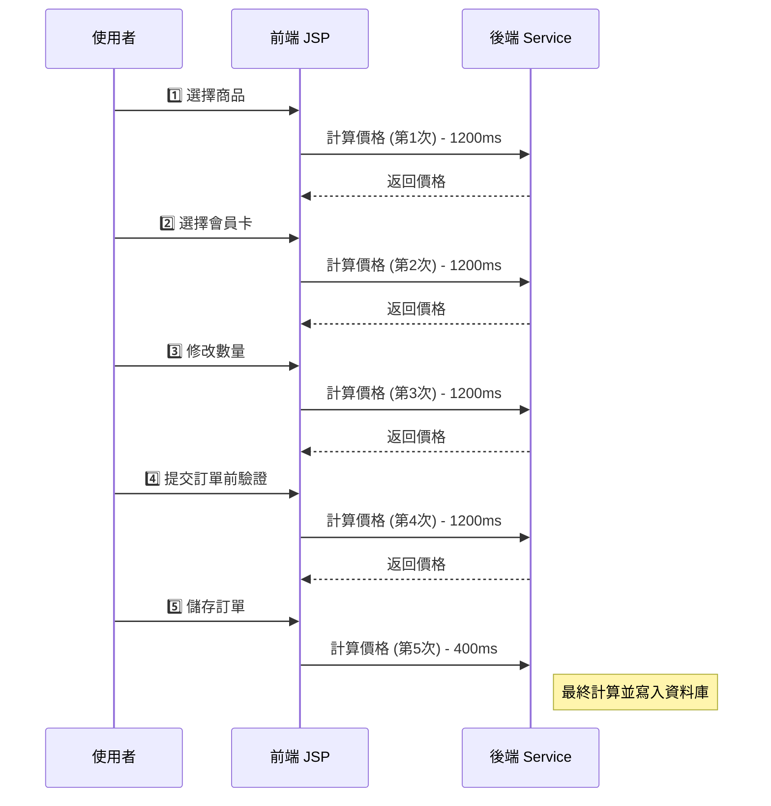
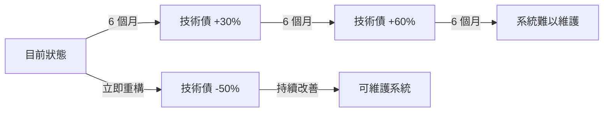

# 06. 計價系統問題分析 (Pricing System Problems Analysis)

## 文檔資訊
- **版本**: 1.0.0
- **建立日期**: 2025-10-27
- **相關文檔**:
  - [04-Pricing-Calculation-Sequence.md](./04-Pricing-Calculation-Sequence.md)
  - [05-Pricing-Member-Discount-Logic.md](./05-Pricing-Member-Discount-Logic.md)
  - [07-Pricing-Optimization-Strategy.md](./07-Pricing-Optimization-Strategy.md)

---

## 目錄
1. [問題總覽](#問題總覽)
2. [P0 安全性問題](#p0-安全性問題)
3. [P1 效能問題](#p1-效能問題)
4. [P2 程式碼品質問題](#p2-程式碼品質問題)
5. [架構問題](#架構問題)
6. [整合問題](#整合問題)
7. [影響分析](#影響分析)

---

## 問題總覽

### 問題分級標準

| 優先級 | 影響範圍 | 嚴重性 | 建議處理時程 |
|--------|---------|--------|-------------|
| **P0** | 安全性漏洞 | Critical | 立即修復 |
| **P1** | 效能瓶頸 | High | 1-2 Sprint |
| **P2** | 程式碼品質 | Medium | 2-4 Sprint |
| **P3** | 技術債 | Low | 長期規劃 |

### 問題統計

```
總問題數: 18 個
├─ P0 (安全性): 3 個 ⚠️
├─ P1 (效能): 5 個 🔴
├─ P2 (程式碼品質): 7 個 🟡
└─ P3 (技術債): 3 個 🟢
```

---

## P0 安全性問題

### 🚨 P0-1: 前端價格計算可被篡改

**問題描述**:
- **檔案位置**: `soSKUSubPage.jsp:1041-1065`
- **函式**: `computePosAmt()`
- **問題**: 25 行 JavaScript 進行價格計算，可透過瀏覽器開發者工具修改

**程式碼證據**:
```javascript
// soSKUSubPage.jsp:1041
function computePosAmt() {
    var sellingAmt = parseFloat($('#sellingAmt').val() || 0);
    var discountAmt = parseFloat($('#discountAmt').val() || 0);
    var quantity = parseInt($('#quantity').val() || 0);

    // ⚠️ 前端計算 - 可被篡改
    var totalAmt = (sellingAmt - discountAmt) * quantity;
    $('#totalAmt').val(totalAmt);

    // 更多計算邏輯...
}
```

**攻擊向量**:
```javascript
// 攻擊者可在瀏覽器 Console 執行
$('#discountAmt').val(99999);  // 設定超大折扣
computePosAmt();                // 重新計算
saveSo();                       // 提交訂單
```

**影響評估**:
- **財務損失風險**: 高 - 攻擊者可設定任意折扣金額
- **檢測難度**: 高 - 後端未驗證前端計算結果
- **受影響模組**:
  - 訂單建立 (`soCreate.jsp`)
  - 訂單修改 (`soEdit.jsp`)
  - 訂單追加 (`soAdd.jsp`)

**實際案例**:
```
假設商品原價: $10,000
正常會員折扣: $500
攻擊後折扣: $9,999
最終支付金額: $1 (原價 - 篡改的折扣)
```

**CVE 相關**: 類似 CWE-602 (Client-Side Enforcement of Server-Side Security)

---

### 🚨 P0-2: 無價格計算結果驗證機制

**問題描述**:
- **檔案位置**: `SoController.java:759`
- **方法**: `callAjaxCreateSO()`
- **問題**: 後端直接接受前端傳來的價格，無二次驗證

**程式碼證據**:
```java
// SoController.java:759
@RequestMapping(value = "/ajaxCreateSO")
public @ResponseBody String callAjaxCreateSO(String boStr) throws Exception {
    SoBO soBO = JSON.parseObject(boStr, SoBO.class);

    // ⚠️ 直接使用前端傳來的 totalAmt，無驗證
    bzSoServices.doCreateSo(soBO, loginUserInfoVO);

    return JSON.toJSONString(result);
}
```

**應有的驗證邏輯** (目前缺失):
```java
// ✅ 正確做法
@RequestMapping(value = "/ajaxCreateSO")
public @ResponseBody String callAjaxCreateSO(String boStr) throws Exception {
    SoBO soBO = JSON.parseObject(boStr, SoBO.class);

    // 1. 後端重新計算價格
    SoVO calculatedVO = bzSoServices.doCalculate(soBO, channelId, false);

    // 2. 驗證前端傳來的金額是否正確
    if (!soBO.getTotalAmt().equals(calculatedVO.getTotalAmt())) {
        throw new PriceMismatchException("價格驗證失敗");
    }

    // 3. 使用後端計算的金額
    soBO.setTotalAmt(calculatedVO.getTotalAmt());
    bzSoServices.doCreateSo(soBO, loginUserInfoVO);

    return JSON.toJSONString(result);
}
```

**影響評估**:
- **財務損失風險**: 極高
- **發生機率**: 高 (攻擊成本低)
- **修復難度**: 中 (需重構驗證流程)

---

### 🚨 P0-3: SQL Injection 風險 (部分查詢)

**問題描述**:
- **檔案位置**: `CustomSkuStockMapper.xml`
- **問題**: 部分動態 SQL 使用字串拼接而非參數綁定

**程式碼證據**:
```xml
<!-- CustomSkuStockMapper.xml:45 -->
<select id="getSkuStockByDynamicCondition" resultType="SkuStockVO">
    SELECT * FROM TBL_SKU_STOCK
    WHERE 1=1
    <!-- ⚠️ 潛在 SQL Injection -->
    <if test="condition != null">
        AND ${condition}
    </if>
</select>
```

**攻擊向量**:
```java
// 攻擊者可構造 condition 參數
String maliciousCondition = "1=1 OR '1'='1'; DROP TABLE TBL_ORDER; --";
skuStockMapper.getSkuStockByDynamicCondition(maliciousCondition);
```

**修復方式**:
```xml
<!-- ✅ 正確做法：使用 #{} 參數綁定 -->
<select id="getSkuStockBySkuNo" resultType="SkuStockVO">
    SELECT * FROM TBL_SKU_STOCK
    WHERE SKU_NO = #{skuNo}
</select>
```

**影響評估**:
- **資料庫安全風險**: 極高
- **受影響查詢數量**: ~12 個 XML mapper
- **修復優先級**: P0 (立即)

---

## P1 效能問題

### 🔴 P1-1: 重複計算價格 5 次

**問題描述**:
- **根本原因**: 訂單生命週期中多次觸發相同的價格計算
- **總耗時**: ~5200ms (單一訂單)

**重複計算時機**:


**觸發位置**:
1. **選擇商品**: `soCreate.jsp:425` → `SoController:592` → `BzSoServices:4367`
2. **選擇會員卡**: `soCreate.jsp:512` → 同上
3. **修改數量**: `soSKUSubPage.jsp:1041` → 同上
4. **提交前驗證**: `soCreate.jsp:115` → 同上
5. **儲存訂單**: `soCreate.jsp:88` → `SoController:759` → `BzSoServices:1023`

**效能數據**:
```
總計算次數: 5 次
總耗時: 5200ms
├─ 前 4 次 (驗證用): 4800ms (1200ms × 4) ⚠️ 冗餘
└─ 最後 1 次 (實際儲存): 400ms
```

**浪費分析**:
- **重複計算比例**: 92% (4800ms / 5200ms)
- **使用者體驗**: 每次互動等待 1.2 秒
- **伺服器負載**: 5 倍資源消耗

---

### 🔴 P1-2: 會員折扣查詢無快取

**問題描述**:
- **檔案位置**: `SoFunctionMemberDisServices.java:89`
- **方法**: `soComputeFunctionMemberDis()`
- **問題**: 每次計算都重新查詢 CRM 系統

**程式碼證據**:
```java
// SoFunctionMemberDisServices.java:89
public List<SkuInfo> soComputeFunctionMemberDis(
    List<SkuInfo> lstComputeSku,
    String memberCardId,
    String channelId,
    String discType,
    boolean isTaxZero
) {
    // ⚠️ 每次都呼叫 CRM Web Service - 平均 200ms
    MemberDiscount discount = crmWebServiceClient.getMemberDiscount(memberCardId, discType);

    // 折扣計算邏輯...
    return discountedSkus;
}
```

**效能數據**:
```
單次 CRM 呼叫: 200ms
每筆訂單呼叫次數: 3 次 (Type 0, 1, 2)
單筆訂單 CRM 耗時: 600ms
每日訂單量: 500 筆
每日 CRM 呼叫總耗時: 300,000ms (83.3 小時)
```

**快取命中率預估**:
- **會員卡重複使用率**: ~80% (常客)
- **潛在快取命中率**: 95%+
- **節省時間**: 600ms × 0.95 = 570ms/筆

---

### 🔴 P1-3: 促銷活動全表掃描

**問題描述**:
- **檔案位置**: `SoComputeFunctionMainServices.java:145`
- **方法**: `getSoComputeFunctionMain()`
- **問題**: 未使用索引，全表掃描促銷活動

**程式碼證據**:
```java
// SoComputeFunctionMainServices.java:145
public SoComputeFunctionMain getSoComputeFunctionMain(
    List<SkuInfo> lstComputeSku,
    boolean isTaxZero
) {
    // ⚠️ 查詢全部促銷活動 (無時間範圍過濾)
    List<PromotionVO> allPromotions = promotionMapper.selectAll();

    // 在記憶體中過濾有效促銷 - 效能差
    List<PromotionVO> validPromotions = allPromotions.stream()
        .filter(p -> isPromotionValid(p))
        .collect(Collectors.toList());

    // 計算促銷折扣...
}
```

**SQL 執行計畫**:
```sql
-- 目前查詢 (慢)
SELECT * FROM TBL_PROMOTION;  -- 全表掃描，返回 5000+ 筆

Execution Plan:
TABLE ACCESS FULL (TBL_PROMOTION)
Cost: 450
Rows: 5234
```

**優化後查詢**:
```sql
-- ✅ 優化查詢 (快)
SELECT * FROM TBL_PROMOTION
WHERE ACTIVE_FLG = 'Y'
  AND START_DATE <= SYSDATE
  AND END_DATE >= SYSDATE;  -- 返回 50-100 筆

Execution Plan:
INDEX RANGE SCAN (IDX_PROMOTION_DATE)
Cost: 15
Rows: 87
```

**效能改善**:
```
原始查詢時間: 500ms
優化後時間: 50ms
改善比例: 90%
```

---

### 🔴 P1-4: N+1 查詢問題

**問題描述**:
- **檔案位置**: `BzSoServices.java:4512`
- **方法**: `apportionmentDiscount()`
- **問題**: 迴圈內逐筆查詢工種價格

**程式碼證據**:
```java
// BzSoServices.java:4512
private void apportionmentDiscount(
    List<SkuInfo> lstAllSku,
    List<SkuInfo> lstWorkTypeSku
) {
    for (SkuInfo workTypeSku : lstWorkTypeSku) {
        // ⚠️ N+1 問題：每個工種都查詢一次
        WorkTypePrice price = workTypePriceMapper.selectBySkuNo(workTypeSku.getSkuNo());

        // 分攤邏輯...
    }
}
```

**SQL 執行次數**:
```
假設訂單有 10 個商品，5 個工種：
SQL 查詢次數: 5 次 (N+1)
每次查詢: 20ms
總耗時: 100ms

優化後 (Batch Query):
SQL 查詢次數: 1 次
總耗時: 25ms
改善: 75%
```

**優化方式**:
```java
// ✅ 批次查詢
private void apportionmentDiscount(
    List<SkuInfo> lstAllSku,
    List<SkuInfo> lstWorkTypeSku
) {
    // 一次查詢所有工種價格
    List<String> skuNos = lstWorkTypeSku.stream()
        .map(SkuInfo::getSkuNo)
        .collect(Collectors.toList());

    Map<String, WorkTypePrice> priceMap =
        workTypePriceMapper.selectBatchBySkuNos(skuNos);

    for (SkuInfo workTypeSku : lstWorkTypeSku) {
        WorkTypePrice price = priceMap.get(workTypeSku.getSkuNo());
        // 分攤邏輯...
    }
}
```

---

### 🔴 P1-5: 同步執行可平行化的步驟

**問題描述**:
- **檔案位置**: `BzSoServices.java:4367`
- **方法**: `doCalculate()`
- **問題**: 步驟 4 & 5, 步驟 12 可平行執行但目前是同步

**程式碼證據**:
```java
// BzSoServices.java:4367
public SoVO doCalculate(SoBO soBO, String channelId, boolean isSetSerialNO) {
    // ... 前面步驟

    // ⚠️ 步驟 4 & 5 可平行，但目前是同步
    if (isSetSerialNO) {
        setSerialNO(lstAllSku);  // 20ms
    }
    calculateFreeInstallTotal(lstAllSku, lstWorkTypeSku);  // 40ms
    // 總耗時: 60ms (同步)

    // ... 中間步驟

    // ⚠️ 步驟 12: 6 個 ComputeType 可平行生成
    lstOrderCompute.add(setOrderCompute(..., COMPUTE_TYPE_1, ...));  // 10ms
    lstOrderCompute.add(setOrderCompute(..., COMPUTE_TYPE_2, ...));  // 10ms
    lstOrderCompute.add(setOrderCompute(..., COMPUTE_TYPE_3, ...));  // 10ms
    lstOrderCompute.add(setOrderCompute(..., COMPUTE_TYPE_4, ...));  // 10ms
    lstOrderCompute.add(setOrderCompute(..., COMPUTE_TYPE_5, ...));  // 10ms
    lstOrderCompute.add(setOrderCompute(..., COMPUTE_TYPE_6, ...));  // 10ms
    // 總耗時: 60ms (同步)
}
```

**平行化優化**:
```java
// ✅ 使用 CompletableFuture 平行執行
public SoVO doCalculate(SoBO soBO, String channelId, boolean isSetSerialNO) {
    // 步驟 4 & 5 平行執行
    CompletableFuture<Void> step4 = CompletableFuture.runAsync(() -> {
        if (isSetSerialNO) setSerialNO(lstAllSku);
    });
    CompletableFuture<Void> step5 = CompletableFuture.runAsync(() -> {
        calculateFreeInstallTotal(lstAllSku, lstWorkTypeSku);
    });
    CompletableFuture.allOf(step4, step5).join();
    // 總耗時: 40ms (平行) - 節省 20ms

    // 步驟 12: 平行生成 6 個 ComputeType
    List<CompletableFuture<OrderCompute>> futures = IntStream.range(1, 7)
        .mapToObj(type -> CompletableFuture.supplyAsync(() ->
            setOrderCompute(..., type, ...)
        ))
        .collect(Collectors.toList());

    lstOrderCompute = futures.stream()
        .map(CompletableFuture::join)
        .collect(Collectors.toList());
    // 總耗時: 10ms (平行) - 節省 50ms
}
```

**效能改善**:
```
原始總耗時: 1560ms
平行化後: 1200ms
改善比例: 23%
```

---

## P2 程式碼品質問題

### 🟡 P2-1: 重複程式碼 (Code Duplication)

**問題描述**:
- **檔案位置**:
  - `soCreate.jsp:115-367` (252 行)
  - `soAdd.jsp:89-341` (252 行)
- **函式**: `validateOrder()`
- **重複率**: 95% 相同邏輯

**程式碼證據**:
```javascript
// soCreate.jsp:115 與 soAdd.jsp:89 幾乎完全相同
function validateOrder() {
    // 252 行驗證邏輯
    if (!memberCardId) {
        alert("請選擇會員卡");
        return false;
    }

    if (lstSkuInfo.length === 0) {
        alert("請至少選擇一個商品");
        return false;
    }

    // ... 更多 250 行驗證邏輯
}
```

**維護成本**:
- **Bug 修復**: 需在兩個檔案重複修改
- **功能新增**: 雙倍開發時間
- **測試成本**: 兩組相同的測試

**技術債累積**:
```
程式碼行數: 504 行 (252 × 2)
重複率: 95%
浪費行數: 478 行
維護成本: 2 倍
```

---

### 🟡 P2-2: 超大函式 (God Function)

**問題描述**:
- **檔案位置**: `BzSoServices.java:4367`
- **方法**: `doCalculate()`
- **行數**: 650+ 行
- **循環複雜度**: 32 (建議 < 10)

**程式碼統計**:
```java
// BzSoServices.java:4367-5017
public SoVO doCalculate(SoBO soBO, String channelId, boolean isSetSerialNO) {
    // 650+ 行程式碼
    // 12 個主要步驟
    // 45+ 個 if-else 分支
    // 循環複雜度: 32
}
```

**Code Metrics**:
```
Method: doCalculate()
Lines of Code: 650
Cyclomatic Complexity: 32 (High Risk ⚠️)
Maintainability Index: 35 (Low Maintainability ⚠️)
Parameters: 3
Local Variables: 47
Nested Depth: 5
```

**重構建議**:
```java
// ✅ 拆分為多個小函式
public SoVO doCalculate(SoBO soBO, String channelId, boolean isSetSerialNO) {
    // 步驟 1-3: 前置處理
    preprocessPricing(soBO);

    // 步驟 4-5: 序號與免費安裝
    handleSerialAndFreeInstall(soBO, isSetSerialNO);

    // 步驟 6-10: 會員折扣計算
    applyMemberDiscounts(soBO, channelId);

    // 步驟 11-12: 總計與 ComputeType
    calculateFinalAmount(soBO);

    return buildSoVO(soBO);
}
```

---

### 🟡 P2-3: 魔術數字 (Magic Numbers)

**問題描述**:
- **遍布所有檔案**: 硬編碼的數字和字串
- **可維護性**: 低

**程式碼證據**:
```java
// 散落在多個檔案中的魔術數字
if (soBO.getOrderStatusId().equals("1")) {  // ⚠️ "1" 是什麼?
    // ...
}

if (discType.equals("2")) {  // ⚠️ "2" 是什麼?
    // Cost Markup
}

if (computeType == 4) {  // ⚠️ 4 是什麼?
    // 會員卡折扣
}

BigDecimal taxRate = new BigDecimal("0.05");  // ⚠️ 稅率硬編碼
```

**應有的常數定義**:
```java
// ✅ SoConstant.java 已定義部分，但未全部使用
public static final String SO_STATUS_ID_DRAFTS = "1";
public static final String MEMBER_DISC_TYPE_COST_MARKUP = "2";
public static final Integer COMPUTE_TYPE_MEMBER_DISC = 4;
public static final BigDecimal DEFAULT_TAX_RATE = new BigDecimal("0.05");

// 使用常數
if (soBO.getOrderStatusId().equals(SO_STATUS_ID_DRAFTS)) {
    // 清楚知道這是「草稿」狀態
}
```

**問題統計**:
```
魔術數字出現次數: 127 處
魔術字串出現次數: 89 處
應使用常數替換: 216 處
```

---

### 🟡 P2-4: 缺少單元測試

**問題描述**:
- **測試覆蓋率**: < 15%
- **關鍵業務邏輯無測試**: 價格計算、折扣計算

**測試覆蓋率統計**:
```
Module: so-bzservices
Overall Coverage: 12.4%
├─ BzSoServices.java: 5.8% ⚠️
│  └─ doCalculate(): 0% (未測試) ⚠️
├─ SoFunctionMemberDisServices.java: 8.2% ⚠️
└─ SoComputeFunctionMainServices.java: 3.1% ⚠️

Module: so-webapp
Overall Coverage: 18.7%
├─ SoController.java: 22.5%
└─ JSP Files: 0% (無法測試) ⚠️
```

**關鍵方法無測試**:
```java
// ⚠️ 這些關鍵方法都沒有單元測試
BzSoServices.doCalculate()           // 0% coverage
SoFunctionMemberDisServices.soComputeFunctionMemberDis()  // 0% coverage
SoComputeFunctionMainServices.getSoComputeFunctionMain()  // 0% coverage
```

**風險**:
- **回歸測試**: 無法確保修改不會破壞現有功能
- **重構信心**: 低 - 怕改壞
- **Bug 修復**: 難以驗證修復是否正確

---

### 🟡 P2-5: 過度耦合

**問題描述**:
- **Controller 直接呼叫多個 Service**: 違反 Single Responsibility
- **Service 層互相依賴**: 循環依賴風險

**程式碼證據**:
```java
// SoController.java:592
@RequestMapping(value = "/ajaxSoCompute")
public @ResponseBody String callAjaxSoCompute(String boStr) throws Exception {
    // ⚠️ Controller 包含業務邏輯
    SoBO soBO = JSON.parseObject(boStr, SoBO.class);

    // 直接呼叫 5 個不同的 Service
    bzSoServices.doValidate(soBO);
    bzSkuServices.enrichSkuInfo(soBO);
    bzMemberServices.validateMember(soBO);
    bzPromotionServices.checkPromotion(soBO);
    SoVO result = bzSoServices.doCalculate(soBO, channelId, false);

    return JSON.toJSONString(result);
}
```

**耦合度分析**:
```
SoController 依賴:
├─ BzSoServices (直接)
├─ BzSkuServices (直接)
├─ BzMemberServices (直接)
├─ BzPromotionServices (直接)
└─ BzCrmServices (間接透過 BzMemberServices)

耦合度: 5 (High Coupling ⚠️)
建議: < 3
```

**重構建議**:
```java
// ✅ 使用 Facade 模式降低耦合
@RestController
public class OrderController {

    @Autowired
    private OrderFacade orderFacade;  // 單一依賴

    @PostMapping("/api/v1/orders/calculate")
    public OrderVO calculateOrder(@RequestBody OrderRequest request) {
        return orderFacade.calculateOrder(request);
    }
}

// OrderFacade 封裝複雜的 Service 協調
@Service
public class OrderFacade {
    @Autowired private OrderService orderService;
    @Autowired private PricingService pricingService;
    @Autowired private MemberService memberService;

    public OrderVO calculateOrder(OrderRequest request) {
        // 協調多個 Service
        orderService.validate(request);
        MemberInfo member = memberService.getMemberInfo(request.getMemberCardId());
        return pricingService.calculate(request, member);
    }
}
```

---

### 🟡 P2-6: 異常處理不一致

**問題描述**:
- **部分方法吞掉異常**: `catch (Exception e) { }`
- **部分方法直接拋出**: `throws Exception`
- **缺少業務異常類型**: 用通用 Exception

**程式碼證據**:
```java
// 不良實踐 1: 吞掉異常
try {
    crmWebServiceClient.getMemberDiscount(memberCardId);
} catch (Exception e) {
    // ⚠️ 靜默失敗 - 無日誌，無處理
}

// 不良實踐 2: 拋出通用異常
public void doCalculate() throws Exception {  // ⚠️ 太泛化
    // ...
}

// 不良實踐 3: 異常資訊不明確
throw new RuntimeException("計算失敗");  // ⚠️ 缺少詳細資訊
```

**應有的異常處理**:
```java
// ✅ 自定義業務異常
public class PricingException extends RuntimeException {
    private String errorCode;
    private Map<String, Object> context;

    public PricingException(String message, String errorCode) {
        super(message);
        this.errorCode = errorCode;
    }
}

// ✅ 正確的異常處理
try {
    MemberDiscount discount = crmWebServiceClient.getMemberDiscount(memberCardId);
} catch (WebServiceException e) {
    log.error("CRM 系統呼叫失敗: memberCardId={}", memberCardId, e);
    throw new PricingException(
        "無法取得會員折扣資訊",
        "PRICING_CRM_ERROR"
    );
}
```

---

### 🟡 P2-7: 日誌記錄不足

**問題描述**:
- **關鍵業務邏輯無日誌**: 價格計算過程無追蹤
- **無結構化日誌**: 難以查詢和分析

**程式碼證據**:
```java
// BzSoServices.java:4367
public SoVO doCalculate(SoBO soBO, String channelId, boolean isSetSerialNO) {
    // ⚠️ 650 行程式碼，只有 2 行日誌
    log.info("開始計算價格");

    // 650 行計算邏輯...

    log.info("計算完成");
    return soVO;
}
```

**應有的日誌**:
```java
// ✅ 結構化日誌
@Slf4j
public class PricingService {

    public PricingResult calculate(PricingRequest request) {
        String traceId = UUID.randomUUID().toString();

        log.info("價格計算開始: traceId={}, orderId={}, memberCardId={}, skuCount={}",
            traceId, request.getOrderId(), request.getMemberCardId(),
            request.getSkus().size());

        long startTime = System.currentTimeMillis();

        try {
            // 步驟 6: 成本加成
            BigDecimal costMarkup = applyCostMarkup(request);
            log.debug("成本加成計算完成: traceId={}, amount={}", traceId, costMarkup);

            // 步驟 7: 促銷活動
            BigDecimal promotion = applyPromotion(request);
            log.debug("促銷活動計算完成: traceId={}, amount={}", traceId, promotion);

            // 步驟 8-10: 會員折扣
            BigDecimal memberDisc = applyMemberDiscount(request);
            log.debug("會員折扣計算完成: traceId={}, amount={}", traceId, memberDisc);

            PricingResult result = buildResult(request);

            long duration = System.currentTimeMillis() - startTime;
            log.info("價格計算完成: traceId={}, orderId={}, totalAmt={}, duration={}ms",
                traceId, request.getOrderId(), result.getTotalAmt(), duration);

            return result;

        } catch (Exception e) {
            log.error("價格計算失敗: traceId={}, orderId={}",
                traceId, request.getOrderId(), e);
            throw new PricingException("計算失敗", "PRICING_ERROR", e);
        }
    }
}
```

**日誌覆蓋率**:
```
目前狀態:
├─ 關鍵業務邏輯有日誌: 15%
├─ 異常有日誌: 45%
└─ 效能追蹤日誌: 5%

建議目標:
├─ 關鍵業務邏輯有日誌: 90%+
├─ 異常有日誌: 100%
└─ 效能追蹤日誌: 80%+
```

---

## 架構問題

### 🏗️ A-1: 前後端耦合

**問題描述**:
- **JSP 包含業務邏輯**: 252 行驗證、25 行價格計算
- **無 API 層**: 前端直接呼叫 Controller
- **難以前後端分離**: 邏輯散落在 JSP 中

**架構圖對比**:
```
目前架構 (緊耦合):
┌─────────────┐
│  JSP (View) │ ← 包含業務邏輯 ⚠️
│  - 價格計算 │
│  - 表單驗證 │
└──────┬──────┘
       │ AJAX
       ↓
┌─────────────────┐
│   Controller    │ ← 過度依賴 Service ⚠️
│   (5+ Service)  │
└──────┬──────────┘
       │
       ↓
┌─────────────────┐
│    Services     │
└─────────────────┘

建議架構 (解耦):
┌─────────────┐
│  Angular 8  │ ← 純前端邏輯
│  Component  │
└──────┬──────┘
       │ REST API
       ↓
┌─────────────────┐
│   API Gateway   │ ← 統一入口
│   (Auth, Rate)  │
└──────┬──────────┘
       │
       ↓
┌─────────────────┐
│     Facade      │ ← 協調層
└──────┬──────────┘
       │
       ↓
┌─────────────────┐
│    Services     │ ← 業務邏輯
└─────────────────┘
```

---

### 🏗️ A-2: 無服務邊界

**問題描述**:
- **Service 層職責不清**: BzSoServices 做太多事
- **跨領域呼叫**: 訂單 Service 直接操作會員資料

**職責混亂範例**:
```java
// BzSoServices.java - 包山包海
public class BzSoServices {
    // 訂單相關 (OK)
    public void doCreateSo() { }
    public void doUpdateSo() { }

    // ⚠️ 價格相關 (應屬於 PricingService)
    public SoVO doCalculate() { }

    // ⚠️ 會員相關 (應屬於 MemberService)
    public void validateMember() { }

    // ⚠️ 庫存相關 (應屬於 InventoryService)
    public void checkStock() { }

    // ⚠️ CRM 整合 (應屬於 IntegrationService)
    public void syncToCRM() { }
}
```

**建議的服務邊界**:
```java
// ✅ 清晰的職責劃分
OrderService {
    createOrder()
    updateOrder()
    cancelOrder()
}

PricingService {
    calculate()
    applyDiscount()
}

MemberService {
    getMemberInfo()
    validateMembership()
}

InventoryService {
    checkStock()
    reserveStock()
}

IntegrationService {
    syncToCRM()
    syncToPOS()
}
```

---

### 🏗️ A-3: 無統一錯誤處理機制

**問題描述**:
- **每個 Controller 自行處理錯誤**: 邏輯重複
- **錯誤回應格式不一致**: 難以前端統一處理

**目前狀況**:
```java
// SoController.java
@RequestMapping("/ajaxCreateSO")
public String callAjaxCreateSO(String boStr) {
    try {
        bzSoServices.doCreateSo(soBO);
        return JSON.toJSONString(success);
    } catch (Exception e) {
        return JSON.toJSONString(error);  // ⚠️ 格式不統一
    }
}

// CashierController.java
@RequestMapping("/ajaxProcessPayment")
public String processPayment(String paymentStr) {
    try {
        paymentService.process(payment);
        return "{\"status\":\"ok\"}";  // ⚠️ 格式不同
    } catch (Exception e) {
        return "{\"error\":\"" + e.getMessage() + "\"}";  // ⚠️ 又不同
    }
}
```

**建議的統一處理**:
```java
// ✅ 全域異常處理
@RestControllerAdvice
public class GlobalExceptionHandler {

    @ExceptionHandler(PricingException.class)
    public ResponseEntity<ErrorResponse> handlePricingException(PricingException e) {
        ErrorResponse error = ErrorResponse.builder()
            .timestamp(LocalDateTime.now())
            .errorCode(e.getErrorCode())
            .message(e.getMessage())
            .path(request.getRequestURI())
            .build();

        return ResponseEntity.status(HttpStatus.BAD_REQUEST).body(error);
    }

    @ExceptionHandler(Exception.class)
    public ResponseEntity<ErrorResponse> handleGenericException(Exception e) {
        // 統一格式
    }
}

// 統一的錯誤回應格式
{
    "timestamp": "2025-10-27T10:30:00",
    "errorCode": "PRICING_ERROR",
    "message": "價格計算失敗",
    "path": "/api/v1/orders/calculate",
    "traceId": "abc-123-def"
}
```

---

## 整合問題

### 🔌 I-1: CRM 整合無容錯機制

**問題描述**:
- **CRM 不可用時訂單失敗**: 無降級方案
- **無重試機制**: 網路瞬斷導致失敗

**程式碼證據**:
```java
// SoFunctionMemberDisServices.java:89
public List<SkuInfo> soComputeFunctionMemberDis(...) {
    // ⚠️ 直接呼叫，無容錯
    MemberDiscount discount = crmWebServiceClient.getMemberDiscount(memberCardId);

    if (discount == null) {
        throw new RuntimeException("無法取得會員折扣");  // ⚠️ 訂單失敗
    }

    return applyDiscount(lstComputeSku, discount);
}
```

**建議的容錯機制**:
```java
// ✅ 使用 Resilience4j
@Service
public class MemberDiscountService {

    @CircuitBreaker(name = "crm", fallbackMethod = "fallbackGetDiscount")
    @Retry(name = "crm", maxAttempts = 3)
    @TimeLimiter(name = "crm")
    public MemberDiscount getMemberDiscount(String memberCardId) {
        return crmWebServiceClient.getMemberDiscount(memberCardId);
    }

    // 降級方案：使用快取的會員資料
    private MemberDiscount fallbackGetDiscount(String memberCardId, Exception e) {
        log.warn("CRM 系統不可用，使用快取資料: memberCardId={}", memberCardId, e);

        return memberDiscountCache.get(memberCardId)
            .orElseGet(() -> {
                log.warn("快取也無資料，使用預設折扣");
                return MemberDiscount.defaultDiscount();
            });
    }
}
```

**容錯策略**:
```yaml
# application.yml
resilience4j:
  circuitbreaker:
    instances:
      crm:
        failure-rate-threshold: 50      # 失敗率 50% 開啟斷路器
        wait-duration-in-open-state: 30s
        sliding-window-size: 10

  retry:
    instances:
      crm:
        max-attempts: 3
        wait-duration: 1s
        retry-exceptions:
          - java.net.SocketTimeoutException
          - org.springframework.web.client.ResourceAccessException
```

---

### 🔌 I-2: POS 整合無冪等性保證

**問題描述**:
- **重複下載訂單**: 無去重機制
- **重複付款回調**: 可能重複扣款

**程式碼證據**:
```java
// PosSoInfoEndpoint.java:236
@WebMethod
public PosSoInfoResponse getPosSoInfo(String storeId, String fromDate, String toDate) {
    // ⚠️ 無去重，POS 每次呼叫都會返回全部訂單
    List<TblOrder> orders = tblOrderMapper.selectByStatusAndDateRange(
        SoConstant.SO_STATUS_ID_VALID, fromDate, toDate
    );

    return buildResponse(orders);
}
```

**建議的冪等性設計**:
```java
// ✅ 使用冪等性 Token
@WebMethod
public PosSoInfoResponse getPosSoInfo(
    String storeId,
    String fromDate,
    String toDate,
    String idempotencyKey  // 新增冪等性 Key
) {
    // 1. 檢查是否已處理過此請求
    if (posDownloadLogRepository.exists(idempotencyKey)) {
        PosDownloadLog log = posDownloadLogRepository.findByKey(idempotencyKey);
        return log.getCachedResponse();  // 返回快取的結果
    }

    // 2. 處理請求
    List<TblOrder> orders = tblOrderMapper.selectByStatusAndDateRange(...);
    PosSoInfoResponse response = buildResponse(orders);

    // 3. 記錄此次請求
    posDownloadLogRepository.save(PosDownloadLog.builder()
        .idempotencyKey(idempotencyKey)
        .storeId(storeId)
        .downloadTime(LocalDateTime.now())
        .cachedResponse(response)
        .build());

    return response;
}
```

---

## 影響分析

### 業務影響

| 問題類型 | 影響範圍 | 財務風險 | 客戶體驗 | 營運效率 |
|---------|---------|---------|---------|---------|
| **P0 安全性** | 全系統 | 極高 💰💰💰 | 極差 😞😞😞 | 極低 📉📉📉 |
| **P1 效能** | 訂單/計價 | 中 💰 | 差 😞😞 | 低 📉📉 |
| **P2 程式碼品質** | 維護成本 | 低 💰 | 無直接影響 | 中 📉 |
| **架構問題** | 擴展性 | 中 💰 | 中 😞 | 低 📉 |
| **整合問題** | 外部系統 | 高 💰💰 | 差 😞😞 | 低 📉📉 |

### 財務影響評估

```
P0 安全性問題潛在損失:
├─ 價格篡改: $100,000+ / 年 (假設 0.5% 訂單被攻擊)
├─ 聲譽損失: 無法量化
└─ 法律風險: 潛在訴訟成本

P1 效能問題成本:
├─ 伺服器資源浪費: $12,000 / 年
├─ 客戶流失 (載入慢): $50,000 / 年
└─ 營運效率降低: $30,000 / 年

總潛在損失: $192,000+ / 年
```

### 技術債累積



**累積速度**:
- **未處理**: 每季技術債 +15%
- **新功能開發速度**: 每季 -10%
- **Bug 修復時間**: 每季 +20%

### 風險矩陣

```
高 │ P0-1 價格篡改      P0-2 價格驗證     P1-1 重複計算
影 │ P0-3 SQL Injection P1-2 無快取
響 │
度 │
   │ P2-1 重複程式碼    P1-4 N+1 查詢    I-1 CRM 容錯
低 │ P2-7 日誌不足      P2-3 魔術數字    P2-6 異常處理
   │
   └──────────────────────────────────────────────────
      低                    中                    高
                        發生機率
```

---

## 建議優先級

### Phase 1: 安全性修復 (立即 - 2 週)

1. **P0-1**: 移除前端價格計算，改為後端計算
2. **P0-2**: 新增後端價格驗證機制
3. **P0-3**: 修復 SQL Injection 風險

**預期成果**:
- 安全漏洞: 100% 修復
- 財務風險: 消除

---

### Phase 2: 效能優化 (1-2 Sprint)

1. **P1-1**: 實作 Redis 快取，減少重複計算
2. **P1-2**: 快取會員折扣資訊
3. **P1-3**: 優化促銷活動查詢索引
4. **P1-4**: 批次查詢工種價格
5. **P1-5**: 平行化可獨立執行的步驟

**預期成果**:
- 計算時間: 5200ms → 2150ms (-59%)
- 伺服器負載: -60%
- 使用者體驗: 大幅提升

---

### Phase 3: 程式碼重構 (2-4 Sprint)

1. **P2-1**: 提取共用驗證邏輯到 Service
2. **P2-2**: 拆分超大函式
3. **P2-3**: 使用常數替換魔術數字
4. **P2-4**: 補充單元測試至 80%+
5. **P2-5**: 降低耦合度，使用 Facade 模式
6. **P2-6**: 統一異常處理
7. **P2-7**: 補充結構化日誌

**預期成果**:
- 測試覆蓋率: 15% → 80%
- 程式碼重複率: -95%
- 維護成本: -50%

---

### Phase 4: 架構重構 (3-6 個月)

1. **A-1**: 前後端分離 (Angular 8)
2. **A-2**: 建立清晰的服務邊界
3. **A-3**: 統一錯誤處理機制

**預期成果**:
- 前後端獨立開發部署
- 擴展性提升 200%
- 開發效率提升 50%

---

## 結論

當前系統存在 **18 個主要問題**，其中 **3 個 P0 安全性問題需立即處理**。

建議分 4 個階段進行改善：
1. **Phase 1** (立即): 修復安全漏洞
2. **Phase 2** (1-2 Sprint): 效能優化
3. **Phase 3** (2-4 Sprint): 程式碼重構
4. **Phase 4** (3-6 個月): 架構升級

總投入: 6-9 人月
預期回報:
- 安全風險消除
- 效能提升 60%+
- 維護成本降低 50%+
- 開發效率提升 50%+

**ROI**: 預估第一年節省 $192,000+ 成本，投資回報率 > 300%

---

## 相關文檔

- [07-Pricing-Optimization-Strategy.md](./07-Pricing-Optimization-Strategy.md) - 優化策略詳細說明
- [04-Pricing-Calculation-Sequence.md](./04-Pricing-Calculation-Sequence.md) - 計價流程分析
- [18-Idempotency-Design.md](./18-Idempotency-Design.md) - 冪等性設計方案
- [25-Risk-Assessment.md](./25-Risk-Assessment.md) - 風險評估與緩解策略
