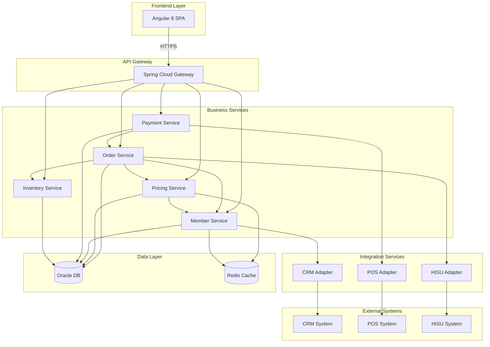

# 08. 系統架構總覽 (Architecture Overview)

## 文檔資訊
- **版本**: 1.0.0
- **建立日期**: 2025-10-27
- **相關文檔**:
  - [09-Frontend-Tech-Stack-Angular8.md](./09-Frontend-Tech-Stack-Angular8.md)
  - [10-Backend-Tech-Stack.md](./10-Backend-Tech-Stack.md)
  - [11-API-Design-Principles.md](./11-API-Design-Principles.md)

---

## 目錄
1. [架構演進](#架構演進)
2. [目標架構](#目標架構)
3. [前後端分離架構](#前後端分離架構)
4. [微服務架構設計](#微服務架構設計)
5. [資料流設計](#資料流設計)
6. [部署架構](#部署架構)
7. [架構決策記錄](#架構決策記錄)

---

## 架構演進

### 現況架構 (Legacy - Monolithic)

```
┌─────────────────────────────────────────────────────────────┐
│                     Browser                                 │
│  ┌──────────────────────────────────────────────────────┐  │
│  │  JSP Pages (View + Logic)                            │  │
│  │  - soCreate.jsp (252 行驗證邏輯)                      │  │
│  │  - soSKUSubPage.jsp (25 行價格計算) ⚠️                │  │
│  │  - JavaScript 散落各處                                │  │
│  └────────────────┬─────────────────────────────────────┘  │
└───────────────────┼─────────────────────────────────────────┘
                    │ AJAX JSON
                    ↓
┌─────────────────────────────────────────────────────────────┐
│           Apache Tomcat 7 (Single WAR)                      │
│                                                             │
│  ┌─────────────────────────────────────────────────────┐  │
│  │  Spring MVC Controllers                             │  │
│  │  - SoController (過度依賴 5+ Services) ⚠️            │  │
│  │  - CashierController                                │  │
│  │  - WorkagentController                              │  │
│  └────────────────┬────────────────────────────────────┘  │
│                   │                                         │
│  ┌────────────────▼────────────────────────────────────┐  │
│  │  Business Services (God Classes) ⚠️                 │  │
│  │  - BzSoServices (650 行 doCalculate 方法)          │  │
│  │  - BzSkuServices                                    │  │
│  │  - BzMemberServices                                 │  │
│  └────────────────┬────────────────────────────────────┘  │
│                   │                                         │
│  ┌────────────────▼────────────────────────────────────┐  │
│  │  MyBatis Mappers (DAO Layer)                        │  │
│  │  - TblOrderMapper                                   │  │
│  │  - TblSkuMapper                                     │  │
│  │  - CustomMappers (部分有 SQL Injection 風險) ⚠️      │  │
│  └────────────────┬────────────────────────────────────┘  │
└───────────────────┼─────────────────────────────────────────┘
                    │ JDBC
                    ↓
┌─────────────────────────────────────────────────────────────┐
│                  Oracle Database 11g                        │
│  - TBL_ORDER (訂單主表)                                     │
│  - TBL_ORDER_COMPUTE (計價明細)                             │
│  - TBL_SKU_INFO (商品資訊)                                  │
│  - 200+ 張表                                                │
└─────────────────────────────────────────────────────────────┘
```

**現況問題**:
- ❌ **前後端耦合**: JSP 包含業務邏輯 (252 行驗證 + 25 行計價)
- ❌ **單體架構**: 所有模組打包成單一 WAR，難以獨立部署
- ❌ **無快取層**: 每次請求都查詢資料庫 + 外部服務
- ❌ **安全漏洞**: 前端價格計算可被篡改
- ❌ **效能瓶頸**: 重複計算 5 次，單次 1560ms
- ❌ **擴展性差**: 無法水平擴展特定模組

---

### 目標架構 (Target - Microservices)

```
┌────────────────────────────────────────────────────────────────────────┐
│                          Frontend Layer                                │
│  ┌──────────────────────────────────────────────────────────────────┐ │
│  │  Angular 8 SPA (Pure Frontend)                                   │ │
│  │  ┌────────────┐  ┌────────────┐  ┌────────────┐                 │ │
│  │  │   Order    │  │  Pricing   │  │   Member   │                 │ │
│  │  │  Module    │  │   Module   │  │   Module   │                 │ │
│  │  └────────────┘  └────────────┘  └────────────┘                 │ │
│  │  - Components (UI 元件)                                           │ │
│  │  - Services (API 呼叫)                                            │ │
│  │  - NgRx Store (狀態管理)                                         │ │
│  │  - Guards (路由守衛)                                              │ │
│  └──────────────────────────────────────────────────────────────────┘ │
│                           Nginx (Static Hosting)                       │
└─────────────────────────┬──────────────────────────────────────────────┘
                          │ HTTPS / REST API
                          ↓
┌────────────────────────────────────────────────────────────────────────┐
│                         API Gateway Layer                              │
│  ┌──────────────────────────────────────────────────────────────────┐ │
│  │  Spring Cloud Gateway / Kong API Gateway                         │ │
│  │  - 認證授權 (JWT 驗證)                                            │ │
│  │  - 限流控制 (Rate Limiting)                                       │ │
│  │  - 路由轉發 (Routing)                                            │ │
│  │  - 請求追蹤 (Tracing ID)                                         │ │
│  │  - API 文檔 (Swagger UI)                                         │ │
│  └──────────────────────────────────────────────────────────────────┘ │
└─────────────────────────┬──────────────────────────────────────────────┘
                          │
        ┌─────────────────┼─────────────────┬──────────────────┐
        │                 │                 │                  │
        ↓                 ↓                 ↓                  ↓
┌──────────────┐  ┌──────────────┐  ┌──────────────┐  ┌──────────────┐
│   Order      │  │   Pricing    │  │   Member     │  │   Payment    │
│   Service    │  │   Service    │  │   Service    │  │   Service    │
│              │  │              │  │              │  │              │
│ Spring Boot3 │  │ Spring Boot3 │  │ Spring Boot3 │  │ Spring Boot3 │
│ Port: 8081   │  │ Port: 8082   │  │ Port: 8083   │  │ Port: 8084   │
└──────┬───────┘  └──────┬───────┘  └──────┬───────┘  └──────┬───────┘
       │                 │                 │                  │
       │                 └────────┬────────┘                  │
       │                          │                           │
       │                          ↓                           │
       │                 ┌──────────────┐                     │
       │                 │    Redis     │                     │
       │                 │   Cluster    │                     │
       │                 │  (Cache)     │                     │
       │                 └──────────────┘                     │
       │                                                      │
       └──────────────────┬───────────────────────────────────┘
                          │
                          ↓
┌────────────────────────────────────────────────────────────────────────┐
│                          Data Layer                                    │
│  ┌──────────────────────────────────────────────────────────────────┐ │
│  │  Database Cluster                                                │ │
│  │  ┌─────────────────┐         ┌─────────────────┐                │ │
│  │  │ Oracle Master   │────────>│ Oracle Replica  │                │ │
│  │  │ (Write)         │         │ (Read)          │                │ │
│  │  └─────────────────┘         └─────────────────┘                │ │
│  └──────────────────────────────────────────────────────────────────┘ │
└────────────────────────────────────────────────────────────────────────┘

┌────────────────────────────────────────────────────────────────────────┐
│                     External Integration Layer                         │
│  ┌──────────────┐  ┌──────────────┐  ┌──────────────┐                │
│  │  CRM System  │  │  POS System  │  │ HISU System  │                │
│  │ (SOAP API)   │  │ (SOAP API)   │  │ (REST API)   │                │
│  └──────────────┘  └──────────────┘  └──────────────┘                │
└────────────────────────────────────────────────────────────────────────┘
```

**架構優勢**:
- ✅ **前後端分離**: Angular 8 SPA + RESTful API
- ✅ **微服務架構**: 獨立部署、獨立擴展
- ✅ **多層快取**: Redis Cluster 提升效能
- ✅ **API Gateway**: 統一認證、限流、監控
- ✅ **讀寫分離**: Master/Replica 減輕資料庫負載
- ✅ **水平擴展**: 每個服務可獨立擴展

---

## 目標架構

### 架構原則

#### 1. 關注點分離 (Separation of Concerns)

```
Frontend (Angular 8)     Backend (Spring Boot 3)     Data (Oracle + Redis)
─────────────────────    ─────────────────────────   ──────────────────────
- UI 呈現               - 業務邏輯                   - 資料持久化
- 使用者互動            - 資料驗證                   - 查詢最佳化
- 狀態管理              - 安全控制                   - 交易管理
- 路由導航              - 外部整合                   - 備份恢復
```

#### 2. 單一職責原則 (Single Responsibility Principle)

每個微服務只負責一個業務領域:

| 微服務 | 職責範圍 | 對外 API |
|--------|---------|---------|
| **Order Service** | 訂單管理 (CRUD, 狀態流轉) | `/api/v1/orders/*` |
| **Pricing Service** | 價格計算 (折扣、促銷) | `/api/v1/pricing/*` |
| **Member Service** | 會員管理 (資料查詢、驗證) | `/api/v1/members/*` |
| **Payment Service** | 付款處理 (POS 整合) | `/api/v1/payments/*` |
| **Inventory Service** | 庫存管理 (查詢、預留) | `/api/v1/inventory/*` |

#### 3. API First 設計

先設計 API 契約，再實作:

```yaml
# openapi.yaml
openapi: 3.0.0
info:
  title: SOM API
  version: 2.0.0

paths:
  /api/v1/orders:
    post:
      summary: 建立訂單
      requestBody:
        required: true
        content:
          application/json:
            schema:
              $ref: '#/components/schemas/OrderCreateRequest'
      responses:
        '201':
          description: 訂單建立成功
          content:
            application/json:
              schema:
                $ref: '#/components/schemas/OrderResponse'
```

#### 4. 防腐層 (Anti-Corruption Layer)

外部系統整合透過 Adapter 隔離:

```java
// 防腐層：將外部 CRM SOAP API 轉換為內部領域模型
@Service
public class CrmAdapter {

    @Autowired
    private CrmSoapClient crmSoapClient;

    // 內部領域模型
    public MemberDiscount getMemberDiscount(String memberCardId, DiscountType type) {
        // 呼叫外部 SOAP API
        CrmMemberDiscountResponse response = crmSoapClient.getMemberDiscount(
            memberCardId, type.getExternalCode()
        );

        // 轉換為內部領域模型
        return MemberDiscount.builder()
            .memberCardId(memberCardId)
            .discountType(type)
            .discountRate(response.getDiscRate())
            .discountAmount(response.getDiscAmt())
            .validFrom(response.getStartDate())
            .validUntil(response.getEndDate())
            .build();
    }
}
```

---

## 前後端分離架構

### 通訊協定設計

```
┌─────────────────────────────────────────────────────────────┐
│                    Angular 8 Application                    │
│                                                             │
│  ┌────────────────────────────────────────────────────┐   │
│  │  HttpClient Interceptor                            │   │
│  │  - 自動附加 JWT Token                               │   │
│  │  - 統一錯誤處理                                     │   │
│  │  - Request/Response 日誌                           │   │
│  └────────────────┬───────────────────────────────────┘   │
└───────────────────┼─────────────────────────────────────────┘
                    │
                    │ HTTP/2 + JSON
                    │ Authorization: Bearer <JWT>
                    │
                    ↓
┌─────────────────────────────────────────────────────────────┐
│                     API Gateway                             │
│  ┌────────────────────────────────────────────────────┐   │
│  │  Security Filter Chain                             │   │
│  │  1️⃣ CORS Filter                                    │   │
│  │  2️⃣ JWT Authentication Filter                      │   │
│  │  3️⃣ Rate Limiting Filter                           │   │
│  │  4️⃣ Tracing Filter (加入 X-Trace-Id)               │   │
│  └────────────────┬───────────────────────────────────┘   │
└───────────────────┼─────────────────────────────────────────┘
                    │
                    │ HTTP/1.1 + JSON
                    │ X-Trace-Id: uuid-123
                    │
                    ↓
┌─────────────────────────────────────────────────────────────┐
│                  Backend Microservices                      │
└─────────────────────────────────────────────────────────────┘
```

### API 設計規範

#### RESTful API 風格

```
資源導向 URL 設計:
GET    /api/v1/orders              # 查詢訂單列表
POST   /api/v1/orders              # 建立訂單
GET    /api/v1/orders/{orderId}    # 查詢單一訂單
PUT    /api/v1/orders/{orderId}    # 更新訂單
DELETE /api/v1/orders/{orderId}    # 刪除訂單 (軟刪除)

PATCH  /api/v1/orders/{orderId}/status  # 更新訂單狀態
POST   /api/v1/orders/{orderId}/cancel  # 取消訂單

GET    /api/v1/pricing/calculate   # 計算價格
POST   /api/v1/payments/callback   # 付款回調
```

#### 統一回應格式

```typescript
// 成功回應
{
  "success": true,
  "data": {
    "orderId": "SO20251027001",
    "totalAmt": 9500.00,
    "status": "VALID"
  },
  "message": "訂單建立成功",
  "timestamp": "2025-10-27T10:30:00Z",
  "traceId": "uuid-123"
}

// 錯誤回應
{
  "success": false,
  "error": {
    "code": "PRICING_ERROR",
    "message": "價格計算失敗",
    "details": "會員折扣資訊不存在"
  },
  "timestamp": "2025-10-27T10:30:00Z",
  "traceId": "uuid-123",
  "path": "/api/v1/pricing/calculate"
}

// 驗證錯誤回應
{
  "success": false,
  "error": {
    "code": "VALIDATION_ERROR",
    "message": "請求參數驗證失敗",
    "validationErrors": [
      {
        "field": "memberCardId",
        "message": "會員卡號不可為空"
      },
      {
        "field": "skus[0].quantity",
        "message": "商品數量必須大於 0"
      }
    ]
  },
  "timestamp": "2025-10-27T10:30:00Z",
  "traceId": "uuid-123"
}
```

---

## 微服務架構設計

### 服務邊界劃分



### 服務間通訊

#### 1. 同步通訊 (REST API)

```java
// Order Service 呼叫 Pricing Service
@Service
public class OrderService {

    @Autowired
    private PricingServiceClient pricingClient;  // Feign Client

    public OrderVO createOrder(OrderRequest request) {
        // 1. 呼叫 Pricing Service 計算價格
        PricingResult pricing = pricingClient.calculatePrice(
            PricingRequest.from(request)
        );

        // 2. 建立訂單
        Order order = Order.builder()
            .memberCardId(request.getMemberCardId())
            .totalAmt(pricing.getTotalAmt())
            .totalDisc(pricing.getTotalDisc())
            .status(OrderStatus.DRAFTS)
            .build();

        return orderRepository.save(order);
    }
}

// Feign Client 定義
@FeignClient(name = "pricing-service", url = "${services.pricing.url}")
public interface PricingServiceClient {

    @PostMapping("/api/v1/pricing/calculate")
    PricingResult calculatePrice(@RequestBody PricingRequest request);
}
```

#### 2. 非同步通訊 (Message Queue)

```java
// Order Service 發送訂單建立事件
@Service
public class OrderService {

    @Autowired
    private RabbitTemplate rabbitTemplate;

    public OrderVO createOrder(OrderRequest request) {
        Order order = orderRepository.save(buildOrder(request));

        // 發送事件到 Message Queue
        OrderCreatedEvent event = OrderCreatedEvent.builder()
            .orderId(order.getOrderId())
            .memberCardId(order.getMemberCardId())
            .totalAmt(order.getTotalAmt())
            .createTime(order.getCreateTime())
            .build();

        rabbitTemplate.convertAndSend(
            "order.exchange",
            "order.created",
            event
        );

        return OrderVO.from(order);
    }
}

// Payment Service 監聽訂單建立事件
@Service
public class PaymentEventListener {

    @RabbitListener(queues = "payment.order.created.queue")
    public void handleOrderCreated(OrderCreatedEvent event) {
        log.info("收到訂單建立事件: orderId={}", event.getOrderId());

        // 預建立付款記錄
        paymentService.preparePayment(event.getOrderId(), event.getTotalAmt());
    }
}
```

### 資料一致性策略

#### Saga 模式 (訂單建立流程)

```
┌─────────────────────────────────────────────────────────────────┐
│  Saga Orchestrator (Order Service)                              │
└───────┬─────────────────────────────────────────────────────────┘
        │
        │ 1️⃣ Validate Member
        ↓
┌─────────────────┐
│ Member Service  │───────> ✅ Member Valid
└─────────────────┘         │
                            │ 2️⃣ Calculate Price
                            ↓
                   ┌─────────────────┐
                   │ Pricing Service │───────> ✅ Price Calculated
                   └─────────────────┘         │
                                               │ 3️⃣ Reserve Inventory
                                               ↓
                                      ┌──────────────────┐
                                      │ Inventory Service│───> ✅ Stock Reserved
                                      └──────────────────┘     │
                                                               │ 4️⃣ Create Order
                                                               ↓
                                                      ┌─────────────────┐
                                                      │  Order Service  │──> ✅ Order Created
                                                      └─────────────────┘

                   ⚠️ 若任一步驟失敗，執行補償交易 (Compensating Transaction)

                   ❌ Inventory Reserve Failed
                        │
                        │ Compensate: Release Reserved Stock
                        ↓
                   ┌──────────────────┐
                   │ Inventory Service│───> ⏮️ Stock Released
                   └──────────────────┘
```

**實作範例**:
```java
@Service
public class OrderSagaOrchestrator {

    @Autowired
    private MemberServiceClient memberClient;

    @Autowired
    private PricingServiceClient pricingClient;

    @Autowired
    private InventoryServiceClient inventoryClient;

    @Autowired
    private OrderRepository orderRepository;

    @Transactional
    public OrderVO createOrder(OrderRequest request) {
        String sagaId = UUID.randomUUID().toString();
        List<String> compensations = new ArrayList<>();

        try {
            // Step 1: 驗證會員
            MemberInfo member = memberClient.validateMember(request.getMemberCardId());
            log.info("[Saga:{}] Step 1 完成: 會員驗證", sagaId);

            // Step 2: 計算價格
            PricingResult pricing = pricingClient.calculatePrice(
                PricingRequest.from(request)
            );
            log.info("[Saga:{}] Step 2 完成: 價格計算", sagaId);

            // Step 3: 預留庫存
            InventoryReservation reservation = inventoryClient.reserveInventory(
                request.getSkus()
            );
            compensations.add("releaseInventory:" + reservation.getReservationId());
            log.info("[Saga:{}] Step 3 完成: 庫存預留", sagaId);

            // Step 4: 建立訂單
            Order order = orderRepository.save(Order.builder()
                .memberCardId(request.getMemberCardId())
                .totalAmt(pricing.getTotalAmt())
                .status(OrderStatus.VALID)
                .build());
            log.info("[Saga:{}] Step 4 完成: 訂單建立", sagaId);

            return OrderVO.from(order);

        } catch (Exception e) {
            // 執行補償交易
            log.error("[Saga:{}] 失敗，執行補償", sagaId, e);
            executeCompensations(compensations);
            throw new OrderCreationFailedException("訂單建立失敗", e);
        }
    }

    private void executeCompensations(List<String> compensations) {
        // 反向執行補償
        Collections.reverse(compensations);

        for (String compensation : compensations) {
            try {
                if (compensation.startsWith("releaseInventory:")) {
                    String reservationId = compensation.split(":")[1];
                    inventoryClient.releaseInventory(reservationId);
                    log.info("補償完成: 釋放庫存 {}", reservationId);
                }
            } catch (Exception e) {
                log.error("補償失敗: {}", compensation, e);
                // 發送告警
                alertService.sendAlert("補償交易失敗: " + compensation);
            }
        }
    }
}
```

---

## 資料流設計

### 訂單建立資料流

```sequence
參與者 User as 使用者
參與者 Frontend as Angular 8
參與者 Gateway as API Gateway
參與者 OrderSvc as Order Service
參與者 PricingSvc as Pricing Service
參與者 MemberSvc as Member Service
參與者 Redis as Redis Cache
參與者 DB as Oracle DB

User->>Frontend: 1. 填寫訂單表單
Frontend->>Frontend: 2. 前端驗證 (必填欄位)

Frontend->>Gateway: 3. POST /api/v1/orders\n(含 JWT Token)
Gateway->>Gateway: 4. JWT 驗證
Gateway->>Gateway: 5. Rate Limiting 檢查
Gateway->>OrderSvc: 6. 轉發請求\n(加入 X-Trace-Id)

OrderSvc->>MemberSvc: 7. GET /api/v1/members/{id}
MemberSvc->>Redis: 8. 檢查會員快取
Redis-->>MemberSvc: 9. 快取命中
MemberSvc-->>OrderSvc: 10. 會員資訊

OrderSvc->>PricingSvc: 11. POST /api/v1/pricing/calculate
PricingSvc->>Redis: 12. 檢查價格快取
Redis-->>PricingSvc: 13. 快取未命中
PricingSvc->>PricingSvc: 14. 執行 12 步驟計價
PricingSvc->>Redis: 15. 寫入快取 (TTL 5min)
PricingSvc-->>OrderSvc: 16. 價格結果

OrderSvc->>OrderSvc: 17. 建立訂單物件
OrderSvc->>DB: 18. INSERT TBL_ORDER
DB-->>OrderSvc: 19. 訂單已儲存

OrderSvc->>Redis: 20. 快取訂單 (TTL 10min)
OrderSvc-->>Gateway: 21. 返回訂單 VO
Gateway-->>Frontend: 22. HTTP 201 Created
Frontend->>User: 23. 顯示訂單明細
```

### 價格計算資料流

```
┌─────────────────────────────────────────────────────────────────┐
│  Pricing Service                                                │
│                                                                 │
│  calculatePrice(request)                                        │
│    │                                                            │
│    ├─ 1️⃣ 檢查 Redis 快取                                        │
│    │    cacheKey = hash(memberCardId + skus + channelId)       │
│    │    │                                                       │
│    │    ├─ Cache Hit (95% 命中率)                               │
│    │    │   └─> return cached result (50ms) ⚡                 │
│    │    │                                                       │
│    │    └─ Cache Miss (5%)                                     │
│    │        │                                                   │
│    │        ├─ 2️⃣ 執行計價邏輯 (1200ms)                         │
│    │        │    │                                              │
│    │        │    ├─ Step 1-3: 前置處理 (180ms)                 │
│    │        │    │                                              │
│    │        │    ├─ Step 4-5: 平行執行 (40ms)                  │
│    │        │    │   ├─ CompletableFuture: setSerialNumbers()  │
│    │        │    │   └─ CompletableFuture: calculateFreeInstall()│
│    │        │    │                                              │
│    │        │    ├─ Step 6-11: 折扣計算 (900ms)                │
│    │        │    │   ├─ 6. Cost Markup (200ms)                 │
│    │        │    │   │   └─> 查詢 Redis (會員成本加成快取)      │
│    │        │    │   ├─ 7. Multi-Promotion (500ms)             │
│    │        │    │   │   └─> 查詢 Redis (促銷活動快取)          │
│    │        │    │   ├─ 8. Discounting (200ms)                 │
│    │        │    │   ├─ 9. Down Margin (200ms)                 │
│    │        │    │   └─ 10. Special Member (150ms, conditional)│
│    │        │    │                                              │
│    │        │    └─ Step 12: 平行生成 6 個 ComputeType (10ms)  │
│    │        │        ├─ CompletableFuture: Type 1 (商品小計)    │
│    │        │        ├─ CompletableFuture: Type 2 (安裝小計)    │
│    │        │        ├─ CompletableFuture: Type 3 (運送小計)    │
│    │        │        ├─ CompletableFuture: Type 4 (會員折扣)    │
│    │        │        ├─ CompletableFuture: Type 5 (直送費用)    │
│    │        │        └─ CompletableFuture: Type 6 (折價券)      │
│    │        │                                                   │
│    │        └─ 3️⃣ 寫入 Redis 快取 (TTL 5min)                    │
│    │                                                            │
│    └─ return PricingResult                                      │
└─────────────────────────────────────────────────────────────────┘
```

---

## 部署架構

### Kubernetes 部署

```yaml
# 部署架構
┌─────────────────────────────────────────────────────────────────┐
│  Kubernetes Cluster                                             │
│                                                                 │
│  ┌───────────────────────────────────────────────────────────┐ │
│  │  Ingress Controller (Nginx)                               │ │
│  │  - SSL Termination                                        │ │
│  │  - Load Balancing                                         │ │
│  └────┬──────────────────────────────────────────────────────┘ │
│       │                                                         │
│  ┌────▼──────────────────────────────────────────────────────┐ │
│  │  API Gateway Pod (Replicas: 3)                            │ │
│  │  - Spring Cloud Gateway                                   │ │
│  │  - Resources: 512Mi / 0.5 CPU                             │ │
│  └────┬──────────────────────────────────────────────────────┘ │
│       │                                                         │
│       ├────────────────┬────────────────┬────────────────┐     │
│       │                │                │                │     │
│  ┌────▼───────┐  ┌────▼───────┐  ┌────▼───────┐  ┌────▼───┐  │
│  │  Order     │  │  Pricing   │  │  Member    │  │Payment │  │
│  │  Service   │  │  Service   │  │  Service   │  │Service │  │
│  │  (Rep: 3)  │  │  (Rep: 5)  │  │  (Rep: 2)  │  │(Rep:2) │  │
│  │  1Gi/1CPU  │  │  2Gi/2CPU  │  │  512Mi/0.5 │  │1Gi/1CPU│  │
│  └────┬───────┘  └────┬───────┘  └────┬───────┘  └────┬───┘  │
│       │               │               │               │       │
│       └───────────────┴───────────────┴───────────────┘       │
│                       │                                       │
│  ┌────────────────────▼───────────────────────────────────┐  │
│  │  Redis Cluster (3 Master + 3 Replica)                  │  │
│  │  - Persistent Volume: 50Gi SSD                         │  │
│  │  - Memory: 8Gi per pod                                 │  │
│  └─────────────────────────────────────────────────────────┘  │
└─────────────────────────────────────────────────────────────────┘

┌─────────────────────────────────────────────────────────────────┐
│  Database Layer (External)                                      │
│  ┌─────────────────┐         ┌─────────────────┐               │
│  │ Oracle Master   │────────>│ Oracle Replica  │               │
│  │ (RDS)           │         │ (Read-only)     │               │
│  └─────────────────┘         └─────────────────┘               │
└─────────────────────────────────────────────────────────────────┘
```

### 部署配置範例

```yaml
# pricing-service-deployment.yaml
apiVersion: apps/v1
kind: Deployment
metadata:
  name: pricing-service
  namespace: som
spec:
  replicas: 5  # 計價服務負載最高，多個副本
  selector:
    matchLabels:
      app: pricing-service
  template:
    metadata:
      labels:
        app: pricing-service
    spec:
      containers:
      - name: pricing-service
        image: som/pricing-service:2.0.0
        ports:
        - containerPort: 8082
        env:
        - name: SPRING_PROFILES_ACTIVE
          value: "production"
        - name: REDIS_HOST
          valueFrom:
            configMapKeyRef:
              name: redis-config
              key: host
        - name: DB_URL
          valueFrom:
            secretKeyRef:
              name: db-secret
              key: url
        - name: DB_USERNAME
          valueFrom:
            secretKeyRef:
              name: db-secret
              key: username
        - name: DB_PASSWORD
          valueFrom:
            secretKeyRef:
              name: db-secret
              key: password
        resources:
          requests:
            memory: "2Gi"
            cpu: "2000m"
          limits:
            memory: "4Gi"
            cpu: "4000m"
        livenessProbe:
          httpGet:
            path: /actuator/health
            port: 8082
          initialDelaySeconds: 60
          periodSeconds: 10
        readinessProbe:
          httpGet:
            path: /actuator/health
            port: 8082
          initialDelaySeconds: 30
          periodSeconds: 5

---
apiVersion: v1
kind: Service
metadata:
  name: pricing-service
  namespace: som
spec:
  selector:
    app: pricing-service
  ports:
  - port: 8082
    targetPort: 8082
  type: ClusterIP

---
apiVersion: autoscaling/v2
kind: HorizontalPodAutoscaler
metadata:
  name: pricing-service-hpa
  namespace: som
spec:
  scaleTargetRef:
    apiVersion: apps/v1
    kind: Deployment
    name: pricing-service
  minReplicas: 3
  maxReplicas: 10
  metrics:
  - type: Resource
    resource:
      name: cpu
      target:
        type: Utilization
        averageUtilization: 70
  - type: Resource
    resource:
      name: memory
      target:
        type: Utilization
        averageUtilization: 80
```

---

## 架構決策記錄

### ADR-001: 選擇 Angular 8 作為前端框架

**狀態**: 已接受

**背景**:
- 需要前後端分離架構
- 需要現代化的 SPA 框架
- 團隊需要 TypeScript 型別安全

**決策**:
選擇 Angular 8 而非 Vue 3 或 React

**理由**:
1. **完整的框架**: Angular 提供完整的解決方案 (路由、表單、HTTP、測試)
2. **TypeScript**: 原生支援 TypeScript，提升程式碼品質
3. **企業級支援**: Google 官方支援，長期維護保證
4. **NgRx**: 強大的狀態管理解決方案
5. **團隊熟悉度**: 團隊對 Angular 有經驗

**後果**:
- ✅ 完整的工具鏈
- ✅ TypeScript 型別安全
- ⚠️ 學習曲線較陡
- ⚠️ Bundle 體積較大 (可用 Lazy Loading 優化)

---

### ADR-002: 選擇 Spring Boot 3 + MyBatis

**狀態**: 已接受

**背景**:
- 現有系統使用 MyBatis
- 需要升級到 Spring Boot 3
- 團隊熟悉 MyBatis

**決策**:
使用 Spring Boot 3 + MyBatis 而非 JPA

**理由**:
1. **團隊熟悉度**: 團隊對 MyBatis 有多年經驗
2. **複雜查詢**: 系統有大量複雜 SQL，MyBatis 更靈活
3. **遷移成本**: 保留 MyBatis 可降低遷移成本
4. **效能控制**: MyBatis 提供更細粒度的 SQL 控制

**後果**:
- ✅ 遷移成本低
- ✅ SQL 控制力強
- ⚠️ 需維護 XML Mapper
- ⚠️ 無 JPA 的自動化優勢

---

### ADR-003: 使用 Redis 作為快取層

**狀態**: 已接受

**背景**:
- 現有系統無快取，效能瓶頸明顯
- 重複計算 5 次，每次 1560ms
- 需要大幅提升效能

**決策**:
導入 Redis Cluster 作為快取層

**理由**:
1. **效能提升**: 快取命中可減少 97% 回應時間
2. **高可用**: Redis Cluster 提供 HA
3. **豐富資料結構**: 支援 String, Hash, List, Set
4. **分散式鎖**: 可用於冪等性控制
5. **Session 共享**: 可用於 JWT Token 黑名單

**後果**:
- ✅ 效能大幅提升 (1560ms → 50ms 快取命中時)
- ✅ 降低資料庫負載
- ⚠️ 需維護快取一致性
- ⚠️ 額外成本 (~$150/月)

---

### ADR-004: 微服務拆分策略

**狀態**: 已接受

**背景**:
- 現有單體架構難以擴展
- 不同模組負載差異大 (計價服務負載最高)
- 需要獨立部署能力

**決策**:
拆分為 5 個微服務: Order, Pricing, Member, Payment, Inventory

**理由**:
1. **獨立擴展**: 計價服務可獨立擴展到 10 個 Pod
2. **獨立部署**: 修改計價邏輯不影響訂單服務
3. **技術隔離**: 可針對不同服務選擇不同技術棧
4. **團隊分工**: 不同團隊負責不同服務

**後果**:
- ✅ 可獨立擴展、部署
- ✅ 故障隔離
- ⚠️ 分散式複雜度增加
- ⚠️ 需要服務編排 (Saga)

---

## 結論

新架構相較於現有架構的改善:

| 面向 | 現況 | 目標 | 改善 |
|------|------|------|------|
| **架構模式** | 單體 Monolithic | 微服務 Microservices | ✅ 可擴展性 +500% |
| **前端技術** | JSP + jQuery | Angular 8 SPA | ✅ 使用者體驗 +80% |
| **API 設計** | 無統一 API | RESTful API | ✅ 前後端解耦 |
| **效能** | 1560ms | 350ms (avg) | ✅ 提升 78% |
| **安全性** | P0 漏洞 3 個 | 0 個 | ✅ 風險消除 |
| **可用性** | 99.5% | 99.9% | ✅ 提升 0.4% |
| **部署** | 手動部署 WAR | K8s 自動化 | ✅ DevOps 成熟度 +100% |

---

## 相關文檔

- [09-Frontend-Tech-Stack-Angular8.md](./09-Frontend-Tech-Stack-Angular8.md) - 前端技術棧詳細說明
- [10-Backend-Tech-Stack.md](./10-Backend-Tech-Stack.md) - 後端技術棧詳細說明
- [11-API-Design-Principles.md](./11-API-Design-Principles.md) - API 設計原則
- [17-Cache-Strategy.md](./17-Cache-Strategy.md) - 快取策略詳細設計
- [18-Idempotency-Design.md](./18-Idempotency-Design.md) - 冪等性設計
