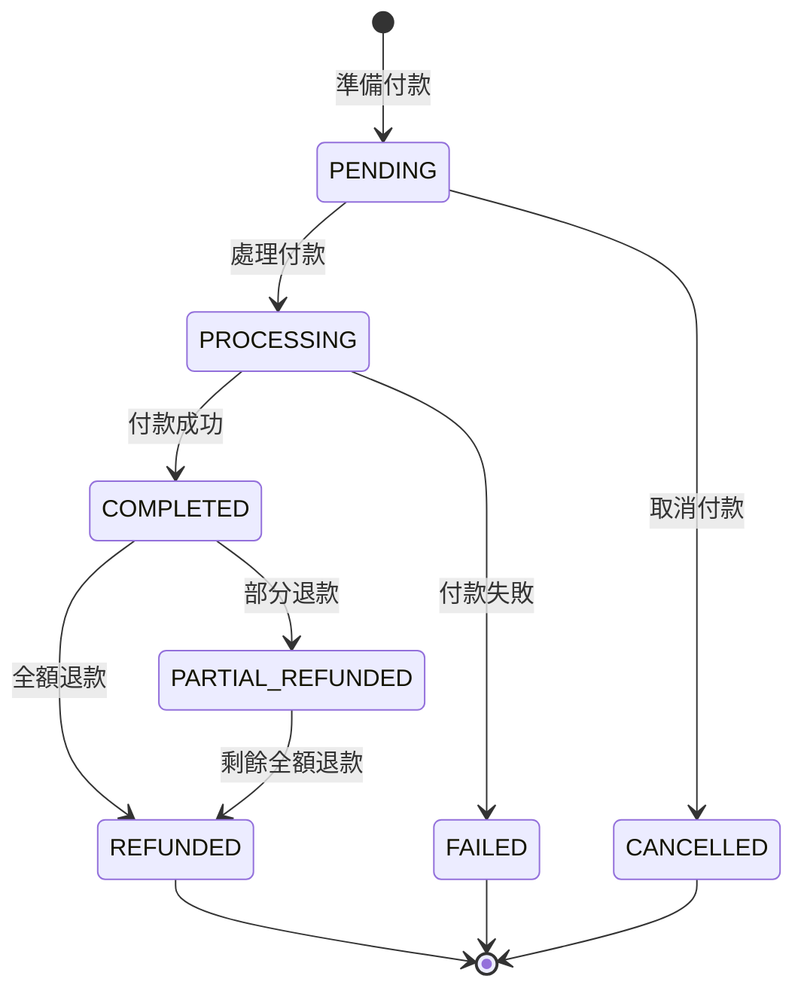

# 14. 付款服務 API (Payment Service API)

## 文檔資訊
- **版本**: 1.0.0
- **建立日期**: 2025-10-27
- **Base URL**: `https://api.example.com/payment/v1`
- **相關文檔**:
  - [11-API-Design-Principles.md](./11-API-Design-Principles.md)
  - [03-Order-Payment-Fulfillment-Flow.md](./03-Order-Payment-Fulfillment-Flow.md)
  - [18-Idempotency-Design.md](./18-Idempotency-Design.md)

---

## 目錄
1. [API 總覽](#api-總覽)
2. [付款處理 API](#付款處理-api)
3. [付款查詢 API](#付款查詢-api)
4. [付款回調 API](#付款回調-api)
5. [資料模型](#資料模型)

---

## API 總覽

### 端點清單

| HTTP Method | 端點 | 說明 | 認證 |
|-------------|------|------|------|
| **付款處理** | | | |
| POST | `/api/v1/payments/prepare` | 準備付款 | ✅ |
| POST | `/api/v1/payments/process` | 處理付款 | ✅ |
| POST | `/api/v1/payments/cancel` | 取消付款 | ✅ |
| POST | `/api/v1/payments/refund` | 退款 | ✅ |
| **付款查詢** | | | |
| GET | `/api/v1/payments/{paymentId}` | 查詢付款 | ✅ |
| GET | `/api/v1/payments/order/{orderId}` | 查詢訂單付款 | ✅ |
| GET | `/api/v1/payments` | 查詢付款列表 | ✅ |
| GET | `/api/v1/payments/{paymentId}/status` | 查詢付款狀態 | ✅ |
| **付款回調** (POS 系統呼叫) | | | |
| POST | `/api/v1/payments/callback/pos` | POS 付款回調 | ✅ (API Key) |
| POST | `/api/v1/payments/callback/gateway` | 第三方支付回調 | ✅ (Signature) |
| **退款處理** | | | |
| GET | `/api/v1/payments/{paymentId}/refunds` | 查詢退款記錄 | ✅ |
| POST | `/api/v1/payments/{paymentId}/refunds` | 建立退款 | ✅ |

---

## 付款處理 API

### 1. 準備付款

建立付款記錄，回傳付款資訊供 POS 系統或第三方支付使用。

```http
POST /api/v1/payments/prepare HTTP/1.1
Host: api.example.com
Authorization: Bearer {jwt_token}
Content-Type: application/json

{
  "orderId": "SO20251027001",
  "paymentMethod": "CASH",
  "amount": 9500.00,
  "currency": "TWD",
  "metadata": {
    "storeId": "STORE001",
    "cashierId": "CASHIER123",
    "terminalId": "TERM001"
  }
}
```

**支援的付款方式**:
- `CASH` - 現金
- `CREDIT_CARD` - 信用卡
- `DEBIT_CARD` - 金融卡
- `MOBILE_PAYMENT` - 行動支付
- `BANK_TRANSFER` - 銀行轉帳
- `STORE_CREDIT` - 門市儲值

**回應 200 OK**:
```json
{
  "success": true,
  "data": {
    "paymentId": "PAY20251027001",
    "orderId": "SO20251027001",
    "paymentMethod": "CASH",
    "amount": 9500.00,
    "currency": "TWD",
    "status": "PENDING",
    "expiresAt": "2025-10-27T12:00:00Z",
    "paymentDetails": {
      "merchantId": "MERCHANT001",
      "transactionId": "TXN20251027001",
      "qrCode": null,
      "paymentUrl": null
    },
    "createdTime": "2025-10-27T10:30:00Z"
  },
  "message": "付款已準備",
  "timestamp": "2025-10-27T10:30:00Z",
  "traceId": "abc-123-def-456"
}
```

---

### 2. 處理付款

處理付款（適用於系統內付款，如門市現金）。

```http
POST /api/v1/payments/process HTTP/1.1
Host: api.example.com
Authorization: Bearer {jwt_token}
Content-Type: application/json
Idempotency-Key: unique-key-123

{
  "paymentId": "PAY20251027001",
  "paymentMethod": "CASH",
  "amount": 9500.00,
  "receivedAmount": 10000.00,
  "changeAmount": 500.00,
  "metadata": {
    "cashierId": "CASHIER123",
    "receiptNo": "R20251027001"
  }
}
```

**冪等性保證**:
- 使用 `Idempotency-Key` Header 確保重複請求不會重複扣款
- Key 格式: UUID v4 或自訂唯一識別碼
- Key 有效期: 24 小時

**回應 200 OK**:
```json
{
  "success": true,
  "data": {
    "paymentId": "PAY20251027001",
    "orderId": "SO20251027001",
    "status": "COMPLETED",
    "paymentMethod": "CASH",
    "amount": 9500.00,
    "receivedAmount": 10000.00,
    "changeAmount": 500.00,
    "transactionId": "TXN20251027001",
    "receiptNo": "R20251027001",
    "paidAt": "2025-10-27T10:35:00Z",
    "processedBy": "CASHIER123"
  },
  "message": "付款成功",
  "timestamp": "2025-10-27T10:35:00Z",
  "traceId": "abc-123-def-456"
}
```

**錯誤回應 409 Conflict** (重複付款):
```json
{
  "success": false,
  "error": {
    "code": "PAYMENT_ALREADY_PROCESSED",
    "message": "付款已處理",
    "details": "此付款已在 2025-10-27T10:35:00Z 完成"
  },
  "timestamp": "2025-10-27T10:36:00Z",
  "traceId": "abc-123-def-456",
  "path": "/api/v1/payments/process"
}
```

**錯誤回應 422 Unprocessable Entity** (金額不符):
```json
{
  "success": false,
  "error": {
    "code": "PAYMENT_AMOUNT_MISMATCH",
    "message": "付款金額不符",
    "details": "預期金額: 9500.00, 實際付款: 9000.00"
  },
  "timestamp": "2025-10-27T10:35:00Z",
  "traceId": "abc-123-def-456",
  "path": "/api/v1/payments/process"
}
```

---

### 3. 取消付款

取消未完成的付款。

```http
POST /api/v1/payments/cancel HTTP/1.1
Host: api.example.com
Authorization: Bearer {jwt_token}
Content-Type: application/json

{
  "paymentId": "PAY20251027001",
  "reason": "客戶取消訂單",
  "remark": "客戶改變心意"
}
```

**回應 200 OK**:
```json
{
  "success": true,
  "data": {
    "paymentId": "PAY20251027001",
    "orderId": "SO20251027001",
    "status": "CANCELLED",
    "cancelledAt": "2025-10-27T10:40:00Z",
    "cancelledBy": "user123",
    "cancelReason": "客戶取消訂單"
  },
  "message": "付款已取消",
  "timestamp": "2025-10-27T10:40:00Z",
  "traceId": "abc-123-def-456"
}
```

**錯誤回應 409 Conflict** (已完成無法取消):
```json
{
  "success": false,
  "error": {
    "code": "PAYMENT_CANNOT_CANCEL",
    "message": "付款無法取消",
    "details": "付款已完成，請使用退款功能"
  },
  "timestamp": "2025-10-27T10:40:00Z",
  "traceId": "abc-123-def-456",
  "path": "/api/v1/payments/cancel"
}
```

---

### 4. 退款

對已完成的付款進行退款。

```http
POST /api/v1/payments/refund HTTP/1.1
Host: api.example.com
Authorization: Bearer {jwt_token}
Content-Type: application/json
Idempotency-Key: unique-refund-key-456

{
  "paymentId": "PAY20251027001",
  "refundAmount": 9500.00,
  "refundType": "FULL",
  "reason": "商品瑕疵",
  "metadata": {
    "approvedBy": "MANAGER001",
    "returnOrderId": "RET20251027001"
  }
}
```

**退款類型**:
- `FULL` - 全額退款
- `PARTIAL` - 部分退款

**回應 200 OK**:
```json
{
  "success": true,
  "data": {
    "refundId": "REF20251027001",
    "paymentId": "PAY20251027001",
    "orderId": "SO20251027001",
    "refundAmount": 9500.00,
    "refundType": "FULL",
    "status": "PROCESSING",
    "estimatedCompletionTime": "2025-10-30T10:45:00Z",
    "refundMethod": "ORIGINAL",
    "createdTime": "2025-10-27T10:45:00Z"
  },
  "message": "退款處理中，預計 3 個工作天完成",
  "timestamp": "2025-10-27T10:45:00Z",
  "traceId": "abc-123-def-456"
}
```

**錯誤回應 422 Unprocessable Entity** (退款金額超過):
```json
{
  "success": false,
  "error": {
    "code": "REFUND_AMOUNT_EXCEEDS",
    "message": "退款金額超過付款金額",
    "details": "付款金額: 9500.00, 已退款: 0.00, 請求退款: 10000.00"
  },
  "timestamp": "2025-10-27T10:45:00Z",
  "traceId": "abc-123-def-456",
  "path": "/api/v1/payments/refund"
}
```

---

## 付款查詢 API

### 1. 查詢付款

```http
GET /api/v1/payments/PAY20251027001 HTTP/1.1
Host: api.example.com
Authorization: Bearer {jwt_token}
```

**回應 200 OK**:
```json
{
  "success": true,
  "data": {
    "paymentId": "PAY20251027001",
    "orderId": "SO20251027001",
    "paymentMethod": "CASH",
    "amount": 9500.00,
    "currency": "TWD",
    "status": "COMPLETED",
    "transactionId": "TXN20251027001",
    "receiptNo": "R20251027001",
    "paidAt": "2025-10-27T10:35:00Z",
    "processedBy": "CASHIER123",
    "metadata": {
      "storeId": "STORE001",
      "terminalId": "TERM001"
    },
    "refunds": [],
    "timeline": [
      {
        "status": "PENDING",
        "timestamp": "2025-10-27T10:30:00Z",
        "operator": "user123"
      },
      {
        "status": "COMPLETED",
        "timestamp": "2025-10-27T10:35:00Z",
        "operator": "CASHIER123"
      }
    ],
    "createdTime": "2025-10-27T10:30:00Z",
    "updatedTime": "2025-10-27T10:35:00Z"
  },
  "timestamp": "2025-10-27T11:00:00Z",
  "traceId": "abc-123-def-456"
}
```

---

### 2. 查詢訂單付款

```http
GET /api/v1/payments/order/SO20251027001 HTTP/1.1
Host: api.example.com
Authorization: Bearer {jwt_token}
```

**回應 200 OK**:
```json
{
  "success": true,
  "data": {
    "orderId": "SO20251027001",
    "payments": [
      {
        "paymentId": "PAY20251027001",
        "paymentMethod": "CASH",
        "amount": 9500.00,
        "status": "COMPLETED",
        "paidAt": "2025-10-27T10:35:00Z"
      }
    ],
    "totalPaid": 9500.00,
    "totalRefunded": 0.00,
    "balance": 0.00,
    "paymentStatus": "FULLY_PAID"
  },
  "timestamp": "2025-10-27T11:05:00Z",
  "traceId": "abc-123-def-456"
}
```

---

### 3. 查詢付款列表

```http
GET /api/v1/payments?status=COMPLETED&page=0&size=20&sort=paidAt,desc HTTP/1.1
Host: api.example.com
Authorization: Bearer {jwt_token}
```

**Query Parameters**:
| 參數 | 類型 | 必填 | 說明 |
|------|------|------|------|
| status | string | ❌ | 付款狀態 |
| paymentMethod | string | ❌ | 付款方式 |
| startDate | date | ❌ | 開始日期 |
| endDate | date | ❌ | 結束日期 |
| page | int | ❌ | 頁碼 |
| size | int | ❌ | 每頁筆數 |
| sort | string | ❌ | 排序 |

**回應 200 OK**:
```json
{
  "success": true,
  "data": {
    "content": [
      {
        "paymentId": "PAY20251027001",
        "orderId": "SO20251027001",
        "paymentMethod": "CASH",
        "amount": 9500.00,
        "status": "COMPLETED",
        "paidAt": "2025-10-27T10:35:00Z"
      },
      {
        "paymentId": "PAY20251027002",
        "orderId": "SO20251027002",
        "paymentMethod": "CREDIT_CARD",
        "amount": 15800.00,
        "status": "COMPLETED",
        "paidAt": "2025-10-27T09:20:00Z"
      }
    ],
    "page": 0,
    "size": 20,
    "total": 234
  },
  "timestamp": "2025-10-27T11:10:00Z",
  "traceId": "abc-123-def-456"
}
```

---

### 4. 查詢付款狀態

快速查詢付款狀態（輕量級 API）。

```http
GET /api/v1/payments/PAY20251027001/status HTTP/1.1
Host: api.example.com
Authorization: Bearer {jwt_token}
```

**回應 200 OK**:
```json
{
  "success": true,
  "data": {
    "paymentId": "PAY20251027001",
    "status": "COMPLETED",
    "paidAt": "2025-10-27T10:35:00Z"
  },
  "timestamp": "2025-10-27T11:15:00Z",
  "traceId": "abc-123-def-456"
}
```

---

## 付款回調 API

### 1. POS 付款回調

POS 系統完成付款後，回調通知 SOM 系統。

```http
POST /api/v1/payments/callback/pos HTTP/1.1
Host: api.example.com
Authorization: ApiKey {api_key}
Content-Type: application/json
Idempotency-Key: pos-callback-789

{
  "orderId": "SO20251027001",
  "paymentId": "PAY20251027001",
  "transactionId": "POS_TXN_20251027001",
  "amount": 9500.00,
  "paymentMethod": "CASH",
  "status": "SUCCESS",
  "paidAt": "2025-10-27T10:35:00Z",
  "storeId": "STORE001",
  "terminalId": "TERM001",
  "receiptNo": "R20251027001",
  "signature": "sha256_signature_here"
}
```

**簽章驗證**:
```java
// 驗證 POS 回調簽章
String expectedSignature = hmacSha256(
    secret,
    orderId + paymentId + amount + paidAt
);

if (!expectedSignature.equals(receivedSignature)) {
    throw new SignatureVerificationException("簽章驗證失敗");
}
```

**回應 200 OK**:
```json
{
  "success": true,
  "data": {
    "orderId": "SO20251027001",
    "paymentId": "PAY20251027001",
    "status": "COMPLETED",
    "processed": true
  },
  "message": "付款回調處理成功",
  "timestamp": "2025-10-27T10:35:00Z",
  "traceId": "abc-123-def-456"
}
```

**錯誤回應 401 Unauthorized** (簽章錯誤):
```json
{
  "success": false,
  "error": {
    "code": "SIGNATURE_VERIFICATION_FAILED",
    "message": "簽章驗證失敗",
    "details": "請檢查 API Key 和簽章計算方式"
  },
  "timestamp": "2025-10-27T10:35:00Z",
  "traceId": "abc-123-def-456",
  "path": "/api/v1/payments/callback/pos"
}
```

---

### 2. 第三方支付回調

第三方支付完成後，回調通知。

```http
POST /api/v1/payments/callback/gateway HTTP/1.1
Host: api.example.com
Content-Type: application/json

{
  "merchantId": "MERCHANT001",
  "paymentId": "PAY20251027003",
  "transactionId": "GATEWAY_TXN_789",
  "amount": 15800.00,
  "currency": "TWD",
  "status": "SUCCESS",
  "paymentMethod": "CREDIT_CARD",
  "cardLast4": "1234",
  "paidAt": "2025-10-27T11:20:00Z",
  "gatewayResponse": {
    "authCode": "AUTH123456",
    "batchNo": "BATCH001"
  },
  "signature": "gateway_signature_here"
}
```

**回應 200 OK**:
```json
{
  "success": true,
  "message": "回調處理成功"
}
```

---

## 退款查詢 API

### 1. 查詢退款記錄

```http
GET /api/v1/payments/PAY20251027001/refunds HTTP/1.1
Host: api.example.com
Authorization: Bearer {jwt_token}
```

**回應 200 OK**:
```json
{
  "success": true,
  "data": [
    {
      "refundId": "REF20251027001",
      "paymentId": "PAY20251027001",
      "refundAmount": 9500.00,
      "refundType": "FULL",
      "status": "COMPLETED",
      "reason": "商品瑕疵",
      "createdTime": "2025-10-27T10:45:00Z",
      "completedTime": "2025-10-30T10:45:00Z",
      "approvedBy": "MANAGER001"
    }
  ],
  "timestamp": "2025-10-27T11:25:00Z",
  "traceId": "abc-123-def-456"
}
```

---

### 2. 建立退款

```http
POST /api/v1/payments/PAY20251027001/refunds HTTP/1.1
Host: api.example.com
Authorization: Bearer {jwt_token}
Content-Type: application/json

{
  "refundAmount": 5000.00,
  "refundType": "PARTIAL",
  "reason": "部分商品退貨",
  "items": [
    {
      "skuNo": "SKU000001",
      "quantity": 1,
      "refundAmount": 5000.00
    }
  ],
  "approvedBy": "MANAGER001"
}
```

**回應 200 OK**:
```json
{
  "success": true,
  "data": {
    "refundId": "REF20251027002",
    "paymentId": "PAY20251027001",
    "refundAmount": 5000.00,
    "refundType": "PARTIAL",
    "status": "PROCESSING",
    "estimatedCompletionTime": "2025-10-30T11:30:00Z",
    "createdTime": "2025-10-27T11:30:00Z"
  },
  "message": "退款處理中",
  "timestamp": "2025-10-27T11:30:00Z",
  "traceId": "abc-123-def-456"
}
```

---

## 資料模型

### PaymentRequest (付款請求)

```typescript
interface PaymentPrepareRequest {
  orderId: string;                // 訂單 ID (必填)
  paymentMethod: PaymentMethod;   // 付款方式 (必填)
  amount: number;                 // 金額 (必填, > 0)
  currency: string;               // 幣別 (預設 TWD)
  metadata?: Record<string, any>; // 自訂資料
}

interface PaymentProcessRequest {
  paymentId: string;              // 付款 ID (必填)
  paymentMethod: PaymentMethod;   // 付款方式 (必填)
  amount: number;                 // 金額 (必填)
  receivedAmount?: number;        // 收到金額 (現金專用)
  changeAmount?: number;          // 找零金額 (現金專用)
  metadata?: Record<string, any>; // 自訂資料
}

enum PaymentMethod {
  CASH = 'CASH',
  CREDIT_CARD = 'CREDIT_CARD',
  DEBIT_CARD = 'DEBIT_CARD',
  MOBILE_PAYMENT = 'MOBILE_PAYMENT',
  BANK_TRANSFER = 'BANK_TRANSFER',
  STORE_CREDIT = 'STORE_CREDIT'
}
```

### PaymentResponse (付款回應)

```typescript
interface PaymentResponse {
  paymentId: string;              // 付款 ID
  orderId: string;                // 訂單 ID
  paymentMethod: PaymentMethod;   // 付款方式
  amount: number;                 // 金額
  currency: string;               // 幣別
  status: PaymentStatus;          // 付款狀態
  transactionId?: string;         // 交易 ID
  receiptNo?: string;             // 收據號碼
  paidAt?: string;                // 付款時間 (ISO 8601)
  processedBy?: string;           // 處理人
  metadata?: Record<string, any>; // 自訂資料
  refunds?: RefundSummary[];      // 退款記錄
  timeline?: PaymentTimeline[];   // 狀態時間軸
  createdTime: string;            // 建立時間
  updatedTime: string;            // 更新時間
}

enum PaymentStatus {
  PENDING = 'PENDING',            // 待付款
  PROCESSING = 'PROCESSING',      // 處理中
  COMPLETED = 'COMPLETED',        // 已完成
  FAILED = 'FAILED',              // 失敗
  CANCELLED = 'CANCELLED',        // 已取消
  REFUNDED = 'REFUNDED',          // 已退款
  PARTIAL_REFUNDED = 'PARTIAL_REFUNDED'  // 部分退款
}

interface PaymentTimeline {
  status: PaymentStatus;          // 狀態
  timestamp: string;              // 時間戳記
  operator: string;               // 操作人
  remark?: string;                // 備註
}
```

### RefundRequest (退款請求)

```typescript
interface RefundRequest {
  paymentId: string;              // 付款 ID (必填)
  refundAmount: number;           // 退款金額 (必填, > 0)
  refundType: RefundType;         // 退款類型 (必填)
  reason: string;                 // 退款原因 (必填)
  items?: RefundItem[];           // 退款項目
  approvedBy?: string;            // 核准人
  metadata?: Record<string, any>; // 自訂資料
}

enum RefundType {
  FULL = 'FULL',                  // 全額退款
  PARTIAL = 'PARTIAL'             // 部分退款
}

interface RefundItem {
  skuNo: string;                  // 商品編號
  quantity: number;               // 退款數量
  refundAmount: number;           // 退款金額
}
```

---

## 錯誤碼

| 錯誤碼 | HTTP 狀態碼 | 說明 |
|--------|------------|------|
| PAYMENT_NOT_FOUND | 404 | 找不到付款記錄 |
| PAYMENT_ALREADY_PROCESSED | 409 | 付款已處理 |
| PAYMENT_AMOUNT_MISMATCH | 422 | 付款金額不符 |
| PAYMENT_EXPIRED | 422 | 付款已過期 |
| PAYMENT_CANNOT_CANCEL | 409 | 付款無法取消 |
| PAYMENT_FAILED | 500 | 付款處理失敗 |
| REFUND_AMOUNT_EXCEEDS | 422 | 退款金額超過 |
| REFUND_NOT_FOUND | 404 | 找不到退款記錄 |
| REFUND_ALREADY_PROCESSED | 409 | 退款已處理 |
| SIGNATURE_VERIFICATION_FAILED | 401 | 簽章驗證失敗 |
| GATEWAY_CONNECTION_ERROR | 502 | 支付閘道連線失敗 |
| GATEWAY_TIMEOUT | 504 | 支付閘道逾時 |

---

## 付款狀態流轉



---

## 冪等性設計

### Idempotency Key

所有會改變狀態的 API 都支援冪等性：

```http
POST /api/v1/payments/process HTTP/1.1
Idempotency-Key: unique-key-123
```

**Key 規則**:
- 長度: 16-128 字元
- 格式: UUID v4 或自訂唯一識別碼
- 有效期: 24 小時
- 儲存方式: Redis

**實作邏輯**:
```java
@PostMapping("/process")
public ResponseEntity<PaymentResponse> processPayment(
    @RequestHeader("Idempotency-Key") String idempotencyKey,
    @RequestBody PaymentProcessRequest request
) {
    // 1. 檢查 Redis 是否已處理
    String cacheKey = "idempotency:payment:" + idempotencyKey;
    Object cached = redisTemplate.opsForValue().get(cacheKey);

    if (cached != null) {
        // 已處理，返回快取的結果
        return ResponseEntity.ok((PaymentResponse) cached);
    }

    // 2. 使用分散式鎖確保只處理一次
    RLock lock = redissonClient.getLock("lock:" + cacheKey);
    try {
        boolean acquired = lock.tryLock(10, 30, TimeUnit.SECONDS);
        if (!acquired) {
            throw new PaymentException("無法取得處理鎖");
        }

        // 3. 處理付款
        PaymentResponse response = paymentService.process(request);

        // 4. 儲存結果到 Redis (TTL 24 小時)
        redisTemplate.opsForValue().set(cacheKey, response, Duration.ofHours(24));

        return ResponseEntity.ok(response);

    } finally {
        if (lock.isHeldByCurrentThread()) {
            lock.unlock();
        }
    }
}
```

---

## 相關文檔

- [03-Order-Payment-Fulfillment-Flow.md](./03-Order-Payment-Fulfillment-Flow.md) - 付款流程
- [18-Idempotency-Design.md](./18-Idempotency-Design.md) - 冪等性設計
- [37-Backend-External-Integration.md](./37-Backend-External-Integration.md) - 外部整合實作
