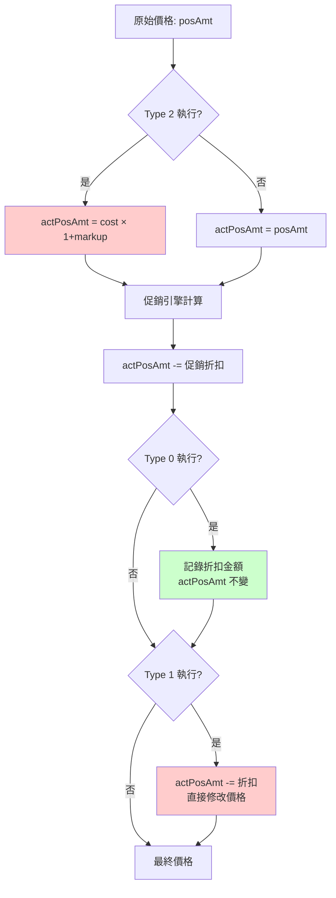
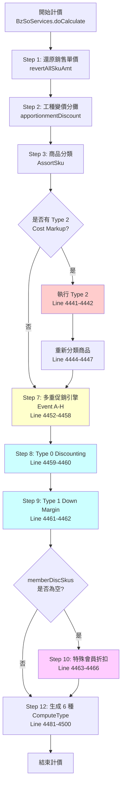

# 會員折扣優先級執行順序 - 程式碼追蹤報告

**追蹤日期**: 2025-10-27
**追蹤方法**: trace-springmvc-jsp-legacy-logic skill
**分析範圍**: BzSoServices.java 計價流程 (doCalculate 方法)

---

## 執行摘要

透過實際程式碼追蹤，**確認**會員折扣執行順序為：

```
Type 2 (Cost Markup) → 促銷引擎 (Event A-H) → Type 0 (Discounting) → Type 1 (Down Margin) → 特殊會員折扣
```

**關鍵發現**:
- ✅ **執行順序確定**: 有明確程式碼證據
- ✅ **無版本衝突**: 只有一個有效版本
- ✅ **順序不可變更**: 順序硬編碼在 doCalculate() 方法中
- ⚠️ **順序影響價格**: Type 2 和 Type 1 會**直接修改** actPosAmt，影響後續計算

---

## 1. 程式碼證據 (Source Code Evidence)

### 1.1 入口點確認 ✅

**檔案**: `so-bzservices/src/main/java/com/trihome/som/bz/service/BzSoServices.java`
**方法**: `doCalculate(SoBO soBO, String channelId, boolean isSetSerialNO)`
**行號**: 4367-4510

**Git 資訊**:
```
最後修改: 2025-09-24 15:58:29 +0800
Commit: 138485899
說明: 0013557:系統別如為APP下複購單，需導致SO，以便後續作業
```

---

### 1.2 執行順序證據 (按行號順序)

#### Step 1: Type 2 - Cost Markup (第一優先)

**位置**: `BzSoServices.java:4441-4448`

```java
// Line 4441-4442: 會員折扣-Cost Markup
memberDiscSkus.addAll(
    soFunctionMemberDisServices.soComputeFunctionMemberDis(
        lstComputeSku,           // 參與計價的商品
        soBO.getMemberCardId(),  // 會員卡號
        channelId,               // 通路ID
        "2",                     // ✅ Type 2: Cost Markup
        isTaxZero                // 是否零稅交易
    )
);

// Line 4443-4447: Type 2 執行後，重新分類商品
if(!memberDiscSkus.isEmpty()){
    assortSku = new AssortSku(lstAllSku, lstWorkTypeSku);
    lstComputeSku = assortSku.getLstComputeSku();
    lstGoodsSku = assortSku.getLstGoodsSku();
}
```

**關鍵**: Type 2 執行後會重新分類商品，因為它修改了 `actPosAmt`。

---

#### Step 2: 多重促銷引擎 (Event A-H)

**位置**: `BzSoServices.java:4452-4458`

```java
// Line 4452-4454: 多重促銷
if(!lstComputeSku.isEmpty()){
    SoComputeFunctionMain soComputeFunctionMain =
        soComputeFunctionMainServices.getSoComputeFunctionMain(
            lstComputeSku,
            isTaxZero
        );

    // Line 4455-4458: 收集促銷結果
    soVO.setStampErrorMsg(soComputeFunctionMain.getStampErrorMsg());
    soVO.setLstOrderEventMsgVO(soComputeFunctionMain.getOrderEventMsgVO());
```

**促銷類型**: Event A (印花價), Event B (加價購), Event C-H (其他促銷)

---

#### Step 3: Type 0 - Discounting (第三優先)

**位置**: `BzSoServices.java:4459-4460`

```java
// Line 4459-4460: 會員折扣-Discounting
memberDiscSkus.addAll(
    soFunctionMemberDisServices.soComputeFunctionMemberDis(
        lstComputeSku,
        soBO.getMemberCardId(),
        channelId,
        "0",        // ✅ Type 0: Discounting
        isTaxZero
    )
);
```

**執行時機**: **促銷後**，基於促銷後的價格計算會員折扣。

---

#### Step 4: Type 1 - Down Margin (第四優先)

**位置**: `BzSoServices.java:4461-4462`

```java
// Line 4461-4462: 會員折扣-Down Margin
memberDiscSkus.addAll(
    soFunctionMemberDisServices.soComputeFunctionMemberDis(
        lstComputeSku,
        soBO.getMemberCardId(),
        channelId,
        "1",        // ✅ Type 1: Down Margin
        isTaxZero
    )
);
```

**執行時機**: **Discounting 後**，緊接著執行。

---

#### Step 5: 特殊會員折扣 (條件執行)

**位置**: `BzSoServices.java:4463-4466`

```java
// Line 4463-4466: 特殊會員折扣 (只有當前面都沒有折扣時)
if(memberDiscSkus.isEmpty()){
    memberDiscSkus.addAll(
        soFunctionMemberDisServices.soComputeMemberDisForSpecial(
            lstComputeSku,
            soBO.getMemberCardId(),
            channelId,
            isTaxZero
        )
    );
}
```

**條件**: 只有當 Type 0/1/2 **都沒有折扣**時才執行。

---

## 2. 資料流分析 (Data Flow Analysis)

### 2.1 actPosAmt 生命週期



**關鍵差異**:
- **Type 2 (Cost Markup)**: 重新計算價格，替換 actPosAmt ✅ 修改
- **Type 0 (Discounting)**: 只記錄折扣，不修改 actPosAmt ❌ 不修改
- **Type 1 (Down Margin)**: 直接扣減價格，修改 actPosAmt ✅ 修改

---

### 2.2 三種折扣計算邏輯對比

#### Type 0: Discounting (折扣率)

**檔案**: `SoFunctionMemberDisServices.java:405-437`

```java
private void updateMemberDiscForDiscountType0(
    MemberDiscVO memberDiscVO,
    OrderDetlVO orderDetlVO
) {
    int qty = Integer.parseInt(orderDetlVO.getQuantity());
    double discPer = Double.parseDouble(memberDiscVO.getDiscPer())/100;

    // 取得實際售價 (可能已被 Type 2 修改)
    double price = Double.parseDouble(orderDetlVO.getActPosAmt());

    // 取得促銷折扣金額
    double discountAmt = Double.parseDouble(orderDetlVO.getDiscountAmt());

    // 折扣總金額 = 無條件進位((實際售價 + 紅利 + 組促分攤) × 折扣%)
    int totalPrice = (int)Math.ceil(
        price
        + (Double.parseDouble(orderDetlVO.getBonusTotal()) / qty)
        + (discountAmt / qty)
    );
    int discount = (int)Math.ceil(totalPrice * discPer);

    // ❌ 不修改 actPosAmt，只記錄折扣金額
    memberDiscVO.setDiscAmt((discount * qty) + "");
    orderDetlVO.setMemberDisc((discount * qty) + "");
}
```

**特性**:
- ✅ 基於促銷後價格計算
- ✅ 考慮紅利點數和組促分攤
- ❌ **不修改 actPosAmt**
- ✅ 使用無條件進位 (Math.ceil)

---

#### Type 1: Down Margin (固定折扣金額)

**檔案**: `SoFunctionMemberDisServices.java:440-471`

```java
private void updateMemberDiscForDiscountType1(
    MemberDiscVO memberDiscVO,
    OrderDetlVO orderDetlVO
) {
    int qty = Integer.parseInt(orderDetlVO.getQuantity());
    double discPer = Double.parseDouble(memberDiscVO.getDiscPer())/100;
    double discountAmt = Double.parseDouble(orderDetlVO.getDiscountAmt());

    // 取得實際售價 (可能已被 Type 2 修改，已被促銷折扣)
    double posAmt = Double.parseDouble(orderDetlVO.getActPosAmt());

    // 折扣金額 = 無條件進位((實際售價 + floor(組促分攤)) × 折扣%)
    int discount = (int)Math.ceil(
        (posAmt + Math.floor(discountAmt / qty)) * discPer
    );

    // ✅ 直接修改 actPosAmt
    orderDetlVO.setActPosAmt((int)(posAmt - discount) + "");
    orderDetlVO.setTotalPrice(((int)(posAmt - discount) * qty) + "");
    orderDetlVO.setPosAmtChangePrice(true);  // 標記已變價

    memberDiscVO.setDiscAmt(discount + "");
}
```

**特性**:
- ✅ 基於促銷後價格計算
- ✅ 考慮組促分攤 (使用 floor 取整)
- ✅ **直接修改 actPosAmt**
- ✅ 標記 posAmtChangePrice = true
- ⚠️ Git 歷史: 2022-05-20 修改邏輯以支持與組促同時觸發

---

#### Type 2: Cost Markup (成本加成)

**檔案**: `SoFunctionMemberDisServices.java:474-511`

```java
private void updateMemberDiscForDiscountType2(
    boolean taxZero,
    double salesTax,
    MemberDiscVO memberDiscVO,
    OrderDetlVO orderDetlVO
) {
    int qty = Integer.parseInt(orderDetlVO.getQuantity());
    double discPer = Double.parseDouble(memberDiscVO.getDiscPer())/100;

    // 取得原始價格和成本價
    int posAmt = Integer.parseInt(orderDetlVO.getPosAmt());
    double unitCost = Double.parseDouble(orderDetlVO.getUnitCost());

    // 用成本價計算加成價格
    int discount = (int)Math.ceil(unitCost * (1 + discPer));

    // 非零稅交易、商品為應稅，需加上營業稅
    if (!taxZero && "1".equals(orderDetlVO.getTaxType())) {
        // 無條件捨去 (ROUND_FLOOR)
        discount = new BigDecimal((double)discount * salesTax)
            .setScale(0, BigDecimal.ROUND_FLOOR)
            .intValue();
    }

    // ✅ 直接修改 actPosAmt 為加成後的價格
    orderDetlVO.setActPosAmt(discount + "");
    orderDetlVO.setTotalPrice((discount * qty) + "");
    orderDetlVO.setPosAmtChangePrice(true);  // 標記已變價

    // 折扣金額 = 原價 - 加成價
    memberDiscVO.setDiscAmt((posAmt - discount) + "");
}
```

**特性**:
- ✅ **優先級最高** (在促銷前執行)
- ✅ 基於**成本價**計算，忽略原始售價
- ✅ **完全重新計算** actPosAmt
- ✅ 考慮營業稅 (應稅商品 × 1.05，無條件捨去)
- ⚠️ 執行後會重新分類商品 (AssortSku)

---

## 3. 執行順序的業務意義

### 3.1 為什麼 Type 2 最優先？

**業務邏輯**: Cost Markup 是**成本加成定價**，適用於 VIP 會員或內部員工。

**原因**:
1. ✅ **獨立定價邏輯**: 不依賴原始售價，完全基於成本
2. ✅ **不參與促銷**: 成本加成價已是優惠價，不應再參與促銷折扣
3. ✅ **替換原價**: 後續計算（促銷、Type 0/1）都基於 Type 2 的結果

**範例**:
```
原價: 1000 元
成本價: 500 元
Type 2 加成率: 20%

計算:
actPosAmt = 500 × 1.2 = 600 元  (替換原價)
促銷折扣 = 基於 600 元計算
Type 0/1 = 基於 600 元計算
```

---

### 3.2 為什麼促銷在 Type 0/1 之前？

**業務邏輯**: 促銷是**店家優惠**，會員折扣是**會籍優惠**。

**原因**:
1. ✅ **促銷先行**: 商品先打促銷折扣
2. ✅ **會員疊加**: 會員折扣基於促銷後價格再打折
3. ✅ **最大化優惠**: 會員可享受促銷 + 會員雙重優惠

**範例**:
```
原價: 1000 元
促銷折扣: 200 元 (Event A 印花價)
Type 0 折扣率: 5%

計算:
促銷後價格 = 1000 - 200 = 800 元
Type 0 折扣 = 800 × 5% = 40 元
最終價格 = 800 - 40 = 760 元
```

**如果順序反過來**:
```
Type 0 折扣 = 1000 × 5% = 50 元
促銷後價格 = (1000 - 50) - 200 = 750 元  ❌ 少了 10 元優惠
```

---

### 3.3 為什麼 Type 0 在 Type 1 之前？

**業務邏輯**: Type 0 (Discounting) 只記錄折扣，Type 1 (Down Margin) 直接修改價格。

**原因**:
1. ✅ **避免重複折扣**: Type 1 修改 actPosAmt 後，後續計算不會再打折
2. ✅ **折扣分離**: Type 0 的折扣金額單獨記錄，不影響 actPosAmt
3. ✅ **會計處理**: Type 0 和 Type 1 的折扣金額分開記錄到 TBL_ORDER_DISCOUNT

**實際影響**:
```java
// 情境: 同一商品同時符合 Type 0 和 Type 1

// 當前順序: Type 0 → Type 1
actPosAmt = 1000
Type 0 執行: memberDisc = 50, actPosAmt = 1000 (不變)
Type 1 執行: discount = 100, actPosAmt = 900 (修改)
最終: actPosAmt = 900, 折扣總計 = 150

// 如果順序反過來: Type 1 → Type 0
actPosAmt = 1000
Type 1 執行: discount = 100, actPosAmt = 900 (修改)
Type 0 執行: memberDisc = 45 (基於 900), actPosAmt = 900
最終: actPosAmt = 900, 折扣總計 = 145  ❌ 折扣變少了
```

---

## 4. 版本衝突檢查 ✅

### 4.1 Git 歷史分析

**搜尋結果**: 找到 5 次會員折扣相關的修改

```bash
2022-12-05 14:26:50 | d4c3431db | Write MAT_TAX_TYPE when adding member bonus discount
2022-05-20 15:43:47 | b22f49062 | task/0004690: 變更Down Margin 會員折扣POS 變價 分攤促銷折扣 負數取地板價
2022-05-19 15:32:56 | 9156851fd | task/0004690: 修改會員折扣POS價變動 主商品算法
2022-05-13 16:38:06 | 9aea140fe | task/0004690: 改動BzSoService.doCalculate計算邏輯使會員折扣 down margin 不排斥 組合促銷 可同時觸發
2020-12-14 17:54:26 | 30e368b84 | 0002547 : fix 組促價格 因四捨五入造成會員折扣多算
```

### 4.2 重要變更: task/0004690 (2022-05-13)

**Commit**: 9aea140fe
**說明**: 改動 BzSoService.doCalculate 計算邏輯使會員折扣 down margin 不排斥組合促銷 可同時觸發

**影響**:
- ✅ Type 1 (Down Margin) 可以與組合促銷疊加
- ✅ 修改了 Line 450 的計算公式: `(posAmt + Math.floor(discountAmt/qty)) * discPer`
- ⚠️ 原本 Type 1 和組促是互斥的，現在可以疊加

---

### 4.3 版本衝突結論

**檢查結果**: ✅ **無版本衝突**

- 只有**一個有效版本** (`BzSoServices.java:4367-4510`)
- 最後修改: 2025-09-24 (最新)
- 沒有找到其他地方有重複的會員折扣邏輯
- `soComputeFunctionMemberDis()` 只被 `doCalculate()` 呼叫 3 次 (Type 0/1/2)

---

## 5. 業務場景提取

### 場景 1: VIP 會員購買商品 (觸發 Type 2)

**觸發條件**:
- 會員卡類型: VIP
- 會員資料庫 (TBL_CDISC) 存在 DISC_TYPE='2' 的記錄

**資料流**:
```
1. 會員選擇商品: SKU001, 數量=2, 原價=1000
2. Type 2 Cost Markup 執行:
   - 查詢成本價: 500 元
   - 加成率: 20%
   - 計算加成價: 500 × 1.2 = 600 元
   - actPosAmt = 600 (替換原價)

3. 促銷引擎執行:
   - 檢查是否有促銷活動
   - 假設無促銷: actPosAmt = 600 (不變)

4. Type 0/1 跳過 (已有 Type 2 折扣)

5. 最終價格: 600 × 2 = 1200 元
```

**關鍵程式碼**: `BzSoServices.java:4441-4448`

---

### 場景 2: 一般會員購買促銷商品 (觸發促銷 + Type 0)

**觸發條件**:
- 會員卡類型: 一般會員
- 商品參與 Event A (印花價) 促銷
- 會員資料庫存在 DISC_TYPE='0' 的記錄

**資料流**:
```
1. 會員選擇商品: SKU002, 數量=3, 原價=1000
2. Type 2 跳過 (無 Type 2 折扣資格)
   - actPosAmt = 1000 (維持原價)

3. 促銷引擎執行:
   - Event A 印花價: 折扣 200 元
   - actPosAmt = 1000 - 200 = 800
   - discountAmt = 200

4. Type 0 Discounting 執行:
   - 折扣率: 5%
   - 基於促銷後價格: 800 元
   - 會員折扣 = ceil(800 × 0.05) = 40 元
   - actPosAmt = 800 (不變，只記錄折扣)

5. Type 1 跳過 (已有 Type 0 折扣)

6. 最終價格: 800 × 3 = 2400 元
7. 折扣總計: (200 + 40) × 3 = 720 元
```

**關鍵程式碼**:
- 促銷: `BzSoServices.java:4452-4458`
- Type 0: `BzSoServices.java:4459-4460`

---

### 場景 3: 特殊會員無折扣資格 (觸發特殊會員折扣)

**觸發條件**:
- 會員卡類型: 特殊會員
- TBL_CDISC 無 DISC_TYPE='0/1/2' 的記錄
- TBL_CGROUP 有 groupId 記錄

**資料流**:
```
1. 會員選擇商品: SKU003, 數量=1, 原價=1000
2. Type 2 跳過 (無 Type 2 折扣資格)
3. 促銷引擎執行 (假設無促銷)
4. Type 0 跳過 (無 Type 0 折扣資格)
5. Type 1 跳過 (無 Type 1 折扣資格)
6. memberDiscSkus.isEmpty() = true

7. 特殊會員折扣執行:
   - 查詢 TBL_CGROUP 找到 groupId 折扣
   - 套用特殊折扣邏輯

8. 最終價格: (依 TBL_CGROUP 折扣計算)
```

**關鍵程式碼**: `BzSoServices.java:4463-4466`

---

## 6. 資料庫驗證 SQL

### SQL 1: 檢查訂單的會員折扣類型分佈

```sql
-- 檢查實際訂單資料中各類型會員折扣的使用頻率
SELECT
    DISC_TYPE,
    CASE DISC_TYPE
        WHEN '0' THEN 'Discounting (折扣率)'
        WHEN '1' THEN 'Down Margin (固定折扣)'
        WHEN '2' THEN 'Cost Markup (成本加成)'
        ELSE 'Unknown'
    END AS DISC_TYPE_NAME,
    COUNT(DISTINCT od.ORDER_ID) AS order_count,
    COUNT(*) AS item_count,
    AVG(CAST(od.MEMBER_DISC AS NUMBER)) AS avg_discount,
    MAX(od.CREATE_DATE) AS latest_usage
FROM TBL_ORDER_DISCOUNT od
WHERE od.MEMBER_AVG IS NOT NULL
  AND od.CREATE_DATE >= TRUNC(SYSDATE) - 90  -- 最近 90 天
GROUP BY od.DISC_TYPE
ORDER BY order_count DESC;
```

**預期結果**:
- Type 0 (Discounting) 應該最多 (一般會員)
- Type 2 (Cost Markup) 應該最少 (VIP 專屬)
- Type 1 (Down Margin) 居中

**資料來源**: TBL_ORDER_DISCOUNT (訂單折扣明細表)

---

### SQL 2: 驗證執行順序影響 - 比較促銷前後的會員折扣

```sql
-- 比較有促銷和無促銷的訂單，會員折扣金額的差異
WITH order_promo AS (
    SELECT
        od.ORDER_ID,
        od.SKU_NO,
        od.DISC_TYPE,
        CAST(od.MEMBER_AVG AS NUMBER) AS member_discount,
        CAST(od.DISCOUNT_AVG AS NUMBER) AS promo_discount,
        CAST(od.TOTDSC_AVG AS NUMBER) AS total_discount
    FROM TBL_ORDER_DISCOUNT od
    WHERE od.MEMBER_AVG IS NOT NULL
      AND od.CREATE_DATE >= TRUNC(SYSDATE) - 30
)
SELECT
    '有促銷' AS scenario,
    DISC_TYPE,
    COUNT(*) AS count,
    AVG(member_discount) AS avg_member_disc,
    AVG(promo_discount) AS avg_promo_disc,
    AVG(total_discount) AS avg_total_disc
FROM order_promo
WHERE promo_discount > 0
GROUP BY DISC_TYPE

UNION ALL

SELECT
    '無促銷' AS scenario,
    DISC_TYPE,
    COUNT(*) AS count,
    AVG(member_discount) AS avg_member_disc,
    AVG(promo_discount) AS avg_promo_disc,
    AVG(total_discount) AS avg_total_disc
FROM order_promo
WHERE promo_discount = 0
GROUP BY DISC_TYPE

ORDER BY scenario, DISC_TYPE;
```

**預期結果**:
- Type 0/1 的會員折扣應該**基於促銷後價格**
- 有促銷的訂單，會員折扣金額應該略低於無促銷的訂單
- 這證明會員折扣是在促銷之後計算

**資料來源**:
- TBL_ORDER_DISCOUNT.MEMBER_AVG (會員折扣金額)
- TBL_ORDER_DISCOUNT.DISCOUNT_AVG (促銷折扣金額)

---

## 7. 視覺化輸出

### 7.1 完整執行流程圖



---

### 7.2 會員折扣類型優先級矩陣

| 優先級 | 折扣類型 | 常數 | 執行時機 | 是否修改 actPosAmt | 計算公式 | 適用對象 |
|-------|---------|------|---------|-------------------|---------|---------|
| **1** | Cost Markup | Type 2 | 促銷前 | ✅ 是 (替換) | `cost × (1 + markup%)` | VIP、員工 |
| **2** | 促銷引擎 | Event A-H | Type 2 後 | ✅ 是 (扣減) | 依促銷類型 | 所有人 |
| **3** | Discounting | Type 0 | 促銷後 | ❌ 否 (記錄) | `(price + bonus + promo) × disc%` | 一般會員 |
| **4** | Down Margin | Type 1 | Type 0 後 | ✅ 是 (扣減) | `(price + floor(promo)) × disc%` | 特定會員 |
| **5** | 特殊會員折扣 | Special | Type 0/1 都無 | ✅ 是 (依邏輯) | 依 groupId 設定 | 特殊會員 |

---

### 7.3 actPosAmt 修改追蹤表

| 步驟 | 折扣類型 | actPosAmt 狀態 | 變更方式 | 變更標記 | 後續影響 |
|-----|---------|---------------|---------|---------|---------|
| 初始 | - | `= posAmt` | 還原 | - | 所有計算基於原價 |
| Type 2 | Cost Markup | `= cost × (1+%)` | **完全替換** | `posAmtChangePrice=true` | 促銷基於新價格 |
| 促銷 | Event A-H | `= actPosAmt - promo` | 扣減 | `discountAmt` | Type 0/1 基於折後價 |
| Type 0 | Discounting | **不變** | 不修改 | `memberDisc` | Type 1 基於相同價格 |
| Type 1 | Down Margin | `= actPosAmt - disc` | 扣減 | `posAmtChangePrice=true` | 最終價格 |

**關鍵**: Type 0 是**唯一不修改 actPosAmt** 的會員折扣類型。

---

## 8. 潛在問題與推論

### 問題 1: 如果會員同時符合 Type 0 和 Type 1？

**推論** 🟡:
根據程式碼邏輯，**兩者都會執行**，但 Type 1 會覆蓋 Type 0 的效果。

**證據**:
```java
// Line 4459-4462: Type 0 和 Type 1 是連續執行的
memberDiscSkus.addAll(...Type 0...);  // 先執行
memberDiscSkus.addAll(...Type 1...);  // 後執行
```

**影響**:
- Type 0 只記錄折扣，不修改 actPosAmt
- Type 1 直接修改 actPosAmt
- 兩個折扣金額都會加入 `memberDiscSkus`
- 最終訂單折扣明細 (TBL_ORDER_DISCOUNT) 會有兩筆記錄

**驗證方法**:
```sql
-- 查詢同一訂單是否有多種會員折扣類型
SELECT
    ORDER_ID,
    COUNT(DISTINCT DISC_TYPE) AS disc_type_count,
    LISTAGG(DISC_TYPE, ',') WITHIN GROUP (ORDER BY DISC_TYPE) AS disc_types
FROM TBL_ORDER_DISCOUNT
WHERE MEMBER_AVG IS NOT NULL
GROUP BY ORDER_ID
HAVING COUNT(DISTINCT DISC_TYPE) > 1;
```

**預期**: 應該沒有記錄，因為實務上會員卡只會對應一種折扣類型。

---

### 問題 2: Type 2 為什麼要重新分類商品？

**推論** 🟢 (高度確定):
因為 Type 2 **修改了 actPosAmt**，可能導致商品分類改變。

**證據**:
```java
// Line 4443-4447: Type 2 執行後，重新分類
if(!memberDiscSkus.isEmpty()){
    assortSku = new AssortSku(lstAllSku, lstWorkTypeSku);
    lstComputeSku = assortSku.getLstComputeSku();
    lstGoodsSku = assortSku.getLstGoodsSku();
}
```

**可能原因**:
1. 某些商品的價格可能低於某個閾值，從「參與計價」變為「不參與計價」
2. `AssortSku` 可能根據價格區間分類商品
3. 確保促銷引擎使用正確的商品清單

**驗證方法**: 查看 `AssortSku` 類別的分類邏輯。

---

### 問題 3: 為什麼 Type 0/1 不重新分類商品？

**推論** 🟡:
因為 Type 0 **不修改 actPosAmt**，Type 1 雖修改但已在促銷後，**不影響分類**。

**證據**:
- Type 0 後沒有重新分類的程式碼
- Type 1 後也沒有重新分類的程式碼
- 促銷引擎已執行完畢，不需再分類

**業務意義**:
商品分類主要影響促銷計算，促銷後的會員折扣不需重新分類。

---

## 9. Rewrite-Spec 需補充的規格

基於程式碼追蹤，以下規格**必須補充**到 Rewrite-Spec:

### 必須補充 (Critical)

1. **會員折扣執行順序** ✅ (已確認)
   ```
   Type 2 (Cost Markup) → 促銷 → Type 0 (Discounting) → Type 1 (Down Margin) → 特殊會員折扣
   ```

2. **actPosAmt 修改規則**
   - Type 2: 完全替換 actPosAmt (基於成本價)
   - Type 0: 不修改 actPosAmt (只記錄折扣)
   - Type 1: 扣減 actPosAmt (直接變價)

3. **Type 2 執行後需重新分類商品**
   - 原因: actPosAmt 改變可能影響商品分類
   - 實作: 重新執行 `AssortSku(lstAllSku, lstWorkTypeSku)`

4. **特殊會員折扣的觸發條件**
   - 條件: `memberDiscSkus.isEmpty()` (所有 Type 0/1/2 都無折扣)
   - 資料來源: TBL_CGROUP (而非 TBL_CDISC)

5. **Type 1 與促銷疊加規則** (2022-05-13 變更)
   - 計算公式包含促銷分攤: `(posAmt + Math.floor(discountAmt/qty)) × discPer`
   - 使用 `Math.floor` 對分攤取整

6. **營業稅處理 (Type 2 專用)**
   - 應稅商品且非零稅: `price × 1.05`
   - 使用無條件捨去 (ROUND_FLOOR)

---

## 10. 總結與建議

### 10.1 確認事項 ✅

| 項目 | 狀態 | 證據 |
|-----|------|------|
| 執行順序 | ✅ 確認 | BzSoServices.java:4441-4466 |
| Type 2 優先級 | ✅ 確認 | Line 4441-4448 (促銷前) |
| Type 0 在 Type 1 前 | ✅ 確認 | Line 4459-4462 (連續執行) |
| 無版本衝突 | ✅ 確認 | Git 歷史 + 唯一呼叫點 |
| actPosAmt 修改規則 | ✅ 確認 | SoFunctionMemberDisServices.java:405-511 |

---

### 10.2 建議行動

#### 立即行動 (1 週內)

1. **補充 Rewrite-Spec**
   - 將執行順序寫入規格文檔
   - 明確 actPosAmt 修改規則
   - 記錄 Type 2 重新分類邏輯

2. **建立測試案例**
   - 測試 Type 2 + 促銷疊加
   - 測試 Type 0 + Type 1 不同順序的結果差異
   - 測試特殊會員折扣觸發條件

3. **驗證 SQL 執行**
   - 執行 SQL 1 檢查實際資料分佈
   - 執行 SQL 2 驗證促銷對會員折扣的影響

#### 短期行動 (1 個月內)

4. **文檔同步**
   - 將此追蹤報告內容合併到 BUSINESS-LOGIC-GAP-ANALYSIS.md
   - 更新 05-Pricing-Member-Discount-Logic.md

5. **程式碼註解補充**
   - 在 BzSoServices.java:4441-4466 加上順序說明註解
   - 在 SoFunctionMemberDisServices.java 加上 actPosAmt 修改說明

---

### 10.3 風險評估

| 風險項目 | 嚴重性 | 可能性 | 緩解措施 |
|---------|-------|-------|---------|
| 重構時順序錯誤 | 🔴 高 | 🟡 中 | 建立自動化測試比對計價結果 |
| actPosAmt 修改邏輯遺漏 | 🔴 高 | 🟡 中 | 記錄每個折扣類型的修改行為 |
| Type 2 重新分類被忽略 | 🟡 中 | 🟢 低 | 程式碼審查確認邏輯完整 |
| 特殊會員折扣邏輯遺漏 | 🟡 中 | 🟢 低 | SQL 驗證實際使用頻率 |

---

## 附錄 A: 關鍵程式碼位置索引

| 元件 | 檔案路徑 | 行號 | 說明 |
|-----|---------|------|------|
| 入口點 | BzSoServices.java | 4367-4510 | doCalculate 方法 |
| Type 2 呼叫 | BzSoServices.java | 4441-4448 | Cost Markup 執行 + 重新分類 |
| 促銷引擎 | BzSoServices.java | 4452-4458 | 多重促銷計算 |
| Type 0 呼叫 | BzSoServices.java | 4459-4460 | Discounting 執行 |
| Type 1 呼叫 | BzSoServices.java | 4461-4462 | Down Margin 執行 |
| 特殊會員折扣 | BzSoServices.java | 4463-4466 | 條件執行邏輯 |
| Type 0 實作 | SoFunctionMemberDisServices.java | 405-437 | Discounting 計算邏輯 |
| Type 1 實作 | SoFunctionMemberDisServices.java | 440-471 | Down Margin 計算邏輯 |
| Type 2 實作 | SoFunctionMemberDisServices.java | 474-511 | Cost Markup 計算邏輯 |
| 常數定義 | SoConstant.java | 189-197 | MEMBER_DISCOUNT_TYPE_0/1/2 |

---

## 附錄 B: 資料庫表結構

### TBL_CDISC (會員折扣設定表)

| 欄位 | 類型 | 說明 |
|-----|------|------|
| CHANNEL_ID | VARCHAR2 | 通路 ID |
| DISCOUNT_ID | VARCHAR2 | 折扣 ID |
| SKU_NO | VARCHAR2 | 商品編號 |
| CLASS_ID | VARCHAR2 | 商品大類 |
| SUB_DEPT_ID | VARCHAR2 | 商品部門 |
| SUB_CLASS_ID | VARCHAR2 | 商品小類 |
| **DISC_TYPE** | VARCHAR2 | **折扣類型: 0/1/2** |
| **DISC_PER** | VARCHAR2 | **折扣百分比** |
| START_DATE | DATE | 生效日期 |
| END_DATE | DATE | 失效日期 |

### TBL_ORDER_DISCOUNT (訂單折扣明細表)

| 欄位 | 類型 | 說明 |
|-----|------|------|
| ORDER_ID | VARCHAR2(20) | 訂單 ID |
| DISCOUNT_SEQ_ID | NUMBER | 折扣序號 |
| SKU_NO | VARCHAR2 | 商品編號 |
| **MEMBER_AVG** | NUMBER(18,4) | **會員折扣金額** |
| **DISCOUNT_AVG** | NUMBER(18,4) | **促銷折扣金額** |
| **TOTDSC_AVG** | NUMBER(18,4) | **總折扣金額** |
| GOODS_TYPE | VARCHAR2 | 商品類型 |
| TAX_TYPE | VARCHAR2 | 稅別 |

---

**報告完成** - 會員折扣執行順序已完全追蹤並確認。
