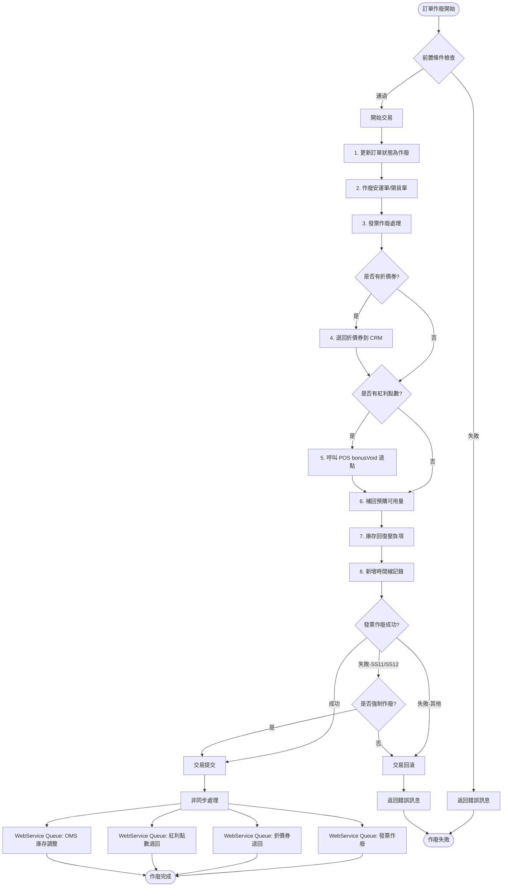
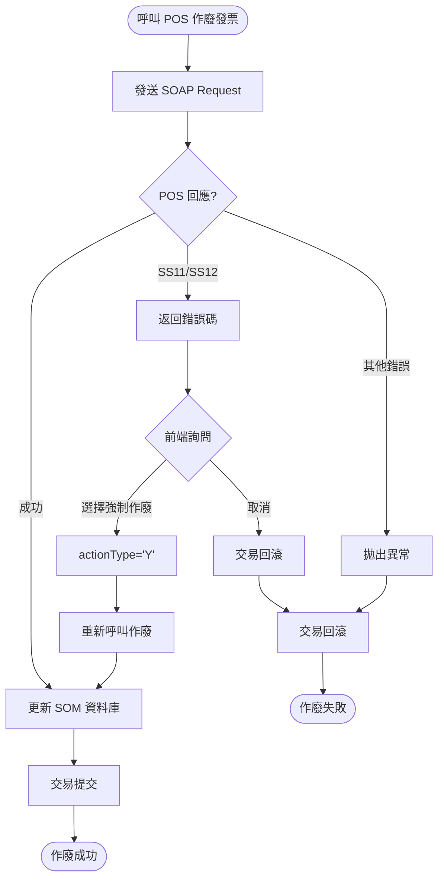
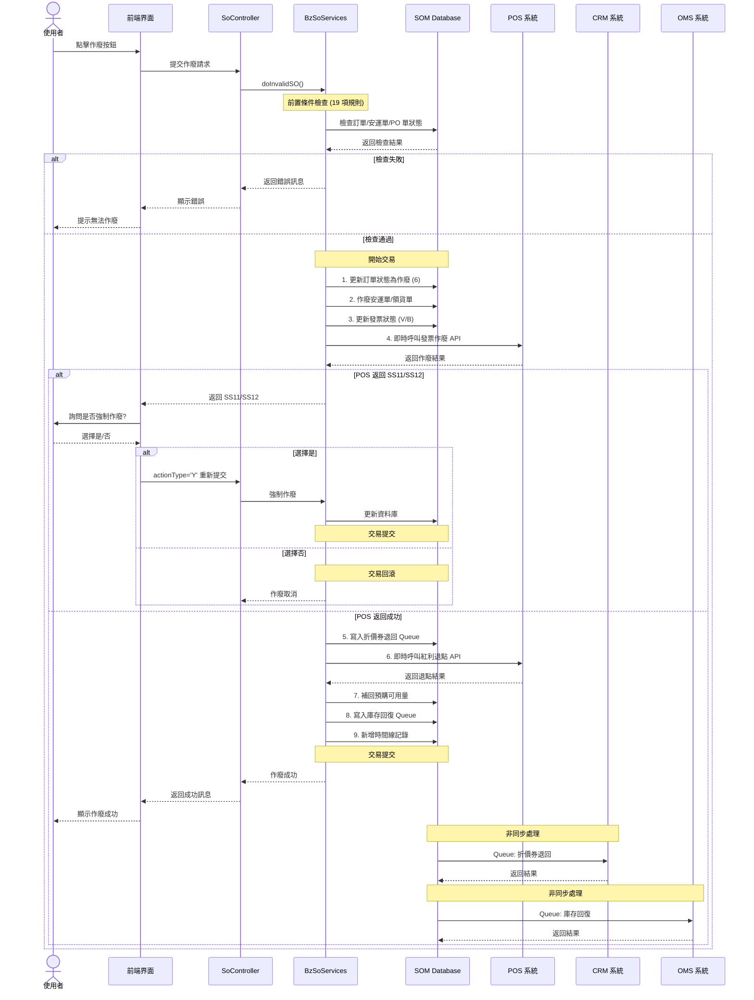
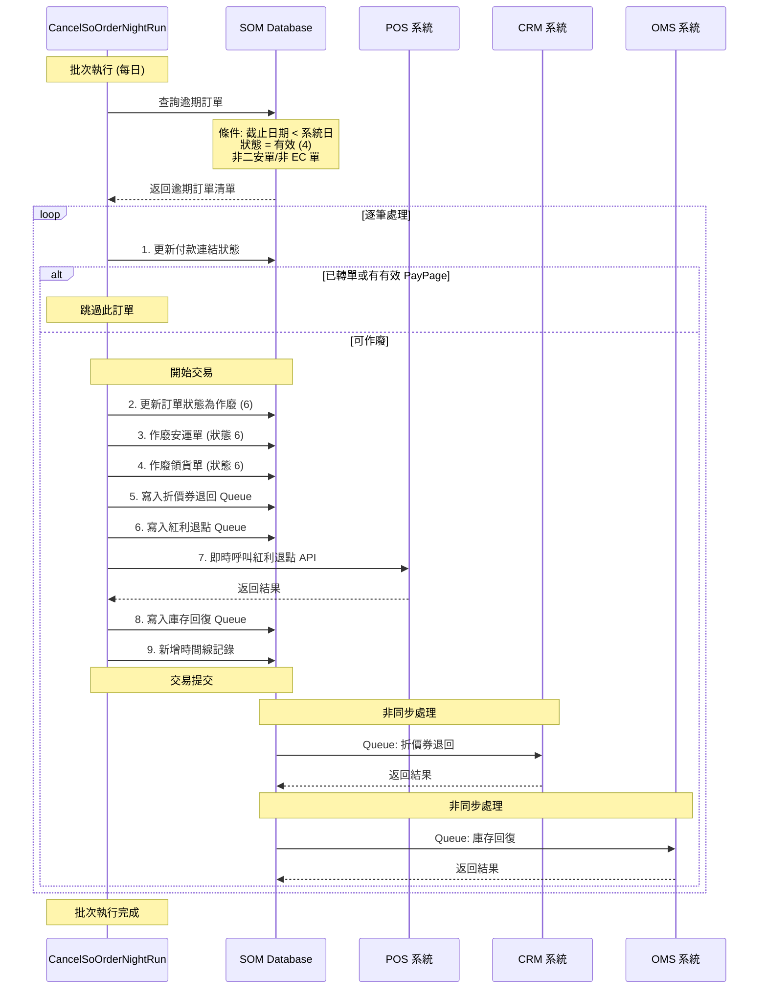

# SOM 系統訂單作廢連鎖反應追蹤報告

**追蹤日期**: 2025-10-28
**追蹤範圍**: 訂單作廢 (Order Cancellation) 完整業務流程
**追蹤目的**: 分析有效單作廢時的所有連鎖反應及業務規則
**文件版本**: v1.0

---

## 執行摘要

### 關鍵發現

1. **雙軌作廢機制**
   - **手動作廢**: 通過前端界面觸發，需通過多重業務規則驗證
   - **自動作廢**: 批次程式 (`CancelSoOrderNightRun`) 每日自動作廢逾期訂單

2. **複雜的前置條件檢查**
   - 訂單作廢需通過 **19 項業務規則檢查**
   - 涉及安運單狀態、PO 單狀態、領貨單狀態、發票狀態等多維度驗證
   - 特殊通路（CASA、MINI）有額外的驗證邏輯

3. **七大連鎖反應**
   - 訂單狀態變更為「作廢(6)」
   - 安運單/領貨單自動作廢
   - 庫存回復（壓負項調整）
   - 發票作廢（當日 V，非當日 B）
   - 折價券/紅利點數退回
   - 時間線記錄新增
   - PayPage 付款連結失效

4. **外部系統同步**
   - **POS 系統**: 發票作廢、紅利點數退回
   - **CRM 系統**: 折價券狀態更新
   - **OMS 系統**: 即時庫存調整
   - **HISU 系統**: 安裝單作廢通知

5. **交易完整性保證**
   - 整個作廢流程包含在單一資料庫交易中
   - 發生錯誤時自動回滾 (Rollback)
   - WebService Queue 機制確保非同步作業的可靠性

---

## 一、訂單作廢觸發機制

### 1.1 手動作廢觸發點

**Controller 入口**:
`C:\Projects\som\so-webapp\src\main\java\com\trihome\som\so\web\controller\so\SoController.java`

**核心 Service 方法**:
```java
// BzSoServices.java (行 6780-7043)
public String doInvalidSO(
    String orderId,           // 訂單編號
    String statusId,          // 當前狀態
    String reasonId,          // 作廢原因
    LoginUserInfoVO loginUserInfoVO,  // 登入者資訊
    String authInvalidEmpId,  // 授權者工號
    boolean throwException,   // 是否拋出異常
    String actionType         // 作廢類型 (N=正常, Y=強制)
) throws WsQueueException, Exception
```

**作廢原因代碼** (定義於 `DataExchangeItf.java`):
- `C0501`: 客戶退貨
- `C0502`: 客戶更換商品
- `C0503`: 客戶更換付款別
- `C0504`: 有效訂單已下傳收銀機超過 1 天，系統自動作廢
- `C0505`: 報價單超過 7 天，系統自動作廢
- `C0506`: 客戶更改安裝運送內容
- `C0507`: SO 發票作廢
- `C0508`: 有效訂單未下傳收銀機超過 1 天，系統自動作廢
- `C0510`: Restful updateSO 作廢

### 1.2 自動作廢觸發點

**批次程式位置**:
`C:\Projects\som\so-batchjob\src\main\java\com\trihome\som\so\dataexchange\service\CancelSoOrderNightRun.java`

**觸發條件** (行 186-191):
```java
TblOrderCriteria tblOrderCriteria = new TblOrderCriteria();
tblOrderCriteria.createCriteria()
    .andExpiredDateLessThan(DateUtils.truncate(date, Calendar.DATE))  // 系統日 > 截止日期
    .andOrderStatusIdEqualTo(ORDER_STATUS_EFFECTIVE)  // 訂單狀態 = 4 (有效)
    .andReinstallEqualTo("N")        // 非二安單
    .andEcFlagEqualTo("N")           // 非 EC 訂單
    .andSystemFlagIn(autoInvalidSystemFlagList);  // 系統別符合參數設定
```

**排除條件**:
1. 已轉單 (PO/STO) 的訂單
2. 有 PayPage 付款連結且尚未失效的訂單

```java
// 行 218-230
int transPoSize = tblOrderTransPoMapper.countByCriteria(tblOrderTransPoCriteria);
int counterOfHasPayPageLinkButStillValid =
    customPayPageInfoMapper.countHasPayPageLinkButStillValid(tblOrder.getOrderId());

if (transPoSize >= 1 || counterOfHasPayPageLinkButStillValid > 0) {
    logger.info("skip so orderId:{} transPoSize={} counterOfHasPayPageLinkButstillValid={}",
        tblOrder.getOrderId(), transPoSize, counterOfHasPayPageLinkButStillValid);
    continue;  // 跳過此訂單
}
```

### 1.3 可作廢的訂單狀態

根據 `SoConstant.java` 定義：

| 狀態代碼 | 狀態名稱 | 可作廢 |
|---------|---------|--------|
| 1 | 草稿 | ✓ (專案作廢時) |
| 2 | 報價 | ✓ (專案作廢時) |
| 3 | 已付款 | ✓ (需授權) |
| 4 | 有效 | ✓ |
| 5 | 已結案 | ✓ (專案作廢時) |
| 6 | 作廢 | ✗ (已作廢) |

---

## 二、訂單作廢前置條件檢查

### 2.1 檢查方法總覽

**核心檢查方法**:
`BzSoServices.soInvalidCheck()` (行 7080-7334)

### 2.2 業務規則詳細清單

#### CANC-R1: 訂單狀態一致性檢查

**規則描述**: 檢查訂單狀態是否在檢查期間被其他操作異動

**實作位置**: `BzSoServices.checkSoStatus()` (行 7066-7073)

```java
public String checkSoStatus(String orderId, String statusId){
    String msg = StringUtils.EMPTY;
    TblOrder tblOrder = tblOrderMapper.selectByPrimaryKey(orderId);
    if(!statusId.equals(tblOrder.getOrderStatusId())){
        msg = "操作失敗!當前單據已經被異動請重新確認單據狀態";
    }
    return msg;
}
```

**優先級**: 最高 (P0)
**影響**: 防止並發操作造成的數據不一致

---

#### CANC-R2: 安運單狀態檢查

**規則描述**: 所有安運單必須為「未派工(1)」或「已作廢(6)」

**實作位置**: `BzSoServices.soInvalidCheck()` (行 7091-7103)

```java
// 安運單需要全部為未派工或已作廢
ArrayList<String> list = new ArrayList<String>();
list.add(InstallConstant.INSTALL_STATUS_ID_NO_DISPATCH);  // 1: 未派工
list.add(InstallConstant.INSTALL_STATUS_ID_INVALID);      // 6: 已作廢

TblInstallationCriteria tblInstallationCriteria = new TblInstallationCriteria();
tblInstallationCriteria.createCriteria()
    .andStatusNotIn(list)
    .andOrderIdEqualTo(orderId);
List<TblInstallation> listTblInstallation =
    tblInstallationMapper.selectByCriteria(tblInstallationCriteria);

if(listTblInstallation!=null && !listTblInstallation.isEmpty()){
    msg = "安運單不為未派工或已作廢";
    return msg;
}
```

**優先級**: 最高 (P0)
**錯誤訊息**: "安運單不為未派工或已作廢"

**安運單狀態對照表**:
| 狀態代碼 | 狀態名稱 | 可作廢訂單 |
|---------|---------|-----------|
| 1 | 未派工 | ✓ |
| 2 | 已派工 | ✗ |
| 3 | 已完工 | ✗ |
| 4 | 已驗收 | ✗ |
| 5 | 無法完工 | ✗ |
| 6 | 已作廢 | ✓ |

---

#### CANC-R3: PO/STO 轉單狀態檢查 (EC 訂單)

**規則描述**: EC 訂單已轉出的 PO/STO 必須已入庫

**實作位置**: `BzSoServices.soInvalidCheck()` (行 7124-7160)

```java
// EC 單加判斷是否 PO 單已入庫
if (StringUtils.equals(CommonConstant.YES_FLAG, tblOrder.getEcFlag())) {
    if (listTblOrderTransPo != null && !listTblOrderTransPo.isEmpty()) {
        boolean isPoAccept = true; // PO 已入庫

        for (TblOrderTransPo tblOrderTransPo : listTblOrderTransPo) {
            // 如果是 EC 單若非 56, 105 直送單
            if (StringUtils.equals("56", StringUtils.substring(tblOrderTransPo.getPoId(), 0, 2))
                || StringUtils.equals("105", StringUtils.substring(tblOrderTransPo.getPoId(), 0, 3))) {
                msg = "需要為未轉PO/STO或轉出的PO/STO已刪單";
                return msg;
            }

            // 查詢 PO 單狀態
            String poStatus = customBzSoMapper.queryOmsPoStatus(tblOrderTransPo.getPoId());

            // PO 單: 0=申請, 1=驗收, 2=入庫, 3=失效
            // STO 單: 0=草稿, 1=申請, 2=調出出庫, 3=調入驗收, 4=調入入庫, 5=失效, 9=Allocate
            if((StringUtils.equals("PO", tblOrderTransPo.getFormType()) && !StringUtils.equals("2", poStatus))
                || (StringUtils.equals("STO", tblOrderTransPo.getFormType()) && !StringUtils.equals("4", poStatus))){
                isPoAccept = false;
                break;
            }
        }

        if (!isPoAccept) {
            msg = "需要為未轉PO/STO或轉出的PO/STO已刪單";
            return msg;
        }
    }
}
```

**優先級**: 高 (P1)
**適用範圍**: EC 訂單 (電商訂單)

---

#### CANC-R4: PO/STO 轉單狀態檢查 (CASA/MINI 通路)

**規則描述**: CASA 和 MINI 通路已轉出的 PO/STO (非 56/105) 必須已刪單

**實作位置**: `BzSoServices.soInvalidCheck()` (行 7162-7186)

```java
if(listTblOrderTransPo!=null && !listTblOrderTransPo.isEmpty()){
    // 檢查是否為 CASA 或 MINI
    if(StringUtils.equals(ChannelConstant.CHANNEL_CASA, tblOrder.getChannelId())
        || StringUtils.equals(ChannelConstant.CHANNEL_DIAMOND, tblOrder.getChannelId())){

        // !listVendorPoMasts.isEmpty() 表示還有未驗收的 PO
        // listTblOrderDetl.isEmpty 表示都轉回來或未轉
        if(!listVendorPoMasts.isEmpty() && listTblOrderDetl.isEmpty()){
            msg = "尚有已轉出PO/STO未刪單,請刪單後再執行訂單作廢";
            return msg;
        }

        // 105, 56 以外的單子未刪單，還是要擋下來
        for(TblOrderTransPo tblOrderTransPo : listTblOrderTransPo){
            if (!StringUtils.equals("56", StringUtils.substring(tblOrderTransPo.getPoId(), 0, 2))
                && !StringUtils.equals("105", StringUtils.substring(tblOrderTransPo.getPoId(), 0, 3))){
                msg = "尚有已轉出PO/STO未刪單,請刪單後再執行訂單作廢";
                return msg;
            }
        }
    } else {
        msg = "需要為未轉PO/STO或轉出的PO/STO已刪單";
        return msg;
    }
}
```

**優先級**: 高 (P1)
**適用範圍**: CASA、MINI 通路

---

#### CANC-R5: 轉單佇列狀態檢查

**規則描述**: TBL_ORDER_DETL.PO_IN_QUEUE 不可有 'Y'，表示商品已被轉單但還沒轉到 OMS

**實作位置**: `BzSoServices.soInvalidCheck()` (行 7115-7117, 7188-7191)

```java
// 檢查 SO 單下的 PO 單都需要為未轉 PO/STO
TblOrderDetlCriteria tblOrderDetlCriteria = new TblOrderDetlCriteria();
tblOrderDetlCriteria.createCriteria()
    .andOrderIdEqualTo(orderId)
    .andPoInQueueEqualTo(CommonConstant.YES_FLAG);
List<TblOrderDetl> listTblOrderDetl =
    tblOrderDetlMapper.selectByCriteria(tblOrderDetlCriteria);

if (listTblOrderDetl != null && !listTblOrderDetl.isEmpty()) {
    msg = "需要為未轉PO/STO或轉出的PO/STO已刪單";
    return msg;
}
```

**優先級**: 高 (P1)

---

#### CANC-R6: 領貨單狀態檢查

**規則描述**: 所有領貨單商品必須為「未領貨」

**實作位置**: `BzSoServices.soInvalidCheck()` (行 7193-7198)

```java
// 需要領貨單未領貨
int result = customBzSoMapper.selectPickupInfo(orderId);
if(result != 0){
    msg = "領貨單所有商品需為未領貨";
    return msg;
}
```

**優先級**: 高 (P1)

---

#### CANC-R7: 作廢折讓單檢查

**規則描述**: 換開發票或作廢折讓作業必須完成

**實作位置**: `BzSoServices.soInvalidCheck()` (行 7200-7213)

```java
// 檢查 POS 平台是否還有資料未處理
TblDownloadVoidCriteria voidCriteria = new TblDownloadVoidCriteria();
voidCriteria.createCriteria()
    .andOrderIdEqualTo(orderId)
    .andStoreIdEqualTo(tblOrder.getStoreId());
List<TblDownloadVoid> listVoid = tblDownloadVoidMapper.selectByCriteria(voidCriteria);

if(listVoid!=null && !listVoid.isEmpty()){
    for (TblDownloadVoid downloadVoid : listVoid) {
        if(CommonConstant.NO_FLAG.equals(downloadVoid.getStatus())
            && downloadVoid.getVoidDate()==null){
            msg = "換開發票或作廢折讓作業尚未完成，不可作廢SO單";
            return msg;
        }
    }
}
```

**優先級**: 高 (P1)

---

#### CANC-R8: 退貨作業檢查

**規則描述**: 退貨作業必須完成

**實作位置**: `BzSoServices.soInvalidCheck()` (行 7214-7227)

```java
// 檢查 POS 平台是否還有資料未處理
TblDownloadRefundCriteria refundCriteria = new TblDownloadRefundCriteria();
refundCriteria.createCriteria()
    .andOrderIdEqualTo(orderId)
    .andStoreIdEqualTo(tblOrder.getStoreId());
List<TblDownloadRefund> listRefund =
    tblDownloadRefundMapper.selectByCriteria(refundCriteria);

if(listRefund!=null && !listRefund.isEmpty()){
    for (TblDownloadRefund downloadRefund : listRefund) {
        if(CommonConstant.NO_FLAG.equals(downloadRefund.getStatus())
            && downloadRefund.getPrnRefundDate()==null){
            msg = "退貨作業尚未完成，不可作廢SO單";
            return msg;
        }
    }
}
```

**優先級**: 高 (P1)

---

#### CANC-R9: 發票申報期檢查

**規則描述**: 已開發票的日期不得超出申報期

**實作位置**: `BzSoServices.soInvalidCheck()` (行 7229-7247)

```java
// 已開發票的日期不得超出申報期
TblTransMastCriteria tblTransMastCriteria = new TblTransMastCriteria();
tblTransMastCriteria.createCriteria()
    .andStatusEqualTo(CommonConstant.NO_FLAG)     // 正常
    .andTransTypeEqualTo(CommonConstant.NO_FLAG)  // 銷貨
    .andOrderIdEqualTo(orderId);
List<TblTransMast> listTblTransMast =
    tblTransMastMapper.selectByCriteria(tblTransMastCriteria);

if(listTblTransMast!=null && !listTblTransMast.isEmpty()){
    for (TblTransMast tblTransMast : listTblTransMast) {
        try {
            if (bzValidateServices.isOverVoidDate(tblTransMast.getTransDate())) {
                msg = "已開發票的日期不得超出申報期";
                return msg;
            }
        } catch (ParseException e) {
            logger.error(e.toString(),e);
        }
    }
}
```

**優先級**: 高 (P1)

---

#### CANC-R10: 折讓單狀態檢查

**規則描述**: 發票未開出折讓單或折讓單已作廢時才可作廢訂單

**實作位置**: `BzSoServices.soInvalidCheck()` (行 7249-7259)

```java
// 發票未開出折讓單或折讓單已作廢
tblTransMastCriteria = new TblTransMastCriteria();
tblTransMastCriteria.createCriteria()
    .andStatusEqualTo(CommonConstant.NO_FLAG)  // 正常
    .andTransTypeEqualTo("B")                  // 折讓
    .andOrderIdEqualTo(orderId);
listTblTransMast = tblTransMastMapper.selectByCriteria(tblTransMastCriteria);

if(listTblTransMast!=null && !listTblTransMast.isEmpty()){
    msg = "需發票未開出折讓單或折讓單已作廢時才可作廢訂單";
    return msg;
}
```

**優先級**: 高 (P1)

---

#### CANC-R11: APP 訂單取消交易檢查

**規則描述**: APP 系統來源的訂單，檢查是否已取消交易過

**實作位置**: `BzSoServices.soInvalidCheck()` (行 7261-7275)

```java
if(loginUserInfoVO != null && StringUtils.equals("APP", loginUserInfoVO.getSystemFlag())) {
    // 檢查 SO 訂單是否已取消
    TblOrderWebPaymentCriteria tblOrderWebPaymentCriteria = new TblOrderWebPaymentCriteria();
    tblOrderWebPaymentCriteria.createCriteria()
        .andOrderIdEqualTo(orderId)
        .andTransTypeEqualTo("CM");  // 取消交易
    List<TblOrderWebPayment> tblOrderWebPaymentList =
        tblOrderWebPaymentMapper.selectByCriteria(tblOrderWebPaymentCriteria);

    if(CollectionUtils.isNotEmpty(tblOrderWebPaymentList)) {
        TblOrderWebPayment webPayment = tblOrderWebPaymentList.get(0);
        if(StringUtils.equals("C", webPayment.getHandleFlag())) {
            msg = "訂單" + orderId + "，已取消交易過，請再確認";
            return msg;
        }
    }
}
```

**優先級**: 中 (P2)
**適用範圍**: APP 系統來源訂單

---

#### CANC-R12: APP 訂單發票檢查

**規則描述**: APP 系統來源的訂單，已開發票不可作廢，必須退貨處理

**實作位置**: `BzSoServices.soInvalidCheck()` (行 7277-7292)

```java
if(loginUserInfoVO != null && StringUtils.equals("APP", loginUserInfoVO.getSystemFlag())) {
    // 檢查是否已開發票，如是，則不能作廢，必須退貨處理
    TblTransMastCriteria checkIfHasGui = new TblTransMastCriteria();
    checkIfHasGui.createCriteria()
        .andOrderIdEqualTo(orderId)
        .andTransTypeEqualTo("N")
        .andStatusEqualTo("N");
    List<TblTransMast> tblTransMastList =
        tblTransMastMapper.selectByCriteria(checkIfHasGui);

    // 如查詢有資料，表示有此訂單有開發票，就不可作廢訂單
    if(tblTransMastList.size() > 0) {
        msg = "已開發票不可作廢，請退貨處理";
        return msg;
    }
}
```

**優先級**: 高 (P1)
**適用範圍**: APP 系統來源訂單

---

#### CANC-R13: 當場驗收時間區間檢查

**規則描述**: 當場驗收後，需等待設定的時間區間才能作廢 (預設 5 分鐘)

**實作位置**: `BzSoServices.soInvalidCheck()` (行 7294-7330)

```java
// 如果有當場驗的，按照設定時間區間擋作廢
TblInadvanceMastCriteria timc = new TblInadvanceMastCriteria();
timc.setOrderByClause("CREATE_DATE");
timc.createCriteria()
    .andOrderIdEqualTo(orderId)
    .andTransFlagEqualTo("C");  // 當場驗收
List<TblInadvanceMast> inadvanceMastList =
    tblInadvanceMastMapper.selectByCriteria(timc);

if (!inadvanceMastList.isEmpty()) {
    String timeInterval = "6分鐘後";
    int seconds = 300;  // 預設 300 秒

    // 從參數表讀取設定值
    TblParmCriteria tpc = new TblParmCriteria();
    tpc.createCriteria().andParmEqualTo("VOID_SO_TIME_INTERVAL");
    List<TblParm> parmList = tblParmMapper.selectByCriteria(tpc);
    if (!parmList.isEmpty()) {
        try {
            seconds = Integer.parseInt(parmList.get(0).getParmValue());
            int minutes = seconds/60;
            timeInterval = new StringBuilder()
                .append(minutes)
                .append("分鐘後")
                .toString();
        } catch (NumberFormatException | NullPointerException | ArithmeticException e) {
            logger.error(e.toString(), e);
        }
    }

    // 如果 time_interval + create_date > now 跳出錯誤訊息
    if (inadvanceMastList.get(0).getCreateDate().getTime() + (seconds * 1000) > new Date().getTime()) {
        msg = new StringBuilder()
            .append("此單帳務處理中,請")
            .append(timeInterval)
            .append("再執行作廢SO")
            .toString();
        return msg;
    }
}
```

**優先級**: 中 (P2)
**配置參數**: `TBL_PARM.VOID_SO_TIME_INTERVAL` (單位: 秒)

---

### 2.3 業務規則總結表

| 規則 ID | 描述 | 優先級 | 檢查對象 | 錯誤訊息 |
|---------|------|--------|----------|----------|
| CANC-R1 | 訂單狀態一致性 | P0 | TBL_ORDER | 操作失敗!當前單據已經被異動 |
| CANC-R2 | 安運單狀態 | P0 | TBL_INSTALLATION | 安運單不為未派工或已作廢 |
| CANC-R3 | EC 訂單 PO/STO 入庫 | P1 | TBL_ORDER_TRANS_PO | 需要為未轉 PO/STO 或轉出的 PO/STO 已刪單 |
| CANC-R4 | CASA/MINI 通路 PO/STO | P1 | TBL_ORDER_TRANS_PO | 尚有已轉出 PO/STO 未刪單 |
| CANC-R5 | 轉單佇列狀態 | P1 | TBL_ORDER_DETL | 需要為未轉 PO/STO |
| CANC-R6 | 領貨單狀態 | P1 | TBL_PICKUP_MAST | 領貨單所有商品需為未領貨 |
| CANC-R7 | 作廢折讓單作業 | P1 | TBL_DOWNLOAD_VOID | 換開發票或作廢折讓作業尚未完成 |
| CANC-R8 | 退貨作業 | P1 | TBL_DOWNLOAD_REFUND | 退貨作業尚未完成 |
| CANC-R9 | 發票申報期 | P1 | TBL_TRANS_MAST | 已開發票的日期不得超出申報期 |
| CANC-R10 | 折讓單狀態 | P1 | TBL_TRANS_MAST | 需發票未開出折讓單或折讓單已作廢 |
| CANC-R11 | APP 訂單取消交易 | P2 | TBL_ORDER_WEB_PAYMENT | 訂單已取消交易過 |
| CANC-R12 | APP 訂單發票 | P1 | TBL_TRANS_MAST | 已開發票不可作廢，請退貨處理 |
| CANC-R13 | 當場驗收時間區間 | P2 | TBL_INADVANCE_MAST | 此單帳務處理中,請 N 分鐘後再執行作廢 |

---

## 三、連鎖反應流程圖



---

## 四、連鎖反應詳細邏輯

### 4.1 訂單狀態變更

**實作位置**: `BzSoServices.doInvalidSO()` (行 6793-6806)

```java
Date dateNow = new Date();
TblOrder tblOrder = tblOrderMapper.selectByPrimaryKey(orderId);
orgOrderStatus = tblOrder.getOrderStatusId();

// 更新訂單狀態為作廢
tblOrder.setOrderStatusId(SoConstant.SO_STATUS_ID_INVALID);  // 6
tblOrder.setInvalidReasonId(reasonId);
tblOrder.setInvalidDate(dateNow);
tblOrder.setInvalidEmpId(loginUserInfoVO.getEmpId());
tblOrder.setInvalidEmpName(loginUserInfoVO.getEmpName());
tblOrder.setUpdateDate(dateNow);
tblOrder.setUpdateEmpId(loginUserInfoVO.getEmpId());
tblOrder.setUpdateEmpName(loginUserInfoVO.getEmpName());

// 若為 EC 訂單，移除 EC 前綴
if(CommonConstant.YES_FLAG.equals(tblOrder.getEcFlag())){
    String ecOrderId = tblOrder.getEcOrderId();
    tblOrder.setEcOrderId(ecOrderId.substring(2, ecOrderId.length()));
}
```

**影響欄位**:
- `TBL_ORDER.ORDER_STATUS_ID`: 4 → 6
- `TBL_ORDER.INVALID_REASON_ID`: 設定作廢原因
- `TBL_ORDER.INVALID_DATE`: 設定作廢日期
- `TBL_ORDER.INVALID_EMP_ID`: 設定作廢人員
- `TBL_ORDER.INVALID_EMP_NAME`: 設定作廢人員姓名
- `TBL_ORDER.UPDATE_DATE`: 更新日期
- `TBL_ORDER.UPDATE_EMP_ID`: 更新人員
- `TBL_ORDER.UPDATE_EMP_NAME`: 更新人員姓名
- `TBL_ORDER.EC_ORDER_ID`: (若為 EC 訂單) 移除前綴

---

### 4.2 安運單/領貨單作廢

#### 4.2.1 安運單作廢

**實作位置**: `BzSoServices.doInvalidSO()` (行 6823-6836)

```java
// 作廢未派工安運單
TblInstallationCriteria tblInstallationCriteria = new TblInstallationCriteria();
tblInstallationCriteria.createCriteria()
    .andStatusEqualTo(InstallConstant.INSTALL_STATUS_ID_NO_DISPATCH)  // 1: 未派工
    .andOrderIdEqualTo(orderId);
List<TblInstallation> listTblInstallation =
    tblInstallationMapper.selectByCriteria(tblInstallationCriteria);

if(CollectionUtils.isNotEmpty(listTblInstallation)){
    for (TblInstallation tblInstallation : listTblInstallation) {
        tblInstallation.setStatus(InstallConstant.INSTALL_STATUS_ID_INVALID);  // 6: 已作廢

        // 若為宅配單，新增宅配時間線
        if(CommonConstant.YES_FLAG.equals(tblInstallation.getHomeDeliveryFlag())) {
            voidDeliveryTimeLine(tblInstallation, loginUserInfoVO);
        }
    }
}
```

**影響欄位**:
- `TBL_INSTALLATION.STATUS`: 1 → 6
- `TBL_DELIVERY_TIMELINE`: 新增一筆宅配作廢記錄 (若為宅配單)

**宅配時間線新增** (行 7046-7058):
```java
private void voidDeliveryTimeLine(TblInstallation tblInstallation, LoginUserInfoVO loginUserInfo) {
    TblDeliveryTimeline tblDeliveryTimeline = new TblDeliveryTimeline();
    tblDeliveryTimeline.setInstallationId(tblInstallation.getInstallationId());
    tblDeliveryTimeline.setOrderId(tblInstallation.getOrderId());
    tblDeliveryTimeline.setActionType("D1104");  // 宅配作廢
    tblDeliveryTimeline.setCreateDate(new Date());
    tblDeliveryTimeline.setCreateEmpId(loginUserInfo.getEmpId());
    tblDeliveryTimeline.setCreateEmpName(loginUserInfo.getEmpName());
    tblDeliveryTimeline.setRemark("作廢");
    tblDeliveryTimelineMapper.insert(tblDeliveryTimeline);
}
```

#### 4.2.2 領貨單作廢

**實作位置**: `BzSoServices.doInvalidSO()` (行 6838-6851)

```java
// 作廢未領貨的領貨單
TblPickupMastCriteria pickupMastCriteria = new TblPickupMastCriteria();
pickupMastCriteria.createCriteria()
    .andOrderIdEqualTo(orderId)
    .andStatusEqualTo("1");  // 未領貨
List<TblPickupMast> listPickupMast =
    tblPickupMastMapper.selectByCriteria(pickupMastCriteria);

if(CollectionUtils.isNotEmpty(listPickupMast)){
    for (TblPickupMast tblPickupMast : listPickupMast) {
        tblPickupMast.setStatus("6");  // 已作廢
        tblPickupMast.setUpdateDate(dateNow);
        tblPickupMast.setUpdateEmpId(loginUserInfoVO.getEmpId());
        tblPickupMast.setUpdateEmpName(loginUserInfoVO.getEmpName());
    }
}
```

**影響欄位**:
- `TBL_PICKUP_MAST.STATUS`: 1 → 6

---

### 4.3 發票作廢處理

發票作廢分為兩個 Part，處理不同的發票類型。

#### 4.3.1 發票作廢 Part 1 - 一般發票

**實作位置**: `BzSoServices.doInvalidSO()` (行 6869-6896)

```java
List<String> guiNos = new ArrayList<>();

// 作廢發票 part1
TblTransMastCriteria tblTransMastCriteria = new TblTransMastCriteria();
tblTransMastCriteria.createCriteria()
    .andOrderIdEqualTo(orderId)
    .andStoreIdEqualTo(tblOrder.getStoreId())
    .andTransTypeEqualTo(CommonConstant.NO_FLAG)       // N: 銷貨
    .andStatusEqualTo(CommonConstant.NO_FLAG)          // N: 正常
    .andInvoiceIdNotEqualTo(tblOrder.getOrderId());    // 發票號不等於訂單號
tblTransMastCriteria.setOrderByClause("CREATE_DATE");
List<TblTransMast> listTransMast =
    tblTransMastMapper.selectByCriteria(tblTransMastCriteria);

if(CollectionUtils.isNotEmpty(listTransMast)){
    String strDateNow = simpleDateFormat.format(dateNow);
    String transDate = StringUtils.EMPTY;

    for (TblTransMast tblTransMast : listTransMast) {
        transDate = simpleDateFormat.format(tblTransMast.getTransDate());

        // 判斷是當日作廢還是跨日作廢
        if(transDate.equals(strDateNow)){
            tblTransMast.setStatus(TransConstant.STATUS_V);  // V: 當日作廢
        } else {
            tblTransMast.setStatus(TransConstant.STATUS_B);  // B: 跨日作廢
        }

        tblTransMast.setVoidAuthEmpId(loginUserInfoVO.getEmpId());
        tblTransMast.setVoidAuthEmpName(loginUserInfoVO.getEmpName());
        tblTransMast.setVoidDate(dateNow);
        tblTransMast.setVoidTime(dateNow);

        guiNos.add(tblTransMast.getInvoiceId());  // 收集發票號
    }
}
```

**發票狀態說明**:
- `N`: 正常 (未作廢)
- `V`: 當日作廢 (Void)
- `B`: 跨日作廢 (Bounce)

#### 4.3.2 發票作廢 Part 2 - CASA_AR 發票

**實作位置**: `BzSoServices.doInvalidSO()` (行 6897-6923)

```java
// 作廢發票 part2 CASA_AR 是 Y 的壓作廢資訊但不做其他事
TblTransMastCriteria tblTransMastCriteria2 = new TblTransMastCriteria();
tblTransMastCriteria2.createCriteria()
    .andOrderIdEqualTo(orderId)
    .andStoreIdEqualTo(tblOrder.getStoreId())
    .andTransTypeEqualTo(CommonConstant.NO_FLAG)
    .andStatusEqualTo(CommonConstant.NO_FLAG)
    .andCasaArEqualTo(CommonConstant.YES_FLAG);  // CASA_AR = Y
tblTransMastCriteria2.setOrderByClause("CREATE_DATE");
List<TblTransMast> listTransMast2 =
    tblTransMastMapper.selectByCriteria(tblTransMastCriteria2);

if (CollectionUtils.isNotEmpty(listTransMast2)) {
    String strDateNow = simpleDateFormat.format(dateNow);
    String transDate = StringUtils.EMPTY;

    for (TblTransMast tblTransMast : listTransMast2) {
        transDate = simpleDateFormat.format(tblTransMast.getTransDate());

        if (transDate.equals(strDateNow)) {
            tblTransMast.setStatus(TransConstant.STATUS_V);
        } else {
            tblTransMast.setStatus(TransConstant.STATUS_B);
        }

        tblTransMast.setVoidAuthEmpId(loginUserInfoVO.getEmpId());
        tblTransMast.setVoidAuthEmpName(loginUserInfoVO.getEmpName());
        tblTransMast.setVoidDate(dateNow);
        tblTransMast.setVoidTime(dateNow);
        tblTransMastMapper.updateByPrimaryKey(tblTransMast);  // 直接更新
    }
}
```

**特殊處理**: CASA_AR 發票直接更新狀態，不進行後續的 POS 同步

#### 4.3.3 呼叫 POS 作廢發票

**實作位置**: `BzSoServices.doInvalidSO()` (行 6999-7036)

```java
if (CollectionUtils.isNotEmpty(guiNos)) {
    // 寫 QUEUE
    TblStore tblStore = tblStoreMapper.selectByPrimaryKey(tblOrder.getStoreId());
    VoidEposGuiVO vo = new VoidEposGuiVO();
    vo.setStoreId(tblOrder.getStoreId());        // 結帳店
    vo.setSiteId(tblStore.getSiteId());          // 店號新
    vo.setOrderId(orderId);                      // 訂單單號
    vo.setTransType(CommonConstant.NO_FLAG);     // 固定 N
    vo.setGuiNos(guiNos);                        // 所有發票號
    vo.setActionType(actionType);                // 強制作廢預設 N

    TblWsQueue tblWsQueue = new TblWsQueue();
    tblWsQueue.setSeqId(customCommonInfoMapper.generateSequence(WebQueueConstant.WS_QUEUE_SEQ));
    tblWsQueue.setWsName(WebQueueConstant.VOID_EPOS_GUI);
    tblWsQueue.setWsObj(JSON.toJSONString(vo));
    tblWsQueue.setCreateDate(new Date());
    tblWsQueue.setSentFlag("N");
    tblWsQueue.setCreateEmpId(commonInfoServices.findLoginUserEmpId());
    tblWsQueue.setCreateEmpName(commonInfoServices.findLoginUserEmpName());
    tblWsQueueMapper.insert(tblWsQueue);

    // 即時呼叫作廢
    msg = voidEposGuiRealTimeClient.doVoidEposGui(
        tblWsQueue.getSeqId(), tblOrder, tblProjectTimeline,
        listTblInstallation, listPickupMast, null);

    // 若 tblWsQueue 查出的 ErrCode = SS11 OR SS12 則判斷是否進行強制作廢
    TblWsQueueCriteria tblWsQueueCriteria = new TblWsQueueCriteria();
    tblWsQueueCriteria.createCriteria().andSeqIdEqualTo(tblWsQueue.getSeqId());
    List<TblWsQueue> tblWsQueueList = tblWsQueueMapper.selectByCriteria(tblWsQueueCriteria);

    if(StringUtils.isNotEmpty(tblWsQueueList.get(0).getErrCode())
        && ("SS11".equals(tblWsQueueList.get(0).getErrCode())
            || "SS12".equals(tblWsQueueList.get(0).getErrCode()))) {
        msg = tblWsQueueList.get(0).getErrCode();
        return msg;  // 返回 SS11/SS12 讓前端詢問是否強制作廢
    } else if(StringUtils.isNotEmpty(msg) && throwException) {
        // 拋錯讓 transaction rollback
        TblWsQueue errWsQueue = tblWsQueueMapper.selectByPrimaryKey(tblWsQueue.getSeqId());
        throw new WsQueueException(msg, errWsQueue);
    }
}
```

**錯誤碼說明**:
- `SS11`: POS 系統發票已使用，詢問是否強制作廢
- `SS12`: POS 系統發票異常，詢問是否強制作廢

**VoidEposGuiRealTimeClient 流程** (位於 `VoidEposGuiRealTimeClient.java`):
1. 設定 SOAP WebService URI
2. 組裝 `VoidEPOSGuiRequest` 請求物件
3. 呼叫 POS 系統 `VoidEPOSGui` WebService
4. 根據回應更新 SOM 資料庫
5. 更新 `TBL_WS_QUEUE` 記錄執行結果

---

### 4.4 折價券退回

**適用條件**:
- 訂單狀態為「有效(4)」或
- 當日作廢的「已付款(3)」或「已結案(5)」訂單

**實作位置**: `BzSoServices.doInvalidSO()` (行 6925-6953)

```java
// 有效單 或是 (當日作廢訂單，而且 TBL_ORDER.ORDER_STATUS_ID 是 '3 已付款' 或是 '5 已結案')
// 呼叫 CRM-REDEEM 讓已被抵用 紙本 或電子券 變更為『未被抵用』
if(StringUtils.equals(SoConstant.SO_STATUS_ID_VALID, orgOrderStatus)
    || (CollectionUtils.isNotEmpty(listTransMast)
        && TransConstant.STATUS_V.equals(listTransMast.get(0).getStatus())
        && (StringUtils.equals(SoConstant.SO_STATUS_ID_PAID, orgOrderStatus)
            || StringUtils.equals(SoConstant.SO_STATUS_ID_CLOSE, orgOrderStatus)))) {

    TblOrderCouponRedeemCriteria tblOrderCouponRedeemCriteria = new TblOrderCouponRedeemCriteria();
    tblOrderCouponRedeemCriteria.createCriteria()
        .andOrderIdEqualTo(tblOrder.getOrderId())
        .andStoreIdEqualTo(tblOrder.getStoreId());
    List<TblOrderCouponRedeem> orderCouponRedeemList =
        tblOrderCouponRedeemMapper.selectByCriteria(tblOrderCouponRedeemCriteria);

    if(CollectionUtils.isNotEmpty(orderCouponRedeemList)) {
        TblStore tblStore = tblStoreMapper.selectByPrimaryKey(tblOrder.getStoreId());
        List<RedeemPosCoupon> redeemPosCouponList = new ArrayList<RedeemPosCoupon>();

        for (TblOrderCouponRedeem tblOrderCouponRedeem : orderCouponRedeemList) {
            RedeemPosCoupon redeemPosCoupon = new RedeemPosCoupon();
            redeemPosCoupon.setGuiNos(tblOrder.getOrderId());                    // 訂單號
            redeemPosCoupon.setSkuSeq(tblOrderCouponRedeem.getTicketNo());       // 折價券序號
            redeemPosCoupon.setVipNo(tblOrder.getMemberCardId());                // 會員卡號
            redeemPosCoupon.setSourceId("SOM");                                   // 固定 SOM
            redeemPosCoupon.setStoreId(tblStore.getSiteId());                    // 結帳店 SiteId
            redeemPosCoupon.setStatus("V");                                       // V: 取消
            redeemPosCouponList.add(redeemPosCoupon);
        }

        insertWsQueue(redeemPosCouponList);  // 寫入 WebService Queue
    }
}
```

**WebService Queue 寫入**:
- `WS_NAME`: `REDEEM_POS_COUPON`
- `STATUS`: `V` (取消抵用)
- 非同步批次執行，由 `CrmRedeemCouponRunner` 消費

**自動作廢的折價券處理** (在 `CancelSoOrderNightRun.java` 行 291-320):
```java
// 作廢 coupon
TblOrderCouponRedeemCriteria tblOrderCouponRedeemCriteria = new TblOrderCouponRedeemCriteria();
tblOrderCouponRedeemCriteria.createCriteria()
    .andOrderIdEqualTo(tblOrder.getOrderId())
    .andStoreIdEqualTo(tblOrder.getStoreId());
List<TblOrderCouponRedeem> orderCouponRedeemList =
    tblOrderCouponRedeemMapper.selectByCriteria(tblOrderCouponRedeemCriteria);

List<RedeemPosCoupon> redeemPosCouponList = new ArrayList<RedeemPosCoupon>();
TblStore tblStore = tblStoreMapper.selectByPrimaryKey(tblOrder.getStoreId());

for (TblOrderCouponRedeem tblOrderCouponRedeem : orderCouponRedeemList) {
    RedeemPosCoupon redeemPosCoupon = new RedeemPosCoupon();
    redeemPosCoupon.setGuiNos(tblOrder.getOrderId());
    redeemPosCoupon.setSkuSeq(tblOrderCouponRedeem.getTicketNo());
    redeemPosCoupon.setVipNo(tblOrder.getMemberCardId());
    redeemPosCoupon.setSourceId("SOM");
    redeemPosCoupon.setStoreId(tblStore.getSiteId());
    redeemPosCoupon.setStatus("V");  // V: 取消
    redeemPosCouponList.add(redeemPosCoupon);
}

for (RedeemPosCoupon redeemPosCoupon : redeemPosCouponList) {
    String jsonStr = JSON.toJSONString(redeemPosCoupon);
    TblWsQueue tblWsQueue = new TblWsQueue();
    tblWsQueue.setSeqId(customCommonInfoMapper.generateSequence(WebQueueConstant.WS_QUEUE_SEQ));
    tblWsQueue.setWsName(WebQueueConstant.REDEEM_POS_COUPON);
    tblWsQueue.setWsObj(jsonStr);
    tblWsQueue.setCreateDate(new Date());
    tblWsQueue.setSentFlag(CommonConstant.NO_FLAG);
    tblWsQueue.setCreateEmpId("BATCH");
    tblWsQueue.setCreateEmpName("BATCH");
    tblWsQueueMapper.insert(tblWsQueue);
}
```

---

### 4.5 紅利點數退回

**適用條件**:
- 訂單狀態為「有效(4)」或「已付款(3)」
- `TBL_ORDER_DISCOUNT.RDMKEY` 不為 NULL (表示有使用紅利點數)

**實作位置**: `BzSoServices.doInvalidSO()` (行 6955-6997)

```java
// 有效、已付款單作廢還點(現金紅利、商品紅利)、預購可用量補回
if(StringUtils.equals(SoConstant.SO_STATUS_ID_VALID, orgOrderStatus)
    || StringUtils.equals(SO_STATUS_ID_PAID, orgOrderStatus)) {

    TblStore store = tblStoreMapper.selectByPrimaryKey(tblOrder.getStoreId());
    TblOrderDiscountCriteria odc = new TblOrderDiscountCriteria();
    odc.createCriteria()
        .andOrderIdEqualTo(orderId)
        .andRdmkeyIsNotNull();  // 有紅利點數
    List<TblOrderDiscount> odList = tblOrderDiscountMapper.selectByCriteria(odc);

    // 如果含有 RdmKey 的 TblOrderDiscount size > 0，呼叫 bonusVoid
    if (CollectionUtils.isNotEmpty(odList)) {
        BonusVoidRequest bvr = new BonusVoidRequest();
        bvr.setsNo(store.getSiteId());     // 店號
        bvr.setUpdType("S");               // S: 訂單作廢
        bvr.setTranId(orderId);            // 訂單號

        posBonusService.callBonusVoid(bvr);  // 呼叫 POS 退點

        // bonusVoid 呼叫完後把 rdmKey 清除
        for (TblOrderDiscount od : odList) {
            od.setRdmkey(null);
            tblOrderDiscountMapper.updateByPrimaryKey(od);
        }
    }

    // 預購可用量補回
    TblOrderDetlCriteria orderDetlCriteria = new TblOrderDetlCriteria();
    orderDetlCriteria.createCriteria().andOrderIdEqualTo(orderId);
    List<TblOrderDetl> orderDetlList =
        tblOrderDetlMapper.selectByCriteria(orderDetlCriteria);

    for (TblOrderDetl od : orderDetlList) {
        if (StringUtils.isNotEmpty(od.getSkuNo())) {
            TblSkuPreorderCriteria spc = new TblSkuPreorderCriteria();
            spc.createCriteria()
                .andSkuNoEqualTo(od.getSkuNo())
                .andPreorderFlagEqualTo(CommonConstant.YES_FLAG)
                .andChannelIdEqualTo(loginUserInfoVO.getChannelId());
            List<TblSkuPreorder> spList = tblSkuPreorderMapper.selectByCriteria(spc);

            if (CollectionUtils.isNotEmpty(spList)) {
                TblSkuPreorder sp = spList.get(0);
                sp.setAoh(sp.getAoh().add(BigDecimal.valueOf(od.getQuantity())));  // 補回數量
                tblSkuPreorderMapper.updateByCriteria(sp, spc);
            }
        }
    }
}
```

**POS bonusVoid API** (在 `PosBonusService.java` 行 111-142):
```java
public void callBonusVoid(BonusVoidRequest req) {
    logger.info("Starting callBonusVoid method.");
    ObjectMapper mapper = new ObjectMapper();
    TblWsQueue q = new TblWsQueue();

    try {
        initQueue(q, WsConstant.POS_BONUS_VOID, req);

        TblParm tblParm = tblParmMapper.selectByParm(ParmConstant.POS_BONUS_URL);
        String posUrl = tblParm.getParmValue() + "bonusVoid";

        SSLContext context = SSLContext.getInstance("TLSv1.2");
        context.init(null, null, null);
        CloseableHttpClient httpClient = HttpClientBuilder.create().setSslcontext(context).build();
        HttpComponentsClientHttpRequestFactory factory =
            new HttpComponentsClientHttpRequestFactory(httpClient);
        RestTemplate restTemplate = new RestTemplate(factory);
        restTemplate.getMessageConverters().set(1,
            new StringHttpMessageConverter(StandardCharsets.UTF_8));

        String response = restTemplate.postForObject(posUrl, req, String.class);
        BonusVoidResponse queryResponse = mapper.readValue(response, BonusVoidResponse.class);

        q.setWsOutput(response);
        q.setFinishDate(new Date());
        q.setSentFlag("Y");
        q.setSentCount((short)1);
        q.setResult("0000".equals(queryResponse.getResultCode()) ?
            CommonConstant.YES_FLAG : CommonConstant.NO_FLAG);
        q.setErrCode(queryResponse.getResultCode());
        q.setErrMsg(queryResponse.getResultMsg());

        tblWsQueueMapper.updateByPrimaryKeyWithBLOBs(q);
    } catch (Exception e) {
        logAndUpdateErrorTblWsQueue("呼叫POS作廢點數交易(bonusVoid)失敗: {}", e, q);
    }
}
```

**自動作廢的紅利點數處理** (在 `CancelSoOrderNightRun.java` 行 322-335):
```java
// 如果含有 RdmKey 的 TblOrderDiscount size > 0，表示有用紅利點數，呼叫 bonusVoid
TblStore store = tblStoreMapper.selectByPrimaryKey(tblOrder.getStoreId());
TblOrderDiscountCriteria odc = new TblOrderDiscountCriteria();
odc.createCriteria().andOrderIdEqualTo(tblOrder.getOrderId()).andRdmkeyIsNotNull();
List<TblOrderDiscount> odList = tblOrderDiscountMapper.selectByCriteria(odc);

if (CollectionUtils.isNotEmpty(odList)) {
    BonusVoidRequest bvr = new BonusVoidRequest();
    bvr.setsNo(store.getSiteId());
    bvr.setUpdType("S");
    bvr.setTranId(tblOrder.getOrderId());

    this.callBonusVoid(bvr, tblWsQueueMapper, customCommonInfoMapper, tblParmMapper);
}
```

---

### 4.6 庫存回復 (壓負項調整)

**實作位置**: `BzSoServices.doInvalidSO()` (行 7038-7039)

```java
// 即時庫存調整 - 驗收後
bzStockServices.createCancelUpdateOmsInv(
    tblOrder, new Date(),
    loginUserInfoVO.getEmpId(),
    loginUserInfoVO.getEmpName(),
    statusId
);
```

**核心方法**: `BzStockServices.createCancelUpdateOmsInv()` (行 242-524)

#### 4.6.1 庫存調整邏輯概述

作廢訂單時，需回復以下已出貨商品的庫存：
1. **已驗收的安運單** 商品
2. **已領貨的自取單** 商品
3. **已驗收的直送單** 商品
4. **未結案 (NO-CLOSE)** 的商品

**回復方式**: 壓負項數量，通知 OMS 系統調整庫存

#### 4.6.2 已驗收安運單商品處理

```java
// 安運單 (行 303-357)
TblInstallationCriteria tblInstallationCriteria = new TblInstallationCriteria();
tblInstallationCriteria.createCriteria()
    .andOrderIdEqualTo(tblOrder.getOrderId())
    .andStatusEqualTo(InstallConstant.INSTALL_STATUS_ID_ACCEPTANCE);  // 4: 已驗收
List<TblInstallation> tblInstallations =
    tblInstallationMapper.selectByCriteria(tblInstallationCriteria);

List<String> acceptInstallationId = new ArrayList<String>();
for(TblInstallation tblInstallation : tblInstallations){
    acceptInstallationId.add(tblInstallation.getInstallationId());
}

TblInstallDetlCriteria tblInstallDetlCriteria = new TblInstallDetlCriteria();
if(acceptInstallationId.size() > 0){
    tblInstallDetlCriteria.createCriteria().andInstallationIdIn(acceptInstallationId);
} else {
    tblInstallDetlCriteria.createCriteria().andInstallationIdEqualTo("");  // 故意讓資料跑不出來
}

List<TblInstallDetl> tblInstallDetls =
    tblInstallDetlMapper.selectByCriteria(tblInstallDetlCriteria);

for(TblInstallDetl tblInstallDetl : tblInstallDetls){
    SkuSet skuSet = new SkuSet();
    skuSet.setRefNo(this.getTransDetlInvoiceId(tblInstallDetl.getOrderId(), tblInstallDetl.getDetlSeqId()));
    skuSet.setOid("0*" + tblInstallDetl.getOrderId() + tblInstallDetl.getSkuNo()
        + tblInstallDetl.getDetlSeqId() + sdf.format(new Date()) + count);
    skuSet.setQty(tblInstallDetl.getQuantity().multiply(BigDecimal.valueOf(-1)).toString());  // 負數
    skuSet.setSku(tblInstallDetl.getSkuNo());
    skuSet.setUpc(barcodeMap.get(tblInstallDetl.getDetlSeqId()));
    skuSet.setQrcode(qrCodeMap.get(tblInstallDetl.getDetlSeqId()));
    skuSet.setStoreId(tblOrder.getOutStoreId());    // 出貨店
    skuSet.setChannelId(tblOrder.getChannelId());
    skuSet.setTransStoreId(tblOrder.getStoreId());  // 結帳店
    skuSet.setDataType("0");                         // 0: 即時庫存
    skuSet.setvType("");

    // 儲位判斷
    TblSku tblSku = tblSkuMapper.selectByPrimaryKey(tblInstallDetl.getSkuNo());
    if(StringUtils.equals(StringUtils.substring(tblSku.getBarcode(), 0, 3), "250")){
        skuSet.setStorage("0002");  // 2: 展示倉
    } else {
        skuSet.setStorage("0001");  // 1: 一般倉
    }

    skuSetsTmp.add(skuSet);
    count++;
}
```

#### 4.6.3 已領貨自取單商品處理

```java
// 自取單 (行 359-410)
TblPickupMastCriteria tblPickupMastCriteria = new TblPickupMastCriteria();
tblPickupMastCriteria.createCriteria()
    .andOrderIdEqualTo(tblOrder.getOrderId())
    .andStatusEqualTo(PickingConstant.STATUS_5);  // 5: 已領貨
List<TblPickupMast> tblPickupMasts =
    tblPickupMastMapper.selectByCriteria(tblPickupMastCriteria);

List<String> pickupIds = new ArrayList<String>();
for(TblPickupMast tblPickupMast : tblPickupMasts){
    pickupIds.add(tblPickupMast.getPickupId());
}

TblPickupDetlCriteria tblPickupDetlCriteria = new TblPickupDetlCriteria();
if(pickupIds.size() > 0){
    tblPickupDetlCriteria.createCriteria().andPickupIdIn(pickupIds);
} else {
    tblPickupDetlCriteria.createCriteria().andPickupIdEqualTo("");
}

List<TblPickupDetl> tblPickupDetls =
    tblPickupDetlMapper.selectByCriteria(tblPickupDetlCriteria);

for(TblPickupDetl tblPickupDetl : tblPickupDetls){
    SkuSet skuSet = new SkuSet();
    skuSet.setRefNo(this.getTransDetlInvoiceId(tblPickupDetl.getOrderId(), tblPickupDetl.getDetlSeqId()));
    skuSet.setOid("0*" + tblPickupDetl.getOrderId() + tblPickupDetl.getSkuNo()
        + tblPickupDetl.getDetlSeqId() + sdf.format(new Date()) + count);
    skuSet.setQty(tblPickupDetl.getQuantity().multiply(BigDecimal.valueOf(-1)).toString());  // 負數
    skuSet.setSku(tblPickupDetl.getSkuNo());
    skuSet.setUpc(tblPickupDetl.getBarcode());
    skuSet.setQrcode(qrCodeMap.get(tblPickupDetl.getDetlSeqId()));
    skuSet.setStoreId(tblOrder.getOutStoreId());
    skuSet.setChannelId(tblOrder.getChannelId());
    skuSet.setTransStoreId(tblOrder.getStoreId());
    skuSet.setDataType("0");
    skuSet.setvType("");

    TblSku tblSku = tblSkuMapper.selectByPrimaryKey(tblPickupDetl.getSkuNo());
    if(StringUtils.equals(StringUtils.substring(tblSku.getBarcode(), 0, 3), "250")){
        skuSet.setStorage("0002");
    } else {
        skuSet.setStorage("0001");
    }

    skuSetsTmp.add(skuSet);
    count++;
}
```

#### 4.6.4 已驗收直送單商品處理

```java
// 直送單 (行 412-464)
TblVendorPoMastCriteria tblVendorPoMastCriteria = new TblVendorPoMastCriteria();
tblVendorPoMastCriteria.createCriteria()
    .andOrderIdEqualTo(tblOrder.getOrderId())
    .andStatusEqualTo(VendorPoConstant.STATUS_2);  // 2: 已驗收
List<TblVendorPoMast> tblVendorPoMasts =
    tblVendorPoMastMapper.selectByCriteria(tblVendorPoMastCriteria);

List<String> vendorAcceptPoIds = new ArrayList<String>();
for(TblVendorPoMast tblVendorPoMast : tblVendorPoMasts){
    vendorAcceptPoIds.add(tblVendorPoMast.getPoId());
}

TblVendorPoDetlCriteria tblVendorPoDetlCriteria = new TblVendorPoDetlCriteria();
if(vendorAcceptPoIds.size() > 0){
    tblVendorPoDetlCriteria.createCriteria().andPoIdIn(vendorAcceptPoIds);
} else {
    tblVendorPoDetlCriteria.createCriteria().andOrderIdEqualTo("").andPoIdEqualTo("");
}

List<TblVendorPoDetl> tblVendorPoDetls =
    tblVendorPoDetlMapper.selectByCriteria(tblVendorPoDetlCriteria);

for(TblVendorPoDetl tblVendorPoDetl : tblVendorPoDetls){
    SkuSet skuSet = new SkuSet();
    skuSet.setRefNo(this.getTransDetlInvoiceId(tblVendorPoDetl.getOrderId(), tblVendorPoDetl.getDetlSeqId()));
    skuSet.setOid("0*" + tblVendorPoDetl.getOrderId() + tblVendorPoDetl.getSkuNo()
        + tblVendorPoDetl.getDetlSeqId() + sdf.format(new Date()) + count);
    skuSet.setQty(tblVendorPoDetl.getQuantity().multiply(BigDecimal.valueOf(-1)).toString());
    skuSet.setSku(tblVendorPoDetl.getSkuNo());
    skuSet.setUpc(barcodeMap.get(tblVendorPoDetl.getDetlSeqId()));
    skuSet.setQrcode(qrCodeMap.get(tblVendorPoDetl.getDetlSeqId()));
    skuSet.setStoreId(tblOrder.getOutStoreId());
    skuSet.setChannelId(tblOrder.getChannelId());
    skuSet.setTransStoreId(tblOrder.getStoreId());
    skuSet.setDataType("0");
    skuSet.setvType("");

    TblSku tblSku = tblSkuMapper.selectByPrimaryKey(tblVendorPoDetl.getSkuNo());
    if(StringUtils.equals(StringUtils.substring(tblSku.getBarcode(), 0, 3), "250")){
        skuSet.setStorage("0002");
    } else {
        skuSet.setStorage("0001");
    }

    skuSetsTmp.add(skuSet);
    count++;
}
```

#### 4.6.5 未結案 (NO-CLOSE) 商品處理

```java
// 取得驗收前 NO-CLOSE 資料 (行 466-507)
SimpleDateFormat sdf2 = new SimpleDateFormat("yyMMddHHmmss");
List<BzStockVO> noCloseBzStockVOs =
    customBzStockMapper.selectCancelSoNoClose(tblOrder.getOrderId(), sdf2.format(new Date()));

count = 0;
// 訂單狀態為草稿與報價時，不寫入 SO 未結
if(!("1".equals(statusId)) && !("2".equals(statusId))) {
    for (BzStockVO noCloseBzStockVO : noCloseBzStockVOs) {
        // 有驗收，不寫 NO-CLOSE
        BigDecimal inadvanceQty = customBzStockMapper.selectInadvanceQty(
            tblOrder.getOrderId(), noCloseBzStockVO.getDetlSeqId());
        logger.info(String.format("SO:%s, detlSeqId:%s, Qty:%s",
            tblOrder.getOrderId(), noCloseBzStockVO.getDetlSeqId(), inadvanceQty));

        if(inadvanceQty != null && inadvanceQty.compareTo(BigDecimal.ZERO) > 0){
            continue;  // 已驗收的商品不處理
        }

        SkuSet skuSet = new SkuSet();
        skuSet.setRefNo(noCloseBzStockVO.getRefNo());
        skuSet.setOid(noCloseBzStockVO.getOid() + count);
        skuSet.setQty(noCloseBzStockVO.getQty());
        skuSet.setSku(noCloseBzStockVO.getSku());
        skuSet.setStoreId(noCloseBzStockVO.getStoreId());
        skuSet.setChannelId(noCloseBzStockVO.getChannelId());
        skuSet.setTransStoreId(noCloseBzStockVO.getTransStoreId());
        skuSet.setUpc(barcodeMap.get(noCloseBzStockVO.getDetlSeqId()));
        skuSet.setQrcode(qrCodeMap.get(noCloseBzStockVO.getDetlSeqId()));
        skuSet.setDataType("1");  // 1: NO-CLOSE
        skuSet.setvType(noCloseBzStockVO.getvType());
        skuSet.setStorage(noCloseBzStockVO.getStorage());
        skuSetsTmp.add(skuSet);
        count++;
    }
}
```

#### 4.6.6 寫入 OMS 庫存調整 Queue

```java
// 直送單一定會寫一筆 QUEUE (行 510-522)
UpdateOmsStockBO updateOmsStockBO = new UpdateOmsStockBO();
updateOmsStockBO.setSoNo(tblOrder.getOrderId());          // SO 單號
updateOmsStockBO.setTxnDate(DateUtils.getYYYYMMDDString(sysdate));  // 驗收日期
updateOmsStockBO.setSystemId("SOM");                       // 系統別
updateOmsStockBO.setSkuList(skuSetsTmp);

if(skuSetsTmp.size() > 0){
    this.createStockWsQueue(updateOmsStockBO, createEmpId, createEmpName);
}
```

**WebService Queue**:
- `WS_NAME`: `OMS_UPDATE_STOCK` (即時庫存更新)
- 由批次程式消費並傳送至 OMS 系統

---

### 4.7 時間線記錄新增

**實作位置**: `BzSoServices.doInvalidSO()` (行 6808-6821)

```java
TblProjectTimeline tblProjectTimeline = new TblProjectTimeline();
tblProjectTimeline.setProjectId(tblOrder.getProjectId());
tblProjectTimeline.setChannelId(tblOrder.getChannelId());
tblProjectTimeline.setStoreId(tblOrder.getStoreId());
tblProjectTimeline.setSystemFlag(tblOrder.getSystemFlag());
tblProjectTimeline.setActionType(TimeLineConstant.SO_CANCEL);  // M0224: SO 作廢

// 已付款單作廢需記錄授權者
if(StringUtils.equals(SoConstant.SO_STATUS_ID_PAID, orgOrderStatus)){
    tblProjectTimeline.setRemark("SO單號" + orderId + ",授權者工號: " + authInvalidEmpId);
} else {
    tblProjectTimeline.setRemark("SO單號" + orderId);
}

tblProjectTimeline.setCreateDate(dateNow);
tblProjectTimeline.setCreateEmpId(loginUserInfoVO.getEmpId());
tblProjectTimeline.setCreateEmpName(loginUserInfoVO.getEmpName());
```

**時間線常數** (定義於 `TimeLineConstant.java`):
- `M0224`: SO 作廢
- `M0222`: 專案作廢
- `D1104`: 宅配作廢

**自動作廢的時間線新增** (在 `CancelSoOrderNightRun.java` 行 277-287):
```java
// 新增時間線資訊
TblProjectTimeline tblProjectTimeline = new TblProjectTimeline();
tblProjectTimeline.setProjectId(tblOrder.getProjectId());
tblProjectTimeline.setChannelId(tblOrder.getChannelId());
tblProjectTimeline.setStoreId(tblOrder.getStoreId());
tblProjectTimeline.setSystemFlag(tblOrder.getSystemFlag());
tblProjectTimeline.setActionType(TIMELINE_SO_CANCEL);  // M0224
tblProjectTimeline.setRemark(tblOrder.getOrderId());
tblProjectTimeline.setCreateDate(date);
tblProjectTimeline.setCreateEmpId(SYSTEM_EMP);
tblProjectTimeline.setCreateEmpName(SYSTEM_EMP);
tblProjectTimelineMapper.insert(tblProjectTimeline);
```

---

### 4.8 PayPage 付款連結失效

**實作位置**: `CancelSoOrderNightRun.updatePayPageInfo()` (行 478-480)

```java
private void updatePayPageInfo(TblOrder tblOrder, CustomPayPageInfoMapper customPayPageInfoMapper) {
    customPayPageInfoMapper.updateOutDatePayPageInfoBindWithLink(tblOrder.getOrderId());
}
```

**執行時機**: 在檢查作廢條件之前，先將已過期的 PayPage 付款連結更新為失效狀態

**影響表**: `TBL_PAY_PAGE_INFO`

---

## 五、與外部系統的同步

### 5.1 POS 系統同步

#### 5.1.1 發票作廢同步

**WebService 名稱**: `VOID_EPOS_GUI`
**WSDL 位置**: `http://{POS_HOST}/EPOS/service/VoidEPOSGuiService?wsdl`

**同步機制**:
1. 寫入 `TBL_WS_QUEUE`
2. 即時呼叫 `VoidEposGuiRealTimeClient.doVoidEposGui()`
3. POS 系統回應成功/失敗
4. 更新 SOM 資料庫

**POS 回應處理**:
```java
// VoidEposGuiRealTimeClient.java (行 139-145)
if(CommonConstant.YES_FLAG.equals(response.getStatus())){
    // Step 8. 依回傳資料更新 SOM DB
    this.bzVoidEposGuiServices.doVoidEposGuiClient(
        request, response, tblWsQueue, tblOrder, tblProjectTimeline,
        listTblInstallation, listPickupMast, tblSousefDetlKeySet);
} else {
    rtnMsg = "呼叫EPOS失敗: " + StringUtils.substring(response.getErrMsg(), 0, 550);
}
```

**錯誤處理**:
- `SS11`: POS 發票已使用，需強制作廢
- `SS12`: POS 發票異常，需強制作廢
- 其他錯誤: 交易回滾

#### 5.1.2 紅利點數退回同步

**API 名稱**: `bonusVoid`
**URL**: `{POS_BONUS_URL}/bonusVoid`
**HTTP 方法**: POST
**Content-Type**: application/json

**請求物件** (`BonusVoidRequest`):
```java
{
    "sNo": "店號",           // TBL_STORE.SITE_ID
    "updType": "S",         // S: 訂單作廢
    "tranId": "訂單號"       // TBL_ORDER.ORDER_ID
}
```

**回應物件** (`BonusVoidResponse`):
```java
{
    "resultCode": "0000",   // 0000: 成功
    "resultMsg": "成功"
}
```

**同步機制**:
1. 呼叫 `PosBonusService.callBonusVoid()`
2. 寫入 `TBL_WS_QUEUE` (WS_NAME = `POS_BONUS_VOID`)
3. 使用 RestTemplate POST 至 POS 系統
4. 接收回應並更新 Queue 狀態
5. 成功後清除 `TBL_ORDER_DISCOUNT.RDMKEY`

---

### 5.2 CRM 系統同步

#### 5.2.1 折價券退回同步

**WebService 名稱**: `REDEEM_POS_COUPON`
**目的**: 將已抵用的折價券變更為「未抵用」狀態

**同步機制**:
1. 寫入 `TBL_WS_QUEUE` (SENT_FLAG = 'N')
2. 批次程式 `CrmRedeemCouponRunner` 消費 Queue
3. 呼叫 CRM WebService `RedeemPOScoupon`
4. 更新 Queue 執行結果

**請求物件** (`RedeemPosCoupon`):
```java
{
    "guiNos": "訂單號",       // TBL_ORDER.ORDER_ID
    "skuSeq": "折價券序號",   // TBL_ORDER_COUPON_REDEEM.TICKET_NO
    "vipNo": "會員卡號",      // TBL_ORDER.MEMBER_CARD_ID
    "sourceId": "SOM",       // 固定 SOM
    "storeId": "店號",        // TBL_STORE.SITE_ID
    "status": "V"            // V: 取消抵用
}
```

**執行時機**: 非同步批次執行

---

### 5.3 OMS 系統同步

#### 5.3.1 即時庫存調整同步

**WebService 名稱**: `OMS_UPDATE_STOCK`
**目的**: 通知 OMS 系統回復已出貨商品的庫存

**同步機制**:
1. 呼叫 `BzStockServices.createCancelUpdateOmsInv()`
2. 收集所有已出貨商品（安運單、自取單、直送單）
3. 壓負項數量
4. 寫入 `TBL_WS_QUEUE`
5. 批次程式傳送至 OMS 系統

**請求物件** (`UpdateOmsStockBO`):
```java
{
    "soNo": "訂單號",
    "txnDate": "交易日期",  // YYYYMMDD
    "systemId": "SOM",
    "skuList": [
        {
            "oid": "0*{訂單號}{商品編號}{明細序號}{時間戳}",
            "refNo": "發票號",
            "sku": "商品編號",
            "qty": "-1",         // 負數，表示回復庫存
            "upc": "條碼",
            "qrcode": "QR碼",
            "storeId": "出貨店",
            "channelId": "通路",
            "transStoreId": "結帳店",
            "dataType": "0",     // 0: 即時庫存, 1: NO-CLOSE
            "vType": "",
            "storage": "0001"    // 0001: 一般倉, 0002: 展示倉
        }
    ]
}
```

**DataType 說明**:
- `0`: 即時庫存 (已驗收/已領貨商品)
- `1`: NO-CLOSE (未結案商品)

---

### 5.4 HISU 系統同步

**目的**: 通知 HISU 系統安裝單已作廢，取消派工

**同步機制**:
- 通過宅配時間線 (`TBL_DELIVERY_TIMELINE`) 記錄
- ACTION_TYPE = `D1104` (宅配作廢)
- HISU 系統定期查詢時間線並取消派工

---

## 六、錯誤處理機制

### 6.1 交易回滾機制

**實作位置**: `CancelSoOrderNightRun.java` (行 196, 459-464)

```java
somSession.getConnection().setAutoCommit(false);  // 開始交易

try {
    // 執行所有作廢邏輯...
    somSession.getConnection().commit();  // 提交交易
} catch(Exception e){
    logger.error(e.toString(), e);
    logger.debug("Cancel SO Order has fail, tblOrder.orderId: " + tblOrder.getOrderId());
    somSession.getConnection().rollback();  // 回滾交易
    flag = OTHER;
}
```

**手動作廢的交易控制**:
- Spring `@Transactional` 註解管理
- 發生異常時自動回滾

### 6.2 WebService Queue 錯誤處理

**重試機制**:
1. `TBL_WS_QUEUE.SENT_COUNT`: 記錄執行次數
2. `TBL_PARM.WS_MAX_RETRY`: 最大重試次數 (預設 3)
3. 達到最大次數後設定 `BREAK_FLAG = 'Y'`

**錯誤記錄**:
```java
// VoidEposGuiRealTimeClient.java (行 168-175)
catch (Exception ex){
    tblWsQueue.setSentFlag(CommonConstant.YES_FLAG);
    tblWsQueue.setResult(CommonConstant.NO_FLAG);
    tblWsQueue.setSentCount(++count);
    tblWsQueue.setErrCode(CommonErrorConstant.ERR_CODE_405);
    tblWsQueue.setErrMsg(CommonErrorConstant.ERR_MSG_405
        + StringUtils.substring(ex.toString(), 0, 550));
    logger.error(ex.toString(), ex);
}
```

### 6.3 發票作廢特殊錯誤處理

**SS11/SS12 錯誤處理流程**:



**實作位置**: `BzSoServices.doInvalidSO()` (行 7022-7035)

```java
// 若 tblWsQueue 查出的 ErrCode = SS11 OR SS12 則判斷是否進行強制作廢
TblWsQueueCriteria tblWsQueueCriteria = new TblWsQueueCriteria();
tblWsQueueCriteria.createCriteria().andSeqIdEqualTo(tblWsQueue.getSeqId());
List<TblWsQueue> tblWsQueueList = tblWsQueueMapper.selectByCriteria(tblWsQueueCriteria);

if(StringUtils.isNotEmpty(tblWsQueueList.get(0).getErrCode())
    && ("SS11".equals(tblWsQueueList.get(0).getErrCode())
        || "SS12".equals(tblWsQueueList.get(0).getErrCode()))) {
    msg = tblWsQueueList.get(0).getErrCode();
    return msg;  // 返回給前端，由前端詢問使用者是否強制作廢
} else if(StringUtils.isNotEmpty(msg) && throwException) {
    // 拋錯讓 transaction rollback
    TblWsQueue errWsQueue = tblWsQueueMapper.selectByPrimaryKey(tblWsQueue.getSeqId());
    throw new WsQueueException(msg, errWsQueue);
}
```

### 6.4 並發控制

**樂觀鎖機制**: 檢查訂單狀態是否被異動

```java
// CANC-R1 檢查
public String checkSoStatus(String orderId, String statusId){
    String msg = StringUtils.EMPTY;
    TblOrder tblOrder = tblOrderMapper.selectByPrimaryKey(orderId);
    if(!statusId.equals(tblOrder.getOrderStatusId())){
        msg = "操作失敗!當前單據已經被異動請重新確認單據狀態";
    }
    return msg;
}
```

---

## 七、業務規則總結表

### 7.1 作廢前置條件規則

| 規則 ID | 描述 | 優先級 | 檢查對象 | 錯誤訊息 |
|---------|------|--------|----------|----------|
| CANC-R1 | 訂單狀態一致性 | P0 | TBL_ORDER | 操作失敗!當前單據已經被異動 |
| CANC-R2 | 安運單狀態 | P0 | TBL_INSTALLATION | 安運單不為未派工或已作廢 |
| CANC-R3 | EC 訂單 PO/STO 入庫 | P1 | TBL_ORDER_TRANS_PO | 需要為未轉 PO/STO 或轉出的 PO/STO 已刪單 |
| CANC-R4 | CASA/MINI 通路 PO/STO | P1 | TBL_ORDER_TRANS_PO | 尚有已轉出 PO/STO 未刪單 |
| CANC-R5 | 轉單佇列狀態 | P1 | TBL_ORDER_DETL | 需要為未轉 PO/STO |
| CANC-R6 | 領貨單狀態 | P1 | TBL_PICKUP_MAST | 領貨單所有商品需為未領貨 |
| CANC-R7 | 作廢折讓單作業 | P1 | TBL_DOWNLOAD_VOID | 換開發票或作廢折讓作業尚未完成 |
| CANC-R8 | 退貨作業 | P1 | TBL_DOWNLOAD_REFUND | 退貨作業尚未完成 |
| CANC-R9 | 發票申報期 | P1 | TBL_TRANS_MAST | 已開發票的日期不得超出申報期 |
| CANC-R10 | 折讓單狀態 | P1 | TBL_TRANS_MAST | 需發票未開出折讓單或折讓單已作廢 |
| CANC-R11 | APP 訂單取消交易 | P2 | TBL_ORDER_WEB_PAYMENT | 訂單已取消交易過 |
| CANC-R12 | APP 訂單發票 | P1 | TBL_TRANS_MAST | 已開發票不可作廢，請退貨處理 |
| CANC-R13 | 當場驗收時間區間 | P2 | TBL_INADVANCE_MAST | 此單帳務處理中,請 N 分鐘後再執行作廢 |

### 7.2 連鎖反應規則

| 規則 ID | 描述 | 影響對象 | 同步方式 |
|---------|------|----------|----------|
| CANC-E1 | 訂單狀態變更為作廢 | TBL_ORDER | 即時 |
| CANC-E2 | 安運單作廢 | TBL_INSTALLATION | 即時 |
| CANC-E3 | 領貨單作廢 | TBL_PICKUP_MAST | 即時 |
| CANC-E4 | 宅配時間線新增 | TBL_DELIVERY_TIMELINE | 即時 |
| CANC-E5 | 發票狀態更新 | TBL_TRANS_MAST | 即時 |
| CANC-E6 | 發票作廢同步 POS | POS 系統 | 即時 (SOAP) |
| CANC-E7 | 折價券退回 | CRM 系統 | 非同步 (Queue) |
| CANC-E8 | 紅利點數退回 | POS 系統 | 即時 (REST) |
| CANC-E9 | 預購可用量補回 | TBL_SKU_PREORDER | 即時 |
| CANC-E10 | 庫存回復壓負項 | OMS 系統 | 非同步 (Queue) |
| CANC-E11 | 專案時間線新增 | TBL_PROJECT_TIMELINE | 即時 |
| CANC-E12 | PayPage 付款連結失效 | TBL_PAY_PAGE_INFO | 即時 (自動作廢) |

### 7.3 訂單狀態轉換規則

| 原狀態 | 可作廢 | 需授權 | 特殊條件 |
|--------|--------|--------|----------|
| 1 (草稿) | ✓ | ✗ | 僅專案作廢時 |
| 2 (報價) | ✓ | ✗ | 僅專案作廢時 |
| 3 (已付款) | ✓ | ✓ | 需主管授權 |
| 4 (有效) | ✓ | ✗ | - |
| 5 (已結案) | ✓ | ✗ | 僅專案作廢時 |
| 6 (作廢) | ✗ | - | 已作廢 |

---

## 八、關鍵文件位置

### 8.1 Controller 層

| 文件路徑 | 主要功能 |
|---------|---------|
| `C:\Projects\som\so-webapp\src\main\java\com\trihome\som\so\web\controller\so\SoController.java` | 訂單管理主控制器 (含作廢入口) |

### 8.2 Service 層

| 文件路徑 | 主要功能 |
|---------|---------|
| `C:\Projects\som\so-bzservices\src\main\java\com\trihome\som\bz\service\BzSoServices.java` | 訂單作廢核心業務邏輯 (行 6780-7380) |
| `C:\Projects\som\so-bzservices\src\main\java\com\trihome\som\bz\service\BzStockServices.java` | 庫存回復邏輯 (行 242-524) |
| `C:\Projects\som\so-bzservices\src\main\java\com\trihome\som\bz\service\BzVoidEposGuiServices.java` | 發票作廢處理邏輯 |
| `C:\Projects\som\so-bzservices\src\main\java\com\trihome\som\bz\service\PosBonusService.java` | 紅利點數退回邏輯 (行 111-142) |

### 8.3 WebService Client 層

| 文件路徑 | 主要功能 |
|---------|---------|
| `C:\Projects\som\so-bzservices\src\main\java\com\trihome\som\so\ws\consumer\VoidEposGuiRealTimeClient.java` | POS 發票作廢即時呼叫 |
| `C:\Projects\som\so-bzservices\src\main\java\com\trihome\som\so\ws\consumer\CrmCouponClient.java` | CRM 折價券退回呼叫 |

### 8.4 批次作業層

| 文件路徑 | 主要功能 |
|---------|---------|
| `C:\Projects\som\so-batchjob\src\main\java\com\trihome\som\so\dataexchange\service\CancelSoOrderNightRun.java` | 自動作廢逾期訂單 (行 161-469) |
| `C:\Projects\som\so-batchjob\src\main\java\com\trihome\som\so\dataexchange\service\CancelQuotationNightRun.java` | 自動作廢逾期報價單 |
| `C:\Projects\som\so-batchjob\src\main\java\com\trihome\som\so\ws\runner\VoidEposGuiRunner.java` | 發票作廢 Queue 消費者 |
| `C:\Projects\som\so-batchjob\src\main\java\com\trihome\som\so\ws\runner\CrmRedeemCouponRunner.java` | 折價券退回 Queue 消費者 |

### 8.5 常數定義層

| 文件路徑 | 主要內容 |
|---------|---------|
| `C:\Projects\som\so-bzservices\src\main\java\com\trihome\som\bz\common\constant\SoConstant.java` | 訂單狀態常數定義 |
| `C:\Projects\som\so-bzservices\src\main\java\com\trihome\som\bz\common\constant\TransConstant.java` | 交易/發票狀態常數 |
| `C:\Projects\som\so-bzservices\src\main\java\com\trihome\som\bz\common\constant\WebQueueConstant.java` | WebService Queue 名稱定義 |
| `C:\Projects\som\so-bzservices\src\main\java\com\trihome\som\bz\common\constant\TimeLineConstant.java` | 時間線動作類型定義 |
| `C:\Projects\som\so-batchjob\src\main\java\com\trihome\som\so\dataexchange\core\DataExchangeItf.java` | 作廢原因代碼定義 (行 160-227) |

### 8.6 Mapper/DAO 層

| 文件路徑 | 主要功能 |
|---------|---------|
| `C:\Projects\som\so-coredb\src\main\java\com\trihome\som\so\mybatis\mapper\TblOrderMapper.java` | 訂單資料存取 |
| `C:\Projects\som\so-coredb\src\main\java\com\trihome\som\so\mybatis\mapper\TblInstallationMapper.java` | 安運單資料存取 |
| `C:\Projects\som\so-coredb\src\main\java\com\trihome\som\so\mybatis\mapper\TblTransMastMapper.java` | 發票交易資料存取 |
| `C:\Projects\som\so-coredb\src\main\java\com\trihome\som\so\mybatis\mapper\TblWsQueueMapper.java` | WebService Queue 資料存取 |
| `C:\Projects\som\so-bzservices\src\main\java\com\trihome\som\so\mybatis\mapper\CustomBzStockMapper.java` | 自訂庫存查詢 |

### 8.7 WSDL/Schema 定義

| 文件路徑 | 主要內容 |
|---------|---------|
| `C:\Projects\som\so-bzservices\src\main\java\com\trihome\som\so\ws\wsdl\voideposgui\` | POS 發票作廢 WSDL 定義 |
| `C:\Projects\som\so-bzservices\src\main\java\com\trihome\som\so\ws\wsdl\crmcoupon\` | CRM 折價券 WSDL 定義 |

---

## 九、附錄

### 9.1 訂單狀態代碼對照表

| 代碼 | 名稱 | 常數名稱 | 說明 |
|------|------|----------|------|
| 1 | 草稿 | SO_STATUS_ID_DRAFTS | 訂單草稿 |
| 2 | 報價 | SO_STATUS_ID_QUOTE | 報價單 |
| 3 | 已付款 | SO_STATUS_ID_PAID | 已付款待出貨 |
| 4 | 有效 | SO_STATUS_ID_VALID | 有效訂單 (已下傳 POS) |
| 5 | 已結案 | SO_STATUS_ID_CLOSE | 訂單結案 |
| 6 | 作廢 | SO_STATUS_ID_INVALID | 訂單作廢 |

### 9.2 安運單狀態代碼對照表

| 代碼 | 名稱 | 常數名稱 | 可作廢訂單 |
|------|------|----------|-----------|
| 1 | 未派工 | INSTALL_STATUS_ID_NO_DISPATCH | ✓ |
| 2 | 已派工 | INSTALL_STATUS_ID_DISPATCH | ✗ |
| 3 | 已完工 | INSTALL_STATUS_ID_FINISH | ✗ |
| 4 | 已驗收 | INSTALL_STATUS_ID_ACCEPTANCE | ✗ |
| 5 | 無法完工 | INSTALL_STATUS_ID_UNABLE_FINISH | ✗ |
| 6 | 已作廢 | INSTALL_STATUS_ID_INVALID | ✓ |

### 9.3 發票狀態代碼對照表

| 代碼 | 名稱 | 常數名稱 | 說明 |
|------|------|----------|------|
| N | 正常 | (無) | 正常發票 |
| V | 當日作廢 | STATUS_V | 當日作廢 (Void) |
| B | 跨日作廢 | STATUS_B | 跨日作廢 (Bounce) |

### 9.4 作廢原因代碼對照表

| 代碼 | 描述 | 常數名稱 | 觸發方式 |
|------|------|----------|----------|
| C0501 | 客戶退貨 | RETURN_ITEMS | 手動 |
| C0502 | 客戶更換商品 | REPLACE_ITEMS | 手動 |
| C0503 | 客戶更換付款別 | CHANGE_PAYTYPE | 手動 |
| C0504 | 有效訂單已下傳收銀機超過 1 天 | SYSTEM_CANCEL_POS | 自動 (批次) |
| C0505 | 報價單超過 7 天 | SYSTEM_CANCEL_QUOTATION | 自動 (批次) |
| C0506 | 客戶更改安裝運送內容 | CHANGE_INSTALLATION_CONTENT | 手動 |
| C0507 | SO 發票作廢 | SO_CANCEL_INVOICE | 手動 |
| C0508 | 有效訂單未下傳收銀機超過 1 天 | SYSTEM_CANCEL_NOT_POS | 自動 (批次) |
| C0510 | Restful updateSO 作廢 | SO_INVALID_C0510 | API |

### 9.5 時間線動作類型對照表

| 代碼 | 描述 | 常數名稱 | 觸發時機 |
|------|------|----------|----------|
| M0222 | 專案作廢 | TIMELINE_PROJECT_CANCEL | 專案作廢 |
| M0224 | SO 作廢 | TIMELINE_SO_CANCEL | 訂單作廢 |
| D1104 | 宅配作廢 | (無) | 宅配安運單作廢 |

### 9.6 WebService Queue 名稱對照表

| Queue 名稱 | 常數名稱 | 目標系統 | 執行方式 |
|-----------|----------|----------|----------|
| VOID_EPOS_GUI | VOID_EPOS_GUI | POS | 即時 + Queue |
| REDEEM_POS_COUPON | REDEEM_POS_COUPON | CRM | Queue |
| POS_BONUS_VOID | POS_BONUS_VOID | POS | 即時 + Queue |
| OMS_UPDATE_STOCK | (無) | OMS | Queue |

### 9.7 系統參數對照表

| 參數名稱 | 說明 | 預設值 | 單位 |
|---------|------|--------|------|
| AUTO_INVALID_SYSTEM_FLAG | 自動作廢系統別 | (多筆) | - |
| VOID_SO_TIME_INTERVAL | 當場驗收作廢時間區間 | 300 | 秒 |
| WS_MAX_RETRY | WebService 最大重試次數 | 3 | 次 |
| POS_BONUS_URL | POS 紅利 API URL | (URL) | - |

---

## 十、業務流程示意圖

### 10.1 手動作廢完整流程



### 10.2 自動作廢批次流程



---

## 十一、總結

### 11.1 核心發現

1. **嚴謹的業務規則體系**
   - 訂單作廢需通過 13 項核心業務規則檢查
   - 涵蓋訂單狀態、安運單、PO 單、領貨單、發票等多個維度
   - 特殊通路 (CASA、MINI、EC) 有額外的驗證邏輯

2. **完整的連鎖反應機制**
   - 訂單作廢觸發 7 大連鎖反應
   - 涉及 12 個資料表的更新
   - 同步 4 個外部系統 (POS、CRM、OMS、HISU)

3. **健全的交易完整性保證**
   - 使用資料庫交易確保原子性
   - WebService Queue 機制確保非同步作業可靠性
   - 完善的錯誤處理與回滾機制

4. **靈活的錯誤處理策略**
   - SS11/SS12 錯誤允許強制作廢
   - WebService 失敗自動重試
   - 詳細的錯誤日誌記錄

### 11.2 技術亮點

1. **即時 + 非同步混合架構**
   - 關鍵操作 (訂單狀態、發票作廢) 採用即時處理
   - 非關鍵操作 (折價券退回、庫存調整) 採用非同步 Queue

2. **多重業務規則驗證**
   - 細緻的前置條件檢查
   - 不同通路、訂單類型有差異化的驗證邏輯

3. **完善的日誌與追蹤**
   - 時間線機制記錄所有關鍵操作
   - WebService Queue 記錄所有外部系統呼叫

### 11.3 潛在改進建議

1. **業務規則配置化**
   - 將部分硬編碼的業務規則遷移至配置表
   - 提升規則的可維護性和靈活性

2. **錯誤處理優化**
   - 統一 WebService 錯誤處理邏輯
   - 增加更細緻的錯誤分類

3. **性能優化**
   - 批次作廢時可考慮批量處理以提升效率
   - 減少不必要的資料庫查詢

---

**報告完成日期**: 2025-10-28
**追蹤範圍**: SOM 系統訂單作廢完整業務流程
**文件版本**: v1.0
