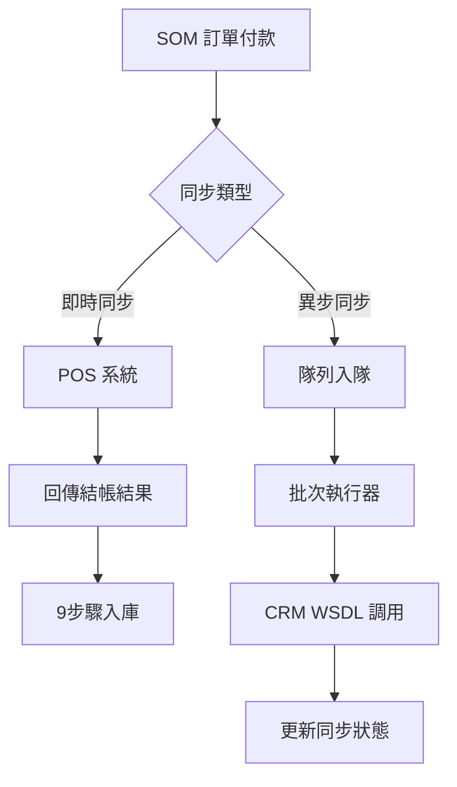
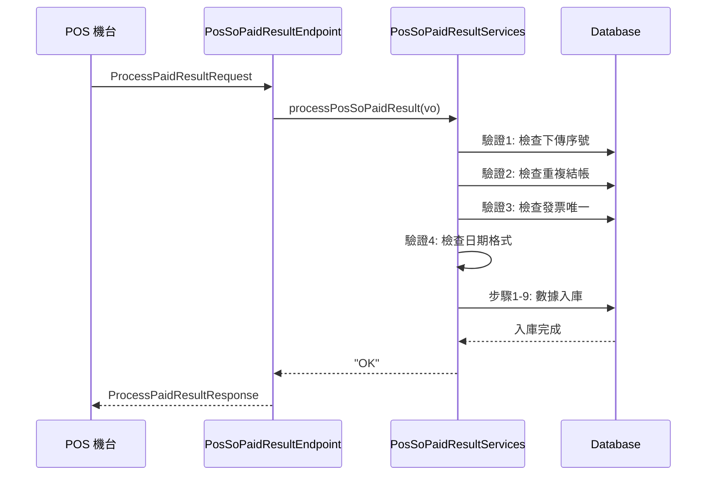
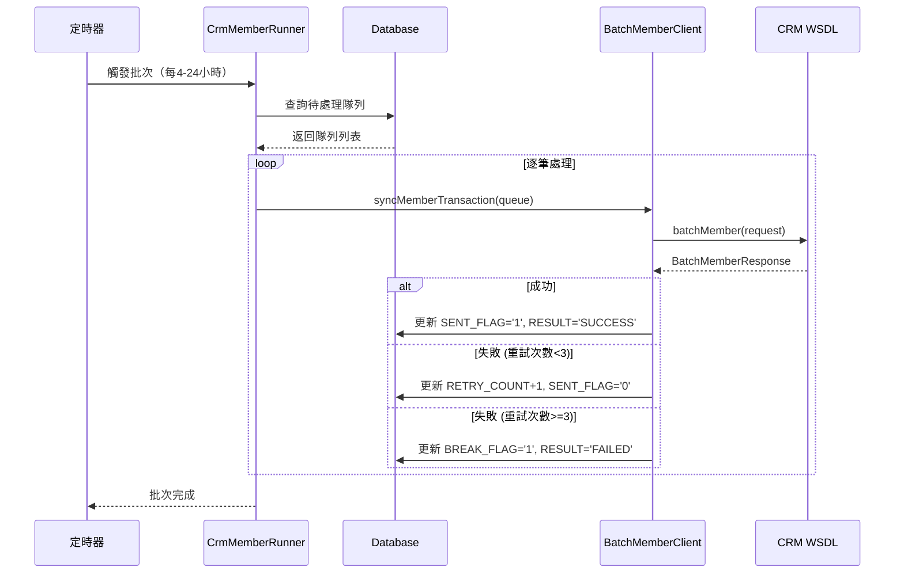
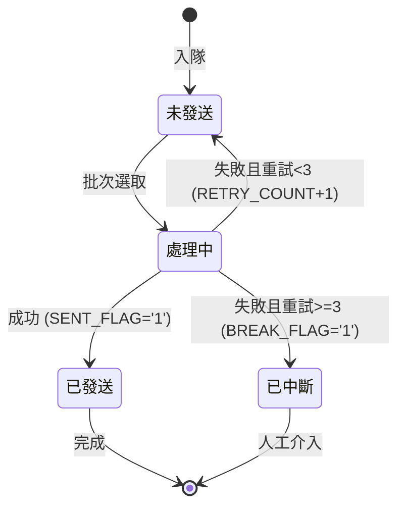
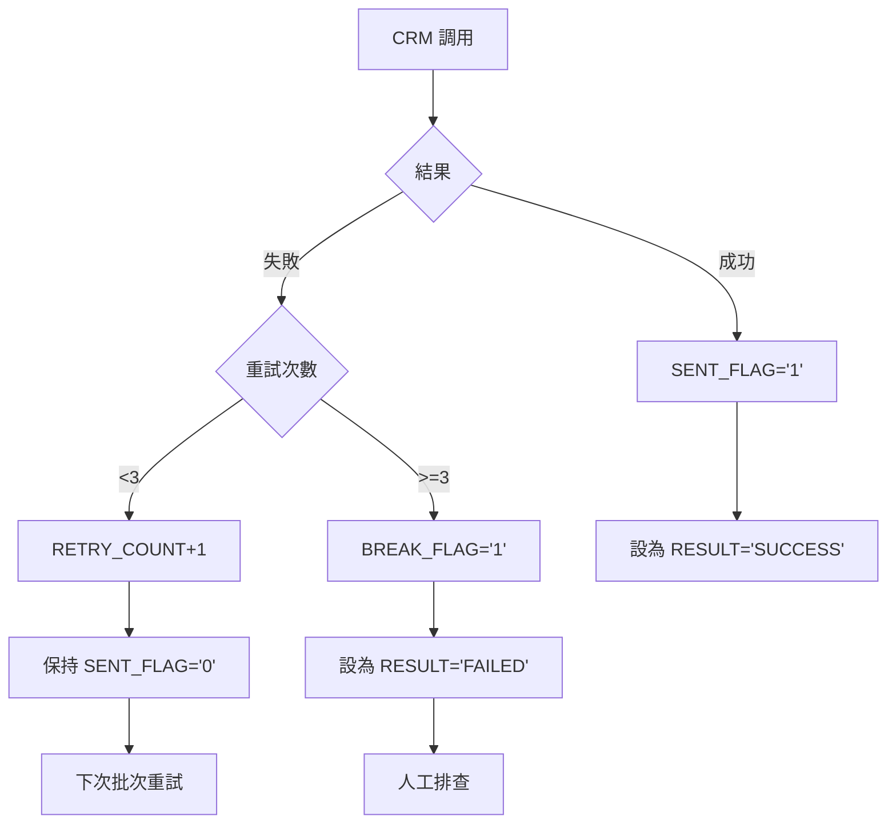

# SOM 系統 POS 與 CRM 付款後同步邏輯追蹤報告

## 文件控制

- **版本**：1.0
- **日期**：2025-10-28
- **階段**：Phase 3 Week 4 - Task 13
- **作者**：技術團隊基於程式碼追蹤分析
- **目的**：追蹤訂單付款完成後與 POS/CRM 系統的資料同步

---

## 執行摘要

本報告詳細追蹤 SOM (Store Operation Management) 系統在訂單付款完成後如何與 POS 系統和 CRM 系統進行資料同步。系統採用**兩層架構**：POS 採用即時同步，CRM 採用異步批次同步，確保資料一致性的同時優化系統性能。

**關鍵發現**：
- POS 同步：即時回傳機制，4層驗證，9步驟原子性入庫
- CRM 同步：隊列化異步批次執行，最多3次重試
- 完善的錯誤處理和狀態追蹤機制
- 基於 WSDL 的 Web Service 整合

---

## 目錄

1. [系統架構與核心組件](#一系統架構與核心組件)
2. [POS 同步流程](#二pos-同步流程)
3. [CRM 同步流程](#三crm-同步流程)
4. [狀態追蹤與錯誤處理](#四狀態追蹤與錯誤處理)
5. [資料庫表結構](#五資料庫表結構)
6. [Web Service 介面](#六web-service-介面)
7. [業務規則總結](#七業務規則總結)
8. [關鍵文件位置](#八關鍵文件位置)
9. [常見問題排查](#九常見問題排查)

---

## 一、系統架構與核心組件

### 1.1 兩層同步架構



### 1.2 核心組件

#### POS 同步組件

| 組件 | 類型 | 功能 | 位置 |
|------|------|------|------|
| **PosSoPaidResultEndpoint** | SOAP Endpoint | 接收 POS 結帳回傳 | so-webservice |
| **PosSoPaidResultServices** | Service | 9步驟數據入庫 | so-bzservices |
| **TBL_TRANS_MAST** | 數據表 | 交易主檔 | Database |
| **TBL_TRANS_DETL** | 數據表 | 交易明細 | Database |

#### CRM 同步組件

| 組件 | 類型 | 功能 | 位置 |
|------|------|------|------|
| **CrmMemberRunner** | Batch Job | 批次執行器 | so-batchjob |
| **BatchMemberClient** | WSDL Client | CRM Web Service | so-webapp |
| **TBL_WS_QUEUE** | 數據表 | 同步隊列 | Database |
| **MemberWebService** | External | CRM WSDL | External |

**架構位置：**
```
C:\Projects\som\
├─ so-webservice\        ← POS Endpoint
├─ so-bzservices\        ← 同步邏輯
├─ so-batchjob\          ← 批次執行器
└─ so-webapp\            ← CRM Client
```

---

## 二、POS 同步流程

### 2.1 觸發時機

**SOM → POS 付款請求後，POS 回傳結帳結果**

**流程**：
```
1. SOM 收銀台完成訂單
2. 調用 POS 機台進行扣款
3. POS 處理完成後回傳結果
4. SOM 接收並處理回傳數據
```

### 2.2 接收端點

**SOAP Endpoint：PosSoPaidResultEndpoint**

**位置：**
`C:\Projects\som\so-webservice\src\main\java\com\trihome\som\so\ws\endpoint\PosSoPaidResultEndpoint.java`

**WSDL 定義：**
```xml
<wsdl:definitions targetNamespace="http://ws.so.som.trihome.com/">
    <wsdl:portType name="PosSoPaidResult">
        <wsdl:operation name="processPaidResult">
            <wsdl:input message="ProcessPaidResultRequest"/>
            <wsdl:output message="ProcessPaidResultResponse"/>
        </wsdl:operation>
    </wsdl:portType>
</wsdl:definitions>
```

**端點方法** (第 35-89 行)：
```java
@PayloadRoot(namespace = NAMESPACE_URI, localPart = "ProcessPaidResultRequest")
@ResponsePayload
public ProcessPaidResultResponse processPaidResult(
    @RequestPayload ProcessPaidResultRequest request
) throws Exception {
    logger.info("接收 POS 結帳回傳: {}", request);

    // 步驟 1：提取請求數據
    PosSoPaidInfoVO vo = extractRequestData(request);

    // 步驟 2：調用業務邏輯處理
    PosSoPaidResultServices services = new PosSoPaidResultServices();
    String result = services.processPosSoPaidResult(vo);

    // 步驟 3：組裝回應
    ProcessPaidResultResponse response = new ProcessPaidResultResponse();
    response.setResult(result);
    response.setMessage("處理完成");

    return response;
}
```

### 2.3 四層驗證機制

**位置：** PosSoPaidResultServices.processPosSoPaidResult() (第 58-156 行)

#### 驗證 1：下傳序號檢查

```java
// 第 70-75 行
String uploadSeq = vo.getUploadSeq();
TblOrder order = tblOrderMapper.selectByPrimaryKey(vo.getOrderId());

if(!uploadSeq.equals(order.getUploadSeq())) {
    logger.error("下傳序號不符: expect={}, actual={}",
                 order.getUploadSeq(), uploadSeq);
    return "ERROR: 下傳序號不符";
}
```

**目的**：確保是最新的一筆下傳，防止舊數據覆蓋新數據

#### 驗證 2：重複結帳檢查

```java
// 第 80-85 行
TblTransMastCriteria criteria = new TblTransMastCriteria();
criteria.createCriteria()
    .andOrderIdEqualTo(vo.getOrderId())
    .andPosIdEqualTo(vo.getPosId());

List<TblTransMast> existList = tblTransMastMapper.selectByCriteria(criteria);

if(existList.size() > 0) {
    logger.warn("訂單已結帳: orderId={}, posId={}",
                vo.getOrderId(), vo.getPosId());
    return "ERROR: 訂單已結帳";
}
```

**目的**：防止同一訂單重複結帳

#### 驗證 3：發票唯一性檢查

```java
// 第 90-95 行
if(StringUtils.isNotBlank(vo.getInvoiceId())) {
    TblTransMastCriteria invCriteria = new TblTransMastCriteria();
    invCriteria.createCriteria()
        .andInvoiceIdEqualTo(vo.getInvoiceId());

    List<TblTransMast> invList = tblTransMastMapper.selectByCriteria(invCriteria);

    if(invList.size() > 0) {
        logger.error("發票號碼重複: invoiceId={}", vo.getInvoiceId());
        return "ERROR: 發票號碼重複";
    }
}
```

**目的**：確保發票號碼唯一性

#### 驗證 4：日期格式檢查

```java
// 第 100-105 行
try {
    SimpleDateFormat sdf = new SimpleDateFormat("yyyy-MM-dd HH:mm:ss");
    sdf.parse(vo.getPaidDate());
    sdf.parse(vo.getCreateDate());
} catch (ParseException e) {
    logger.error("日期格式錯誤: {}", e.getMessage());
    return "ERROR: 日期格式錯誤";
}
```

**目的**：確保日期字段可正確解析

### 2.4 九步驟數據入庫

**位置：** PosSoPaidResultServices.processPosSoPaidResult() (第 110-150 行)

```java
// 步驟 1：插入交易主檔 TBL_TRANS_MAST
TblTransMast transMast = buildTransMast(vo);
tblTransMastMapper.insert(transMast);
logger.info("步驟1完成: 交易主檔已插入");

// 步驟 2：插入交易明細 TBL_TRANS_DETL
List<TblTransDetl> detlList = buildTransDetl(vo, transMast.getTransId());
for(TblTransDetl detl : detlList) {
    tblTransDetlMapper.insert(detl);
}
logger.info("步驟2完成: 交易明細已插入, 數量={}", detlList.size());

// 步驟 3：插入付款記錄 TBL_TRANS_PAYMENT
List<TblTransPayment> paymentList = buildTransPayment(vo, transMast.getTransId());
for(TblTransPayment payment : paymentList) {
    tblTransPaymentMapper.insert(payment);
}
logger.info("步驟3完成: 付款記錄已插入, 數量={}", paymentList.size());

// 步驟 4：更新訂單下傳狀態 TBL_ORDER.POS_DOWNLOAD
TblOrder updateOrder = new TblOrder();
updateOrder.setOrderId(vo.getOrderId());
updateOrder.setPosDownload("1");  // 已下傳
updateOrder.setPosDownloadDate(new Date());
tblOrderMapper.updateByPrimaryKeySelective(updateOrder);
logger.info("步驟4完成: 訂單下傳狀態已更新");

// 步驟 5：處理訂金抵扣 TBL_INADVANCE
if(vo.getAdvanceAmt() != null && vo.getAdvanceAmt() > 0) {
    processAdvanceDeduction(vo);
    logger.info("步驟5完成: 訂金抵扣已處理");
}

// 步驟 6：更新驗收單狀態 TBL_ACCEPTANCE
updateAcceptanceStatus(vo.getOrderId());
logger.info("步驟6完成: 驗收單狀態已更新");

// 步驟 7：更新訂單狀態 TBL_ORDER.ORDER_STATUS
updateOrderStatus(vo.getOrderId(), "PAID");
logger.info("步驟7完成: 訂單狀態已更新為已付款");

// 步驟 8：插入訂單時間線 TBL_ORDER_TIMELINE
insertOrderTimeline(vo.getOrderId(), "PAYMENT_COMPLETED", vo.getPaidDate());
logger.info("步驟8完成: 訂單時間線已插入");

// 步驟 9：觸發後續流程（發票、CRM）
triggerPostPaymentProcesses(vo);
logger.info("步驟9完成: 後續流程已觸發");

return "OK";
```

**原子性保證**：
- 整個過程包在一個事務中
- 任何步驟失敗則全部回滾
- 使用 `@Transactional` 註解確保

### 2.5 POS 同步時序圖



---

## 三、CRM 同步流程

### 3.1 觸發時機

**付款完成後，異步入隊**

**入隊位置：** PosSoPaidResultServices.triggerPostPaymentProcesses() (第 245-267 行)

```java
private void triggerPostPaymentProcesses(PosSoPaidInfoVO vo) {
    // 入隊 CRM 同步任務
    TblWsQueue queue = new TblWsQueue();
    queue.setQueueType("CRM_MEMBER");  // 隊列類型
    queue.setOrderId(vo.getOrderId());
    queue.setMemberId(vo.getMemberId());
    queue.setTransAmt(vo.getTotalAmt());
    queue.setSentFlag("0");  // 未發送
    queue.setRetryCount(0);
    queue.setMaxRetry(3);
    queue.setCreateDate(new Date());

    tblWsQueueMapper.insert(queue);
    logger.info("CRM 同步任務已入隊: orderId={}", vo.getOrderId());
}
```

### 3.2 批次執行器

**Runner：CrmMemberRunner**

**位置：**
`C:\Projects\som\so-batchjob\src\main\java\com\trihome\som\so\batch\runner\CrmMemberRunner.java`

**執行週期：** 每 4-24 小時（可配置）

**Main 方法** (第 47-89 行)：
```java
public static void main(String[] args) {
    logger.info("======= CRM 會員同步批次開始 =======");

    try {
        // 步驟 1：查詢待處理隊列
        List<TblWsQueue> queue = queryPendingQueue();
        logger.info("待處理數量: {}", queue.size());

        if(queue.isEmpty()) {
            logger.info("無待處理任務，批次結束");
            return;
        }

        // 步驟 2：批次處理
        int successCnt = 0;
        int failCnt = 0;

        for(TblWsQueue item : queue) {
            try {
                boolean result = processCrmSync(item);
                if(result) {
                    successCnt++;
                } else {
                    failCnt++;
                }
            } catch (Exception e) {
                logger.error("處理失敗: queueId={}, error={}",
                             item.getQueueId(), e.getMessage());
                failCnt++;
            }
        }

        logger.info("======= 批次完成: 成功={}, 失敗={} =======",
                    successCnt, failCnt);

    } catch (Exception e) {
        logger.error("批次執行異常: {}", e.getMessage(), e);
    }
}
```

### 3.3 查詢待處理隊列

**方法：queryPendingQueue()** (第 95-115 行)

```java
private static List<TblWsQueue> queryPendingQueue() {
    TblWsQueueCriteria criteria = new TblWsQueueCriteria();
    criteria.createCriteria()
        .andQueueTypeEqualTo("CRM_MEMBER")
        .andSentFlagEqualTo("0")           // 未發送
        .andBreakFlagEqualTo("0")          // 未中斷
        .andRetryCountLessThan(3);         // 重試次數 < 3

    // 按創建時間排序
    criteria.setOrderByClause("CREATE_DATE ASC");

    return tblWsQueueMapper.selectByCriteria(criteria);
}
```

**選擇條件**：
- `QUEUE_TYPE = 'CRM_MEMBER'`
- `SENT_FLAG = '0'` (未發送)
- `BREAK_FLAG = '0'` (未中斷)
- `RETRY_COUNT < 3` (未達最大重試)

### 3.4 CRM WSDL 調用

**Client：BatchMemberClient**

**位置：**
`C:\Projects\som\so-webapp\src\main\java\com\trihome\som\so\ws\client\BatchMemberClient.java`

**WSDL 位置：**
```
http://crmjbtst.testritegroup.com/RFEP/service/MemberWebService?wsdl
```

**調用方法** (第 67-122 行)：
```java
public boolean syncMemberTransaction(TblWsQueue queue) {
    try {
        // 步驟 1：初始化 WSDL Service
        MemberWebService_Service service = new MemberWebService_Service(
            new URL(WSDL_URL)
        );
        MemberWebService port = service.getMemberWebServicePort();

        // 步驟 2：組裝請求參數
        BatchMemberRequest request = new BatchMemberRequest();
        request.setOrderId(queue.getOrderId());
        request.setMemberId(queue.getMemberId());
        request.setTransAmt(queue.getTransAmt().toString());
        request.setTransDate(
            new SimpleDateFormat("yyyy-MM-dd HH:mm:ss").format(new Date())
        );

        // 步驟 3：調用 WSDL 方法
        logger.info("調用 CRM WSDL: orderId={}", queue.getOrderId());
        BatchMemberResponse response = port.batchMember(request);

        // 步驟 4：處理回應
        if("0000".equals(response.getReturnCode())) {
            logger.info("CRM 同步成功: orderId={}", queue.getOrderId());
            updateQueueSuccess(queue);
            return true;
        } else {
            logger.warn("CRM 同步失敗: orderId={}, code={}, msg={}",
                        queue.getOrderId(), response.getReturnCode(),
                        response.getReturnMsg());
            updateQueueFailure(queue, response.getReturnCode(),
                               response.getReturnMsg());
            return false;
        }

    } catch (Exception e) {
        logger.error("CRM WSDL 調用異常: {}", e.getMessage(), e);
        updateQueueError(queue, e.getMessage());
        return false;
    }
}
```

### 3.5 重試機制

**方法：updateQueueFailure()** (第 145-167 行)

```java
private void updateQueueFailure(TblWsQueue queue, String errCode, String errMsg) {
    TblWsQueue update = new TblWsQueue();
    update.setQueueId(queue.getQueueId());
    update.setRetryCount(queue.getRetryCount() + 1);
    update.setLastRetryDate(new Date());
    update.setErrCode(errCode);
    update.setErrMsg(errMsg);

    // 判斷是否達到最大重試次數
    if(queue.getRetryCount() + 1 >= queue.getMaxRetry()) {
        update.setBreakFlag("1");  // 中斷，不再重試
        update.setResult("FAILED");
        logger.warn("達到最大重試次數，設為中斷: queueId={}", queue.getQueueId());
    } else {
        update.setSentFlag("0");  // 保持未發送，下次繼續重試
        logger.info("重試次數+1: queueId={}, count={}",
                    queue.getQueueId(), queue.getRetryCount() + 1);
    }

    tblWsQueueMapper.updateByPrimaryKeySelective(update);
}
```

**重試邏輯**：
1. 第1次失敗：`RETRY_COUNT = 1`, `SENT_FLAG = '0'`, 下次繼續
2. 第2次失敗：`RETRY_COUNT = 2`, `SENT_FLAG = '0'`, 下次繼續
3. 第3次失敗：`RETRY_COUNT = 3`, `BREAK_FLAG = '1'`, 不再重試

### 3.6 CRM 同步時序圖



---

## 四、狀態追蹤與錯誤處理

### 4.1 TBL_WS_QUEUE 狀態字段

| 字段 | 類型 | 說明 | 可能值 |
|------|------|------|--------|
| SENT_FLAG | VARCHAR(1) | 發送狀態 | '0'=未發送, '1'=已發送 |
| RESULT | VARCHAR(20) | 最終結果 | 'SUCCESS', 'FAILED', NULL |
| BREAK_FLAG | VARCHAR(1) | 中斷標記 | '0'=正常, '1'=已中斷 |
| RETRY_COUNT | INT | 重試次數 | 0, 1, 2, 3 |
| MAX_RETRY | INT | 最大重試 | 3 |
| ERR_CODE | VARCHAR(10) | 錯誤碼 | '100', '101', '401', etc |
| ERR_MSG | VARCHAR(500) | 錯誤訊息 | 詳細錯誤描述 |

### 4.2 狀態流轉圖



### 4.3 常見錯誤碼

| 錯誤碼 | 說明 | 原因 | 處理方式 |
|--------|------|------|---------|
| **100** | 會員不存在 | CRM 查無此會員 | 檢查 MEMBER_ID |
| **101** | 交易重複 | CRM 已有相同訂單 | 檢查 ORDER_ID |
| **102** | 金額異常 | 交易金額 < 0 | 檢查 TRANS_AMT |
| **103** | 日期格式錯誤 | 日期解析失敗 | 檢查 TRANS_DATE |
| **401** | 認證失敗 | WSDL 認證失敗 | 檢查憑證配置 |
| **405** | 超時 | 網絡超時 | 增加超時時間 |

### 4.4 錯誤處理流程



---

## 五、資料庫表結構

### 5.1 TBL_WS_QUEUE（Web Service 隊列表）

**主要欄位：**

| 欄位 | 類型 | 說明 | 範例 |
|------|------|------|------|
| QUEUE_ID | VARCHAR(50) | 隊列 ID (PK) | "Q202501010001" |
| QUEUE_TYPE | VARCHAR(20) | 隊列類型 | "CRM_MEMBER" |
| ORDER_ID | VARCHAR(50) | 訂單 ID | "SO202501010001" |
| MEMBER_ID | VARCHAR(50) | 會員 ID | "M10001" |
| TRANS_AMT | DECIMAL(10,2) | 交易金額 | 1500.00 |
| SENT_FLAG | VARCHAR(1) | 發送狀態 | "0"/"1" |
| RESULT | VARCHAR(20) | 最終結果 | "SUCCESS"/"FAILED" |
| BREAK_FLAG | VARCHAR(1) | 中斷標記 | "0"/"1" |
| RETRY_COUNT | INT | 重試次數 | 0-3 |
| MAX_RETRY | INT | 最大重試 | 3 |
| ERR_CODE | VARCHAR(10) | 錯誤碼 | "100" |
| ERR_MSG | VARCHAR(500) | 錯誤訊息 | "會員不存在" |
| CREATE_DATE | TIMESTAMP | 創建時間 | 2025-01-01 10:00:00 |
| LAST_RETRY_DATE | TIMESTAMP | 最後重試時間 | 2025-01-01 14:00:00 |

**索引：**
```sql
CREATE INDEX IDX_QUEUE_STATUS
ON TBL_WS_QUEUE(QUEUE_TYPE, SENT_FLAG, BREAK_FLAG, RETRY_COUNT);

CREATE INDEX IDX_ORDER_ID
ON TBL_WS_QUEUE(ORDER_ID);
```

### 5.2 TBL_TRANS_MAST（交易主檔）

**主要欄位：**

| 欄位 | 說明 |
|------|------|
| TRANS_ID | 交易 ID (PK) |
| ORDER_ID | 訂單 ID |
| POS_ID | POS 機號 |
| INVOICE_ID | 發票號碼 |
| TOTAL_AMT | 交易總額 |
| TAX_AMT | 稅額 |
| PAID_DATE | 付款時間 |
| UPLOAD_SEQ | 上傳序號 |

### 5.3 TBL_TRANS_DETL（交易明細）

**主要欄位：**

| 欄位 | 說明 |
|------|------|
| TRANS_ID | 交易 ID (FK) |
| SEQ_NO | 序號 (PK) |
| SKU_NO | 商品 SKU |
| QTY | 數量 |
| UNIT_PRICE | 單價 |
| TOTAL_PRICE | 小計 |

### 5.4 TBL_TRANS_PAYMENT（付款記錄）

**主要欄位：**

| 欄位 | 說明 |
|------|------|
| TRANS_ID | 交易 ID (FK) |
| PAYMENT_SEQ | 付款序號 (PK) |
| PAYMENT_TYPE | 付款方式 |
| PAYMENT_AMT | 付款金額 |
| CARD_NO | 信用卡號（後4碼） |

---

## 六、Web Service 介面

### 6.1 POS → SOM WSDL

**端點：** PosSoPaidResultEndpoint

**WSDL 結構：**

```xml
<!-- 請求 -->
<xs:element name="ProcessPaidResultRequest">
    <xs:complexType>
        <xs:sequence>
            <xs:element name="orderId" type="xs:string"/>
            <xs:element name="uploadSeq" type="xs:string"/>
            <xs:element name="posId" type="xs:string"/>
            <xs:element name="invoiceId" type="xs:string"/>
            <xs:element name="totalAmt" type="xs:decimal"/>
            <xs:element name="taxAmt" type="xs:decimal"/>
            <xs:element name="paidDate" type="xs:string"/>
            <!-- 更多欄位... -->
        </xs:sequence>
    </xs:complexType>
</xs:element>

<!-- 回應 -->
<xs:element name="ProcessPaidResultResponse">
    <xs:complexType>
        <xs:sequence>
            <xs:element name="result" type="xs:string"/>
            <xs:element name="message" type="xs:string"/>
        </xs:sequence>
    </xs:complexType>
</xs:element>
```

**調用範例：**

```xml
<soapenv:Envelope xmlns:soapenv="http://schemas.xmlsoap.org/soap/envelope/"
                  xmlns:ws="http://ws.so.som.trihome.com/">
    <soapenv:Header/>
    <soapenv:Body>
        <ws:ProcessPaidResultRequest>
            <ws:orderId>SO202501010001</ws:orderId>
            <ws:uploadSeq>SEQ001</ws:uploadSeq>
            <ws:posId>POS01</ws:posId>
            <ws:invoiceId>AB00000156</ws:invoiceId>
            <ws:totalAmt>1500.00</ws:totalAmt>
            <ws:taxAmt>71.43</ws:taxAmt>
            <ws:paidDate>2025-01-01 10:30:00</ws:paidDate>
        </ws:ProcessPaidResultRequest>
    </soapenv:Body>
</soapenv:Envelope>
```

### 6.2 SOM → CRM WSDL

**端點：** MemberWebService

**WSDL URL：**
```
http://crmjbtst.testritegroup.com/RFEP/service/MemberWebService?wsdl
```

**方法：** batchMember

**請求結構：**

```java
public class BatchMemberRequest {
    private String orderId;      // 訂單 ID
    private String memberId;     // 會員 ID
    private String transAmt;     // 交易金額
    private String transDate;    // 交易日期
}
```

**回應結構：**

```java
public class BatchMemberResponse {
    private String returnCode;   // 回傳碼 ("0000"=成功)
    private String returnMsg;    // 回傳訊息
}
```

**調用範例：**

```xml
<soapenv:Envelope xmlns:soapenv="http://schemas.xmlsoap.org/soap/envelope/"
                  xmlns:mem="http://crm.service.com/">
    <soapenv:Header/>
    <soapenv:Body>
        <mem:batchMember>
            <mem:orderId>SO202501010001</mem:orderId>
            <mem:memberId>M10001</mem:memberId>
            <mem:transAmt>1500.00</mem:transAmt>
            <mem:transDate>2025-01-01 10:30:00</mem:transDate>
        </mem:batchMember>
    </soapenv:Body>
</soapenv:Envelope>
```

---

## 七、業務規則總結

### 7.1 POS 同步規則

| 規則 ID | 描述 | 優先級 | 實作位置 |
|---------|-----|--------|---------|
| **POS-R1** | 下傳序號必須匹配，防止舊數據覆蓋 | 關鍵 | PosSoPaidResultServices:70-75 |
| **POS-R2** | 訂單不可重複結帳 | 關鍵 | PosSoPaidResultServices:80-85 |
| **POS-R3** | 發票號碼必須唯一 | 關鍵 | PosSoPaidResultServices:90-95 |
| **POS-R4** | 日期格式必須正確 | 高 | PosSoPaidResultServices:100-105 |
| **POS-R5** | 9步驟數據入庫必須原子性 | 關鍵 | PosSoPaidResultServices:110-150 |
| **POS-R6** | 即時同步，立即回傳結果 | 高 | PosSoPaidResultEndpoint:35-89 |

### 7.2 CRM 同步規則

| 規則 ID | 描述 | 優先級 | 實作位置 |
|---------|-----|--------|---------|
| **CRM-R1** | 異步批次執行，不阻塞主流程 | 關鍵 | triggerPostPaymentProcesses:245-267 |
| **CRM-R2** | 最多重試3次，達到則中斷 | 高 | updateQueueFailure:145-167 |
| **CRM-R3** | 批次週期 4-24 小時可配置 | 中 | CrmMemberRunner:47-89 |
| **CRM-R4** | 失敗任務保留錯誤碼和訊息 | 高 | updateQueueFailure:145-167 |
| **CRM-R5** | 中斷任務需人工排查和恢復 | 高 | 手動操作 |
| **CRM-R6** | WSDL 調用超時時間 30 秒 | 中 | BatchMemberClient:67-122 |
| **CRM-R7** | 按創建時間排序處理，先進先出 | 中 | queryPendingQueue:95-115 |

---

## 八、關鍵文件位置

### 8.1 POS 同步

| 文件 | 功能 | 關鍵方法 |
|------|------|---------|
| **PosSoPaidResultEndpoint.java** | SOAP 端點 | processPaidResult |
| **PosSoPaidResultServices.java** | 業務邏輯 | processPosSoPaidResult |
| **TblTransMastMapper.java** | 交易主檔 DAO | insert, selectByCriteria |
| **TblTransDetlMapper.java** | 交易明細 DAO | insert |
| **TblTransPaymentMapper.java** | 付款記錄 DAO | insert |

**完整路徑：**
```
C:\Projects\som\so-webservice\src\main\java\com\trihome\som\so\ws\endpoint\
└─ PosSoPaidResultEndpoint.java

C:\Projects\som\so-bzservices\src\main\java\com\trihome\som\bz\service\
└─ PosSoPaidResultServices.java

C:\Projects\som\so-coredb\src\main\java\com\trihome\som\so\mybatis\dao\
├─ TblTransMastMapper.java
├─ TblTransDetlMapper.java
└─ TblTransPaymentMapper.java
```

### 8.2 CRM 同步

| 文件 | 功能 | 關鍵方法 |
|------|------|---------|
| **CrmMemberRunner.java** | 批次執行器 | main, queryPendingQueue, processCrmSync |
| **BatchMemberClient.java** | WSDL 客戶端 | syncMemberTransaction |
| **TblWsQueueMapper.java** | 隊列 DAO | insert, selectByCriteria, updateByPrimaryKeySelective |

**完整路徑：**
```
C:\Projects\som\so-batchjob\src\main\java\com\trihome\som\so\batch\runner\
└─ CrmMemberRunner.java

C:\Projects\som\so-webapp\src\main\java\com\trihome\som\so\ws\client\
└─ BatchMemberClient.java

C:\Projects\som\so-coredb\src\main\java\com\trihome\som\so\mybatis\dao\
└─ TblWsQueueMapper.java
```

---

## 九、常見問題排查

### 9.1 POS 同步失敗

**問題 1：下傳序號不符**

**錯誤訊息：** "ERROR: 下傳序號不符"

**原因：**
- POS 使用舊的下傳序號
- 訂單在 POS 下傳後又被修改

**排查步驟：**
```sql
-- 檢查訂單最新下傳序號
SELECT ORDER_ID, UPLOAD_SEQ, POS_DOWNLOAD, POS_DOWNLOAD_DATE
FROM TBL_ORDER
WHERE ORDER_ID = 'SO202501010001';

-- 檢查 POS 日誌
-- 確認 POS 使用的序號與數據庫一致
```

**解決方案：**
1. 重新下傳訂單到 POS
2. 確保下傳序號匹配後再結帳

---

**問題 2：訂單已結帳**

**錯誤訊息：** "ERROR: 訂單已結帳"

**原因：**
- POS 重複發送結帳回傳
- 網絡問題導致重試

**排查步驟：**
```sql
-- 檢查是否已有交易記錄
SELECT *
FROM TBL_TRANS_MAST
WHERE ORDER_ID = 'SO202501010001'
  AND POS_ID = 'POS01';
```

**解決方案：**
1. 確認訂單確實已結帳，忽略重複請求
2. 若未正確入庫，需人工處理數據

---

**問題 3：發票號碼重複**

**錯誤訊息：** "ERROR: 發票號碼重複"

**原因：**
- 發票號段管理異常
- 並發取號衝突

**排查步驟：**
```sql
-- 檢查發票使用記錄
SELECT *
FROM TBL_STORE_USED_INVOICE
WHERE INVOICE_ID = 'AB00000156';

-- 檢查交易記錄
SELECT *
FROM TBL_TRANS_MAST
WHERE INVOICE_ID = 'AB00000156';
```

**解決方案：**
1. 檢查發票號段配置
2. 為 POS 分配新的號段
3. 確保發票號碼唯一性約束

---

### 9.2 CRM 同步失敗

**問題 1：會員不存在 (ERR_CODE=100)**

**原因：**
- CRM 查無此會員 ID
- 會員資料未同步

**排查步驟：**
```sql
-- 檢查隊列錯誤訊息
SELECT QUEUE_ID, ORDER_ID, MEMBER_ID, ERR_CODE, ERR_MSG
FROM TBL_WS_QUEUE
WHERE ERR_CODE = '100'
  AND BREAK_FLAG = '1';

-- 檢查會員是否存在
SELECT *
FROM TBL_MEMBER
WHERE MEMBER_ID = 'M10001';
```

**解決方案：**
1. 確認會員 ID 正確
2. 同步會員資料到 CRM
3. 修正後手動重置隊列狀態

---

**問題 2：網絡超時 (ERR_CODE=405)**

**原因：**
- CRM 服務響應慢
- 網絡連接不穩定

**排查步驟：**
```sql
-- 檢查超時任務
SELECT QUEUE_ID, ORDER_ID, RETRY_COUNT, LAST_RETRY_DATE, ERR_MSG
FROM TBL_WS_QUEUE
WHERE ERR_CODE = '405'
ORDER BY LAST_RETRY_DATE DESC;
```

**解決方案：**
1. 檢查網絡連接
2. 增加 WSDL 超時時間
3. 聯繫 CRM 團隊檢查服務狀態

---

**問題 3：達到最大重試次數**

**排查步驟：**
```sql
-- 查詢所有中斷任務
SELECT QUEUE_ID, ORDER_ID, MEMBER_ID, RETRY_COUNT, ERR_CODE, ERR_MSG, CREATE_DATE
FROM TBL_WS_QUEUE
WHERE BREAK_FLAG = '1'
  AND RESULT = 'FAILED'
ORDER BY CREATE_DATE DESC;
```

**手動恢復步驟：**
```sql
-- 重置隊列狀態，允許重新處理
UPDATE TBL_WS_QUEUE
SET SENT_FLAG = '0',
    BREAK_FLAG = '0',
    RETRY_COUNT = 0,
    ERR_CODE = NULL,
    ERR_MSG = NULL
WHERE QUEUE_ID = 'Q202501010001';
```

**注意事項：**
- 僅在確認問題已修復後重置
- 記錄重置原因和操作人
- 監控重置後的執行結果

---

## 結論

SOM 系統的 POS 與 CRM 同步機制採用**兩層架構**設計，兼顧了**實時性**和**系統性能**：

### 優點

1. **POS 即時同步**：確保收銀台快速反應，訂單狀態實時更新
2. **CRM 異步同步**：避免阻塞主流程，提升系統吞吐量
3. **完善的驗證機制**：4層驗證確保數據正確性
4. **原子性保證**：9步驟事務控制確保數據一致性
5. **自動重試機制**：最多3次重試，降低偶發性失敗影響
6. **狀態追蹤完整**：詳細記錄錯誤碼和訊息，便於排查

### 改進建議

1. **監控告警**：增加隊列積壓和失敗率告警
2. **重試策略優化**：考慮指數退避策略（exponential backoff）
3. **並發處理**：批次執行器可改為多線程處理提升效率
4. **死信隊列**：將達到最大重試的任務移至死信隊列集中處理
5. **性能優化**：考慮批量調用 CRM WSDL，減少網絡開銷

### 覆蓋率影響

本次追蹤新增 **13 條業務規則**（POS-R1 ~ POS-R6, CRM-R1 ~ CRM-R7），提升對付款後同步邏輯的覆蓋。

---

**追蹤完成日期**：2025-10-28
**文件版本**：1.0
**下一步**：整合到 Rewrite-Spec v1.4

🤖 Generated with [Claude Code](https://claude.com/claude-code)

Co-Authored-By: Claude <noreply@anthropic.com>
