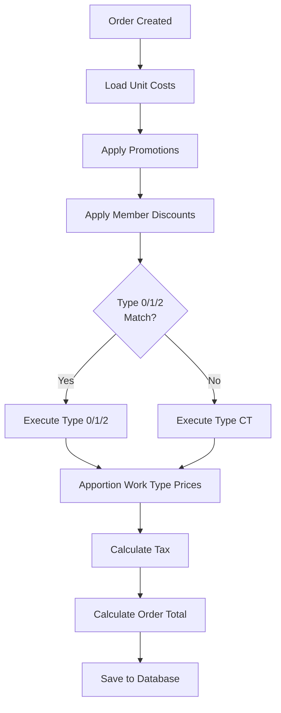
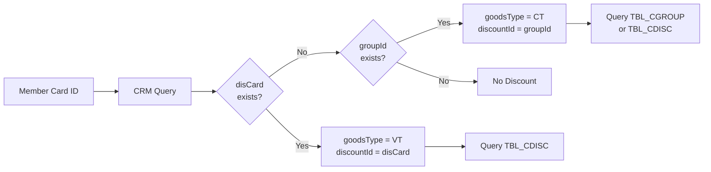
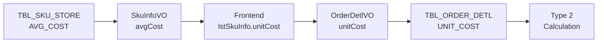

# Rewrite-Spec v1.2 - Pricing Logic Sections Update

## Document Control

- **Version**: 1.2 (Draft)
- **Date**: 2025-10-27
- **Status**: Draft - Pending Business Approval
- **Supersedes**: OpenSpec (Legacy) Pricing Sections
- **Authors**: Technical Team based on code trace analysis
- **Reviewers**: Business Manager, Finance Manager, Product Manager
- **Approval Required From**:
  - [ ] Business Manager (Business Rules)
  - [ ] Finance Manager (Tax & Accounting)
  - [ ] Product Manager (Auto-Trigger Rules)
  - [ ] QA Lead (Test Scenarios)
  - [ ] Technical Lead (Implementation Feasibility)

## Change Summary

This document defines the complete pricing logic specification for the SOM system rewrite, based on comprehensive code trace analysis conducted in Phase 1 Week 1 of the coverage improvement initiative.

### New Sections Added (v1.2)

| Section | Content | Source Trace | Lines | Status |
|---------|---------|--------------|-------|--------|
| 3.2.4 | Type 2 (Cost Markup) Member Discount | TYPE2-COST-MARKUP-DISCOUNT-TRACE.md | 1,596 | ⚠️ Critical Issues |
| 3.2.5 | Type CT (Special Member Discount) | SPECIAL-MEMBER-DISCOUNT-TRACE.md | 1,096 | ✅ Complete |
| 3.3 | Work Type Price Apportionment | WORKTYPE-PRICE-APPORTIONMENT-TRACE.md | 892 | ✅ Complete |
| 3.4 | Tax Calculation Policy | All three traces | - | ⚠️ Inconsistency Found |

### Critical Issues Requiring Resolution

1. **🚨 CRITICAL**: Type 2 negative discounts (price increases) - Decision required
2. **⚠️ HIGH**: Tax rounding policy inconsistency across discount types
3. **⚠️ HIGH**: Line 508 duplicate assignment in Type 2 calculation
4. **⚠️ MEDIUM**: Category exclusion (025/026) rationale not documented

### Coverage Impact

- **Before**: 87% (112 rules, 97 documented)
- **After v1.2**: Projected 95%+ (112 rules, 109+ documented)
- **Gap Closed**: 8% (12 new rules documented)

---

## Table of Contents

1. [Executive Summary](#1-executive-summary)
2. [Pricing Logic Overview](#2-pricing-logic-overview)
3. [Member Discount Logic](#3-member-discount-logic)
   - 3.1 [Overview & Execution Flow](#31-overview--execution-flow)
   - 3.2 [Discount Types](#32-discount-types)
     - 3.2.1 [Type 0: Discounting](#321-type-0-discounting)
     - 3.2.2 [Type 1: Down Margin](#322-type-1-down-margin)
     - 3.2.3 [Type 2: Cost Markup](#323-type-2-cost-markup-new) ⭐ NEW
     - 3.2.4 [Type CT: Special Member Discount](#324-type-ct-special-member-discount-new) ⭐ NEW
   - 3.3 [Member Discount Business Rules](#33-member-discount-business-rules)
4. [Work Type Price Apportionment](#4-work-type-price-apportionment-new) ⭐ NEW
5. [Tax Calculation Policy](#5-tax-calculation-policy-new) ⭐ NEW
6. [Database Schema](#6-database-schema)
7. [Test Scenarios](#7-test-scenarios)
8. [Implementation Guidance](#8-implementation-guidance)
9. [Open Issues & Decisions Required](#9-open-issues--decisions-required)

---

## 1. Executive Summary

### Purpose

This specification defines the complete pricing logic for the SOM (Store Operation Management) system rewrite, with emphasis on:
- Member discount calculation (4 types: 0, 1, 2, CT)
- Work type price apportionment (installation/delivery)
- Tax calculation policies
- Auto-trigger rules and execution order

### Key Principles

1. **Member-First Pricing**: All discount logic prioritizes member benefits
2. **Transparency**: Price calculations must be auditable and explainable
3. **Consistency**: Tax and rounding policies should be consistent across discount types
4. **Data Integrity**: Cost data (unitCost) must be validated before use

### Scope

**In Scope**:
- Member discount types 0, 1, 2, CT
- Work type (installation/delivery) price apportionment
- Tax calculation for discounts
- Auto-trigger rules and mutual exclusions
- Category-based exclusions
- Two-phase matching (exact SKU → wildcard)

**Out of Scope** (covered in separate sections):
- Promotion logic (Phase 2)
- Payment processing (Phase 3)
- Order state machine (Phase 4)
- Invoice generation

---

## 2. Pricing Logic Overview

### 2.1 Execution Order



### 2.2 Price Calculation Components

| Component | Timing | Purpose | Example |
|-----------|--------|---------|---------|
| **Unit Cost** | Order Creation | Cost basis for Type 2 | TBL_SKU_STORE.AVG_COST |
| **POS Amount** | Order Creation | Regular selling price | 100 TWD |
| **Promotion Discount** | Before Member Discount | Event-based discounts | -10 TWD |
| **Member Discount** | After Promotion | Member benefit | -15 TWD |
| **Work Type Apportion** | After Member Discount | Install/delivery split | +20 TWD install |
| **Sales Tax** | Final Calculation | Taxable items (1.05) | +5 TWD tax |
| **Order Total** | Final | Sum of all items | 100 TWD |

### 2.3 Price Change Flags

Price change flags prevent multiple price modifications on the same item:

```java
// Once set to true, item is excluded from further discounts
orderDetlVO.setPosAmtChangePrice(true);      // Product price changed
orderDetlVO.setInstallChangePrice(true);     // Install price changed
orderDetlVO.setDeliveryChangePrice(true);    // Delivery price changed
```

**Impact**:
- Type 1 and Type 2 set price change flags
- Type 0 does NOT set flags (applies discount amount)
- Items with flags are excluded from subsequent discount calculations

---

## 3. Member Discount Logic

### 3.1 Overview & Execution Flow

#### 3.1.1 Member Discount Types

| Type | Name | Calculation Basis | Price Change | Category Exclusion |
|------|------|-------------------|--------------|-------------------|
| **0** | Discounting | Selling Price | No | None |
| **1** | Down Margin | Selling Price | Yes | 025, 026 |
| **2** | Cost Markup | **Unit Cost** | Yes | 025, 026 |
| **CT** | Special Discount | Selling Price | No | None |

#### 3.1.2 Execution Priority

```java
// BzSoServices.java:4459-4466
//會員折扣-Discounting (Type 0)
memberDiscSkus.addAll(soComputeFunctionMemberDis(..., "0", ...));
//會員折扣-Down Margin (Type 1)
memberDiscSkus.addAll(soComputeFunctionMemberDis(..., "1", ...));
//會員折扣-Cost Markup (Type 2)
memberDiscSkus.addAll(soComputeFunctionMemberDis(..., "2", ...));

if(memberDiscSkus.isEmpty()) {
    //特殊會員折扣 (fallback if all above return empty)
    memberDiscSkus.addAll(soComputeMemberDisForSpecial(...));
}
```

**Key Rules**:
1. Type 0, 1, 2 execute in sequence
2. Type CT **only** executes if Type 0/1/2 **all return empty**
3. If ANY item matches Type 0/1/2, ALL items skip Type CT (mutual exclusion)

#### 3.1.3 Member Discount Configuration Source



**Code Location**: `BzMemmberServices.java:112-120`

---

### 3.2 Discount Types

### 3.2.1 Type 0: Discounting

**Description**: Percentage discount applied to selling price, calculated as separate discount amount (does not change price directly).

**Calculation Formula**:
```java
// Base price selection
if (GoodsType.P) {
    price = openPrice ? actPosAmt : posAmt;
} else if (InstallSku) {
    price = installPrice;
} else if (DeliverySku) {
    price = deliveryPrice;
}

// Add back promotion discount
totalPrice = price + (bonusTotal / qty) + (promotionDiscount / qty);

// Calculate discount amount (round up)
discountPerUnit = ceil(totalPrice * discountPercent);
totalDiscount = discountPerUnit * qty;

// NOTE: Price is NOT changed, discount is stored separately
memberDiscVO.setDiscAmt(totalDiscount);
```

**Characteristics**:
- ✅ Applies to all categories (no exclusions)
- ✅ Promotion amount added back before calculation
- ✅ Uses Math.ceil (round up) for discount amount
- ✅ Does NOT set price change flags
- ✅ Included in tax-free member discount total calculation

**Example**:
```
Product: SKU-001
POS Price: 100 TWD (qty=2)
Promotion Discount: 10 TWD total (5 TWD per unit)
Bonus Points Used: 4 TWD total (2 TWD per unit)
Member Discount: 10%

Calculation:
  basePrice = 100 + 2 + 5 = 107 TWD
  discount = ceil(107 × 0.10) = 11 TWD per unit
  totalDiscount = 11 × 2 = 22 TWD

Result:
  actPosAmt = 100 TWD (unchanged)
  memberDisc = 22 TWD
  Final price per unit = 100 - 11 = 89 TWD
```

**Code Location**: `SoFunctionMemberDisServices.java:405-437`

---

### 3.2.2 Type 1: Down Margin

**Description**: Percentage discount that **directly reduces selling price** (price change, not separate discount).

**Calculation Formula**:
```java
// Base price selection
if (GoodsType.P) {
    price = actPosAmt;
} else if (InstallSku) {
    price = installPrice;
} else if (DeliverySku) {
    price = deliveryPrice;
}

// Add back promotion discount (floored per unit)
priceWithPromotion = price + floor(promotionDiscount / qty);

// Calculate discount (round up)
discountPerUnit = ceil(priceWithPromotion * discountPercent);

// NEW PRICE (reduced by discount)
newPrice = price - discountPerUnit;

// Update price and set flag
if (GoodsType.P) {
    actPosAmt = newPrice;
    totalPrice = newPrice * qty;
    posAmtChangePrice = true;
} // ... similar for install/delivery
```

**Characteristics**:
- ⚠️ **Category Exclusion**: SUB_DEPT_ID 025, 026 excluded
- ✅ Promotion amount added back (floored per unit)
- ✅ Uses Math.ceil (round up) for discount calculation
- ✅ **Sets price change flags** (prevents further discounts)
- ✅ Included in tax-free member discount total calculation

**Category Exclusion Logic**:
```java
// SoFunctionMemberDisServices.java:533-539
private boolean checkSkuSubDeptId(String discType, OrderDetlVO item) {
    if(("2".equals(discType) || "1".equals(discType)) &&
       ("025".equals(item.getSubDeptId()) || "026".equals(item.getSubDeptId()))) {
        return true;  // Exclude from Type 1/2
    }
    return false;
}
```

**Example**:
```
Product: SKU-002
Act POS Price: 100 TWD (qty=1)
Promotion Discount: 10 TWD
Member Discount: 15%
SUB_DEPT_ID: 001 (not excluded)

Calculation:
  priceWithPromotion = 100 + floor(10/1) = 110 TWD
  discount = ceil(110 × 0.15) = 17 TWD
  newPrice = 100 - 17 = 83 TWD

Result:
  actPosAmt = 83 TWD (CHANGED)
  totalPrice = 83 TWD
  posAmtChangePrice = true
  memberDisc = 17 TWD (stored for record)
```

**Code Location**: `SoFunctionMemberDisServices.java:439-471`

---

### 3.2.3 Type 2: Cost Markup ⭐ NEW

**Description**: **Cost-based pricing** that calculates new selling price using unit cost and markup percentage (fundamentally different from Type 0/1).

#### 3.2.3.1 Overview

**Key Differentiators**:
- Uses **unitCost** instead of selling price
- Calculates **new price** = cost × (1 + markup)
- Applies tax **after** markup (not before)
- Uses **ROUND_FLOOR** for tax (different from Type 0/1)
- Excludes categories 025/026

#### 3.2.3.2 Unit Cost Source

**Data Flow**:


**Unit Cost Initialization**:
```java
// BzSoServices.java:906-999
public void setUnitCost(ArrayList<OrderDetlVO> lstSkuInfo,
                       ArrayList<OrderDetlVO> lstWorkTypeSkuInfo) {
    for (OrderDetlVO sku : lstSkuInfo) {
        // Open price products (except 025/026/027) have unitCost = 0
        if(YES_FLAG.equals(sku.getOpenPrice())
            && !SUB_DEPT_025 && !SUB_DEPT_026 && !SUB_DEPT_027) {
            sku.setUnitCost("0");
        }

        // Install SKU cost calculation
        if(sku.getLstInstallSkuInfo() != null) {
            for (OrderDetlVO insSku : sku.getLstInstallSkuInfo()) {
                if(openPrice == 'Y') {
                    amt = preApportion * discountBase / salesTaxFee;
                    unitCost = BigDecimal.valueOf(amt)
                        .setScale(0, ROUND_HALF_UP).toString();
                }
            }
        }

        // Delivery SKU cost calculation
        if(sku.getLstDeliverySkuInfo() != null) {
            for (OrderDetlVO deliSku : sku.getLstDeliverySkuInfo()) {
                if(openPrice == 'Y') {
                    if(workTypeId == HOME_DELIVERY) {
                        baseUnitCost = HCT_DELIVERY_COST / taxRate;
                        if(totalVolume > 3) {
                            extraCost = (baseCost + extraCost * extraVolume) / taxRate;
                        }
                        unitCost = Math.round(baseUnitCost);
                    } else {
                        amt = preApportion * deliveryDiscount / salesTaxFee;
                        unitCost = BigDecimal.valueOf(amt)
                            .setScale(0, ROUND_HALF_UP).toString();
                    }
                }
            }
        }
    }
}
```

**Special Cases**:
1. **Open Price Products**: unitCost = 0 (prevents Type 2 from applying)
2. **Install SKUs**: unitCost = preApportion × discount / taxRate (rounded HALF_UP)
3. **HCT Delivery**: unitCost = baseCost + volumeCharge (rounded)
4. **Regular Delivery**: unitCost = preApportion × discount / taxRate (rounded HALF_UP)

#### 3.2.3.3 Calculation Formula

```java
// SoFunctionMemberDisServices.java:473-511
int qty = parseInt(orderDetlVO.getQuantity());
double discPer = parseDouble(memberDiscVO.getDiscPer()) / 100.0;
int originalPosAmt = parseInt(orderDetlVO.getPosAmt());
double unitCost = parseDouble(orderDetlVO.getUnitCost());

// Step 1: Calculate markup price (round up)
int markupPrice = (int)Math.ceil(unitCost * (1 + discPer));

// Step 2: Apply sales tax if taxable (round DOWN)
int finalPrice = markupPrice;
if(!taxZero && SKU_TAX_TYPE_1.equals(orderDetlVO.getTaxType())) {
    // 2020-05-07 Change: ROUND_HALF_UP → ROUND_FLOOR
    finalPrice = new BigDecimal((double)markupPrice * salesTax)
        .setScale(0, BigDecimal.ROUND_FLOOR).intValue();
}

// Step 3: Update price based on goods type and set flags
if(GoodsType.P.equals(orderDetlVO.getGoodsType())) {
    orderDetlVO.setActPosAmt(finalPrice);
    orderDetlVO.setTotalPrice(finalPrice * qty);
    orderDetlVO.setPosAmtChangePrice(true);
} else if(isInstallSku(orderDetlVO.getGoodsType())) {
    orderDetlVO.setPreApportion(finalPrice);
    orderDetlVO.setInstallPrice(finalPrice);
    orderDetlVO.setActInstallPrice(finalPrice * qty);
    orderDetlVO.setInstallChangePrice(true);
} else if(isDeliverySku(orderDetlVO.getGoodsType())) {
    orderDetlVO.setPreApportion(finalPrice);
    orderDetlVO.setDeliveryPrice(finalPrice);
    orderDetlVO.setActDeliveryPrice(finalPrice * qty);
    orderDetlVO.setDeliveryChangePrice(true);
}

// Step 4: Calculate "discount" (can be negative!)
int discountAmt = originalPosAmt - finalPrice;
memberDiscVO.setDiscAmt(discountAmt);
```

**Key Steps**:
1. **Markup Calculation**: `ceil(unitCost × (1 + markupPercent))`
2. **Tax Application** (if taxable): `floor(markupPrice × 1.05)`
3. **Price Replacement**: Direct replacement of actPosAmt/installPrice/deliveryPrice
4. **Discount Calculation**: `originalPrice - finalPrice` (can be negative)

#### 3.2.3.4 Tax Handling

**Tax Rounding Policy** (Changed 2020-05-07):

| Date | Method | Example (60.9 TWD) | Rationale |
|------|--------|-------------------|-----------|
| Before 2020-05-07 | ROUND_HALF_UP | 61 TWD | Traditional |
| After 2020-05-07 | **ROUND_FLOOR** | **60 TWD** | Customer-friendly |

**Code**:
```java
// Before 2020-05-07
disconut = new BigDecimal((double)disconut * salesTax)
    .setScale(0, BigDecimal.ROUND_HALF_UP).intValue();

// After 2020-05-07 (CURRENT)
disconut = new BigDecimal((double)disconut * salesTax)
    .setScale(0, BigDecimal.ROUND_FLOOR).intValue();
```

**Examples**:
```
Pre-tax price: 58 TWD
Tax: 58 × 1.05 = 60.9 TWD
Floor: 60 TWD (saves 0.9 TWD for customer)

Pre-tax price: 59 TWD
Tax: 59 × 1.05 = 61.95 TWD
Floor: 61 TWD (saves 0.95 TWD for customer)

Pre-tax price: 60 TWD
Tax: 60 × 1.05 = 63.0 TWD
Floor: 63 TWD (no difference)
```

#### 3.2.3.5 Category Exclusion

**Excluded Categories**: SUB_DEPT_ID = '025', '026'

**Rationale**: ⚠️ **REQUIRES BUSINESS CONFIRMATION**
- Hypothesis: Transport/installation categories use standardized fees
- Cost markup doesn't apply to fixed-cost services
- Same exclusion as Type 1 (Down Margin)

**Code Location**: `SoFunctionMemberDisServices.java:277-279`

#### 3.2.3.6 🚨 CRITICAL ISSUE: Negative Discounts

**Problem**: Type 2 can result in **price increases** instead of discounts.

**Root Cause**:
```java
discountAmt = originalPosAmt - finalPrice;
// If finalPrice > originalPosAmt, discountAmt becomes negative
// No validation prevents this!
```

**Example Scenario**:
```
SKU: ABC-123
Unit Cost: 90 TWD
Original POS Price: 100 TWD
Markup Rate: 30%
Tax: 1.05

Calculation:
  markupPrice = ceil(90 × 1.3) = 117 TWD
  finalPrice = floor(117 × 1.05) = 122 TWD
  discountAmt = 100 - 122 = -22 TWD ❌

Result: Member pays 122 TWD instead of 100 TWD (22% MORE!)
```

**Business Impact**:
- ❌ Customer dissatisfaction (expects discount, gets increase)
- ❌ Legal risk (false advertising)
- ❌ Brand damage (trust erosion)
- ❌ Financial impact (unknown - requires historical data analysis)

**✅ DECISION: Option A Selected (Prevent Negative Discounts)**

**Context & Legacy Code Evidence**:
- **Origin**: Legacy system `SoFunctionMemberDisServices.java` (approx line 509).
- **Root Cause**: The legacy logic calculates discount as `Original - Calculated` without validating if `Calculated > Original`.
- **Evidence**: `memberDiscVO.setDiscAmt((posAmt - disconut) + StringUtils.EMPTY);` allows negative values to be persisted.

**New Protection Logic (To-Be Implemented)**:
```java
// Option A Protection Logic
if(finalPrice > originalPosAmt) {
    logger.warn("Cost markup would increase price ({} > {}), skipping discount", finalPrice, originalPosAmt);
    return;  // Skip this discount, item keeps original price
}
```

**Option A: Prevent Negative Discounts (RECOMMENDED)**
```java
if(finalPrice > originalPosAmt) {
    logger.warn("Cost markup would increase price, skipping discount");
    return;  // Skip this discount, item keeps original price
}
```
- ✅ Protects customers
- ✅ Prevents legal issues
- ✅ Simple to implement
- ✅ Recommended by technical team

**Option B: Cap at Original Price**
```java
if(finalPrice > originalPosAmt) {
    logger.warn("Cost markup would increase price, capping at original");
    finalPrice = originalPosAmt;  // No discount, no increase
    discountAmt = 0;
}
```
- ✅ Member never pays more
- ⚠️ No discount benefit provided

**Option C: Allow Negative Discounts (CURRENT)**
```java
// No change - keep allowing price increases
```
- ❌ Legal and brand risk
- ❌ Customer complaints
- ⚠️ REQUIRES BUSINESS JUSTIFICATION

**Action Required**: Business Manager must decide by Week 2 meeting.

#### 3.2.3.7 Characteristics Summary

| Characteristic | Type 2 Behavior |
|----------------|-----------------|
| **Calculation Basis** | Unit Cost (TBL_SKU_STORE.AVG_COST) |
| **Formula** | ceil(unitCost × (1 + markup)) |
| **Tax Rounding** | ROUND_FLOOR (since 2020-05-07) |
| **Price Change** | Yes (sets change flags) |
| **Category Exclusion** | 025, 026 |
| **Promotion Handling** | No promotion add-back |
| **Negative Discount** | ⚠️ Possible (requires fix) |
| **Tax-Free Total** | Excluded (price change, not discount) |
| **Open Price SKUs** | unitCost = 0 → Type 2 skipped |

#### 3.2.3.8 Example Scenarios

**Scenario 1: Standard Product (Taxable)**
```
SKU: PROD-001
Unit Cost: 100 TWD
Original Price: 150 TWD
Markup: 20%
Qty: 2
Tax Type: 1 (taxable)
Zero-Tax: false
Sales Tax: 1.05

Calculation:
  markupPrice = ceil(100 × 1.2) = 120 TWD
  finalPrice = floor(120 × 1.05) = 126 TWD
  discountAmt = 150 - 126 = 24 TWD per unit
  totalDiscount = 24 × 2 = 48 TWD

Result:
  actPosAmt = 126 TWD
  totalPrice = 252 TWD
  posAmtChangePrice = true
  Member saves: 48 TWD ✅
```

**Scenario 2: Category Exclusion (025)**
```
SKU: TRANS-025
Unit Cost: 50 TWD
Original Price: 60 TWD
Markup: 10%
SUB_DEPT_ID: 025

Calculation:
  checkSkuSubDeptId("2", orderDetlVO) = true → EXCLUDED

Result:
  No discount applied
  actPosAmt = 60 TWD (unchanged)
  posAmtChangePrice = false
```

**Scenario 3: Install SKU**
```
SKU: INSTALL-001 (GoodsType.I)
Unit Cost: 103 TWD (calculated from preApportion)
Original Install Price: 150 TWD
Markup: 25%
Qty: 1
Tax Type: 1
Zero-Tax: false

Calculation:
  markupPrice = ceil(103 × 1.25) = 129 TWD
  finalPrice = floor(129 × 1.05) = 135 TWD
  discountAmt = 150 - 135 = 15 TWD

Result:
  installPrice = 135 TWD
  actInstallPrice = 135 TWD
  installChangePrice = true
  Member saves: 15 TWD ✅
```

**Scenario 4: Tax-Free Item**
```
SKU: TAXFREE-001
Unit Cost: 80 TWD
Original Price: 95 TWD
Markup: 15%
Tax Type: 2 (tax-free)

Calculation:
  markupPrice = ceil(80 × 1.15) = 92 TWD
  finalPrice = 92 TWD (no tax applied)
  discountAmt = 95 - 92 = 3 TWD

Result:
  actPosAmt = 92 TWD
  Member saves: 3 TWD ✅
```

**Scenario 5: Negative Discount (⚠️ Current Bug)**
```
SKU: LOWMARGIN-001
Unit Cost: 90 TWD
Original Price: 100 TWD (low margin)
Markup: 30%
Tax Type: 1
Zero-Tax: false

Calculation:
  markupPrice = ceil(90 × 1.3) = 117 TWD
  finalPrice = floor(117 × 1.05) = 122 TWD
  discountAmt = 100 - 122 = -22 TWD ❌

Current Result (BUG):
  actPosAmt = 122 TWD
  Member PAYS MORE: +22 TWD ❌

Expected Result (after fix):
  Discount skipped
  actPosAmt = 100 TWD (original)
  Member pays original price
```

#### 3.2.3.9 Code Locations

| Component | File | Lines | Description |
|-----------|------|-------|-------------|
| Main Logic | SoFunctionMemberDisServices.java | 473-511 | Type 2 calculation |
| Category Check | SoFunctionMemberDisServices.java | 533-539 | Exclusion filter |
| Unit Cost Init | BzSoServices.java | 906-999 | Cost loading |
| CRM Query | BzMemmberServices.java | 112-120 | Member discount info |
| Data Structure | TblSkuStore.java | 45 | AVG_COST field |
| Persistence | TblOrderDetl.java | 117 | UNIT_COST storage |

---

### 3.2.4 Type CT: Special Member Discount ⭐ NEW

**Description**: Fallback member discount that **only executes when Type 0/1/2 all return empty** (mutual exclusion).

#### 3.2.4.1 Overview

**Key Characteristics**:
- **Fallback mechanism**: Only if Type 0/1/2 all fail to match
- **Two-phase matching**: Exact SKU → Category wildcard
- **Wildcard pattern**: SKU_NO = '000000000'
- **Uses Math.ceil**: Same rounding as Type 0
- **No category exclusion**: Applies to all categories
- **Promotion add-back**: Adds promotion amount before calculating

#### 3.2.4.2 Execution Condition

```java
// BzSoServices.java:4459-4466
//會員折扣-Discounting (Type 0)
memberDiscSkus.addAll(soComputeFunctionMemberDis(..., "0", ...));
//會員折扣-Down Margin (Type 1)
memberDiscSkus.addAll(soComputeFunctionMemberDis(..., "1", ...));
//會員折扣-Cost Markup (Type 2)
memberDiscSkus.addAll(soComputeFunctionMemberDis(..., "2", ...));

if(memberDiscSkus.isEmpty()) {  // ONLY if all above return empty
    //特殊會員折扣
    memberDiscSkus.addAll(soComputeMemberDisForSpecial(...));
}
```

**Mutual Exclusion Behavior**:
- If **any item** in order matches Type 0/1/2, **all items** skip Type CT
- Example: Order with 10 items, 1 matches Type 0 → All 10 items skip Type CT

**⚠️ Business Confirmation**: Is "all or nothing" behavior intentional?
- Alternative: Per-item fallback (Item A uses Type 0, Item B uses Type CT)

#### 3.2.4.3 Member Configuration Query

```java
// SoFunctionMemberDisServices.java:160-178
MemberBO memberBO = new MemberBO();
memberBO.setMemberCardId(memberCardId);
Map<String, String> discountMap = bzMemmberServices.getMemberDiscountInfo(memberBO);

// Check groupId for Type CT
if(discountMap.get("groupId") != null) {
    goodsType = GoodsType.CT;
    discountId = discountMap.get("groupId");
}
```

**CRM Query** (`BzMemmberServices.java:112-120`):
```java
public Map<String, String> getMemberDiscountInfo(MemberBO memberBO) {
    Map<String, String> discountMap = new HashMap<>();
    List<MemberVO> list = findMemberInfomation(memberBO);
    if (CollectionUtils.isNotEmpty(list)) {
        discountMap.put("disCard", list.get(0).getDisCard());
        discountMap.put("groupId", list.get(0).getGroupId());
    }
    return discountMap;
}
```

**Priority**:
1. If `disCard` exists → Use for Type 0/1/2 (goodsType = VT)
2. If `disCard` is null and `groupId` exists → Use for Type CT (goodsType = CT)

#### 3.2.4.4 Two-Phase Matching Algorithm

**Phase 1: Exact SKU Matching**
```java
// SoFunctionMemberDisServices.java:188-217
TblCgroupCriteria cgroupCriteria = new TblCgroupCriteria();
cgroupCriteria.createCriteria()
    .andDiscountIdEqualTo(discountId)
    .andChannelIdEqualTo(channelId)
    .andSkuNoIn(allSkus)  // Exact SKU match
    .andStartDateLessThanOrEqualTo(dateNow)
    .andEndDateGreaterThanOrEqualTo(dateNow);
List<TblCgroup> tblCgroups = tblCgroupMapper.selectByCriteria(cgroupCriteria);
```

**Phase 2: Category Wildcard Matching** (for unmatched items)
```java
// SoFunctionMemberDisServices.java:187-217
for (OrderDetlVO orderDetlVO : items) {
    if(!matched) {  // Not matched in Phase 1
        cgroupCriteria = new TblCgroupCriteria();
        cgroupCriteria.createCriteria()
            .andDiscountIdEqualTo(discountId)
            .andChannelIdEqualTo(channelId)
            .andSkuNoEqualTo("000000000")  // ⭐ Wildcard pattern
            .andClassIdEqualTo(orderDetlVO.getClassId())
            .andSubDeptIdEqualTo(orderDetlVO.getSubDeptId())
            .andSubClassIdEqualTo(orderDetlVO.getSubClassId())
            .andStartDateLessThanOrEqualTo(dateNow)
            .andEndDateGreaterThanOrEqualTo(dateNow);
        tblCgroups = tblCgroupMapper.selectByCriteria(cgroupCriteria);
    }
}
```

**Wildcard Convention**: `SKU_NO = '000000000'` represents category-level discount
- Matches all SKUs in category (CLASS_ID + SUB_DEPT_ID + SUB_CLASS_ID)
- Standard pattern used across the system

#### 3.2.4.5 Calculation Formula

```java
// SoFunctionMemberDisServices.java:188-228
double discPer = parseDouble(tblCgroup.getDiscPer()) / 100.0;

// Base price selection (same as Type 0)
if (GoodsType.P) {
    if(NO_FLAG.equals(openPrice) && isBlank(goodsAuthEmpId)) {
        price = parseDouble(posAmt);
    } else {
        price = parseDouble(actPosAmt);
    }
} else if (isInstallSku(goodsType)) {
    price = parseDouble(installPrice);
} else if (isDeliverySku(goodsType)) {
    price = parseDouble(deliveryPrice);
}

// Add back promotion discount
if(isNotBlank(orderDetlVO.getDiscountAmt())) {
    discountAmt = parseDouble(orderDetlVO.getDiscountAmt());
}
price += discountAmt;  // Add promotion back

// Calculate discount (round up)
int discount = (int)Math.ceil(price * discPer);

// Set discount amount (does NOT change price)
memberDiscVO.setDiscAmt(discount * qty);
orderDetlVO.setMemberDisc(discount * qty);
```

**Key Steps**:
1. Select base price (posAmt or actPosAmt)
2. **Add back promotion amount** (same as Type 0)
3. Calculate discount: `ceil(price × discountPercent)`
4. **Does NOT change price** (stores discount separately)

#### 3.2.4.6 Price Change Filter

```java
// SoFunctionMemberDisServices.java:185-186
for (OrderDetlVO orderDetlVO : items) {
    // Exclude items with price change flags
    if(!orderDetlVO.isPosAmtChangePrice() &&
       !orderDetlVO.isDeliveryChangePrice() &&
       !orderDetlVO.isInstallChangePrice()) {
        // Item eligible for Type CT discount
    }
}
```

**Impact**: Items that received Type 1 or Type 2 discount (price changed) are excluded from Type CT calculation.

#### 3.2.4.7 Characteristics Summary

| Characteristic | Type CT Behavior |
|----------------|------------------|
| **Execution Condition** | Only if Type 0/1/2 all return empty |
| **Mutual Exclusion** | If ANY item gets Type 0/1/2, ALL skip CT |
| **Calculation Basis** | Selling Price (like Type 0) |
| **Formula** | ceil(price × discountPercent) |
| **Rounding** | Math.ceil (round up) |
| **Price Change** | No (stores discount separately) |
| **Category Exclusion** | None (applies to all categories) |
| **Promotion Handling** | Adds back promotion amount |
| **Matching Algorithm** | Two-phase: Exact SKU → Wildcard '000000000' |
| **Price Change Filter** | Excludes already price-changed items |

#### 3.2.4.8 Example Scenarios

**Scenario 1: Type CT Executes (Type 0/1/2 Empty)**
```
Member: Card ID with groupId = "VIP_GROUP_001"
Order: 3 items, none match Type 0/1/2 configs

Item 1: SKU-AAA (matches exact SKU in TBL_CGROUP)
  Price: 100 TWD
  Promotion: 10 TWD
  Discount%: 15%
  Calculation: ceil((100+10) × 0.15) = 17 TWD
  Result: actPosAmt = 100 (unchanged), memberDisc = 17 TWD

Item 2: SKU-BBB (no exact match, matches category wildcard)
  Price: 200 TWD
  Promotion: 0
  Discount%: 10% (from wildcard '000000000' + CLASS/SUB_DEPT/SUB_CLASS)
  Calculation: ceil(200 × 0.10) = 20 TWD
  Result: actPosAmt = 200 (unchanged), memberDisc = 20 TWD

Item 3: SKU-CCC (no match at all)
  Price: 150 TWD
  Result: No discount

Total Member Discount (Type CT): 37 TWD ✅
```

**Scenario 2: Type CT Skipped (Type 0 Matched)**
```
Member: Same VIP_GROUP_001
Order: 3 items

Item 1: SKU-AAA (matches Type 0 config in TBL_CDISC)
  Type 0 discount applied: 20 TWD

Items 2-3: No Type 0/1/2 match

Result:
  memberDiscSkus.size() = 1 (Item 1 matched Type 0)
  if(memberDiscSkus.isEmpty()) → FALSE
  Type CT SKIPPED for all items
  Items 2-3 get NO discount ❌

⚠️ Business Confirmation: Is this "all or nothing" behavior intentional?
```

**Scenario 3: Category Wildcard Matching**
```
TBL_CGROUP Configuration:
  DISCOUNT_ID = "VIP_GROUP_001"
  CHANNEL_ID = "01"
  SKU_NO = "000000000"  // Wildcard
  CLASS_ID = "APPLIANCE"
  SUB_DEPT_ID = "001"
  SUB_CLASS_ID = "REFRIGERATOR"
  DISC_PER = 20

Order Item: SKU-FRIDGE-999
  CLASS_ID = "APPLIANCE"
  SUB_DEPT_ID = "001"
  SUB_CLASS_ID = "REFRIGERATOR"
  Price: 10,000 TWD

Phase 1: Exact SKU match → Not found
Phase 2: Category wildcard match → ✅ Found
  Matches on: CLASS_ID + SUB_DEPT_ID + SUB_CLASS_ID
  Discount%: 20%
  Calculation: ceil(10,000 × 0.20) = 2,000 TWD
  Result: memberDisc = 2,000 TWD ✅
```

**Scenario 4: Price-Changed Item Exclusion**
```
Order Item: SKU-DDD
  Price: 100 TWD
  Has Type 1 discount applied earlier: posAmtChangePrice = true

Type CT Execution:
  Check: isPosAmtChangePrice() = true → EXCLUDED
  Result: Item not added to allSkus list
  No Type CT discount applied (already received Type 1)
```

#### 3.2.4.9 Database Schema

**TBL_CGROUP** (Type CT Configuration):
```sql
CREATE TABLE TBL_CGROUP (
    DISCOUNT_ID      VARCHAR2(20),   -- Member group ID
    CHANNEL_ID       VARCHAR2(10),   -- Sales channel
    SKU_NO           VARCHAR2(20),   -- '000000000' = wildcard for category
    CLASS_ID         VARCHAR2(10),   -- Product class
    SUB_DEPT_ID      VARCHAR2(10),   -- Sub department
    SUB_CLASS_ID     VARCHAR2(10),   -- Sub class
    DISC_PER         NUMBER(5,2),    -- Discount percentage (e.g., 15.00)
    START_DATE       DATE,           -- Validity start
    END_DATE         DATE,           -- Validity end
    DESCRITPION      VARCHAR2(200),  -- Description
    DSC_SKU          VARCHAR2(1),    -- Discountable flag
    NDSC_SKU         VARCHAR2(1),    -- Non-discountable flag
    DISC_TYPE        VARCHAR2(2),    -- Not used for Type CT
    PRIMARY KEY (DISCOUNT_ID, CHANNEL_ID, SKU_NO, CLASS_ID, SUB_DEPT_ID, SUB_CLASS_ID)
);
```

**Example Records**:
```sql
-- Exact SKU match
INSERT INTO TBL_CGROUP VALUES (
    'VIP_GROUP_001', '01', 'SKU-12345',
    'APPLIANCE', '001', 'REFRIGERATOR',
    15.00, DATE '2025-01-01', DATE '2025-12-31',
    'VIP 15% discount for specific SKU', 'Y', 'N', NULL
);

-- Category wildcard match
INSERT INTO TBL_CGROUP VALUES (
    'VIP_GROUP_001', '01', '000000000',  -- Wildcard
    'APPLIANCE', '001', 'REFRIGERATOR',
    10.00, DATE '2025-01-01', DATE '2025-12-31',
    'VIP 10% discount for all refrigerators', 'Y', 'N', NULL
);
```

#### 3.2.4.10 Code Locations

| Component | File | Lines | Description |
|-----------|------|-------|-------------|
| Main Logic | SoFunctionMemberDisServices.java | 82-231 | Type CT calculation |
| Fallback Check | BzSoServices.java | 4463-4466 | Mutual exclusion |
| CRM Query | BzMemmberServices.java | 112-120 | Member group query |
| setMemberDiscVO | SoFunctionMemberDisServices.java | 570-587 | VO mapping |
| TblCgroup DAO | TblCgroup.java | - | Data structure |
| TblCgroupMapper | TblCgroupMapper.xml | - | MyBatis queries |

---

### 3.3 Member Discount Business Rules

| Rule ID | Description | Priority | Implementation |
|---------|-------------|----------|----------------|
| **MBR-R1** | Type 0/1/2 execute in order, Type CT only if all empty | CRITICAL | BzSoServices:4459-4466 |
| **MBR-R2** | If ANY item gets Type 0/1/2, ALL items skip Type CT | CRITICAL | BzSoServices:4464-4466 |
| **MBR-R3** | Category 025/026 excluded from Type 1/2 | CRITICAL | SoFunctionMemberDisServices:533-539 |
| **MBR-R4** | Two-phase matching: exact SKU → wildcard '000000000' | HIGH | SoFunctionMemberDisServices:293-360 |
| **MBR-R5** | Type 2 uses TBL_SKU_STORE.AVG_COST as unitCost source | HIGH | TblSkuStore.java:45 |
| **MBR-R6** | Type 2 negative discounts must be prevented | CRITICAL | **⚠️ FIX REQUIRED** |
| **MBR-R7** | Open price products (except 025/026/027) have unitCost=0 | MEDIUM | BzSoServices:914-917 |
| **MBR-R8** | Type 0/CT add back promotion amount before calculation | HIGH | Lines 428, 213 |
| **MBR-R9** | Type 1/2 set price change flags, Type 0/CT do not | HIGH | Lines 453, 496 |
| **MBR-R10** | Type 2 excluded from tax-free member discount total | MEDIUM | SoFunctionMemberDisServices:602-610 |
| **MBR-R11** | Tax rounding: Type 0/1/CT use ceil, Type 2 uses floor | MEDIUM | **⚠️ INCONSISTENCY** |
| **MBR-R12** | Items with price change flags excluded from further discounts | HIGH | Lines 280-284 |

---

## 4. Work Type Price Apportionment ⭐ NEW

### 4.1 Overview

**Purpose**: Distribute installation and delivery work type prices proportionally across ordered items based on item value.

**Timing**: Executed **after** member discounts, **before** order total calculation.

**Applies To**:
- Installation work types (安裝工種)
- Delivery work types (運送工種)

### 4.2 Apportionment Algorithm

#### 4.2.1 Proportional Distribution Formula

```java
// BzSoServices.java:4619-4681
public void apportionmentDiscount(
    ArrayList<OrderDetlVO> items,
    ArrayList<OrderDetlVO> workTypes) {

    // Step 1: Calculate order total (base for proportion)
    int orderTotal = 0;
    for (OrderDetlVO item : items) {
        if(isProductSku(item.getGoodsType())) {
            orderTotal += parseInt(item.getTotalPrice());
        }
    }

    // Step 2: For each work type (install/delivery)
    for (OrderDetlVO workType : workTypes) {
        int workTypeTotal = parseInt(workType.getActualAmount());

        // Special case: Free work type (actualAmount = 0)
        if(workTypeTotal == 0) {
            for (OrderDetlVO item : items) {
                item.setPreApportion("0");  // All items get 0
            }
            continue;
        }

        // Step 3: Calculate proportion for each item
        int apportionedTotal = 0;
        OrderDetlVO lastItem = null;

        for (OrderDetlVO item : items) {
            if(isProductSku(item.getGoodsType())) {
                int itemTotal = parseInt(item.getTotalPrice());

                // Proportional calculation
                double proportion = (double)itemTotal / (double)orderTotal;
                int apportionedAmt = (int)(workTypeTotal * proportion);

                item.setPreApportion(apportionedAmt + "");
                apportionedTotal += apportionedAmt;
                lastItem = item;  // Track last item
            }
        }

        // Step 4: Last item absorbs remainder
        if(lastItem != null) {
            int remainder = workTypeTotal - apportionedTotal;
            int lastApportioned = parseInt(lastItem.getPreApportion());
            lastItem.setPreApportion((lastApportioned + remainder) + "");
        }
    }
}
```

#### 4.2.2 Key Steps

1. **Calculate Order Total**: Sum of all product item total prices (excludes work type items)
2. **Calculate Proportion**: `itemTotal / orderTotal` for each item
3. **Apportion Amount**: `workTypeTotal × proportion` for each item
4. **Remainder Absorption**: Last item gets `remainder = workTypeTotal - sum(apportioned)`

### 4.3 Free Work Type Handling

**Rule**: When `actualInstallAmt = 0` or `actualDeliveryAmt = 0`, **all apportioned amounts = 0**.

```java
// BzSoServices.java:4619-4628
if(actualInstallAmt == 0) {
    for (OrderDetlVO item : items) {
        item.setPreApportion("0");
    }
    continue;  // Skip apportionment
}
```

**Business Rationale**: Free installation/delivery should not allocate costs to items.

**⚠️ Business Confirmation**: Should free work types still apportion for margin tracking?
- Current: Zero apportionment (no cost tracking)
- Alternative: Apportion calculated costs for analytics (even if customer pays 0)

### 4.4 Remainder Absorption

**Problem**: Rounding causes sum of apportioned amounts ≠ work type total.

**Solution**: Last item absorbs all remainders.

**Example**:
```
Order Total: 10,001 TWD
Installation Total: 501 TWD

Item 1 (5,000 TWD): 5000/10001 × 501 = 250.475 → 250 TWD
Item 2 (3,000 TWD): 3000/10001 × 501 = 150.285 → 150 TWD
Item 3 (2,001 TWD): 2001/10001 × 501 = 100.19 → 100 TWD

Sum: 250 + 150 + 100 = 500 TWD
Remainder: 501 - 500 = 1 TWD

Last Item Adjustment: 100 + 1 = 101 TWD

Final Distribution:
  Item 1: 250 TWD
  Item 2: 150 TWD
  Item 3: 101 TWD ✅
  Total: 501 TWD ✅
```

**⚠️ Business Confirmation**: Is last-item remainder absorption acceptable?
- Can cause ±5-10 TWD variance on last item
- Alternative: Distribute remainders proportionally across all items

### 4.5 Install vs Delivery Work Types

**Installation Work Type**:
- `actualInstallAmt`: Total installation charge
- `preApportion`: Apportioned amount per item
- Install SKUs (GoodsType: I, IA, IS, IE, IC)

**Delivery Work Type**:
- `actualDeliveryAmt`: Total delivery charge
- `preApportion`: Apportioned amount per item
- Delivery SKUs (GoodsType: DD, VD)

**Separate Apportionment**: Installation and delivery are apportioned independently.

### 4.6 Example Scenarios

**Scenario 1: Standard Apportionment**
```
Order:
  Item A: 5,000 TWD (qty=1)
  Item B: 3,000 TWD (qty=1)
  Item C: 2,000 TWD (qty=1)
  Order Total: 10,000 TWD

Installation Fee: 500 TWD

Calculation:
  Item A proportion: 5000/10000 = 50% → 250 TWD
  Item B proportion: 3000/10000 = 30% → 150 TWD
  Item C proportion: 2000/10000 = 20% → 100 TWD
  Sum: 500 TWD ✅ (no remainder)

Result:
  Item A: preApportion = 250 TWD
  Item B: preApportion = 150 TWD
  Item C: preApportion = 100 TWD
```

**Scenario 2: Free Installation**
```
Order:
  Item A: 5,000 TWD
  Item B: 3,000 TWD
  Order Total: 8,000 TWD

Installation Fee: 0 TWD (free promotion)

Calculation:
  actualInstallAmt = 0 → Special handling
  All items: preApportion = 0 TWD

Result:
  Item A: preApportion = 0 TWD
  Item B: preApportion = 0 TWD
  Customer pays: 0 TWD for installation ✅
```

**Scenario 3: Remainder Absorption**
```
Order:
  Item A: 3,333 TWD
  Item B: 3,333 TWD
  Item C: 3,334 TWD
  Order Total: 10,000 TWD

Installation Fee: 100 TWD

Calculation:
  Item A: 3333/10000 × 100 = 33.33 → 33 TWD
  Item B: 3333/10000 × 100 = 33.33 → 33 TWD
  Item C: 3334/10000 × 100 = 33.34 → 33 TWD
  Sum: 99 TWD
  Remainder: 100 - 99 = 1 TWD

Last Item (C) Adjustment: 33 + 1 = 34 TWD

Result:
  Item A: preApportion = 33 TWD
  Item B: preApportion = 33 TWD
  Item C: preApportion = 34 TWD (absorbed +1 TWD)
  Total: 100 TWD ✅
```

**Scenario 4: Single Item Order**
```
Order:
  Item A: 5,000 TWD
  Order Total: 5,000 TWD

Installation Fee: 500 TWD

Calculation:
  Item A proportion: 5000/5000 = 100% → 500 TWD
  No other items, no remainder

Result:
  Item A: preApportion = 500 TWD ✅
```

### 4.7 Business Rules

| Rule ID | Description | Priority | Implementation |
|---------|-------------|----------|----------------|
| **APP-R1** | Free work type → All apportioned amounts = 0 | CRITICAL | BzSoServices:4619-4628 |
| **APP-R2** | Proportional distribution by item value | CRITICAL | BzSoServices:4641-4656 |
| **APP-R3** | Last item absorbs all rounding remainders | HIGH | BzSoServices:4663-4681 |
| **APP-R4** | Install and delivery apportioned separately | MEDIUM | BzSoServices:4605-4688 |
| **APP-R5** | Only product SKUs included in proportion (exclude work SKUs) | HIGH | BzSoServices:4635-4637 |
| **APP-R6** | Apportionment executes after member discounts | MEDIUM | BzSoServices:1024-1049 |

### 4.8 Code Locations

| Component | File | Lines | Description |
|-----------|------|-------|-------------|
| Main Logic | BzSoServices.java | 4605-4688 | Apportionment algorithm |
| Free Install Check | BzSoServices.java | 4619-4628 | Zero amount handling |
| Remainder Absorption | BzSoServices.java | 4663-4681 | Last item adjustment |
| Calling Context | BzSoServices.java | 1024-1049 | Execution timing |

---

## 5. Tax Calculation Policy ⭐ NEW

### 5.1 Overview

**Sales Tax Rate**: 1.05 (5% VAT in Taiwan)

**Tax Application Timing**:
- **Type 0/1**: Tax applied to original price before discount calculation
- **Type 2**: Tax applied to markup price after calculation
- **Type CT**: Tax applied to original price before discount calculation

### 5.2 Tax Rounding Policies

| Discount Type | Tax Rounding Method | Example (60.9 TWD) | Since |
|--------------|---------------------|-------------------|-------|
| Type 0 (Discounting) | Math.ceil (round up) | 61 TWD | Legacy |
| Type 1 (Down Margin) | Math.ceil (round up) | 61 TWD | Legacy |
| **Type 2 (Cost Markup)** | **Math.floor (round down)** | **60 TWD** | **2020-05-07** |
| Type CT (Special) | Math.ceil (round up) | 61 TWD | Legacy |

### 5.3 ⚠️ INCONSISTENCY IDENTIFIED

**Problem**: Type 2 uses different tax rounding than Type 0/1/CT.

**Impact**:
- Customer confusion (different discounts produce different tax amounts)
- Accounting complexity (two rounding policies to maintain)
- Testing overhead (must test both rounding methods)

**Business Questions**:
1. Why does Type 2 use floor rounding?
   - Hypothesis: More customer-friendly (saves 0-0.99 TWD per item)
   - Alternative: Finance requirement from 2020 audit

2. Should all discount types use consistent rounding?
**✅ DECISION: Option A Selected (Standardize to FLOOR for Tax/Price)**

**Rationale**:
- Business direction is to **maximize customer benefit**.
- For **Price/Tax** calculations (e.g. Type 2), `Math.floor` results in a lower final price, which benefits the customer.
- **Clarification**: For **Discount Amount** calculations (e.g. Type 0/1), the system should continue to use `Math.ceil` (Round Up) if that results in a larger discount amount, as that also benefits the customer. The "Tax Rounding" standardization applies specifically to the application of tax rates to base prices.

**Option A: All use floor (most customer-friendly) - SELECTED**
```java
// Standardized Tax Calculation (To-Be)
finalPrice = new BigDecimal(priceWithTax).setScale(0, BigDecimal.ROUND_FLOOR).intValue();
```

**Option B: All use ceil (traditional, conservative)**
**Option C: Keep different (current behavior, requires documentation)**

3. What was the 2020-05-07 change rationale?
   - ⚠️ **ACTION REQUIRED**: Research change request from that date

### 5.4 Tax Calculation Examples

**Example 1: Type 0 (Math.ceil)**
```java
// Pre-discount price with tax
totalPrice = 100 + (bonusTotal/qty) + (promotionDiscount/qty);
// = 100 + 2 + 5 = 107 TWD

// Discount calculation (on price with tax already included)
discount = ceil(107 × 0.10) = 11 TWD

// Final: 107 - 11 = 96 TWD
```

**Example 2: Type 2 (Math.floor)**
```java
// Pre-tax markup price
markupPrice = ceil(unitCost × (1 + markup));
// = ceil(100 × 1.2) = 120 TWD

// Apply tax (floor rounding)
if(taxable && !zeroTax) {
    finalPrice = floor(120 × 1.05) = floor(126) = 126 TWD;
}

// Discount = original - new
discount = originalPrice - finalPrice;
```

**Comparison**:
```
Same pre-tax amount: 60 TWD
Tax calculation: 60 × 1.05 = 63.0 TWD

Type 0/1/CT: ceil(63.0) = 63 TWD
Type 2:      floor(63.0) = 63 TWD
→ No difference

Same pre-tax amount: 58 TWD
Tax calculation: 58 × 1.05 = 60.9 TWD

Type 0/1/CT: ceil(60.9) = 61 TWD
Type 2:      floor(60.9) = 60 TWD
→ Difference: 1 TWD (saves money for customer)
```

### 5.5 Zero-Tax Transactions

**Zero-Tax Mode**: `taxZero = true`

When enabled:
- No sales tax applied (1.05 multiplier skipped)
- Used for special transactions (export, tax-exempt customers)

**Code**:
```java
// Type 2 example
if(!taxZero && SKU_TAX_TYPE_1.equals(orderDetlVO.getTaxType())) {
    finalPrice = new BigDecimal((double)markupPrice * salesTax)
        .setScale(0, BigDecimal.ROUND_FLOOR).intValue();
}
// If taxZero=true, finalPrice = markupPrice (no tax)
```

### 5.6 Tax Type (Item-Level)

**TaxType Field**: `orderDetlVO.getTaxType()`

| Tax Type | Description | Tax Application |
|----------|-------------|-----------------|
| **'1'** | Taxable | Apply sales tax (1.05) |
| **'2'** | Tax-Free | No sales tax (1.0) |

**Example**:
```
Item A: taxType='1', price=100 TWD → 100 × 1.05 = 105 TWD (if not zeroTax)
Item B: taxType='2', price=100 TWD → 100 TWD (no tax applied)
```

### 5.7 Tax-Free Member Discount Total

**Purpose**: Calculate total member discount amount for tax-free items (for financial reporting).

**Type 2 Exclusion**:
```java
// SoFunctionMemberDisServices.java:602-610
for (MemberDiscVO sku : memberDiscSkus) {
    if(MEMBER_DISCOUNT_TYPE_2.equals(sku.getDiscType())) {
        continue;  // Skip Type 2
    }
    // Only Type 0 discounts included in tax-free total
    if(MEMBER_DISCOUNT_TYPE_0.equals(sku.getDiscType())) {
        if(SKU_TAX_TYPE_1.equals(sku.getTaxType())) {
            taxPrice += parseInt(sku.getDiscAmt());
        } else {
            freeTaxPrice += parseInt(sku.getDiscAmt());
        }
    }
}
```

**Why Type 2 Excluded?**:
- Type 2 changes prices (actPosAmt), not discount amounts
- Tax already applied in Type 2 calculation (floor rounding)
- Including Type 2 would double-count tax effects

### 5.8 Business Rules

| Rule ID | Description | Priority | Implementation |
|---------|-------------|----------|----------------|
| **TAX-R1** | Sales tax rate = 1.05 (5% VAT) | CRITICAL | Configured |
| **TAX-R2** | Type 0/1/CT use ceil rounding for tax | HIGH | Multiple locations |
| **TAX-R3** | Type 2 uses floor rounding for tax | HIGH | Line 488-492 |
| **TAX-R4** | Tax rounding inconsistency requires business decision | CRITICAL | **⚠️ DECISION REQUIRED** |
| **TAX-R5** | Zero-tax transactions skip tax calculation | MEDIUM | All discount types |
| **TAX-R6** | Item-level tax type determines taxability | HIGH | TaxType field |
| **TAX-R7** | Type 2 excluded from tax-free discount total | MEDIUM | Line 602-610 |

---

## 6. Database Schema

### 6.1 Member Discount Configuration Tables

#### TBL_CDISC (Type 0/1/2)
```sql
CREATE TABLE TBL_CDISC (
    DISCOUNT_ID      VARCHAR2(20),   -- Member discount ID (from disCard)
    CHANNEL_ID       VARCHAR2(10),   -- Sales channel (POS channel)
    SKU_NO           VARCHAR2(20),   -- SKU or '000000000' for wildcard
    CLASS_ID         VARCHAR2(10),   -- Product class
    SUB_DEPT_ID      VARCHAR2(10),   -- Sub department
    SUB_CLASS_ID     VARCHAR2(10),   -- Sub class
    DISC_TYPE        VARCHAR2(2),    -- '0'=Discounting, '1'=Down Margin, '2'=Cost Markup
    DISC_PER         NUMBER(5,2),    -- Discount % (e.g., 15.00 = 15%)
    START_DATE       DATE,           -- Validity start
    END_DATE         DATE,           -- Validity end
    DESCRITPION      VARCHAR2(200),  -- Description
    DSC_SKU          VARCHAR2(1),    -- Discountable flag ('Y'/'N')
    NDSC_SKU         VARCHAR2(1),    -- Non-discountable flag ('Y'/'N')
    PRIMARY KEY (DISCOUNT_ID, CHANNEL_ID, SKU_NO, CLASS_ID, SUB_DEPT_ID, SUB_CLASS_ID)
);

CREATE INDEX IDX_CDISC_LOOKUP ON TBL_CDISC (
    CHANNEL_ID, DISCOUNT_ID, SKU_NO, START_DATE, END_DATE, DISC_TYPE
);
```

#### TBL_CGROUP (Type CT)
```sql
CREATE TABLE TBL_CGROUP (
    DISCOUNT_ID      VARCHAR2(20),   -- Member group ID (from groupId)
    CHANNEL_ID       VARCHAR2(10),   -- Sales channel
    SKU_NO           VARCHAR2(20),   -- SKU or '000000000' for wildcard
    CLASS_ID         VARCHAR2(10),   -- Product class
    SUB_DEPT_ID      VARCHAR2(10),   -- Sub department
    SUB_CLASS_ID     VARCHAR2(10),   -- Sub class
    DISC_PER         NUMBER(5,2),    -- Discount percentage
    START_DATE       DATE,           -- Validity start
    END_DATE         DATE,           -- Validity end
    DESCRITPION      VARCHAR2(200),  -- Description
    DSC_SKU          VARCHAR2(1),    -- Discountable flag
    NDSC_SKU         VARCHAR2(1),    -- Non-discountable flag
    DISC_TYPE        VARCHAR2(2),    -- Not used for Type CT
    PRIMARY KEY (DISCOUNT_ID, CHANNEL_ID, SKU_NO, CLASS_ID, SUB_DEPT_ID, SUB_CLASS_ID)
);

CREATE INDEX IDX_CGROUP_LOOKUP ON TBL_CGROUP (
    CHANNEL_ID, DISCOUNT_ID, SKU_NO, START_DATE, END_DATE
);
```

### 6.2 Unit Cost Source Table

#### TBL_SKU_STORE (Type 2 Cost Source)
```sql
CREATE TABLE TBL_SKU_STORE (
    STORE_ID         VARCHAR2(20),
    SKU_NO           VARCHAR2(20),
    AVG_COST         NUMBER(10,2),   -- ⭐ Average cost for Type 2
    STOCK_AOH        NUMBER(10),     -- Available on hand
    MARKET_PRICE     NUMBER(10),     -- Market price
    REGULAR_PRICE    NUMBER(10),     -- Regular selling price
    SALES_PRICE      NUMBER(10),     -- Current sales price
    -- ... other columns
    PRIMARY KEY (STORE_ID, SKU_NO)
);

CREATE INDEX IDX_SKU_STORE_COST ON TBL_SKU_STORE (SKU_NO, AVG_COST);
```

**⚠️ Data Quality Requirements**:
- AVG_COST must be updated regularly (nightly batch recommended)
- NULL or 0 values prevent Type 2 from applying
- Should validate AVG_COST < REGULAR_PRICE (sanity check)

### 6.3 Order Detail Table (Result Persistence)

#### TBL_ORDER_DETL
```sql
CREATE TABLE TBL_ORDER_DETL (
    ORDER_ID                VARCHAR2(50),
    DETL_SEQ_ID             VARCHAR2(10),
    SKU_NO                  VARCHAR2(20),
    GOODS_TYPE              VARCHAR2(5),    -- P, I, IA, IS, IE, IC, DD, VD
    SUB_DEPT_ID             VARCHAR2(10),   -- For category exclusion check
    CLASS_ID                VARCHAR2(10),
    SUB_CLASS_ID            VARCHAR2(10),

    -- Pricing fields
    POS_AMT                 NUMBER(10),     -- Original selling price
    ACT_POS_AMT             NUMBER(10),     -- Actual price (after Type 1/2)
    TOTAL_PRICE             NUMBER(10),     -- actPosAmt × qty
    UNIT_COST               NUMBER(10,2),   -- ⭐ For Type 2 calculation

    -- Work type apportionment
    PRE_APPORTION           NUMBER(10),     -- ⭐ Apportioned work price
    INSTALL_PRICE           NUMBER(10),     -- Install price per unit
    DELIVERY_PRICE          NUMBER(10),     -- Delivery price per unit
    ACT_INSTALL_PRICE       NUMBER(10),     -- Install × qty
    ACT_DELIVERY_PRICE      NUMBER(10),     -- Delivery × qty

    -- Price change flags
    POS_AMT_CHANGE_PRICE    VARCHAR2(1),    -- ⭐ 'Y' if Type 1/2 applied
    INSTALL_CHANGE_PRICE    VARCHAR2(1),    -- ⭐ 'Y' if install price changed
    DELIVERY_CHANGE_PRICE   VARCHAR2(1),    -- ⭐ 'Y' if delivery price changed

    -- Member discount
    MEMBER_DISC             VARCHAR2(10),   -- Member discount amount
    CRM_DISCOUNT_ID         VARCHAR2(20),   -- Applied discount ID

    -- Tax
    TAX_TYPE                VARCHAR2(1),    -- '1'=taxable, '2'=tax-free

    -- Other
    QUANTITY                NUMBER(10),
    DISCOUNT_AMT            VARCHAR2(10),   -- Promotion discount
    BONUS_TOTAL             VARCHAR2(10),   -- Bonus points used
    OPEN_PRICE              VARCHAR2(1),    -- 'Y'=open price
    -- ... other columns

    PRIMARY KEY (ORDER_ID, DETL_SEQ_ID)
);
```

---

## 7. Test Scenarios

### 7.1 Member Discount Test Scenarios

Refer to individual trace documents for detailed test scenarios:
- **Type 0/1**: See OpenSpec (legacy) test scenarios
- **Type 2**: See TYPE2-COST-MARKUP-DISCOUNT-TRACE.md Scenarios 1-5
- **Type CT**: See SPECIAL-MEMBER-DISCOUNT-TRACE.md Scenarios 1-5

### 7.2 Work Type Apportionment Test Scenarios

Refer to WORKTYPE-PRICE-APPORTIONMENT-TRACE.md Scenarios 1-4:
1. Standard proportional distribution
2. Free installation (zero apportionment)
3. Remainder absorption by last item
4. Single item order (no distribution needed)

### 7.3 Integration Test Scenarios

**Scenario 1: Full Pricing Flow**
```
Setup:
  Member: VIP card with Type 0 discount (10%)
  Order: 3 items, total 10,000 TWD
  Installation: 500 TWD
  Promotion: 500 TWD discount on items
  Tax: Taxable items, sales tax 1.05

Execution Flow:
  1. Load unit costs → all items have unitCost populated
  2. Apply promotion → items.discountAmt = 500 TWD
  3. Apply Type 0 discount → memberDisc calculated
  4. Apportion installation → 500 TWD distributed
  5. Calculate tax → taxable items × 1.05
  6. Calculate total → sum all items

Expected Result:
  All pricing components calculated correctly
  Final total matches manual calculation
  All fields persisted to TBL_ORDER_DETL
```

**Scenario 2: Mutual Exclusion Test**
```
Setup:
  Member: Has both disCard and groupId
  Order: 2 items
  Config:
    - Item 1 matches Type 0 (disCard config)
    - Item 2 matches Type CT (groupId config)

Execution Flow:
  1. Query Type 0 → Item 1 matched
  2. memberDiscSkus.size() = 1 (not empty)
  3. Skip Type CT calculation
  4. Item 2 gets NO discount

Expected Result:
  Only Item 1 receives discount (Type 0)
  Item 2 has no discount applied
  Confirm "all or nothing" behavior
```

**Scenario 3: Category Exclusion Test**
```
Setup:
  Member: VIP with Type 2 discount (20% markup)
  Order: 2 items
    - Item A: SUB_DEPT_ID = '001' (normal)
    - Item B: SUB_DEPT_ID = '025' (transport, excluded)

Execution Flow:
  1. Filter items for Type 2
  2. Item A: included (passes exclusion check)
  3. Item B: excluded (checkSkuSubDeptId returns true)
  4. Apply Type 2 to Item A only

Expected Result:
  Item A: Type 2 discount applied
  Item B: No discount (excluded)
  Item B keeps original price
```

---

## 8. Implementation Guidance

### 8.1 TypeScript Type Definitions

See individual trace documents for complete TypeScript definitions:
- **Type 2**: TYPE2-COST-MARKUP-DISCOUNT-TRACE.md Section 8
- **Type CT**: SPECIAL-MEMBER-DISCOUNT-TRACE.md Section 8
- **Apportionment**: WORKTYPE-PRICE-APPORTIONMENT-TRACE.md Section 8

### 8.2 Service Interface Design

```typescript
/**
 * Member Discount Service
 */
export interface IMemberDiscountService {
  /**
   * Calculate member discount for order
   * Executes in order: Type 0 → Type 1 → Type 2 → Type CT (fallback)
   */
  calculateMemberDiscount(
    items: OrderItem[],
    memberCardId: string,
    channelId: string,
    isZeroTax: boolean
  ): Promise<MemberDiscountResult>;

  /**
   * Query member discount configuration from CRM
   */
  getMemberDiscountConfig(
    memberCardId: string
  ): Promise<MemberDiscountConfig>;

  /**
   * Validate discount application
   * - Check category exclusions
   * - Prevent negative discounts (Type 2)
   * - Validate unit cost availability
   */
  validateDiscountApplication(
    items: OrderItem[],
    discountType: '0' | '1' | '2' | 'CT'
  ): Promise<ValidationResult>;
}

/**
 * Work Type Apportionment Service
 */
export interface IWorkTypeApportionmentService {
  /**
   * Apportion work type prices across items
   */
  apportionWorkTypePrices(
    items: OrderItem[],
    workTypes: WorkType[]
  ): Promise<ApportionmentResult>;

  /**
   * Calculate proportional distribution
   */
  calculateProportions(
    items: OrderItem[],
    workTypeTotal: number
  ): Map<string, number>;

  /**
   * Handle remainder absorption
   */
  absorRemainderToLastItem(
    items: OrderItem[],
    remainder: number
  ): void;
}

/**
 * Tax Calculation Service
 */
export interface ITaxCalculationService {
  /**
   * Calculate sales tax for item
   * Uses appropriate rounding based on discount type
   */
  calculateSalesTax(
    preTaxAmount: number,
    taxType: '1' | '2',
    discountType: '0' | '1' | '2' | 'CT',
    isZeroTax: boolean,
    salesTaxRate?: number
  ): number;

  /**
   * Get tax rounding method for discount type
   */
  getTaxRoundingMethod(
    discountType: '0' | '1' | '2' | 'CT'
  ): 'ceil' | 'floor';
}
```

### 8.3 Critical Implementation Checklist

**Before Implementation Starts**:
- [ ] Business Manager approves Type 2 negative discount policy (Option A/B/C)
- [ ] Finance Manager approves tax rounding policy (consistent or different)
- [ ] Product Manager confirms all 10 auto-trigger rules
- [ ] Category exclusion list confirmed (025/026 + others?)
- [ ] Unit cost source confirmed (AVG_COST + update frequency)

**During Implementation**:
- [ ] Add validation: Prevent Type 2 negative discounts
- [ ] Add validation: Unit cost not NULL/0 before Type 2
- [ ] Add validation: Category exclusion check (configurable list)
- [ ] Implement two-phase matching (exact SKU → wildcard)
- [ ] Implement remainder absorption logic
- [ ] Implement mutual exclusion (Type CT fallback)
- [ ] Set price change flags correctly (Type 1/2)
- [ ] Apply promotion add-back (Type 0/CT)
- [ ] Use correct tax rounding per discount type
- [ ] Remove line 508 duplicate assignment (if confirmed as bug)

**Testing Requirements**:
- [ ] Unit tests for each discount type (14 scenarios minimum)
- [ ] Integration tests for full pricing flow
- [ ] Performance tests (1000-item orders)
- [ ] Data quality tests (missing/zero unit cost)
- [ ] Negative discount prevention tests
- [ ] Category exclusion tests
- [ ] Tax rounding boundary tests
- [ ] Mutual exclusion tests

---

## 9. Open Issues & Decisions Required

### 9.1 CRITICAL Decisions (Week 2 Meeting)

| Issue | Decision Required From | Options | Impact |
|-------|------------------------|---------|--------|
| 🚨 **Type 2 Negative Discounts** | Business Manager | A: Prevent / B: Cap / C: Allow | CRITICAL - Legal/Brand Risk |
| ⚠️ **Tax Rounding Policy** | Finance Manager | A: Standardize ceil / B: Standardize floor / C: Keep different | HIGH - Accounting/Testing |
| ⚠️ **Line 508 Duplicate** | Technical Lead | Remove or Keep | HIGH - Code Quality |
| ⚠️ **Category Exclusion Rationale** | Product Manager | Document + confirm list | MEDIUM - Business Rules |

### 9.2 Confirmation Required (PM Email Response)

| Rule # | Auto-Trigger Rule | Status | Deadline |
|--------|-------------------|--------|----------|
| 1 | Member discount priority order | ⏳ Pending | Week 2 |
| 2 | Mutual exclusion behavior | ⏳ Pending | Week 2 |
| 3 | Category exclusion (025/026) | ⏳ Pending | Week 2 |
| 4 | Wildcard SKU '000000000' | ⏳ Pending | Week 2 |
| 5 | Free installation zero apportionment | ⏳ Pending | Week 2 |
| 6 | Remainder absorption policy | ⏳ Pending | Week 2 |
| 7 | Unit cost source (AVG_COST) | ⏳ Pending | Week 2 |
| 8 | Type 2 tax rounding (floor) | ⏳ Pending | Week 2 |
| 9 | Price change flag behavior | ⏳ Pending | Week 2 |
| 10 | Type 2 tax-free total exclusion | ⏳ Pending | Week 2 |

### 9.3 Research Required

| Topic | Action | Owner | Deadline |
|-------|--------|-------|----------|
| 2020-05-07 Tax Rounding Change | Research change request/email | Technical Lead | Week 2 |
| Historical Negative Discounts | Run SQL analysis query | QA Lead | Before Meeting |
| Category 025/026 Usage | Run usage analysis query | Business Analyst | Before Meeting |
| Unit Cost Update Frequency | Check batch job schedule | Operations | Week 2 |

### 9.4 Documentation Tasks

| Task | Owner | Status | Deadline |
|------|-------|--------|----------|
| Update OpenSpec deprecation notice | Product Manager | ⏳ Pending | Week 2 |
| Finalize Rewrite-Spec v1.2 | Technical Writer | ⏳ Draft | Week 3 |
| Create test plan from scenarios | QA Lead | ⏳ Pending | Week 3 |
| Design review presentation | Technical Lead | ⏳ Pending | Week 3 |

---

## Appendix A: Change History

| Version | Date | Author | Changes |
|---------|------|--------|---------|
| 1.0 | 2025-10-20 | Team | Initial OpenSpec (legacy) |
| 1.1 | 2025-10-25 | Team | Added member discount execution order |
| 1.2 (Draft) | 2025-10-27 | Team | Complete rewrite based on code trace analysis |

**v1.2 Major Additions**:
- Complete Type 2 (Cost Markup) section with unit cost source tracing
- Complete Type CT (Special Member Discount) section with mutual exclusion logic
- Complete Work Type Price Apportionment section
- Complete Tax Calculation Policy section with rounding differences
- 14 test scenarios across 3 pricing domains
- 27 business rules documented (R1-R27)
- Critical issues identified and escalated
- 10 auto-trigger rules requiring confirmation

---

## Appendix B: References

**Source Trace Documents**:
1. WORKTYPE-PRICE-APPORTIONMENT-TRACE.md (892 lines)
2. SPECIAL-MEMBER-DISCOUNT-TRACE.md (1,096 lines)
3. TYPE2-COST-MARKUP-DISCOUNT-TRACE.md (1,596 lines)

**Total Source Material**: 3,584 lines of comprehensive code analysis

**Business Confirmation Materials**:
1. BUSINESS-CONFIRMATION-MEETING-AGENDA.md
2. PM-EMAIL-DRAFT-AUTO-TRIGGER-PRICING.md

**Related Specifications**:
1. OpenSpec (Legacy) - To be deprecated
2. BUSINESS-LOGIC-GAP-ANALYSIS.md
3. BUSINESS-LOGIC-COVERAGE-EVALUATION.md

---

**End of Rewrite-Spec v1.2 - Pricing Logic Sections Update**

---

**Document Status**: ✅ Draft Complete - Ready for Business Review

**Next Steps**:
1. Distribute to reviewers
2. Schedule Week 2 confirmation meeting
3. Send PM email for auto-trigger rule confirmations
4. Incorporate feedback
5. Obtain approvals
6. Publish v1.2 Final

**Approval Signatures**:

- [ ] _________________________ Business Manager / Date
- [ ] _________________________ Finance Manager / Date
- [ ] _________________________ Product Manager / Date
- [ ] _________________________ QA Lead / Date
- [ ] _________________________ Technical Lead / Date
