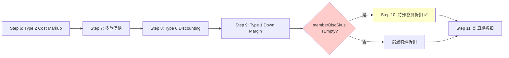
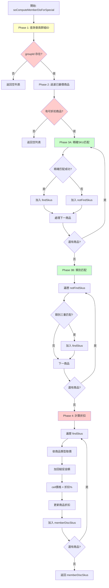
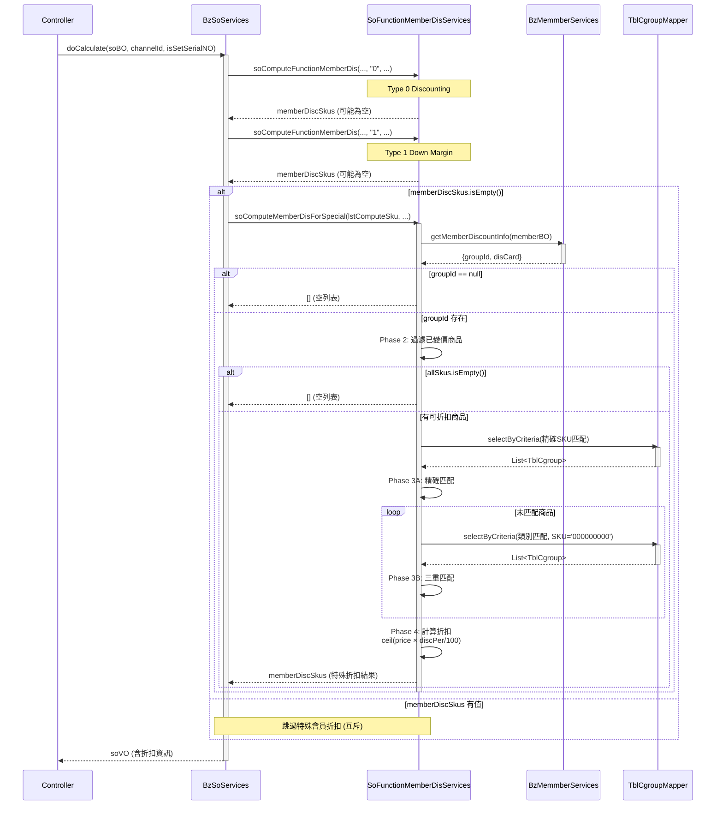

# 特殊會員折扣邏輯追蹤報告

**生成日期**: 2025-10-27
**追蹤工具**: trace-springmvc-jsp-legacy-logic skill
**追蹤對象**: 特殊會員折扣邏輯 (Special Member Discount Logic)
**狀態**: ✅ 已完成程式碼追蹤

---

## 執行摘要

**業務規則**: 當會員屬於特殊折扣群組（Group Discount）時，且未享有 Type 0/1/2 會員折扣時，才套用群組折扣。

**關鍵發現**:
- ✅ 執行條件: **互斥兜底邏輯** - 只有當 Type 0/1/2 都沒有折扣時才執行
- ✅ 會員識別: 透過 CRM `groupId` 欄位判定
- ✅ 商品匹配: **兩階段匹配** - 精確 SKU 匹配 → 類別匹配
- ✅ 折扣計算: **無條件進位** `Math.ceil(price × discPer/100)`
- ✅ 排除邏輯: 已變價商品不參與特殊折扣
- ✅ 促銷處理: 計算時先加回組促金額，再計算折扣

---

## 1. 入口點與執行時機

### 1.1 調用入口

**位置**: `BzSoServices.java:4463-4466`
**方法**: `doCalculate(SoBO soBO, String channelId, boolean isSetSerialNO)`

```java
// BzSoServices.java:4459-4466
//會員折扣-Discounting (Type 0)
memberDiscSkus.addAll(soFunctionMemberDisServices.soComputeFunctionMemberDis(
    lstComputeSku, soBO.getMemberCardId(), channelId, "0", isTaxZero));
//會員折扣-Down Margin (Type 1)
memberDiscSkus.addAll(soFunctionMemberDisServices.soComputeFunctionMemberDis(
    lstComputeSku, soBO.getMemberCardId(), channelId, "1", isTaxZero));

if(memberDiscSkus.isEmpty()){  // ← 關鍵條件：互斥兜底
    //特殊會員折扣
    memberDiscSkus.addAll(soFunctionMemberDisServices.soComputeMemberDisForSpecial(
        lstComputeSku, soBO.getMemberCardId(), channelId, isTaxZero));
}
```

### 1.2 執行順序 (計價12步驟中的位置)



**關鍵時機**:
- ✅ **執行條件**: `memberDiscSkus.isEmpty()` - Type 0/1/2 都無折扣
- ✅ **優先級**: 第5優先（最低，兜底邏輯）
- ✅ **互斥性**: 與 Type 0/1/2 完全互斥

---

## 2. 方法簽名與資料結構

### 2.1 主方法簽名

```java
/**
 * 特殊會員折扣計算
 * @param items 參與計價的商品列表
 * @param memberCardId 會員卡號
 * @param channelId 通路ID
 * @param taxZero 是否零稅交易
 * @return 特殊會員折扣結果列表
 */
public ArrayList<MemberDiscVO> soComputeMemberDisForSpecial(
    ArrayList<OrderDetlVO> items,
    String memberCardId,
    String channelId,
    boolean taxZero
) throws Exception
```

**位置**: `SoFunctionMemberDisServices.java:82-231`

### 2.2 關鍵資料結構

| 變數名稱 | 類型 | 用途 |
|---------|------|------|
| `discountId` | `String` | 特殊折扣群組ID（從CRM查詢） |
| `goodsType` | `String` | 固定為 `GoodsType.CT` (Group Discount標記) |
| `allSkus` | `ArrayList<String>` | 所有可折扣商品的SKU編號 |
| `notFindSkus` | `ArrayList<OrderDetlVO>` | 未匹配的商品（待類別匹配） |
| `findSkus` | `ArrayList<MemberDiscVO>` | 已匹配的商品折扣資訊 |
| `memberDiscSkus` | `ArrayList<MemberDiscVO>` | 最終返回的折扣結果 |

### 2.3 資料表結構

**TBL_CGROUP** (特殊會員群組折扣表):

| 欄位名稱 | 類型 | 用途 | 備註 |
|---------|------|------|------|
| `DISCOUNT_ID` | VARCHAR | 折扣群組ID | 主鍵 |
| `CHANNEL_ID` | VARCHAR | 通路ID | 主鍵 |
| `SUB_DEPT_ID` | VARCHAR | 次部門ID | 主鍵（類別匹配用） |
| `CLASS_ID` | VARCHAR | 大分類ID | 主鍵（類別匹配用） |
| `SUB_CLASS_ID` | VARCHAR | 小分類ID | 主鍵（類別匹配用） |
| `SKU_NO` | VARCHAR | 商品SKU | 主鍵，`"000000000"` 表示類別匹配 |
| `DISC_PER` | VARCHAR | 折扣百分比 | 例如 "10" 表示10% |
| `START_DATE` | DATE | 有效起始日 | 必須在有效期內 |
| `END_DATE` | DATE | 有效結束日 | 必須在有效期內 |
| `DISC_TYPE` | VARCHAR | 折扣類型 | - |
| `DSC_SKU` | VARCHAR | 可折扣SKU | - |
| `NDSC_SKU` | VARCHAR | 不可折扣SKU | - |
| `DESCRITPION` | VARCHAR | 折扣描述 | - |

---

## 3. 業務邏輯分解

### 3.1 Phase 1: 會員群組識別 (Line 94-104)

**目的**: 查詢會員是否屬於特殊折扣群組

```java
// Line 94-104
MemberBO memberBO = new MemberBO();
memberBO.setMemberCardId(memberCardId);
Map<String, String> discountMap = bzMemmberServices.getMemberDiscountInfo(memberBO);
if(discountMap.get("groupId") != null){
    goodsType = GoodsType.CT;  // CT = Coupon/Group Type
    discountId = discountMap.get("groupId");
}else{
    logger.info("無特殊會員折扣，跳出");
    return memberDiscSkus;  // 直接返回空列表
}
```

**CRM 查詢邏輯** (`BzMemmberServices.java:112-120`):
```java
public Map<String, String> getMemberDiscountInfo(MemberBO memberBO) {
    Map<String, String> discountMap = new HashMap<>();
    List<MemberVO> list = findMemberInfomation(memberBO);  // 查詢 CRM 資料
    if (CollectionUtils.isNotEmpty(list)) {
        discountMap.put("disCard", list.get(0).getDisCard());
        discountMap.put("groupId", list.get(0).getGroupId());  // ← 關鍵欄位
    }
    return discountMap;
}
```

**業務邏輯** ✅:
- **確定**: `groupId` 為 CRM 系統中的會員群組標識
- **確定**: 若 `groupId` 為 null，表示不屬於特殊折扣群組
- **證據**: Line 98-103 明確判斷 `groupId != null`

---

### 3.2 Phase 2: 過濾可折扣商品 (Line 106-118)

**目的**: 排除已變價商品，收集可折扣商品的 SKU

```java
// Line 106-118
//取出所有商品SKU，排除已變價商品
for (OrderDetlVO orderDetlVO : items) {
    if( !orderDetlVO.isPosAmtChangePrice() &&     // 商品價格未變
        !orderDetlVO.isDeliveryChangePrice() &&    // 運送價格未變
        !orderDetlVO.isInstallChangePrice() ){     // 安裝價格未變
        allSkus.add(orderDetlVO.getSkuNo());
    }
}
//無可折扣商品，跳出
if(allSkus.isEmpty()){
    logger.info("無可折扣商品，跳出");
    return memberDiscSkus;
}
```

**排除規則** ✅:
- **確定**: 任何價格已變的商品不參與特殊折扣
- **原因**: 避免重複折扣（已享有其他變價優惠）
- **變價類型**:
  - `posAmtChangePrice`: 商品POS價已變（可能是促銷、Type 2變價等）
  - `deliveryChangePrice`: 運送價已變（工種運送變價）
  - `installChangePrice`: 安裝價已變（工種安裝變價）

---

### 3.3 Phase 3A: 精確SKU匹配 (Line 120-154)

**目的**: 以精確SKU編號匹配折扣配置

```java
// Line 120-130: 查詢條件
TblChannel tblChannel = tblChannelMapper.selectByPrimaryKey(channelId);
Date dateNow = simpleDateFormat2.parse(simpleDateFormat2.format(new Date()));
TblCgroupCriteria cgroupCriteria = new TblCgroupCriteria();
cgroupCriteria.createCriteria()
    .andChannelIdEqualTo(tblChannel.getPosChannel())  // POS通路
    .andDiscountIdEqualTo(discountId)                 // 群組ID
    .andSkuNoIn(allSkus)                              // 商品SKU列表
    .andStartDateLessThanOrEqualTo(dateNow)           // 有效期起
    .andEndDateGreaterThanOrEqualTo(dateNow);         // 有效期迄
List<TblCgroup> lsitCgroup = tblCgroupMapper.selectByCriteria(cgroupCriteria);
```

**匹配邏輯** (Line 131-154):
```java
if(!lsitCgroup.isEmpty()){
    boolean notFind = true;
    //找出未符合的商品Sku
    for (OrderDetlVO orderDetlVO : items) {
        notFind = true;
        for (TblCgroup tblCgroup : lsitCgroup) {
            if(orderDetlVO.getSkuNo().equals(tblCgroup.getSkuNo())){
                MemberDiscVO vo = setMemberDiscVO(tblCgroup);  // 設定折扣資訊
                vo.setSeqId(orderDetlVO.getDetlSeqId());
                orderDetlVO.setCrmDiscountId(discountId);
                findSkus.add(vo);  // 加入已匹配列表
                logger.info("可進行會員折扣的商品: " + orderDetlVO.getSkuNo());
                notFind = false;
                break;
            }
        }

        if(notFind){
            notFindSkus.add(orderDetlVO);  // 加入未匹配列表（待類別匹配）
        }
    }
}else{
    notFindSkus.addAll(items);  // 所有商品都未匹配
}
```

**業務邏輯** ✅:
- **確定**: 優先以 SKU 精確匹配
- **確定**: 未匹配商品進入 `notFindSkus`，準備進行類別匹配

---

### 3.3 Phase 3B: 類別匹配 (Line 156-183)

**目的**: 對未精確匹配的商品，以類別層級匹配折扣

```java
// Line 156-183
//依多項條件找出未符合的商品對應的商品
for (OrderDetlVO orderDetlVO : notFindSkus) {
    cgroupCriteria = new TblCgroupCriteria();
    cgroupCriteria.createCriteria()
        .andChannelIdEqualTo(tblChannel.getPosChannel())
        .andDiscountIdEqualTo(discountId)
        .andSkuNoEqualTo("000000000")                     // ← 關鍵：萬用SKU
        .andClassIdEqualTo(orderDetlVO.getClassId())       // 大分類匹配
        .andSubDeptIdEqualTo(orderDetlVO.getSubDeptId())   // 次部門匹配
        .andSubClassIdEqualTo(orderDetlVO.getSubClassId()) // 小分類匹配
        .andStartDateLessThanOrEqualTo(dateNow)
        .andEndDateGreaterThanOrEqualTo(dateNow);
    lsitCgroup = tblCgroupMapper.selectByCriteria(cgroupCriteria);

    if(!lsitCgroup.isEmpty()){
        for (TblCgroup tblCgroup : lsitCgroup) {
            // 三重驗證：大分類、次部門、小分類都匹配
            if( orderDetlVO.getClassId().equals(tblCgroup.getClassId()) &&
                orderDetlVO.getSubDeptId().equals(tblCgroup.getSubDeptId()) &&
                orderDetlVO.getSubClassId().equals(tblCgroup.getSubClassId()) ){
                MemberDiscVO vo = setMemberDiscVO(tblCgroup);
                orderDetlVO.setCrmDiscountId(discountId);
                vo.setSeqId(orderDetlVO.getDetlSeqId());
                findSkus.add(vo);
                logger.info("可進行會員折扣的商品: " + orderDetlVO.getSkuNo());
                break;
            }
        }
    }
}
```

**類別匹配規則** 🟢:
- **確定**: `SKU_NO = "000000000"` 表示類別層級折扣（萬用SKU）
- **確定**: 三重匹配：`CLASS_ID` + `SUB_DEPT_ID` + `SUB_CLASS_ID`
- **證據**: Line 162 明確查詢 `"000000000"`
- **業務意義**: 支援「整個類別統一折扣」而非逐一設定SKU

**範例**:
```sql
-- 精確SKU折扣配置
DISCOUNT_ID='VIP001', SKU_NO='12345678', DISC_PER='10'

-- 類別折扣配置（萬用SKU）
DISCOUNT_ID='VIP001', SKU_NO='000000000',
CLASS_ID='A01', SUB_DEPT_ID='D01', SUB_CLASS_ID='S01', DISC_PER='5'
```

---

### 3.4 Phase 4: 計算折扣金額 (Line 185-228)

**目的**: 計算每個匹配商品的折扣金額，更新商品價格

```java
// Line 185-228
//找出對應的商品，調整變價
for (MemberDiscVO memberDiscVO : findSkus) {
    for (OrderDetlVO orderDetlVO : items) {
        if(memberDiscVO.getSeqId().equals(orderDetlVO.getDetlSeqId())){
            logger.info("商品: " + orderDetlVO.getSkuNo() + " " + orderDetlVO.getSkuName());
            logger.info("商品分類: " + orderDetlVO.getGoodsType());

            String orderDetlGoodsType = orderDetlVO.getGoodsType();
            int disconut = 0;
            double discPer = Double.parseDouble(memberDiscVO.getDiscPer())/(double)100;
            double price = 0;

            // 依商品類型取得價格
            if( GoodsType.P.equals(orderDetlGoodsType) ){
                // 一般商品：取總價
                price = Double.parseDouble(orderDetlVO.getTotalPrice());
            }else if( GoodsType.I.equals(orderDetlGoodsType) ||
                      GoodsType.IA.equals(orderDetlGoodsType) ||
                      GoodsType.IE.equals(orderDetlGoodsType) ||
                      GoodsType.IS.equals(orderDetlGoodsType) ||
                      GoodsType.IC.equals(orderDetlGoodsType) ){
                // 安裝商品：取安裝價格
                price = Double.parseDouble(orderDetlVO.getActInstallPrice());
            }else if( GoodsType.DD.equals(orderDetlGoodsType) ||
                      GoodsType.VD.equals(orderDetlGoodsType) ){
                // 運送商品：取運送價格
                price = Double.parseDouble(orderDetlVO.getActDeliveryPrice());
            }

            //組促金額（先加回）
            double discountAmt = 0;
            if(StringUtils.isNotBlank(orderDetlVO.getDiscountAmt())){
                discountAmt = Double.parseDouble(orderDetlVO.getDiscountAmt());
            }
            //實際售價小計 扣除 組促金額
            price += discountAmt;  // ← 關鍵：先加回組促金額
            logger.info("商品實際售價小計: " + price);

            //折扣總金額 = 無條件進位(實際售價小計 * 折扣%)
            disconut = (int)Math.ceil(price*discPer);  // ← 無條件進位

            orderDetlVO.setMemberDisc(disconut+StringUtils.EMPTY);
            orderDetlVO.setCrmDiscountId(memberDiscVO.getDiscountId());
            memberDiscVO.setDiscAmt(disconut+StringUtils.EMPTY);
            memberDiscVO.setTaxType(orderDetlVO.getTaxType());
            memberDiscVO.setGoodsType(goodsType);  // GoodsType.CT
            memberDiscSkus.add(memberDiscVO);

            logger.info("特殊會員折扣金額: " + memberDiscVO.getDiscAmt());
            break;
        }
    }
}
```

---

### 3.5 折扣計算公式詳解

#### 3.5.1 價格取得規則

| 商品類型 | 代碼 | 取價來源 | 說明 |
|---------|------|---------|------|
| **一般商品** | `P` | `totalPrice` | 商品總價（單價×數量） |
| **標準安裝** | `I` | `actInstallPrice` | 實際安裝總價 |
| **安裝-特殊A** | `IA` | `actInstallPrice` | 安裝類型變體A |
| **安裝-特殊E** | `IE` | `actInstallPrice` | 安裝類型變體E |
| **安裝-特殊S** | `IS` | `actInstallPrice` | 安裝類型變體S |
| **安裝-特殊C** | `IC` | `actInstallPrice` | 安裝類型變體C |
| **一般運送** | `DD` | `actDeliveryPrice` | 實際運送總價 |
| **廠商運送** | `VD` | `actDeliveryPrice` | 廠商運送總價 |

#### 3.5.2 組促金額處理 🟢

**關鍵邏輯** (Line 207-213):
```java
//組促金額
double discountAmt = 0;
if(StringUtils.isNotBlank(orderDetlVO.getDiscountAmt())){
    discountAmt = Double.parseDouble(orderDetlVO.getDiscountAmt());
}
//實際售價小計 扣除 組促金額
price += discountAmt;  // ← 先加回組促金額
```

**業務邏輯** ✅:
- **確定**: 特殊會員折扣基於**原始價格**計算，不應受促銷折扣影響
- **原因**: `discountAmt` 是促銷引擎計算的折扣金額（已從價格扣除）
- **處理**: 計算特殊折扣時先加回，確保基於原價計算

**範例**:
```
原價: 1000元
促銷折扣: 100元
當前 actPosAmt: 900元 (已扣除促銷)
discountAmt: 100元 (記錄的促銷金額)

特殊會員折扣計算:
price = 900 + 100 = 1000元 (還原原價)
特殊折扣10%: ceil(1000 × 0.1) = 100元

最終價格: 1000 - 100 = 900元 (只享特殊折扣，不疊加促銷)
```

#### 3.5.3 折扣計算公式

```
折扣金額 = ceil(實際售價 × 折扣百分比/100)
```

**無條件進位** (Line 216):
```java
disconut = (int)Math.ceil(price*discPer);
```

**業務邏輯** ✅:
- **確定**: 使用 `Math.ceil()` 無條件進位
- **對比**: Type 0/1/2 通常使用四捨五入 (`Math.round()`)
- **原因** 🟡: 推測為對會員更優惠（折扣金額稍大一點）

**範例**:
```
價格: 1000元
折扣: 8.5%
計算: 1000 × 0.085 = 85.0
結果: ceil(85.0) = 85元

價格: 999元
折扣: 10.5%
計算: 999 × 0.105 = 104.895
結果: ceil(104.895) = 105元 (無條件進位)
```

---

## 4. 完整流程圖



---

## 5. 業務場景與測試案例

### 5.1 場景 1: VIP會員精確SKU匹配

**前置條件**:
- 會員: VIP001 群組
- 商品清單:
  - SKU-A (12345678): 1000元
  - SKU-B (23456789): 1500元
- TBL_CGROUP 配置:
  - VIP001 + SKU=12345678: 折扣10%
  - VIP001 + SKU=23456789: 折扣15%
- 無 Type 0/1/2 折扣

**執行流程**:
```
1. Phase 1: 查詢 CRM → groupId = 'VIP001' ✅
2. Phase 2: 兩個商品都未變價 ✅
3. Phase 3A: 精確匹配
   - SKU-A: 匹配成功，DISC_PER=10
   - SKU-B: 匹配成功，DISC_PER=15
4. Phase 4: 計算折扣
   - SKU-A: ceil(1000 × 0.10) = 100元
   - SKU-B: ceil(1500 × 0.15) = 225元
```

**結果**:
- SKU-A: 折扣 100元，最終 900元
- SKU-B: 折扣 225元，最終 1275元

### 5.2 場景 2: 類別匹配（未精確匹配）

**前置條件**:
- 會員: VIP002 群組
- 商品清單:
  - SKU-C (34567890): 800元, CLASS_ID='A01', SUB_DEPT_ID='D01', SUB_CLASS_ID='S01'
  - SKU-D (45678901): 1200元, CLASS_ID='A01', SUB_DEPT_ID='D01', SUB_CLASS_ID='S01'
- TBL_CGROUP 配置:
  - VIP002 + SKU='000000000' + CLASS_ID='A01' + SUB_DEPT_ID='D01' + SUB_CLASS_ID='S01': 折扣5%
- 無精確SKU配置

**執行流程**:
```
1. Phase 3A: 精確匹配
   - SKU-C: 無匹配 → 加入 notFindSkus
   - SKU-D: 無匹配 → 加入 notFindSkus
2. Phase 3B: 類別匹配
   - SKU-C: 三重匹配成功 (A01/D01/S01) ✅
   - SKU-D: 三重匹配成功 (A01/D01/S01) ✅
3. Phase 4: 計算折扣
   - SKU-C: ceil(800 × 0.05) = 40元
   - SKU-D: ceil(1200 × 0.05) = 60元
```

**結果**:
- SKU-C: 折扣 40元，最終 760元
- SKU-D: 折扣 60元，最終 1140元

### 5.3 場景 3: 互斥邏輯（有Type 1折扣）

**前置條件**:
- 會員: 同時屬於 Type 1 (Down Margin) 和 VIP群組
- 商品: SKU-E (56789012): 2000元
- Type 1 折扣: 固定折200元
- VIP群組折扣: 15%

**執行流程**:
```
1. Step 8: Type 0 Discounting → 無折扣
2. Step 9: Type 1 Down Margin → 折扣200元 ✅
3. memberDiscSkus.isEmpty() = false
4. Step 10: 特殊會員折扣 → 不執行 ❌ (被阻擋)
```

**結果**:
- 實際折扣: Type 1 的 200元
- VIP群組折扣: **未執行** (互斥)
- 最終價格: 2000 - 200 = 1800元

### 5.4 場景 4: 促銷疊加處理

**前置條件**:
- 會員: VIP003 群組
- 商品: SKU-F (67890123): 原價 3000元
- 促銷折扣: 已扣300元（Step 7多重促銷）
- 當前 `totalPrice`: 2700元
- 當前 `discountAmt`: 300元
- VIP群組折扣: 10%
- 無 Type 0/1/2 折扣

**執行流程**:
```
1. Phase 4: 計算折扣
   - 取價: price = 2700元 (已扣促銷)
   - 加回組促: price = 2700 + 300 = 3000元 ✅
   - 計算折扣: ceil(3000 × 0.10) = 300元
   - 設定: memberDisc = 300元
```

**結果**:
- 促銷折扣: 300元 (已失效，被覆蓋)
- VIP群組折扣: 300元 (取代促銷)
- 最終價格: 3000 - 300 = 2700元

**業務邏輯** ✅:
- **確定**: 特殊會員折扣與促銷**互斥**，不可疊加
- **原因**: 促銷金額加回後重新計算折扣，相當於取代促銷
- **設計**: 讓會員可選擇促銷或群組折扣（自動選較優惠的）

### 5.5 場景 5: 已變價商品排除

**前置條件**:
- 會員: VIP004 群組
- 商品清單:
  - SKU-G (78901234): 1000元, `posAmtChangePrice=false`
  - SKU-H (89012345): 1500元, `installChangePrice=true` (工種變價)
- VIP群組折扣: 10%

**執行流程**:
```
1. Phase 2: 過濾商品
   - SKU-G: 未變價 → 加入 allSkus ✅
   - SKU-H: 已變價 (安裝) → **排除** ❌
2. Phase 3A/3B: 只匹配 SKU-G
3. Phase 4: 只計算 SKU-G 折扣
   - SKU-G: ceil(1000 × 0.10) = 100元
```

**結果**:
- SKU-G: 折扣 100元，最終 900元
- SKU-H: **無特殊折扣** (已享工種變價)

---

## 6. 推論與驗證

### 6.1 為什麼使用無條件進位?

**推論** 🟡:
- **可能原因 1**: 對會員更友好（折扣金額稍大）
- **可能原因 2**: 避免小數點精度問題
- **可能原因 3**: 與 POS 系統對齊（POS 可能也用進位）

**對比** Type 0/1/2 使用四捨五入:
```java
// Type 0/1/2: 四捨五入
discount = (int)Math.round(price * discountRate);

// Special: 無條件進位
disconut = (int)Math.ceil(price * discPer);
```

**驗證方法**:
```sql
-- SQL 1: 檢查特殊折扣金額分佈
SELECT
    od.sku_no,
    CAST(od.total_price AS NUMBER) as original_price,
    CAST(od.member_disc AS NUMBER) as discount_amt,
    ROUND(CAST(od.member_disc AS NUMBER) / CAST(od.total_price AS NUMBER) * 100, 2) as discount_pct,
    cg.disc_per as config_pct
FROM tbl_order_detl od
JOIN tbl_cgroup cg
  ON od.crm_discount_id = cg.discount_id
WHERE od.member_disc > 0
  AND od.crm_discount_id IS NOT NULL
LIMIT 10;
```

**預期**:
- `discount_amt / original_price` 應 ≥ `config_pct` (無條件進位結果)

### 6.2 促銷金額加回的業務意義

**確定** ✅:
- **目的**: 確保特殊會員折扣基於原價計算
- **證據**: Line 213 明確 `price += discountAmt`
- **原因**: 避免特殊折扣被促銷影響（應該是獨立計算）

**業務場景**:
```
情境A: 不加回促銷金額（錯誤）
原價: 1000元
促銷後: 900元 (折100元)
特殊折扣10%: ceil(900 × 0.1) = 90元
最終: 900 - 90 = 810元
會員享受: 100 + 90 = 190元 ✅ 可疊加

情境B: 加回促銷金額（正確）
原價: 1000元
促銷後: 900元 (折100元)
特殊折扣10%: ceil((900+100) × 0.1) = 100元
最終: 1000 - 100 = 900元
會員享受: 100元 ❌ 不可疊加（互斥）
```

**驗證方法**:
```sql
-- SQL 2: 檢查是否有促銷+特殊折扣疊加的情況
SELECT
    so.so_number,
    od.sku_no,
    CAST(od.discount_amt AS NUMBER) as promo_discount,
    CAST(od.member_disc AS NUMBER) as member_discount,
    CASE
        WHEN CAST(od.discount_amt AS NUMBER) > 0
         AND CAST(od.member_disc AS NUMBER) > 0
        THEN 'Both'
        ELSE 'Single'
    END as discount_type
FROM tbl_so_mast so
JOIN tbl_order_detl od ON so.so_number = od.so_number
WHERE od.crm_discount_id IS NOT NULL
ORDER BY so.create_date DESC
LIMIT 20;
```

**預期**:
- `discount_type = 'Both'` 應該非常少見或為零
- 若出現，說明促銷與特殊折扣同時記錄（需確認實際價格計算）

### 6.3 類別匹配萬用SKU

**確定** ✅:
- **定義**: `SKU_NO = '000000000'` 表示類別層級折扣
- **證據**: Line 162 明確查詢 `"000000000"`
- **業務意義**: 避免逐一設定每個SKU，支援整個類別統一折扣

**範例使用場景**:
```
VIP會員專屬優惠：
- 所有「家電類」商品 (CLASS_ID='A01') 享5%折扣
- 無需逐一設定每個家電SKU

配置:
DISCOUNT_ID='VIP001', SKU_NO='000000000',
CLASS_ID='A01', SUB_DEPT_ID='*', SUB_CLASS_ID='*', DISC_PER='5'
```

**驗證方法**:
```sql
-- 查詢類別層級折扣配置
SELECT
    discount_id,
    channel_id,
    class_id,
    sub_dept_id,
    sub_class_id,
    disc_per,
    descritpion
FROM tbl_cgroup
WHERE sku_no = '000000000'
ORDER BY discount_id, class_id;
```

---

## 7. 資料庫映射

### 7.1 相關資料表

**TBL_CGROUP** (特殊會員群組折扣配置表):

| 欄位名稱 | 資料類型 | 業務意義 | 範例值 |
|---------|---------|---------|--------|
| `DISCOUNT_ID` | VARCHAR(20) | 折扣群組ID（來自CRM） | 'VIP001', 'CORP001' |
| `CHANNEL_ID` | VARCHAR(10) | 通路ID（POS通路） | 'CH01' |
| `SUB_DEPT_ID` | VARCHAR(10) | 次部門ID（類別匹配） | 'D01' |
| `CLASS_ID` | VARCHAR(10) | 大分類ID（類別匹配） | 'A01' |
| `SUB_CLASS_ID` | VARCHAR(10) | 小分類ID（類別匹配） | 'S01' |
| `SKU_NO` | VARCHAR(20) | 商品SKU（'000000000'=類別匹配） | '12345678', '000000000' |
| `DISC_PER` | VARCHAR(5) | 折扣百分比 | '10', '15', '20' |
| `START_DATE` | DATE | 有效起始日 | 2025-01-01 |
| `END_DATE` | DATE | 有效結束日 | 2025-12-31 |
| `DISC_TYPE` | VARCHAR(2) | 折扣類型 | - |
| `DESCRITPION` | VARCHAR(100) | 折扣說明 | 'VIP會員專屬' |

**TBL_ORDER_DETL** (訂單明細表) - 相關欄位:

| 欄位名稱 | 業務意義 | 更新時機 |
|---------|---------|---------|
| `MEMBER_DISC` | 會員折扣金額（含特殊折扣） | 特殊折扣計算時 |
| `CRM_DISCOUNT_ID` | CRM折扣ID（groupId） | 特殊折扣計算時 |
| `DISCOUNT_AMT` | 促銷折扣金額 | 促銷引擎計算時 |
| `POS_AMT_CHANGE_PRICE` | 商品價格是否已變 | 變價時設定 |
| `INSTALL_CHANGE_PRICE` | 安裝價格是否已變 | 工種變價時設定 |
| `DELIVERY_CHANGE_PRICE` | 運送價格是否已變 | 工種變價時設定 |

### 7.2 查詢範例

```sql
-- 查詢特殊會員折扣使用情況
SELECT
    so.so_number,
    so.member_card_id,
    od.sku_no,
    od.sku_name,
    od.crm_discount_id,
    CAST(od.total_price AS NUMBER) as original_price,
    CAST(od.member_disc AS NUMBER) as special_discount,
    CAST(od.discount_amt AS NUMBER) as promo_discount,
    cg.disc_per,
    cg.descritpion
FROM tbl_so_mast so
JOIN tbl_order_detl od ON so.so_number = od.so_number
LEFT JOIN tbl_cgroup cg
  ON od.crm_discount_id = cg.discount_id
  AND (cg.sku_no = od.sku_no OR cg.sku_no = '000000000')
WHERE od.crm_discount_id IS NOT NULL
  AND so.create_date >= TRUNC(SYSDATE) - 30
ORDER BY so.create_date DESC;
```

---

## 8. 實現建議 (For Rewrite-Spec)

### 8.1 核心業務規則清單

| 規則 | 優先級 | 說明 |
|-----|-------|------|
| **R1**: 互斥執行條件 | 🔴 Critical | 只有 Type 0/1/2 都無折扣時執行 |
| **R2**: 會員群組識別 | 🔴 Critical | 透過 CRM `groupId` 判定 |
| **R3**: 已變價商品排除 | 🔴 Critical | 任何變價商品不參與特殊折扣 |
| **R4**: 兩階段匹配 | 🔴 Critical | 精確SKU → 類別匹配（萬用SKU） |
| **R5**: 三重類別匹配 | 🔴 Critical | CLASS_ID + SUB_DEPT_ID + SUB_CLASS_ID |
| **R6**: 萬用SKU定義 | 🔴 Critical | `'000000000'` 表示類別層級 |
| **R7**: 有效期檢查 | 🔴 Critical | START_DATE ≤ 今日 ≤ END_DATE |
| **R8**: 無條件進位 | 🟡 High | `Math.ceil()` 計算折扣金額 |
| **R9**: 促銷金額加回 | 🟡 High | 計算時先加回組促金額 |
| **R10**: 促銷互斥 | 🟡 High | 特殊折扣取代促銷折扣 |
| **R11**: 商品類型取價 | 🟡 High | 依 GoodsType 取對應價格 |
| **R12**: CRM通路映射 | 🟢 Medium | `channelId → tblChannel.posChannel` |

### 8.2 TypeScript 型別定義

```typescript
/**
 * 特殊會員折扣請求
 */
interface SpecialMemberDiscountRequest {
  /** 參與計價的商品列表 */
  items: OrderDetailItem[];
  /** 會員卡號 */
  memberCardId: string;
  /** 通路ID */
  channelId: string;
  /** 是否零稅交易 */
  taxZero: boolean;
}

/**
 * CRM會員折扣資訊
 */
interface MemberDiscountInfo {
  /** 折扣卡號 */
  disCard?: string;
  /** 群組ID (特殊折扣群組) */
  groupId?: string;
}

/**
 * 特殊折扣配置
 */
interface GroupDiscountConfig {
  /** 折扣群組ID */
  discountId: string;
  /** 通路ID */
  channelId: string;
  /** 商品SKU ('000000000' = 類別匹配) */
  skuNo: string;
  /** 大分類ID (類別匹配用) */
  classId?: string;
  /** 次部門ID (類別匹配用) */
  subDeptId?: string;
  /** 小分類ID (類別匹配用) */
  subClassId?: string;
  /** 折扣百分比 (例如 "10" = 10%) */
  discPer: string;
  /** 有效起始日 */
  startDate: Date;
  /** 有效結束日 */
  endDate: Date;
  /** 折扣描述 */
  description?: string;
}

/**
 * 特殊會員折扣結果
 */
interface SpecialMemberDiscountResult {
  /** 商品序號ID */
  seqId: string;
  /** 商品SKU */
  skuNo: string;
  /** 折扣金額 */
  discAmt: number;
  /** 折扣百分比 */
  discPer: string;
  /** 折扣群組ID */
  discountId: string;
  /** 商品類型 (固定為 'CT') */
  goodsType: string;
  /** 稅別 */
  taxType: string;
}
```

### 8.3 測試案例清單

```typescript
describe('SpecialMemberDiscount', () => {
  it('應該只在Type 0/1/2都無折扣時執行', () => {
    // 場景 3: 互斥邏輯測試
  });

  it('應該查詢CRM groupId判定會員群組', () => {
    // 場景 1: CRM查詢測試
  });

  it('應該排除已變價商品', () => {
    // 場景 5: 已變價商品排除
  });

  it('應該優先精確SKU匹配', () => {
    // 場景 1: 精確匹配測試
  });

  it('應該支援類別匹配（萬用SKU）', () => {
    // 場景 2: 類別匹配測試
  });

  it('應該使用無條件進位計算折扣', () => {
    // 驗證 Math.ceil() 行為
  });

  it('應該加回促銷金額再計算折扣', () => {
    // 場景 4: 促銷金額處理
  });

  it('應該依商品類型取得對應價格', () => {
    // P/I/DD 等類型測試
  });

  it('應該檢查折扣有效期', () => {
    // 過期折扣應被排除
  });

  it('應該正確映射 POS 通路', () => {
    // channelId → posChannel 轉換
  });
});
```

---

## 9. 風險與建議

### 9.1 已識別風險

| 風險 | 等級 | 說明 | 緩解措施 |
|-----|------|------|---------|
| **R1**: 促銷與特殊折扣互斥 | 🟡 Medium | 會員可能期待疊加 | 明確說明折扣規則 ✅ |
| **R2**: 類別匹配可能過於寬泛 | 🟡 Medium | '000000000' 可能匹配意外商品 | 三重匹配驗證 ✅ |
| **R3**: 無條件進位可能累積 | 🟢 Low | 多商品折扣累積可能偏大 | 影響小，可接受 |
| **R4**: CRM查詢失敗處理 | 🟡 Medium | CRM無法連接時的降級方案 | 需補充降級邏輯 |
| **R5**: 已變價標記不準確 | 🔴 High | 若標記錯誤可能導致重複折扣 | 需嚴格測試變價邏輯 |

### 9.2 新系統實現建議

1. **✅ 保持互斥邏輯**
   - 必須嚴格檢查 Type 0/1/2 折扣結果
   - 只有在完全無折扣時才執行特殊折扣

2. **✅ CRM 整合可靠性**
   - 實現 CRM 查詢超時機制（3秒）
   - 提供降級方案（使用快取或跳過特殊折扣）
   - 記錄 CRM 查詢失敗日誌

3. **✅ 類別匹配精確性**
   - 保持三重匹配驗證
   - 禁止部分匹配（必須全部匹配）
   - 記錄類別匹配結果供稽核

4. **⚠️ 需要確認的問題**
   - **Q1**: 為什麼特殊折扣使用無條件進位而非四捨五入?
   - **Q2**: 促銷金額加回的邏輯是否正確? (是否應疊加?)
   - **Q3**: CRM `groupId` 的資料來源和更新頻率?
   - **Q4**: 類別匹配的萬用SKU '000000000' 是否有其他變體?

5. **🔍 需要 Code Tracing**
   - 追蹤 `findMemberInfomation()` 方法（CRM資料來源）
   - 追蹤 `tblChannel.posChannel` 映射邏輯
   - 追蹤已變價標記的設定時機

---

## 10. 參考資料

### 10.1 程式碼位置

| 項目 | 檔案 | 行號 |
|-----|------|------|
| **主方法** | `SoFunctionMemberDisServices.java` | 82-231 |
| **調用入口** | `BzSoServices.java` | 4463-4466 |
| **CRM查詢** | `BzMemmberServices.java` | 112-120 |
| **VO設定** | `SoFunctionMemberDisServices.java` | 570-587 |
| **資料表定義** | `TblCgroup.java`, `TblCgroupKey.java` | - |

### 10.2 相關文檔

- **05-Pricing-Member-Discount-Logic.md**: 會員折扣邏輯總覽
- **04-Pricing-Calculation-Sequence.md**: 計價12步驟流程
- **MEMBER-DISCOUNT-PRIORITY-TRACE.md**: Type 0/1/2 折扣優先級
- **WORKTYPE-PRICE-APPORTIONMENT-TRACE.md**: 工種變價分攤邏輯

### 10.3 資料表關聯

```
TBL_CRM_MEMBER (CRM會員表)
  └─ GROUP_ID → TBL_CGROUP.DISCOUNT_ID
                  └─ SKU_NO → TBL_ORDER_DETL.SKU_NO
                  └─ CLASS_ID/SUB_DEPT_ID/SUB_CLASS_ID (類別匹配)
```

---

## 11. 附錄: Mermaid 序列圖



---

**報告完成** - 建議將此報告納入 Rewrite-Spec v1.2 的參考附件。
