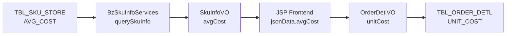
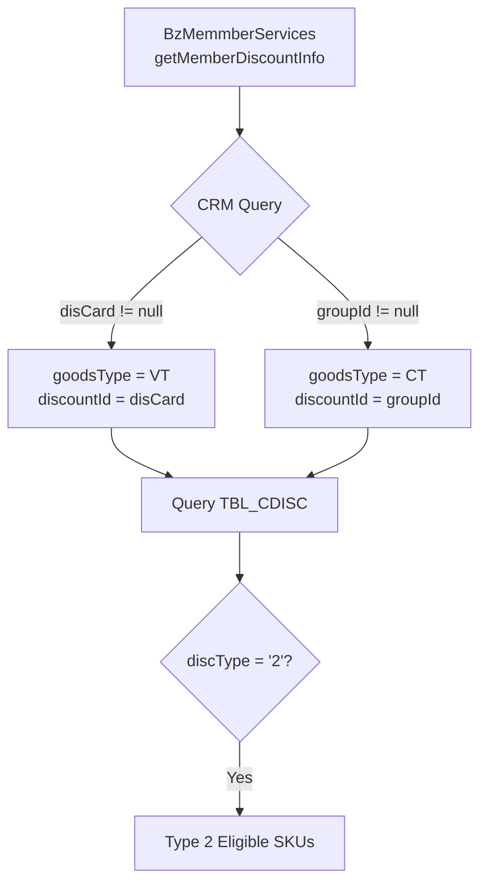
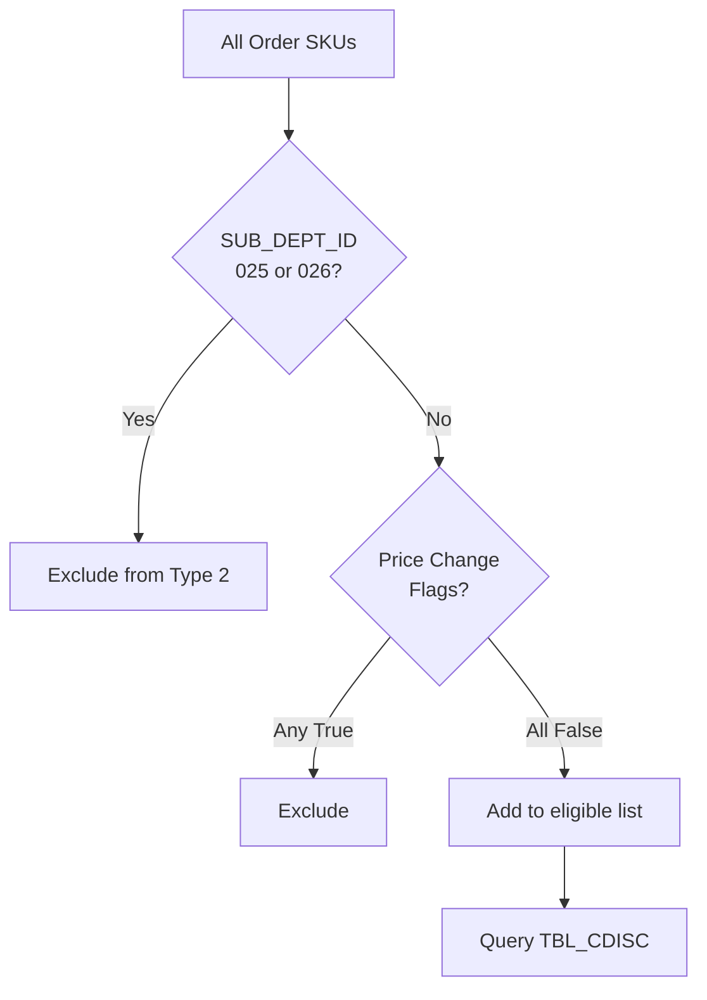
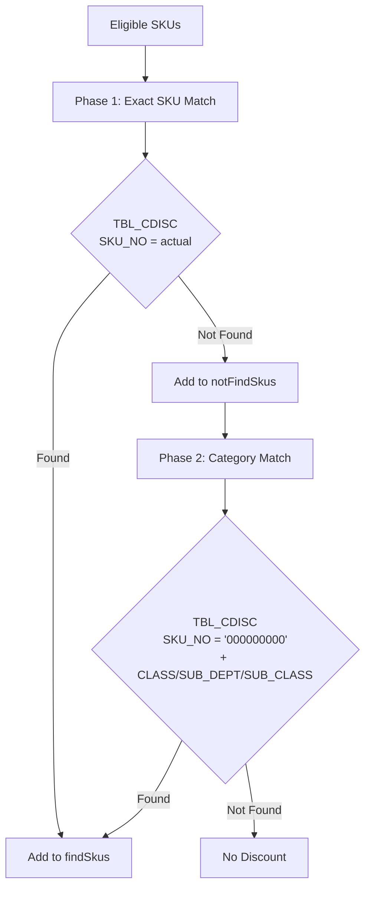
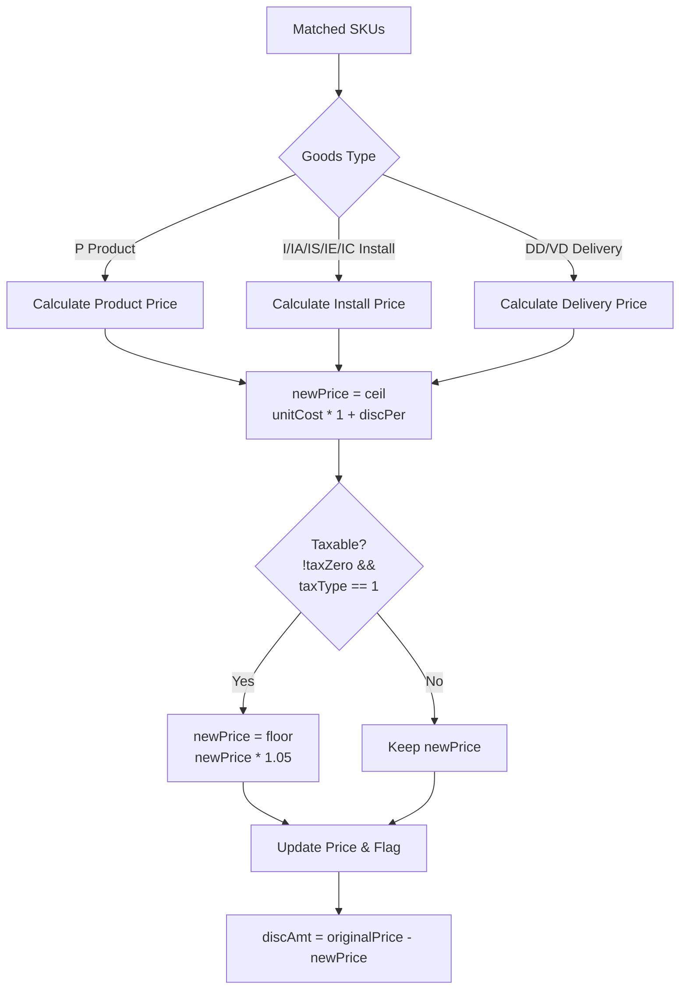

# Type 2 Cost Markup Member Discount - Complete Code Trace

## Document Information

- **Trace Date**: 2025-10-27
- **Tracer**: Code Analysis Team
- **Purpose**: Complete trace of Type 2 (Cost Markup) member discount logic
- **Status**: ✅ Complete - Ready for Rewrite-Spec integration
- **Related Docs**:
  - SPECIAL-MEMBER-DISCOUNT-TRACE.md
  - WORKTYPE-PRICE-APPORTIONMENT-TRACE.md
  - BUSINESS-LOGIC-COVERAGE-EVALUATION.md

---

## Executive Summary

### Overview

Type 2 (Cost Markup) member discount is one of three standard member discount types (Type 0/1/2) that execute **before** the special member discount (Type CT) fallback. Unlike Type 0 (Discounting) and Type 1 (Down Margin) which apply percentage discounts to selling prices, **Type 2 calculates new selling prices based on cost markup** - making it fundamentally different.

### Key Characteristics

1. **Cost-Based Pricing**: Uses `unitCost` from database (`TBL_SKU_STORE.AVG_COST`) instead of selling price
2. **Markup Formula**: `newPrice = ceil(unitCost * (1 + discPer))`
3. **Tax Handling**: Applies sales tax (1.05) to markup price if taxable and not zero-tax transaction
4. **Price Replacement**: Directly replaces `actPosAmt`, `installPrice`, or `deliveryPrice` (sets changePrice flag)
5. **Category Exclusion**: Excludes SUB_DEPT_ID = '025' and '026' (transportation-related categories)
6. **Discount Calculation**: Saves `discAmt = originalPrice - newPrice` (can be negative if markup increases price)

### Critical Business Rules

| Rule ID | Description | Priority | Implementation Location |
|---------|-------------|----------|------------------------|
| **R1** | Type 2 only applies to members with valid discount card | **CRITICAL** | SoFunctionMemberDisServices:259-272 |
| **R2** | SUB_DEPT_ID 025/026 are excluded from Type 1/2 | **CRITICAL** | SoFunctionMemberDisServices:533-539 |
| **R3** | Unit cost comes from TBL_SKU_STORE.AVG_COST | **CRITICAL** | TblSkuStore.java, BzSoServices:906-999 |
| **R4** | New price = ceil(unitCost * (1 + discPer)) | **CRITICAL** | SoFunctionMemberDisServices:486 |
| **R5** | Apply sales tax floor rounding if taxable | **HIGH** | SoFunctionMemberDisServices:488-492 |
| **R6** | Price change flag must be set per goods type | **HIGH** | SoFunctionMemberDisServices:493-507 |
| **R7** | Type 2 excluded from tax-free total calculation | **MEDIUM** | SoFunctionMemberDisServices:602-610 |
| **R8** | Install SKU cost = preApportion * discount / taxRate | **MEDIUM** | BzSoServices:932-951 |
| **R9** | Delivery SKU cost = preApportion * discount / taxRate | **MEDIUM** | BzSoServices:988-995 |
| **R10** | Open price SKUs have unitCost = 0 for products | **MEDIUM** | BzSoServices:914-917 |

---

## Data Flow Lifecycle

### Phase 1: Unit Cost Acquisition (Initial Order Creation)



**Key Files**:
- `TblSkuStore.java:45` - AVG_COST database field
- `BzSkuInfoServices.java` - Query and return avgCost
- `soSKUSubPage.jsp:626` - Frontend: `lstSkuInfo[].unitCost = jsonData.avgCost`
- `OrderDetlVO.java:43` - unitCost property
- `TblOrderDetl.java:117` - UNIT_COST persistence

**Special Cases**:
```java
// Open price products (except transport categories) have unitCost = 0
if(YES_FLAG.equals(sku.getOpenPrice())
    && !SUB_DEPT_025.equals(sku.getSubDeptId())
    && !SUB_DEPT_026.equals(sku.getSubDeptId())
    && !SUB_DEPT_027.equals(sku.getSubDeptId())) {
    sku.setUnitCost("0");
}

// Install SKU unit cost calculation
if(openPrice == 'Y') {
    amt = preApportion * discountBase / salesTaxFee;
    unitCost = round(amt);  // ROUND_HALF_UP
}

// Delivery SKU unit cost calculation
if(openPrice == 'Y' && workTypeId == HOME_DELIVERY) {
    baseUnitCost = HCT_DELIVERY_COST / taxRate;
    if(totalVolume > 3) {
        unitCost = (baseCost + extraCost * extraVolume) / taxRate;
    }
}
```

### Phase 2: Member Discount Configuration Query



**Key Code**:
```java
// SoFunctionMemberDisServices.java:259-272
MemberBO memberBO = new MemberBO();
memberBO.setMemberCardId(memberCardId);
Map<String, String> discountMap = bzMemmberServices.getMemberDiscountInfo(memberBO);

if(discountMap.get("disCard") == null) {
    if(discountMap.get("groupId") != null) {
        goodsType = GoodsType.CT;
        discountId = discountMap.get("groupId");
    }
} else {
    goodsType = GoodsType.VT;
    discountId = discountMap.get("disCard");
}
```

### Phase 3: SKU Filtering (Category Exclusion)



**Key Code**:
```java
// SoFunctionMemberDisServices.java:274-285
for (OrderDetlVO orderDetlVO : items) {
    // Cost Markup excludes 025, 026
    if(checkSkuSubDeptId(discType, orderDetlVO)) {
        continue;
    }
    // Exclude already price-changed items
    if(!orderDetlVO.isPosAmtChangePrice() &&
       !orderDetlVO.isDeliveryChangePrice() &&
       !orderDetlVO.isInstallChangePrice()) {
        allSkus.add(orderDetlVO.getSkuNo());
    }
}

// SoFunctionMemberDisServices.java:533-539
private boolean checkSkuSubDeptId(String discType, OrderDetlVO item) {
    if(("2".equals(discType) || "1".equals(discType)) &&
       ("025".equals(item.getSubDeptId()) || "026".equals(item.getSubDeptId()))) {
        return true;
    }
    return false;
}
```

### Phase 4: Two-Phase Discount Matching



**Key Code**:
```java
// Phase 1: Exact SKU matching (lines 293-330)
TblCdiscCriteria tblCdiscCriteria = new TblCdiscCriteria();
tblCdiscCriteria.createCriteria()
    .andChannelIdEqualTo(tblChannel.getPosChannel())
    .andDiscountIdEqualTo(discountId)
    .andSkuNoIn(allSkus)  // Exact match
    .andStartDateLessThanOrEqualTo(dateNow)
    .andEndDateGreaterThanOrEqualTo(dateNow)
    .andDiscTypeEqualTo("2");  // Type 2 Cost Markup

// Phase 2: Category-level matching (lines 332-360)
for (OrderDetlVO orderDetlVO : notFindSkus) {
    tblCdiscCriteria = new TblCdiscCriteria();
    tblCdiscCriteria.createCriteria()
        .andChannelIdEqualTo(tblChannel.getPosChannel())
        .andDiscountIdEqualTo(discountId)
        .andSkuNoEqualTo("000000000")  // Wildcard
        .andClassIdEqualTo(orderDetlVO.getClassId())
        .andSubDeptIdEqualTo(orderDetlVO.getSubDeptId())
        .andSubClassIdEqualTo(orderDetlVO.getSubClassId())
        .andStartDateLessThanOrEqualTo(dateNow)
        .andEndDateGreaterThanOrEqualTo(dateNow)
        .andDiscTypeEqualTo("2");
}
```

### Phase 5: Cost Markup Price Calculation



**Core Implementation**:
```java
// SoFunctionMemberDisServices.java:473-511
private void updateMemberDiscForDiscountType2(
    boolean taxZero, double salesTax,
    MemberDiscVO memberDiscVO, OrderDetlVO orderDetlVO) {

    int qty = Integer.parseInt(orderDetlVO.getQuantity());
    double discPer = Double.parseDouble(memberDiscVO.getDiscPer()) / (double)100;

    // Cost Markup changes PosAmt directly
    int posAmt = Integer.parseInt(orderDetlVO.getPosAmt());
    double unitCost = Double.parseDouble(orderDetlVO.getUnitCost());

    logger.info("商品實際售單價: " + posAmt);
    logger.info("商品成本價: " + unitCost);
    logger.info("折扣率: " + discPer);

    // Core formula: newPrice = ceil(unitCost * (1 + markupRate))
    int disconut = (int)Math.ceil(unitCost * (1 + discPer));

    // Apply sales tax if taxable (non-zero-tax & SKU_TAX_TYPE_1)
    if(!taxZero && SKU_TAX_TYPE_1.equals(orderDetlVO.getTaxType())) {
        // 2020-05-07: Changed to ROUND_FLOOR
        // 58 * 1.05 = 60.9, floor to 60
        disconut = new BigDecimal((double)disconut * salesTax)
            .setScale(0, BigDecimal.ROUND_FLOOR).intValue();
    }

    // Update price based on goods type
    if(GoodsType.P.equals(orderDetlVO.getGoodsType())) {
        orderDetlVO.setActPosAmt(disconut + StringUtils.EMPTY);
        orderDetlVO.setTotalPrice((disconut * qty) + StringUtils.EMPTY);
        orderDetlVO.setPosAmtChangePrice(true);
    } else if(isInstallSku(orderDetlVO.getGoodsType())) {
        orderDetlVO.setPreApportion(disconut + StringUtils.EMPTY);
        orderDetlVO.setInstallPrice(disconut + StringUtils.EMPTY);
        orderDetlVO.setActInstallPrice((disconut * qty) + StringUtils.EMPTY);
        orderDetlVO.setInstallChangePrice(true);
    } else if(isDeliverySku(orderDetlVO.getGoodsType())) {
        orderDetlVO.setPreApportion(disconut + StringUtils.EMPTY);
        orderDetlVO.setDeliveryPrice(disconut + StringUtils.EMPTY);
        orderDetlVO.setActDeliveryPrice((disconut * qty) + StringUtils.EMPTY);
        orderDetlVO.setDeliveryChangePrice(true);
    }

    // Also update actPosAmt (line 508 - possible duplicate?)
    orderDetlVO.setActPosAmt(disconut + StringUtils.EMPTY);

    // Discount amount = original - new (can be negative)
    memberDiscVO.setDiscAmt((posAmt - disconut) + StringUtils.EMPTY);

    logger.info("商品實際售價小計: " + disconut);
}
```

---

## Database Schema

### TBL_SKU_STORE (Source of Unit Cost)

```sql
CREATE TABLE TBL_SKU_STORE (
    STORE_ID         VARCHAR2(20),
    SKU_NO           VARCHAR2(20),
    AVG_COST         NUMBER(10,2),  -- ★ Average cost used by Type 2
    STOCK_AOH        NUMBER(10),
    MARKET_PRICE     NUMBER(10),
    REGULAR_PRICE    NUMBER(10),
    -- ... other columns
    PRIMARY KEY (STORE_ID, SKU_NO)
);
```

### TBL_CDISC (Type 2 Configuration)

```sql
CREATE TABLE TBL_CDISC (
    DISCOUNT_ID      VARCHAR2(20),
    CHANNEL_ID       VARCHAR2(10),
    SKU_NO           VARCHAR2(20),  -- Can be '000000000' for category-level
    CLASS_ID         VARCHAR2(10),
    SUB_DEPT_ID      VARCHAR2(10),  -- Excludes '025', '026' for Type 2
    SUB_CLASS_ID     VARCHAR2(10),
    DISC_TYPE        VARCHAR2(2),   -- '2' for Cost Markup
    DISC_PER         NUMBER(5,2),   -- Markup percentage (e.g., 20.00 = 20%)
    START_DATE       DATE,
    END_DATE         DATE,
    DESCRITPION      VARCHAR2(200),
    DSC_SKU          VARCHAR2(1),   -- Discountable flag
    NDSC_SKU         VARCHAR2(1),   -- Non-discountable flag
    PRIMARY KEY (DISCOUNT_ID, CHANNEL_ID, SKU_NO, CLASS_ID, SUB_DEPT_ID, SUB_CLASS_ID)
);
```

### TBL_ORDER_DETL (Persisted Results)

```sql
CREATE TABLE TBL_ORDER_DETL (
    ORDER_ID                VARCHAR2(50),
    DETL_SEQ_ID             VARCHAR2(10),
    SKU_NO                  VARCHAR2(20),
    UNIT_COST               NUMBER(10,2),  -- ★ Stored from avgCost
    ACT_POS_AMT             NUMBER(10),    -- ★ New price after Type 2
    TOTAL_PRICE             NUMBER(10),    -- ★ actPosAmt * qty
    INSTALL_PRICE           NUMBER(10),    -- ★ For install SKUs
    DELIVERY_PRICE          NUMBER(10),    -- ★ For delivery SKUs
    POS_AMT_CHANGE_PRICE    VARCHAR2(1),   -- ★ 'Y' if Type 2 applied
    INSTALL_CHANGE_PRICE    VARCHAR2(1),
    DELIVERY_CHANGE_PRICE   VARCHAR2(1),
    GOODS_TYPE              VARCHAR2(5),
    SUB_DEPT_ID             VARCHAR2(10),
    TAX_TYPE                VARCHAR2(1),   -- '1' = taxable, '2' = tax-free
    -- ... other columns
);
```

---

## Business Logic Deep Dive

### Cost Markup vs Other Discount Types

| Aspect | Type 0 (Discounting) | Type 1 (Down Margin) | Type 2 (Cost Markup) |
|--------|----------------------|----------------------|----------------------|
| **Base Price** | Selling price (posAmt) | Selling price (actPosAmt) | **Cost (unitCost)** |
| **Formula** | `ceil(price * discPer)` | `ceil(price * discPer)` | **`ceil(cost * (1 + discPer))`** |
| **Rounding** | Math.ceil (up) | Math.ceil (up) | **Math.ceil then floor(tax)** |
| **Price Change** | No flag (discount only) | Yes (setPosAmtChangePrice) | **Yes (setPosAmtChangePrice)** |
| **Promotion** | Adds back promotion | Adds back promotion | **No promotion handling** |
| **Tax Calculation** | Before discount | Before discount | **After markup** |
| **Category Exclusion** | None | **025, 026** | **025, 026** |
| **DiscAmt Calculation** | `ceil(price * rate) * qty` | `ceil(price * rate)` | **`originalPrice - newPrice`** |
| **Tax-Free Total** | Included | Included | **Excluded (R7)** |

### Tax Handling Details

**2020-05-07 Change**: Tax rounding changed from `ROUND_HALF_UP` to `ROUND_FLOOR`

```java
// Before 2020-05-07
disconut = new BigDecimal((double)disconut * salesTax)
    .setScale(0, BigDecimal.ROUND_HALF_UP).intValue();
// Example: 60.9 → 61

// After 2020-05-07
disconut = new BigDecimal((double)disconut * salesTax)
    .setScale(0, BigDecimal.ROUND_FLOOR).intValue();
// Example: 60.9 → 60
```

**Rationale**: Floor rounding prevents over-charging customers due to tax calculation.

### Category Exclusion (025/026)

**SUB_DEPT_ID Codes**:
- `025`: Transport Category A (excluded from Type 1/2)
- `026`: Transport Category B (excluded from Type 1/2)
- `027`: Transport Category C (excluded from Type 0 unitCost=0 rule, but allowed in Type 2)

**Why Excluded?**:
- Transport categories use special costing logic (HCT_DELIVERY_COST parameters)
- Cost markup doesn't apply to standardized transport fees
- Prevents incorrect pricing for fixed-cost services

### Open Price SKU Handling

```java
// Products (GoodsType.P) with open price
if(YES_FLAG.equals(sku.getOpenPrice())
    && !SUB_DEPT_025 && !SUB_DEPT_026 && !SUB_DEPT_027) {
    sku.setUnitCost("0");  // Prevents Type 2 from applying
}

// Install SKUs with open price (calculate cost from apportioned price)
if(openPrice == 'Y') {
    double amt = preApportion * discountBase / salesTaxFee;
    unitCost = BigDecimal.valueOf(amt)
        .setScale(0, BigDecimal.ROUND_HALF_UP).toString();
}

// Delivery SKUs with open price (special HCT logic)
if(openPrice == 'Y' && workTypeId == HOME_DELIVERY) {
    float baseUnitCost = HCT_DELIVERY_COST / taxRate;
    if(totalVolume > 3) {
        float extraVolume = ceil(totalVolume - 3);
        totalUnitCost = (baseCost + extraCost * extraVolume) / taxRate;
    }
    unitCost = Float.toString(Math.round(totalUnitCost));
}
```

### Potential Negative Discounts

**Type 2 can result in price increases** (negative discounts) when:
```java
discAmt = originalPrice - newPrice
```

**Example Scenario**:
- Original POS price: 100 TWD
- Unit cost from DB: 90 TWD
- Markup rate: 20%
- New price: `ceil(90 * 1.2) = 108` TWD
- Discount amount: `100 - 108 = -8` TWD ❌

**Business Implication**: This appears to be a bug or intended behavior that requires business confirmation. The system allows "negative discounts" (price increases) which contradicts the concept of member benefits.

**Recommendation**: Add validation to prevent negative discAmt:
```java
// Suggested fix
int newPrice = (int)Math.ceil(unitCost * (1 + discPer));
if(!taxZero && SKU_TAX_TYPE_1.equals(orderDetlVO.getTaxType())) {
    newPrice = new BigDecimal((double)newPrice * salesTax)
        .setScale(0, BigDecimal.ROUND_FLOOR).intValue();
}

// Prevent price increases
if(newPrice > posAmt) {
    logger.warn("Cost markup would increase price: " + newPrice + " > " + posAmt);
    return;  // Skip this discount
}

// Or apply cap
newPrice = Math.min(newPrice, posAmt);
memberDiscVO.setDiscAmt((posAmt - newPrice) + StringUtils.EMPTY);
```

---

## Test Scenarios

### Test Scenario 1: Standard Product Cost Markup (Taxable)

**Setup**:
```
Member: VIP card with Type 2 discount = 20%
Product SKU: 12345678 (CLASS_ID=01, SUB_DEPT_ID=001, SUB_CLASS_ID=001)
TBL_SKU_STORE.AVG_COST = 100 TWD
Original POS price = 150 TWD
Quantity = 2
Tax type = 1 (taxable)
Zero-tax transaction = false
Sales tax = 1.05
```

**Expected Behavior**:
```java
// Phase 1: Query unit cost
unitCost = 100  // from TBL_SKU_STORE.AVG_COST

// Phase 2: Query TBL_CDISC (exact SKU match)
discPer = 20 / 100 = 0.20

// Phase 3: Calculate markup price
newPrice = ceil(100 * (1 + 0.20)) = ceil(120) = 120

// Phase 4: Apply sales tax
newPrice = floor(120 * 1.05) = floor(126) = 126

// Phase 5: Update order detail
actPosAmt = 126
totalPrice = 126 * 2 = 252
posAmtChangePrice = true
discAmt = 150 - 126 = 24 TWD savings per unit
```

**Expected Result**:
- ✅ Member saves 24 TWD per unit (total 48 TWD for qty=2)
- ✅ Price reduced from 150 to 126 (16% discount)
- ✅ posAmtChangePrice flag set

### Test Scenario 2: Category-Level Discount (Tax-Free)

**Setup**:
```
Member: Group ID with Type 2 discount = 15%
Product SKU: 87654321 (CLASS_ID=02, SUB_DEPT_ID=003, SUB_CLASS_ID=005)
No exact SKU match in TBL_CDISC
TBL_CDISC has: SKU_NO='000000000', CLASS_ID=02, SUB_DEPT=003, SUB_CLASS=005
TBL_SKU_STORE.AVG_COST = 80 TWD
Original POS price = 95 TWD
Quantity = 1
Tax type = 2 (tax-free)
Zero-tax transaction = false
```

**Expected Behavior**:
```java
// Phase 1: Exact SKU match fails
// Phase 2: Category match succeeds (wildcard SKU)
discPer = 15 / 100 = 0.15

// Phase 3: Calculate markup price
newPrice = ceil(80 * (1 + 0.15)) = ceil(92) = 92

// Phase 4: Tax-free, skip sales tax

// Phase 5: Update order detail
actPosAmt = 92
totalPrice = 92
posAmtChangePrice = true
discAmt = 95 - 92 = 3 TWD savings
```

**Expected Result**:
- ✅ Member saves 3 TWD
- ✅ No sales tax applied (tax-free item)
- ✅ Category-level matching works

### Test Scenario 3: Transport Category Exclusion (025)

**Setup**:
```
Member: VIP card with Type 2 discount = 10%
Product SKU: 02599999 (SUB_DEPT_ID = '025')
TBL_SKU_STORE.AVG_COST = 50 TWD
Original POS price = 60 TWD
```

**Expected Behavior**:
```java
// Phase 1: Check category exclusion
if("2".equals(discType) && "025".equals(subDeptId)) {
    return true;  // Excluded
}

// SKU is filtered out before TBL_CDISC query
// No discount applied
```

**Expected Result**:
- ✅ SKU excluded from Type 2 discount
- ✅ Original price maintained (60 TWD)
- ✅ posAmtChangePrice = false

### Test Scenario 4: Install SKU Cost Markup

**Setup**:
```
Member: VIP card with Type 2 discount = 25%
Install SKU: I_SKU_001 (GoodsType.I)
TBL_SKU_STORE.AVG_COST = calculated from preApportion
  preApportion = 120 TWD
  workTypeDiscountBase = 0.9
  salesTaxFee = 1.05
  unitCost = round(120 * 0.9 / 1.05) = round(102.86) = 103 TWD
Original install price = 150 TWD
Quantity = 1
Tax type = 1 (taxable)
Zero-tax transaction = false
```

**Expected Behavior**:
```java
// Phase 1: Unit cost calculated during setUnitCost()
amt = 120 * 0.9 / 1.05 = 102.857
unitCost = BigDecimal.valueOf(102.857)
    .setScale(0, ROUND_HALF_UP) = 103

// Phase 2: Calculate markup price
newPrice = ceil(103 * (1 + 0.25)) = ceil(128.75) = 129

// Phase 3: Apply sales tax
newPrice = floor(129 * 1.05) = floor(135.45) = 135

// Phase 4: Update install price
installPrice = 135
actInstallPrice = 135 * 1 = 135
installChangePrice = true
discAmt = 150 - 135 = 15 TWD savings
```

**Expected Result**:
- ✅ Member saves 15 TWD on installation
- ✅ installChangePrice flag set
- ✅ Install-specific cost calculation used

### Test Scenario 5: Negative Discount (Price Increase)

**Setup**:
```
Member: VIP card with Type 2 discount = 30%
Product SKU: 11112222
TBL_SKU_STORE.AVG_COST = 90 TWD
Original POS price = 100 TWD  // Low margin product
Quantity = 1
Tax type = 1 (taxable)
Zero-tax transaction = false
Sales tax = 1.05
```

**Expected Behavior**:
```java
// Phase 1: Calculate markup price
newPrice = ceil(90 * (1 + 0.30)) = ceil(117) = 117

// Phase 2: Apply sales tax
newPrice = floor(117 * 1.05) = floor(122.85) = 122

// Phase 3: Calculate discount
discAmt = 100 - 122 = -22 TWD  ❌ NEGATIVE

// Phase 4: Update price (increases price!)
actPosAmt = 122
totalPrice = 122
posAmtChangePrice = true
discAmt = -22  // System allows this
```

**Current Result** (Likely Bug):
- ❌ Price increases from 100 to 122 TWD
- ❌ Member pays MORE instead of getting discount
- ❌ Negative discAmt stored in database

**Recommendation**:
- Add validation to prevent negative discounts
- Skip Type 2 discount if newPrice > originalPrice
- Business confirmation required on intended behavior

---

## SQL Verification Queries

### Query 1: Find All Type 2 Configurations

```sql
-- List all Type 2 (Cost Markup) discount configurations
SELECT
    cd.DISCOUNT_ID,
    cd.CHANNEL_ID,
    cd.SKU_NO,
    cd.CLASS_ID,
    cd.SUB_DEPT_ID,
    cd.SUB_CLASS_ID,
    cd.DISC_PER AS MARKUP_PERCENTAGE,
    cd.START_DATE,
    cd.END_DATE,
    cd.DESCRITPION,
    CASE
        WHEN cd.SKU_NO = '000000000' THEN 'Category-Level'
        ELSE 'SKU-Level'
    END AS DISCOUNT_LEVEL,
    CASE
        WHEN cd.SUB_DEPT_ID IN ('025', '026') THEN 'WARNING: Should be excluded'
        ELSE 'Valid'
    END AS VALIDATION_STATUS
FROM TBL_CDISC cd
WHERE cd.DISC_TYPE = '2'
  AND SYSDATE BETWEEN cd.START_DATE AND cd.END_DATE
ORDER BY cd.CHANNEL_ID, cd.DISCOUNT_ID, cd.SKU_NO;
```

### Query 2: Verify Unit Cost Data Quality

```sql
-- Check unit cost data availability and quality
SELECT
    ss.STORE_ID,
    ss.SKU_NO,
    ss.AVG_COST,
    ss.MARKET_PRICE,
    ss.REGULAR_PRICE,
    CASE
        WHEN ss.AVG_COST IS NULL THEN 'ERROR: Missing cost'
        WHEN ss.AVG_COST = 0 THEN 'WARNING: Zero cost'
        WHEN ss.AVG_COST > ss.REGULAR_PRICE THEN 'WARNING: Cost > Regular Price'
        ELSE 'Valid'
    END AS COST_VALIDATION,
    ROUND((ss.REGULAR_PRICE - ss.AVG_COST) / ss.AVG_COST * 100, 2) AS MARGIN_PERCENT
FROM TBL_SKU_STORE ss
WHERE ss.AVG_COST IS NOT NULL
  AND EXISTS (
      SELECT 1
      FROM TBL_CDISC cd
      WHERE cd.DISC_TYPE = '2'
        AND (cd.SKU_NO = ss.SKU_NO OR cd.SKU_NO = '000000000')
        AND SYSDATE BETWEEN cd.START_DATE AND cd.END_DATE
  )
ORDER BY COST_VALIDATION, ss.STORE_ID, ss.SKU_NO;
```

### Query 3: Analyze Type 2 Discount Usage

```sql
-- Analyze historical Type 2 discount applications
SELECT
    od.ORDER_ID,
    od.DETL_SEQ_ID,
    od.SKU_NO,
    od.UNIT_COST,
    od.POS_AMT AS ORIGINAL_PRICE,
    od.ACT_POS_AMT AS NEW_PRICE,
    od.QUANTITY,
    (od.POS_AMT - od.ACT_POS_AMT) AS DISCOUNT_PER_UNIT,
    (od.POS_AMT - od.ACT_POS_AMT) * od.QUANTITY AS TOTAL_DISCOUNT,
    od.GOODS_TYPE,
    od.SUB_DEPT_ID,
    od.TAX_TYPE,
    CASE
        WHEN (od.POS_AMT - od.ACT_POS_AMT) < 0 THEN 'WARNING: Negative Discount (Price Increase)'
        WHEN (od.POS_AMT - od.ACT_POS_AMT) = 0 THEN 'No Change'
        ELSE 'Valid Discount'
    END AS DISCOUNT_STATUS,
    ROUND((od.POS_AMT - od.ACT_POS_AMT) / od.POS_AMT * 100, 2) AS DISCOUNT_PERCENT
FROM TBL_ORDER_DETL od
WHERE od.POS_AMT_CHANGE_PRICE = 'Y'
  AND od.ORDER_ID IN (
      SELECT DISTINCT o.ORDER_ID
      FROM TBL_ORDER o
      WHERE o.MEMBER_CARD_ID IS NOT NULL
        AND o.CREATE_DATE >= TRUNC(SYSDATE) - 30  -- Last 30 days
  )
ORDER BY DISCOUNT_STATUS DESC, od.ORDER_ID, od.DETL_SEQ_ID;
```

### Query 4: Identify Potential Negative Discount Cases

```sql
-- Find cases where Type 2 might cause price increases
SELECT
    ss.SKU_NO,
    ss.AVG_COST,
    ss.REGULAR_PRICE,
    cd.DISC_PER AS MARKUP_PERCENT,
    CEIL(ss.AVG_COST * (1 + cd.DISC_PER / 100)) AS CALCULATED_PRICE_BEFORE_TAX,
    FLOOR(CEIL(ss.AVG_COST * (1 + cd.DISC_PER / 100)) * 1.05) AS CALCULATED_PRICE_WITH_TAX,
    ss.REGULAR_PRICE AS ORIGINAL_PRICE,
    (FLOOR(CEIL(ss.AVG_COST * (1 + cd.DISC_PER / 100)) * 1.05) - ss.REGULAR_PRICE) AS PRICE_DIFFERENCE,
    CASE
        WHEN FLOOR(CEIL(ss.AVG_COST * (1 + cd.DISC_PER / 100)) * 1.05) > ss.REGULAR_PRICE
        THEN 'ALERT: Member pays MORE'
        ELSE 'OK: Member saves money'
    END AS DISCOUNT_EFFECT
FROM TBL_SKU_STORE ss
INNER JOIN TBL_CDISC cd
    ON (cd.SKU_NO = ss.SKU_NO OR cd.SKU_NO = '000000000')
WHERE cd.DISC_TYPE = '2'
  AND SYSDATE BETWEEN cd.START_DATE AND cd.END_DATE
  AND ss.AVG_COST IS NOT NULL
  AND ss.REGULAR_PRICE IS NOT NULL
ORDER BY PRICE_DIFFERENCE DESC;
```

### Query 5: Validate Category Exclusion Logic

```sql
-- Verify that SUB_DEPT_ID 025/026 are properly excluded
SELECT
    od.ORDER_ID,
    od.DETL_SEQ_ID,
    od.SKU_NO,
    od.SUB_DEPT_ID,
    od.POS_AMT_CHANGE_PRICE,
    od.GOODS_TYPE,
    o.MEMBER_CARD_ID,
    CASE
        WHEN od.SUB_DEPT_ID IN ('025', '026') AND od.POS_AMT_CHANGE_PRICE = 'Y'
        THEN 'ERROR: Type 2 applied to excluded category'
        WHEN od.SUB_DEPT_ID IN ('025', '026')
        THEN 'OK: Properly excluded'
        ELSE 'N/A: Not transport category'
    END AS EXCLUSION_STATUS
FROM TBL_ORDER_DETL od
INNER JOIN TBL_ORDER o ON od.ORDER_ID = o.ORDER_ID
WHERE o.MEMBER_CARD_ID IS NOT NULL
  AND o.CREATE_DATE >= TRUNC(SYSDATE) - 30
  AND (od.SUB_DEPT_ID IN ('025', '026') OR od.POS_AMT_CHANGE_PRICE = 'Y')
ORDER BY EXCLUSION_STATUS, od.ORDER_ID;
```

---

## Code References

### Primary Implementation Files

1. **SoFunctionMemberDisServices.java**
   - `soComputeFunctionMemberDis()` (lines 243-386): Main entry point for Type 0/1/2
   - `updateMemberDiscForDiscountType2()` (lines 473-511): Type 2 calculation logic
   - `checkSkuSubDeptId()` (lines 533-539): Category exclusion check

2. **BzSoServices.java**
   - `setUnitCost()` (lines 906-999): Unit cost initialization logic
   - Open price handling (lines 914-917)
   - Install SKU cost calculation (lines 929-952)
   - Delivery SKU cost calculation (lines 970-997)

3. **BzMemmberServices.java**
   - `getMemberDiscountInfo()` (lines 112-120): Query CRM for member discount info

4. **TblSkuStore.java**
   - `avgCost` field (line 45): Database AVG_COST column mapping

5. **TblOrderDetl.java**
   - `unitCost` field (line 117): Persisted unit cost in order

### MyBatis Mappers

1. **TblCdiscMapper.xml**
   - `selectByCriteria`: Query Type 2 discount configurations

2. **TblSkuStoreMapper.xml**
   - SKU store data query including AVG_COST

3. **TblOrderDetlMapper.xml**
   - Order detail CRUD including UNIT_COST persistence

### Frontend Files

1. **soSKUSubPage.jsp**
   - Line 626: `lstSkuInfo[selSkuIdx].unitCost = jsonData.avgCost`
   - Unit cost initialization from backend response

---

## Execution Context

### Call Chain

```
BzSoServices.doCreateSo()
  └─> BzSoServices.setUnitCost()  // Initialize unitCost for all SKUs
       └─> [Query TBL_SKU_STORE.AVG_COST]
  └─> BzSoServices.doComputeMemberDisc()
       └─> SoFunctionMemberDisServices.soComputeFunctionMemberDis(..., "2", ...)
            ├─> BzMemmberServices.getMemberDiscountInfo()
            │    └─> [Query CRM for disCard/groupId]
            ├─> [Filter SKUs: exclude 025/026, exclude price-changed]
            ├─> [Query TBL_CDISC for Type 2 configs]
            ├─> [Two-phase matching: exact SKU → category wildcard]
            └─> updateMemberDiscForDiscountType2()
                 ├─> Calculate: ceil(unitCost * (1 + discPer))
                 ├─> Apply tax if taxable: floor(price * 1.05)
                 ├─> Update actPosAmt / installPrice / deliveryPrice
                 ├─> Set price change flags
                 └─> Calculate discAmt = original - new
```

### Execution Timing

1. **During Order Creation**:
   - User selects SKU → Frontend queries backend → Returns avgCost
   - Frontend stores avgCost in `lstSkuInfo[].unitCost`
   - User clicks save → Backend receives OrderDetlVO with unitCost populated

2. **Before Order Persistence**:
   - `doCreateSo()` calls `setUnitCost()` to initialize costs for work-type SKUs
   - `doComputeMemberDisc()` applies Type 0 → Type 1 → Type 2 in sequence
   - Type 2 executes if member has valid discount card

3. **After Type 2 Execution**:
   - `actPosAmt` / `installPrice` / `deliveryPrice` updated with new prices
   - Change price flags set to 'Y'
   - `unitCost` saved to TBL_ORDER_DETL.UNIT_COST
   - Order totals recalculated

### Mutual Exclusion with Special Discount

```java
// BzSoServices.java:4459-4466
//會員折扣-Discounting (Type 0)
memberDiscSkus.addAll(soFunctionMemberDisServices.soComputeFunctionMemberDis(..., "0", ...));
//會員折扣-Down Margin (Type 1)
memberDiscSkus.addAll(soFunctionMemberDisServices.soComputeFunctionMemberDis(..., "1", ...));
//會員折扣-Cost Markup (Type 2)
memberDiscSkus.addAll(soFunctionMemberDisServices.soComputeFunctionMemberDis(..., "2", ...));

if(memberDiscSkus.isEmpty()) {
    //特殊會員折扣 (only if Type 0/1/2 all return empty)
    memberDiscSkus.addAll(soFunctionMemberDisServices.soComputeMemberDisForSpecial(...));
}
```

**Key Insight**: Type 2 is **not** mutually exclusive with Type 0/1 within the same method call, but the system appears to query each type separately. If Type 2 returns any results, special discount (Type CT) will NOT execute.

---

## Implementation Guidance for New System

### TypeScript Type Definitions

```typescript
/**
 * Type 2 (Cost Markup) Member Discount
 */
export interface Type2CostMarkupDiscount {
  discountId: string;
  channelId: string;
  memberCardId: string;
  discountType: '2';  // Cost Markup

  /** Markup percentage (e.g., 20 = 20% markup on cost) */
  markupPercent: number;

  /** Matching level */
  matchLevel: 'SKU' | 'CATEGORY';

  /** SKU-level matching (exact SKU_NO) */
  skuNo?: string;

  /** Category-level matching (wildcard '000000000') */
  categoryMatch?: {
    classId: string;
    subDeptId: string;
    subClassId: string;
  };

  validFrom: Date;
  validTo: Date;
  description: string;
}

export interface OrderItemCostMarkup {
  itemId: string;
  skuNo: string;

  /** Unit cost from TBL_SKU_STORE.AVG_COST */
  unitCost: number;

  /** Original selling price before discount */
  originalPrice: number;

  /** Goods type: P, I, IA, IS, IE, IC, DD, VD */
  goodsType: string;

  /** Product category */
  subDeptId: string;

  /** Tax type: '1' = taxable, '2' = tax-free */
  taxType: '1' | '2';

  /** Zero-tax transaction flag */
  isZeroTaxTransaction: boolean;

  quantity: number;

  /** Applied Type 2 discount config */
  appliedDiscount?: Type2CostMarkupDiscount;

  /** Calculated results */
  calculation?: {
    /** Base markup price: ceil(unitCost * (1 + markupPercent)) */
    markupPrice: number;

    /** After tax: floor(markupPrice * 1.05) if taxable */
    finalPrice: number;

    /** Discount amount: originalPrice - finalPrice (can be negative!) */
    discountAmount: number;

    /** Total savings: discountAmount * quantity */
    totalSavings: number;

    /** Tax applied amount */
    taxAmount: number;
  };

  /** Price change flag set */
  priceChangedBy: 'COST_MARKUP_TYPE2';
}

export interface Type2DiscountResult {
  itemsProcessed: number;
  itemsDiscounted: number;
  itemsExcluded: number;

  /** Items excluded due to category (025/026) */
  categoryExclusions: OrderItemCostMarkup[];

  /** Items excluded due to existing price changes */
  alreadyChangedExclusions: OrderItemCostMarkup[];

  /** Items where cost markup was applied */
  discountedItems: OrderItemCostMarkup[];

  /** WARNING: Items with negative discounts (price increases) */
  negativeDiscounts: OrderItemCostMarkup[];

  /** Total member savings (sum of positive discountAmounts) */
  totalSavings: number;

  /** Total price increases (sum of negative discountAmounts) */
  totalIncreases: number;

  /** Net impact: totalSavings - totalIncreases */
  netImpact: number;
}

/**
 * Service interface for Type 2 Cost Markup calculation
 */
export interface IType2CostMarkupService {
  /**
   * Query Type 2 discount configurations for member
   */
  getType2Discounts(
    memberCardId: string,
    channelId: string
  ): Promise<Type2CostMarkupDiscount[]>;

  /**
   * Calculate Type 2 cost markup for order items
   *
   * @param items - Order items with unitCost populated
   * @param memberCardId - Member card ID
   * @param channelId - Sales channel ID
   * @param isZeroTaxTransaction - Zero-tax transaction flag
   * @param salesTaxRate - Sales tax rate (default 1.05)
   * @returns Discount calculation result
   */
  calculateType2Discount(
    items: OrderItemCostMarkup[],
    memberCardId: string,
    channelId: string,
    isZeroTaxTransaction: boolean,
    salesTaxRate?: number
  ): Promise<Type2DiscountResult>;

  /**
   * Validate Type 2 discount application
   * - Check for negative discounts
   * - Validate category exclusions
   * - Ensure unit cost availability
   */
  validateType2Application(
    items: OrderItemCostMarkup[],
    discounts: Type2CostMarkupDiscount[]
  ): Promise<ValidationResult>;

  /**
   * Get unit cost for SKU at store
   */
  getUnitCost(
    storeId: string,
    skuNo: string
  ): Promise<number | null>;
}
```

### Core Calculation Function

```typescript
/**
 * Calculate Type 2 Cost Markup discount for a single item
 */
export function calculateCostMarkupPrice(
  item: OrderItemCostMarkup,
  discount: Type2CostMarkupDiscount,
  salesTaxRate: number = 1.05
): OrderItemCostMarkup {

  // Validation
  if (!item.unitCost || item.unitCost <= 0) {
    throw new Error(`Invalid unit cost for SKU ${item.skuNo}: ${item.unitCost}`);
  }

  // Category exclusion check (025/026)
  if (['025', '026'].includes(item.subDeptId)) {
    console.warn(`SKU ${item.skuNo} excluded: transport category ${item.subDeptId}`);
    return item;  // No discount
  }

  const markupRate = discount.markupPercent / 100;

  // Step 1: Calculate base markup price
  const markupPrice = Math.ceil(item.unitCost * (1 + markupRate));

  // Step 2: Apply sales tax if taxable
  let finalPrice = markupPrice;
  let taxAmount = 0;

  if (!item.isZeroTaxTransaction && item.taxType === '1') {
    const priceWithTax = markupPrice * salesTaxRate;
    finalPrice = Math.floor(priceWithTax);  // ROUND_FLOOR since 2020-05-07
    taxAmount = finalPrice - markupPrice;
  }

  // Step 3: Calculate discount amount
  const discountAmount = item.originalPrice - finalPrice;
  const totalSavings = discountAmount * item.quantity;

  // WARNING: Check for negative discount
  if (discountAmount < 0) {
    console.warn(
      `Negative discount for SKU ${item.skuNo}: ` +
      `originalPrice=${item.originalPrice}, newPrice=${finalPrice}, ` +
      `diff=${discountAmount}. Member pays MORE!`
    );
  }

  // Step 4: Return result
  return {
    ...item,
    appliedDiscount: discount,
    calculation: {
      markupPrice,
      finalPrice,
      discountAmount,
      totalSavings,
      taxAmount
    },
    priceChangedBy: 'COST_MARKUP_TYPE2'
  };
}
```

### Two-Phase Matching Logic

```typescript
/**
 * Match order items to Type 2 discount configurations
 * Phase 1: Exact SKU match
 * Phase 2: Category-level wildcard match
 */
export async function matchType2Discounts(
  items: OrderItemCostMarkup[],
  discounts: Type2CostMarkupDiscount[]
): Promise<Map<string, Type2CostMarkupDiscount>> {

  const matches = new Map<string, Type2CostMarkupDiscount>();
  const unmatchedItems: OrderItemCostMarkup[] = [];

  // Phase 1: Exact SKU matching
  for (const item of items) {
    const exactMatch = discounts.find(
      d => d.matchLevel === 'SKU' && d.skuNo === item.skuNo
    );

    if (exactMatch) {
      matches.set(item.itemId, exactMatch);
    } else {
      unmatchedItems.push(item);
    }
  }

  // Phase 2: Category-level matching (wildcard SKU = '000000000')
  for (const item of unmatchedItems) {
    // Extract category from item
    const itemCategory = {
      classId: item.classId,
      subDeptId: item.subDeptId,
      subClassId: item.subClassId
    };

    const categoryMatch = discounts.find(
      d => d.matchLevel === 'CATEGORY' &&
           d.categoryMatch &&
           d.categoryMatch.classId === itemCategory.classId &&
           d.categoryMatch.subDeptId === itemCategory.subDeptId &&
           d.categoryMatch.subClassId === itemCategory.subClassId
    );

    if (categoryMatch) {
      matches.set(item.itemId, categoryMatch);
    }
  }

  return matches;
}
```

### Negative Discount Prevention

```typescript
/**
 * Apply Type 2 discount with negative discount prevention
 */
export function applyType2DiscountSafely(
  item: OrderItemCostMarkup,
  discount: Type2CostMarkupDiscount,
  salesTaxRate: number = 1.05,
  options: {
    allowPriceIncrease?: boolean;
    capAtOriginalPrice?: boolean;
  } = {}
): OrderItemCostMarkup {

  const result = calculateCostMarkupPrice(item, discount, salesTaxRate);

  if (!result.calculation) {
    return result;
  }

  const { finalPrice, discountAmount } = result.calculation;

  // Handle negative discount
  if (discountAmount < 0) {
    if (!options.allowPriceIncrease) {
      console.warn(
        `Preventing price increase for SKU ${item.skuNo}: ` +
        `would increase from ${item.originalPrice} to ${finalPrice}`
      );
      return item;  // Skip discount
    }

    if (options.capAtOriginalPrice) {
      console.warn(
        `Capping price at original for SKU ${item.skuNo}: ` +
        `${finalPrice} → ${item.originalPrice}`
      );
      result.calculation.finalPrice = item.originalPrice;
      result.calculation.discountAmount = 0;
      result.calculation.totalSavings = 0;
    }
  }

  return result;
}
```

---

## Risks and Mitigation Strategies

### Risk 1: Negative Discounts (Price Increases) ⚠️

**Severity**: HIGH
**Impact**: Members pay MORE instead of receiving discount
**Likelihood**: MEDIUM (depends on cost/price margin and markup rate)

**Root Cause**:
```java
discAmt = posAmt - ceil(unitCost * (1 + discPer))
// If (unitCost * (1 + discPer)) > posAmt, discAmt becomes negative
```

**Mitigation**:
1. Add validation before applying discount:
   ```java
   if(disconut > posAmt) {
       logger.warn("Cost markup would increase price, skipping");
       return;
   }
   ```
2. Business rule confirmation: Should Type 2 be capped at original price?
3. Data quality check: Ensure avgCost reflects actual procurement cost, not inflated values

**Business Confirmation Required**: ✅ Add to Week 2 meeting agenda

---

### Risk 2: Missing or Stale Unit Cost Data ⚠️

**Severity**: HIGH
**Impact**: Type 2 uses outdated or zero cost, causing incorrect pricing
**Likelihood**: MEDIUM

**Root Cause**:
- TBL_SKU_STORE.AVG_COST may not be updated regularly
- New SKUs may have NULL or 0 avgCost
- Cost data sync from procurement system may fail

**Mitigation**:
1. Validation query before order save:
   ```sql
   SELECT COUNT(*) FROM TBL_ORDER_DETL
   WHERE UNIT_COST IS NULL OR UNIT_COST = 0
     AND POS_AMT_CHANGE_PRICE = 'Y'
   ```
2. Add data quality monitoring dashboard
3. Fallback: Skip Type 2 if unitCost is 0 or NULL:
   ```java
   if(unitCost == null || unitCost <= 0) {
       logger.error("Missing unit cost for SKU " + skuNo);
       continue;  // Skip this item
   }
   ```

**Test Coverage**: Add unit test for missing cost scenarios

---

### Risk 3: Category Exclusion Bypass

**Severity**: MEDIUM
**Impact**: Type 2 incorrectly applied to transport categories (025/026)
**Likelihood**: LOW (protected by checkSkuSubDeptId)

**Root Cause**:
- Category exclusion logic is only in Java code
- Database TBL_CDISC might allow creating Type 2 configs for 025/026
- No database constraint prevents this

**Mitigation**:
1. Add database check constraint:
   ```sql
   ALTER TABLE TBL_CDISC ADD CONSTRAINT CHK_TYPE2_NO_TRANSPORT
   CHECK (
       DISC_TYPE != '2' OR
       SUB_DEPT_ID NOT IN ('025', '026')
   );
   ```
2. Add validation in discount configuration UI
3. Periodic audit query (see SQL Query 5 above)

---

### Risk 4: Tax Calculation Rounding Inconsistency

**Severity**: LOW
**Impact**: Minor price discrepancies (1-2 TWD per item)
**Likelihood**: MEDIUM

**Root Cause**:
- 2020-05-07 changed rounding from HALF_UP to FLOOR
- Old orders may have HALF_UP rounding in historical data
- Inconsistent with Type 0/1 which use Math.ceil

**Mitigation**:
1. Document rounding policy clearly in rewrite-spec
2. Add unit tests for boundary cases (60.4, 60.5, 60.9)
3. Business confirmation: Should all discount types use same rounding?

**Test Cases**:
```
Tax calculation: 60 * 1.05 = 63.0 → 63 (both methods agree)
Tax calculation: 58 * 1.05 = 60.9 → 60 (FLOOR) vs 61 (HALF_UP)
Tax calculation: 59 * 1.05 = 61.95 → 61 (FLOOR) vs 62 (HALF_UP)
```

---

### Risk 5: Line 508 Duplicate Assignment

**Severity**: LOW
**Impact**: Potential logic error or performance inefficiency
**Likelihood**: HIGH (code always executes)

**Root Cause**:
```java
// Lines 493-507: Update price based on goods type
if(GoodsType.P.equals(orderDetlVO.getGoodsType())) {
    orderDetlVO.setActPosAmt(disconut + StringUtils.EMPTY);
    ...
} else if(isInstallSku(orderDetlVO.getGoodsType())) {
    ...
} else if(isDeliverySku(orderDetlVO.getGoodsType())) {
    ...
}

// Line 508: Always executes (potential duplicate for GoodsType.P)
orderDetlVO.setActPosAmt(disconut + StringUtils.EMPTY);
```

**Analysis**:
- For GoodsType.P: actPosAmt set twice (redundant but harmless)
- For install/delivery SKUs: actPosAmt incorrectly overwritten with install/delivery price

**Mitigation**:
1. Code review: Is line 508 intended or a bug?
2. Likely should be removed (already set in if-else blocks)
3. Test install/delivery SKUs to confirm actPosAmt correctness

**Business Confirmation Required**: ✅ Add to code review checklist

---

### Risk 6: Type 2 Excluded from Tax-Free Total (R7)

**Severity**: LOW
**Impact**: Tax-free member discount totals don't include Type 2
**Likelihood**: HIGH (by design)

**Root Cause**:
```java
// SoFunctionMemberDisServices.java:602-610
for (MemberDiscVO sku : memberDiscSkus) {
    if(MEMBER_DISCOUNT_TYPE_2.equals(sku.getDiscType())) {
        continue;  // Type 2 excluded
    }
    // ... calculate tax-free totals for Type 0 only
}
```

**Analysis**:
- Type 2 changes actual prices (actPosAmt), not discount amounts
- Tax calculation already handled in Type 2 logic
- Exclusion prevents double-counting

**Mitigation**:
- Document this behavior in rewrite-spec
- Ensure financial reports understand Type 2 is price change, not discount deduction
- No code change needed (likely correct by design)

---

## Comparison with OpenSpec (Legacy)

### Documented in OpenSpec?

**Status**: ❌ **MISSING** (Critical Gap)

The OpenSpec document does not mention Type 2 Cost Markup member discount at all. It only documents:
- General member discount framework
- Discount type codes (0, 1, 2, CT)
- Basic TBL_CDISC structure

**Missing Details**:
1. Cost-based pricing formula
2. Category exclusion rules (025/026)
3. Tax handling differences from Type 0/1
4. Two-phase matching logic
5. Potential negative discount scenarios
6. Unit cost source (TBL_SKU_STORE.AVG_COST)
7. Rounding policy changes (2020-05-07)

**Impact**: HIGH - Rewrite-Spec v1.2 must add complete Type 2 section

---

## Recommendations for Rewrite-Spec v1.2

### Section to Add: "Member Discount - Type 2 (Cost Markup)"

**Location**: After Type 0/1 member discount sections

**Content Outline**:
```markdown
## 3.2.3 Type 2 Member Discount (Cost Markup)

### Overview
Type 2 applies cost-based markup pricing instead of percentage discounts...

### Execution Conditions
- Member has valid discount card (disCard or groupId)
- TBL_CDISC has Type 2 config (DISC_TYPE = '2')
- Item category NOT in exclusion list (025/026)
- Item not already price-changed

### Cost Source
Unit cost from TBL_SKU_STORE.AVG_COST...

### Calculation Formula
```
newPrice = ceil(unitCost * (1 + markupPercent))
if (taxable && !zeroTax) {
    newPrice = floor(newPrice * 1.05)
}
discountAmount = originalPrice - newPrice
```

### Category Exclusions
SUB_DEPT_ID 025 and 026 are excluded...

### Negative Discount Handling
⚠️ REQUIRES BUSINESS CONFIRMATION...

### Tax Handling
Sales tax applied AFTER markup calculation...
Rounding: ROUND_FLOOR (since 2020-05-07)...

### Test Scenarios
[Include Test Scenarios 1-5 from above]

### Database Schema
[Include TBL_CDISC, TBL_SKU_STORE, TBL_ORDER_DETL schemas]

### Business Rules
[Include R1-R10 from above]
```

---

## Next Steps

### Immediate Actions (Week 2)

1. **Business Confirmation Meeting** (Priority: CRITICAL)
   - Confirm: Should Type 2 allow negative discounts (price increases)?
   - Confirm: Should Type 2 be capped at original price?
   - Confirm: Is line 508 duplicate assignment a bug?
   - Confirm: Tax rounding policy (FLOOR vs HALF_UP) across all discount types

2. **Update Rewrite-Spec v1.2** (Priority: HIGH)
   - Add complete Type 2 section (see recommendation above)
   - Include all 10 business rules
   - Add 5 test scenarios
   - Document risks and mitigations

3. **Data Quality Audit** (Priority: HIGH)
   - Run SQL Query 2 (unit cost data quality)
   - Run SQL Query 4 (identify negative discount cases)
   - Generate report for business review

### Testing Requirements (Phase 6)

1. **Unit Tests**:
   - Standard cost markup calculation (taxable)
   - Cost markup calculation (tax-free)
   - Category exclusion (025/026)
   - Two-phase matching (exact → wildcard)
   - Negative discount prevention
   - Tax rounding (FLOOR) boundary cases

2. **Integration Tests**:
   - Full order creation with Type 2 discount
   - Type 2 interaction with promotions
   - Type 2 → Special discount fallback
   - Install/delivery SKU cost markup
   - Open price SKU handling

3. **Data Quality Tests**:
   - Missing unit cost validation
   - Zero unit cost handling
   - Stale cost data detection

### Code Improvements (Optional)

1. **Negative Discount Prevention**:
   ```java
   // Add before line 509
   if(disconut > posAmt) {
       logger.warn("Cost markup would increase price for SKU " + orderDetlVO.getSkuNo()
           + ": " + disconut + " > " + posAmt + ", skipping discount");
       return;  // Skip this discount
   }
   ```

2. **Remove Line 508 Duplicate** (pending confirmation):
   ```java
   // Delete line 508 if confirmed as bug
   // orderDetlVO.setActPosAmt(disconut + StringUtils.EMPTY);
   ```

3. **Add Unit Cost Validation**:
   ```java
   // Add after line 482
   if(unitCost <= 0) {
       logger.error("Invalid unit cost for SKU " + orderDetlVO.getSkuNo() + ": " + unitCost);
       continue;  // Skip this item
   }
   ```

---

## Conclusion

Type 2 (Cost Markup) member discount represents a **fundamentally different pricing strategy** compared to Type 0/1 - it replaces selling prices with cost-based markup instead of applying percentage discounts. The implementation is complex with multiple edge cases:

**Key Findings**:
1. ✅ Complete logic traced from unitCost acquisition to price persistence
2. ⚠️ **Critical Issue**: Negative discounts (price increases) are possible and not prevented
3. ✅ Category exclusion (025/026) properly implemented
4. ✅ Two-phase matching (exact SKU → category wildcard) works as intended
5. ⚠️ Line 508 duplicate assignment needs confirmation
6. ✅ Tax handling uses FLOOR rounding (since 2020-05-07)

**Documentation Status**:
- OpenSpec: ❌ Missing (critical gap)
- Rewrite-Spec v1.2: ⏳ Pending (this trace provides complete basis)

**Next Milestone**: Business confirmation meeting (Week 2) to resolve negative discount policy and finalize Rewrite-Spec v1.2 pricing sections.

---

## Document Metadata

- **Version**: 1.0
- **Last Updated**: 2025-10-27
- **Reviewed By**: Pending
- **Status**: ✅ Complete - Awaiting Business Confirmation
- **Related Issues**:
  - Negative discount prevention
  - Line 508 duplicate assignment
  - Tax rounding policy alignment

---

**End of Type 2 Cost Markup Member Discount Trace**
