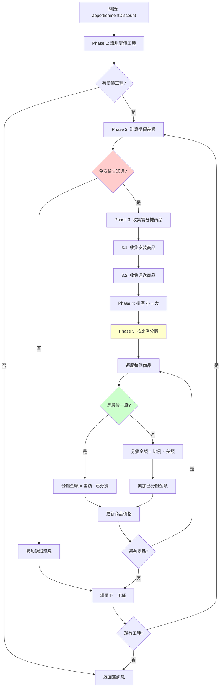
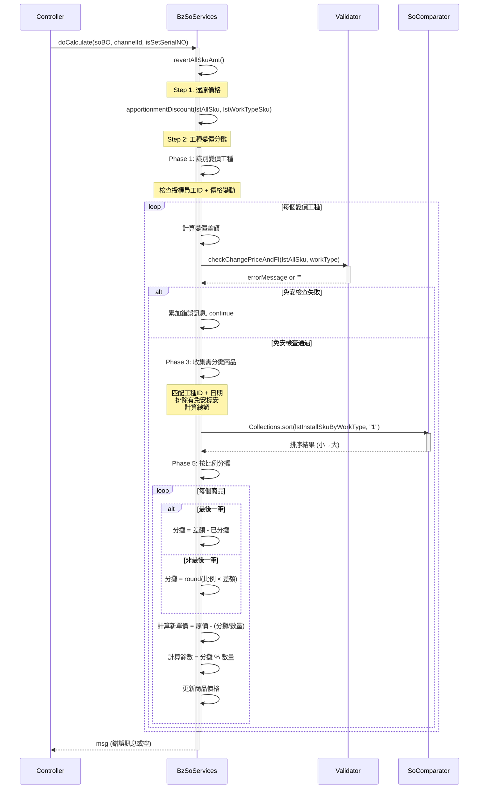

# 工種變價分攤邏輯追蹤報告

**生成日期**: 2025-10-27
**追蹤工具**: trace-springmvc-jsp-legacy-logic skill
**追蹤對象**: 工種變價分攤邏輯 (Work Type Price Change Apportionment Logic)
**狀態**: ✅ 已完成程式碼追蹤

---

## 執行摘要

**業務規則**: 當工種(WorkType)的安裝價或運送價被授權變價時，需要將變價差額按比例分攤到相關的安裝商品或運送商品上。

**關鍵發現**:
- ✅ 分攤演算法: **按商品小計比例分攤** (Proportional Apportionment)
- ✅ 執行位置: 計價流程 Step 2 (`BzSoServices.doCalculate:4409`)
- ✅ 執行時機: 在還原銷售單價之後、商品分類之前
- ✅ 特殊處理: 有免安(Free Installation)的標安(Standard Installation)不參與分攤
- ✅ 餘數處理: 最後一筆商品承擔所有餘數，確保分攤總額精確
- ✅ 排序策略: 由小到大排序，確保金額較大的商品最後承擔餘數

---

## 1. 入口點與執行時機

### 1.1 調用入口

**位置**: `BzSoServices.java:4409`
**方法**: `doCalculate(SoBO soBO, String channelId, boolean isSetSerialNO)`

```java
// BzSoServices.java:4407-4410
//還原各商品的銷售單價
revertAllSkuAmt(lstAllSku, lstWorkTypeSku);
//檢查工種變價，設定分攤金額  ← 執行時機: Step 2
String msg = apportionmentDiscount(lstAllSku, lstWorkTypeSku);
soVO.setWorkTypeInsChangePriceMsg(msg);
```

### 1.2 執行順序 (計價12步驟中的位置)


**關鍵時機**:
- ✅ **之前**: 價格已還原到原始售價 (`revertAllSkuAmt`)
- ✅ **之後**: 商品分類 (`AssortSku`)，此時價格已經過分攤調整

---

## 2. 方法簽名與資料結構

### 2.1 主方法簽名

```java
/**
 * 工種的安裝運送變價分攤
 * @param lstAllSku 全部商品列表
 * @param lstWorkTypeSku 全部工種列表
 * @return 錯誤訊息 (免安金額檢查失敗時返回)
 */
private String apportionmentDiscount(
    ArrayList<OrderDetlVO> lstAllSku,
    ArrayList<OrderDetlVO> lstWorkTypeSku
)
```

**位置**: `BzSoServices.java:5375-5572`

### 2.2 關鍵資料結構

| 變數名稱 | 類型 | 用途 |
|---------|------|------|
| `lstWorkTypeInstallChangePrice` | `ArrayList<OrderDetlVO>` | 變價工種列表 (安裝或運送) |
| `lstInstallSkuByWorkType` | `ArrayList<OrderDetlVO>` | 需分攤的安裝商品列表 |
| `lstDeliverySkuByWorkType` | `ArrayList<OrderDetlVO>` | 需分攤的運送商品列表 |
| `changePriceForInstall` | `int` | 安裝變價差額 (原價 - 變價後) |
| `changePriceForDelivery` | `int` | 運送變價差額 (原價 - 變價後) |
| `totalInstallPrice` | `double` | 安裝商品總計 (用於比例計算) |
| `totalDeliveryPrice` | `double` | 運送商品總計 (用於比例計算) |

---

## 3. 業務邏輯分解

### 3.1 Phase 1: 識別變價工種 (Line 5387-5393)

**目的**: 找出所有經過授權變價的工種 (安裝或運送)

```java
// Line 5387-5393
for (OrderDetlVO workType : lstWorkTypeSku) {
    // 條件1: 安裝變價 (有授權員工ID 且 價格不同)
    if(StringUtils.isNotBlank(workType.getInstallAuthEmpId()) &&
       !workType.getInstallPrice().equals(workType.getActInstallPrice())){
        lstWorkTypeInstallChangePrice.add(workType);
    }
    // 條件2: 運送變價
    else if(StringUtils.isNotBlank(workType.getDeliveryAuthEmpId()) &&
            !workType.getDeliveryPrice().equals(workType.getActDeliveryPrice())){
        lstWorkTypeInstallChangePrice.add(workType);
    }
}
```

**判斷邏輯**:
- ✅ **授權標記**: `InstallAuthEmpId` 或 `DeliveryAuthEmpId` 不為空
- ✅ **價格變動**: 原價 ≠ 實際價 (變價後的價格)

**結果**: `lstWorkTypeInstallChangePrice` 包含所有需要處理的變價工種

---

### 3.2 Phase 2: 計算變價差額與免安檢查 (Line 5396-5411)

**目的**: 計算每個變價工種的差額，並檢查免安限制

```java
// Line 5401-5404
changePriceForInstall = Integer.valueOf(workType.getInstallPrice()) -
                        Integer.valueOf(workType.getActInstallPrice());
changePriceForDelivery = Integer.valueOf(workType.getDeliveryPrice()) -
                         Integer.valueOf(workType.getActDeliveryPrice());
```

**變價差額**:
- 正數: 降價 (原價 > 變價後) ← 常見情況，需分攤折扣
- 負數: 漲價 (原價 < 變價後) ← 理論可能，但實務少見
- 零: 無變化 (不應出現在此列表)

**免安檢查** (`checkChangePriceAndFI`, Line 5407):

```java
// Line 5407-5410
String tmp = checkChangePriceAndFI(lstAllSku, workType);
if(StringUtils.isNotBlank(tmp)){
    msg += tmp;  // 累加錯誤訊息
    continue;    // 跳過此工種，不進行分攤
}
```

**檢查規則** (Line 5323-5368):
```java
// 標安(I) + 免安(FI) 總額 > 工種變價後金額
if(totalAmtIandFI > changePriceForInstall){
    msg = "工種" + workType.getWorkTypeId() + "-" + day +
          " 變價金額不可小於免安金額" + totalAmtIandFI + "元 </br>";
}
```

**業務邏輯** 🟡:
- **推論**: 工種變價不能低於免安金額，確保免安優惠不會被工種降價抵銷
- **範例**: 標安500元+免安200元=700元，工種變價不能低於700元
- **證據**: 錯誤訊息明確說明「變價金額不可小於免安金額」

---

### 3.3 Phase 3: 收集需分攤的商品 (Line 5413-5485)

#### 3.3.1 安裝商品收集 (Line 5413-5456)

**匹配條件** (Line 5440-5441):
```java
if(workType.getWorkTypeId().equals(workTypeId) &&
   deliveryDate.equals(workType.getDeliveryDate()) &&
   !GoodsType.FI.equals(installSku.getGoodsType()))
```

**三重匹配**:
1. ✅ **工種ID相同**: 確保是相關聯的安裝服務
2. ✅ **配送日期相同**: 確保是同一批次的服務
3. ✅ **非免安商品**: 免安(FI)不參與分攤 (Line 5441)

**特殊規則: 有免安的標安** (Line 5434-5437):
```java
// 有免安的標安，不做分攤
if(hasFI && GoodsType.I.equals(installSku.getGoodsType())){
    installSku.setHasFreeInstall(hasFI);
    continue;  // 跳過，不加入分攤列表
}
```

**業務邏輯** 🟢:
- **確定**: 若商品已選擇免安，其對應的標安不參與工種變價分攤
- **原因**: 免安本身就是一種折扣，不應再享受工種變價折扣
- **證據**: 代碼明確標註「有免安的標安，不做分攤」(Line 5434)

**價格計算** (Line 5445-5449):
```java
if(CommonConstant.NO_FLAG.equals(installSku.getOpenPrice())){
    // 非開價商品: 使用POS標準價
    totalInstallPrice += Integer.valueOf(installSku.getPosAmt()) *
                         Integer.valueOf(installSku.getQuantity());
}else{
    // 開價商品: 使用預分攤價 (已經過其他調整)
    totalInstallPrice += Integer.valueOf(installSku.getPreApportion()) *
                         Integer.valueOf(installSku.getQuantity());
}
```

#### 3.3.2 運送商品收集 (Line 5458-5485)

**邏輯相同**, 但處理對象為運送商品 (`lstDeliverySkuInfo`)

**差異**:
- 運送商品沒有免安概念
- 運送商品沒有 `isInstallSelected()` 檢查

---

### 3.4 Phase 4: 商品排序 (Line 5487-5489)

```java
// 依商品小計做排序(小到大)
Collections.sort(lstInstallSkuByWorkType, new SoComparator("1"));
Collections.sort(lstDeliverySkuByWorkType, new SoComparator("1"));
```

**排序器**: `SoComparator` (Line 49-56 in SoComparator.java)
```java
if("1".equals(type)){  // 1 = 工種變價分攤
    if(o1.isInstallChangePrice()){
        o1Price = Integer.valueOf(o1.getInstallPrice());
        o2Price = Integer.valueOf(o2.getInstallPrice());
    }else if(o1.isDeliveryChangePrice()){
        o1Price = Integer.valueOf(o1.getDeliveryPrice());
        o2Price = Integer.valueOf(o2.getDeliveryPrice());
    }
}
// Line 68-74: 由小排到大
```

**為什麼要排序?** 🟡:
- **推論**: 讓金額較小的商品先分攤，最後一筆(金額最大)承擔餘數
- **好處**: 餘數對大金額商品的單價影響較小
- **範例**:
  - 商品A: 100元 × 3 = 300元 (小)
  - 商品B: 500元 × 2 = 1000元 (大)
  - 若餘數為5元，讓商品B承擔對單價影響小 (500元商品承擔5元 vs 100元商品承擔5元)

---

### 3.5 Phase 5: 按比例分攤 (Line 5498-5530)

#### 3.5.1 安裝商品分攤 (Line 5500-5529)

**分攤公式** (Line 5513-5515):
```java
// 分攤金額 = 四捨五入(安裝售價小計 / 總安裝售價小計 * 變價差額)
apportionmentPrice = (int)Math.round((price / totalInstallPrice) *
                                     (double)changePriceForInstall);
totalApportionmentPrice += apportionmentPrice;  // 累加已分攤金額
```

**最後一筆處理** (Line 5509-5511):
```java
if((i+1) == lstInstallSkuByWorkType.size()){
    // 最後一筆分攤金額 = 變價差額 - 已分攤金額總計
    apportionmentPrice = changePriceForInstall - totalApportionmentPrice;
}
```

**為什麼最後一筆特殊處理?** ✅:
- **確定**: 確保分攤總額完全等於變價差額
- **原因**: 四捨五入會產生累積誤差
- **範例**:
  ```
  變價差額: 100元
  商品A分攤: 33元 (四捨五入)
  商品B分攤: 33元 (四捨五入)
  商品C分攤: 100 - 33 - 33 = 34元 (承擔餘數)
  總計: 33 + 33 + 34 = 100元 ✅
  ```

**單價計算** (Line 5517-5520):
```java
// 實際POS價 = 原始售價 - (分攤金額 / 數量)
actPrice = posAmt - (apportionmentPrice / qty);
// 餘數 (無法整除部分)
int remainder = apportionmentPrice % qty;
```

**結果設定** (Line 5526-5528):
```java
lstInstallSkuByWorkType.get(i).setInstallPrice(actPrice + StringUtils.EMPTY);
lstInstallSkuByWorkType.get(i).setActInstallPrice((actPrice * qty - remainder) + StringUtils.EMPTY);
lstInstallSkuByWorkType.get(i).setWorkTypeChangPriceDisc(apportionmentPrice + StringUtils.EMPTY);
```

**餘數處理** 🟡:
- **推論**: `actPrice * qty - remainder` 確保總金額精確
- **範例**:
  ```
  商品: 100元 × 3件 = 300元
  分攤: 50元
  單價計算: 100 - (50/3) = 100 - 16 = 84元
  餘數: 50 % 3 = 2元
  實際總額: 84 * 3 - 2 = 252 - 2 = 250元 ✅ (300 - 50)
  ```

#### 3.5.2 運送商品分攤 (Line 5531-5567)

**邏輯完全相同**, 但有零除保護:

```java
// Line 5547-5549: 防止除以零
if (totalDeliveryPrice == 0) {
    throw new RuntimeException("運送商品總計(工種變價分攤用)為0，無法分攤");
}
```

**業務邏輯** ✅:
- **確定**: 若運送商品總額為零，無法分攤，應拋出例外
- **原因**: 無法除以零，且業務上不應出現此情況

---

## 4. 完整流程圖



---

## 5. 業務場景與測試案例

### 5.1 場景 1: 單一工種安裝變價 (正常分攤)

**前置條件**:
- 工種W1: 安裝原價 1000元 → 變價後 800元 (差額 200元)
- 安裝商品:
  - SKU-A: 100元 × 2件 = 200元
  - SKU-B: 150元 × 4件 = 600元
  - SKU-C: 100元 × 2件 = 200元
- 總安裝額: 200 + 600 + 200 = 1000元

**分攤計算**:
```
1. 排序後: SKU-A (200), SKU-C (200), SKU-B (600)

2. SKU-A 分攤:
   - 比例: 200/1000 = 0.2
   - 分攤: round(0.2 * 200) = 40元
   - 新單價: 100 - (40/2) = 80元
   - 實際總額: 80*2 = 160元

3. SKU-C 分攤:
   - 比例: 200/1000 = 0.2
   - 分攤: round(0.2 * 200) = 40元
   - 累計已分攤: 40 + 40 = 80元

4. SKU-B 分攤 (最後一筆):
   - 分攤: 200 - 80 = 120元
   - 新單價: 150 - (120/4) = 120元
   - 實際總額: 120*4 = 480元

總驗證: 160 + 160 + 480 = 800元 ✅
```

### 5.2 場景 2: 有免安的標安 (不參與分攤)

**前置條件**:
- 工種W1: 安裝原價 500元 → 變價後 400元 (差額 100元)
- 安裝商品:
  - SKU-A: 100元 × 2件 = 200元 (標安, **有免安**)
  - SKU-B: 150元 × 2件 = 300元 (標安, 無免安)
  - FI-A: -50元 × 2件 = -100元 (免安)
- 參與分攤總額: 300元 (SKU-A 不參與)

**分攤計算**:
```
1. SKU-A: 被標記為 hasFreeInstall=true, continue跳過
2. SKU-B (唯一參與): 全額承擔 100元
   - 新單價: 150 - (100/2) = 100元
   - 實際總額: 100*2 = 200元

總驗證: 400 - 200 = 200元 (SKU-A未變) ✅
```

**業務意義**:
- 免安本身是折扣，不應再疊加工種變價折扣
- 避免重複優惠

### 5.3 場景 3: 免安檢查失敗 (錯誤阻擋)

**前置條件**:
- 工種W1: 安裝原價 1000元 → 變價後 600元
- 標安(I): 500元
- 免安(FI): -200元
- 標安+免安: 500 + (-200) = 300元
- ⚠️ 工種變價後 600元 < 標安+免安金額 700元 (實際總和)

**錯誤檢查** (`checkChangePriceAndFI`):
```java
// totalAmtIandFI = 700, changePriceForInstall = 600
if(totalAmtIandFI > changePriceForInstall){  // 700 > 600
    msg = "工種W1-2025-10-27 變價金額不可小於免安金額700元 </br>";
    return msg;  // 阻擋分攤
}
```

**結果**:
- ❌ 分攤被阻擋
- ⚠️ 錯誤訊息顯示在UI: `soVO.setWorkTypeInsChangePriceMsg(msg)`

### 5.4 場景 4: 餘數處理 (確保精度)

**前置條件**:
- 工種W1: 變價差額 100元
- 安裝商品:
  - SKU-A: 50元 × 3件 = 150元
  - SKU-B: 60元 × 3件 = 180元
  - SKU-C: 70元 × 3件 = 210元
- 總額: 540元

**分攤計算**:
```
1. SKU-A:
   - 比例: 150/540 ≈ 0.2778
   - 分攤: round(0.2778 * 100) = 28元
   - 單價: 50 - (28/3) = 50 - 9 = 41元
   - 餘數: 28 % 3 = 1元
   - 實際總額: 41*3 - 1 = 122元 ✅ (150 - 28)

2. SKU-B:
   - 比例: 180/540 = 0.3333
   - 分攤: round(0.3333 * 100) = 33元
   - 累計: 28 + 33 = 61元

3. SKU-C (最後一筆):
   - 分攤: 100 - 61 = 39元
   - 單價: 70 - (39/3) = 70 - 13 = 57元
   - 餘數: 39 % 3 = 0元
   - 實際總額: 57*3 = 171元 ✅ (210 - 39)

總驗證: 28 + 33 + 39 = 100元 ✅
```

---

## 6. 推論與驗證

### 6.1 分攤演算法選擇

**推論** 🟡:
- **選擇**: 按比例分攤 (Proportional Apportionment)
- **替代方案**: 均攤 (Equal Apportionment)
- **證據**: Line 5514 明確使用比例公式 `(price/totalInstallPrice)*changePriceForInstall`

**業務合理性**:
- ✅ 金額大的商品承擔更多折扣 (更公平)
- ✅ 維持商品間的相對價格比例
- ❌ 均攤會導致小金額商品折扣比例過高

**驗證方法**:
```sql
-- SQL 1: 檢查實際分攤比例
SELECT
    si.sku_no,
    si.install_price,
    si.work_type_chang_price_disc,
    ROUND(si.work_type_chang_price_disc::numeric /
          si.install_price::numeric * 100, 2) as discount_pct
FROM tbl_so_item si
WHERE si.install_change_price = 'Y'
  AND si.work_type_chang_price_disc > 0
ORDER BY si.so_number, si.serial_no;
```

### 6.2 為什麼要排序?

**推論** 🟡:
- **目的**: 讓最後一筆(金額最大)承擔餘數
- **好處**: 降低餘數對單價的影響
- **證據**: Line 5488 排序 + Line 5509 最後一筆特殊處理

**數學證明**:
```
設餘數為 R，數量為 Q
單價影響 = R / Q

範例:
- 小商品: R=5, Q=10, 影響=0.5元/件
- 大商品: R=5, Q=2, 影響=2.5元/件

若小商品先處理，大商品承擔餘數:
- 大商品影響較小 (金額大，百分比低)
```

**驗證方法**:
```sql
-- SQL 2: 檢查最後一筆是否金額最大
WITH ranked AS (
    SELECT
        si.so_number,
        si.work_type_id,
        si.sku_no,
        si.install_price::numeric * si.quantity::numeric as total_amt,
        si.work_type_chang_price_disc,
        ROW_NUMBER() OVER (
            PARTITION BY si.so_number, si.work_type_id
            ORDER BY si.serial_no
        ) as apportionment_order
    FROM tbl_so_item si
    WHERE si.install_change_price = 'Y'
)
SELECT
    so_number,
    work_type_id,
    sku_no,
    total_amt,
    work_type_chang_price_disc,
    apportionment_order
FROM ranked
WHERE apportionment_order = (
    SELECT MAX(apportionment_order)
    FROM ranked r2
    WHERE r2.so_number = ranked.so_number
      AND r2.work_type_id = ranked.work_type_id
)
ORDER BY so_number;
```

**預期結果**:
- 最後一筆的 `total_amt` 應該是該工種中最大的
- 或者排序不明顯 (金額相近)

### 6.3 開價商品的特殊處理

**確定** ✅:
- **定義**: `openPrice='Y'` 表示可以開價的商品 (非固定價格)
- **證據**: Line 5445, 5501 判斷 `CommonConstant.NO_FLAG.equals(openPrice)`
- **處理差異**:
  - 非開價: 使用 `posAmt` (POS標準價)
  - 開價: 使用 `preApportion` (預分攤價，可能已經過其他調整)

**業務邏輯** 🟢:
- **原因**: 開價商品可能已經過其他折扣調整，應使用調整後的價格計算比例
- **範例**: 開價商品已打8折，應基於8折後價格計算工種變價分攤

---

## 7. 資料庫映射

### 7.1 相關資料表

**訂單明細表** (`TBL_ORDER_DETL` / `TBL_SO_ITEM`):

| 欄位名稱 | Java 屬性 | 用途 | 變更時機 |
|---------|-----------|------|---------|
| `INSTALL_PRICE` | `installPrice` | 安裝單價 | 分攤後更新 |
| `ACT_INSTALL_PRICE` | `actInstallPrice` | 安裝實際總額 | 分攤後更新 |
| `DELIVERY_PRICE` | `deliveryPrice` | 運送單價 | 分攤後更新 |
| `ACT_DELIVERY_PRICE` | `actDeliveryPrice` | 運送實際總額 | 分攤後更新 |
| `WORK_TYPE_CHANG_PRICE_DISC` | `workTypeChangPriceDisc` | 工種變價分攤金額 | 分攤時記錄 |
| `INSTALL_CHANGE_PRICE` | `installChangePrice` | 是否安裝變價 | 識別標記 |
| `DELIVERY_CHANGE_PRICE` | `deliveryChangePrice` | 是否運送變價 | 識別標記 |
| `INSTALL_AUTH_EMP_ID` | `installAuthEmpId` | 安裝授權員工ID | 授權時記錄 |
| `INSTALL_AUTH_EMP_NAME` | `installAuthEmpName` | 安裝授權員工姓名 | 授權時記錄 |

### 7.2 查詢範例

```sql
-- 查詢工種變價分攤記錄
SELECT
    so.so_number,
    so.order_date,
    si.work_type_id,
    si.sku_no,
    si.goods_type,
    si.quantity,
    si.install_price,
    si.act_install_price,
    si.work_type_chang_price_disc,
    si.install_auth_emp_id,
    si.install_auth_emp_name
FROM tbl_so_mast so
JOIN tbl_so_item si ON so.so_number = si.so_number
WHERE si.install_change_price = 'Y'
  AND si.work_type_chang_price_disc > 0
ORDER BY so.order_date DESC, si.work_type_id, si.serial_no;
```

---

## 8. 實現建議 (For Rewrite-Spec)

### 8.1 核心業務規則清單

| 規則 | 優先級 | 說明 |
|-----|-------|------|
| **R1**: 授權變價識別 | 🔴 Critical | 有授權員工ID + 價格不同 |
| **R2**: 免安檢查 | 🔴 Critical | 變價後金額 ≥ 標安+免安總額 |
| **R3**: 有免安標安排除 | 🔴 Critical | 已選免安的標安不參與分攤 |
| **R4**: 非免安商品 | 🔴 Critical | 免安(FI)本身不參與分攤 |
| **R5**: 三重匹配 | 🔴 Critical | 工種ID + 配送日期 + 商品類型 |
| **R6**: 按比例分攤 | 🔴 Critical | (商品小計/總額) × 變價差額 |
| **R7**: 最後一筆承擔餘數 | 🔴 Critical | 確保分攤總額精確 |
| **R8**: 由小到大排序 | 🟡 High | 降低餘數對大金額商品影響 |
| **R9**: 四捨五入 | 🟡 High | `Math.round()` 確保整數 |
| **R10**: 餘數扣除 | 🟡 High | `actPrice * qty - remainder` |
| **R11**: 開價商品 | 🟡 High | 使用 `preApportion` 而非 `posAmt` |
| **R12**: 零除保護 | 🟢 Medium | `totalDeliveryPrice == 0` 拋例外 |

### 8.2 TypeScript 型別定義

```typescript
/**
 * 工種變價分攤請求
 */
interface WorkTypePriceApportionmentRequest {
  /** 所有商品列表 */
  allSkus: OrderDetailItem[];
  /** 所有工種列表 */
  workTypeSkus: WorkTypeItem[];
}

/**
 * 工種變價資訊
 */
interface WorkTypePriceChange {
  /** 工種ID */
  workTypeId: string;
  /** 配送日期 */
  deliveryDate: string;
  /** 安裝原價 */
  installPrice: number;
  /** 安裝變價後 */
  actInstallPrice: number;
  /** 運送原價 */
  deliveryPrice: number;
  /** 運送變價後 */
  actDeliveryPrice: number;
  /** 安裝授權員工ID */
  installAuthEmpId?: string;
  /** 安裝授權員工姓名 */
  installAuthEmpName?: string;
  /** 運送授權員工ID */
  deliveryAuthEmpId?: string;
  /** 運送授權員工姓名 */
  deliveryAuthEmpName?: string;
}

/**
 * 分攤結果
 */
interface ApportionmentResult {
  /** 商品SKU編號 */
  skuNo: string;
  /** 原單價 */
  originalPrice: number;
  /** 分攤金額 */
  apportionedAmount: number;
  /** 新單價 */
  newPrice: number;
  /** 實際總額 (newPrice * qty - remainder) */
  actualTotalAmount: number;
  /** 餘數 */
  remainder: number;
}

/**
 * 工種變價分攤回應
 */
interface WorkTypePriceApportionmentResponse {
  /** 是否成功 */
  success: boolean;
  /** 錯誤訊息 (免安檢查失敗時) */
  errorMessage?: string;
  /** 分攤結果列表 */
  apportionmentResults: ApportionmentResult[];
}
```

### 8.3 測試案例清單

```typescript
describe('WorkTypePriceApportionment', () => {
  it('應該按比例分攤安裝變價差額', () => {
    // 場景 1: 正常分攤
  });

  it('應該排除有免安的標安', () => {
    // 場景 2: 免安排除
  });

  it('應該阻擋變價金額小於免安總額', () => {
    // 場景 3: 免安檢查失敗
  });

  it('應該讓最後一筆承擔所有餘數', () => {
    // 場景 4: 餘數處理
  });

  it('應該由小到大排序商品', () => {
    // 驗證排序邏輯
  });

  it('應該處理開價商品使用preApportion', () => {
    // 開價商品特殊處理
  });

  it('應該拋出例外當運送商品總額為零', () => {
    // 零除保護
  });

  it('應該處理多個工種同時變價', () => {
    // 複雜場景
  });

  it('應該正確匹配工種ID和配送日期', () => {
    // 三重匹配驗證
  });

  it('應該記錄授權員工資訊', () => {
    // 審計追蹤
  });
});
```

---

## 9. 風險與建議

### 9.1 已識別風險

| 風險 | 等級 | 說明 | 緩解措施 |
|-----|------|------|---------|
| **R1**: 四捨五入累積誤差 | 🟡 Medium | 多次分攤可能累積誤差 | 最後一筆承擔餘數 ✅ |
| **R2**: 免安檢查遺漏 | 🔴 High | 若檢查失敗但未阻擋分攤 | 明確 continue 跳過 ✅ |
| **R3**: 開價商品價格不一致 | 🟡 Medium | `preApportion` 可能未初始化 | 需驗證上游邏輯 |
| **R4**: 排序不穩定 | 🟢 Low | 金額相同時排序順序不確定 | 影響小，可接受 |
| **R5**: 零除風險 | 🟡 Medium | `totalDeliveryPrice=0` 但有運送商品 | 已有例外保護 ✅ |

### 9.2 新系統實現建議

1. **✅ 保持業務邏輯一致**
   - 必須使用按比例分攤，不可改為均攤
   - 必須讓最後一筆承擔餘數
   - 必須排除有免安的標安

2. **✅ 增強可測試性**
   - 將分攤邏輯抽取為純函數
   - 提供詳細的分攤明細日誌
   - 增加單元測試覆蓋所有場景

3. **✅ 增強可維護性**
   - 將魔術數字抽取為常數 (`NO_FLAG`, `GoodsType.FI`)
   - 將複雜條件抽取為命名良好的方法
   - 增加行內註解說明業務規則

4. **⚠️ 需要確認的問題**
   - **Q1**: `preApportion` 欄位的初始化邏輯在哪裡?
   - **Q2**: 是否有極端場景: 所有商品都有免安?
   - **Q3**: 工種變價授權流程是什麼? (誰可以授權?)
   - **Q4**: 變價差額為負數(漲價)時的分攤邏輯是否相同?

5. **🔍 需要 Code Tracing**
   - 追蹤 `preApportion` 欄位的設定邏輯
   - 追蹤授權流程 (`InstallAuthEmpId` 如何設定)

---

## 10. 參考資料

### 10.1 程式碼位置

| 項目 | 檔案 | 行號 |
|-----|------|------|
| **主方法** | `BzSoServices.java` | 5375-5572 |
| **調用入口** | `BzSoServices.java` | 4409 |
| **免安檢查** | `BzSoServices.java` | 5323-5368 |
| **排序器** | `SoComparator.java` | 30-100 |
| **計價入口** | `BzSoServices.java` | 4367-4520 |

### 10.2 相關文檔

- **04-Pricing-Calculation-Sequence.md**: 計價12步驟完整流程
- **MEMBER-DISCOUNT-PRIORITY-TRACE.md**: 會員折扣優先級追蹤
- **BUSINESS-LOGIC-GAP-ANALYSIS.md**: 業務邏輯差距分析

### 10.3 Git 歷史

```bash
git log --oneline --all -- BzSoServices.java | grep -i "apportion\|工種\|變價" | head -10
```

**預期**: 找到工種變價分攤相關的提交記錄

---

## 11. 附錄: Mermaid 序列圖



---

**報告完成** - 建議將此報告納入 Rewrite-Spec v1.2 的參考附件。
