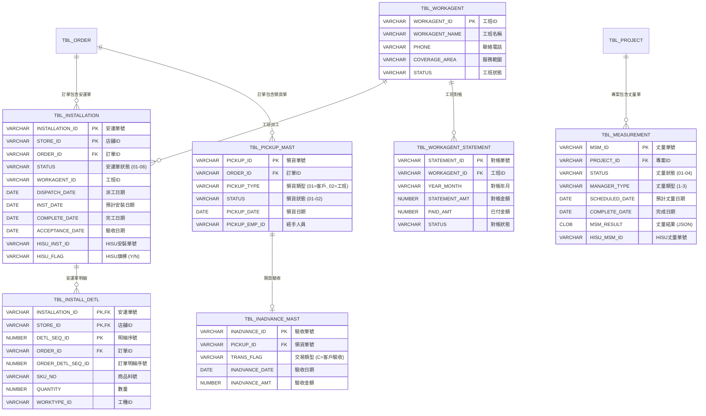

# Logical Schema: Fulfillment Domain

## Overview

本文件記錄訂單履行業務領域的邏輯資料模型，補充 DDL 無法表達的隱含關係、生命週期約束與業務規則。履行流程是訂單付款後的執行階段，涵蓋安裝派工、丈量服務、貨品領取、工班管理到驗收結案的完整業務邏輯。

**涵蓋範圍**：
- TBL_INSTALLATION (安運單主檔)
- TBL_INSTALL_DETL (安運單明細)
- TBL_MEASUREMENT (丈量單主檔)
- TBL_PICKUP_MAST (領貨單主檔)
- TBL_WORKAGENT (工班主檔)
- TBL_WORKAGENT_STATEMENT (工班對帳單)
- TBL_INADVANCE_MAST (預收/驗收主檔)

**關鍵特性**：
- **複雜狀態機**：安運單有 6 種狀態，狀態轉換規則複雜
- **外部系統整合**：HISU 系統管理部分安裝派工
- **工班管理**：工班領貨、退貨、對帳流程
- **條件履行**：依商品類型決定履行方式（安裝/領貨/直送）

**參考規格**：
- `openspec/specs/order-fulfillment/spec.md` - 訂單履行功能規格
- `openspec/specs/measurement-service/spec.md` - 丈量服務規格
- `openspec/specs/workagent-management/spec.md` - 工班管理規格

---

## 1. 隱含外鍵關係（Implicit Foreign Keys）

### 1.1 核心履行關係

| 父表 | 子表 | JOIN 條件 | 基數 | 實施位置 | 說明 |
|------|------|-----------|------|----------|------|
| TBL_ORDER | TBL_INSTALLATION | ORDER_ID | 1:N | InstallServices.java | 一張訂單可有多張安運單 |
| TBL_INSTALLATION | TBL_INSTALL_DETL | INSTALLATION_ID + STORE_ID | 1:N | BzInstallationServices.java | 安運單明細（工種） |
| TBL_PROJECT | TBL_MEASUREMENT | PROJECT_ID | 1:N | MeasurementServices.java | 專案丈量記錄 |
| TBL_ORDER | TBL_PICKUP_MAST | ORDER_ID | 1:N | PickupServices.java | 客戶/工班領貨單 |
| TBL_WORKAGENT | TBL_INSTALLATION | WORKAGENT_ID | 1:N | BzInstallationServices.java | 工班派工記錄 |
| TBL_WORKAGENT | TBL_WORKAGENT_STATEMENT | WORKAGENT_ID | 1:N | WorkagentStatementServices.java | 工班對帳單 |
| TBL_PICKUP_MAST | TBL_INADVANCE_MAST | PICKUP_ID | 1:1 | CustomerPickupServices.java | 領貨驗收記錄 |

### 1.2 履行單據與訂單明細關聯

**重要**：履行單據明細透過 ORDER_ID + DETL_SEQ_ID 關聯訂單明細

```
TBL_ORDER_DETL (ORDER_ID, DETL_SEQ_ID)
    ↓ FK (隱含)
TBL_INSTALL_DETL (ORDER_ID, DETL_SEQ_ID)
    ↓ 關聯工種
TBL_ENGINEERING (WORKTYPE_ID)
```

**代碼範例**：
```java
// BzInstallationServices.java
TblInstallDetl detl = new TblInstallDetl();
detl.setInstallationId(installationId);
detl.setOrderId(orderDetl.getOrderId());          // 關聯訂單
detl.setDetlSeqId(orderDetl.getDetlSeqId());      // 關聯明細序號
detl.setSkuNo(orderDetl.getSkuNo());
detl.setWorktypeId(engineering.getWorktypeId());  // 關聯工種
```

### 1.3 HISU 系統整合關聯

| 表 | HISU 關聯欄位 | 用途 |
|---|---------------|------|
| TBL_INSTALLATION | HISU_INST_ID | HISU 系統的安裝單號 |
| TBL_MEASUREMENT | HISU_MSM_ID | HISU 系統的丈量單號 |
| TBL_WORKAGENT | HISU_VENDOR_ID | HISU 認可的工班編號 |

**特點**：
- HISU_INST_ID 可為 NULL（非 HISU 派工）
- 透過 TBL_WS_QUEUE 與 HISU 系統非同步通訊
- HISU 系統會回傳狀態更新（callback）

---

## 2. 實體關係圖（Entity Relationship Diagram）



### 2.1 安運單狀態值說明

| STATUS | 狀態名稱 | 英文 | 說明 |
|--------|---------|------|------|
| 01 | 待派工 | TO_DISPATCH | 安運單已建立，等待派工 |
| 02 | 已派工 | DISPATCHED | 已指派工班，等待工班領貨 |
| 03 | 待HISU約排 | HISU_SCHEDULING | 已送 HISU 系統，等待約排 |
| 04 | 已領貨 | PICKED_UP | 工班已領貨，準備安裝 |
| 05 | 已驗收 | ACCEPTED | 安裝完成並驗收 |
| 06 | 已作廢 | CANCELLED | 安運單取消 |

### 2.2 丈量單狀態值說明

| STATUS | 狀態名稱 | 說明 |
|--------|---------|------|
| 01 | 待派工 | 丈量單建立，等待指派丈量人員 |
| 02 | 已派工 | 已指派丈量人員或 HISU |
| 03 | 已回報 | 丈量完成，結果已回報 |
| 04 | 已作廢 | 丈量單取消 |

### 2.3 丈量類型說明

| MANAGER_TYPE | 類型名稱 | 說明 |
|--------------|---------|------|
| 1 | HISU Manager | 由 HISU 系統派遣外部丈量人員 |
| 2 | Internal Staff | 門市人員自行丈量 |
| 3 | External Vendor | 委外廠商丈量 |

---

## 3. 生命週期狀態機（Lifecycle State Machines）

### 3.1 安運單狀態轉換


### 3.2 丈量單狀態轉換


### 3.3 領貨與驗收狀態轉換


---

## 4. 時間序約束（Temporal Constraints）

### 4.1 履行流程時間序

| 規則 ID | 描述 | 實施位置 | 違反後果 |
|---------|------|----------|----------|
| **TC-F01** | TBL_INSTALLATION 必須在 TBL_ORDER 付款後創建 | BzInstallationServices.java | 業務邏輯錯誤 |
| **TC-F02** | DISPATCH_DATE 必須在 INST_DATE 之前 | InstallServices.java | 邏輯錯誤 |
| **TC-F03** | COMPLETE_DATE 必須在 INST_DATE 之後或當天 | BzInstallationServices.java | 邏輯錯誤 |
| **TC-F04** | ACCEPTANCE_DATE 必須在 COMPLETE_DATE 之後或當天 | BzInstallationServices.java | 邏輯錯誤 |
| **TC-F05** | 工班領貨 (PICKUP_DATE) 必須在派工 (DISPATCH_DATE) 之後 | WorkagentPickupServices.java | 時間序錯誤 |
| **TC-F06** | 丈量回報 (COMPLETE_DATE) 必須在丈量派工 (SCHEDULED_DATE) 之後 | MeasurementServices.java | 時間序錯誤 |

### 4.2 安裝流程時間序


**時間欄位**：
- **T1 (ORDER.PAID_DATE)**：訂單付款時間
- **T2 (INSTALLATION.DISPATCH_DATE)**：派工時間
- **T3 (PICKUP_MAST.PICKUP_DATE)**：工班領貨時間
- **T4 (INSTALLATION.INST_DATE)**：預計安裝日期
- **T5 (INSTALLATION.COMPLETE_DATE / ACCEPTANCE_DATE)**：完工/驗收時間

**約束條件**：T1 < T2 ≤ T3 ≤ T4 ≤ T5

### 4.3 HISU 整合時間序


---

## 5. 條件關係（Conditional Relationships）

### 5.1 履行方式條件

| 條件 | 履行方式 | 單據類型 |
|------|---------|----------|
| **GOODS_TYPE = 'I'** | 需要安裝 | TBL_INSTALLATION |
| **GOODS_TYPE = 'P'** AND **INSTALL_FLAG = 'N'** | 客戶自取 | TBL_PICKUP_MAST (PICKUP_TYPE='01') |
| **GOODS_TYPE = 'P'** AND **INSTALL_FLAG = 'Y'** | 工班領貨 | TBL_PICKUP_MAST (PICKUP_TYPE='02') |
| **GOODS_TYPE = 'DD'** | 直送廠商 | TBL_VENDOR_PO |

### 5.2 工班派工條件

| 條件 | 工班類型 | 流程 |
|------|---------|------|
| **WORKAGENT_ID = '0000810147'** | 特力屋室內裝修（HISU） | 狀態 01 → 03 → 02 |
| **WORKAGENT_ID != '0000810147'** | 一般工班 | 狀態 01 → 02 |
| **MULTI_FLAG = 'D0202'** | SPL 品牌廚具 | 必須派給 HISU |

### 5.3 安運單作廢條件

| 當前狀態 | 可作廢 | 條件 |
|---------|-------|------|
| 01 (待派工) | 是 | 無條件 |
| 02 (已派工) | 是 | 無條件 |
| 03 (待HISU約排) | 是 | 無條件 |
| 04 (已領貨) | **條件** | 僅純安裝可作廢（無商品） |
| 05 (已驗收) | 否 | 不可作廢 |
| 06 (已作廢) | - | 已作廢 |

**純安裝判斷邏輯**：
```sql
-- 檢查是否為純安裝（無需配送商品）
SELECT COUNT(*)
FROM TBL_ORDER_DETL tod
WHERE tod.ORDER_ID = :orderId
  AND tod.GOODS_TYPE = 'P'  -- 商品（非工種/運送）
  AND tod.WORKTYPE_ID = tod.DELIVERY_WORKTYPE_ID  -- 安裝工種等於配送工種
```
如果 COUNT = 0，表示無商品需配送，可作廢狀態 04 的安運單。

---

## 6. 非標準聯接（Non-Standard Joins）

### 6.1 安運單與訂單明細的複雜關聯

**問題**：TBL_INSTALL_DETL 使用 ORDER_DETL_SEQ_ID 關聯 TBL_ORDER_DETL，但非標準 FK

```java
// BzInstallationServices.java
// 關聯安運單明細與訂單明細
TblInstallDetlCriteria criteria = new TblInstallDetlCriteria();
criteria.createCriteria()
    .andOrderIdEqualTo(orderId)
    .andDetlSeqIdEqualTo(orderDetlSeqId);  // 使用 DETL_SEQ_ID，非 ORDER_DETL_SEQ_ID

List<TblInstallDetl> detls = tblInstallDetlMapper.selectByCriteria(criteria);
```

**實際欄位名稱不一致**：
- TBL_ORDER_DETL.DETL_SEQ_ID（主鍵）
- TBL_INSTALL_DETL.ORDER_DETL_SEQ_ID（外鍵，但名稱不同）
- 程式中使用 `DETL_SEQ_ID` 查詢，MyBatis 自動對應

### 6.2 HISU_INST_ID 的非唯一性

**問題**：HISU_INST_ID 可能為 NULL，也可能重複（補派）

```java
// 查詢 HISU 安運單
TblInstallationCriteria criteria = new TblInstallationCriteria();
criteria.createCriteria()
    .andHisuInstIdEqualTo(hisuInstId)
    .andHisuFlagEqualTo("Y");  // 必須同時檢查 HISU_FLAG

List<TblInstallation> installations = tblInstallationMapper.selectByCriteria(criteria);
```

**特點**：
- HISU_INST_ID 不是 UNIQUE
- 同一 HISU_INST_ID 可能對應多張 SOM 安運單（補派情況）
- 需要使用 INSTALLATION_ID (SOM) 作為主鍵

### 6.3 工班對帳單的年月索引

**TBL_WORKAGENT_STATEMENT.YEAR_MONTH** 使用 VARCHAR2 儲存年月（YYYYMM）

```sql
-- 查詢特定月份的對帳單
SELECT *
FROM TBL_WORKAGENT_STATEMENT
WHERE WORKAGENT_ID = '1234567890'
  AND YEAR_MONTH = '202501'  -- 文字比對，非日期運算
ORDER BY YEAR_MONTH DESC;
```

**問題**：
- 無法使用日期函數（ADD_MONTHS, TRUNC 等）
- 跨年查詢需要字串比較
- 建議改為 DATE 類型

---

## 7. 資料完整性約束（Data Integrity Constraints）

### 7.1 安運單約束

| 規則 ID | 欄位 | 約束 | 實施位置 | 為何不在資料庫 |
|---------|------|------|----------|----------------|
| **DI-F01** | INSTALLATION.INST_DATE | >= DISPATCH_DATE | 前端驗證 | 允許當天派當天裝 |
| **DI-F02** | INSTALLATION.COMPLETE_DATE | >= INST_DATE | 業務邏輯 | 允許提早完工 |
| **DI-F03** | INSTALL_DETL.QUANTITY | > 0 | 前端驗證 | 歷史遺留 |
| **DI-F04** | INSTALLATION.WORKAGENT_ID | 必須存在於 TBL_WORKAGENT | 業務邏輯 | 允許新增工班時暫時為 NULL |

### 7.2 丈量單約束

| 規則 ID | 描述 | 實施位置 | 例外情況 |
|---------|------|----------|----------|
| **DI-F05** | 丈量結果 (MSM_RESULT) 必須為有效 JSON | MeasurementServices.java | 允許 NULL（未回報） |
| **DI-F06** | SCHEDULED_DATE 不可早於 CREATE_DATE | 前端驗證 | 無例外 |
| **DI-F07** | MANAGER_TYPE 必須為 1, 2, 3 | 前端驗證 | 資料庫無 CHECK 約束 |

### 7.3 工班領貨約束

| 規則 ID | 描述 | 實施位置 |
|---------|------|----------|
| **DI-F08** | 工班領貨時，安運單狀態必須為 02 (已派工) | WorkagentPickupServices.java |
| **DI-F09** | 工班領貨時，訂單狀態必須為 03 (已付款) | WorkagentPickupServices.java |
| **DI-F10** | 工班領貨時，不可有待處理的退貨 | WorkagentPickupServices.java |

---

## 8. 程式碼位置參考

### 8.1 安運單核心方法

| 功能 | 檔案 | 行號 | 方法 |
|------|------|------|------|
| 創建安運單 | InstallationFunctionMainServices.java | - | createInstallation() |
| 安運單派工 | BzInstallationServices.java | 251 | updateInstallForSave() |
| 安運單作廢 | InstallServices.java | - | updateInstallForCancel() |
| 判斷純安裝 | BzInstallationServices.java | 192 | isInstallOnly() |
| 計算安裝成本 | CustomBzInstallMapper.xml | 44-67 | selectInstallCost() |
| 計算運送成本 | CustomBzInstallMapper.xml | 69-79 | selectDeliverCost() |

### 8.2 丈量服務方法

| 功能 | 檔案 | 方法 |
|------|------|------|
| 創建丈量單 | MeasurementServices.java:287 | createMeasurement() |
| 丈量回報 | MeasurementServices.java:153 | doRespondMeasurement() |
| 丈量轉訂單 | MeasurementServices.java | transformToOrder() |
| 丈量作廢 | MeasurementServices.java | deleteMeasurementInfo() |

### 8.3 工班管理方法

| 功能 | 檔案 | 方法 |
|------|------|------|
| 工班領貨 | WorkagentPickupServices.java | updateInstallInfoPickup() |
| 工班退貨 | WorkagentPickupServices.java | createWorkagentReturn() |
| 工班對帳 | WorkagentStatementServices.java | createStatement() |

---

## 9. 總結與建議

### 9.1 關鍵發現

1. **狀態機複雜**：安運單有 6 種狀態，狀態轉換規則複雜且有條件約束
2. **HISU 整合**：HISU 工班需走特殊流程（狀態 03），與一般工班不同
3. **時間序嚴格**：履行流程有多個時間欄位，需嚴格遵守時間序約束
4. **條件履行**：依商品類型決定履行方式，程式邏輯複雜
5. **欄位命名不一致**：ORDER_DETL_SEQ_ID vs DETL_SEQ_ID，增加維護難度

### 9.2 重構建議（供 AI 重寫參考）

1. **統一欄位命名**：
   ```sql
   -- 統一明細序號欄位名稱
   ALTER TABLE TBL_INSTALL_DETL
   RENAME COLUMN ORDER_DETL_SEQ_ID TO DETL_SEQ_ID;
   ```

2. **新增狀態檢查約束**：
   ```sql
   ALTER TABLE TBL_INSTALLATION
   ADD CONSTRAINT CHK_INSTALLATION_STATUS
   CHECK (STATUS IN ('01','02','03','04','05','06'));
   ```

3. **新增時間序約束**：
   ```sql
   ALTER TABLE TBL_INSTALLATION
   ADD CONSTRAINT CHK_INSTALLATION_DATES
   CHECK (
       (COMPLETE_DATE IS NULL OR COMPLETE_DATE >= INST_DATE) AND
       (ACCEPTANCE_DATE IS NULL OR ACCEPTANCE_DATE >= COMPLETE_DATE)
   );
   ```

4. **改善 YEAR_MONTH 欄位**：
   ```sql
   -- 新增日期欄位
   ALTER TABLE TBL_WORKAGENT_STATEMENT
   ADD COLUMN STATEMENT_MONTH DATE;

   -- 遷移資料
   UPDATE TBL_WORKAGENT_STATEMENT
   SET STATEMENT_MONTH = TO_DATE(YEAR_MONTH || '01', 'YYYYMMDD');

   -- 建立索引
   CREATE INDEX IDX_STATEMENT_MONTH
   ON TBL_WORKAGENT_STATEMENT(WORKAGENT_ID, STATEMENT_MONTH);
   ```

---

## 附錄：相關文件

- `logical-schema-order-creation/spec.md` - 訂單創建邏輯 Schema
- `logical-schema-payment-pos/spec.md` - 付款與 POS 整合邏輯 Schema
- `logical-schema-promotion-pricing/spec.md` - 優惠與定價邏輯 Schema
- `openspec/specs/order-fulfillment/spec.md` - 訂單履行功能規格
- `openspec/specs/measurement-service/spec.md` - 丈量服務功能規格

---

**文件版本**：1.0
**建立日期**：2025-12-17
**作者**：Claude Code
**目的**：補充 DDL 無法表達的履行流程邏輯關係與業務約束
