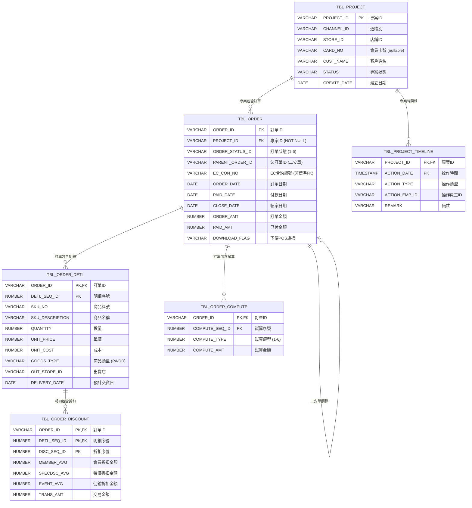
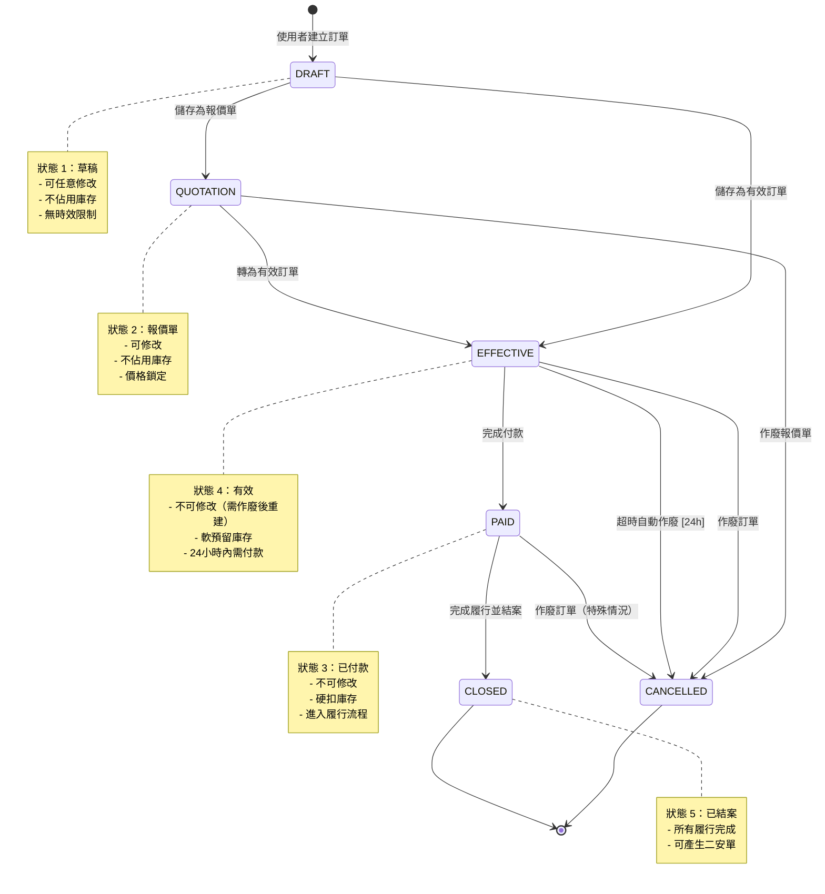
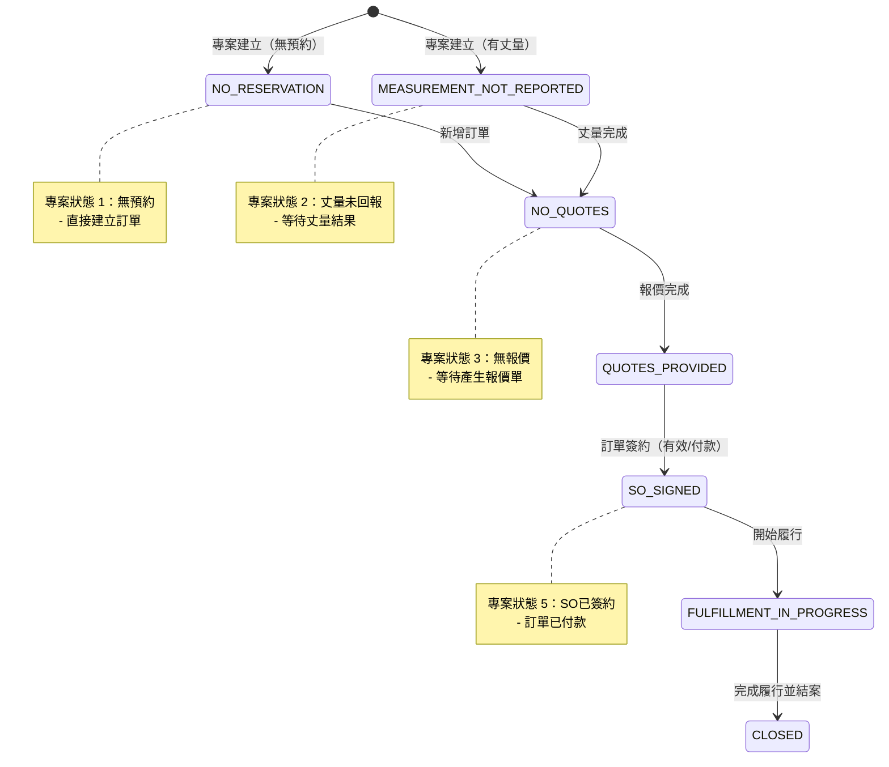
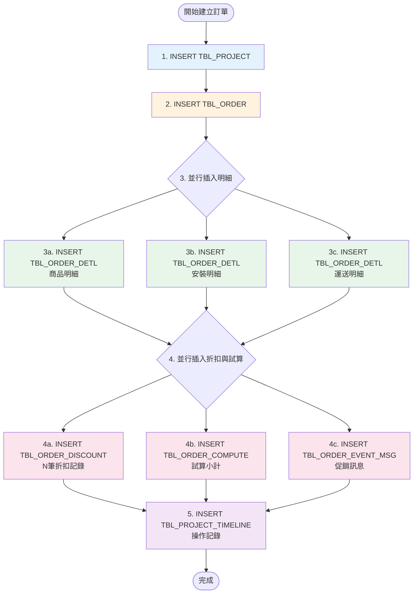

# Logical Schema: Order Creation Domain

## Overview

本文件記錄訂單創建業務領域的邏輯資料模型，補充 DDL 無法表達的隱含關係、生命週期約束與業務規則。訂單創建是 SOM 系統的核心流程，涵蓋從專案建立、訂單錄入、商品明細到價格計算的完整業務邏輯。

**涵蓋範圍**：
- TBL_PROJECT (專案主檔)
- TBL_ORDER (訂單主檔)
- TBL_ORDER_DETL (訂單明細)
- TBL_ORDER_DISCOUNT (訂單折扣)
- TBL_ORDER_COMPUTE (訂單試算)
- TBL_ORDER_EVENT_MSG (訂單事件訊息)
- TBL_PROJECT_TIMELINE (專案時間軸)

**參考規格**：
- `openspec/specs/order-creation/spec.md` - 訂單創建功能規格
- `openspec/specs/data-model/spec.md` - 資料庫 Schema 定義

---

## 1. 隱含外鍵關係（Implicit Foreign Keys）

以下關係在程式碼中實際使用，但未在資料庫層級定義為外鍵約束。

### 1.1 核心訂單關係

| 父表 | 子表 | JOIN 條件 | 基數 | 實施位置 | 說明 |
|------|------|-----------|------|----------|------|
| TBL_PROJECT | TBL_ORDER | PROJECT_ID | 1:N | BzSoServices.java:2085 | 一個專案可包含多張訂單（例如：原單、補單、二安單） |
| TBL_ORDER | TBL_ORDER_DETL | ORDER_ID | 1:N | BzOrderDetlServices.java | 一張訂單包含多筆商品明細 |
| TBL_ORDER_DETL | TBL_ORDER_DISCOUNT | ORDER_ID + DETL_SEQ_ID | 1:N | SoServices.java:3658 | 每筆明細可有多筆折扣記錄（會員折、促銷折扣等） |
| TBL_ORDER | TBL_ORDER_COMPUTE | ORDER_ID | 1:N | SoServices.java:3687 | 訂單試算明細（商品小計、安裝小計、運送小計等） |
| TBL_PROJECT | TBL_PROJECT_TIMELINE | PROJECT_ID | 1:N | SoServices.java:3709 | 專案操作時間軸記錄 |

### 1.2 自關聯關係（Self-Referential）

| 表 | 父欄位 | 子欄位 | 關係類型 | 說明 |
|---|--------|--------|----------|------|
| TBL_ORDER | ORDER_ID | PARENT_ORDER_ID | 1:N | 二安單（Reinstall）指向原訂單 |
| TBL_ORDER | ORDER_ID | EC_CON_NO | N:1 | EC 訂單通過合約編號關聯（文字欄位，非標準 FK） |

### 1.3 複合主鍵的重要性

TBL_ORDER_DETL 的複合主鍵 (ORDER_ID, DETL_SEQ_ID) 是訂單明細系統的核心聯接鍵：

```
TBL_ORDER (ORDER_ID)
    ↓ FK
TBL_ORDER_DETL (ORDER_ID, DETL_SEQ_ID)
    ↓ 複合FK
TBL_ORDER_DISCOUNT (ORDER_ID, DETL_SEQ_ID, DISC_SEQ_ID)
```

**重要**：所有與明細相關的子表都必須使用 ORDER_ID + DETL_SEQ_ID 聯接，單獨使用 ORDER_ID 會造成資料錯亂。

---

## 2. 實體關係圖（Entity Relationship Diagram）

### 2.1 核心訂單實體關係



### 2.2 訂單狀態值說明

| STATUS_ID | 狀態名稱 | 英文 | 說明 |
|-----------|---------|------|------|
| 1 | 草稿 | DRAFT | 訂單建立中，未儲存 |
| 2 | 報價單 | QUOTATION | 已儲存報價，可修改 |
| 3 | 已付款 | PAID | 已完成付款，進入履行流程 |
| 4 | 有效 | EFFECTIVE | 已確認訂單，等待付款 |
| 5 | 已結案 | CLOSED | 訂單完成並結案 |
| 6 | 已作廢 | CANCELLED | 訂單取消 |

---

## 3. 生命週期狀態機（Lifecycle State Machines）

### 3.1 訂單狀態轉換



### 3.2 專案狀態轉換



### 3.3 狀態轉換規則

| 從狀態 | 到狀態 | 條件 | 副作用 | 實施位置 |
|-------|-------|------|--------|----------|
| DRAFT | QUOTATION | 商品明細完整 | 鎖定價格 | BzSoServices.saveQuotation() |
| DRAFT/QUOTATION | EFFECTIVE | 所有必填欄位完整 + 庫存足夠 | 設定過期時間（24h）、軟預留庫存 | BzSoServices.saveValidSo() |
| EFFECTIVE | PAID | 完成付款（POS回傳） | 硬扣庫存、創建履行單據 | 外部 POS 系統 |
| EFFECTIVE | CANCELLED | 超過 EXPIRED_DATE | 釋放軟預留庫存、作廢優惠券 | CancelSoOrderNightRun (batch) |
| PAID | CLOSED | 所有履行單據完成 | 更新專案狀態 | BzSoServices.closeSo() |

---

## 4. 時間序約束（Temporal Constraints）

### 4.1 記錄創建時間序

以下約束定義了表記錄的創建順序，違反順序會導致資料不一致或業務邏輯錯誤。

| 規則 ID | 描述 | 實施位置 | 違反後果 |
|---------|------|----------|----------|
| **TC-001** | TBL_ORDER 必須在 TBL_PROJECT 之後創建 | BzSoServices.java:2080 | ORDER.PROJECT_ID FK 違反 |
| **TC-002** | TBL_ORDER_DETL 必須在 TBL_ORDER 之後創建 | BzOrderDetlServices.java | ORDER_DETL.ORDER_ID FK 違反 |
| **TC-003** | TBL_ORDER_DISCOUNT 必須在 TBL_ORDER_DETL 之後創建 | SoServices.java:3658 | 無法正確關聯明細 |
| **TC-004** | TBL_ORDER_COMPUTE 必須在所有 TBL_ORDER_DISCOUNT 之後創建 | SoServices.java:3687 | 試算金額錯誤 |
| **TC-005** | PAID_DATE 不能早於 ORDER_DATE | 業務邏輯檢查 | 邏輯錯誤 |
| **TC-006** | CLOSE_DATE 不能早於 PAID_DATE | 業務邏輯檢查 | 邏輯錯誤 |

### 4.2 訂單創建插入順序（嚴格依賴）



**代碼參考**：
```java
// SoServices.java:3808 - doCreateSOByCopy()
// 完整訂單創建流程

// 階段 1：創建專案
String projectId = bzSoServices.createProjectMast(soBO, loginUserInfoVO, ecFlag);

// 階段 2：創建訂單
String orderId = bzSoServices.createOrder(soBO, loginUserInfoVO, projectId, ecFlag);

// 階段 3：創建訂單明細（並行）
bzOrderDetlServices.createOrderDetlByGoodsSku(soBO, orderId);
bzOrderDetlServices.createOrderDetlByInstallSku(soBO, orderId);
bzOrderDetlServices.createOrderDetlByDeliverSku(soBO, orderId);

// 階段 4：創建折扣與試算（並行）
bzSoServices.createOrderDiscountData(soBO, orderId);
bzSoServices.createOrderCompute(soBO, orderId);
bzSoServices.createOrderEventMsg(soBO, orderId);

// 階段 5：創建時間軸記錄
bzSoServices.createProjectTimeline(projectId, "ORDER_CREATE", empId);
```

### 4.3 訂單有效期時間約束

| 約束 | 說明 | 配置位置 | 預設值 |
|------|------|----------|--------|
| 報價單有效期 | 報價單可保留時間 | TBL_PARM: QUOTATION_EXPIRE_DAYS | 90 天 |
| 有效訂單過期時間 | 有效訂單必須付款的時限 | TBL_PARM: EFFECTIVE_EXPIRE_HOURS | 24 小時 |
| 自動作廢檢查 | Batch job 檢查過期訂單頻率 | CancelSoOrderNightRun | 每日 02:00 |

**自動作廢邏輯**：
```sql
-- 查詢過期的有效訂單
SELECT ORDER_ID
FROM TBL_ORDER
WHERE ORDER_STATUS_ID = '4'
  AND EXPIRED_DATE < SYSDATE
  AND INVALID_FLAG != 'Y'
```

---

## 5. 條件關係（Conditional Relationships）

以下關係僅在特定條件下成立：

### 5.1 訂單類型條件關係

| 條件 | 關係 | 說明 |
|------|------|------|
| **GOODS_TYPE = 'P'** | TBL_ORDER_DETL 為商品明細 | 一般商品，需要庫存管理 |
| **GOODS_TYPE = 'I'** | TBL_ORDER_DETL 為安裝明細 | 安裝工種，關聯 TBL_INSTALLATION |
| **GOODS_TYPE = 'DD'** | TBL_ORDER_DETL 為運送明細 | 運送費用 |
| **PARENT_ORDER_ID != NULL** | TBL_ORDER 為二安單 | 關聯原訂單，共享 PROJECT_ID |
| **EC_CON_NO != NULL** | TBL_ORDER 為 EC 訂單 | 來自電商平台 |
| **CARD_NO != NULL** | TBL_ORDER 為會員訂單 | 可享會員折扣與優惠 |
| **NO_CARD_FLAG = 'Y'** | TBL_ORDER 為散客訂單 | 無會員折扣 |

### 5.2 商品明細特殊欄位條件

| 欄位 | 條件 | 用途 |
|------|------|------|
| **SPECIAL_SPEC** | 商品需要客製化 | 儲存特殊規格（max 4000 字元） |
| **CHG_PRICE** | 單價被人工調整 | 記錄調整後價格，需主管授權 |
| **PREORDER_FLAG = 'Y'** | 商品需要預訂 | 庫存不足時標示 |
| **DELIVERY_DATE** | 商品需要指定交期 | 預計交貨日期 |

### 5.3 折扣類型條件關係

| DISC_SEQ_ID | 折扣類型 | 條件 |
|-------------|---------|------|
| 1 | 會員折扣 (MEMBER_AVG) | CARD_NO != NULL |
| 2+ | 促銷折扣 (EVENT_AVG) | 符合 TBL_PROM_EVENT 條件 |
| N | 特價折扣 (SPECDSC_AVG) | 商品特價活動 |

---

## 6. 非標準聯接（Non-Standard Joins）

### 6.1 已刪除欄位的替代方案

**問題**：TBL_DOWNLOAD_POS_SKU 原使用 DISC_SEQ_ID 關聯 TBL_ORDER_DISCOUNT，但該欄位已刪除。

**解決方案**：改用 ORDER_ID + DETL_SEQ_ID 聯接

```java
// BzSoServices.java:5935-5937
// 原始邏輯（已失效）：
// TblDownloadPosSkuCriteria.andDiscSeqIdEqualTo(orderDiscount.getDiscSeqId());

// 現行邏輯：
TblDownloadPosSkuCriteria criteria = new TblDownloadPosSkuCriteria();
criteria.createCriteria()
    .andOrderIdEqualTo(orderDiscount.getOrderId())
    .andDetlSeqIdEqualTo(orderDiscount.getDetlSeqId());  // 使用複合鍵
```

**影響範圍**：
- 下傳 POS 流程（insertDownloadPos）
- 折扣金額計算（calculateDiscountAmount）
- 退貨處理（returnSkuHandling）

### 6.2 EC_CON_NO 非標準關聯

**TBL_ORDER.EC_CON_NO** 欄位儲存 EC 訂單合約編號，但不是標準外鍵：

```java
// EC 訂單查詢
TblOrderCriteria criteria = new TblOrderCriteria();
criteria.createCriteria()
    .andEcConNoEqualTo(ecContractNo);  // 文字欄位比對
List<TblOrder> orders = tblOrderMapper.selectByCriteria(criteria);
```

**特點**：
- VARCHAR 類型，非數字 ID
- 可能為 NULL（非 EC 訂單）
- 無 UNIQUE 約束（理論上應該唯一）
- 用於與 EC 系統對帳

### 6.3 DOWNLOAD_SEQ_ID 序號管理

**DOWNLOAD_SEQ_ID** 不是全域唯一，而是每張訂單獨立遞增：

```java
// BzSoServices.java:5979
// 計算該訂單的最大序號
Integer maxSeq = customDownloadPosMapper.selectMaxDownloadSeqId(orderId);
Integer downloadSeqId = (maxSeq == null) ? 1 : maxSeq + 1;
```

**資料結構**：
```
ORDER_ID     DOWNLOAD_SEQ_ID
SO001        1   ← 第一次下傳
SO001        2   ← 第二次下傳（補單）
SO002        1   ← 不同訂單，序號重新從 1 開始
SO002        2
```

---

## 7. 資料完整性約束（Data Integrity Constraints）

以下約束在應用層實施，但未在資料庫層級定義。

### 7.1 欄位值約束

| 規則 ID | 欄位 | 約束 | 實施位置 | 為何不在資料庫 |
|---------|------|------|----------|----------------|
| **DI-001** | ORDER_DETL.QUANTITY | > 0 | 前端驗證 | 歷史遺留，未加 CHECK 約束 |
| **DI-002** | ORDER_DETL.UNIT_PRICE | >= 0 | 前端驗證 | 允許零元商品（贈品） |
| **DI-003** | ORDER.ORDER_AMT | = SUM(ORDER_DETL) | 計算欄位 | 允許手動調整差異 |
| **DI-004** | ORDER.PAID_AMT | <= ORDER_AMT | 業務邏輯 | 允許部分付款（AR 帳戶） |

### 7.2 業務規則約束

| 規則 ID | 描述 | 實施位置 | 例外情況 |
|---------|------|----------|----------|
| **BR-001** | 報價單不可修改已付款訂單 | SoController | 主管授權可作廢重建 |
| **BR-002** | 有效訂單不可修改，需作廢後重建 | SoController | 特殊情況可修改地址 |
| **BR-003** | 草稿狀態不佔用庫存 | StockServices | 無例外 |
| **BR-004** | 有效訂單軟預留庫存（不扣除） | StockServices | Batch job 定期清理過期預留 |
| **BR-005** | 已付款訂單硬扣庫存（實際扣除） | StockServices | 退貨時反向操作 |

### 7.3 計算欄位約束

以下欄位由程式計算產生，但允許手動調整：

| 欄位 | 計算邏輯 | 允許調整 | 調整原因 |
|------|---------|---------|----------|
| ORDER.ORDER_AMT | SUM(ORDER_DETL.TOTAL_PRICE) | 是 | 尾差處理 |
| ORDER.DISCOUNT_AMT | SUM(ORDER_DISCOUNT.DISC_AMT) | 是 | 特殊折讓 |
| ORDER_COMPUTE.COMPUTE_AMT | 依 COMPUTE_TYPE 計算 | 是 | 手動調價 |
| ORDER_DETL.TOTAL_PRICE | QUANTITY × UNIT_PRICE | 否 | 自動計算 |

### 7.4 必填欄位但允許 NULL

以下欄位在業務邏輯上必填，但資料庫允許 NULL（歷史遺留）：

| 表 | 欄位 | 業務上必填 | 資料庫定義 | 驗證位置 |
|----|------|----------|-----------|----------|
| TBL_ORDER | CARD_NO | 否（散客可為 NULL） | NULL | 前端驗證 |
| TBL_ORDER | CONTACT_NAME | 是 | NULL | 前端驗證 |
| TBL_ORDER | CONTACT_PHONE | 是 | NULL | 前端驗證 |
| TBL_ORDER | SHIP_ADDR | 是 | NULL | 前端驗證 |
| TBL_ORDER_DETL | SPECIAL_SPEC | 否（一般商品可為 NULL） | NULL | 非必填 |

---

## 8. 程式碼位置參考

### 8.1 訂單創建核心方法

| 功能 | 檔案 | 行號 | 方法 |
|------|------|------|------|
| 創建專案 | BzSoServices.java | 2011 | createProjectMast() |
| 創建訂單 | BzSoServices.java | 2080 | createOrder() |
| 創建商品明細 | BzOrderDetlServices.java | 多個 | createOrderDetlByGoodsSku() |
| 創建安裝明細 | BzOrderDetlServices.java | 多個 | createOrderDetlByInstallSku() |
| 創建運送明細 | BzOrderDetlServices.java | 多個 | createOrderDetlByDeliverSku() |
| 創建折扣記錄 | BzSoServices.java | 2285 | createOrderDiscountData() |
| 創建試算記錄 | BzSoServices.java | 多個 | createOrderCompute() |
| 完整創建流程 | SoServices.java | 3808 | doCreateSOByCopy() |

### 8.2 訂單狀態轉換方法

| 狀態轉換 | 檔案 | 方法 |
|---------|------|------|
| 儲存草稿 → 報價單 | BzSoServices.java | saveQuotation() |
| 儲存報價單 → 有效 | BzSoServices.java | saveValidSo() |
| 有效 → 已付款 | 外部 POS 系統 | （回調觸發） |
| 有效 → 作廢（超時） | CancelSoOrderNightRun.java | doInvalidSO() |
| 已付款 → 結案 | BzSoServices.java | closeSo() |

### 8.3 重要 Mapper XML

| 功能 | 檔案 | 方法 |
|------|------|------|
| 查詢訂單明細（含折扣） | CustomOrderMapper.xml | selectOrderDetailWithDiscount |
| 計算訂單總額 | CustomOrderMapper.xml | selectOrderAmountSummary |
| 查詢過期有效訂單 | CustomOrderMapper.xml | selectExpiredEffectiveOrders |

---

## 9. 總結與建議

### 9.1 關鍵發現

1. **隱含關係廣泛**：多數表關係未定義 FK 約束，僅存在於程式碼中
2. **複合主鍵依賴**：ORDER_ID + DETL_SEQ_ID 是明細系統的核心，所有子表必須遵守
3. **時間序嚴格**：訂單創建有明確的插入順序依賴，違反會導致資料不一致
4. **狀態機複雜**：訂單與專案狀態機互相依賴，需同步更新
5. **欄位刪除遺留問題**：DISC_SEQ_ID 刪除後需使用替代方案聯接

### 9.2 重構建議（供 AI 重寫參考）

1. **新增外鍵約束**：
   ```sql
   ALTER TABLE TBL_ORDER
   ADD CONSTRAINT FK_ORDER_PROJECT
   FOREIGN KEY (PROJECT_ID) REFERENCES TBL_PROJECT(PROJECT_ID);

   ALTER TABLE TBL_ORDER_DETL
   ADD CONSTRAINT FK_ORDER_DETL_ORDER
   FOREIGN KEY (ORDER_ID) REFERENCES TBL_ORDER(ORDER_ID);
   ```

2. **新增 CHECK 約束**：
   ```sql
   ALTER TABLE TBL_ORDER_DETL
   ADD CONSTRAINT CHK_ORDER_DETL_QTY CHECK (QUANTITY > 0);

   ALTER TABLE TBL_ORDER
   ADD CONSTRAINT CHK_ORDER_STATUS CHECK (ORDER_STATUS_ID IN ('1','2','3','4','5','6'));
   ```

3. **時間序約束**：
   ```sql
   ALTER TABLE TBL_ORDER
   ADD CONSTRAINT CHK_ORDER_DATES CHECK (
       (PAID_DATE IS NULL OR PAID_DATE >= ORDER_DATE) AND
       (CLOSE_DATE IS NULL OR CLOSE_DATE >= PAID_DATE)
   );
   ```

4. **必填欄位約束**：
   ```sql
   ALTER TABLE TBL_ORDER
   MODIFY CONTACT_NAME VARCHAR2(200) NOT NULL;

   ALTER TABLE TBL_ORDER
   MODIFY CONTACT_PHONE VARCHAR2(50) NOT NULL;
   ```

### 9.3 資料遷移注意事項

重寫專案時的資料遷移策略：

1. **階段性遷移**：
   - 階段 1：遷移 TBL_PROJECT（檢查孤兒專案）
   - 階段 2：遷移 TBL_ORDER（檢查 PROJECT_ID 存在）
   - 階段 3：遷移 TBL_ORDER_DETL（檢查 ORDER_ID 存在）
   - 階段 4：遷移子表（折扣、試算等）

2. **資料清理**：
   ```sql
   -- 清理孤兒訂單（無專案）
   DELETE FROM TBL_ORDER WHERE PROJECT_ID NOT IN (SELECT PROJECT_ID FROM TBL_PROJECT);

   -- 清理孤兒明細（無訂單）
   DELETE FROM TBL_ORDER_DETL WHERE ORDER_ID NOT IN (SELECT ORDER_ID FROM TBL_ORDER);
   ```

3. **欄位補值**：
   ```sql
   -- 補充 NULL 的聯絡資訊
   UPDATE TBL_ORDER SET CONTACT_NAME = CUST_NAME WHERE CONTACT_NAME IS NULL;
   UPDATE TBL_ORDER SET CONTACT_PHONE = CUST_TEL WHERE CONTACT_PHONE IS NULL;
   ```

---

## 附錄：相關文件

- `logical-schema-payment-pos/spec.md` - 付款與 POS 整合邏輯 Schema
- `logical-schema-fulfillment/spec.md` - 履行流程邏輯 Schema
- `logical-schema-promotion-pricing/spec.md` - 優惠與定價邏輯 Schema
- `openspec/specs/order-creation/spec.md` - 訂單創建功能規格
- `openspec/specs/data-model/spec.md` - 完整資料庫 Schema

---

**文件版本**：1.0
**建立日期**：2025-12-17
**作者**：Claude Code
**目的**：補充 DDL 無法表達的邏輯關係與業務約束
