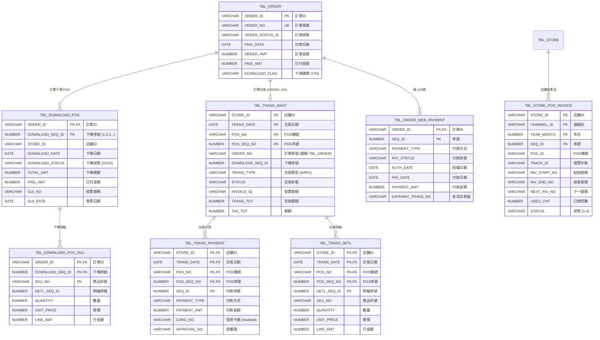

# Logical Schema: Payment & POS Integration Domain

## Overview

本文件記錄付款與 POS 整合業務領域的邏輯資料模型，補充 DDL 無法表達的隱含關係、生命週期約束與業務規則。付款流程是訂單從有效狀態轉為已付款的關鍵環節，涵蓋下傳 POS、收銀結帳、發票管理到交易記錄的完整業務邏輯。

**涵蓋範圍**：
- TBL_DOWNLOAD_POS (下傳 POS 主檔)
- TBL_DOWNLOAD_POS_SKU (下傳 POS 明細)
- TBL_TRANS_MAST (交易主檔)
- TBL_TRANS_PAYMENT (交易付款明細)
- TBL_TRANS_DETL (交易商品明細)
- TBL_STORE_POS_INVOICE (店舖 POS 發票)
- TBL_ORDER_WEB_PAYMENT (線上付款記錄)

**關鍵特性**：
- **時間序依賴**：付款必須在訂單有效之後，但在結案之前
- **非標準關聯**：使用 ORDER_NO 而非 ORDER_ID 進行部分關聯
- **外部系統整合**：POS 系統為主要的付款處理系統
- **狀態同步**：訂單狀態與交易狀態需保持一致

**參考規格**：
- `openspec/specs/order-payment/spec.md` - 訂單付款功能規格
- `openspec/specs/pos-integration/spec.md` - POS 整合規格
- `openspec/specs/data-model/spec.md` - 資料庫 Schema 定義

---

## 1. 隱含外鍵關係（Implicit Foreign Keys）

### 1.1 核心付款關係

| 父表 | 子表 | JOIN 條件 | 基數 | 實施位置 | 說明 |
|------|------|-----------|------|----------|------|
| TBL_ORDER | TBL_DOWNLOAD_POS | ORDER_ID | 1:N | BzSoServices.java:5969 | 一張訂單可多次下傳（補單、退貨） |
| TBL_DOWNLOAD_POS | TBL_DOWNLOAD_POS_SKU | ORDER_ID + DOWNLOAD_SEQ_ID | 1:N | BzSoServices.java:6001 | 下傳明細 |
| TBL_DOWNLOAD_POS | TBL_TRANS_MAST | **ORDER_NO** (非 ORDER_ID!) | 1:1 | POS 系統 | **重要：使用 ORDER_NO 關聯** |
| TBL_TRANS_MAST | TBL_TRANS_PAYMENT | TRANS_NO (複合 PK) | 1:N | POS 系統 | 交易付款方式 |
| TBL_TRANS_MAST | TBL_TRANS_DETL | TRANS_NO (複合 PK) | 1:N | POS 系統 | 交易明細 |
| TBL_STORE | TBL_STORE_POS_INVOICE | STORE_ID | 1:N | InvoiceServices.java | 店舖發票號碼池 |

### 1.2 非標準關聯：ORDER_NO vs ORDER_ID

**重要發現**：TBL_TRANS_MAST 使用 ORDER_NO 而非 ORDER_ID 與訂單關聯

| 欄位 | 表 | 資料類型 | 用途 |
|------|---|---------|------|
| **ORDER_ID** | TBL_ORDER | VARCHAR2(20) | 系統內部訂單 ID（主鍵） |
| **ORDER_NO** | TBL_ORDER | VARCHAR2(20) | 訂單單號（顯示給使用者） |
| **ORDER_ID** | TBL_DOWNLOAD_POS | VARCHAR2(20) | 關聯 TBL_ORDER.ORDER_ID |
| **ORDER_NO** | TBL_TRANS_MAST | VARCHAR2(20) | **關聯 TBL_ORDER.ORDER_NO**（非標準） |

**關聯邏輯**：
```sql
-- 正確的關聯方式
SELECT o.ORDER_ID, o.ORDER_NO, d.DOWNLOAD_SEQ_ID, t.TRANS_NO
FROM TBL_ORDER o
INNER JOIN TBL_DOWNLOAD_POS d ON o.ORDER_ID = d.ORDER_ID
LEFT JOIN TBL_TRANS_MAST t ON o.ORDER_NO = t.ORDER_NO  -- 使用 ORDER_NO！
WHERE o.ORDER_ID = 'SO2025010001';
```

**為何如此設計**：
- POS 系統獨立運作，不認識 SOM 的 ORDER_ID
- ORDER_NO 是印在單據上的訂單號碼，收銀人員輸入此號碼
- ORDER_ID 與 ORDER_NO 不一定相同（歷史遺留）

### 1.3 複合主鍵的複雜性

TBL_TRANS_MAST 的主鍵為 (STORE_ID, TRANS_DATE, POS_NO, POS_SEQ_NO)，而非單一 ID：

```
TBL_TRANS_MAST
  PK: STORE_ID + TRANS_DATE + POS_NO + POS_SEQ_NO
  ↓
TBL_TRANS_PAYMENT
  PK: STORE_ID + TRANS_DATE + POS_NO + POS_SEQ_NO + SEQ_ID
  ↓
TBL_TRANS_DETL
  PK: STORE_ID + TRANS_DATE + POS_NO + POS_SEQ_NO + DETL_SEQ_ID
```

**影響**：
- 所有子表必須包含完整的 4 個欄位
- JOIN 查詢複雜度高
- 效能考量：需要複合索引

---

## 2. 實體關係圖（Entity Relationship Diagram）

### 2.1 付款與 POS 整合實體關係



### 2.2 下傳狀態值說明

| DOWNLOAD_STATUS | 狀態名稱 | 說明 |
|-----------------|---------|------|
| 01 | 已下傳 | 已產生 DOWNLOAD_POS 記錄，等待收銀 |
| 02 | 已付款 | POS 系統回傳付款完成 |

### 2.3 交易類型說明

| TRANS_TYPE | 類型名稱 | 說明 |
|------------|---------|------|
| N | 正常銷售 | 一般訂單付款 |
| R | 退貨 | 退貨交易 |
| V | 作廢 | 交易作廢 |

---

## 3. 生命週期狀態機（Lifecycle State Machines）

### 3.1 付款流程狀態轉換


### 3.2 線上付款流程（Web Payment）


### 3.3 發票號碼分配狀態


---

## 4. 時間序約束（Temporal Constraints）

### 4.1 付款流程時間序

| 規則 ID | 描述 | 實施位置 | 違反後果 |
|---------|------|----------|----------|
| **TC-P01** | TBL_DOWNLOAD_POS 必須在 TBL_ORDER 狀態為 EFFECTIVE 後創建 | BzSoServices.java:5969 | 業務邏輯錯誤 |
| **TC-P02** | TBL_TRANS_MAST 必須在 TBL_DOWNLOAD_POS 創建後產生 | POS 系統 | 無法關聯交易 |
| **TC-P03** | ORDER.PAID_DATE 必須在 DOWNLOAD_POS.DOWNLOAD_DATE 之後 | 業務邏輯 | 時間序錯誤 |
| **TC-P04** | TRANS_MAST.TRANS_DATE 必須等於或晚於 ORDER.ORDER_DATE | POS 系統 | 邏輯錯誤 |
| **TC-P05** | 發票號碼 (INVOICE_ID) 必須從 TBL_STORE_POS_INVOICE 池中分配 | InvoiceServices.java | 發票號碼衝突 |

### 4.2 下傳至 POS 流程時間序


**關鍵時間點**：
1. **T1 (下傳時間)**：DOWNLOAD_POS.DOWNLOAD_DATE
2. **T2 (付款時間)**：TRANS_MAST.TRANS_DATE
3. **T3 (訂單付款時間)**：ORDER.PAID_DATE

**時間序約束**：T1 < T2 <= T3

### 4.3 發票號碼分配時間序

```sql
-- 發票號碼分配邏輯
SELECT NEXT_INV_NO
FROM TBL_STORE_POS_INVOICE
WHERE STORE_ID = :storeId
  AND CHANNEL_ID = :channelId
  AND STATUS = '2'  -- 使用中
  AND NEXT_INV_NO <= INV_END_NO
FOR UPDATE;  -- 鎖定記錄

-- 更新下一號碼
UPDATE TBL_STORE_POS_INVOICE
SET NEXT_INV_NO = :nextInvNo + 1,
    USED_CNT = USED_CNT + 1,
    FREE_CNT = FREE_CNT - 1,
    UPDATE_DATE = SYSDATE
WHERE STORE_ID = :storeId
  AND CHANNEL_ID = :channelId;
```

**併發控制**：使用 `FOR UPDATE` 防止發票號碼重複分配

---

## 5. 條件關係（Conditional Relationships）

### 5.1 下傳 POS 條件

| 條件 | 關係 | 說明 |
|------|------|------|
| **ORDER_STATUS_ID IN ('2','4')** | 可下傳 POS | 報價單或有效訂單 |
| **DOWNLOAD_FLAG = 'N'** | 未下傳 | 避免重複下傳 |
| **發票號碼可用** | TBL_STORE_POS_INVOICE.STATUS = '2' | 店舖有可用發票 |
| **所有明細有出貨店** | ORDER_DETL.OUT_STORE_ID != NULL | 確保可履行 |

### 5.2 付款方式條件

| PAYMENT_TYPE | 條件 | 額外欄位 |
|--------------|------|----------|
| **CASH** | 現金付款 | CHANGE_AMT (找零) |
| **CREDIT_CARD** | 信用卡 | CARD_NO, APPROVAL_NO, BANK_CODE |
| **INSTALLMENT** | 分期付款 | INSTALLMENT_MONTHS, BANK_CODE |
| **TRANSFER** | 銀行轉帳 | BANK_CODE, ACCOUNT_NO |
| **AR_ACCOUNT** | 應收帳款 | CUSTOMER_ID (CASA/DIAMOND 專用) |

### 5.3 線上付款條件

| PAY_STATUS | 條件 | 下一步 |
|------------|------|--------|
| **X** (未授權) | 付款頁面已產生 | 等待客戶付款 |
| **A** (已授權) | 金流授權成功 | 等待請款 |
| **Y** (已付款) | 請款成功 | 更新訂單為已付款 |
| **R** (已退款) | 退款完成 | 訂單作廢或部分退款 |
| **C** (已取消) | 取消付款 | 訂單維持 EFFECTIVE |

---

## 6. 非標準聯接（Non-Standard Joins）

### 6.1 ORDER_NO 關聯的挑戰

**問題**：TBL_TRANS_MAST 使用 ORDER_NO 而非 ORDER_ID

**範例查詢（正確）**：
```sql
-- 查詢訂單及其交易記錄
SELECT o.ORDER_ID, o.ORDER_NO, o.ORDER_STATUS_ID,
       d.DOWNLOAD_SEQ_ID, d.DOWNLOAD_STATUS,
       t.TRANS_DATE, t.TRANS_NO, t.TRANS_TOT
FROM TBL_ORDER o
LEFT JOIN TBL_DOWNLOAD_POS d
    ON o.ORDER_ID = d.ORDER_ID
LEFT JOIN TBL_TRANS_MAST t
    ON o.ORDER_NO = t.ORDER_NO  -- 使用 ORDER_NO！
   AND d.DOWNLOAD_SEQ_ID = t.DOWNLOAD_SEQ_ID
WHERE o.ORDER_ID = 'SO2025010001';
```

**範例查詢（錯誤）**：
```sql
-- 錯誤！無法使用 ORDER_ID 關聯
SELECT o.ORDER_ID, t.TRANS_NO
FROM TBL_ORDER o
LEFT JOIN TBL_TRANS_MAST t
    ON o.ORDER_ID = t.ORDER_ID  -- 錯誤！TRANS_MAST 沒有 ORDER_ID
WHERE o.ORDER_ID = 'SO2025010001';
```

### 6.2 DOWNLOAD_SEQ_ID 的非標準用法

**問題**：DOWNLOAD_SEQ_ID 不是全域唯一，而是每張訂單獨立遞增

```
ORDER_ID     DOWNLOAD_SEQ_ID
SO001        1
SO001        2   ← 補單
SO002        1   ← 不同訂單，序號重新從 1 開始
```

**正確關聯方式**：
```sql
-- 必須同時使用 ORDER_ID + DOWNLOAD_SEQ_ID
SELECT *
FROM TBL_DOWNLOAD_POS d
INNER JOIN TBL_DOWNLOAD_POS_SKU s
    ON d.ORDER_ID = s.ORDER_ID
   AND d.DOWNLOAD_SEQ_ID = s.DOWNLOAD_SEQ_ID;
```

### 6.3 複合主鍵的 JOIN 效能

**TBL_TRANS_MAST 複合主鍵 JOIN**：
```sql
-- 效能較差（完整複合鍵 JOIN）
SELECT *
FROM TBL_TRANS_MAST t
INNER JOIN TBL_TRANS_PAYMENT p
    ON t.STORE_ID = p.STORE_ID
   AND t.TRANS_DATE = p.TRANS_DATE
   AND t.POS_NO = p.POS_NO
   AND t.POS_SEQ_NO = p.POS_SEQ_NO;
```

**建議**：新系統使用單一 TRANS_ID 作為主鍵

---

## 7. 資料完整性約束（Data Integrity Constraints）

### 7.1 付款金額約束

| 規則 ID | 欄位 | 約束 | 實施位置 | 為何不在資料庫 |
|---------|------|------|----------|----------------|
| **DI-P01** | DOWNLOAD_POS.PAID_AMT | <= TOTAL_AMT | 業務邏輯 | 允許部分付款 |
| **DI-P02** | ORDER.PAID_AMT | = SUM(TRANS_PAYMENT.AMT) | 業務邏輯 | 計算欄位 |
| **DI-P03** | TRANS_MAST.TRANS_TOT | = SUM(TRANS_DETL.LINE_AMT) | 業務邏輯 | 允許尾差調整 |
| **DI-P04** | DOWNLOAD_POS.TOTAL_AMT | = SUM(DOWNLOAD_POS_SKU.LINE_AMT) | 業務邏輯 | 計算欄位 |

### 7.2 發票號碼約束

| 規則 ID | 描述 | 實施位置 | 為何不在資料庫 |
|---------|------|----------|----------------|
| **DI-P05** | NEXT_INV_NO 在 INV_START_NO 與 INV_END_NO 之間 | InvoiceServices.java | 動態範圍檢查 |
| **DI-P06** | USED_CNT + FREE_CNT = TOTAL_CNT | InvoiceServices.java | 計算欄位 |
| **DI-P07** | 發票號碼不可重複分配 | FOR UPDATE 鎖定 | 併發控制 |

### 7.3 狀態一致性約束

| 規則 ID | 描述 | 實施位置 |
|---------|------|----------|
| **DI-P08** | ORDER_STATUS_ID = '3' 時，必須存在 TBL_TRANS_MAST | 業務邏輯檢查 |
| **DI-P09** | DOWNLOAD_STATUS = '02' 時，TRANS_MAST.STATUS 必須為 '01' (正常) | 業務邏輯檢查 |
| **DI-P10** | ORDER.PAID_AMT > 0 時，ORDER_STATUS_ID 必須 >= '3' | 業務邏輯檢查 |

---

## 8. 程式碼位置參考

### 8.1 下傳 POS 核心方法

| 功能 | 檔案 | 行號 | 方法 |
|------|------|------|------|
| 下傳 POS（Web 訂單） | BzSoServices.java | 5612 | createDownloadPosByWeb() |
| 下傳 POS（EC 訂單） | BzSoServices.java | 5660 | createDownloadPosByEC() |
| 插入 DOWNLOAD_POS | BzSoServices.java | 5969 | insertDownloadPos() |
| 創建 DOWNLOAD_POS_SKU | BzSoServices.java | 6001 | createDownloadPosSku() |
| 檢查下傳條件 | BzSoServices.java | 5630 | validateDownloadConditions() |

### 8.2 付款處理方法

| 功能 | 檔案 | 方法 |
|------|------|------|
| 更新訂單為已付款 | BzSoServices.java | updateOrderPaidStatus() |
| 創建交易記錄 | POS 系統 | （外部系統） |
| 付款完成回調 | PaymentCallbackController.java | handlePaymentCallback() |

### 8.3 發票管理方法

| 功能 | 檔案 | 方法 |
|------|------|------|
| 分配發票號碼 | InvoiceServices.java | allocateInvoiceNumber() |
| 檢查發票可用 | InvoiceServices.java | checkInvoiceAvailability() |
| 更新發票使用狀態 | InvoiceServices.java | updateInvoiceUsage() |

---

## 9. POS 系統整合細節

### 9.1 POS 系統資料流


### 9.2 POS 回調機制

**回調 API**：
```
POST /api/payment/callback
Content-Type: application/json

{
  "orderNo": "SO2025010001",
  "transNo": "20250101-001-001",
  "transDate": "2025-01-01",
  "transTot": 10000.00,
  "invoiceNo": "AB12345678",
  "paymentMethods": [
    {
      "paymentType": "CREDIT_CARD",
      "paymentAmt": 10000.00,
      "cardNo": "****1234",
      "approvalNo": "123456"
    }
  ]
}
```

**SOM 系統處理流程**：
1. 驗證 ORDER_NO 存在
2. 驗證金額正確
3. 創建或更新 TBL_TRANS_MAST
4. 創建 TBL_TRANS_PAYMENT
5. 更新 TBL_ORDER.ORDER_STATUS_ID = '3'
6. 更新 TBL_ORDER.PAID_DATE = SYSDATE
7. 更新 TBL_DOWNLOAD_POS.DOWNLOAD_STATUS = '02'
8. 觸發履行流程（安運單派工、領貨通知）

---

## 10. 總結與建議

### 10.1 關鍵發現

1. **非標準關聯**：ORDER_NO 而非 ORDER_ID 用於 POS 整合，增加複雜度
2. **複合主鍵**：TRANS_MAST 使用 4 個欄位的複合主鍵，效能與維護性差
3. **時間序嚴格**：付款流程有明確的時間序依賴，違反會導致狀態不一致
4. **外部系統依賴**：POS 系統為獨立系統，資料同步需要回調機制
5. **併發控制**：發票號碼分配需使用資料庫鎖定機制

### 10.2 重構建議（供 AI 重寫參考）

1. **統一主鍵設計**：
   ```sql
   -- 新增單一交易 ID
   ALTER TABLE TBL_TRANS_MAST
   ADD COLUMN TRANS_ID VARCHAR2(20) NOT NULL;

   -- 設為主鍵
   ALTER TABLE TBL_TRANS_MAST
   DROP CONSTRAINT PK_TRANS_MAST;

   ALTER TABLE TBL_TRANS_MAST
   ADD CONSTRAINT PK_TRANS_MAST PRIMARY KEY (TRANS_ID);

   -- 保留原複合鍵作為唯一約束
   ALTER TABLE TBL_TRANS_MAST
   ADD CONSTRAINT UK_TRANS_MAST_COMPOSITE
   UNIQUE (STORE_ID, TRANS_DATE, POS_NO, POS_SEQ_NO);
   ```

2. **統一關聯欄位**：
   ```sql
   -- 在 TRANS_MAST 新增 ORDER_ID
   ALTER TABLE TBL_TRANS_MAST
   ADD COLUMN ORDER_ID VARCHAR2(20);

   -- 新增外鍵約束
   ALTER TABLE TBL_TRANS_MAST
   ADD CONSTRAINT FK_TRANS_MAST_ORDER
   FOREIGN KEY (ORDER_ID) REFERENCES TBL_ORDER(ORDER_ID);

   -- 保留 ORDER_NO 作為顯示欄位
   ```

3. **新增狀態一致性檢查**：
   ```sql
   -- 檢查已付款訂單必須有交易記錄
   CREATE OR REPLACE TRIGGER TRG_ORDER_PAID_CHECK
   BEFORE UPDATE OF ORDER_STATUS_ID ON TBL_ORDER
   FOR EACH ROW
   WHEN (NEW.ORDER_STATUS_ID = '3' AND OLD.ORDER_STATUS_ID != '3')
   BEGIN
     IF NOT EXISTS (
       SELECT 1 FROM TBL_TRANS_MAST
       WHERE ORDER_NO = :NEW.ORDER_NO
         AND STATUS = '01'
     ) THEN
       RAISE_APPLICATION_ERROR(-20001, '訂單無有效交易記錄，無法標記為已付款');
     END IF;
   END;
   ```

4. **發票號碼樂觀鎖定**：
   ```sql
   -- 新增版本號欄位
   ALTER TABLE TBL_STORE_POS_INVOICE
   ADD COLUMN VERSION NUMBER DEFAULT 0;

   -- 使用樂觀鎖定替代 FOR UPDATE
   UPDATE TBL_STORE_POS_INVOICE
   SET NEXT_INV_NO = :nextInvNo + 1,
       USED_CNT = USED_CNT + 1,
       VERSION = VERSION + 1
   WHERE STORE_ID = :storeId
     AND CHANNEL_ID = :channelId
     AND VERSION = :expectedVersion;
   -- 檢查 affected rows = 1，否則重試
   ```

### 10.3 資料遷移注意事項

1. **ORDER_NO 清理**：
   ```sql
   -- 確保 ORDER_NO 不為 NULL
   UPDATE TBL_ORDER SET ORDER_NO = ORDER_ID WHERE ORDER_NO IS NULL;

   -- 確保 ORDER_NO 唯一
   SELECT ORDER_NO, COUNT(*)
   FROM TBL_ORDER
   GROUP BY ORDER_NO
   HAVING COUNT(*) > 1;
   ```

2. **交易記錄關聯**：
   ```sql
   -- 補充 TRANS_MAST.ORDER_ID
   UPDATE TBL_TRANS_MAST t
   SET ORDER_ID = (
     SELECT ORDER_ID FROM TBL_ORDER
     WHERE ORDER_NO = t.ORDER_NO
   )
   WHERE ORDER_ID IS NULL;
   ```

3. **發票號碼驗證**：
   ```sql
   -- 檢查發票號碼衝突
   SELECT INVOICE_ID, COUNT(*)
   FROM TBL_TRANS_MAST
   WHERE INVOICE_ID IS NOT NULL
   GROUP BY INVOICE_ID
   HAVING COUNT(*) > 1;
   ```

---

## 附錄：相關文件

- `logical-schema-order-creation/spec.md` - 訂單創建邏輯 Schema
- `logical-schema-fulfillment/spec.md` - 履行流程邏輯 Schema
- `logical-schema-promotion-pricing/spec.md` - 優惠與定價邏輯 Schema
- `openspec/specs/order-payment/spec.md` - 訂單付款功能規格
- `openspec/specs/pos-integration/spec.md` - POS 整合規格

---

**文件版本**：1.0
**建立日期**：2025-12-17
**作者**：Claude Code
**目的**：補充 DDL 無法表達的付款與 POS 整合邏輯關係與業務約束
