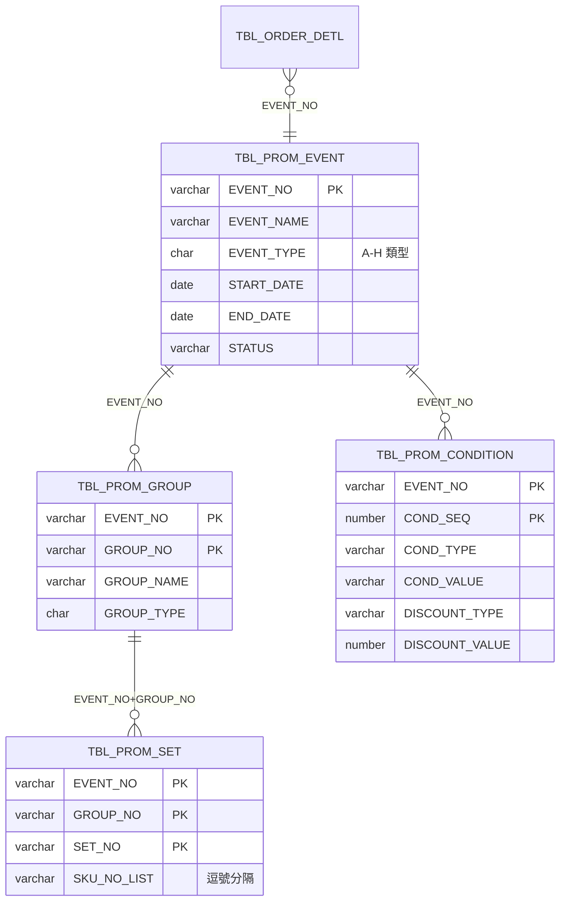
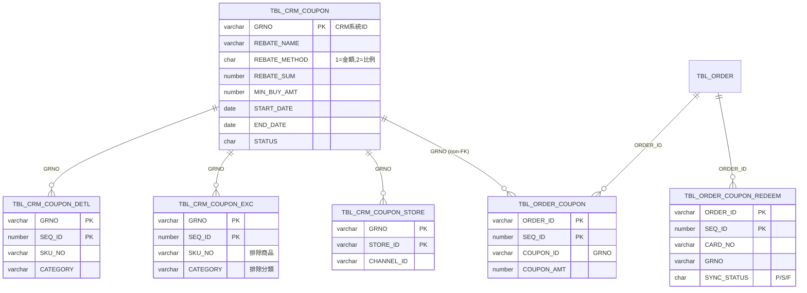
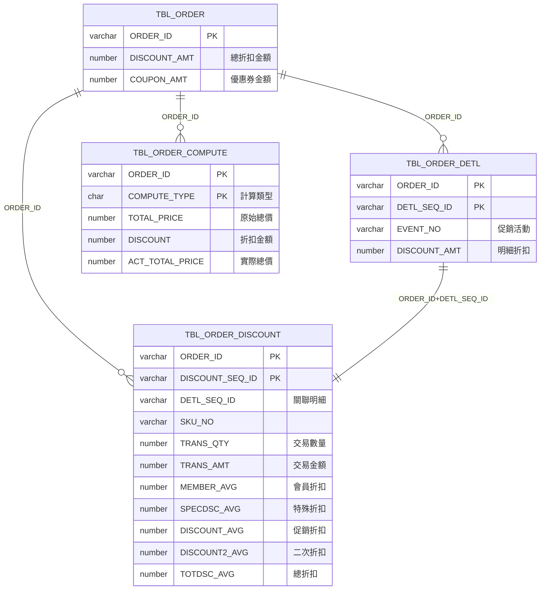
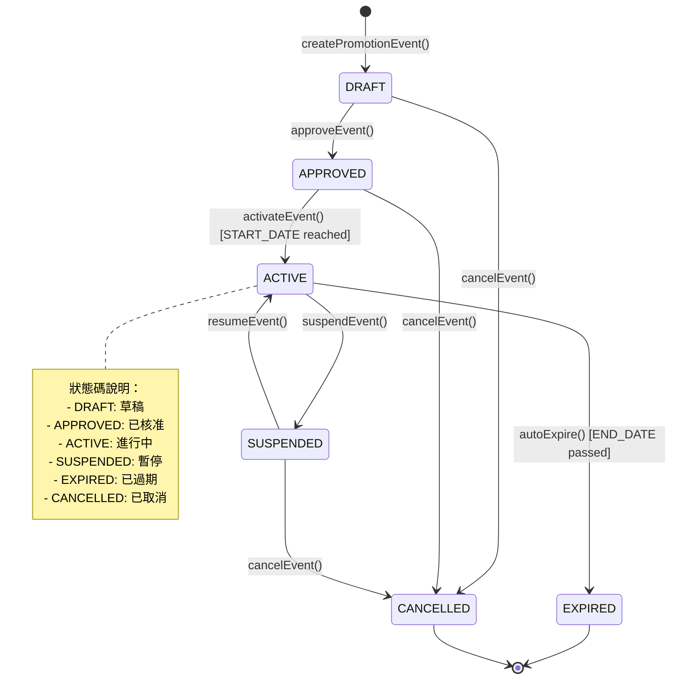
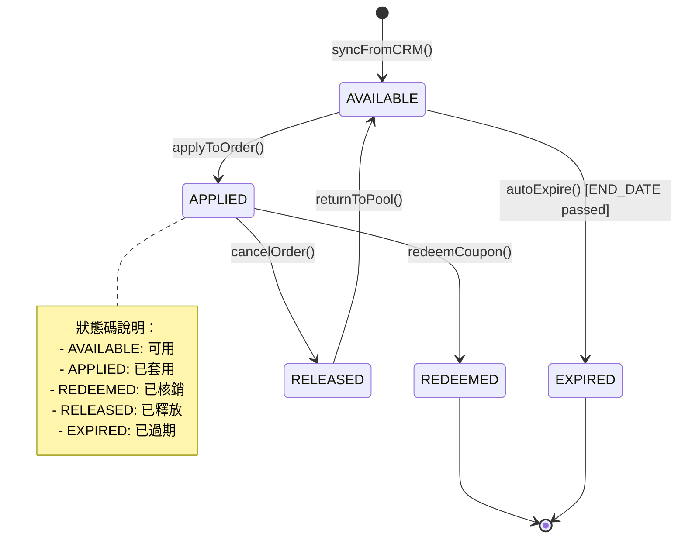
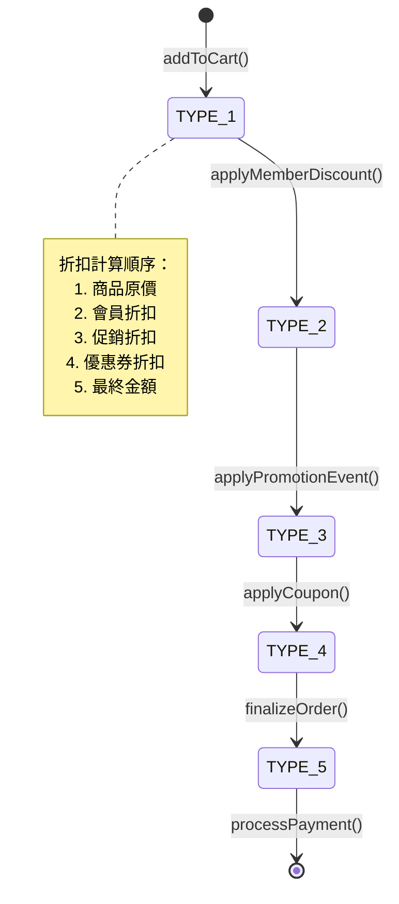
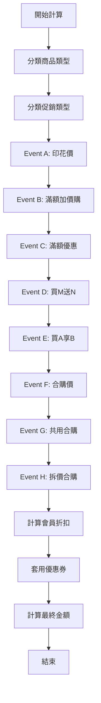

# Logical Schema: Promotion & Pricing

## 文件概述

本文件記錄 SOM 系統中**優惠與定價**領域的邏輯 Schema，補充 DDL 無法表達的業務規則約束。涵蓋促銷活動（Event A-H）、CRM 優惠券、會員折扣、訂單折扣計算等業務邏輯。

**範圍**：
- 促銷活動管理（TBL_PROM_EVENT, TBL_PROM_GROUP, TBL_PROM_SET, TBL_PROM_CONDITION）
- CRM 優惠券（TBL_CRM_COUPON, TBL_CRM_COUPON_DETL, TBL_CRM_COUPON_EXC, TBL_CRM_COUPON_STORE）
- 訂單優惠券（TBL_ORDER_COUPON, TBL_ORDER_COUPON_REDEEM）
- 會員折扣（TBL_MEMBER_DISCOUNT）
- 訂單折扣計算（TBL_ORDER_DISCOUNT, TBL_ORDER_COMPUTE）

**為何需要本文件**：
1. 促銷規則的複雜性無法用外鍵表達（例如：Event A-H 的計算邏輯）
2. 折扣計算順序的時間序約束（會員折扣 → 促銷折扣 → 優惠券）
3. 條件關係（優惠券適用範圍、最低購買金額）
4. 多態關係（COMPUTE_TYPE 區分不同計算類型）

---

## 1. 隱含外鍵關係（Implicit Foreign Keys）

以下關係在程式碼中強制執行，但資料庫中**未定義 FK 約束**。

| 父表 | 子表 | JOIN 條件 | 基數 | 實施位置 | 說明 |
|------|------|-----------|------|----------|------|
| TBL_PROM_EVENT | TBL_PROM_GROUP | EVENT_NO | 1:N | SoEventBase.java:42 | 一個促銷活動包含多個商品群組 |
| TBL_PROM_GROUP | TBL_PROM_SET | EVENT_NO + GROUP_NO | 1:N | SoEventF.java:150 | 一個商品群組包含多個 SKU 集合 |
| TBL_PROM_EVENT | TBL_PROM_CONDITION | EVENT_NO | 1:N | SoEventC.java:120 | 一個促銷活動包含多個條件規則 |
| TBL_CRM_COUPON | TBL_CRM_COUPON_DETL | GRNO | 1:N | BzSoServices.java:3250 | 一個優惠券包含多個適用商品 |
| TBL_CRM_COUPON | TBL_CRM_COUPON_EXC | GRNO | 1:N | BzSoServices.java:3260 | 一個優惠券包含多個排除商品 |
| TBL_CRM_COUPON | TBL_CRM_COUPON_STORE | GRNO | 1:N | BzSoServices.java:3270 | 一個優惠券包含多個適用門市 |
| TBL_ORDER | TBL_ORDER_COUPON | ORDER_ID | 1:N | BzSoServices.java:4500 | 一張訂單可套用多張優惠券 |
| TBL_ORDER | TBL_ORDER_COUPON_REDEEM | ORDER_ID | 1:N | BzSoServices.java:4550 | 一張訂單可有多筆優惠券核銷記錄 |
| TBL_ORDER | TBL_ORDER_DISCOUNT | ORDER_ID | 1:N | BzSoServices.java:5100 | 一張訂單包含多筆明細折扣 |
| TBL_ORDER | TBL_ORDER_COMPUTE | ORDER_ID | 1:N | BzSoServices.java:5200 | 一張訂單包含多種計算類型 |
| TBL_ORDER_DETL | TBL_ORDER_DISCOUNT | ORDER_ID + DETL_SEQ_ID | 1:1 | BzSoServices.java:5150 | 一筆訂單明細對應一筆折扣計算 |

**注意事項**：
- `TBL_ORDER_DISCOUNT.DETL_SEQ_ID` 關聯到 `TBL_ORDER_DETL.DETL_SEQ_ID`（非主鍵）
- `TBL_CRM_COUPON.GRNO` 來自 CRM 系統，非 SOM 系統生成

---

## 2. 實體關聯圖（Entity Relationships）

### 2.1 促銷活動結構（Promotion Event Structure）



### 2.2 CRM 優惠券結構（CRM Coupon Structure）



### 2.3 訂單折扣計算結構（Order Discount Calculation）



---

## 3. 生命週期狀態機（Entity Lifecycle State Machines）

### 3.1 促銷活動狀態（TBL_PROM_EVENT.STATUS）



**狀態轉換規則**：
1. 促銷活動創建時為 DRAFT 狀態
2. 只有 APPROVED 狀態可進入 ACTIVE
3. ACTIVE 狀態需滿足：當前日期 >= START_DATE
4. EXPIRED 狀態自動產生：當前日期 > END_DATE
5. SUSPENDED 狀態可暫停促銷（手動操作）

### 3.2 CRM 優惠券狀態（TBL_CRM_COUPON.STATUS）



**核銷流程**（TBL_ORDER_COUPON_REDEEM）：
- `SYNC_STATUS = 'P'`（Pending）：待同步至 CRM
- `SYNC_STATUS = 'S'`（Success）：同步成功
- `SYNC_STATUS = 'F'`（Failed）：同步失敗，需重試

### 3.3 折扣計算狀態（TBL_ORDER_COMPUTE.COMPUTE_TYPE）

**COMPUTE_TYPE 說明**（多態關係）：

| COMPUTE_TYPE | 說明 | 計算時機 |
|--------------|------|----------|
| '1' | 原始商品總價 | 加入購物車後 |
| '2' | 會員折扣後總價 | 套用會員卡後 |
| '3' | 促銷折扣後總價 | 套用促銷活動後 |
| '4' | 優惠券折扣後總價 | 套用優惠券後 |
| '5' | 最終應付金額 | 結帳前確認 |



---

## 4. 時間序約束（Temporal Constraints）

| 規則 ID | 描述 | 實施位置 | 違反後果 |
|---------|------|----------|----------|
| TC-PROM-001 | TBL_PROM_EVENT 必須在 START_DATE 之後才能 ACTIVE | SoComputeFunctionMain.java:150 | 促銷無效，不計算折扣 |
| TC-PROM-002 | TBL_PROM_EVENT.END_DATE 必須 >= START_DATE | ConfigServices.java:500 | 無法儲存促銷活動 |
| TC-COUP-001 | TBL_CRM_COUPON 只能在有效期內使用 | BzSoServices.java:3300 | 優惠券失效 |
| TC-COUP-002 | TBL_ORDER_COUPON 必須在訂單 EFFECTIVE 後記錄 | BzSoServices.java:4500 | 資料不一致 |
| TC-DISC-001 | TBL_ORDER_DISCOUNT 必須在 TBL_ORDER_DETL 之後插入 | BzSoServices.java:5100 | 外鍵違反（隱含） |
| TC-DISC-002 | TBL_ORDER_COMPUTE.TYPE='2' 必須在 TYPE='1' 之後 | SoComputeFunctionMain.java:200 | 計算錯誤 |
| TC-DISC-003 | 會員折扣計算必須在促銷折扣之前 | SoFunctionMemberDisServices.java:80 | 折扣順序錯誤 |
| TC-REDEEM-001 | TBL_ORDER_COUPON_REDEEM 必須在訂單 PAID 後同步 | BzSoServices.java:4550 | CRM 同步失敗 |

**時間序違反範例**：

```java
// ❌ 錯誤：優惠券過期仍然套用
if (coupon.getEndDate().before(new Date())) {
    // 應該拋出異常，但程式碼允許繼續
    applyExpiredCoupon(coupon);
}

// ✅ 正確：檢查優惠券有效期
if (coupon.getEndDate().before(new Date())) {
    throw new BusinessException("優惠券已過期");
}
```

---

## 5. 條件關係（Conditional Relationships）

以下關係僅在特定條件下成立。

### 5.1 CRM 優惠券適用條件

| 條件類型 | 條件 | 關係 | 實施位置 |
|---------|------|------|----------|
| 金額門檻 | ORDER_AMT >= MIN_BUY_AMT | TBL_ORDER → TBL_ORDER_COUPON | BzSoServices.java:3350 |
| 商品限定 | SKU_NO IN (SELECT SKU_NO FROM TBL_CRM_COUPON_DETL) | TBL_ORDER_DETL → TBL_CRM_COUPON | BzSoServices.java:3360 |
| 商品排除 | SKU_NO NOT IN (SELECT SKU_NO FROM TBL_CRM_COUPON_EXC) | TBL_ORDER_DETL → TBL_CRM_COUPON | BzSoServices.java:3370 |
| 門市限定 | STORE_ID IN (SELECT STORE_ID FROM TBL_CRM_COUPON_STORE) | TBL_ORDER → TBL_CRM_COUPON | BzSoServices.java:3380 |
| 會員限定 | CARD_NO IS NOT NULL | TBL_ORDER → TBL_ORDER_COUPON | BzSoServices.java:3390 |

**複合條件範例**：

```sql
-- CRM 優惠券適用邏輯
SELECT c.*
FROM TBL_CRM_COUPON c
WHERE c.GRNO = :grno
  AND c.STATUS = 'AVAILABLE'
  AND SYSDATE BETWEEN c.START_DATE AND c.END_DATE
  AND :orderAmt >= c.MIN_BUY_AMT
  AND EXISTS (
      SELECT 1
      FROM TBL_CRM_COUPON_STORE cs
      WHERE cs.GRNO = c.GRNO
        AND cs.STORE_ID = :storeId
  )
  AND NOT EXISTS (
      SELECT 1
      FROM TBL_ORDER_DETL od
      JOIN TBL_CRM_COUPON_EXC ce ON od.SKU_NO = ce.SKU_NO
      WHERE od.ORDER_ID = :orderId
        AND ce.GRNO = c.GRNO
  );
```

### 5.2 促銷活動適用條件（Event A-H）

| Event Type | 條件 | 說明 | 實施位置 |
|-----------|------|------|----------|
| A（印花價） | SKU_NO IN (SELECT ... FROM TBL_PROM_SET) | 單品特價 | SoEventA.java:76 |
| B（滿額加價購） | TOTAL_AMT >= THRESHOLD | 發票金額門檻 | SoEventB.java:88 |
| C（滿額優惠） | GROUP_AMT >= THRESHOLD OR GROUP_QTY >= THRESHOLD | 商品群組門檻 | SoEventC.java:98 |
| D（買M送N） | QTY >= M | 數量門檻 | SoEventD.java:101 |
| E（買A享B折扣） | GROUP_A_CONDITION_MET | 條件群組滿足 | SoEventE.java:104 |
| F（合購價） | ALL_SKUS_IN_SET | 必須湊齊所有商品 | SoEventF.java:107 |
| G（共用合購價） | MULTIPLE_SETS_MATCH | 多組商品可共用 | SoEventG.java:110 |
| H（單品拆價合購） | SKU_IN_SET AND OTHER_SKU_IN_SET | 主副商品組合 | SoEventH.java:113 |

---

## 6. 非標準聯接（Non-Standard Joins）

### 6.1 ORDER_DISCOUNT 使用 DETL_SEQ_ID 聯接

**問題**：`TBL_ORDER_DISCOUNT` 使用 `DETL_SEQ_ID` 關聯明細，但這不是 `TBL_ORDER_DETL` 的唯一鍵。

```java
// BzSoServices.java:5150
// ❌ 非標準 JOIN：DETL_SEQ_ID 不保證唯一
SELECT od.*, disc.*
FROM TBL_ORDER_DETL od
LEFT JOIN TBL_ORDER_DISCOUNT disc
  ON od.ORDER_ID = disc.ORDER_ID
  AND od.DETL_SEQ_ID = disc.DETL_SEQ_ID;
```

**正確做法**：使用複合主鍵

```sql
-- ✅ 正確：使用完整主鍵
SELECT od.*, disc.*
FROM TBL_ORDER_DETL od
LEFT JOIN TBL_ORDER_DISCOUNT disc
  ON od.ORDER_ID = disc.ORDER_ID
  AND od.DETL_SEQ_ID = disc.DETL_SEQ_ID;
```

**風險**：
- 如果 `DETL_SEQ_ID` 在同一個 `ORDER_ID` 內重複，會產生多對多關係
- 實務上由程式碼保證 `DETL_SEQ_ID` 唯一，但資料庫無約束

### 6.2 CRM_COUPON 使用 GRNO 非本地主鍵

**問題**：`TBL_CRM_COUPON.GRNO` 由 CRM 系統生成，SOM 系統無法控制唯一性。

```java
// BzSoServices.java:3250
// ⚠️ GRNO 來自外部系統，可能重複
SELECT *
FROM TBL_ORDER_COUPON oc
JOIN TBL_CRM_COUPON cc ON oc.COUPON_ID = cc.GRNO;
```

**風險**：
- CRM 系統如果重新生成相同 GRNO，會導致關聯錯誤
- 沒有資料庫級別的 FK 約束保護

**建議**：
- 使用 `UNIQUE` 約束在 SOM 系統內保證 GRNO 唯一性
- 同步時檢查 GRNO 是否已存在

### 6.3 PROM_SET 使用逗號分隔的 SKU_NO_LIST

**問題**：`TBL_PROM_SET.SKU_NO_LIST` 儲存逗號分隔的 SKU 清單，違反第一正規化。

```sql
-- TBL_PROM_SET
EVENT_NO | GROUP_NO | SET_NO | SKU_NO_LIST
---------|----------|--------|------------------
EVT001   | GRP01    | SET01  | 014014014,015015015,016016016
```

**查詢困難**：

```java
// SoEventF.java:150
// ❌ 需要在程式碼中解析字串
String[] skuList = promSet.getSkuNoList().split(",");
for (String skuNo : skuList) {
    // 逐一檢查商品
}
```

**建議**：
- 重構為 `TBL_PROM_SET_SKU (EVENT_NO, GROUP_NO, SET_NO, SKU_NO)` 正規化結構
- 使用 JOIN 取代字串解析

---

## 7. 資料完整性約束（Data Integrity Constraints）

以下約束**應該**在資料庫中實施，但因歷史原因僅在程式碼中檢查。

| 規則 ID | 描述 | 當前實施 | 建議改進 |
|---------|------|----------|----------|
| DI-PROM-001 | PROM_EVENT.END_DATE >= START_DATE | 程式碼檢查 | 新增 CHECK 約束 |
| DI-PROM-002 | PROM_EVENT.EVENT_TYPE IN ('A','B','C','D','E','F','G','H') | 程式碼檢查 | 新增 CHECK 約束 |
| DI-COUP-001 | CRM_COUPON.REBATE_METHOD IN ('1','2') | 程式碼檢查 | 新增 CHECK 約束 |
| DI-COUP-002 | CRM_COUPON.REBATE_SUM > 0 | 程式碼檢查 | 新增 CHECK 約束 |
| DI-COUP-003 | CRM_COUPON.MIN_BUY_AMT >= 0 | 程式碼檢查 | 新增 CHECK 約束 |
| DI-DISC-001 | ORDER_DISCOUNT.TRANS_QTY > 0 | 程式碼檢查 | 新增 CHECK 約束 |
| DI-DISC-002 | ORDER_DISCOUNT.TRANS_AMT >= 0 | 程式碼檢查 | 新增 CHECK 約束 |
| DI-COMP-001 | ORDER_COMPUTE.COMPUTE_TYPE IN ('1','2','3','4','5') | 程式碼檢查 | 新增 CHECK 約束 |
| DI-COMP-002 | ORDER_COMPUTE.ACT_TOTAL_PRICE = TOTAL_PRICE - DISCOUNT | 程式碼計算 | 新增 GENERATED COLUMN |
| DI-REDEEM-001 | ORDER_COUPON_REDEEM.SYNC_STATUS IN ('P','S','F') | 程式碼檢查 | 新增 CHECK 約束 |

**CHECK 約束範例**：

```sql
-- 建議新增的 CHECK 約束
ALTER TABLE TBL_PROM_EVENT ADD CONSTRAINT chk_event_date
  CHECK (END_DATE >= START_DATE);

ALTER TABLE TBL_PROM_EVENT ADD CONSTRAINT chk_event_type
  CHECK (EVENT_TYPE IN ('A','B','C','D','E','F','G','H'));

ALTER TABLE TBL_CRM_COUPON ADD CONSTRAINT chk_rebate_method
  CHECK (REBATE_METHOD IN ('1','2'));

ALTER TABLE TBL_CRM_COUPON ADD CONSTRAINT chk_rebate_sum
  CHECK (REBATE_SUM > 0);

ALTER TABLE TBL_ORDER_DISCOUNT ADD CONSTRAINT chk_trans_qty
  CHECK (TRANS_QTY > 0);

ALTER TABLE TBL_ORDER_COMPUTE ADD CONSTRAINT chk_compute_type
  CHECK (COMPUTE_TYPE IN ('1','2','3','4','5'));

ALTER TABLE TBL_ORDER_COUPON_REDEEM ADD CONSTRAINT chk_sync_status
  CHECK (SYNC_STATUS IN ('P','S','F'));
```

---

## 8. 促銷計算邏輯（Event A-H）

### 8.1 Event A：印花價（Stamp Price）

**業務規則**：
- 單品特價，不需組合
- POS 結帳時需確認使用印花價
- 單筆交易有購買數量上限

**實施位置**：`SoEventA.java:76`

```java
// 印花價計算邏輯
for (OrderDetlVO item : items) {
    TblPromCondition condition = getPromCondition(item.getEventNosp());

    // 檢查數量上限
    if (item.getQuantity() > condition.getMaxQty()) {
        errorItems.add(item.getSkuNo());
        continue;
    }

    // 計算折扣
    BigDecimal discount = calculateDiscount(
        item.getPosAmt(),
        condition.getDiscountType(),
        condition.getDiscountValue()
    );

    item.setDiscountAmt(discount);
}
```

### 8.2 Event B：發票金額滿額加價購

**業務規則**：
- 發票總金額達門檻
- 可加價購買指定商品

**實施位置**：`SoEventB.java:88`

```java
// 滿額加價購邏輯
long totalAmt = calculateTotalAmount(allItems);

if (totalAmt >= threshold) {
    // 允許加價購
    for (OrderDetlVO item : eventBItems) {
        BigDecimal specialPrice = getSpecialPrice(item.getEventNosp());
        item.setPosAmt(specialPrice.toString());
    }
}
```

### 8.3 Event C：商品滿額/數量優惠

**業務規則**：
- 指定商品群組達金額或數量門檻
- 全面打折

**實施位置**：`SoEventC.java:98`

```java
// 滿額優惠邏輯
BigDecimal groupTotal = calculateGroupTotal(eventCItems);
int groupQty = calculateGroupQty(eventCItems);

TblPromCondition condition = getPromCondition(eventNo);

if (groupTotal.compareTo(condition.getAmtThreshold()) >= 0 ||
    groupQty >= condition.getQtyThreshold()) {
    // 套用折扣
    applyDiscount(eventCItems, condition.getDiscountValue());
}
```

### 8.4 Event D：買M送N

**業務規則**：
- 每買 M 個，其中 N 個享優惠
- 優先折扣高價商品

**實施位置**：`SoEventD.java:101`

```java
// 買M送N邏輯
int totalQty = calculateTotalQty(eventDItems);
int m = condition.getBuyQty();
int n = condition.getDiscountQty();

int discountSets = totalQty / m;
int discountCount = discountSets * n;

// 排序商品（高價優先）
sortItemsByPriceDesc(eventDItems);

// 折扣前 discountCount 件商品
applyDiscountToTopN(eventDItems, discountCount, condition.getDiscountValue());
```

### 8.5 Event E：買A享B折扣

**業務規則**：
- 購買 A 群組商品達條件
- B 群組商品享折扣

**實施位置**：`SoEventE.java:104`

```java
// 買A享B邏輯
BigDecimal groupATotal = calculateGroupTotal(groupAItems);

if (groupATotal.compareTo(condition.getThreshold()) >= 0) {
    // B 群組享折扣
    applyDiscount(groupBItems, condition.getDiscountValue());
}
```

### 8.6 Event F：合購價

**業務規則**：
- 必須湊齊指定 SKU 組合
- 整組享優惠價

**實施位置**：`SoEventF.java:107`

```java
// 合購價邏輯
String[] requiredSkus = promSet.getSkuNoList().split(",");

if (containsAllSkus(eventFItems, requiredSkus)) {
    // 整組套用優惠價
    BigDecimal bundlePrice = promSet.getBundlePrice();
    distributeBundlePrice(eventFItems, bundlePrice);
}
```

### 8.7 Event G：共用商品合購價

**業務規則**：
- 一個商品可參與多個合購組合
- 優先選擇折扣最大的組合

**實施位置**：`SoEventG.java:110`

```java
// 共用合購邏輯
List<PromSet> matchedSets = findAllMatchingSets(eventGItems);

// 計算每組的折扣
for (PromSet set : matchedSets) {
    BigDecimal discount = calculateSetDiscount(eventGItems, set);
    set.setCalculatedDiscount(discount);
}

// 選擇折扣最大的組合
PromSet bestSet = selectBestSet(matchedSets);
applyBundlePrice(eventGItems, bestSet);
```

### 8.8 Event H：單品拆價合購

**業務規則**：
- 主商品 + 副商品組合
- 副商品享特價

**實施位置**：`SoEventH.java:113`

```java
// 單品拆價合購邏輯
OrderDetlVO mainItem = findMainItem(eventHItems);
List<OrderDetlVO> subItems = findSubItems(eventHItems);

if (mainItem != null && !subItems.isEmpty()) {
    // 副商品享特價
    for (OrderDetlVO subItem : subItems) {
        BigDecimal specialPrice = getSubItemPrice(subItem.getSkuNo());
        subItem.setPosAmt(specialPrice.toString());
    }
}
```

### 8.9 促銷計算順序

**執行順序**（`SoComputeFunctionMain.java:78`）：



**注意事項**：
- 促銷折扣計算順序固定，不可變更
- 會員折扣在促銷之後計算
- 優惠券最後套用

---

## 9. 程式碼位置參考（Code Location References）

### 9.1 促銷計算核心檔案

| 檔案 | 行數範圍 | 功能 |
|------|---------|------|
| `SoComputeFunctionMain.java` | 1-300 | 促銷計算主流程 |
| `SoEventBase.java` | 1-150 | 促銷基礎類別 |
| `SoEventA.java` | 37-200 | Event A: 印花價 |
| `SoEventB.java` | 38-180 | Event B: 滿額加價購 |
| `SoEventC.java` | 39-220 | Event C: 滿額優惠 |
| `SoEventD.java` | 40-190 | Event D: 買M送N |
| `SoEventE.java` | 41-210 | Event E: 買A享B |
| `SoEventF.java` | 42-250 | Event F: 合購價 |
| `SoEventG.java` | 43-230 | Event G: 共用合購 |
| `SoEventH.java` | 44-200 | Event H: 拆價合購 |

### 9.2 優惠券相關檔案

| 檔案 | 行數範圍 | 功能 |
|------|---------|------|
| `BzSoServices.java` | 3200-3500 | CRM 優惠券查詢與套用 |
| `BzSoServices.java` | 4500-4600 | 訂單優惠券記錄 |
| `BzSoServices.java` | 4550-4650 | 優惠券核銷同步 |
| `CouponConditionServices.java` | 1-200 | 優惠券條件驗證 |
| `SoFunctionCouponServices.java` | 1-300 | 優惠券功能服務 |

### 9.3 折扣計算相關檔案

| 檔案 | 行數範圍 | 功能 |
|------|---------|------|
| `BzSoServices.java` | 5100-5200 | 訂單折扣計算 |
| `BzSoServices.java` | 5200-5300 | 訂單金額計算 |
| `SoFunctionMemberDisServices.java` | 1-150 | 會員折扣計算 |
| `BzOrderDetlServices.java` | 100-200 | 明細折扣計算 |
| `OrderDetlUtils.java` | 1-100 | 折扣計算工具 |

### 9.4 資料庫 Mapper 檔案

| 檔案 | 功能 |
|------|------|
| `TblOrderDiscountMapper.xml` | ORDER_DISCOUNT CRUD |
| `TblOrderComputeMapper.xml` | ORDER_COMPUTE CRUD |
| `TblPromEventMapper.xml` | PROM_EVENT CRUD |
| `TblPromGroupMapper.xml` | PROM_GROUP CRUD |
| `TblPromSetMapper.xml` | PROM_SET CRUD |
| `TblPromConditionMapper.xml` | PROM_CONDITION CRUD |
| `TblCrmCouponMapper.xml` | CRM_COUPON CRUD |
| `TblOrderCouponMapper.xml` | ORDER_COUPON CRUD |
| `TblOrderCouponRedeemMapper.xml` | ORDER_COUPON_REDEEM CRUD |

---

## 10. 總結與建議（Summary & Recommendations）

### 10.1 關鍵發現

1. **促銷計算複雜度高**
   - Event A-H 共 8 種促銷類型
   - 計算順序固定，需嚴格遵守
   - 會員折扣 → 促銷折扣 → 優惠券折扣

2. **資料正規化不足**
   - `TBL_PROM_SET.SKU_NO_LIST` 使用逗號分隔，違反 1NF
   - 建議拆分為 `TBL_PROM_SET_SKU` 正規化表

3. **外鍵約束缺失**
   - 所有促銷、優惠券關聯表無 FK 約束
   - 依賴程式碼保證資料完整性

4. **狀態管理混亂**
   - `TBL_PROM_EVENT.STATUS` 無明確狀態值定義
   - `TBL_ORDER_COUPON_REDEEM.SYNC_STATUS` 使用單字元編碼

5. **多態關係未文件化**
   - `TBL_ORDER_COMPUTE.COMPUTE_TYPE` 區分 5 種計算類型
   - 需要額外文件說明每種類型的意義

### 10.2 重構建議

#### 優先級 1：資料完整性（High Priority）

```sql
-- 1. 新增 CHECK 約束
ALTER TABLE TBL_PROM_EVENT ADD CONSTRAINT chk_event_date
  CHECK (END_DATE >= START_DATE);

ALTER TABLE TBL_PROM_EVENT ADD CONSTRAINT chk_event_type
  CHECK (EVENT_TYPE IN ('A','B','C','D','E','F','G','H'));

ALTER TABLE TBL_CRM_COUPON ADD CONSTRAINT chk_rebate_method
  CHECK (REBATE_METHOD IN ('1','2'));

ALTER TABLE TBL_ORDER_COMPUTE ADD CONSTRAINT chk_compute_type
  CHECK (COMPUTE_TYPE IN ('1','2','3','4','5'));

ALTER TABLE TBL_ORDER_COUPON_REDEEM ADD CONSTRAINT chk_sync_status
  CHECK (SYNC_STATUS IN ('P','S','F'));

-- 2. 新增 NOT NULL 約束
ALTER TABLE TBL_PROM_EVENT MODIFY EVENT_TYPE NOT NULL;
ALTER TABLE TBL_PROM_EVENT MODIFY START_DATE NOT NULL;
ALTER TABLE TBL_PROM_EVENT MODIFY END_DATE NOT NULL;

ALTER TABLE TBL_CRM_COUPON MODIFY REBATE_METHOD NOT NULL;
ALTER TABLE TBL_CRM_COUPON MODIFY REBATE_SUM NOT NULL;

ALTER TABLE TBL_ORDER_DISCOUNT MODIFY TRANS_QTY NOT NULL;
ALTER TABLE TBL_ORDER_DISCOUNT MODIFY TRANS_AMT NOT NULL;
```

#### 優先級 2：外鍵約束（Medium Priority）

```sql
-- 新增外鍵約束（需先清理孤兒記錄）
ALTER TABLE TBL_PROM_GROUP ADD CONSTRAINT fk_prom_group_event
  FOREIGN KEY (EVENT_NO) REFERENCES TBL_PROM_EVENT(EVENT_NO)
  ON DELETE CASCADE;

ALTER TABLE TBL_PROM_SET ADD CONSTRAINT fk_prom_set_group
  FOREIGN KEY (EVENT_NO, GROUP_NO) REFERENCES TBL_PROM_GROUP(EVENT_NO, GROUP_NO)
  ON DELETE CASCADE;

ALTER TABLE TBL_PROM_CONDITION ADD CONSTRAINT fk_prom_condition_event
  FOREIGN KEY (EVENT_NO) REFERENCES TBL_PROM_EVENT(EVENT_NO)
  ON DELETE CASCADE;

ALTER TABLE TBL_CRM_COUPON_DETL ADD CONSTRAINT fk_crm_coupon_detl
  FOREIGN KEY (GRNO) REFERENCES TBL_CRM_COUPON(GRNO)
  ON DELETE CASCADE;

ALTER TABLE TBL_CRM_COUPON_EXC ADD CONSTRAINT fk_crm_coupon_exc
  FOREIGN KEY (GRNO) REFERENCES TBL_CRM_COUPON(GRNO)
  ON DELETE CASCADE;

ALTER TABLE TBL_CRM_COUPON_STORE ADD CONSTRAINT fk_crm_coupon_store
  FOREIGN KEY (GRNO) REFERENCES TBL_CRM_COUPON(GRNO)
  ON DELETE CASCADE;

ALTER TABLE TBL_ORDER_COUPON ADD CONSTRAINT fk_order_coupon_order
  FOREIGN KEY (ORDER_ID) REFERENCES TBL_ORDER(ORDER_ID)
  ON DELETE CASCADE;

ALTER TABLE TBL_ORDER_COUPON_REDEEM ADD CONSTRAINT fk_order_coupon_redeem_order
  FOREIGN KEY (ORDER_ID) REFERENCES TBL_ORDER(ORDER_ID)
  ON DELETE CASCADE;

ALTER TABLE TBL_ORDER_DISCOUNT ADD CONSTRAINT fk_order_discount_order
  FOREIGN KEY (ORDER_ID) REFERENCES TBL_ORDER(ORDER_ID)
  ON DELETE CASCADE;

ALTER TABLE TBL_ORDER_COMPUTE ADD CONSTRAINT fk_order_compute_order
  FOREIGN KEY (ORDER_ID) REFERENCES TBL_ORDER(ORDER_ID)
  ON DELETE CASCADE;
```

#### 優先級 3：正規化重構（Low Priority）

```sql
-- 重構 TBL_PROM_SET 為正規化結構
CREATE TABLE TBL_PROM_SET_SKU (
    EVENT_NO VARCHAR2(20) NOT NULL,
    GROUP_NO VARCHAR2(20) NOT NULL,
    SET_NO VARCHAR2(20) NOT NULL,
    SKU_NO VARCHAR2(20) NOT NULL,
    SEQ_ID NUMBER NOT NULL,
    CREATE_DATE TIMESTAMP DEFAULT SYSDATE,
    CONSTRAINT pk_prom_set_sku PRIMARY KEY (EVENT_NO, GROUP_NO, SET_NO, SKU_NO),
    CONSTRAINT fk_prom_set_sku_set FOREIGN KEY (EVENT_NO, GROUP_NO, SET_NO)
        REFERENCES TBL_PROM_SET(EVENT_NO, GROUP_NO, SET_NO)
        ON DELETE CASCADE
);

-- 資料遷移
INSERT INTO TBL_PROM_SET_SKU (EVENT_NO, GROUP_NO, SET_NO, SKU_NO, SEQ_ID)
SELECT
    ps.EVENT_NO,
    ps.GROUP_NO,
    ps.SET_NO,
    TRIM(REGEXP_SUBSTR(ps.SKU_NO_LIST, '[^,]+', 1, LEVEL)) AS SKU_NO,
    LEVEL AS SEQ_ID
FROM TBL_PROM_SET ps
CONNECT BY LEVEL <= REGEXP_COUNT(ps.SKU_NO_LIST, ',') + 1
    AND PRIOR ps.EVENT_NO = ps.EVENT_NO
    AND PRIOR ps.GROUP_NO = ps.GROUP_NO
    AND PRIOR ps.SET_NO = ps.SET_NO
    AND PRIOR SYS_GUID() IS NOT NULL;

-- 移除舊欄位（需修改所有引用程式碼）
-- ALTER TABLE TBL_PROM_SET DROP COLUMN SKU_NO_LIST;
```

### 10.3 監控指標

建議監控以下指標，確保促銷與定價系統健康運作：

1. **促銷活動健康度**
   - 過期但未關閉的促銷數量
   - 無商品的促銷群組
   - 條件衝突的促銷

2. **優惠券使用率**
   - 優惠券核銷成功率
   - 優惠券核銷失敗原因分佈
   - 優惠券過期未使用數量

3. **折扣計算準確性**
   - 手動調整折扣的訂單數量
   - 折扣金額異常的訂單（負數、超過原價）
   - 計算超時的訂單數量

4. **資料一致性**
   - 孤兒促銷商品（無對應 EVENT_NO）
   - 孤兒優惠券記錄（無對應 ORDER_ID）
   - 折扣總額與明細不一致的訂單

---

## 附錄 A：Event A-H 快速參考

| Event Type | 中文名稱 | 英文名稱 | 核心邏輯 | 複雜度 |
|-----------|---------|---------|---------|--------|
| A | 印花價 | Stamp Price | 單品特價 | ⭐ |
| B | 滿額加價購 | Spend & Save | 發票金額門檻 | ⭐⭐ |
| C | 滿額優惠 | Threshold Discount | 群組金額/數量門檻 | ⭐⭐ |
| D | 買M送N | Buy M Get N Off | 數量組合折扣 | ⭐⭐⭐ |
| E | 買A享B折扣 | Buy A Get B Off | 跨群組條件折扣 | ⭐⭐⭐⭐ |
| F | 合購價 | Bundle Price | 指定商品組合 | ⭐⭐⭐ |
| G | 共用合購價 | Shared Bundle | 多組合競爭 | ⭐⭐⭐⭐⭐ |
| H | 單品拆價合購 | Split Bundle | 主副商品組合 | ⭐⭐⭐⭐ |

---

## 附錄 B：優惠券狀態碼對照表

### SYNC_STATUS 狀態碼

| 狀態碼 | 英文 | 中文 | 說明 |
|-------|------|------|------|
| P | Pending | 待同步 | 優惠券已套用，待同步至 CRM |
| S | Success | 成功 | 優惠券已成功核銷至 CRM |
| F | Failed | 失敗 | 優惠券核銷失敗，需重試 |

### REBATE_METHOD 方法碼

| 方法碼 | 中文 | 說明 |
|-------|------|------|
| 1 | 金額折扣 | REBATE_SUM 為固定金額（例如：100元） |
| 2 | 比例折扣 | REBATE_SUM 為百分比（例如：10% = 0.1） |

---

## 變更歷史（Change History）

| 版本 | 日期 | 作者 | 變更內容 |
|------|------|------|----------|
| 1.0 | 2025-12-17 | Claude | 初始版本，涵蓋促銷與定價邏輯 Schema |

---

**文件狀態**：✅ 完整（Complete）

**最後更新**：2025-12-17

**相關文件**：
- `openspec/specs/logical-schema-order-creation/spec.md`
- `openspec/specs/logical-schema-payment-pos/spec.md`
- `openspec/specs/logical-schema-fulfillment/spec.md`
- `openspec/specs/data-model/spec.md`
- `openspec/specs/order-creation/spec.md`
