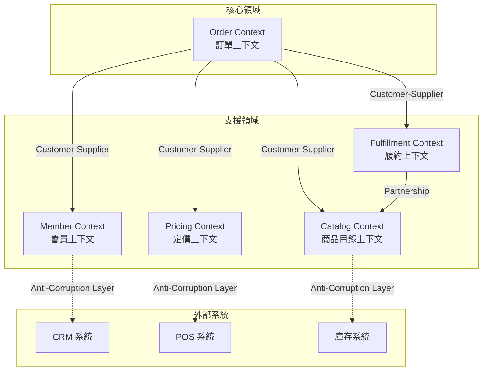
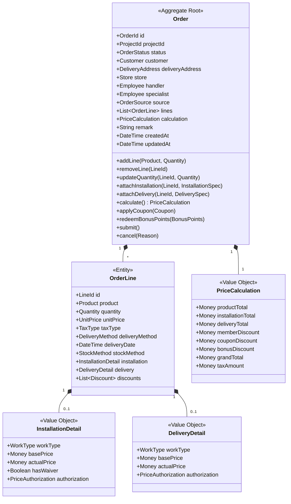
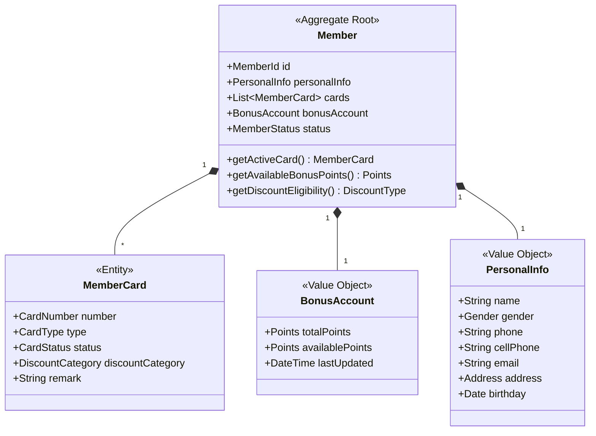
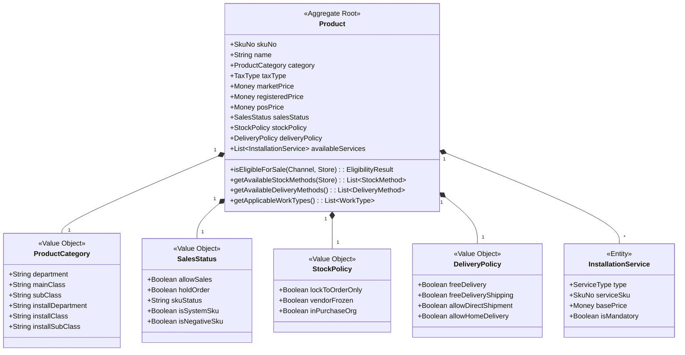
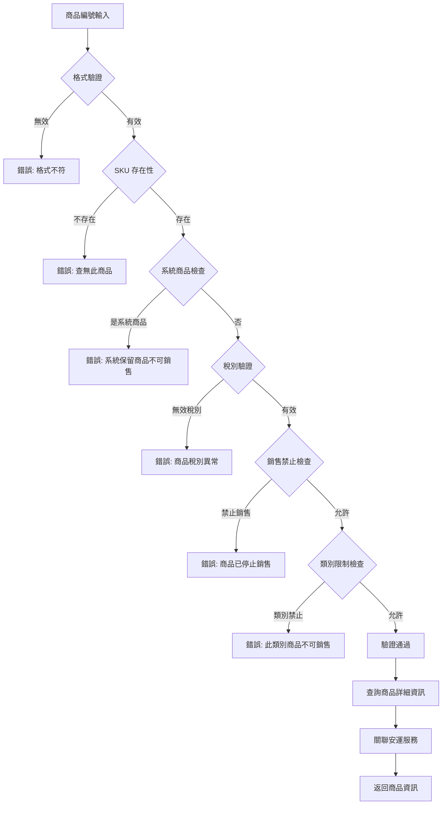
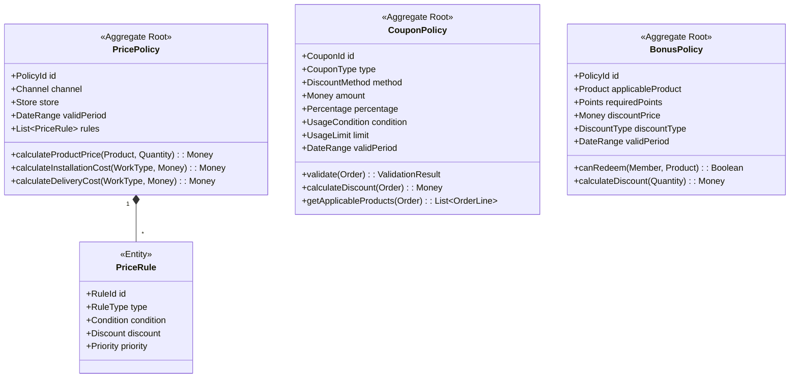
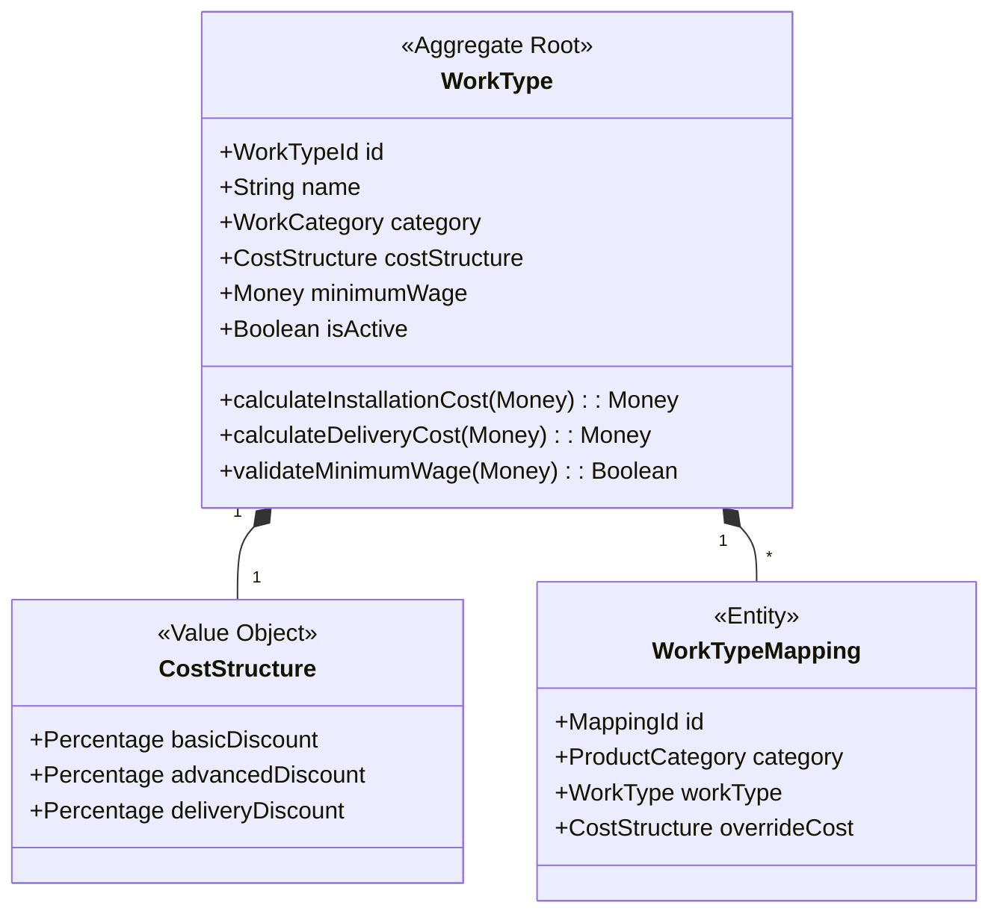
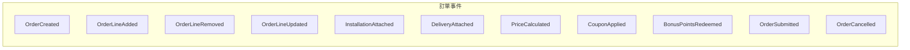
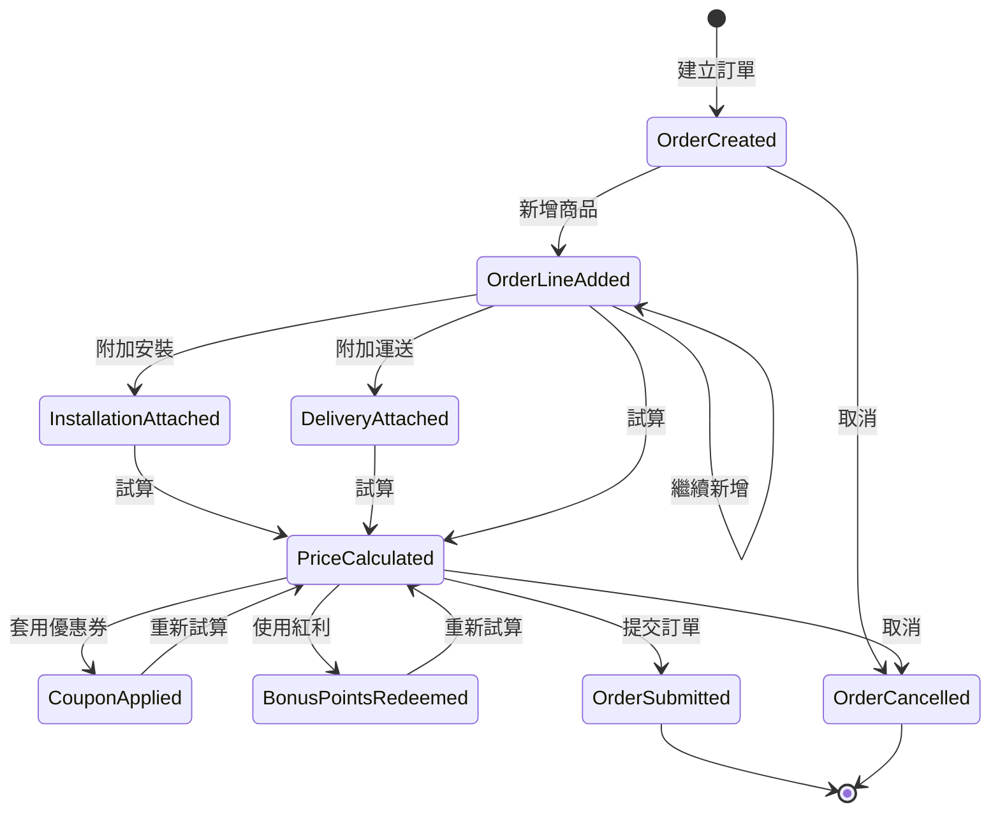

# 新增訂單功能 - DDD 領域模型規格書

## 目錄

1. [Ubiquitous Language (通用語言)](#1-ubiquitous-language-通用語言)
2. [Bounded Contexts (限界上下文)](#2-bounded-contexts-限界上下文)
3. [Order Context - 訂單上下文](#3-order-context---訂單上下文)
4. [Member Context - 會員上下文](#4-member-context---會員上下文)
5. [Catalog Context - 商品目錄上下文](#5-catalog-context---商品目錄上下文)
6. [Pricing Context - 定價上下文](#6-pricing-context---定價上下文)
7. [Fulfillment Context - 履約上下文](#7-fulfillment-context---履約上下文)
8. [Domain Events (領域事件)](#8-domain-events-領域事件)
9. [Business Rules (業務規則)](#9-business-rules-業務規則)
10. [Use Cases (使用案例)](#10-use-cases-使用案例)

---

## 1. Ubiquitous Language (通用語言)

### 1.1 核心概念詞彙

| 中文術語 | 英文術語 | 定義 |
|---------|---------|------|
| 特殊訂單 | Special Order (SO) | 需要安裝、運送或特殊配送服務的商品銷售訂單 |
| 訂單行項 | Order Line | 訂單中的單一商品項目及其相關服務 |
| 主商品 | Primary Product | 客戶購買的實體商品 |
| 安裝服務 | Installation Service | 為商品提供的安裝工程服務 |
| 運送服務 | Delivery Service | 將商品送達客戶指定地點的服務 |
| 直送 | Direct Shipment | 由廠商直接配送至客戶的運送方式 |
| 工種 | Work Type | 執行安裝或運送服務的專業類別 |
| 會員 | Member | 在 CRM 系統註冊的客戶 |
| 紅利點數 | Bonus Points | 會員累積可用於折抵的積分 |
| 折價券 | Coupon | 固定金額或百分比的價格減免憑證 |
| 試算 | Price Calculation | 計算訂單各項費用和折扣的過程 |

### 1.2 訂單狀態術語

| 狀態 | 定義 |
|------|------|
| 草稿 (Draft) | 訂單尚未完成，僅供暫存 |
| 報價 (Quotation) | 已完成試算，等待客戶確認 |
| 有效 (Active) | 客戶已確認，訂單正式生效 |
| 已付款 (Paid) | 客戶已完成付款 |
| 已結案 (Closed) | 所有服務已完成，訂單結束 |
| 作廢 (Cancelled) | 訂單已被取消 |

### 1.3 商品服務類型術語

| 類型 | 定義 |
|------|------|
| 標準安裝 (Basic Installation) | 基本安裝服務，依標準工時計價 |
| 進階安裝 (Advanced Installation) | 額外的安裝服務項目 |
| 安裝調整 (Installation Adjustment) | 安裝服務的加減金額調整項 |
| 安裝補費 (Installation Supplement) | 補收的安裝費用項目 |
| 免安折扣 (Installation Waiver) | 客戶放棄安裝服務時的價格減免 |
| 代運 (Managed Delivery) | 由店家安排的運送服務，需指派工種 |
| 純運 (Pure Delivery) | 單純運送服務，無安裝 |
| 宅配 (Home Delivery) | 第三方物流配送服務 |
| 直送 (Direct Shipment) | 由供應商直接配送至客戶 |
| 當場自取 (Immediate Pickup) | 客戶在店內立即取貨 |
| 下次自取 (Later Pickup) | 客戶擇日至店取貨 |

### 1.4 備貨方式術語

| 術語 | 定義 |
|------|------|
| 現貨 (In Stock) | 門市有庫存，可立即出貨 |
| 訂購 (Purchase Order) | 需向供應商訂購後出貨 |
| 備貨鎖定 (Stock Lock) | 因供應商狀態或採購限制而鎖定只能訂購 |

### 1.5 商品資格術語

| 術語 | 定義 |
|------|------|
| 可銷售 (Saleable) | 商品允許在 SO 系統銷售 |
| 暫停銷售 (Hold Order) | 商品暫時停止銷售 |
| 系統商品 (System SKU) | 系統保留用商品，不可銷售 |
| 負項商品 (Negative SKU) | 用於折扣或扣抵的虛擬商品 |

---

## 2. Bounded Contexts (限界上下文)

### 2.1 Context Map



### 2.2 Context 關係說明

| 上游 Context | 下游 Context | 關係類型 | 說明 |
|-------------|-------------|---------|------|
| Member | Order | Customer-Supplier | 訂單需要會員資訊，但不擁有會員 |
| Pricing | Order | Customer-Supplier | 訂單請求定價服務進行試算 |
| Fulfillment | Order | Customer-Supplier | 訂單請求履約服務安排配送 |
| Catalog | Order | Customer-Supplier | 訂單請求商品資格驗證和服務關聯 |
| Catalog | Fulfillment | Partnership | 商品類別與工種的對應關係 |
| CRM (外部) | Member | ACL | 透過防腐層整合外部 CRM 系統 |
| POS (外部) | Pricing | ACL | 透過防腐層整合外部 POS 系統 |
| 庫存 (外部) | Catalog | ACL | 透過防腐層整合庫存系統 |

---

## 3. Order Context - 訂單上下文

### 3.1 Aggregate: Order (訂單)



### 3.2 Value Objects

#### OrderId (訂單編號)
```
格式: 10位數字流水號
起始: 3000000000
規則: 系統自動產生，全域唯一
```

#### ProjectId (專案代號)
```
格式: 店別(5碼) + 年(2碼) + 月日(4碼) + 流水號(5碼)
範例: 12345 + 24 + 1218 + 00001 = 1234524121800001
規則: 同一專案下可包含多張訂單
```

#### OrderStatus (訂單狀態)
```
允許的狀態轉換:
- Draft → Quotation
- Draft → Active
- Quotation → Active
- Quotation → Draft
- Active → Paid
- Active → Cancelled
- Paid → Closed
- Paid → Cancelled (需退款)
```

#### Customer (客戶資訊)
```
屬性:
- memberId: 會員卡號
- cardType: 卡別 (一般卡/商務卡)
- name: 姓名
- gender: 性別
- phone: 電話
- cellPhone: 手機
- birthday: 生日
- contact: 聯絡人
- contactPhone: 聯絡電話
- address: 地址
- vipType: VIP 等級
- discountType: 折扣類別
```

#### DeliveryAddress (安運地址)
```
屬性:
- zipCode: 郵遞區號 (3碼)
- fullAddress: 完整地址
驗證:
- 郵遞區號必須存在於系統區域清單
- 地址不可為避免運送區域
```

#### Money (金額)
```
屬性:
- amount: 金額數值 (整數)
- currency: 幣別 (固定 TWD)
規則:
- 所有金額計算結果四捨五入取整數
- 負數表示折扣/扣抵
```

#### TaxType (稅別)
```
類型:
- TAXABLE (應稅): 含 5% 營業稅
- TAX_FREE (免稅): 不含稅
- ZERO_TAX (零稅): 特殊零稅率
```

#### DeliveryMethod (運送方式)
```
類型:
- MANAGED (N): 代運 - 需指派工種，可選擇安裝服務
- PURE_DELIVERY (D): 純運 - 單純運送，不含安裝
- DIRECT_SHIPMENT (V): 直送 - 供應商直接配送
- IMMEDIATE_PICKUP (C): 當場自取 - 在店內立即取貨
- FREE_DELIVERY (F): 免運 - 免運費配送
- LATER_PICKUP (P): 下次自取 - 擇日至店取貨
```

#### StockMethod (備貨方式)
```
類型:
- IN_STOCK (X): 現貨 - 門市有庫存
- PURCHASE_ORDER (Y): 訂購 - 需向供應商訂購

鎖定條件 (強制訂購):
- 供應商已凍結
- 商品不在門市採購組織內
- 商品已設定為訂購優先
```

#### DeliveryStockCombination (運送備貨組合規則)
```
有效組合矩陣:

| 運送方式 | 現貨(X) | 訂購(Y) | 說明 |
|---------|--------|--------|------|
| 代運(N) | ✓ | ✓ | 皆可，依庫存狀況 |
| 純運(D) | ✓ | ✓ | 皆可，依庫存狀況 |
| 直送(V) | ✗ | ✓ | 僅能訂購 |
| 當場自取(C) | ✓ | ✗ | 僅能現貨 |
| 免運(F) | ✓ | ✓ | 皆可，通常配合促銷 |
| 下次自取(P) | ✓ | ✓ | 皆可，依庫存狀況 |

免運費規則:
- 免運商品 (skuVo.freeDelivery = true)
- 特定出貨方式啟用免運 (skuVo.freeDeliveryShipping = true)
- 由商品主檔設定決定
```

#### PriceAuthorization (變價授權)
```
屬性:
- authorizedBy: 授權人員
- reason: 變價原因
- reasonDescription: 原因說明
- authorizedAt: 授權時間
規則:
- 實際價格與原始價格不同時必須有授權
```

#### HoldOrder (採購凍結狀態)
```
類型:
- A: 暫停採購及對物流調撥
- B: 暫停店對店調撥
- C: 暫停所有採購調撥
- D: 暫停採購及對物流調撥，但允許 MD 下單及調撥
- E: 暫停採購及對物流調撥，但允許 MD 調撥
- N: 無限制（正常）

驗證規則:
- PO 商品（dcType=null 或 'XD'）：檢查 holdOrder 是否在 STORE_PO_ORDER_CTRL 參數清單中
- DC/STO 商品（dcType='DC'）：檢查 holdOrder 是否在 STORE_STO_ORDER_CTRL 參數清單中
- 不在允許清單中時，備貨方式鎖定為「訂購」

參考欄位:
- 資料表: TBL_SKU_STORE.HOLD_ORDER
- VO: SkuInfoVO.holdOrder, OrderDetlVO.holdOrder
- 參數表: TBL_PARM (STORE_PO_ORDER_CTRL, STORE_STO_ORDER_CTRL)
```

### 3.3 Domain Services

#### OrderPricingService
```
職責: 協調訂單價格計算
方法:
- calculateOrder(Order): PriceCalculation
- validatePriceAuthorization(OrderLine): ValidationResult
```

#### OrderValidationService
```
職責: 訂單業務規則驗證
方法:
- validateForSubmission(Order): ValidationResult
- validateForPayment(Order): ValidationResult
- validateForClose(Order): ValidationResult
```

---

## 4. Member Context - 會員上下文

### 4.1 Aggregate: Member (會員)



### 4.2 Value Objects

#### CardType (卡別)
```
類型:
- REGULAR: 一般卡
- BUSINESS: 商務卡
- VIP: VIP 卡
- SVIP: SVIP 卡
```

#### CardStatus (卡片狀態)
```
類型:
- ACTIVE: 正常
- SUSPENDED: 停用
- EXPIRED: 過期
```

### 4.3 Anti-Corruption Layer

#### MemberQueryService (會員查詢服務)
```
職責: 封裝 CRM 系統整合
方法:
- findByCardNumber(CardNumber): Member
- findByPersonId(PersonId): Member
- findByPhone(Phone): Member

整合細節:
- 查詢參數: 公司別、通路代號、門店代號
- 認證方式: Bearer Token
- 回傳轉換: CRM 格式 → 領域模型
```

---

## 5. Catalog Context - 商品目錄上下文

### 5.1 Aggregate: Product (商品)



### 5.2 商品資格驗證 (Product Eligibility)



#### 商品資格驗證規則

| 驗證層級 | 規則名稱 | 條件 | 錯誤訊息 |
|---------|---------|------|---------|
| 1 | 格式驗證 | SKU 符合編碼規則 | 商品編號格式錯誤 |
| 2 | 存在性驗證 | SKU 存在於商品主檔 | 查無此商品 |
| 3 | 系統商品排除 | allowSales ≠ 'N' | 不可銷售商品（含系統商品）無法新增至訂單 |
| 4 | 稅別驗證 | taxType 為有效值 | 商品稅別設定異常 |
| 5 | 銷售禁止 | allowSales = true AND holdOrder = false | 商品已停止銷售 |
| 6 | 類別限制 | 類別不在禁售清單 | 此類別商品不可於 SO 銷售 |

### 5.3 安裝服務關聯 (Installation Service Association)

#### 服務類型定義

| 服務類型 | 代碼 | 說明 | 成本計算基準 |
|---------|------|------|-------------|
| 標準安裝 | I | 基本安裝服務 | discountBase |
| 進階安裝 | IA | 額外安裝項目 | discountBase |
| 其他安裝 | IE | 非標準安裝服務 | discountExtra |
| 安裝調整 | IC | 金額調整項目 | 無成本 (cost=0) |
| 安裝補費 | IS | 補收安裝費用 | discountBase |
| 免安折扣 | FI | 放棄安裝的折價 | 負項金額 |

#### 服務關聯邏輯

```
商品與安裝服務關聯:

1. 根據商品類別 (department, class, subClass) 查詢
2. 對應安運類別 (installDepartment, installClass, installSubClass)
3. 透過工種映射表取得:
   - 適用工種 (workTypeId)
   - 標安成本折數 (discountBase)
   - 非標成本折數 (discountExtra)
4. 根據工種查詢可用安裝服務 SKU

層級結構:
OrderLine (主商品 P)
├── lstInstallSkuInfo[]  (安裝服務)
│   ├── InstallationService (I - 標安)
│   ├── InstallationService (IA - 進階)
│   ├── InstallationService (IE - 其他)
│   ├── InstallationService (IC - 調整)
│   ├── InstallationService (IS - 補費)
│   └── InstallationService (FI - 免安)
└── lstDirectShipmentSkuInfo[]  (直送服務)
    └── DirectShipmentService (VD)
```

### 5.4 運送服務關聯 (Delivery Service Association)

```
運送服務層級結構:

WorkType (工種 D)
└── lstDeliverySkuInfo[]  (運送服務)
    └── DeliveryService (DD - 運費商品)

運送服務關聯步驟:
1. 根據商品的運送方式 (deliveryFlag) 判斷
2. 若為代運 (N)，需指派工種
3. 工種底下關聯運費商品 (DD)
4. 宅配工種有特殊運費計算邏輯
```

### 5.5 Domain Services

#### ProductEligibilityService
```
職責: 商品銷售資格驗證
方法:
- checkEligibility(SkuNo, Channel, Store): EligibilityResult
- validateSalesStatus(Product): ValidationResult
- validateCategory(Product, Channel): ValidationResult
```

#### ProductServiceAssociationService
```
職責: 關聯商品與安運服務
方法:
- associateInstallationServices(Product): List~InstallationService~
- associateDeliveryServices(Product, DeliveryMethod): List~DeliveryService~
- getApplicableWorkTypes(Product): List~WorkType~
```

#### StockMethodDeterminationService
```
職責: 決定商品可用備貨方式
方法:
- determineAvailableMethods(Product, Store): List~StockMethod~
- checkStockLock(Product, Store): Boolean
- checkVendorStatus(Product): Boolean
```

### 5.6 Value Objects

#### EligibilityResult (資格驗證結果)
```
屬性:
- isEligible: 是否合格
- failureReason: 失敗原因 (若不合格)
- failureLevel: 失敗層級 (1-6)
- product: 商品資訊 (若合格)
```

#### ServiceType (服務類型)
```
類型:
- BASIC_INSTALLATION (I): 標準安裝
- ADVANCED_INSTALLATION (IA): 進階安裝
- EXTRA_INSTALLATION (IE): 其他安裝
- INSTALLATION_ADJUSTMENT (IC): 安裝調整
- INSTALLATION_SUPPLEMENT (IS): 安裝補費
- INSTALLATION_WAIVER (FI): 免安折扣
- DIRECT_SHIPMENT (VD): 直送運送
- DELIVERY_FEE (DD): 運費商品
```

---

## 6. Pricing Context - 定價上下文

### 6.1 Aggregate: PricePolicy (定價政策)



### 6.2 Value Objects

#### DiscountMethod (折扣方式)
```
類型:
- FIXED_AMOUNT: 固定面額 (折價券)
- PERCENTAGE: 百分比折扣 (折扣券)
規則:
- 固定面額: 直接扣減金額
- 百分比: 1~100%，計算時無條件進位
```

#### ApportionmentMethod (分攤方式)
```
類型:
- DOWN_MARGIN: 直接降價 (降低單價和小計)
- DISCOUNTING_LINE: 折扣行項 (小計降低，單價不變)
```

#### UsageCondition (使用條件)
```
屬性:
- thresholdType: 門檻類型 (金額/數量)
- thresholdValue: 門檻值
- applicableProducts: 適用商品規則
- excludedProducts: 排除商品規則
```

#### UsageLimit (使用限制)
```
屬性:
- maxPerTransaction: 單筆最多使用張數
- usesPerThreshold: 每達門檻可使用張數
- canCombine: 是否可併用其他優惠
```

### 6.3 Domain Services

#### PriceCalculationService
```
職責: 執行完整的價格試算
方法:
- calculate(Order, PricePolicy): PriceCalculation
- apportionDiscount(OrderLines, Discount): ApportionmentResult
```

#### CouponValidationService
```
職責: 驗證優惠券使用
方法:
- validate(Coupon, Order): ValidationResult
- checkThreshold(Coupon, Order): Boolean
- checkCombination(List~Coupon~): Boolean
```

### 6.4 計算公式

#### 工種成本計算
```
標準安裝成本:
  cost = round(basePrice × discountBase ÷ taxRate)

進階安裝成本:
  cost = round(basePrice × discountExtra ÷ taxRate)

運送成本:
  cost = round(basePrice × deliveryDiscount ÷ taxRate)

宅配成本:
  基礎: cost = round(baseFee ÷ taxRate)
  超量: cost = round((baseFee + extraFee × extraVolume) ÷ taxRate)
  超量條件: 體積 > 3
  超量計算: extraVolume = ceil(totalVolume - 3)
```

#### 折扣分攤公式
```
固定面額分攤:
  總分攤 = 折價金額 × 使用張數
  各商品分攤 = round(總分攤 × (商品小計 ÷ 總金額))
  末商品分攤 = 總分攤 - 已分攤金額 (確保無餘數)

百分比分攤:
  折扣率 = 折扣百分比 ÷ 100
  各商品折扣 = ceil(商品小計 ÷ 數量 × 折扣率) × 數量
```

#### 紅利折抵公式
```
紅利小計:
  bonusDiscount = (原價 - 優惠價) × 數量 × (-1)

單位紅利分攤:
  unitDiscount = round(bonusDiscount ÷ 數量)

實際售價:
  actualPrice = originalPrice + unitDiscount
```

---

## 7. Fulfillment Context - 履約上下文

### 7.1 Aggregate: WorkType (工種)



### 7.2 Value Objects

#### WorkCategory (工種類別)
```
類型:
- INSTALLATION: 安裝工種
- DELIVERY: 運送工種
- HOME_DELIVERY: 宅配工種
- PURE_DELIVERY: 純運工種
```

#### ProductCategory (商品類別)
```
屬性:
- department: 部門
- mainClass: 主類別
- subClass: 次類別
用途: 對應工種折數
```

### 7.3 Domain Services

#### WorkTypeAssignmentService
```
職責: 工種指派
方法:
- assignWorkType(OrderLine, DeliveryAddress): WorkType
- findApplicableWorkTypes(Product): List~WorkType~
```

#### MinimumWageValidationService
```
職責: 最低工資檢查
方法:
- validate(WorkType, Money): ValidationResult
- getMinimumWage(WorkType, Store): Money
排除:
- 純運 (工種ID = 0000)
- 宅配 (工種ID = HOME_DELIVERY)
```

---

## 8. Domain Events (領域事件)

### 8.1 Order Context Events



#### OrderCreated
```
發生時機: 建立新訂單
攜帶資料:
- orderId: 訂單編號
- customerId: 客戶會員編號
- storeId: 店別
- createdBy: 建立人員
- createdAt: 建立時間
```

#### OrderLineAdded
```
發生時機: 新增訂單行項
攜帶資料:
- orderId: 訂單編號
- lineId: 行項編號
- productId: 商品編號
- quantity: 數量
- unitPrice: 單價
```

#### PriceCalculated
```
發生時機: 完成價格試算
攜帶資料:
- orderId: 訂單編號
- productTotal: 商品總額
- installationTotal: 安裝總額
- deliveryTotal: 運送總額
- discountTotal: 折扣總額
- grandTotal: 應付總額
- calculatedAt: 試算時間
```

#### CouponApplied
```
發生時機: 套用優惠券
攜帶資料:
- orderId: 訂單編號
- couponId: 優惠券編號
- couponType: 優惠券類型
- discountAmount: 折扣金額
- apportionments: 分攤明細
```

#### BonusPointsRedeemed
```
發生時機: 使用紅利點數
攜帶資料:
- orderId: 訂單編號
- memberId: 會員編號
- pointsUsed: 使用點數
- discountAmount: 折抵金額
- productId: 折抵商品
```

#### OrderSubmitted
```
發生時機: 訂單提交確認
攜帶資料:
- orderId: 訂單編號
- status: 新狀態
- grandTotal: 應付總額
- submittedBy: 提交人員
- submittedAt: 提交時間
後續動作:
- 建立專案主檔
- 建立訂單明細
- 建立折扣記錄 (非草稿時)
```

### 8.2 Event Flow



---

## 9. Business Rules (業務規則)

### 9.1 訂單建立規則

| 規則編號 | 規則名稱 | 描述 |
|---------|---------|------|
| OR-001 | 必填客戶資訊 | 訂單必須有會員卡號或身分證或電話 |
| OR-002 | 必填聯絡資訊 | 訂單必須有聯絡人和聯絡電話 |
| OR-003 | 必填安運地址 | 訂單必須有有效的安運地址和郵遞區號 |
| OR-004 | 必填出貨店 | 訂單必須指定出貨店 |
| OR-005 | 至少一項商品 | 訂單必須包含至少一項商品 |
| OR-006 | 數量不為零 | 商品數量總和不可為零 |

### 9.2 通路特定規則

| 規則編號 | 適用通路 | 規則描述 |
|---------|---------|---------|
| CH-001 | 全通路 | 必填預計出貨日 |
| CH-002 | CASA/MINI/HOLA/TRCB/TBA | 必填接單人 |
| CH-003 | EC 網路店 (0003) | 必填 EC 單號 |
| CH-004 | 票券來源 (0002) | 必填票券單號且不可重複使用 |
| CH-005 | 票券來源 (0002) | 僅可包含一筆票券商品 |
| CH-006 | 專案商品 (0005) | 不可使用當場自取 |

### 9.3 價格與折扣規則

| 規則編號 | 規則名稱 | 描述 |
|---------|---------|------|
| PR-001 | 試算必要性 | 訂單提交前必須完成價格試算 |
| PR-002 | 變價授權 | 實際價格與原始價格不同時必須有變價授權 |
| PR-003 | 最低工資 | 安裝費用不可低於工種最低工資 (純運和宅配除外) |
| PR-004 | 折扣上限 | 折價金額不可超過可折抵商品總額 |
| PR-005 | 百分比範圍 | 折扣百分比必須在 1~100% 之間 |
| PR-006 | 門檻達標 | 使用優惠券必須達到使用門檻 |
| PR-007 | 張數限制 | 優惠券使用張數不可超過單筆限制 |

### 9.4 紅利點數規則

| 規則編號 | 規則名稱 | 描述 |
|---------|---------|------|
| BP-001 | 訂單狀態限制 | 草稿和報價狀態不可使用紅利點數 |
| BP-002 | 通路會員限制 | 特定通路僅 APP 會員可使用紅利 |
| BP-003 | 點數充足 | 使用點數不可超過會員可用點數 |

### 9.5 履約規則

| 規則編號 | 規則名稱 | 描述 |
|---------|---------|------|
| FL-001 | 工種指派 | 代運商品必須指派工種 |
| FL-002 | 宅配出貨店 | 使用宅配的出貨店必須支援宅配服務 |
| FL-003 | 安裝勾選 | 有安裝商品時必須勾選安裝服務 |
| FL-004 | 運費勾選 | 宅配工種必須勾選至少一筆運費商品 |
| FL-005 | 運送工種必填 | deliveryFlag='D'(純運) 或 'N'(代運) 的商品必須指派工種 |
| FL-006 | 純運商品識別 | deliveryFlag='D' 為商品主檔設定的純運商品，不顯示安裝選項；與用戶選擇「只勾運送不安裝」(deliveryFlag='N') 為不同情境，但兩者皆需指派工種 |

### 9.6 防重複規則

| 規則編號 | 規則名稱 | 描述 |
|---------|---------|------|
| DP-001 | 重複開單檢查 | 5 秒內不可重複建立相同訂單 |
| DP-002 | 票券重複檢查 | 票券單號不可在其他訂單中使用 |

### 9.7 商品資格規則

| 規則編號 | 規則名稱 | 描述 |
|---------|---------|------|
| SK-001 | 格式驗證 | 商品編號必須符合 SKU 編碼規則 |
| SK-002 | 存在性驗證 | 商品必須存在於商品主檔 |
| SK-003 | 系統商品排除 | 系統保留商品不可銷售 |
| SK-004 | 稅別驗證 | 商品必須有有效的稅別設定 |
| SK-005 | 銷售狀態檢查 | 商品必須允許銷售且未暫停 |
| SK-006 | 類別限制 | 商品類別必須允許在 SO 系統銷售 |

### 9.8 備貨方式規則

| 規則編號 | 規則名稱 | 描述 |
|---------|---------|------|
| ST-001 | 直送僅限訂購 | 直送商品備貨方式僅能為訂購 |
| ST-002 | 當場自取僅限現貨 | 當場自取備貨方式僅能為現貨 |
| ST-003 | 供應商凍結鎖定 | 供應商已凍結時強制訂購 |
| ST-004 | 採購組織限制 | 商品不在門市採購組織內時強制訂購 |
| ST-005 | DC 商品供應商凍結例外 | DC 商品（dcType='DC'）供應商凍結時仍可訂購，但有 AOH 庫存且數量足夠時優先現貨 |
| ST-006 | 大型家具例外 | 大型家具商品（largeFurniture=true）不受 AOH 庫存限制，供應商凍結時仍可訂購 |

---

## 10. Use Cases (使用案例)

### 10.1 建立特殊訂單

```
主要流程:
1. 門市人員選擇「新增訂單」
2. 系統載入初始資料 (下拉選單、預設值)
3. 門市人員輸入會員資訊
4. 系統查詢會員資料並帶入
5. 門市人員新增商品至訂單
6. 門市人員設定安裝/運送服務
7. 門市人員指派工種 (如需要)
8. 門市人員執行價格試算
9. 系統顯示試算結果
10. 門市人員套用優惠券 (可選)
11. 門市人員使用紅利點數 (可選)
12. 門市人員確認並提交訂單
13. 系統建立訂單並返回訂單編號

替代流程:
4a. 會員不存在
    4a1. 系統提示會員不存在
    4a2. 門市人員可手動輸入客戶資訊

8a. 商品數量超過試算上限
    8a1. 系統提示超過上限
    8a2. 門市人員需減少商品數量

10a. 優惠券驗證失敗
    10a1. 系統顯示驗證失敗原因
    10a2. 門市人員可選擇其他優惠券

12a. 驗證失敗
    12a1. 系統顯示驗證錯誤清單
    12a2. 門市人員修正後重試
```

### 10.2 查詢會員資訊

```
主要流程:
1. 門市人員輸入會員卡號/身分證/電話
2. 系統向 CRM 查詢會員資訊
3. 系統轉換並顯示會員資料
4. 系統自動帶入訂單客戶欄位

替代流程:
2a. CRM 系統無回應
    2a1. 系統記錄錯誤日誌
    2a2. 返回空的會員物件
    2a3. 門市人員可手動輸入

3a. 會員有多張卡片
    3a1. 系統列出所有卡片
    3a2. 門市人員選擇要使用的卡片
```

### 10.3 執行價格試算

```
主要流程:
1. 門市人員點擊「試算」按鈕
2. 系統檢查商品數量是否超過上限
3. 系統分類商品 (一般/安裝/運送/直送)
4. 系統計算商品總額
5. 系統計算安裝費用
6. 系統計算運送費用
7. 系統套用會員折扣
8. 系統套用已選優惠券
9. 系統計算稅額
10. 系統顯示試算明細

替代流程:
2a. 超過商品數量上限
    2a1. 系統顯示錯誤訊息
    2a2. 流程終止

5a. 有變價商品
    5a1. 系統檢查變價授權
    5a2. 未授權則標記需授權
```

### 10.4 套用優惠券

```
主要流程:
1. 門市人員選擇優惠券
2. 系統驗證優惠券效期
3. 系統驗證使用條件
4. 系統驗證使用門檻
5. 系統計算折扣金額
6. 系統分攤折扣至各商品
7. 系統更新試算結果

替代流程:
3a. 無適用商品
    3a1. 系統提示無適用商品
    3a2. 流程終止

4a. 未達門檻
    4a1. 系統提示未達門檻金額/數量
    4a2. 流程終止

6a. 折扣超過可折抵金額
    6a1. 系統提示可折抵餘額
    6a2. 門市人員調整使用張數
```

### 10.5 使用紅利點數

```
前置條件:
- 訂單狀態為有效 (非草稿/報價)
- 會員有可用紅利點數

主要流程:
1. 門市人員選擇「紅利折抵」
2. 系統查詢會員可用點數
3. 系統顯示可折抵商品清單
4. 門市人員選擇折抵商品
5. 系統計算折抵金額
6. 系統扣除會員點數
7. 系統更新商品實際售價

替代流程:
2a. 點數不足
    2a1. 系統禁用對應選項
    2a2. 門市人員選擇其他商品

3a. 通路限制
    3a1. 系統檢查會員來源
    3a2. 非 APP 會員則拒絕使用
```

### 10.6 新增商品至訂單

```
主要流程:
1. 門市人員輸入商品編號
2. 系統執行商品資格驗證 (6 層驗證)
3. 系統查詢商品詳細資訊
4. 系統關聯可用安裝服務
5. 系統決定可用備貨方式
6. 系統決定可用運送方式
7. 門市人員輸入數量
8. 門市人員選擇備貨方式
9. 門市人員選擇運送方式
10. 系統將商品加入訂單行項

替代流程:
2a. 格式驗證失敗
    2a1. 系統提示格式錯誤
    2a2. 門市人員重新輸入

2b. 商品不存在
    2b1. 系統提示查無此商品
    2b2. 門市人員確認編號

2c. 系統商品/銷售禁止/類別限制
    2c1. 系統提示不可銷售原因
    2c2. 門市人員選擇其他商品

8a. 備貨方式被鎖定
    8a1. 系統顯示「僅可訂購」
    8a2. 系統自動選擇訂購

9a. 運送方式與備貨方式不相容
    9a1. 系統提示不相容組合
    9a2. 門市人員調整選擇
```

### 10.7 選擇備貨方式

```
前置條件:
- 商品已通過資格驗證
- 商品已加入訂單行項

主要流程:
1. 系統檢查商品供應商狀態
2. 系統檢查商品採購組織
3. 系統決定可用備貨方式
4. 門市人員選擇備貨方式
5. 系統驗證與運送方式相容性
6. 系統更新訂單行項

備貨鎖定判斷:
若以下任一條件成立，則鎖定為「僅可訂購」:
- 供應商已凍結
- 商品不在門市採購組織內

運送相容性驗證:
- 直送 (V) → 僅限訂購
- 當場自取 (C) → 僅限現貨
- 其他方式 → 現貨/訂購皆可
```

### 10.8 關聯安裝服務

```
前置條件:
- 商品需要安裝服務 (有安運類別)
- 運送方式為代運 (N)

主要流程:
1. 系統根據商品類別查詢安運類別
2. 系統透過工種映射表取得適用工種
3. 系統取得工種對應的成本折數
4. 系統查詢可用安裝服務 SKU
5. 門市人員勾選需要的安裝服務
6. 系統計算安裝服務金額
7. 系統將安裝服務關聯至商品

安裝服務類型:
- 標準安裝 (I): 必選，使用 discountBase
- 進階安裝 (IA): 可選，使用 discountBase
- 其他安裝 (IE): 可選，使用 discountExtra
- 安裝調整 (IC): 可選，無成本
- 安裝補費 (IS): 可選，使用 discountBase
- 免安折扣 (FI): 放棄安裝時選擇，為負項金額

替代流程:
5a. 客戶放棄安裝
    5a1. 門市人員選擇免安折扣
    5a2. 系統計算免安折價金額
    5a3. 系統將免安折扣加入明細
```

---

## 附錄：Context 整合點

### A. Order ↔ Member 整合

```
整合方式: 領域服務調用
Order Context 需要:
- 查詢會員基本資訊
- 查詢會員可用紅利
- 查詢會員折扣資格

Member Context 提供:
- MemberQueryService.findByCardNumber()
- MemberQueryService.findByPersonId()
- MemberQueryService.findByPhone()
- BonusQueryService.getAvailablePoints()
```

### B. Order ↔ Pricing 整合

```
整合方式: 領域服務調用
Order Context 需要:
- 計算訂單價格
- 驗證優惠券
- 計算折扣分攤

Pricing Context 提供:
- PriceCalculationService.calculate()
- CouponValidationService.validate()
- DiscountApportionmentService.apportion()
```

### C. Order ↔ Fulfillment 整合

```
整合方式: 領域服務調用
Order Context 需要:
- 查詢適用工種
- 計算工種成本
- 驗證最低工資

Fulfillment Context 提供:
- WorkTypeAssignmentService.findApplicable()
- WorkTypeCostService.calculate()
- MinimumWageService.validate()
```

### D. Order ↔ Catalog 整合

```
整合方式: 領域服務調用
Order Context 需要:
- 驗證商品銷售資格
- 查詢商品詳細資訊
- 取得可用安裝服務
- 決定可用備貨方式
- 決定可用運送方式

Catalog Context 提供:
- ProductEligibilityService.checkEligibility()
- ProductQueryService.findBySku()
- ProductServiceAssociationService.associateInstallationServices()
- StockMethodDeterminationService.determineAvailableMethods()
- DeliveryMethodService.getAvailableMethods()
```

### E. Catalog ↔ Fulfillment 整合

```
整合方式: Partnership (雙向合作)
共享資訊:
- 商品類別 → 工種映射
- 工種成本折數 (discountBase, discountExtra)
- 安裝服務 SKU 清單

Catalog Context 提供:
- ProductCategory (安運類別資訊)
- InstallationService (可用安裝服務)

Fulfillment Context 提供:
- WorkTypeMapping (工種映射)
- CostStructure (成本折數)
```
