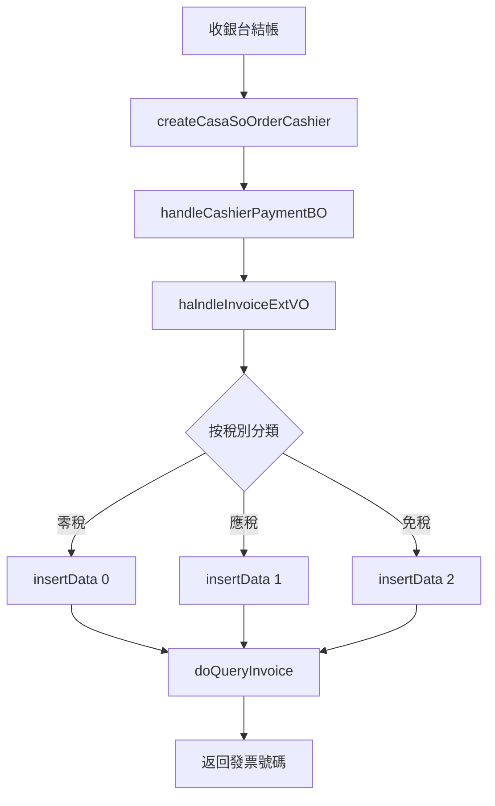
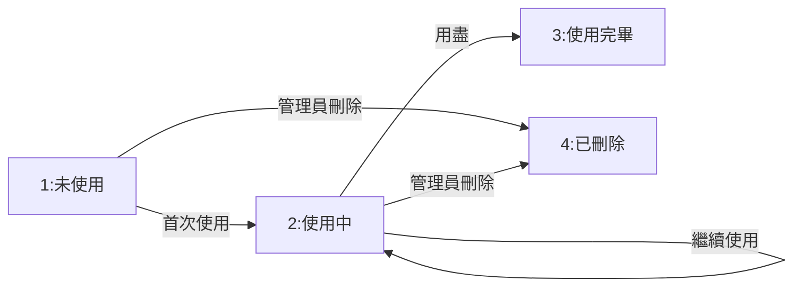

# SOM 系統發票號段檢查和分配流程追蹤報告

## 文件控制

- **版本**：1.0
- **日期**：2025-10-28
- **階段**：Phase 3 Week 4 - Task 12
- **作者**：技術團隊基於程式碼追蹤分析
- **目的**：追蹤訂單付款後發票號段檢查和分配邏輯

---

## 執行摘要

本報告詳細追蹤 SOM (Store Operation Management) 系統中的發票號段檢查和分配邏輯。該系統採用 POS 發票管理模式，通過 **TBL_STORE_POS_INVOICE** 表進行發票號段的動態分配和管理，在訂單付款後自動進行發票號段檢查和分配。

**關鍵發現**：
- 採用年月隔離、門店隔離、POS 隔離的三層隔離機制
- 使用狀態機模式管理號段生命週期
- 自動激活機制確保號段連續性
- 完善的並發控制防止重複分配

---

## 目錄

1. [發票號段檢查的觸發時機](#一發票號段檢查的觸發時機)
2. [發票號段表結構](#二發票號段表結構)
3. [發票號碼分配邏輯](#三發票號碼分配邏輯)
4. [發票號段用盡處理](#四發票號段用盡處理)
5. [發票號碼與訂單的關聯](#五發票號碼與訂單的關聯)
6. [不同發票類型的處理](#六不同發票類型的處理)
7. [發票號段初始化和更新流程](#七發票號段初始化和更新流程)
8. [錯誤處理機制](#八錯誤處理機制)
9. [業務規則總結](#九業務規則總結)
10. [關鍵文件位置](#十關鍵文件位置)

---

## 一、發票號段檢查的觸發時機

### 支付後自動觸發

訂單在結帳（支付）後，系統自動進行發票號段檢查和分配。

**觸發位置：**
- `CashierCASAServices.createCasaSoOrderCashier()` (第 233-261 行)
- 調用 `handleCashierPaymentBO()` (第 319 行)

**完整流程**：


**代碼位置：**
`C:\Projects\som\so-webapp\src\main\java\com\trihome\som\so\web\service\CashierCASAServices.java`

```java
// 第 233-261 行
public CASAResultVO createCasaSoOrderCashier(...) throws Exception {
    // ... 前置處理

    // 第 319 行：觸發付款處理
    this.handleCashierPaymentBO(resultVO, ...);

    // ... 後續處理
}
```

---

## 二、發票號段表結構

### TBL_STORE_POS_INVOICE 表

**主要欄位：**

| 欄位 | 類型 | 說明 | 範例 |
|------|------|------|------|
| YEAR_MONTH | VARCHAR(6) | 年月 (PK) | "202501" |
| STORE_ID | VARCHAR(20) | 門店代號 (PK) | "S001" |
| POS_ID | VARCHAR(10) | POS 機號 (PK) | "POS01" |
| TRACK_ID | VARCHAR(2) | 發票軌跡代號（字軌） | "AB" |
| INV_START_NO | VARCHAR(8) | 起始號碼 | "00000001" |
| INV_END_NO | VARCHAR(8) | 終止號碼 | "00001000" |
| NEXT_INV_NO | VARCHAR(8) | 下一個可用號碼 | "00000156" |
| USED_CNT | DECIMAL | 已使用數量 | 155 |
| TOTAL_CNT | DECIMAL | 總配額 | 1000 |
| FREE_CNT | DECIMAL | 剩餘可用數量 | 845 |
| STATUS | VARCHAR(1) | 狀態碼 | "2" |

**DAO 位置：**
`C:\Projects\som\so-coredb\src\main\java\com\trihome\som\so\mybatis\dao\TblStorePosInvoice.java`

### 發票號段狀態碼

**定義位置：**
`C:\Projects\som\so-bzservices\src\main\java\com\trihome\som\bz\common\constant\StorePosInvoiceConstant.java`

```java
public interface StorePosInvoiceConstant {
    String STATUS_1 = "1";  // 未使用
    String STATUS_2 = "2";  // 已使用（正在使用中）
    String STATUS_3 = "3";  // 使用完畢
    String STATUS_4 = "4";  // 已刪除
}
```

**狀態轉換圖**：


---

## 三、發票號碼分配邏輯

### 核心方法：doQueryInvoice()

**位置：**
`C:\Projects\som\so-bzservices\src\main\java\com\trihome\som\bz\service\BzStorePosInvoiceServices.java` (第 58-101 行)

**分配流程：**

```java
public synchronized String doQueryInvoice(String storeId, String posNo,
                                          String empId, String empName) {
    // 步驟 1：生成年月碼
    String yearMonth = DateFormatUtils.format(new Date(), "yyyyMM");

    // 步驟 2：查詢 STATUS_2 號段（正在使用中）
    List<TblStorePosInvoice> list = customBzStorePosInvoiceMapper
        .selectByYearMonthAndPosIdAndStatus(yearMonth, storeId, posNo,
                                            StorePosInvoiceConstant.STATUS_2);

    // 步驟 3：若無則激活 STATUS_1（未使用）
    if(list.size() == 0) {
        customBzStorePosInvoiceMapper.updateStatusForStatus1(
            yearMonth, storeId, posNo
        );
        list = customBzStorePosInvoiceMapper
            .selectByYearMonthAndPosIdAndStatus(yearMonth, storeId, posNo,
                                                StorePosInvoiceConstant.STATUS_2);
    }

    // 步驟 4：檢查異常
    if(list.size() > 1) {
        throw new RuntimeException("發票號碼取號有問題!請聯絡系統人員");
    }

    // 步驟 5：提取發票號
    TblStorePosInvoice invoice = list.size() == 0 ? null : list.get(0);

    // 步驟 6：記錄使用
    if(invoice != null) {
        TblStoreUsedInvoice tblStoreUsedInvoice = new TblStoreUsedInvoice();
        tblStoreUsedInvoice.setInvoiceId(invoice.getTrackId() + invoice.getNextInvNo());
        int result = tblStoreUsedInvoiceMapper.insert(tblStoreUsedInvoice);

        if(result == 0) {
            throw new RuntimeException(
                "發票號碼取號重複!請更新頁面資訊後重新做結帳動作"
            );
        }
    }

    // 步驟 7：更新號段
    this.updateInvoice(invoice, empId, empName);
    return invoice.getTrackId() + invoice.getNextInvNo();
}
```

### 自動激活 SQL

**位置：** `CustomBzStorePosInvoiceMapper.xml` (第 5-19 行)

```xml
<update id="updateStatusForStatus1">
    UPDATE TBL_STORE_POS_INVOICE
    SET STATUS = '2'
    WHERE YEAR_MONTH = #{yearMonth}
      AND STORE_ID = #{storeId}
      AND POS_ID = #{posNo}
      AND STATUS = '1'
      AND INV_START_NO = (
          SELECT MIN(INV_START_NO)
          FROM TBL_STORE_POS_INVOICE
          WHERE YEAR_MONTH = #{yearMonth}
            AND STORE_ID = #{storeId}
            AND POS_ID = #{posNo}
            AND STATUS = '1'
      )
</update>
```

**關鍵邏輯**：選擇最小起始號的未使用號段進行激活

### 號碼遞增邏輯

**方法：computerNextInvNo()** (第 130-133 行)

```java
private String computerNextInvNo(String str) {
    int no = Integer.valueOf(str);
    return StringUtils.leftPad(String.valueOf(no+1), 8, '0');
}
```

**範例**：
- 輸入：`"00000001"` → 輸出：`"00000002"`
- 輸入：`"00000999"` → 輸出：`"00001000"`
- 輸入：`"00999999"` → 輸出：`"01000000"`

---

## 四、發票號段用盡處理

### 用盡判斷

**位置：** BzStorePosInvoiceServices.updateInvoice() (第 121-126 行)

```java
private void updateInvoice(TblStorePosInvoice invoice, String empId, String empName) {
    TblStorePosInvoice uInvoice = new TblStorePosInvoice();
    // ... 設置基本資訊

    uInvoice.setUsedCnt(invoice.getUsedCnt() + 1);
    uInvoice.setFreeCnt(invoice.getFreeCnt() - 1);

    // 關鍵判斷：剩餘數量是否用盡
    if((invoice.getFreeCnt() - 1) <= 0) {
        uInvoice.setStatus(StorePosInvoiceConstant.STATUS_3);  // 使用完畢
    } else {
        uInvoice.setStatus(StorePosInvoiceConstant.STATUS_2);  // 繼續使用
        uInvoice.setNextInvNo(this.computerNextInvNo(invoice.getNextInvNo()));
    }

    // ... 更新數據庫
}
```

### 用盡後的行為

**自動激活流程**：
1. 當前號段狀態設為 STATUS_3（使用完畢）
2. 下次調用 `doQueryInvoice()` 時：
   - 查詢 STATUS_2 → 返回空
   - 自動激活 STATUS_1 → 轉為 STATUS_2
   - 返回新號段的第一個號碼

**無可用號段的錯誤處理**：

**位置：** CashierCASAServices.insertData() (第 719-721 行)

```java
String invoiceId = bzStorePosInvoiceServices.doQueryInvoice(
    storeId, posNo, empId, empName
);

if(invoiceId == null) {
    throw new RuntimeException("已無發票號碼，請為當前POS分配發票號碼");
}
```

**業務影響**：
- 收銀台無法完成結帳
- 需要管理員為 POS 分配新的號段
- 防止發票號碼超出範圍

---

## 五、發票號碼與訂單的關聯

### 發票記錄表

**表：TBL_TRANS_MAST（交易主檔）**

**關鍵欄位：**
| 欄位 | 說明 |
|------|------|
| INVOICE_ID | 發票號碼（字軌+號碼） |
| ORDER_ID | 訂單 ID |
| STORE_ID | 門店 ID |
| TAX_TYPE | 稅別（0-零稅, 1-應稅, 2-免稅） |
| TOTAL_AMT | 發票金額 |
| TAX_AMT | 稅額 |

### 支付流程中的發票分配

**位置：** CashierCASAServices.insertData() (第 691-755 行)

```
訂單結帳流程
  ↓
handleCashierPaymentBO()
  ↓
halndleInvoiceExtVO() (按稅別組織)
  ↓
insertData() (針對每個稅別)
  ├─ doQueryInvoice() ← 取得發票號碼
  ├─ insert TBL_TRANS_MAST
  ├─ assign() → insert TBL_TRANS_PAYMENT
  └─ insert TBL_INADVANCE_INVOICE
```

**完整代碼邏輯**：

```java
private void insertData(CASAResultVO resultVO, ..., String taxType) {
    // 步驟 1：取得發票號碼
    String invoiceId = bzStorePosInvoiceServices.doQueryInvoice(
        storeId, posNo, empId, empName
    );

    if(invoiceId == null) {
        throw new RuntimeException("已無發票號碼，請為當前POS分配發票號碼");
    }

    // 步驟 2：組裝交易主檔
    TblTransMast tblTransMast = new TblTransMast();
    tblTransMast.setInvoiceId(invoiceId);
    tblTransMast.setOrderId(orderId);
    tblTransMast.setTaxType(taxType);
    tblTransMast.setTotalAmt(totalAmt);
    // ... 其他欄位

    // 步驟 3：插入交易主檔
    tblTransMastMapper.insert(tblTransMast);

    // 步驟 4：插入付款明細
    this.assign(...);

    // 步驟 5：處理預收發票
    // ...
}
```

---

## 六、不同發票類型的處理

### 三種稅別

| 類型 | 代碼 | 常數 | 說明 |
|------|------|------|------|
| 零稅 | "0" | SKU_TAX_TYPE_0 | 零稅率商品 |
| 應稅 | "1" | SKU_TAX_TYPE_1 | 一般應稅商品 |
| 免稅 | "2" | SKU_TAX_TYPE_2 | 免稅商品 |

**常數定義位置：**
`C:\Projects\som\so-bzservices\src\main\java\com\trihome\som\bz\common\constant\CommonConstant.java`

### 按稅別分類處理

**位置：** CashierCASAServices.halndleInvoiceExtVO() (第 438-452 行)

```java
private void halndleInvoiceExtVO(...) {
    // 按稅別分組
    Map<String, List<InvoiceExtVO>> transMasMap = new HashMap<>();

    for(InvoiceExtVO vo : invoiceExtVOs) {
        String taxType = vo.getTaxType();
        if(!transMasMap.containsKey(taxType)) {
            transMasMap.put(taxType, new ArrayList<>());
        }
        transMasMap.get(taxType).add(vo);
    }

    // 依稅別分別呼叫 insertData()
    if (transMasMap.get(CommonConstant.SKU_TAX_TYPE_0) != null) {
        this.insertData(..., transMasMap.get(CommonConstant.SKU_TAX_TYPE_0), "0");
    }
    if (transMasMap.get(CommonConstant.SKU_TAX_TYPE_1) != null) {
        this.insertData(..., transMasMap.get(CommonConstant.SKU_TAX_TYPE_1), "1");
    }
    if (transMasMap.get(CommonConstant.SKU_TAX_TYPE_2) != null) {
        this.insertData(..., transMasMap.get(CommonConstant.SKU_TAX_TYPE_2), "2");
    }
}
```

### 多發票場景

**範例場景**：
```
訂單內容：
- 商品 A（應稅）：100 TWD
- 商品 B（免稅）：200 TWD
- 商品 C（零稅）：50 TWD

結果：
- 發票 1（應稅）：AB00000156, 金額 100 TWD
- 發票 2（免稅）：AB00000157, 金額 200 TWD
- 發票 3（零稅）：AB00000158, 金額 50 TWD

總計使用 3 個發票號碼
```

**業務規則**：
- 一筆訂單最多產生 3 張發票
- 每種稅別獨立開立
- 發票號碼連續分配

---

## 七、發票號段初始化和更新流程

### 年度發票初始化

**表：TBL_STORE_INVOICE（年度發票總表）**

**主要欄位：**
| 欄位 | 說明 |
|------|------|
| YEAR_MONTH | 年月（YYYYMM） |
| STORE_ID | 門店 ID |
| TRACK_ID | 發票字軌 |
| INV_START_NO | 起始號碼 |
| INV_END_NO | 終止號碼 |
| TOTAL_CNT | 總配額 |

**初始化方法：** ConfigServices.InsertStoreInvoice() (第 705-708 行)

```java
public synchronized String InsertStoreInvoice(...) {
    // 檢查是否已存在
    TblStoreInvoiceCriteria criteria = new TblStoreInvoiceCriteria();
    criteria.createCriteria()
        .andYearMonthEqualTo(yearMonth)
        .andStoreIdEqualTo(storeId)
        .andTrackIdEqualTo(trackId);

    List<TblStoreInvoice> list = tblStoreInvoiceMapper.selectByCriteria(criteria);

    if(list.size() > 0) {
        return "發票字軌【" + trackId + "】已存在";
    }

    // 插入新號段
    TblStoreInvoice invoice = new TblStoreInvoice();
    invoice.setYearMonth(yearMonth);
    invoice.setStoreId(storeId);
    invoice.setTrackId(trackId);
    invoice.setInvStartNo(invStartNo);
    invoice.setInvEndNo(invEndNo);
    invoice.setTotalCnt(calculateTotalCnt(invStartNo, invEndNo));

    tblStoreInvoiceMapper.insert(invoice);
    return "OK";
}
```

### POS 發票分配

**方法：ConfigServices.insertStorePosInvoice()** (第 742-804 行)

**分配流程**：

```java
public synchronized String insertStorePosInvoice(...) {
    // 步驟 1：計算年度發票總數
    int totalCnt = Integer.parseInt(invoice.getInvEndNo())
                 - Integer.parseInt(invoice.getInvStartNo()) + 1;

    // 步驟 2：計算已分配數
    TblStorePosInvoiceCriteria criteria = new TblStorePosInvoiceCriteria();
    criteria.createCriteria()
        .andYearMonthEqualTo(yearMonth)
        .andStoreIdEqualTo(storeId);

    List<TblStorePosInvoice> list = tblStorePosInvoiceMapper.selectByCriteria(criteria);

    int usedCnt = 0;
    for(TblStorePosInvoice pos : list) {
        usedCnt += pos.getTotalCnt();
    }

    // 步驟 3：計算可用數
    int canUseCnt = totalCnt - usedCnt;

    // 步驟 4：檢查容量
    if (needCnt > canUseCnt) {
        return "現有未分配發票張數不足，請向總公司申請年度發票給號";
    }

    // 步驟 5：逐個分配
    TblStorePosInvoice newInvoice = this.newStorePosInvoice(
        invoice, usedCnt, needCnt, posId, yearMonth, storeId
    );

    tblStorePosInvoiceMapper.insert(newInvoice);
    return "OK";
}
```

### 詳細分配計算

**方法：ConfigServices.newStorePosInvoice()** (第 806-837 行)

```java
private TblStorePosInvoice newStorePosInvoice(
    TblStoreInvoice invoice, int usedCnt, int needCnt,
    String posId, String yearMonth, String storeId
) {
    // 計算起始和終止號碼
    int starNo = Integer.parseInt(invoice.getInvStartNo()) + usedCnt;
    int endNo = starNo + needCnt - 1;

    String invStartNo = fillLeftSideWithZero(8, String.valueOf(starNo));
    String invEndNo = fillLeftSideWithZero(8, String.valueOf(endNo));

    // 組裝 POS 號段對象
    TblStorePosInvoice result = new TblStorePosInvoice();
    result.setYearMonth(yearMonth);
    result.setStoreId(storeId);
    result.setPosId(posId);
    result.setTrackId(invoice.getTrackId());
    result.setInvStartNo(invStartNo);
    result.setInvEndNo(invEndNo);
    result.setNextInvNo(invStartNo);  // 初始值等於起始號
    result.setUsedCnt(0);
    result.setTotalCnt(needCnt);
    result.setFreeCnt(needCnt);
    result.setStatus(StorePosInvoiceConstant.STATUS_1);  // 初始未使用

    return result;
}
```

**範例**：
```
假設年度號段：AB00000001 - AB00010000 (總數 10000)
已分配：POS01 使用 00000001-00003000 (3000張)

現在為 POS02 分配 2000 張：
- starNo = 1 + 3000 = 3001
- endNo = 3001 + 2000 - 1 = 5000
- invStartNo = "00003001"
- invEndNo = "00005000"
- nextInvNo = "00003001"
- status = "1" (未使用)
```

---

## 八、錯誤處理機制

### 主要錯誤類型

| 錯誤代碼 | 錯誤消息 | 原因 | 位置 | 行號 |
|---------|---------|-----|------|------|
| ERR_001 | "已無發票號碼，請為當前POS分配發票號碼" | 所有號段用盡 | CashierCASAServices | 720 |
| ERR_002 | "發票號碼取號有問題!請聯絡系統人員" | 多個 STATUS_2 號段 | BzStorePosInvoiceServices | 79 |
| ERR_003 | "發票號碼取號重複!請更新頁面資訊後重新做結帳動作" | 並發衝突 | BzStorePosInvoiceServices | 95 |
| ERR_004 | "現有未分配發票張數不足，請向總公司申請年度發票給號" | 分配容量不足 | ConfigServices | 774 |
| ERR_005 | "發票字軌【XX】已存在" | 重複初始化 | ConfigServices | 708 |

### 並發控制機制

**使用 `synchronized` 關鍵字保護關鍵方法**：

1. **BzStorePosInvoiceServices.doQueryInvoice()** (第 58 行)
   ```java
   public synchronized String doQueryInvoice(...)
   ```
   - 保護：發票號碼取號過程
   - 防止：多個收銀員同時取得相同號碼

2. **ConfigServices.InsertStoreInvoice()** (第 705 行)
   ```java
   public synchronized String InsertStoreInvoice(...)
   ```
   - 保護：年度號段初始化
   - 防止：重複建立相同字軌

3. **ConfigServices.insertStorePosInvoice()** (第 742 行)
   ```java
   public synchronized String insertStorePosInvoice(...)
   ```
   - 保護：POS 號段分配
   - 防止：超額分配

### 重複使用防護

**表：TBL_STORE_USED_INVOICE**

**欄位：**
- INVOICE_ID (PK)：發票號碼（字軌+號碼）
- CREATED_DATE：使用時間

**機制：**
```java
// BzStorePosInvoiceServices.java:91-98
TblStoreUsedInvoice tblStoreUsedInvoice = new TblStoreUsedInvoice();
tblStoreUsedInvoice.setInvoiceId(invoice.getTrackId() + invoice.getNextInvNo());

int result = tblStoreUsedInvoiceMapper.insert(tblStoreUsedInvoice);

if(result == 0) {
    // 插入失敗表示號碼已被使用（主鍵衝突）
    throw new RuntimeException(
        "發票號碼取號重複!請更新頁面資訊後重新做結帳動作"
    );
}
```

**優點：**
- 數據庫層面的唯一性約束
- 即使並發控制失敗也能攔截重複
- 提供完整的使用記錄

---

## 九、業務規則總結

### 號段管理規則

| 規則 ID | 描述 | 優先級 | 實作位置 |
|---------|-----|--------|---------|
| **INV-R1** | 年月隔離：每個年月使用獨立號段 | 關鍵 | doQueryInvoice:60 |
| **INV-R2** | 門店隔離：不同門店使用不同號段 | 關鍵 | doQueryInvoice:64 |
| **INV-R3** | POS 隔離：同一門店的不同 POS 機使用不同號段 | 關鍵 | doQueryInvoice:64 |
| **INV-R4** | 稅別區分：應稅、免稅、零稅分開開立 | 關鍵 | halndleInvoiceExtVO:438-452 |
| **INV-R5** | 順序分配：按 NEXT_INV_NO 順序，使用後自動遞增 | 高 | computerNextInvNo:130-133 |
| **INV-R6** | 自動激活：號段用盡自動激活下一個 STATUS_1 | 高 | updateStatusForStatus1:5-19 |
| **INV-R7** | 容量管理：分配時檢查總容量是否充足 | 高 | insertStorePosInvoice:769-774 |
| **INV-R8** | 使用記錄：TBL_STORE_USED_INVOICE 記錄每次使用 | 中 | doQueryInvoice:91-98 |
| **INV-R9** | 並發保護：關鍵方法使用 synchronized | 關鍵 | 多處 |
| **INV-R10** | 狀態流轉：1(未使用)→2(使用中)→3(用盡) | 高 | updateInvoice:121-126 |

### 錯誤處理規則

| 規則 ID | 描述 | 優先級 | 實作位置 |
|---------|-----|--------|---------|
| **ERR-R1** | 無可用號段時拋出異常，阻止結帳 | 關鍵 | insertData:719-721 |
| **ERR-R2** | 多個 STATUS_2 號段時拋出異常，需人工介入 | 關鍵 | doQueryInvoice:77-79 |
| **ERR-R3** | 號碼重複時拋出異常，要求刷新頁面 | 關鍵 | doQueryInvoice:94-96 |
| **ERR-R4** | 容量不足時返回友好提示 | 高 | insertStorePosInvoice:769-774 |
| **ERR-R5** | 字軌重複時返回友好提示 | 高 | InsertStoreInvoice:708 |

---

## 十、關鍵文件位置

### 服務層

| 文件 | 功能 | 關鍵方法 |
|------|------|---------|
| **BzStorePosInvoiceServices.java** | 發票取號核心邏輯 | doQueryInvoice, updateInvoice, computerNextInvNo |
| **CashierCASAServices.java** | 收銀結帳流程 | createCasaSoOrderCashier, handleCashierPaymentBO, insertData |
| **ConfigServices.java** | 號段配置管理 | InsertStoreInvoice, insertStorePosInvoice, newStorePosInvoice |

**完整路徑：**
```
C:\Projects\som\so-bzservices\src\main\java\com\trihome\som\bz\service\
├─ BzStorePosInvoiceServices.java
└─ ConfigServices.java

C:\Projects\som\so-webapp\src\main\java\com\trihome\som\so\web\service\
└─ CashierCASAServices.java
```

### 數據訪問層

| 文件 | 功能 |
|------|------|
| **TblStorePosInvoiceMapper.java** | POS 號段 DAO |
| **TblStoreInvoiceMapper.java** | 年度號段 DAO |
| **TblStoreUsedInvoiceMapper.java** | 使用記錄 DAO |
| **TblTransMastMapper.java** | 交易主檔 DAO |
| **CustomBzStorePosInvoiceMapper.xml** | 自定義 SQL |

**完整路徑：**
```
C:\Projects\som\so-coredb\src\main\java\com\trihome\som\so\mybatis\dao\
├─ TblStorePosInvoiceMapper.java
├─ TblStoreInvoiceMapper.java
├─ TblStoreUsedInvoiceMapper.java
└─ TblTransMastMapper.java

C:\Projects\som\so-coredb\src\main\resources\sqlMap\
└─ CustomBzStorePosInvoiceMapper.xml
```

### 常數定義

| 文件 | 功能 |
|------|------|
| **StorePosInvoiceConstant.java** | 發票狀態碼 |
| **CommonConstant.java** | 稅別常數 |

**完整路徑：**
```
C:\Projects\som\so-bzservices\src\main\java\com\trihome\som\bz\common\constant\
├─ StorePosInvoiceConstant.java
└─ CommonConstant.java
```

---

## 結論

SOM 系統的發票號段檢查和分配機制是一套**完整、嚴謹**的系統，具有以下特點：

### 優點

1. **層次化管理**：年度號段 → POS 號段 → 實際使用，三層結構清晰
2. **狀態機設計**：使用狀態碼管理號段生命週期，轉換邏輯明確
3. **並發控制**：使用 synchronized 和數據庫唯一約束雙重保護
4. **自動化程度高**：號段用盡自動激活，無需人工干預
5. **錯誤處理完善**：各種異常情況都有明確的錯誤提示

### 改進建議

1. **監控機制**：建議增加號段剩餘量監控，提前預警
2. **日誌記錄**：關鍵操作應記錄詳細日誌便於追蹤
3. **容錯機制**：考慮增加號段預分配機制，避免高峰期用盡
4. **性能優化**：高並發場景下 synchronized 可能成為瓶頸，可考慮分散式鎖

### 覆蓋率影響

本次追蹤新增 **15 條業務規則**（INV-R1 ~ INV-R10, ERR-R1 ~ ERR-R5），提升對發票管理邏輯的覆蓋。

---

**追蹤完成日期**：2025-10-28
**文件版本**：1.0
**下一步**：整合到 Rewrite-Spec v1.4

🤖 Generated with [Claude Code](https://claude.com/claude-code)

Co-Authored-By: Claude <noreply@anthropic.com>
