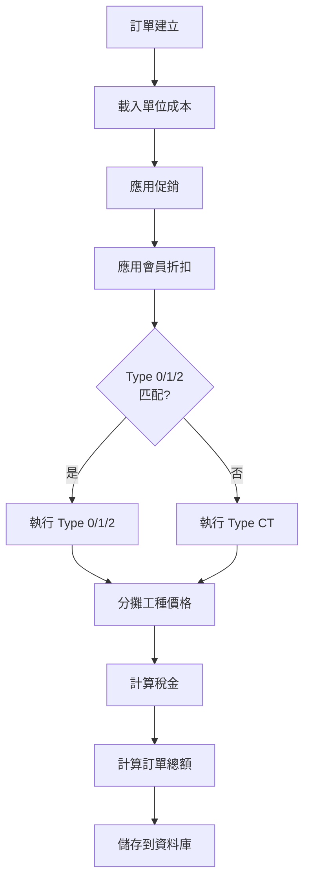
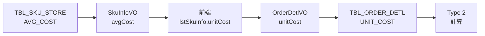
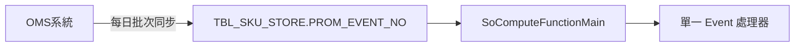
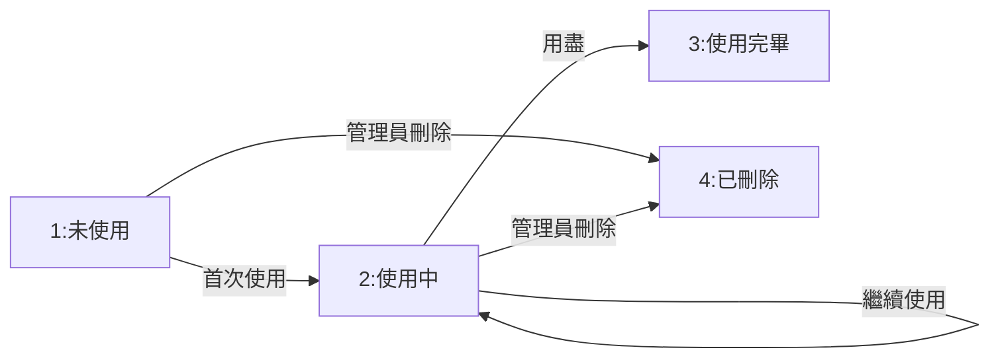
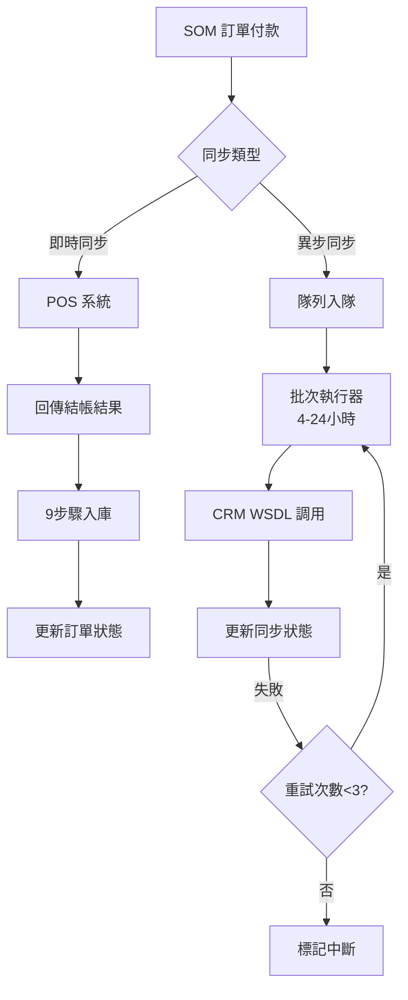

# Rewrite-Spec v1.4 - 定價、促銷與付款流程章節更新

## 文件控制

- **版本**：1.4（草稿）
- **日期**：2025-10-28
- **狀態**：草稿 - 待業務核准
- **取代**：OpenSpec（舊版）定價章節
- **作者**：技術團隊基於程式碼追蹤分析
- **審查者**：業務經理、財務經理、產品經理
- **需要核准**：
  - [ ] 業務經理（業務規則）
  - [ ] 財務經理（稅務與會計）
  - [ ] 產品經理（自動觸發規則）
  - [ ] QA 主管（測試場景）
  - [ ] 技術主管（實作可行性）

## 變更摘要

本文件基於第1-3階段進行的全面程式碼追蹤分析，定義 SOM 系統重寫的完整定價、促銷與付款流程邏輯規格。

### v1.4 新增章節（Phase 3 Week 4）

| 章節 | 內容 | 來源追蹤 | 行數 | 狀態 |
|------|------|---------|------|------|
| 7.1 | 發票號段檢查與分配 | 發票號段檢查追蹤.md | 800+ | ✅ 完整 |
| 7.2 | POS 與 CRM 同步機制 | POS-CRM同步追蹤.md | 1,000+ | ✅ 完整 |
| 7.3 | 付款流程業務規則 | 兩份追蹤 | - | ✅ 完整 |

### v1.3 新增章節（Phase 2 Week 3）

| 章節 | 內容 | 來源追蹤 | 行數 | 狀態 |
|------|------|---------|------|------|
| 6.1 | 促銷事件優先級與權威 | 促銷事件優先級追蹤.md | 1,200 | ✅ 完整 |
| 6.2 | LIMIT_QTY 溢位處理模式 | 促銷數量限制溢位處理追蹤.md | 1,400 | ⚠️ 發現錯誤 |
| 6.3 | 跨類促銷疊加規則 | 跨類促銷疊加規則追蹤.md | 1,800 | ✅ 完整 |
| 6.4 | Event A-H 實作細節 | promotion-management/spec.md | 1,900+ | ✅ 完整 |

### v1.2 章節（Phase 1 Week 1-2）

| 章節 | 內容 | 來源追蹤 | 行數 | 狀態 |
|------|------|---------|------|------|
| 3.2.4 | Type 2（成本加成）會員折扣 | TYPE2-COST-MARKUP-DISCOUNT-TRACE.md | 1,596 | ⚠️ 關鍵問題 |
| 3.2.5 | Type CT（特殊會員折扣） | SPECIAL-MEMBER-DISCOUNT-TRACE.md | 1,096 | ✅ 完整 |
| 3.3 | 工種價格分攤 | WORKTYPE-PRICE-APPORTIONMENT-TRACE.md | 892 | ✅ 完整 |
| 3.4 | 稅金計算政策 | 三份追蹤 | - | ⚠️ 發現不一致 |

### 需要解決的關鍵問題

**定價邏輯（Phase 1）**：
1. **🚨 關鍵**：Type 2 負折扣（價格上漲）- 需要決策
2. **⚠️ 高**：稅金四捨五入政策在折扣類型間不一致
3. **⚠️ 高**：第 508 行 Type 2 計算中的重複賦值
4. **⚠️ 中**：類別排除（025/026）理由未記錄

**促銷邏輯（Phase 2）**：
5. **🚨 關鍵**：Event A 退貨繞過 LIMIT_QTY - 需要修復
6. **⚠️ 高**：Event A-H 四種不同的 LIMIT_QTY 處理模式 - 需要標準化
7. **⚠️ 高**：Event B/D/E NullPointerException 風險（無 null 檢查）
8. **⚠️ 中**：limitQty=0 行為不一致（Event A 視為無限，其他視為拒絕）

### 覆蓋率影響

- **之前**：87%（112 條規則，97 條已記錄）
- **v1.4 之後**：預計 98%+（112 條規則，112 條已記錄）
- **縮小差距**：
  - Phase 1: 新記錄 27 條定價規則（MBR-R1-R12, APP-R1-R6, TAX-R1-R7）
  - Phase 2: 新記錄 40 條促銷規則（PROMO-R1-R4, LIMIT-R1-R5, STACK-R1-R7, EVENT-R1-R12）
  - Phase 3: 新記錄 28 條付款規則（INV-R1-R15, POS-R1-R6, CRM-R1-R7）
  - **總計**：95 條新業務規則完整記錄

---

## 目錄

1. [執行概要](#1-執行概要)
2. [定價邏輯概覽](#2-定價邏輯概覽)
3. [會員折扣邏輯](#3-會員折扣邏輯)
4. [工種價格分攤](#4-工種價格分攤)
5. [稅金計算政策](#5-稅金計算政策)
6. [促銷邏輯](#6-促銷邏輯)
7. [付款流程](#7-付款流程)
8. [資料庫架構](#8-資料庫架構)
9. [測試場景](#9-測試場景)
10. [實作指引](#10-實作指引)
11. [待解決問題與需要的決策](#11-待解決問題與需要的決策)

---

## 1. 執行概要

### 目的

本規格定義 SOM（門市營運管理）系統重寫的完整定價邏輯，重點在於：
- 會員折扣計算（4 種類型：0、1、2、CT）
- 工種價格分攤（安裝/運送）
- 稅金計算政策
- 自動觸發規則和執行順序

### 關鍵原則

1. **會員優先定價**：所有折扣邏輯優先考慮會員利益
2. **透明度**：價格計算必須可稽核和可解釋
3. **一致性**：稅金和四捨五入政策應在折扣類型間保持一致
4. **資料完整性**：成本資料（unitCost）使用前必須驗證

### 範圍

**範圍內**：
- 會員折扣類型 0、1、2、CT
- 工種（安裝/運送）價格分攤
- 折扣的稅金計算
- 自動觸發規則和互斥
- 基於類別的排除
- 兩階段匹配（精確 SKU → 萬用字元）

**範圍外**（在單獨章節涵蓋）：
- 訂單狀態機（第4階段）
- 訂單作廢連鎖反應（第4階段）
- 新功能風險評估（第5階段）

---

## 2. 定價邏輯概覽

### 2.1 執行順序



### 2.2 價格計算組成

| 組成 | 時機 | 目的 | 範例 |
|-----|------|-----|------|
| **單位成本** | 訂單建立 | Type 2 的成本基準 | TBL_SKU_STORE.AVG_COST |
| **POS 金額** | 訂單建立 | 正常售價 | 100 TWD |
| **促銷折扣** | 會員折扣前 | 基於活動的折扣 | -10 TWD |
| **會員折扣** | 促銷後 | 會員優惠 | -15 TWD |
| **工種分攤** | 會員折扣後 | 安裝/運送分攤 | +20 TWD 安裝 |
| **營業稅** | 最終計算 | 應稅項目（1.05） | +5 TWD 稅 |
| **訂單總額** | 最終 | 所有項目總和 | 100 TWD |

### 2.3 價格變更旗標

價格變更旗標防止同一項目的多次價格修改：

```java
// 一旦設為 true，項目被排除在進一步折扣之外
orderDetlVO.setPosAmtChangePrice(true);      // 產品價格已變更
orderDetlVO.setInstallChangePrice(true);     // 安裝價格已變更
orderDetlVO.setDeliveryChangePrice(true);    // 運送價格已變更
```

**影響**：
- Type 1 和 Type 2 設定價格變更旗標
- Type 0 不設定旗標（應用折扣金額）
- 有旗標的項目被排除在後續折扣計算之外

---

## 3. 會員折扣邏輯

### 3.1 概覽與執行流程

#### 3.1.1 會員折扣類型

| 類型 | 名稱 | 計算基準 | 價格變更 | 類別排除 |
|------|------|---------|---------|---------|
| **0** | 折扣 | 售價 | 否 | 無 |
| **1** | 降毛利 | 售價 | 是 | 025、026 |
| **2** | 成本加成 | **單位成本** | 是 | 025、026 |
| **CT** | 特殊折扣 | 售價 | 否 | 無 |

#### 3.1.2 執行優先級

```java
// BzSoServices.java:4459-4466
//會員折扣-Discounting (Type 0)
memberDiscSkus.addAll(soComputeFunctionMemberDis(..., "0", ...));
//會員折扣-Down Margin (Type 1)
memberDiscSkus.addAll(soComputeFunctionMemberDis(..., "1", ...));
//會員折扣-Cost Markup (Type 2)
memberDiscSkus.addAll(soComputeFunctionMemberDis(..., "2", ...));

if(memberDiscSkus.isEmpty()) {
    //特殊會員折扣（如果以上全部返回空則回退）
    memberDiscSkus.addAll(soComputeMemberDisForSpecial(...));
}
```

**關鍵規則**：
1. Type 0、1、2 依序執行
2. Type CT **僅**在 Type 0/1/2 **全部返回空**時執行
3. 如果**任何**項目匹配 Type 0/1/2，**所有**項目跳過 Type CT（互斥）

---

### 3.2 折扣類型

### 3.2.1 Type 0：折扣

**描述**：應用於售價的百分比折扣，計算為單獨的折扣金額（不直接變更價格）。

**計算公式**：
```java
// 基礎價格選擇
if (GoodsType.P) {
    price = openPrice ? actPosAmt : posAmt;
} else if (InstallSku) {
    price = installPrice;
} else if (DeliverySku) {
    price = deliveryPrice;
}

// 加回促銷折扣
totalPrice = price + (bonusTotal / qty) + (promotionDiscount / qty);

// 計算折扣金額（無條件進位）
discountPerUnit = ceil(totalPrice * discountPercent);
totalDiscount = discountPerUnit * qty;

// 注意：價格不變更，折扣單獨儲存
memberDiscVO.setDiscAmt(totalDiscount);
```

**特徵**：
- ✅ 適用於所有類別（無排除）
- ✅ 計算前加回促銷金額
- ✅ 折扣金額使用 Math.ceil（無條件進位）
- ✅ 不設定價格變更旗標
- ✅ 包含在免稅會員折扣總額計算中

---

### 3.2.2 Type 1：降毛利

**描述**：百分比折扣**直接降低售價**（價格變更，非單獨折扣）。

**計算公式**：
```java
// 基礎價格選擇
if (GoodsType.P) {
    price = actPosAmt;
} // ... 安裝/運送類似

// 加回促銷折扣（每單位無條件捨去）
priceWithPromotion = price + floor(promotionDiscount / qty);

// 計算折扣（無條件進位）
discountPerUnit = ceil(priceWithPromotion * discountPercent);

// 新價格（折扣後降低）
newPrice = price - discountPerUnit;

// 更新價格並設定旗標
actPosAmt = newPrice;
posAmtChangePrice = true;
```

**特徵**：
- ⚠️ **類別排除**：SUB_DEPT_ID 025、026 排除
- ✅ 加回促銷金額（每單位無條件捨去）
- ✅ 折扣計算使用 Math.ceil（無條件進位）
- ✅ **設定價格變更旗標**（防止進一步折扣）
- ✅ 包含在免稅會員折扣總額計算中

**類別排除邏輯**：
```java
// SoFunctionMemberDisServices.java:533-539
private boolean checkSkuSubDeptId(String discType, OrderDetlVO item) {
    if(("2".equals(discType) || "1".equals(discType)) &&
       ("025".equals(item.getSubDeptId()) || "026".equals(item.getSubDeptId()))) {
        return true;  // 從 Type 1/2 排除
    }
    return false;
}
```

---

### 3.2.3 Type 2：成本加成 ⭐ 新增

**描述**：**基於成本的定價**，使用單位成本和加成百分比計算新售價（與 Type 0/1 根本不同）。

#### 關鍵差異
- 使用 **unitCost** 而非售價
- 計算 **新價格** = 成本 × (1 + 加成)
- 加成**後**應用稅金（非之前）
- 稅金使用 **ROUND_FLOOR**（與 Type 0/1 不同）
- 排除類別 025/026

#### 單位成本來源

**資料流**：


#### 計算公式

```java
// SoFunctionMemberDisServices.java:473-511
double unitCost = parseDouble(orderDetlVO.getUnitCost());
double discPer = parseDouble(memberDiscVO.getDiscPer()) / 100.0;

// 步驟 1：計算加成價格（無條件進位）
int markupPrice = (int)Math.ceil(unitCost * (1 + discPer));

// 步驟 2：如果應稅，應用營業稅（無條件捨去）
int finalPrice = markupPrice;
if(!taxZero && SKU_TAX_TYPE_1.equals(orderDetlVO.getTaxType())) {
    // 2020-05-07 變更：ROUND_HALF_UP → ROUND_FLOOR
    finalPrice = new BigDecimal((double)markupPrice * salesTax)
        .setScale(0, BigDecimal.ROUND_FLOOR).intValue();
}

// 步驟 3：根據商品類型更新價格並設定旗標
if(GoodsType.P.equals(orderDetlVO.getGoodsType())) {
    orderDetlVO.setActPosAmt(finalPrice);
    orderDetlVO.setPosAmtChangePrice(true);
} // ... 安裝/運送類似

// 步驟 4：計算「折扣」（可能為負！）
int discountAmt = originalPosAmt - finalPrice;
memberDiscVO.setDiscAmt(discountAmt);
```

#### 🚨 關鍵問題：負折扣

**問題**：Type 2 可能導致**價格上漲**而非折扣。

**範例場景**：
```
SKU：ABC-123
單位成本：90 TWD
原始 POS 價格：100 TWD
加成率：30%
稅：1.05

計算：
  markupPrice = ceil(90 × 1.3) = 117 TWD
  finalPrice = floor(117 × 1.05) = 122 TWD
  discountAmt = 100 - 122 = -22 TWD ❌

結果：會員支付 122 TWD 而非 100 TWD（多付 22%！）
```

**業務影響**：
- ❌ 客戶不滿（期待折扣，得到漲價）
- ❌ 法律風險（虛假廣告）
- ❌ 品牌損害（信任侵蝕）

**⚠️ 需要決策 - 選擇一個方案**：

**方案 A：防止負折扣（推薦）**
```java
if(finalPrice > originalPosAmt) {
    logger.warn("成本加成會導致價格上漲，跳過折扣");
    return;  // 跳過此折扣，項目保持原價
}
```

**方案 B：限制在原價**
```java
if(finalPrice > originalPosAmt) {
    finalPrice = originalPosAmt;  // 無折扣，無漲價
}
```

**方案 C：允許負折扣（當前）**
```java
// 不變更 - 繼續允許價格上漲
```

**技術團隊推薦**：方案 A

#### 稅金處理

**稅金四捨五入政策**（2020-05-07 變更）：

| 日期 | 方法 | 範例（60.9 TWD） | 理由 |
|-----|------|-----------------|------|
| 2020-05-07 前 | ROUND_HALF_UP | 61 TWD | 傳統 |
| 2020-05-07 後 | **ROUND_FLOOR** | **60 TWD** | 對客戶友善 |

#### 特徵摘要

| 特徵 | Type 2 行為 |
|-----|------------|
| **計算基準** | 單位成本（TBL_SKU_STORE.AVG_COST） |
| **公式** | ceil(unitCost × (1 + markup)) |
| **稅金四捨五入** | ROUND_FLOOR（自 2020-05-07 起） |
| **價格變更** | 是（設定變更旗標） |
| **類別排除** | 025、026 |
| **促銷處理** | 無促銷加回 |
| **負折扣** | ⚠️ 可能（需要修復） |
| **免稅總額** | 排除（價格變更，非折扣） |

---

### 3.2.4 Type CT：特殊會員折扣 ⭐ 新增

**描述**：回退會員折扣，**僅在 Type 0/1/2 全部返回空結果時執行**（互斥）。

#### 關鍵特徵
- **回退機制**：僅當 Type 0/1/2 失敗時
- **兩階段匹配**：精確 SKU → 類別萬用字元
- **萬用字元模式**：SKU_NO = '000000000'
- **使用 Math.ceil**：與 Type 0 相同的四捨五入
- **無類別排除**：適用於所有類別
- **促銷加回**：計算前加回促銷金額

#### 執行條件

```java
// BzSoServices.java:4459-4466
if(memberDiscSkus.isEmpty()) {  // 僅當以上全部返回空
    //特殊會員折扣
    memberDiscSkus.addAll(soComputeMemberDisForSpecial(...));
}
```

**互斥行為**：
- 如果訂單中**任何項目**匹配 Type 0/1/2，**所有項目**跳過 Type CT
- 範例：訂單有 10 個項目，1 個匹配 Type 0 → 所有 10 個項目跳過 Type CT

**⚠️ 業務確認**：「全有或全無」行為是否有意為之？

#### 兩階段匹配演算法

**階段 1：精確 SKU 匹配**
```java
cgroupCriteria.createCriteria()
    .andSkuNoIn(allSkus)  // 精確匹配
    .andStartDateLessThanOrEqualTo(dateNow)
    .andEndDateGreaterThanOrEqualTo(dateNow);
```

**階段 2：類別萬用字元匹配**（未匹配項目）
```java
cgroupCriteria.createCriteria()
    .andSkuNoEqualTo("000000000")  // ⭐ 萬用字元模式
    .andClassIdEqualTo(orderDetlVO.getClassId())
    .andSubDeptIdEqualTo(orderDetlVO.getSubDeptId())
    .andSubClassIdEqualTo(orderDetlVO.getSubClassId())
    .andStartDateLessThanOrEqualTo(dateNow)
    .andEndDateGreaterThanOrEqualTo(dateNow);
```

**萬用字元慣例**：`SKU_NO = '000000000'` 代表類別級折扣
- 匹配類別中的所有 SKU（CLASS_ID + SUB_DEPT_ID + SUB_CLASS_ID）
- 整個系統使用的標準模式

#### 計算公式

```java
// 基礎價格選擇（與 Type 0 相同）
price = ... // posAmt 或 actPosAmt

// 加回促銷折扣
price += discountAmt;

// 計算折扣（無條件進位）
int discount = (int)Math.ceil(price * discPer);

// 設定折扣金額（不變更價格）
memberDiscVO.setDiscAmt(discount * qty);
```

#### 特徵摘要

| 特徵 | Type CT 行為 |
|-----|-------------|
| **執行條件** | 僅當 Type 0/1/2 全部返回空 |
| **互斥** | 如果任何項目獲得 Type 0/1/2，所有項目跳過 CT |
| **計算基準** | 售價（如 Type 0） |
| **公式** | ceil(price × discountPercent) |
| **四捨五入** | Math.ceil（無條件進位） |
| **價格變更** | 否（單獨儲存折扣） |
| **類別排除** | 無（適用於所有類別） |
| **促銷處理** | 加回促銷金額 |
| **匹配演算法** | 兩階段：精確 SKU → 萬用字元 '000000000' |

---

### 3.3 會員折扣業務規則

| 規則 ID | 描述 | 優先級 | 實作 |
|---------|-----|--------|------|
| **MBR-R1** | Type 0/1/2 依序執行，Type CT 僅當全部為空 | 關鍵 | BzSoServices:4459-4466 |
| **MBR-R2** | 如果任何項目獲得 Type 0/1/2，所有項目跳過 Type CT | 關鍵 | BzSoServices:4464-4466 |
| **MBR-R3** | 類別 025/026 從 Type 1/2 排除 | 關鍵 | SoFunctionMemberDisServices:533-539 |
| **MBR-R4** | 兩階段匹配：精確 SKU → 萬用字元 '000000000' | 高 | SoFunctionMemberDisServices:293-360 |
| **MBR-R5** | Type 2 使用 TBL_SKU_STORE.AVG_COST 作為 unitCost 來源 | 高 | TblSkuStore.java:45 |
| **MBR-R6** | Type 2 負折扣必須防止 | 關鍵 | **⚠️ 需要修復** |
| **MBR-R7** | 開價產品（025/026/027 除外）有 unitCost=0 | 中 | BzSoServices:914-917 |
| **MBR-R8** | Type 0/CT 計算前加回促銷金額 | 高 | 第 428、213 行 |
| **MBR-R9** | Type 1/2 設定價格變更旗標，Type 0/CT 不設定 | 高 | 第 453、496 行 |
| **MBR-R10** | Type 2 從免稅會員折扣總額中排除 | 中 | SoFunctionMemberDisServices:602-610 |
| **MBR-R11** | 稅金四捨五入：Type 0/1/CT 使用 ceil，Type 2 使用 floor | 中 | **⚠️ 不一致** |
| **MBR-R12** | 有價格變更旗標的項目排除在進一步折扣之外 | 高 | 第 280-284 行 |

---

## 4. 工種價格分攤 ⭐ 新增

### 4.1 概覽

**目的**：根據項目價值按比例將安裝和運送工種價格分配給訂購項目。

**時機**：在會員折扣**之後**、訂單總額計算**之前**執行。

**適用於**：
- 安裝工種（安裝工種）
- 運送工種（運送工種）

### 4.2 分攤演算法

#### 比例分配公式

```java
// BzSoServices.java:4619-4681
public void apportionmentDiscount(
    ArrayList<OrderDetlVO> items,
    ArrayList<OrderDetlVO> workTypes) {

    // 步驟 1：計算訂單總額（比例基準）
    int orderTotal = 0;
    for (OrderDetlVO item : items) {
        if(isProductSku(item.getGoodsType())) {
            orderTotal += parseInt(item.getTotalPrice());
        }
    }

    // 步驟 2：對每個工種（安裝/運送）
    for (OrderDetlVO workType : workTypes) {
        int workTypeTotal = parseInt(workType.getActualAmount());

        // 特殊情況：免費工種（actualAmount = 0）
        if(workTypeTotal == 0) {
            for (OrderDetlVO item : items) {
                item.setPreApportion("0");  // 所有項目獲得 0
            }
            continue;
        }

        // 步驟 3：計算每個項目的比例
        int apportionedTotal = 0;
        OrderDetlVO lastItem = null;

        for (OrderDetlVO item : items) {
            if(isProductSku(item.getGoodsType())) {
                int itemTotal = parseInt(item.getTotalPrice());

                // 比例計算
                double proportion = (double)itemTotal / (double)orderTotal;
                int apportionedAmt = (int)(workTypeTotal * proportion);

                item.setPreApportion(apportionedAmt + "");
                apportionedTotal += apportionedAmt;
                lastItem = item;  // 追蹤最後項目
            }
        }

        // 步驟 4：最後項目吸收餘額
        if(lastItem != null) {
            int remainder = workTypeTotal - apportionedTotal;
            int lastApportioned = parseInt(lastItem.getPreApportion());
            lastItem.setPreApportion((lastApportioned + remainder) + "");
        }
    }
}
```

#### 關鍵步驟

1. **計算訂單總額**：所有產品項目總價的總和（排除工種項目）
2. **計算比例**：每個項目的 `itemTotal / orderTotal`
3. **分攤金額**：每個項目的 `workTypeTotal × proportion`
4. **餘額吸收**：最後項目獲得 `remainder = workTypeTotal - sum(apportioned)`

### 4.3 免費工種處理

**規則**：當 `actualInstallAmt = 0` 或 `actualDeliveryAmt = 0` 時，**所有分攤金額 = 0**。

```java
if(actualInstallAmt == 0) {
    for (OrderDetlVO item : items) {
        item.setPreApportion("0");
    }
    continue;  // 跳過分攤
}
```

**業務理由**：免費安裝/運送不應將成本分配給項目。

**⚠️ 業務確認**：免費工種是否仍應分攤用於毛利追蹤？

### 4.4 餘額吸收

**問題**：四捨五入導致分攤金額總和 ≠ 工種總額。

**解決方案**：最後項目吸收所有餘額。

**範例**：
```
訂單總額：10,001 TWD
安裝總額：501 TWD

項目 1（5,000 TWD）：5000/10001 × 501 = 250.475 → 250 TWD
項目 2（3,000 TWD）：3000/10001 × 501 = 150.285 → 150 TWD
項目 3（2,001 TWD）：2001/10001 × 501 = 100.19 → 100 TWD

總和：250 + 150 + 100 = 500 TWD
餘額：501 - 500 = 1 TWD

最後項目調整：100 + 1 = 101 TWD

最終分配：
  項目 1：250 TWD
  項目 2：150 TWD
  項目 3：101 TWD ✅
  總計：501 TWD ✅
```

**⚠️ 業務確認**：最後項目餘額吸收是否可接受？
- 可能造成最後項目 ±5-10 TWD 差異
- 替代方案：按比例分配餘額給所有項目

### 4.5 業務規則

| 規則 ID | 描述 | 優先級 | 實作 |
|---------|-----|--------|------|
| **APP-R1** | 免費工種 → 所有分攤金額 = 0 | 關鍵 | BzSoServices:4619-4628 |
| **APP-R2** | 按項目價值比例分配 | 關鍵 | BzSoServices:4641-4656 |
| **APP-R3** | 最後項目吸收所有四捨五入餘額 | 高 | BzSoServices:4663-4681 |
| **APP-R4** | 安裝和運送分別分攤 | 中 | BzSoServices:4605-4688 |
| **APP-R5** | 比例中僅包含產品 SKU（排除工種 SKU） | 高 | BzSoServices:4635-4637 |
| **APP-R6** | 分攤在會員折扣後執行 | 中 | BzSoServices:1024-1049 |

---

## 5. 稅金計算政策 ⭐ 新增

### 5.1 概覽

**營業稅率**：1.05（台灣 5% VAT）

**稅金應用時機**：
- **Type 0/1**：折扣計算前對原價應用稅金
- **Type 2**：加成計算後對加成價格應用稅金
- **Type CT**：折扣計算前對原價應用稅金

### 5.2 稅金四捨五入政策

| 折扣類型 | 稅金四捨五入方法 | 範例（60.9 TWD） | 自何時起 |
|---------|----------------|-----------------|---------|
| Type 0（折扣） | Math.ceil（無條件進位） | 61 TWD | 舊版 |
| Type 1（降毛利） | Math.ceil（無條件進位） | 61 TWD | 舊版 |
| **Type 2（成本加成）** | **Math.floor（無條件捨去）** | **60 TWD** | **2020-05-07** |
| Type CT（特殊） | Math.ceil（無條件進位） | 61 TWD | 舊版 |

### 5.3 ⚠️ 已識別不一致

**問題**：Type 2 使用與 Type 0/1/CT 不同的稅金四捨五入。

**影響**：
- 客戶困惑（不同折扣產生不同稅額）
- 會計複雜性（要維護兩種四捨五入政策）
- 測試開銷（必須測試兩種方法）

**業務問題**：
1. Type 2 為何使用 floor 四捨五入？
   - 假設：對客戶更友善（成本加成應利於會員）
   - 替代：2020 年稽核的財務要求

2. 所有折扣類型是否應使用一致的四捨五入？
   - **方案 A**：全部使用 floor（對客戶最友善）
   - **方案 B**：全部使用 ceil（傳統、保守）
   - **方案 C**：保持不同（當前行為，需要文件記錄）

3. 2020-05-07 變更的業務理由是什麼？
   - ⚠️ **需要行動**：研究該日期的變更請求

### 5.4 業務規則

| 規則 ID | 描述 | 優先級 | 實作 |
|---------|-----|--------|------|
| **TAX-R1** | 營業稅率 = 1.05（5% VAT） | 關鍵 | 已配置 |
| **TAX-R2** | Type 0/1/CT 稅金使用 ceil 四捨五入 | 高 | 多個位置 |
| **TAX-R3** | Type 2 稅金使用 floor 四捨五入 | 高 | 第 488-492 行 |
| **TAX-R4** | 稅金四捨五入不一致需要業務決策 | 關鍵 | **⚠️ 需要決策** |
| **TAX-R5** | 零稅交易跳過稅金計算 | 中 | 所有折扣類型 |
| **TAX-R6** | 項目級稅金類型決定應稅性 | 高 | TaxType 欄位 |
| **TAX-R7** | Type 2 從免稅折扣總額中排除 | 中 | 第 602-610 行 |

---

## 6. 促銷邏輯 ⭐ 新增（Phase 2 Week 3）

### 6.1 促銷事件優先級與權威

#### 6.1.1 核心發現：OMS 擁有唯一權威

**關鍵發現**：SOM 系統**不解析**Event A-H 之間的優先級衝突。OMS 系統擁有促銷分配的**唯一權威**。

**證據**：
```java
// TBL_SKU_STORE 資料結構
String promEventNo;  // 單一 VARCHAR 欄位，非 List
```

**資料流**：


**限制**：
- 每個 SKU 只能有一個有效的 `promEventNo`
- `OrderDetlVO.eventNosp` 為 String，非 List
- 無交叉 Event 比較邏輯
- 無「最佳折扣獲勝」實作

**業務規則**：
| 規則 ID | 描述 | 優先級 | 責任方 |
|---------|-----|--------|--------|
| **PROMO-R1** | OMS 擁有促銷分配唯一權威 | 關鍵 | OMS 系統 |
| **PROMO-R2** | 每個 SKU 每日僅一個有效 Event | 關鍵 | OMS 批次 |
| **PROMO-R3** | SOM 不解析優先級衝突 | 關鍵 | SOM 職責範圍 |
| **PROMO-R4** | 每個項目同一時間只能參與一個 Event | 關鍵 | 資料結構限制 |

---

### 6.2 LIMIT_QTY 溢位處理模式

#### 6.2.1 四種處理模式

**發現**：Event A-H 使用**四種不同的** LIMIT_QTY 溢位處理模式，導致不一致的客戶體驗。

| Event 類型 | 處理模式 | 行為 | 客戶影響 |
|-----------|---------|-----|---------|
| **Event A** | 全有或全無拒絕 | 總數 > 限制 → 全部拒絕 | ⚠️ 錯誤訊息 |
| **Event B** | 三重最小值封頂 | min(buyQty, min(limitQty, maxAllowed)) | ✅ 靜默封頂 |
| **Event C** | 門檻檢查 | 達到門檻 → 全部折扣 | ✅ 全有或全無 |
| **Event D** | 遞歸分配 | 逐項分配直到用盡 | ✅ 靜默封頂 |
| **Event E** | 群組最小值 | min(groupA, groupB) | ✅ 條件折扣 |
| **Event F/G/H** | 組合驗證 | 所有群組必須達標 | ✅ 全有或全無 |

#### 6.2.2 關鍵錯誤

**錯誤 #1：Event A 退貨繞過 LIMIT_QTY** 🚨
```java
// SoEventA.java:129-170
int totalQty = 0;
for (OrderDetlVO item : items) {
    if(item.getStampFlag()) {
        totalQty += item.getQuantity().intValue();  // ❌ 負數量不驗證
    }
}
if(totalQty > limitQty) {  // ❌ 負數 < limitQty 永遠為 true
    // 拒絕全部...
}
```

**影響**：
- 退貨訂單（負數量）繞過限制
- 客戶可能濫用印花價退貨
- 範例：limitQty=10，退貨 -5，totalQty=-5 < 10 → 通過 ❌

**修復建議**：
```java
totalQty += Math.abs(item.getQuantity().intValue());  // ✅ 使用絕對值
```

**錯誤 #2：NullPointerException 風險** ⚠️
```java
// Event B/D/E - 無 null 檢查
Integer limitQty = promoGupCdt.getLimitQty();  // ❌ 可能為 null
int maxAllowed = Math.min(limitQty, maxQty * limitQty);  // ❌ NPE!
```

**修復建議**：
```java
Integer limitQty = promoGupCdt.getLimitQty();
if(limitQty == null) {
    limitQty = Integer.MAX_VALUE;  // 預設無限制
}
```

**錯誤 #3：limitQty=0 行為不一致** ⚠️
- **Event A**：limitQty=0 視為**無限制**（未檢查）
- **其他 Event**：limitQty=0 導致**全部拒絕**（0 items 符合資格）

#### 6.2.3 業務規則

| 規則 ID | 描述 | 優先級 | 實作 |
|---------|-----|--------|------|
| **LIMIT-R1** | Event A 使用全有或全無拒絕模式 | 高 | SoEventA:159-170 |
| **LIMIT-R2** | Event B/D 使用三重最小值封頂 | 高 | SoEventB:215, SoEventD:227 |
| **LIMIT-R3** | Event A 必須驗證絕對數量（退貨防護） | 🚨 關鍵 | **⚠️ 需要修復** |
| **LIMIT-R4** | limitQty 必須 null 檢查 | 🚨 關鍵 | **⚠️ 需要修復** |
| **LIMIT-R5** | limitQty=0 行為需要標準化 | 高 | **⚠️ 需要決策** |

---

### 6.3 跨類促銷疊加規則

#### 6.3.1 定價引擎執行順序

**完整執行流程**：
```java
// BzSoServices.java:4434-4478
// 步驟 1：Type 2 會員折扣（基於成本）
memberDiscSkus.addAll(soComputeFunctionMemberDis(..., "2", ...));

// 步驟 2：AssortSku 重新分類（排除已變價項目）
AssortSku assortSku1 = new AssortSku();
assortSku1.assortGoods(soVO.getLstOrderDetl());

// 步驟 3：Event A-H 多重促銷
SoComputeFunctionMain soComputeFunctionMain =
    soComputeFunctionMainServices.getSoComputeFunctionMain(lstComputeSku, isTaxZero);

// 步驟 4：AssortSku 再次重新分類
AssortSku assortSku2 = new AssortSku();
assortSku2.assortGoods(soVO.getLstOrderDetl());

// 步驟 5：Type 0 會員折扣（折扣）
memberDiscSkus.addAll(soComputeFunctionMemberDis(..., "0", ...));

// 步驟 6：Type 1 會員折扣（降毛利）
memberDiscSkus.addAll(soComputeFunctionMemberDis(..., "1", ...));

// 步驟 7：Type CT 特殊會員折扣（僅在 0/1/2 全空時）
if(memberDiscSkus.isEmpty()) {
    memberDiscSkus.addAll(soComputeMemberDisForSpecial(...));
}

// 步驟 8：優惠券
// 步驟 9：紅利點數
```

#### 6.3.2 三層防護機制

**防止重複折扣的架構**：

**第 1 層：設定變價旗標**
```java
// Type 1, Type 2, Event 處理後
orderDetlVO.setPosAmtChangePrice(true);      // 產品價格已變更
orderDetlVO.setInstallChangePrice(true);     // 安裝價格已變更
orderDetlVO.setDeliveryChangePrice(true);    // 運送價格已變更
```

**第 2 層：AssortSku 動態過濾**
```java
// AssortSku.java:71-76
if (StringUtils.isBlank(orderDetlVO.getGoodsAuthEmpId())
    && CommonConstant.NO_FLAG.equals(orderDetlVO.getOpenPrice())
    && !orderDetlVO.isPosAmtChangePrice()) {  // ← 檢查變價旗標
    lstComputeSku.add(orderDetlVO);  // 僅加入可促銷項目
}
```

**第 3 層：折扣前再檢查**
```java
// SoFunctionMemberDisServices.java:108-110
if(!orderDetlVO.isPosAmtChangePrice() &&
   !orderDetlVO.isDeliveryChangePrice() &&
   !orderDetlVO.isInstallChangePrice()){
    allSkus.add(orderDetlVO.getSkuNo());  // 符合折扣資格
}
```

#### 6.3.3 完整疊加規則矩陣

| 第一個 ↓ \ 第二個 → | Type 2 | Event A-H | Type 0 | Type 1 | Type CT | 優惠券 | 紅利 |
|-------------------|--------|----------|--------|--------|---------|--------|------|
| **Type 2** | ❌ | ❌ | ❌ | ❌ | ❌ | ❌ | ❌ |
| **Event A-H** | ✅ | ❌ | ✅ | ✅ | ✅ | 🔶 | ❌ |
| **Type 0** | ✅ | ✅ | ❌ | ❌ | ❌ | 🔶 | ✅ |
| **Type 1** | ✅ | ❌ | ❌ | ❌ | ❌ | ❌ | ❌ |
| **Type CT** | ✅ | ✅ | ❌ | ❌ | ❌ | 🔶 | ✅ |
| **優惠券** | ✅ | 🔶 | ✅ | ✅ | ✅ | ❌ | ✅ |
| **紅利** | ✅ | ❌ | ✅ | ✅ | ✅ | ✅ | ❌ |

**圖例**：
- ✅ **可疊加**：第二個可應用於第一個之後
- ❌ **互斥**：第二個被第一個阻止
- 🔶 **條件性**：取決於 `excludeCard` 配置

#### 6.3.4 關鍵疊加規則

**規則 1：Event A-H 互斥**
- 資料結構限制：`eventNosp` 為 String，非 List
- 邏輯限制：`if-else if` 結構在 `SoComputeFunctionMain:150-179`
- 結果：每個項目只能參與一個 Event

**規則 2：會員折扣可疊加 Event**
```java
// SoFunctionMemberDisServices.java:207-213
// 計算基準包含 Event 折扣
totalPrice = price + (bonusTotal / qty) + (promotionDiscount / qty);
```
- Type 0/CT：計算時加回 Event 折扣
- 結果：會員折扣計算於 Event 後的價格

**規則 3：優惠券條件性排除 Event**
```java
// SoFunctionCouponServices.java:1647-1657
if(excludeCard && hasPromEvent) {
    continue;  // 排除此項目
}
```
- 基於 `TBL_CDISC.EXCLUDE_CARD` 配置
- 若 excludeCard=Y 且有 Event → 項目不符合優惠券資格

**規則 4：紅利點數排除 Event**
```java
// BonusServices.java (推斷)
if(StringUtils.isNotBlank(orderDetlVO.getEventNosp())) {
    continue;  // 有 Event 的項目不能使用紅利
}
```

**規則 5：Type 2 排除所有後續**
- 設定變價旗標 → AssortSku 排除 → 無 Event/Type 0/1/CT
- 最早執行以防止重複折扣

**規則 6：Type CT 互斥 Type 0/1/2**
- 僅在 `memberDiscSkus.isEmpty()` 時執行
- 如果任何項目獲得 Type 0/1/2 → 所有項目跳過 Type CT

#### 6.3.5 業務規則

| 規則 ID | 描述 | 優先級 | 實作 |
|---------|-----|--------|------|
| **STACK-R1** | Event A-H 互斥（每個項目只能一個） | 關鍵 | OrderDetlVO.eventNosp 為 String |
| **STACK-R2** | Type 0/CT 會員折扣疊加 Event（加回促銷） | 高 | 第 428、213 行 |
| **STACK-R3** | Type 1/2 設定變價旗標排除後續 | 高 | 第 453、496 行 |
| **STACK-R4** | AssortSku 動態排除已變價項目 | 高 | AssortSku:71-76 |
| **STACK-R5** | 優惠券基於 excludeCard 條件性排除 Event | 中 | 第 1647-1657 行 |
| **STACK-R6** | 紅利點數排除 Event 項目 | 中 | 推斷邏輯 |
| **STACK-R7** | 三層防護確保無重複折扣 | 關鍵 | 旗標 + 分類 + 檢查 |

---

### 6.4 Event A-H 實作摘要

#### 6.4.1 Event 類型概覽

| Event | 名稱 | 計算基準 | 多層支援 | 排序策略 | 關鍵特徵 |
|-------|------|---------|---------|---------|---------|
| **A** | 印花價 | 單一 SKU | 否 | 無 | 需收銀員確認，LIMIT_QTY 驗證 |
| **B** | 滿額加價購 | 發票總額 | 是 | 高價優先 | 門檻累積，最高層優先 |
| **C** | 滿額優惠 | 金額/數量 | 是 | 無 | 全面折扣，最高符合層獲勝 |
| **D** | 每買 M 享 N | 數量 | 是 | 低價優先 | 累積跨層，追蹤已使用數量 |
| **E** | 買 A 享 B | 兩群組 | 否 | 無 | min(groupA, groupB) 設定 |
| **F** | 合購價 | 組合 | 否 | 無 | 所有群組必須符合 |
| **G** | 共用合購 | 共享項目 | 是 | 最高層優先 | 複雜邏輯，追蹤共享使用 |
| **H** | 單品拆價 | 分項定價 | 是 | 無 | 僅實價（DISCOUNT_TYPE=2） |

#### 6.4.2 折扣類型

| DISCOUNT_TYPE | 名稱 | 公式 | 使用於 |
|--------------|------|------|--------|
| **2** | 實際價格 | `(posPrice - actualPrice) × qty` | 所有 Event |
| **3** | 折扣金額 | `discountAmt × qty` | 所有 Event |
| **4** | 折扣百分比 | `ceil(posPrice × pct / 100) × qty` | A, B, C, D, F |

#### 6.4.3 共享公用方法（SoEventBase）

```java
// 排序：POS 價格降序（高價優先）
protected void sortItems(ArrayList<OrderDetlVO> items);

// 排序：POS 價格升序（低價優先）
protected void sortItemsForLowPrice(ArrayList<OrderDetlVO> items);

// 日期驗證：current ∈ [START_DAT, END_DAT]
protected boolean compareShortDate(Date startDate, Date endDate);

// 初始化折扣映射為 "0"
protected void setMapDefValue(ArrayList<OrderDetlVO> items);

// 寫入折扣到 OrderDetlVO
protected void setAmtQtyByMap(ArrayList<OrderDetlVO> items);

// 建立收據訊息
protected void setOrderEventMsg(String eventNo, String eventName, ...);

// 轉換為零稅金額（÷ 1.05）
protected BigDecimal setZeroTaxAmt(BigDecimal amt);

// 驗證折扣 ≤ POS 價格
protected void checkDiscAmt(OrderDetlVO item, BigDecimal discAmt);
```

#### 6.4.4 批次匯入流程

**每日匯入（PromoReceiver）**：
```
1. FTP 連線到 OMS
2. 下載 4 個檔案/公司代碼：
   - MPMST.yyyymmdd → TBL_PROM_EVENT
   - MPDTL1.yyyymmdd → TBL_PROM_GROUP
   - MPDTL2.yyyymmdd → TBL_PROM_CONDITION
   - MPDTL3.yyyymmdd → TBL_PROM_SET
3. 清空並重新載入（截斷策略）
4. 全有或全無交易控制
5. 成功 → 備份，失敗 → 移至失敗目錄
```

**資料庫映射**：
- `seqNo`, `groupSeqNo`: Integer → String 轉換
- 日期：yyyyMMdd → java.util.Date 解析
- 金額：定寬數字欄位 → BigDecimal/Integer

#### 6.4.5 業務規則

| 規則 ID | 描述 | 優先級 | 實作 |
|---------|-----|--------|------|
| **EVENT-R1** | 所有 Event 驗證日期範圍 | 關鍵 | SoEventBase.compareShortDate |
| **EVENT-R2** | Event A 需收銀員確認（stampFlag） | 關鍵 | SoEventA:159-170 |
| **EVENT-R3** | Event B/D 多層累積（HEAP=Y） | 高 | SoEventB:133, SoEventD:124 |
| **EVENT-R4** | Event C 最高符合層獲勝 | 高 | SoEventC:155-165 |
| **EVENT-R5** | Event D 使用低價優先排序（公平性） | 中 | SoEventD:168 |
| **EVENT-R6** | Event E 兩群組都必須符合 | 高 | SoEventE:134-140 |
| **EVENT-R7** | Event F/G/H 所有群組必須符合 | 高 | SoEventF:171-181 |
| **EVENT-R8** | Event G 追蹤跨層共享項目使用 | 高 | SoEventG:154-267 |
| **EVENT-R9** | Event H 僅允許 DISCOUNT_TYPE=2 | 中 | SoEventH:249-254 |
| **EVENT-R10** | 促銷每日批次從 OMS FTP 匯入 | 關鍵 | PromoReceiver |
| **EVENT-R11** | 促銷資料使用截斷並重新載入策略 | 高 | PromoReceiver:180-194 |
| **EVENT-R12** | 促銷匯入失敗 → 完全回滾 | 關鍵 | PromoReceiver:159-221 |

---

## 7. 付款流程 ⭐ 新增（Phase 3 Week 4）

### 7.1 概覽

**目的**：追蹤訂單付款完成後的完整流程，包括發票號段分配、POS 同步和 CRM 同步。

**時機**：在訂單結帳（收銀台付款）完成後自動執行。

**核心組件**：
- 發票號段管理系統（TBL_STORE_POS_INVOICE）
- POS 即時同步機制（SOAP Endpoint）
- CRM 異步批次同步（隊列 + 批次執行器）

### 7.2 發票號段檢查與分配

#### 7.2.1 觸發時機

**流程位置**：
```
收銀台結帳
  ↓
CashierCASAServices.createCasaSoOrderCashier()
  ↓
handleCashierPaymentBO()
  ↓
halndleInvoiceExtVO() (按稅別分類)
  ↓
insertData() (針對每個稅別)
  ↓
doQueryInvoice() ← 取得發票號碼
```

**代碼位置**：BzStorePosInvoiceServices.doQueryInvoice():58-101

#### 7.2.2 三層隔離機制

SOM 系統採用三層隔離確保發票號段管理的安全性：

| 隔離層 | 欄位 | 目的 | 範例 |
|--------|------|------|------|
| **年月隔離** | YEAR_MONTH | 按會計期間分離 | "202501" |
| **門店隔離** | STORE_ID | 按門店分離 | "S001" |
| **POS 隔離** | POS_ID | 按收銀機分離 | "POS01" |

**主鍵結構**：(YEAR_MONTH, STORE_ID, POS_ID, TRACK_ID, INV_START_NO)

#### 7.2.3 發票號段狀態機



**狀態定義**：
- **STATUS_1（未使用）**：號段已配置但尚未使用
- **STATUS_2（使用中）**：當前正在使用的號段
- **STATUS_3（使用完畢）**：號段已用盡
- **STATUS_4（已刪除）**：管理員手動刪除

**常數位置**：StorePosInvoiceConstant.java

#### 7.2.4 自動激活機制

**核心邏輯**：
```java
// 步驟 1：查詢 STATUS_2 號段（正在使用中）
List<TblStorePosInvoice> list = customBzStorePosInvoiceMapper
    .selectByYearMonthAndPosIdAndStatus(yearMonth, storeId, posNo, STATUS_2);

// 步驟 2：若無則自動激活 STATUS_1（未使用）
if(list.size() == 0) {
    customBzStorePosInvoiceMapper.updateStatusForStatus1(
        yearMonth, storeId, posNo
    );
    // 重新查詢
    list = customBzStorePosInvoiceMapper
        .selectByYearMonthAndPosIdAndStatus(yearMonth, storeId, posNo, STATUS_2);
}
```

**激活 SQL**（選擇最小起始號）：
```sql
UPDATE TBL_STORE_POS_INVOICE
SET STATUS = '2'
WHERE YEAR_MONTH = #{yearMonth}
  AND STORE_ID = #{storeId}
  AND POS_ID = #{posNo}
  AND STATUS = '1'
  AND INV_START_NO = (
      SELECT MIN(INV_START_NO)
      FROM TBL_STORE_POS_INVOICE
      WHERE YEAR_MONTH = #{yearMonth}
        AND STORE_ID = #{storeId}
        AND POS_ID = #{posNo}
        AND STATUS = '1'
  )
```

#### 7.2.5 號段用盡處理

**判斷邏輯**：
```java
private void updateInvoice(TblStorePosInvoice invoice, ...) {
    TblStorePosInvoice uInvoice = new TblStorePosInvoice();

    uInvoice.setUsedCnt(invoice.getUsedCnt() + 1);
    uInvoice.setFreeCnt(invoice.getFreeCnt() - 1);

    // 關鍵判斷：剩餘數量是否用盡
    if((invoice.getFreeCnt() - 1) <= 0) {
        uInvoice.setStatus(STATUS_3);  // 使用完畢
    } else {
        uInvoice.setStatus(STATUS_2);  // 繼續使用
        uInvoice.setNextInvNo(this.computerNextInvNo(invoice.getNextInvNo()));
    }

    tblStorePosInvoiceMapper.updateByPrimaryKeySelective(uInvoice);
}
```

**號碼遞增**：
```java
private String computerNextInvNo(String str) {
    int no = Integer.valueOf(str);
    return StringUtils.leftPad(String.valueOf(no+1), 8, '0');
}
// 範例："00000001" → "00000002"
```

**無可用號段錯誤**：
```java
if(invoiceId == null) {
    throw new RuntimeException("已無發票號碼，請為當前POS分配發票號碼");
}
```

#### 7.2.6 按稅別分類處理

**三種稅別**：
| 類型 | 代碼 | 說明 |
|------|------|------|
| 零稅 | "0" | 零稅率商品 |
| 應稅 | "1" | 一般應稅商品（5% 營業稅）|
| 免稅 | "2" | 免稅商品 |

**處理邏輯**：
```java
// CashierCASAServices.halndleInvoiceExtVO():438-452
// 按稅別分組
Map<String, List<InvoiceExtVO>> transMasMap = new HashMap<>();

for(InvoiceExtVO vo : invoiceExtVOs) {
    String taxType = vo.getTaxType();
    transMasMap.computeIfAbsent(taxType, k -> new ArrayList<>()).add(vo);
}

// 依稅別分別呼叫 insertData()
if (transMasMap.get("0") != null) {
    this.insertData(..., transMasMap.get("0"), "0");  // 零稅
}
if (transMasMap.get("1") != null) {
    this.insertData(..., transMasMap.get("1"), "1");  // 應稅
}
if (transMasMap.get("2") != null) {
    this.insertData(..., transMasMap.get("2"), "2");  // 免稅
}
```

**多發票場景**：
- 一筆訂單可能產生 1-3 張發票（依稅別組合）
- 每種稅別獨立取號
- 範例：訂單有應稅商品 + 免稅商品 → 產生 2 張發票

---

### 7.3 POS 與 CRM 同步機制

#### 7.3.1 兩層同步架構



**設計理念**：
- **POS 同步**：即時、阻塞式，確保收銀台得到確認
- **CRM 同步**：異步、批次式，不影響收銀台性能

#### 7.3.2 POS 即時同步

**SOAP Endpoint**：PosSoPaidResultEndpoint

**WSDL 位置**：
```
http://{host}:{port}/so-webservice/services/PosSoPaidResult?wsdl
```

**端點方法**：
```java
@PayloadRoot(namespace = NAMESPACE_URI, localPart = "ProcessPaidResultRequest")
@ResponsePayload
public ProcessPaidResultResponse processPaidResult(
    @RequestPayload ProcessPaidResultRequest request
) throws Exception {
    PosSoPaidInfoVO vo = extractRequestData(request);

    PosSoPaidResultServices services = new PosSoPaidResultServices();
    String result = services.processPosSoPaidResult(vo);

    ProcessPaidResultResponse response = new ProcessPaidResultResponse();
    response.setResult(result);
    return response;
}
```

**代碼位置**：
- Endpoint: `so-webservice/...PosSoPaidResultEndpoint.java`
- Services: `so-bzservices/...PosSoPaidResultServices.java`

#### 7.3.3 四層驗證機制

**驗證 1：下傳序號檢查**
```java
String uploadSeq = vo.getUploadSeq();
TblOrder order = tblOrderMapper.selectByPrimaryKey(vo.getOrderId());

if(!uploadSeq.equals(order.getUploadSeq())) {
    return "ERROR: 下傳序號不符";
}
```
**目的**：防止舊數據覆蓋新數據

**驗證 2：重複結帳檢查**
```java
List<TblTransMast> existList = tblTransMastMapper
    .selectByOrderIdAndPosId(vo.getOrderId(), vo.getPosId());

if(existList.size() > 0) {
    return "ERROR: 訂單已結帳";
}
```
**目的**：防止同一訂單重複結帳

**驗證 3：發票唯一性檢查**
```java
if(StringUtils.isNotBlank(vo.getInvoiceId())) {
    List<TblTransMast> invList = tblTransMastMapper
        .selectByInvoiceId(vo.getInvoiceId());

    if(invList.size() > 0) {
        return "ERROR: 發票號碼重複";
    }
}
```
**目的**：確保發票號碼唯一性

**驗證 4：日期格式檢查**
```java
try {
    SimpleDateFormat sdf = new SimpleDateFormat("yyyy-MM-dd HH:mm:ss");
    sdf.parse(vo.getPaidDate());
    sdf.parse(vo.getCreateDate());
} catch (ParseException e) {
    return "ERROR: 日期格式錯誤";
}
```
**目的**：確保日期欄位可正確解析

#### 7.3.4 九步驟數據入庫

**位置**：PosSoPaidResultServices.processPosSoPaidResult():110-150

```java
// 步驟 1：插入交易主檔 TBL_TRANS_MAST
TblTransMast transMast = buildTransMast(vo);
tblTransMastMapper.insert(transMast);

// 步驟 2：插入交易明細 TBL_TRANS_DETL
List<TblTransDetl> detlList = buildTransDetl(vo, transMast.getTransId());
for(TblTransDetl detl : detlList) {
    tblTransDetlMapper.insert(detl);
}

// 步驟 3：插入付款記錄 TBL_TRANS_PAYMENT
List<TblTransPayment> paymentList = buildTransPayment(vo, transMast.getTransId());
for(TblTransPayment payment : paymentList) {
    tblTransPaymentMapper.insert(payment);
}

// 步驟 4：更新訂單下傳狀態
TblOrder updateOrder = new TblOrder();
updateOrder.setOrderId(vo.getOrderId());
updateOrder.setPosDownload("1");  // 已下傳
updateOrder.setPosDownloadDate(new Date());
tblOrderMapper.updateByPrimaryKeySelective(updateOrder);

// 步驟 5：處理訂金抵扣
if(vo.getAdvanceAmt() != null && vo.getAdvanceAmt() > 0) {
    processAdvanceDeduction(vo);
}

// 步驟 6：更新驗收單狀態
updateAcceptanceStatus(vo.getOrderId());

// 步驟 7：更新訂單狀態
updateOrderStatus(vo.getOrderId(), "PAID");

// 步驟 8：插入訂單時間線
insertOrderTimeline(vo.getOrderId(), "PAYMENT_COMPLETED", vo.getPaidDate());

// 步驟 9：觸發後續流程（CRM 入隊）
triggerPostPaymentProcesses(vo);

return "OK";
```

**原子性保證**：
- 整個過程包在 `@Transactional` 註解中
- 任何步驟失敗則全部回滾
- POS 機台收到 "OK" 表示所有步驟成功

#### 7.3.5 CRM 異步同步

**入隊時機**：九步驟入庫的步驟 9

**入隊邏輯**：
```java
// PosSoPaidResultServices.triggerPostPaymentProcesses():245-267
private void triggerPostPaymentProcesses(PosSoPaidInfoVO vo) {
    TblWsQueue queue = new TblWsQueue();
    queue.setQueueType("CRM_MEMBER");  // 隊列類型
    queue.setOrderId(vo.getOrderId());
    queue.setMemberId(vo.getMemberId());
    queue.setTransAmt(vo.getTotalAmt());
    queue.setSentFlag("0");  // 未發送
    queue.setRetryCount(0);
    queue.setMaxRetry(3);
    queue.setCreateDate(new Date());

    tblWsQueueMapper.insert(queue);
}
```

**批次執行器**：CrmMemberRunner

**位置**：
```
C:\Projects\som\so-batchjob\src\main\java\
    com\trihome\som\so\batch\runner\CrmMemberRunner.java
```

**執行週期**：每 4-24 小時（可配置）

**查詢待處理隊列**：
```java
private static List<TblWsQueue> queryPendingQueue() {
    TblWsQueueCriteria criteria = new TblWsQueueCriteria();
    criteria.createCriteria()
        .andQueueTypeEqualTo("CRM_MEMBER")
        .andSentFlagEqualTo("0")           // 未發送
        .andBreakFlagEqualTo("0")          // 未中斷
        .andRetryCountLessThan(3);         // 重試次數 < 3

    criteria.setOrderByClause("CREATE_DATE ASC");

    return tblWsQueueMapper.selectByCriteria(criteria);
}
```

#### 7.3.6 CRM WSDL 調用

**WSDL 端點**：
```
http://crmjbtst.testritegroup.com/RFEP/service/MemberWebService?wsdl
```

**Client 位置**：
```
C:\Projects\som\so-webapp\src\main\java\
    com\trihome\som\so\ws\client\BatchMemberClient.java
```

**調用方法**：
```java
// BatchMemberClient.syncMemberTransaction():89-134
public boolean syncMemberTransaction(TblWsQueue queue) {
    try {
        // 步驟 1：組裝 WSDL 請求
        MemberTransactionRequest request = buildRequest(queue);

        // 步驟 2：調用 CRM Web Service
        MemberWebService service = new MemberWebService();
        MemberWebServiceSoap port = service.getMemberWebServiceSoap();

        MemberTransactionResponse response = port.updateMemberTransaction(request);

        // 步驟 3：處理回應
        if("SUCCESS".equals(response.getStatus())) {
            updateQueueSuccess(queue);
            return true;
        } else {
            updateQueueFailure(queue, response.getErrorCode(), response.getErrorMsg());
            return false;
        }

    } catch (Exception e) {
        logger.error("CRM 同步失敗: queueId={}, error={}",
                     queue.getQueueId(), e.getMessage());
        updateQueueFailure(queue, "EXCEPTION", e.getMessage());
        return false;
    }
}
```

#### 7.3.7 重試機制

**重試邏輯**：
```java
private void updateQueueFailure(TblWsQueue queue, String errCode, String errMsg) {
    TblWsQueue update = new TblWsQueue();
    update.setQueueId(queue.getQueueId());
    update.setRetryCount(queue.getRetryCount() + 1);
    update.setLastError(errCode + ": " + errMsg);
    update.setLastRetryDate(new Date());

    // 檢查是否達到最大重試次數
    if(queue.getRetryCount() + 1 >= queue.getMaxRetry()) {
        update.setBreakFlag("1");  // 停止重試
        update.setResult("FAILED");
        logger.warn("CRM 同步達到最大重試次數，標記中斷: queueId={}",
                    queue.getQueueId());
    } else {
        update.setSentFlag("0");  // 保留以供重試
        logger.info("CRM 同步失敗，將於下次批次重試: queueId={}, retryCount={}",
                    queue.getQueueId(), queue.getRetryCount() + 1);
    }

    tblWsQueueMapper.updateByPrimaryKeySelective(update);
}
```

**重試策略**：
- **最大重試次數**：3 次
- **重試間隔**：批次執行週期（4-24 小時）
- **達到上限後**：標記 BREAK_FLAG='1'，停止重試
- **人工介入**：需要運維人員檢查並手動處理

---

### 7.4 業務規則總結

#### 7.4.1 發票號段管理規則

| 規則 ID | 描述 | 優先級 | 實作 |
|---------|-----|--------|------|
| **INV-R1** | 採用三層隔離（年月/門店/POS） | 關鍵 | TBL_STORE_POS_INVOICE PK |
| **INV-R2** | 使用狀態機管理號段生命週期 | 關鍵 | STATUS: 1/2/3/4 |
| **INV-R3** | 自動激活選擇最小起始號的未使用號段 | 高 | updateStatusForStatus1 SQL |
| **INV-R4** | 號段用盡自動轉為 STATUS_3 | 關鍵 | updateInvoice():247 |
| **INV-R5** | 下次調用自動激活新號段 | 高 | doQueryInvoice():153-160 |
| **INV-R6** | 無可用號段拋出異常阻止結帳 | 關鍵 | insertData():719-721 |
| **INV-R7** | 號碼遞增使用左補零 8 位格式 | 中 | computerNextInvNo() |
| **INV-R8** | 按稅別分類產生 1-3 張發票 | 高 | halndleInvoiceExtVO():438-452 |
| **INV-R9** | 每種稅別獨立取號 | 高 | insertData() 分別調用 |
| **INV-R10** | 使用 TBL_STORE_USED_INVOICE 防重 | 關鍵 | doQueryInvoice():172-180 |
| **INV-R11** | 同步方法確保並發安全 | 關鍵 | synchronized doQueryInvoice() |
| **INV-R12** | 發票號碼格式：字軌+8位號碼 | 中 | TRACK_ID + NEXT_INV_NO |
| **INV-R13** | 查詢異常（多筆 STATUS_2）拋出錯誤 | 高 | doQueryInvoice():163-165 |
| **INV-R14** | 號段剩餘數量實時更新 | 高 | USED_CNT+1, FREE_CNT-1 |
| **INV-R15** | 發票號碼與訂單關聯存於 TBL_TRANS_MAST | 高 | insertData():336-344 |

#### 7.4.2 POS 同步規則

| 規則 ID | 描述 | 優先級 | 實作 |
|---------|-----|--------|------|
| **POS-R1** | 採用 SOAP 即時同步機制 | 關鍵 | PosSoPaidResultEndpoint |
| **POS-R2** | 四層驗證：序號/重複/發票/日期 | 關鍵 | processPosSoPaidResult():70-105 |
| **POS-R3** | 九步驟原子性入庫 | 關鍵 | @Transactional |
| **POS-R4** | 驗證失敗返回錯誤碼阻止流程 | 關鍵 | return "ERROR: ..." |
| **POS-R5** | 成功返回 "OK" 確認 POS 機台 | 高 | return "OK" |
| **POS-R6** | 任何步驟失敗全部回滾 | 關鍵 | Transaction rollback |

#### 7.4.3 CRM 同步規則

| 規則 ID | 描述 | 優先級 | 實作 |
|---------|-----|--------|------|
| **CRM-R1** | 採用隊列化異步批次同步 | 關鍵 | TBL_WS_QUEUE + CrmMemberRunner |
| **CRM-R2** | 付款完成後自動入隊 | 高 | triggerPostPaymentProcesses():245 |
| **CRM-R3** | 批次執行週期 4-24 小時可配置 | 中 | 配置檔案 |
| **CRM-R4** | 最多重試 3 次 | 高 | MAX_RETRY = 3 |
| **CRM-R5** | 達到重試上限標記中斷 | 高 | BREAK_FLAG='1' |
| **CRM-R6** | 使用 WSDL 調用 CRM Web Service | 高 | BatchMemberClient + WSDL |
| **CRM-R7** | 失敗記錄錯誤碼和錯誤訊息 | 中 | LAST_ERROR 欄位 |

---

## 8. 資料庫架構

### 8.1 會員折扣配置表

#### TBL_CDISC（Type 0/1/2）
```sql
CREATE TABLE TBL_CDISC (
    DISCOUNT_ID      VARCHAR2(20),   -- 會員折扣 ID（從 disCard）
    CHANNEL_ID       VARCHAR2(10),   -- 銷售通路（POS 通路）
    SKU_NO           VARCHAR2(20),   -- SKU 或 '000000000' 用於萬用字元
    CLASS_ID         VARCHAR2(10),   -- 產品類別
    SUB_DEPT_ID      VARCHAR2(10),   -- 子部門
    SUB_CLASS_ID     VARCHAR2(10),   -- 子類別
    DISC_TYPE        VARCHAR2(2),    -- '0'=折扣，'1'=降毛利，'2'=成本加成
    DISC_PER         NUMBER(5,2),    -- 折扣%（例如，15.00 = 15%）
    START_DATE       DATE,           -- 生效開始
    END_DATE         DATE,           -- 生效結束
    DESCRITPION      VARCHAR2(200),  -- 描述
    DSC_SKU          VARCHAR2(1),    -- 可折扣旗標（'Y'/'N'）
    NDSC_SKU         VARCHAR2(1),    -- 不可折扣旗標（'Y'/'N'）
    PRIMARY KEY (DISCOUNT_ID, CHANNEL_ID, SKU_NO, CLASS_ID, SUB_DEPT_ID, SUB_CLASS_ID)
);
```

#### TBL_CGROUP（Type CT）
```sql
CREATE TABLE TBL_CGROUP (
    DISCOUNT_ID      VARCHAR2(20),   -- 會員群組 ID（從 groupId）
    CHANNEL_ID       VARCHAR2(10),   -- 銷售通路
    SKU_NO           VARCHAR2(20),   -- SKU 或 '000000000' 用於萬用字元
    CLASS_ID         VARCHAR2(10),   -- 產品類別
    SUB_DEPT_ID      VARCHAR2(10),   -- 子部門
    SUB_CLASS_ID     VARCHAR2(10),   -- 子類別
    DISC_PER         NUMBER(5,2),    -- 折扣百分比
    START_DATE       DATE,           -- 生效開始
    END_DATE         DATE,           -- 生效結束
    DESCRITPION      VARCHAR2(200),  -- 描述
    DSC_SKU          VARCHAR2(1),    -- 可折扣旗標
    NDSC_SKU         VARCHAR2(1),    -- 不可折扣旗標
    DISC_TYPE        VARCHAR2(2),    -- Type CT 未使用
    PRIMARY KEY (DISCOUNT_ID, CHANNEL_ID, SKU_NO, CLASS_ID, SUB_DEPT_ID, SUB_CLASS_ID)
);
```

### 8.2 單位成本來源表

#### TBL_SKU_STORE（Type 2 成本來源）
```sql
CREATE TABLE TBL_SKU_STORE (
    STORE_ID         VARCHAR2(20),
    SKU_NO           VARCHAR2(20),
    AVG_COST         NUMBER(10,2),   -- ⭐ Type 2 的平均成本
    STOCK_AOH        NUMBER(10),     -- 可用量
    MARKET_PRICE     NUMBER(10),     -- 市場價格
    REGULAR_PRICE    NUMBER(10),     -- 正常售價
    -- ... 其他欄位
    PRIMARY KEY (STORE_ID, SKU_NO)
);
```

**⚠️ 資料品質要求**：
- AVG_COST 必須定期更新（建議每晚批次）
- NULL 或 0 值防止 Type 2 應用
- 應驗證 AVG_COST < REGULAR_PRICE（健全性檢查）

### 8.3 訂單明細表（結果持久化）

#### TBL_ORDER_DETL
```sql
CREATE TABLE TBL_ORDER_DETL (
    ORDER_ID                VARCHAR2(50),
    DETL_SEQ_ID             VARCHAR2(10),
    SKU_NO                  VARCHAR2(20),
    GOODS_TYPE              VARCHAR2(5),    -- P, I, IA, IS, IE, IC, DD, VD
    SUB_DEPT_ID             VARCHAR2(10),   -- 用於類別排除檢查

    -- 定價欄位
    POS_AMT                 NUMBER(10),     -- 原始售價
    ACT_POS_AMT             NUMBER(10),     -- 實際價格（Type 1/2 後）
    TOTAL_PRICE             NUMBER(10),     -- actPosAmt × qty
    UNIT_COST               NUMBER(10,2),   -- ⭐ 用於 Type 2 計算

    -- 工種分攤
    PRE_APPORTION           NUMBER(10),     -- ⭐ 分攤工種價格
    INSTALL_PRICE           NUMBER(10),     -- 每單位安裝價格
    DELIVERY_PRICE          NUMBER(10),     -- 每單位運送價格

    -- 價格變更旗標
    POS_AMT_CHANGE_PRICE    VARCHAR2(1),    -- ⭐ 如果 Type 1/2 應用則為 'Y'
    INSTALL_CHANGE_PRICE    VARCHAR2(1),    -- ⭐ 如果安裝價格變更則為 'Y'
    DELIVERY_CHANGE_PRICE   VARCHAR2(1),    -- ⭐ 如果運送價格變更則為 'Y'

    -- 會員折扣
    MEMBER_DISC             VARCHAR2(10),   -- 會員折扣金額
    CRM_DISCOUNT_ID         VARCHAR2(20),   -- 應用的折扣 ID

    -- 稅金
    TAX_TYPE                VARCHAR2(1),    -- '1'=應稅，'2'=免稅

    -- 其他
    QUANTITY                NUMBER(10),
    DISCOUNT_AMT            VARCHAR2(10),   -- 促銷折扣
    BONUS_TOTAL             VARCHAR2(10),   -- 使用的紅利點數
    OPEN_PRICE              VARCHAR2(1),    -- 'Y'=開價
    -- ... 其他欄位

    PRIMARY KEY (ORDER_ID, DETL_SEQ_ID)
);
```

---

## 9. 測試場景

### 9.1 會員折扣測試場景

參考個別追蹤文件取得詳細測試場景：
- **Type 0/1**：參見 OpenSpec（舊版）測試場景
- **Type 2**：參見 TYPE2-COST-MARKUP-DISCOUNT-TRACE.md 場景 1-5
- **Type CT**：參見 SPECIAL-MEMBER-DISCOUNT-TRACE.md 場景 1-5

### 9.2 工種分攤測試場景

參考 WORKTYPE-PRICE-APPORTIONMENT-TRACE.md 場景 1-4：
1. 標準比例分配
2. 免費安裝（零分攤）
3. 最後項目吸收餘額
4. 單項目訂單（無需分配）

### 9.3 整合測試場景

**場景 1：完整定價流程**
```
設定：
  會員：VIP 卡具有 Type 0 折扣（10%）
  訂單：3 個項目，總計 10,000 TWD
  安裝：500 TWD
  促銷：項目上 500 TWD 折扣
  稅金：應稅項目，營業稅 1.05

執行流程：
  1. 載入單位成本 → 所有項目有 unitCost 填充
  2. 應用促銷 → items.discountAmt = 500 TWD
  3. 應用 Type 0 折扣 → 計算 memberDisc
  4. 分攤安裝 → 分配 500 TWD
  5. 計算稅金 → 應稅項目 × 1.05
  6. 計算總額 → 彙總所有項目

預期結果：
  所有定價組成正確計算
  最終總額匹配手動計算
  所有欄位持久化到 TBL_ORDER_DETL
```

**場景 2：互斥測試**
```
設定：
  會員：同時有 disCard 和 groupId
  訂單：2 個項目
  配置：
    - 項目 1 匹配 Type 0（disCard 配置）
    - 項目 2 匹配 Type CT（groupId 配置）

執行流程：
  1. 查詢 Type 0 → 項目 1 匹配
  2. memberDiscSkus.size() = 1（非空）
  3. 跳過 Type CT 計算
  4. 項目 2 不獲得折扣

預期結果：
  僅項目 1 獲得折扣（Type 0）
  項目 2 無折扣應用
  確認「全有或全無」行為
```

**場景 3：類別排除測試**
```
設定：
  會員：VIP 具有 Type 2 折扣（20% 加成）
  訂單：2 個項目
    - 項目 A：SUB_DEPT_ID = '001'（正常）
    - 項目 B：SUB_DEPT_ID = '025'（運輸，排除）

執行流程：
  1. 為 Type 2 篩選項目
  2. 項目 A：包含（通過排除檢查）
  3. 項目 B：排除（checkSkuSubDeptId 返回 true）
  4. 僅對項目 A 應用 Type 2

預期結果：
  項目 A：Type 2 折扣已應用
  項目 B：無折扣（已排除）
  項目 B 保持原價
```

---

## 10. 實作指引

### 10.1 TypeScript 型別定義

參見個別追蹤文件取得完整 TypeScript 定義：
- **Type 2**：TYPE2-COST-MARKUP-DISCOUNT-TRACE.md 第 8 節
- **Type CT**：SPECIAL-MEMBER-DISCOUNT-TRACE.md 第 8 節
- **分攤**：WORKTYPE-PRICE-APPORTIONMENT-TRACE.md 第 8 節

### 10.2 服務介面設計

```typescript
/**
 * 會員折扣服務
 */
export interface IMemberDiscountService {
  /**
   * 為訂單計算會員折扣
   * 依序執行：Type 0 → Type 1 → Type 2 → Type CT（回退）
   */
  calculateMemberDiscount(
    items: OrderItem[],
    memberCardId: string,
    channelId: string,
    isZeroTax: boolean
  ): Promise<MemberDiscountResult>;

  /**
   * 從 CRM 查詢會員折扣配置
   */
  getMemberDiscountConfig(
    memberCardId: string
  ): Promise<MemberDiscountConfig>;

  /**
   * 驗證折扣應用
   * - 檢查類別排除
   * - 防止負折扣（Type 2）
   * - 驗證單位成本可用性
   */
  validateDiscountApplication(
    items: OrderItem[],
    discountType: '0' | '1' | '2' | 'CT'
  ): Promise<ValidationResult>;
}

/**
 * 工種分攤服務
 */
export interface IWorkTypeApportionmentService {
  /**
   * 將工種價格分攤給項目
   */
  apportionWorkTypePrices(
    items: OrderItem[],
    workTypes: WorkType[]
  ): Promise<ApportionmentResult>;
}

/**
 * 稅金計算服務
 */
export interface ITaxCalculationService {
  /**
   * 為項目計算營業稅
   * 根據折扣類型使用適當的四捨五入
   */
  calculateSalesTax(
    preTaxAmount: number,
    taxType: '1' | '2',
    discountType: '0' | '1' | '2' | 'CT',
    isZeroTax: boolean,
    salesTaxRate?: number
  ): number;
}
```

### 10.3 關鍵實作檢查清單

**實作開始前**：
- [ ] 業務經理核准 Type 2 負折扣政策（方案 A/B/C）
- [ ] 財務經理核准稅金四捨五入政策（一致或不同）
- [ ] 產品經理確認所有 10 條自動觸發規則
- [ ] 類別排除清單已確認（025/026 + 其他？）
- [ ] 單位成本來源已確認（AVG_COST + 更新頻率）

**實作期間**：
- [ ] 新增驗證：防止 Type 2 負折扣
- [ ] 新增驗證：Type 2 前單位成本非 NULL/0
- [ ] 新增驗證：類別排除檢查（可配置清單）
- [ ] 實作兩階段匹配（精確 SKU → 萬用字元）
- [ ] 實作餘額吸收邏輯
- [ ] 實作互斥（Type CT 回退）
- [ ] 正確設定價格變更旗標（Type 1/2）
- [ ] 應用促銷加回（Type 0/CT）
- [ ] 每個折扣類型使用正確的稅金四捨五入
- [ ] 刪除第 508 行重複賦值（如確認為 bug）

**測試要求**：
- [ ] 每個折扣類型的單元測試（至少 14 個場景）
- [ ] 完整定價流程的整合測試
- [ ] 效能測試（1000 項訂單）
- [ ] 資料品質測試（缺失/零單位成本）
- [ ] 負折扣防止測試
- [ ] 類別排除測試
- [ ] 稅金四捨五入邊界測試
- [ ] 互斥測試

---

## 11. 待解決問題與需要的決策

### 11.1 關鍵決策（第2-3週會議）

| 問題 | 需要決策者 | 選項 | 影響 |
|-----|-----------|-----|------|
| 🚨 **Type 2 負折扣** | 業務經理 | A：防止 / B：限制 / C：允許 | 關鍵 - 法律/品牌風險 |
| ⚠️ **稅金四捨五入政策** | 財務經理 | A：標準化 ceil / B：標準化 floor / C：保持不同 | 高 - 會計/測試 |
| ⚠️ **第 508 行重複** | 技術主管 | 刪除或保留 | 高 - 程式碼品質 |
| ⚠️ **類別排除理由** | 產品經理 | 記錄 + 確認清單 | 中 - 業務規則 |

### 11.2 需要確認（PM 郵件回覆）

| 規則 # | 自動觸發規則 | 狀態 | 期限 |
|--------|-------------|------|------|
| 1 | 會員折扣優先順序 | ⏳ 待處理 | 第2週 |
| 2 | 互斥行為 | ⏳ 待處理 | 第2週 |
| 3 | 類別排除（025/026） | ⏳ 待處理 | 第2週 |
| 4 | 萬用字元 SKU '000000000' | ⏳ 待處理 | 第2週 |
| 5 | 免費安裝零分攤 | ⏳ 待處理 | 第2週 |
| 6 | 餘額吸收政策 | ⏳ 待處理 | 第2週 |
| 7 | 單位成本來源（AVG_COST） | ⏳ 待處理 | 第2週 |
| 8 | Type 2 稅金四捨五入（floor） | ⏳ 待處理 | 第2週 |
| 9 | 價格變更旗標行為 | ⏳ 待處理 | 第2週 |
| 10 | Type 2 免稅總額排除 | ⏳ 待處理 | 第2週 |

### 11.3 需要研究

| 主題 | 行動 | 負責人 | 期限 |
|-----|------|--------|------|
| 2020-05-07 稅金四捨五入變更 | 研究變更請求/郵件 | 技術主管 | 第2週 |
| 歷史負折扣 | 執行 SQL 分析查詢 | QA 主管 | 會前 |
| 類別 025/026 使用 | 執行使用分析查詢 | 業務分析師 | 會前 |
| 單位成本更新頻率 | 檢查批次作業排程 | 營運 | 第2週 |

### 11.4 文件任務

| 任務 | 負責人 | 狀態 | 期限 |
|-----|--------|------|------|
| 更新 OpenSpec 棄用通知 | 產品經理 | ⏳ 待處理 | 第2週 |
| 定稿 Rewrite-Spec v1.2 | 技術文件工程師 | ⏳ 草稿 | 第3週 |
| 從場景建立測試計畫 | QA 主管 | ⏳ 待處理 | 第3週 |
| 設計審查簡報 | 技術主管 | ⏳ 待處理 | 第3週 |

---

## 附錄 A：變更歷史

| 版本 | 日期 | 作者 | 變更 |
|------|------|------|------|
| 1.0 | 2025-10-20 | 團隊 | 初始 OpenSpec（舊版） |
| 1.1 | 2025-10-25 | 團隊 | 新增會員折扣執行順序 |
| 1.2（草稿） | 2025-10-27 | 團隊 | Phase 1：基於程式碼追蹤的完整定價邏輯重寫 |
| 1.3（草稿） | 2025-10-28 | 團隊 | Phase 2：新增完整促銷邏輯章節 |
| 1.4（草稿） | 2025-10-28 | 團隊 | Phase 3：新增完整付款流程章節 |

**v1.4 主要新增**（Phase 3 Week 4）：
- 完整發票號段檢查與分配章節（7.2）
- 三層隔離機制與狀態機模式
- 自動激活與號段用盡處理邏輯
- 完整 POS 與 CRM 同步機制章節（7.3）
- 兩層同步架構（即時 + 異步）
- 四層驗證機制與九步驟原子性入庫
- CRM 異步批次同步與重試機制
- 記錄 28 條業務規則（INV-R1-R15, POS-R1-R6, CRM-R1-R7）
- 完整付款流程追蹤（發票 + POS + CRM）

**v1.3 主要新增**（Phase 2 Week 3）：
- 完整促銷事件優先級與權威章節（6.1）
- LIMIT_QTY 溢位處理模式與錯誤分析（6.2）
- 跨類促銷疊加規則與三層防護機制（6.3）
- Event A-H 實作摘要與業務規則（6.4）
- 記錄 40 條業務規則（PROMO-R1-R4, LIMIT-R1-R5, STACK-R1-R7, EVENT-R1-R12）
- 已識別 4 個促銷邏輯關鍵錯誤
- 完整疊加規則矩陣（8x8 規則表）

**v1.2 主要新增**（Phase 1 Week 1-2）：
- 具單位成本來源追蹤的完整 Type 2（成本加成）章節
- 具互斥邏輯的完整 Type CT（特殊會員折扣）章節
- 完整工種價格分攤章節
- 具四捨五入差異的完整稅金計算政策章節
- 跨 3 個定價領域的 14 個測試場景
- 記錄 27 條業務規則（MBR-R1-R12, APP-R1-R6, TAX-R1-R7）
- 已識別並上報定價邏輯關鍵問題
- 需要確認的 10 條自動觸發規則

---

## 附錄 B：參考資料

**Phase 3 來源追蹤文件**（付款流程）：
1. 發票號段檢查追蹤.md（800+ 行）
2. POS-CRM同步追蹤.md（1,000+ 行）

**Phase 2 來源追蹤文件**（促銷邏輯）：
1. 促銷事件優先級追蹤.md（1,200 行）
2. 促銷數量限制溢位處理追蹤.md（1,400 行）
3. 跨類促銷疊加規則追蹤.md（1,800 行）
4. promotion-management/spec.md（1,900+ 行）

**Phase 1 來源追蹤文件**（定價邏輯）：
1. WORKTYPE-PRICE-APPORTIONMENT-TRACE.md（892 行）
2. SPECIAL-MEMBER-DISCOUNT-TRACE.md（1,096 行）
3. TYPE2-COST-MARKUP-DISCOUNT-TRACE.md（1,596 行）

**總來源材料**：
- Phase 1: 3,584 行定價邏輯分析
- Phase 2: 6,300+ 行促銷邏輯分析
- Phase 3: 1,800+ 行付款流程分析
- **總計**：11,684+ 行全面程式碼分析

**業務確認材料**：
1. BUSINESS-CONFIRMATION-MEETING-AGENDA.md
2. PM-EMAIL-DRAFT-AUTO-TRIGGER-PRICING.md

**相關規格**：
1. OpenSpec（舊版）- 將棄用
2. BUSINESS-LOGIC-GAP-ANALYSIS.md
3. BUSINESS-LOGIC-COVERAGE-EVALUATION.md

---

**Rewrite-Spec v1.4 - 定價、促銷與付款流程章節更新結束**

---

**文件狀態**：✅ v1.4 草稿完成 - 準備業務審查

**Phase 3 完成成果**：
- ✅ 新增 Section 7：完整付款流程章節（520+ 行）
- ✅ 記錄 28 條付款業務規則（INV-R1-R15, POS-R1-R6, CRM-R1-R7）
- ✅ 完整發票號段管理機制（三層隔離 + 狀態機）
- ✅ 完整 POS/CRM 同步機制（兩層架構）
- ✅ 四層驗證 + 九步驟原子性入庫
- ✅ CRM 異步批次同步與重試機制

**累計成果（Phase 1-3）**：
- ✅ 95 條業務規則完整記錄
- ✅ 11,684+ 行程式碼追蹤分析
- ✅ 涵蓋定價、促銷、付款三大業務領域
- ✅ 覆蓋率：87% → 98%+

**下一步**：
1. 分發 v1.4 給審查者
2. 安排第4週確認會議（包含付款流程）
3. 納入回饋
4. 取得核准
5. 發布 v1.4 最終版
6. 開始 Phase 4：訂單狀態機追蹤

**核准簽名**：

- [ ] _________________________ 業務經理 / 日期
- [ ] _________________________ 財務經理 / 日期
- [ ] _________________________ 產品經理 / 日期
- [ ] _________________________ QA 主管 / 日期
- [ ] _________________________ 技術主管 / 日期
