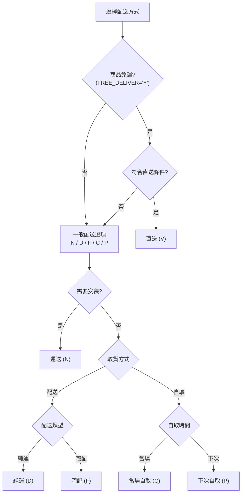
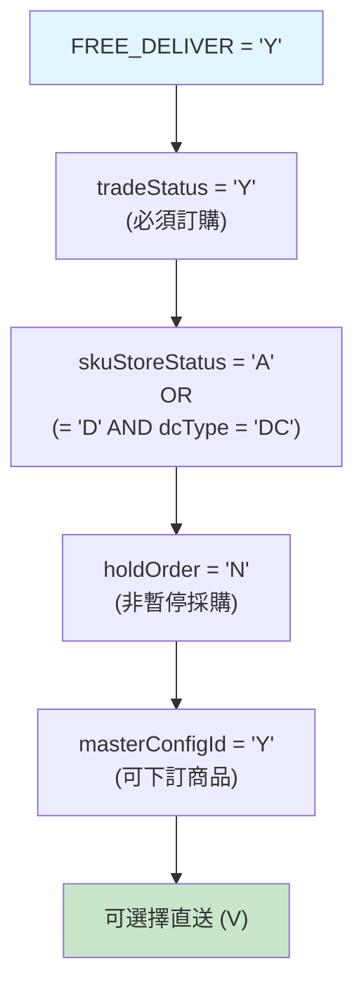
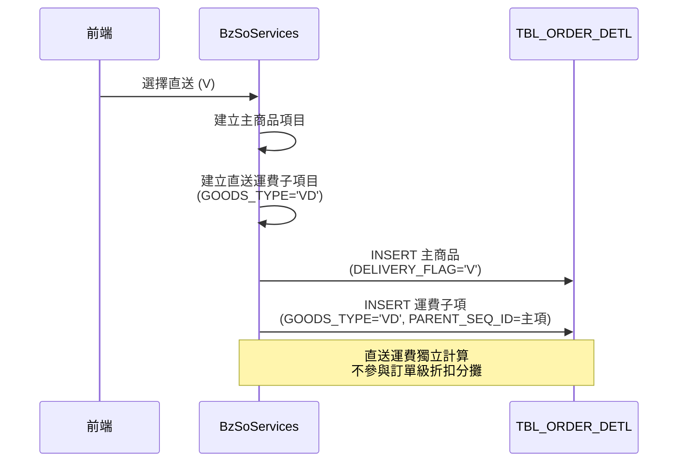
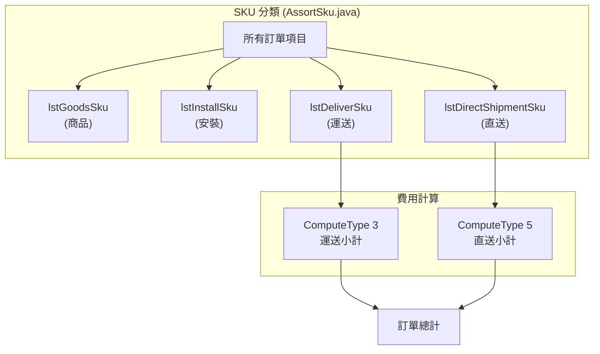
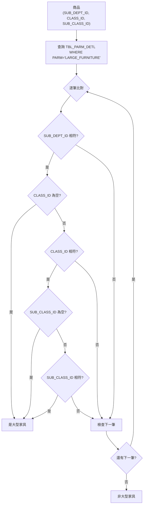
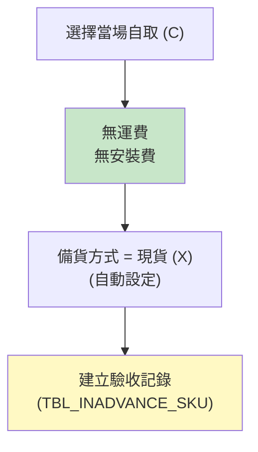

# 運費與配送規則規格

> 本文件定義配送方式、運費計算、免運條件及特殊配送處理規則。

## 1. 配送方式總覽

### 1.1 配送方式代碼

| 代碼 | 名稱 | 說明 | 費用 | 安裝服務 |
|:----:|------|------|:----:|:--------:|
| N | 運送 | 標準配送含安裝 | 有 | 有 |
| D | 純運 | 僅配送不安裝 | 有 | 無 |
| V | 直送 | 廠商直送 (免運商品) | 有 | 無 |
| F | 宅配 | 宅配工種 (0167) | 有 | 無 |
| C | 當場自取 | 現場取貨 | 無 | 無 |
| P | 下次自取 | 下次取貨 | 無 | 無 |

### 1.2 配送方式決策流程



## 2. 免運條件規則

### 2.1 核心欄位

| 資料表 | 欄位 | 類型 | 說明 |
|--------|------|------|------|
| TBL_SKU | FREE_DELIVER | CHAR(1) | 'Y'=免運, 'N'=有運費 |

### 2.2 直送可用條件

直送 (V) 配送方式需滿足**所有**條件:



| # | 條件 | 說明 |
|---|------|------|
| 1 | `freeDeliver = 'Y'` | 商品必須標記為免運 |
| 2 | `tradeStatus = 'Y'` | 必須選擇訂購，不能選現貨 |
| 3 | `skuStoreStatus` | = 'A' 或 (= 'D' 且 dcType = 'DC') |
| 4 | `holdOrder = 'N'` | 非暫停採購狀態 |
| 5 | `masterConfigId = 'Y'` | 可下訂商品類型 |

### 2.3 免運商品在訂單中的處理



**關鍵規則**:
- 免運商品選擇直送時，建立 `GOODS_TYPE='VD'` 的運費子項
- 直送運費**不參與**訂單級別的折扣分攤
- 使用 `PARENT_SEQ_ID` 關聯主商品與運費子項

## 3. 運費計算邏輯

### 3.1 ComputeType 定義

| Type | 名稱 | 計算內容 |
|:----:|------|---------|
| 1 | 商品小計 | 商品金額加總 |
| 2 | 安裝小計 | 安裝費用加總 |
| 3 | 運送小計 | 一般運費加總 |
| 4 | 會員卡折扣 | 會員折扣金額 |
| **5** | **直送費用小計** | **直送運費加總** |
| 6 | 折價券折扣 | 折價券折扣金額 |

### 3.2 運費計算公式

**ComputeType 3 (一般運送) 與 ComputeType 5 (直送) 使用相同公式**:

```java
// BzSoServices.java:5004-5009
case SoConstant.COMPUTE_TYPE_3:  // 一般運送
case SoConstant.COMPUTE_TYPE_5:  // 直送
    if ("0".equals(memberDiscType)) {
        // 會員折扣類型 0: 使用分攤前金額
        actTotalPrice = PreApportion × Quantity;
    } else {
        // 其他類型: 使用實際運費 + 折扣
        actTotalPrice = ActDeliveryPrice + DmCouponAmt;
    }
    break;
```

### 3.3 運費欄位說明

| 欄位 | 說明 |
|------|------|
| DELIVERY_PRICE | 運送單價 (原價) |
| ACT_DELIVERY_PRICE | 實際運送總價 (折後) |
| PRE_APPORTION | 分攤前金額 |
| DM_COUPON_AMT | 會員折扣金額 |

## 4. 直送費用計算

### 4.1 直送商品處理流程



### 4.2 直送費用計算程式碼

```java
// BzSoServices.java:5263-5275
if (orderDetlVO.getLstDirectShipmentSkuInfo() != null
    && !orderDetlVO.getLstDirectShipmentSkuInfo().isEmpty()) {

    for (OrderDetlVO direSku : orderDetlVO.getLstDirectShipmentSkuInfo()) {
        // 設定運費為分攤前金額
        direSku.setDeliveryPrice(direSku.getPreApportion());

        // 實際運送費 = 運費 × 數量
        direSku.setActDeliveryPrice(
            Integer.parseInt(direSku.getDeliveryPrice()) *
            Integer.parseInt(direSku.getQuantity()) + "");

        // 直送商品無折扣
        direSku.setDmCouponAmt("0");
        direSku.setCoupon0Disc("0");
        direSku.setCoupon1Disc("0");
        direSku.setDeliveryChangePrice(false);
    }
}
```

**直送特殊規則**:
- 運費 = PreApportion × Quantity
- **不參與任何折扣** (DmCouponAmt = 0)
- **不可變價** (DeliveryChangePrice = false)

## 5. 特殊配送規則

### 5.1 大型家具配送

**判斷邏輯** (LargeFurnitureService.java):



**匹配規則**:
- 依 SUB_DEPT_ID → CLASS_ID → SUB_CLASS_ID 層級匹配
- 任一層級匹配即判定為大型家具
- 大型家具可能有特殊配送限制

### 5.2 宅配工種 (F)

| 項目 | 說明 |
|------|------|
| 工種代碼 | 0167 (InstallConstant.HOME_DELIVERY_WORKTYPE_ID) |
| 處理方式 | 與純運 (D) 相同 |
| 驗收邏輯 | 不視為即時驗收 (2021-09-14 調整) |

**程式碼參考**:
```java
// InstallConstant.java:106
public static final String HOME_DELIVERY_WORKTYPE_ID = "0167";
```

### 5.3 當場自取 (C)



**當場自取規則**:
- 無運費、無安裝費
- 備貨方式自動設為現貨 (X)
- 付款後立即建立驗收記錄 (TBL_INADVANCE_SKU)

### 5.4 下次自取 (P)

- 無運費、無安裝費
- 不立即建立驗收記錄
- 等待客戶下次來店取貨

## 6. 混合訂單處理

### 6.1 稅別分開計算

當訂單包含免稅與應稅商品時:

```java
// BzSoServices.java:5743-5810
BigDecimal totalAmtByNotDeliveryFlagCAndTaxType2; // 非自取免稅加總
BigDecimal totalAmtByNotDeliveryFlagCAndTaxType1; // 非自取應稅加總
BigDecimal totalAmtByDeliveryFlagC;               // 自取加總

for (TblOrderDetl detl : lstOrderDetl) {
    if (SoConstant.DELIVERY_FLAG_C.equals(detl.getDeliveryFlag())) {
        // 自取商品單獨計算
    } else {
        // 非自取商品 (含直送) 另外計算
    }
}
```

### 6.2 混合訂單費用分攤

| 商品類型 | 運費處理 | 折扣分攤 |
|----------|---------|---------|
| 免運直送 (VD) | 獨立計算 | 不參與 |
| 一般運送 (DD) | 訂單級計算 | 參與 |
| 自取 (C/P) | 無運費 | 不適用 |

## 7. VO 資料結構

### 7.1 直送商品相關

```java
// OrderDetlVO.java
public class OrderDetlVO {
    private String deliveryFlag;     // 運送註記 (N/D/V/C/P/F)
    private String deliveryPrice;    // 運送單價
    private String actDeliveryPrice; // 實際運送總價

    // 直送商品清單
    private ArrayList<OrderDetlVO> lstDirectShipmentSkuInfo;
}
```

### 7.2 商品性質常數

```java
// GoodsType.java
public static final String VD = "VD";  // 直送運送商品
public static final String DD = "DD";  // 運費商品
public static final String D  = "D";   // 純運商品
```

## 8. DDD 重構建議

### 8.1 配送方式列舉

```java
public enum DeliveryMethod {
    DELIVERY("N", "運送", true, true),
    PURE_DELIVERY("D", "純運", true, false),
    DIRECT_SHIPMENT("V", "直送", true, false),
    HOME_DELIVERY("F", "宅配", true, false),
    ONSITE_PICKUP("C", "當場自取", false, false),
    NEXT_PICKUP("P", "下次自取", false, false);

    private final String code;
    private final String name;
    private final boolean hasDeliveryFee;
    private final boolean hasInstallation;
}
```

### 8.2 運費計算策略

```java
public interface DeliveryFeeCalculator {
    Money calculate(OrderItem item, DeliveryMethod method);
}

public class DirectShipmentFeeCalculator implements DeliveryFeeCalculator {
    @Override
    public Money calculate(OrderItem item, DeliveryMethod method) {
        // 直送: PreApportion × Quantity, 無折扣
        return item.getPreApportion().multiply(item.getQuantity());
    }
}
```

## 9. Legacy Code 參考

| 功能 | 檔案 | 行號 |
|------|------|------|
| 配送方式常數 | SoConstant.java | 全檔 |
| 直送判斷 | soSKUSubPage.jsp | 1276-1407 |
| 直送費用計算 | BzSoServices.java | 5263-5275 |
| ComputeType 5 | BzSoServices.java | 4938-4943 |
| 費用公式 | BzSoServices.java | 5004-5009 |
| 大型家具判斷 | LargeFurnitureService.java | 全檔 |
| 宅配工種 | InstallConstant.java | 106 |
| 當場自取驗收 | CreateTranService.java | 577-599 |
