# Pricing Calculation Specification

> **Feature**: 002-create-order
> **Version**: 1.1.0
> **Last Updated**: 2025-12-20
> **Status**: Draft

## Clarification Summary (2025-12-20)

本規格已通過 `/speckit.clarify` 工作流程，以下歧義已澄清：

| # | 歧義類別 | 問題 | 決議 | 位置 |
|---|---------|------|------|------|
| 1 | 邊界案例 | OMS 促銷過期風險窗口處理 | 靜默忽略，按原價計算，記錄 Warning Log | Section 21.4 |
| 2 | 領域模型 | 多張折價券計算順序 | 依加入順序 (FIFO) | Section 24.4 |
| 3 | 邊界案例 | 工種變價餘數分攤算法 | 按 detlSeq 逐一分攤 $1 | Section 21.5 |
| 4 | 功能行為 | 零元商品處理 | 打印 INFO Log 便於追蹤 | Section 6.2 |
| 5 | 外部依賴 | CRM 長時間不可用 | 三層降級：過期快取 → 臨時卡 | Section 21.6.1 |

---

## Overview

本文件定義訂單價格計算的完整規格，包含 12 步驟計價流程、會員折扣計算公式、促銷邏輯、分攤機制等詳細規則。

**來源驗證**: 所有計算公式均來自 `C:/projects/som` Legacy 程式碼驗證。

---

## 1. 12 Steps Calculation Flow

### 1.1 Flow Overview

```text
doCalculate(Order)
  |
  +-- Step 1: revertAllSkuAmt()
  |            還原所有商品的銷售單價至原始 POS 價
  |
  +-- Step 2: apportionmentDiscount()
  |            工種變價分攤（安裝/運送費變價時按比例分攤到各商品）
  |
  +-- Step 3: assortSku()
  |            商品分類（P/I/FI/DD/VD/D）
  |
  +-- Step 4: memberDiscountType2()
  |            Cost Markup 會員折扣（成本加價）
  |
  +-- Step 5: promotionCalculation()
  |            多重促銷計算（8 種促銷類型）
  |
  +-- Step 6: memberDiscountType0()
  |            Discounting 會員折扣（折價率折扣）
  |
  +-- Step 7: memberDiscountType1()
  |            Down Margin 會員折扣（固定降價）
  |
  +-- Step 8: specialMemberDiscount()
  |            特殊會員折扣（VIP/員工價）
  |
  +-- Step 9: generateComputeType1()
  |            生成商品小計試算記錄
  |
  +-- Step 10: generateComputeType2()
  |             生成安裝小計試算記錄
  |
  +-- Step 11: generateComputeType3()
  |             生成運送小計試算記錄
  |
  +-- Step 12: generateComputeType456()
               生成會員折扣/直送/折價券試算記錄
```

### 1.2 Step Dependency

```text
Step 1 ─────────────────────────────────────────────────────────┐
                                                                 |
Step 2 ────────────────────────────────────────────────────────>|
                                                                 |
Step 3 ────────────────────────────────────────────────────────>|
                                                                 |
Step 4 (Type 2) ──> Step 5 (Promotion) ──> Step 6 (Type 0) ──> |
                                                                 |
                                           Step 7 (Type 1) ──> |
                                                                 |
                                           Step 8 (Special) ──>|
                                                                 |
Step 9-12 ←─────────────────────────────────────────────────────┘
(可並行執行)
```

### 1.3 Step Details

#### Step 1: Revert All SKU Amount

**目的**: 還原商品價格至原始狀態，確保每次試算從相同基準開始

**規則**:
- `actPosAmt` = `posAmt`
- `actInstallPrice` = `installPrice` × `quantity`
- `actDeliveryPrice` = `deliveryPrice` × `quantity`
- 清除所有折扣記錄

**程式碼來源**: `BzSoServices.java` revertAllSkuAmt()

---

#### Step 2: Apportionment Discount (工種變價分攤)

**目的**: 當安裝/運送工種有變價授權時，將變價差額分攤到該工種下的各商品

**觸發條件**:
- `installAuthEmpId` IS NOT NULL AND `installPrice` != `actInstallPrice`
- `deliveryAuthEmpId` IS NOT NULL AND `deliveryPrice` != `actDeliveryPrice`

**分攤公式**:

```
changePriceForInstall = installPrice - actInstallPrice
changePriceForDelivery = deliveryPrice - actDeliveryPrice

For each SKU in workType:
  ratio = skuSubtotal / workTypeTotal
  apportionmentAmount = ROUND(changePriceAmount × ratio)

  newUnitPrice = originalUnitPrice - (apportionmentAmount / quantity)
  newTotalPrice = newUnitPrice × quantity - remainder

  Where:
    remainder = apportionmentAmount MOD quantity
```

**最後一筆修正**:
```
lastApportionment = changePriceAmount - sumOfPreviousApportionments
```

**程式碼來源**: `BzSoServices.java:5375-5572`

---

#### Step 3: Assort SKU (商品分類)

**目的**: 按商品類型分群，供後續計算使用

**分類規則**:

| GoodsType | 分類 | 說明 |
|-----------|------|------|
| P | lstGoodsSku | 一般商品 |
| I, IA, IE, IC, IS | lstInstallSku | 安裝商品 |
| FI | lstFreeInstallSku | 免安商品 |
| DD | lstDeliverSku | 運送商品 |
| VD | lstDirectShipmentSku | 直送商品 |
| D | lstWorkTypeSku | 工種商品 |

**程式碼來源**: `BzSoServices.java` AssortSku()

---

#### Step 4: Member Discount Type 2 (Cost Markup)

**目的**: 成本加價折扣 - 以成本為基準計算售價

**執行時機**: 所有促銷計算之前（因為會完全替換 actPosAmt）

**計算公式**:

```
discountPercent = discountPer / 100

For 商品類型 P:
  newPrice = CEIL(unitCost × (1 + discountPercent))

  IF !taxZero AND taxType == '1':
    newPrice = FLOOR(newPrice × 1.05)  // 加營業稅

  discountAmt = posAmt - newPrice
  actPosAmt = newPrice
  totalPrice = newPrice × quantity
```

**特殊處理**:
- Type 2 執行後必須重新分類商品（因 actPosAmt 完全替換）
- 計算結果為負數時 → 歸零並發送告警信

**程式碼來源**: `SoFunctionMemberDisServices.java:474-511`

---

#### Step 5: Promotion Calculation (多重促銷)

**目的**: 執行 8 種促銷類型計算

**促銷類型**:

| Type | Class | 說明 | 優先級 |
|------|-------|------|--------|
| A | SoEventA | 印花價 | 1 (最高) |
| B | SoEventB | 發票金額滿額加價購 | 2 |
| C | SoEventC | 商品滿額/滿件全面優惠 | 3 |
| D | SoEventD | 每買 M 個享 N 個優惠 | 4 |
| E | SoEventE | 買 A 群組享 B 群組優惠 | 5 |
| F | SoEventF | 合購價 | 6 |
| G | SoEventG | 共用商品合購價 | 7 |
| H | SoEventH | 單品拆價合購價 | 8 |

**執行順序**:
1. 依 EVENT_NO 分群商品
2. 依促銷類型優先級執行
3. 已參與促銷的商品不再參與其他促銷

**程式碼來源**: `SoComputeFunctionMain.java:76-105`

---

#### Step 6: Member Discount Type 0 (Discounting)

**目的**: 折價率折扣 - 不修改 actPosAmt，僅記錄折扣金額

**計算公式**:

```
discountPercent = discountPer / 100

For 商品類型 P:
  totalPrice = CEIL(
    posAmt
    + (bonusTotal / quantity)     // 紅利折抵
    + (promotionDisc / quantity)  // 組促折扣
  )

  discountAmt = CEIL(totalPrice × discountPercent)
  memberDisc = discountAmt × quantity

For 安裝商品 (I/IA/IE/IC/IS):
  discountAmt = CEIL(installPrice × discountPercent)
  memberDisc = discountAmt × quantity

For 運送商品 (DD/VD):
  discountAmt = CEIL(deliveryPrice × discountPercent)
  memberDisc = discountAmt × quantity
```

**特性**:
- 不修改 actPosAmt
- 折扣記錄於 memberDisc 欄位
- 最終在 ComputeType 4 中匯總

**程式碼來源**: `SoFunctionMemberDisServices.java:405-437`

---

#### Step 7: Member Discount Type 1 (Down Margin)

**目的**: 固定降價折扣 - 直接修改 actPosAmt

**計算公式**:

```
discountPercent = discountPer / 100

For 商品類型 P:
  discountAmt = CEIL((actPosAmt + FLOOR(promotionDisc / quantity)) × discountPercent)

  newPrice = actPosAmt - discountAmt
  actPosAmt = newPrice
  totalPrice = newPrice × quantity
  posAmtChangePrice = true

For 安裝商品:
  discountAmt = CEIL(installPrice × discountPercent)
  newPrice = installPrice - discountAmt
  actInstallPrice = newPrice × quantity
  installChangePrice = true

For 運送商品:
  discountAmt = CEIL(deliveryPrice × discountPercent)
  newPrice = deliveryPrice - discountAmt
  actDeliveryPrice = newPrice × quantity
  deliveryChangePrice = true
```

**特性**:
- 直接修改實際價格欄位
- 設定變價標記

**程式碼來源**: `SoFunctionMemberDisServices.java:440-471`

---

#### Step 8: Special Member Discount

**目的**: 執行特殊會員折扣（VIP、員工價等）

**觸發條件**:
- 會員卡別符合特殊會員類型
- 前面步驟無任何會員折扣

**程式碼來源**: `BzSoServices.java` soComputeMemberDisForSpecial()

---

#### Steps 9-12: Generate ComputeType Records

**目的**: 生成 6 種試算記錄

**ComputeType 定義**:

| Type | 名稱 | 計算來源 |
|------|------|----------|
| 1 | 商品小計 | SUM(lstGoodsSku.actPosAmt × quantity) |
| 2 | 安裝小計 | SUM(lstInstallSku.actInstallPrice) |
| 3 | 運送小計 | SUM(lstDeliverSku.actDeliveryPrice) |
| 4 | 會員卡折扣 | SUM(all.memberDisc) (負數) |
| 5 | 直送費用小計 | SUM(lstDirectShipmentSku.actDeliveryPrice) |
| 6 | 折價券折扣 | SUM(all.couponDisc) (負數) |

**每種 ComputeType 的欄位**:

| 欄位 | 說明 |
|------|------|
| totalPrice | 總額（折扣前） |
| discount | 折扣金額 |
| actTotalPrice | 實際總額（= totalPrice + discount） |
| actTotalPriceTx | 應稅金額 |
| actTotalPriceNtx | 免稅金額 |

**程式碼來源**: `BzSoServices.java:4961-5046` setOrderCompute()

---

## 2. Member Discount Calculation

### 2.1 Discount Type Overview

| Type | Name | Behavior | Price Field Modified |
|------|------|----------|---------------------|
| 0 | Discounting | 折價率折扣，不改價 | memberDisc only |
| 1 | Down Margin | 固定降價，改價 | actPosAmt/actInstallPrice/actDeliveryPrice |
| 2 | Cost Markup | 成本加價，完全替換價格 | actPosAmt (全部替換) |

### 2.2 Discount Percent Interpretation

```
discountPer = 0   → 無折扣 (100% 原價)
discountPer = 25  → 75 折 (付 75%)
discountPer = 60  → 4 折 (付 40%)
discountPer = 100 → 0 折 (免費)
```

### 2.3 Execution Priority

```
Type 2 (Cost Markup)
  ↓
Promotion Calculation
  ↓
Type 0 (Discounting)
  ↓
Type 1 (Down Margin)
  ↓
Special Member Discount
```

### 2.4 Tax-Aware Calculation

Type 2 營業稅處理：
```java
IF !taxZero AND taxType == '1':
  newPrice = FLOOR(newPrice × 1.05)  // 5% 營業稅
```

Type 0/1 應稅/免稅分離：
```java
IF taxType == '1':  // 應稅
  taxDisc += discountAmt
ELSE IF taxType == '2' OR taxZero:  // 免稅或零稅
  freeTaxDisc += discountAmt
```

---

## 3. Installation Fee Calculation

### 3.1 Installation Fee Components

```
安裝費 = 標準安裝費 + 進階安裝費 + 其他安裝費 - 免安折扣
```

**商品類型對應**:

| GoodsType | 說明 | 計算方式 |
|-----------|------|----------|
| I | 基本安裝 | installPrice × quantity |
| IA | 進階安裝 | installPrice × quantity |
| IE | 其他安裝 | installPrice × quantity |
| IC | 安裝調整 | installPrice × quantity |
| IS | 補安裝費 | installPrice × quantity |
| FI | 免安折扣 | 負數金額，抵扣安裝費 |

### 3.2 Worktype Cost Discount

**標安折數** (WORKTYPE_DISCOUNT_BASE): 有免安時適用
**非標折數** (WORKTYPE_DISCOUNT_EXTRA): 無免安時適用

```
IF hasFreeInstall:
  discountRate = WORKTYPE_DISCOUNT_BASE
ELSE:
  discountRate = WORKTYPE_DISCOUNT_EXTRA

adjustedCost = baseCost × discountRate
```

### 3.3 Minimum Wage Check

```
IF totalInstallFee < sumOfFreeInstallDiscount:
  WARNING: "工種 {workTypeId} 變價金額不可小於免安金額"
```

**例外**: 純運(D)和宅配除外

---

## 4. Delivery Fee Calculation

### 4.1 Delivery Fee Formula

**基礎公式**:
```
deliveryFee = volumeRate × volume
```

**材積計算**:
```
volume = (length × width × height) / 5000  // cm → 材積
```

### 4.2 Delivery Types

| DeliveryFlag | 說明 | 費用計算 |
|--------------|------|----------|
| N | 運送 | 標準運送費 |
| D | 純運 | 純運費（無安裝） |
| V | 直送 | 直送費（廠商送） |
| C | 當場自取 | 0 |
| P | 下次自取 | 0 |

### 4.3 Free Delivery Conditions

```
IF freeDelivery == 'Y' OR freeDeliveryShipping == 'Y':
  deliveryFee = 0

IF orderTotal >= freeDeliveryThreshold:
  deliveryFee = 0
```

---

## 5. Coupon Apportionment

### 5.1 Fixed Amount Coupon (Type 0)

**分攤公式**:
```
For each eligibleSku:
  ratio = skuPrice / totalEligiblePrice
  apportionedAmount = CEIL(couponAmount × ratio)

// 最後一筆修正
lastSkuApportionment = couponAmount - sumOfPreviousApportionments
```

### 5.2 Discount Rate Coupon (Type 1)

```
discountAmount = CEIL(skuPrice × couponDiscountRate)
```

### 5.3 Cap Processing (封頂處理)

```
IF totalCouponDiscount > totalEligibleAmount:
  actualDiscount = totalEligibleAmount
  excessAmount = totalCouponDiscount - totalEligibleAmount  // 不退
```

### 5.4 Tax Separation

```
FOR each sku in eligibleSkus:
  IF taxType == '1':  // 應稅
    taxCouponDisc += skuCouponDisc
  ELSE:               // 免稅
    freeTaxCouponDisc += skuCouponDisc
```

---

## 6. Tax Calculation

### 6.1 Tax Types

| TaxType | 說明 | 稅率 |
|---------|------|------|
| 1 | 應稅 | 5% |
| 2 | 免稅 | 0% |
| 0 | 零稅 | 0% (特殊) |

### 6.2 Tax Calculation Rules

**應稅商品**:
```
taxAmount = FLOOR(actTotalPrice / 1.05 × 0.05)
// 或
taxAmount = actTotalPrice - FLOOR(actTotalPrice / 1.05)
```

**免稅/零稅商品**:
```
taxAmount = 0
```

#### 零元商品處理 (Clarified)

當商品最終金額為 0 時（因折扣、紅利折抵等原因）：

- **稅額計算**: 跳過稅額計算，taxAmount = 0
- **日誌記錄**: 打印 INFO Log 便於追蹤，包含 SKU_NO、原因類型、訂單編號
- **原因類型** (可從現有欄位推導):
  - `FULL_DISCOUNT`: 當 discountAmt >= originalPrice
  - `FULL_BONUS`: 當 bonusTotal >= originalPrice
  - `FULL_COUPON`: 當 couponDisc >= originalPrice
  - `COMBINED`: 以上組合導致

```java
// 實作範例
if (line.getSubtotal().isZero()) {
    String reason = determineZeroReason(line);
    log.info("商品金額為 0: skuNo={}, reason={}, orderId={}",
             line.getSkuNo(), reason, order.getId());
}
```

### 6.3 Tax Zero Order

當訂單標記為零稅 (`taxZero = true`) 時：
- 所有商品視為零稅計算
- Type 2 不加營業稅
- 試算結果全部歸入 actTotalPriceNtx

---

## 7. Rounding Rules

### 7.1 Rounding Methods

| 方法 | Java 實作 | 使用場景 |
|------|-----------|----------|
| 無條件進位 | `Math.ceil(value)` | 折扣金額計算 |
| 四捨五入 | `Math.round(value)` | 分攤金額計算 |
| 無條件捨去 | `BigDecimal.ROUND_FLOOR` | 營業稅計算 |

### 7.2 Application Rules

```
Type 0/1 折扣: CEIL
Type 2 新價格: CEIL
Type 2 營業稅: FLOOR
分攤金額: ROUND
最後一筆分攤: 差額修正（不使用舍入）
```

---

## 8. Data Structures

### 8.1 MemberDiscVO

```java
public record MemberDiscVO(
    String discountId,      // 折扣代號
    String discPer,         // 折扣率 (00~100)
    String discType,        // 折扣類型 (0/1/2)
    String startDate,       // 生效日
    String endDate,         // 失效日
    String discAmt,         // 折扣金額 (應稅)
    String ndiscAmt,        // 折扣金額 (免稅)
    String taxType,         // 稅別
    String skuNo,           // 商品編號
    String detlSeqId        // 明細流水號
) {}
```

### 8.2 OrderComputeVO

```java
public record OrderComputeVO(
    String orderId,
    String computeType,       // 1-6
    String storeId,
    BigDecimal totalPrice,    // 總額
    BigDecimal discount,      // 折扣 (負數)
    BigDecimal actTotalPrice, // 實際總額
    BigDecimal actTotalPriceTx,  // 應稅
    BigDecimal actTotalPriceNtx, // 免稅
    String authorizedEmpId,
    String authorizedEmpName,
    String authorizedReason,
    LocalDateTime authorizedDate,
    BigDecimal discountFrcms  // 加盟折扣
) {}
```

### 8.3 Price Fields in OrderDetlVO

| 欄位 | 說明 | 修改時機 |
|------|------|----------|
| posAmt | 原始 POS 價 | 不修改 |
| actPosAmt | 實際 POS 價 | Type 1/2 修改 |
| totalPrice | 商品總價 | Type 1/2 修改 |
| installPrice | 安裝單價 | 不修改 |
| actInstallPrice | 安裝實際總價 | Type 1 修改 |
| deliveryPrice | 運送單價 | 不修改 |
| actDeliveryPrice | 運送實際總價 | Type 1 修改 |
| memberDisc | 會員折扣 | Type 0 記錄 |
| discountAmt | 組促折扣 | 促銷計算記錄 |
| coupon0Disc | 固定面額折價券 | 折價券分攤 |
| coupon1Disc | 折扣率折價券 | 折價券計算 |
| preApportion | 分攤前金額 | 工種變價記錄 |
| workTypeChangPriceDisc | 工種變價分攤額 | 工種變價記錄 |

---

## 9. Flowcharts

### 9.1 Complete Calculation Flow

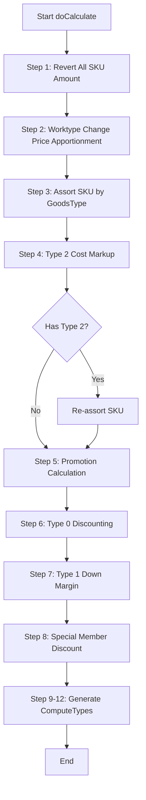

### 9.2 Member Discount Type Selection

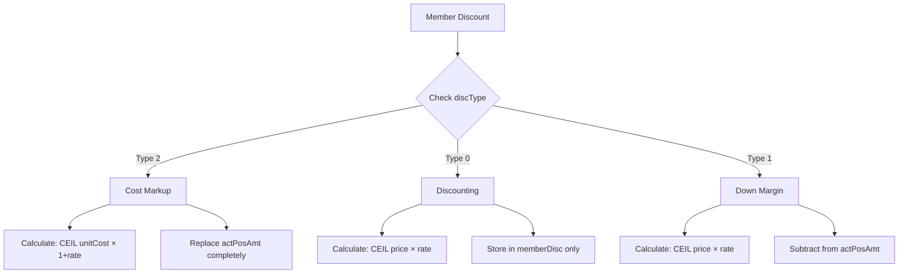

---

## 10. Validation Rules

### 10.1 Pre-calculation Validation

| Rule | Description | Action |
|------|-------------|--------|
| V-001 | 商品明細數量 ≤ 500 | 超過則阻止試算 |
| V-002 | 至少一項商品 | 無商品則阻止試算 |
| V-003 | 會員資料已載入 | 無會員則跳過會員折扣 |

### 10.2 Post-calculation Validation

| Rule | Description | Action |
|------|-------------|--------|
| V-010 | Type 2 結果為負數 | 歸零並發送告警信 |
| V-011 | 安裝費低於免安金額 | 顯示警告（不阻擋） |
| V-012 | 試算結果合計不為負 | 異常則記錄日誌 |

---

## 11. Legacy Code References

| 功能 | 檔案 | 方法/行號 |
|------|------|----------|
| 主計價流程 | BzSoServices.java | doCalculate():4367 |
| 商品分類 | BzSoServices.java | AssortSku() |
| 工種變價分攤 | BzSoServices.java | apportionmentDiscount():5375-5572 |
| 會員折扣 Type 0 | SoFunctionMemberDisServices.java | updateMemberDiscForDiscountType0():405-437 |
| 會員折扣 Type 1 | SoFunctionMemberDisServices.java | updateMemberDiscForDiscountType1():440-471 |
| 會員折扣 Type 2 | SoFunctionMemberDisServices.java | updateMemberDiscForDiscountType2():474-511 |
| 促銷計算 | SoComputeFunctionMain.java | init():76-105 |
| 生成試算記錄 | BzSoServices.java | setOrderCompute():4961-5046 |
| 折價券分攤 | BzSoServices.java | :1613-1684 |
| 應稅免稅分離 | SoFunctionMemberDisServices.java | :595-628 |

---

## 12. Appendix

### A. GoodsType Constants

```java
public enum GoodsType {
    P("P", "一般商品"),
    I("I", "基本安裝"),
    IA("IA", "進階安裝"),
    IE("IE", "其他安裝"),
    IC("IC", "安裝調整"),
    IS("IS", "補安裝費"),
    FI("FI", "免安折扣"),
    DD("DD", "運送"),
    VD("VD", "直送"),
    D("D", "工種"),
    VT("VT", "會員卡折扣"),
    CP("CP", "折價券"),
    CK("CK", "折扣券"),
    CI("CI", "酷卡折扣"),
    BP("BP", "紅利折抵"),
    TT("TT", "總額折扣");
}
```

### B. ComputeType Constants

```java
public static final String COMPUTE_TYPE_1 = "1";  // 商品小計
public static final String COMPUTE_TYPE_2 = "2";  // 安裝小計
public static final String COMPUTE_TYPE_3 = "3";  // 運送小計
public static final String COMPUTE_TYPE_4 = "4";  // 會員卡折扣
public static final String COMPUTE_TYPE_5 = "5";  // 直送費用小計
public static final String COMPUTE_TYPE_6 = "6";  // 折價券折扣
```

### C. Member Discount Type Constants

```java
public static final String MEMBER_DISCOUNT_TYPE_0 = "0";  // Discounting
public static final String MEMBER_DISCOUNT_TYPE_1 = "1";  // Down Margin
public static final String MEMBER_DISCOUNT_TYPE_2 = "2";  // Cost Markup
```

### D. Tax Type Constants

```java
public static final String SKU_TAX_TYPE_0 = "0";  // 零稅
public static final String SKU_TAX_TYPE_1 = "1";  // 應稅
public static final String SKU_TAX_TYPE_2 = "2";  // 免稅
```

---

## 13. Frontend/Backend Responsibility Analysis

> **分析日期**: 2025-12-20
> **來源**: Angular 前端、Spring 後端、Legacy JSP 逆向工程

### 13.1 現況問題總覽

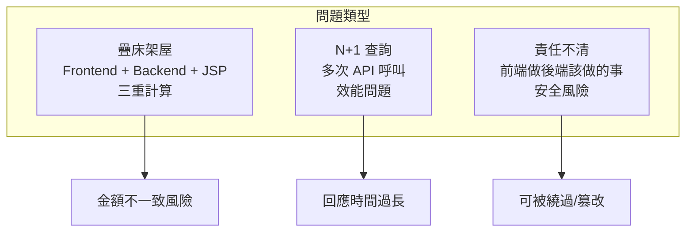

### 13.2 Calculation Layer Comparison

#### 三層計算邏輯比對

| 計算項目 | Legacy JSP | Angular Frontend | Spring Backend | 問題 |
|---------|------------|------------------|----------------|------|
| 商品小計 `posAmt × qty` | ✅ `soSKUSubPage.jsp:1042` | ✅ `order-summary:65` | ✅ `PriceCalculationService:62` | **三重計算** |
| 紅利點數 `bonus × qty` | ✅ `soSKUSubPage.jsp:998` | ❌ | ✅ `BonusService` | 二重計算 |
| 優惠券單位攤提 | ✅ `soSKUSubPage.jsp:1044` | ❌ | ✅ `CouponService:206` | 二重計算 |
| 安裝費總額 | ✅ `soSKUSubPage.jsp:1190` | ✅ `order-summary:93` | ✅ `PriceCalculationService:65` | **三重計算** |
| 運送費總額 | ✅ JSP | ✅ `order-summary:100` | ✅ `PriceCalculationService:68` | **三重計算** |
| 會員折扣總額 | ✅ JSP | ✅ `order-summary:72` | ✅ `MemberDiscountService` | **三重計算** |
| 應付總額 | ✅ `soComputeSubPage.jsp` | ✅ `order-summary:107` (Fallback) | ✅ `PriceCalculationService:91` | **三重計算 + Fallback 風險** |
| 試算後回填計算 | ✅ `soSKUSubPage.jsp:2163` | ❌ | ✅ (來源) | 畫蛇添足 |

### 13.3 Validation Layer Comparison

#### 檢核邏輯比對

| 檢核項目 | Legacy JSP | Angular Frontend | Spring Backend | 建議保留 |
|---------|------------|------------------|----------------|----------|
| SKU 格式驗證 | ❌ | ✅ `product.service:45` | ✅ `ProductEligibilityService:88` | **後端唯一** |
| SKU 存在性驗證 | ✅ (AJAX) | ✅ `product-list:417` | ✅ `ProductEligibilityService:94` | **後端唯一** |
| 變價條碼重複 | ✅ `soSKUSubPage.jsp:125` | ❌ | ❌ | **後端新增** |
| 票券訂單商品 | ✅ `soSKUSubPage.jsp:132` | ❌ | ❌ | **後端新增** |
| DC 商品庫存 | ✅ `soSKUSubPage.jsp:156` | ❌ | ❌ | **後端新增** |
| 商品數量限制 500 | ✅ `soComputeSubPage.jsp:40` | ❌ | ✅ (應有) | **後端唯一** |
| 會員卡號格式 | ❌ | ✅ `member.service:56` | ✅ | 前端 + 後端 |
| 手機號碼格式 | ❌ | ✅ `member.service:65` | ✅ | 前端 + 後端 |
| 運送/備貨相容性 | ❌ | ✅ `service-config:362` (Effect) | ✅ `OrderService:597` | **後端唯一** |
| 紅利點數足夠 | ❌ | ✅ `order-summary:228` | ✅ `BonusService:105` | **後端唯一** |
| 紅利最低 10 點 | ❌ | ✅ `order-summary:223` | ✅ `BonusService:113` | **後端唯一** |
| 優惠券門檻 | ❌ | ❌ | ✅ `CouponService:135` | 後端唯一 |
| 安裝費最低工資 | ❌ | ❌ | ✅ `PriceCalculationService:272` | 後端唯一 |
| Type 2 負數歸零 | ❌ | ❌ | ✅ `MemberDiscountService:127` | 後端唯一 |

---

## 14. Redundancy & N+1 Issues

### 14.1 疊床架屋問題清單

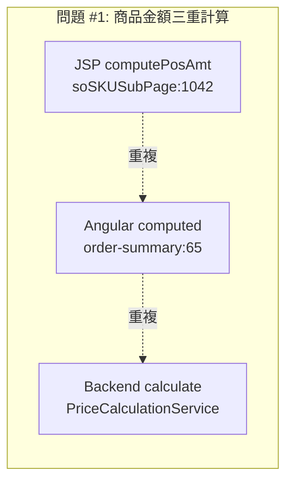

#### 問題 #1: 商品金額三重計算 (Critical)

| 位置 | 程式碼 | 計算公式 |
|------|--------|----------|
| JSP | `soSKUSubPage.jsp:1042` | `totalPosAmt = posAmt × quantity` |
| Angular | `order-summary.component.ts:65-67` | `lines.reduce((sum, line) => sum + line.subtotal, 0)` |
| Backend | `PriceCalculationService.java:62` | ComputeType 1 generation |

**風險**: 三處邏輯不同步時金額不一致
**解決**: 移除前端計算，信任後端 `CalculationResponse.grandTotal`

---

#### 問題 #2: 試算後回填再計算 (High)

| 位置 | 程式碼 | 問題 |
|------|--------|------|
| JSP | `soSKUSubPage.jsp:2163-2177` | 後端回傳後，前端又計算 `actPosAmt + (bonusTotal/quantity)` |

```javascript
// 問題程式碼 (soSKUSubPage.jsp:2163-2177)
var eachSkuBonusTotal = Math.abs(bonusTotal / quantity);
var actPosAmtInSku = parseFloat(actPosAmt) + eachSkuBonusTotal;
el.find('[name="actPosAmt"]').val(actPosAmtInSku);  // 覆蓋後端值！
```

**風險**: 覆蓋後端正確計算結果
**解決**: 直接使用後端回傳值，不再前端計算

---

#### 問題 #3: Angular grandTotal Fallback (High)

| 位置 | 程式碼 | 問題 |
|------|--------|------|
| Angular | `order-summary.component.ts:107-118` | 無 CalculationResponse 時自行計算 |

```typescript
// 問題程式碼 (order-summary.component.ts:107-118)
grandTotal = computed(() => {
  const calc = this.calculation();
  if (calc) {
    return calc.grandTotal;  // 正確：使用後端值
  }
  // 問題：Fallback 自行計算
  return this.productTotal() + this.installationTotal() + this.deliveryTotal()
         - Math.abs(this.memberDiscountTotal())
         - Math.abs(this.couponDiscountTotal())
         - Math.abs(this.bonusDiscountTotal());
});
```

**風險**: Fallback 計算結果與後端不一致
**解決**: 移除 Fallback，強制要求先試算

---

### 14.2 N+1 API 呼叫問題

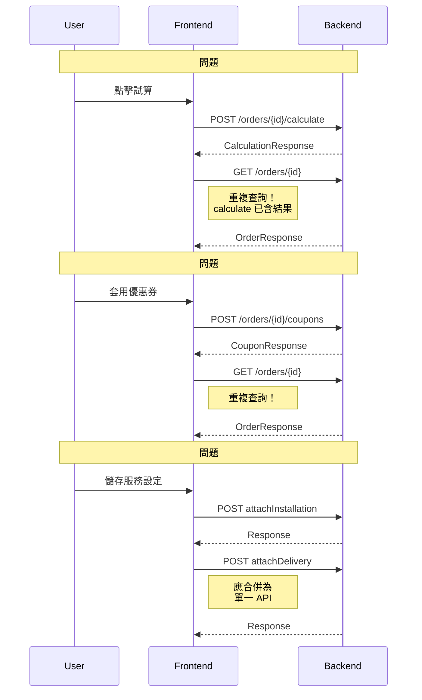

#### N+1 問題清單

| # | 場景 | 涉及 API | 位置 | 解決方案 |
|---|------|----------|------|----------|
| 1 | 試算後查詢訂單 | `calculate` + `getOrder` | `create-order:281,285` | calculate 回傳完整資料 |
| 2 | 優惠券後查詢 | `applyCoupon` + `refreshOrder` | `order-summary:171,335` | applyCoupon 回傳更新後訂單 |
| 3 | 紅利取消後查詢 | `cancelBonus` + `loadBonusPoints` | `order-summary:267,277` | cancelBonus 回傳剩餘點數 |
| 4 | 服務設定儲存 | `attachInstallation` + `attachDelivery` | `service-config:516,539` | 合併為 `updateLineServices` |

---

## 15. Unified Validation Rules (取聯集)

### 15.1 Validation Classification

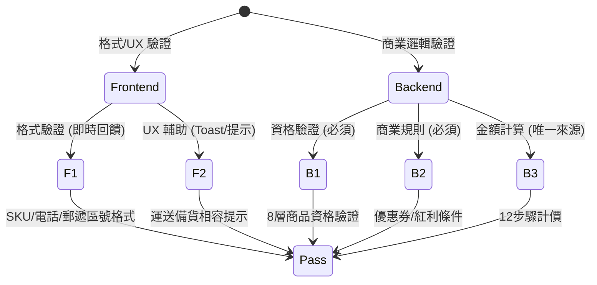

### 15.2 Final Validation Rules (Unified)

#### 前端驗證 (Frontend Only)

| 規則 ID | 驗證項目 | 目的 | 後端是否重複 |
|---------|----------|------|--------------|
| FE-001 | SKU 格式 `^[A-Za-z0-9]{5,}$` | UX 即時回饋 | 是 (可接受) |
| FE-002 | 會員卡號格式 `^[A-Za-z]\d{5,}$` | UX 即時回饋 | 是 (可接受) |
| FE-003 | 手機格式 `^09\d{8}$` | UX 即時回饋 | 是 (可接受) |
| FE-004 | 郵遞區號格式 `^\d{3}$` | UX 即時回饋 | 是 (可接受) |
| FE-005 | 運送/備貨相容性提示 | Toast 提醒 | 是 (後端強制) |

#### 後端驗證 (Backend Authoritative)

| 規則 ID | 驗證項目 | 來源 | 前端是否重複 | 建議 |
|---------|----------|------|--------------|------|
| BE-001 | 8 層商品資格驗證 | `ProductEligibilityService` | 部分 | **後端唯一** |
| BE-002 | 變價條碼唯一性 | (待新增) | JSP 有 | **後端新增** |
| BE-003 | 票券訂單商品限制 | (待新增) | JSP 有 | **後端新增** |
| BE-004 | DC 商品庫存檢查 | (待新增) | JSP 有 | **後端新增** |
| BE-005 | 商品數量限制 500/1000 | `OrderService` | JSP 有 | **後端唯一** |
| BE-006 | 優惠券 8 層驗證 | `CouponService:88-154` | 否 | 後端唯一 |
| BE-007 | 紅利 5 層驗證 | `BonusService:91-160` | 部分 | **後端唯一** |
| BE-008 | 運送/備貨相容性 | `OrderService:597-607` | 是 | **後端強制** |
| BE-009 | 安裝費最低工資 | `PriceCalculationService:272` | 否 | 後端唯一 |
| BE-010 | Type 2 負數處理 | `MemberDiscountService:127` | 否 | 後端唯一 |
| BE-011 | 變價授權驗證 | `AuthorizationService` | JSP 有 | **後端唯一** |

#### 應移除的前端驗證 (Deprecated)

| 規則 ID | 驗證項目 | 原位置 | 移除原因 |
|---------|----------|--------|----------|
| ~~DEP-001~~ | 紅利最低 10 點 | `order-summary:223` | 後端已驗證 |
| ~~DEP-002~~ | 紅利點數足夠 | `order-summary:228` | 後端已驗證 |
| ~~DEP-003~~ | grandTotal Fallback | `order-summary:107-118` | 禁止前端計算 |
| ~~DEP-004~~ | 商品小計計算 | `order-summary:65-67` | 使用後端值 |
| ~~DEP-005~~ | 安裝費總額計算 | `order-summary:93-95` | 使用後端值 |
| ~~DEP-006~~ | 運送費總額計算 | `order-summary:100-102` | 使用後端值 |

---

## 16. Optimized Calculation Flow

### 16.1 Target Architecture

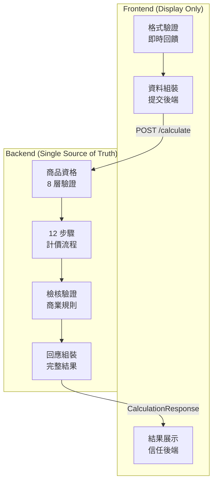

### 16.2 API Consolidation

#### Before (N+1 問題)

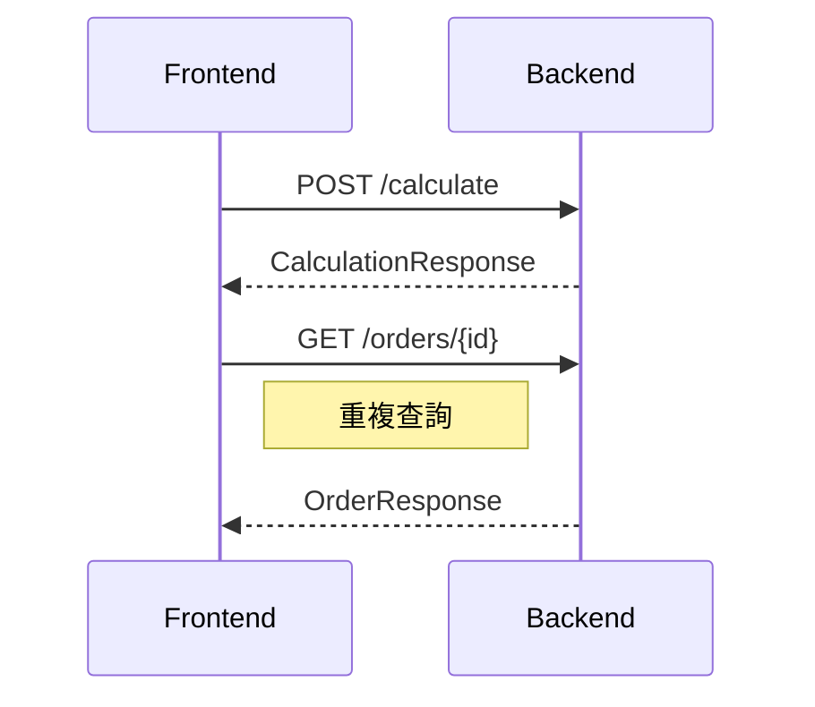

#### After (單一查詢)

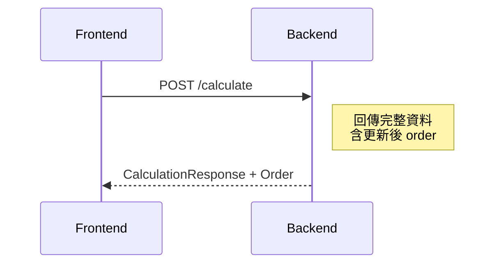

### 16.3 Service Configuration API Merge

#### Before

```typescript
// 兩次 API 呼叫
await orderService.attachInstallation(orderId, lineId, { workTypeId, serviceTypes });
await orderService.attachDelivery(orderId, lineId, { stockMethod, deliveryMethod });
```

#### After

```typescript
// 單一 API 呼叫
await orderService.updateLineServices(orderId, lineId, {
  workTypeId,
  serviceTypes,
  stockMethod,
  deliveryMethod,
  receiverInfo
});
```

---

## 17. State Machine Diagrams

### 17.1 Order Calculation State Machine

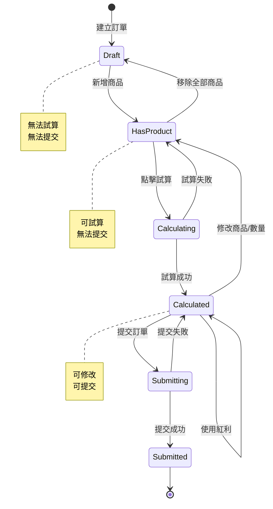

### 17.2 Member Discount Type State Machine

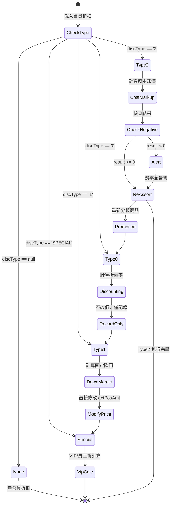

### 17.3 Coupon Validation State Machine

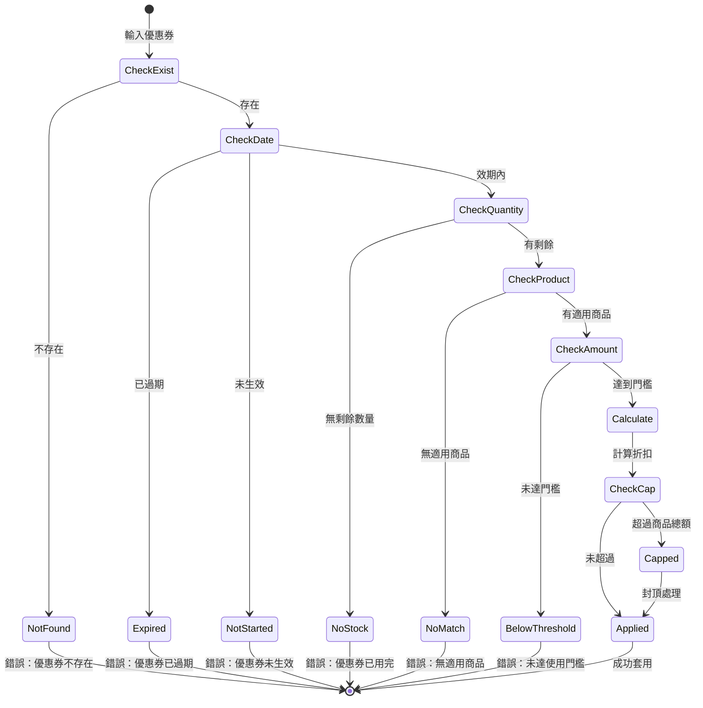

---

## 18. ER Diagram (Calculation Related)

### 18.1 Core Calculation Entities

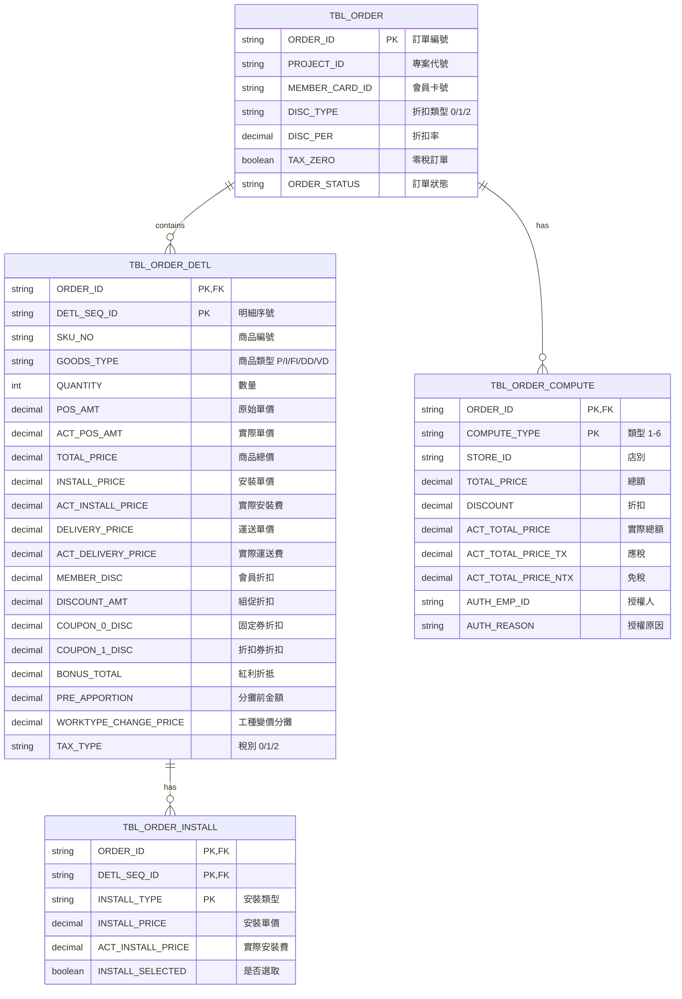

### 18.2 Member Discount Related

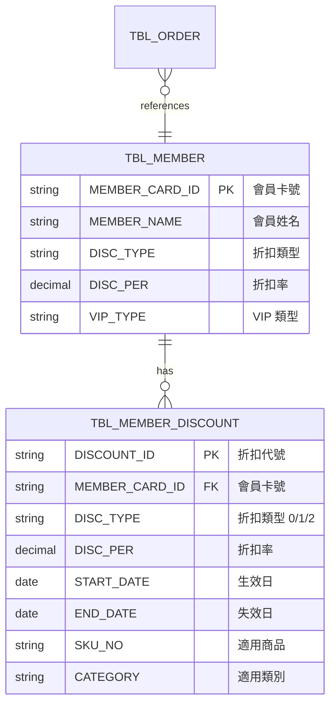

### 18.3 Coupon & Bonus Related

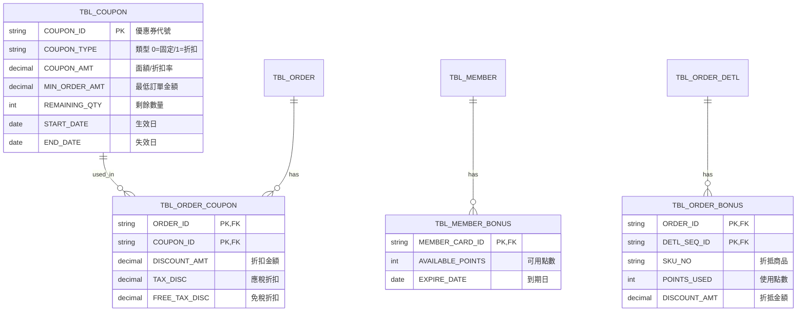

---

## 19. Implementation Recommendations

### 19.1 優先級排序

| 優先級 | 項目 | 影響 | 工作量 |
|--------|------|------|--------|
| P0 | 移除 Angular grandTotal Fallback | 防止金額不一致 | 小 |
| P0 | 移除 JSP 試算後回填計算 | 防止覆蓋後端值 | 小 |
| P1 | 後端新增變價條碼唯一性驗證 | 防止重複使用 | 中 |
| P1 | 後端新增票券訂單商品驗證 | 防止篡改 | 中 |
| P1 | 合併 calculate + getOrder API | 減少 N+1 | 中 |
| P2 | 合併 attachInstallation + attachDelivery | 減少 N+1 | 中 |
| P2 | 移除前端金額計算 (order-summary) | 統一來源 | 小 |
| P3 | 前端紅利驗證改為提示 | 保留後端強制 | 小 |

### 19.2 Code Changes Summary

#### Angular Frontend

```typescript
// order-summary.component.ts - 移除 Fallback
grandTotal = computed(() => {
  const calc = this.calculation();
  if (!calc) {
    return 0;  // 或顯示「請先試算」
  }
  return calc.grandTotal;  // 永遠使用後端值
});

// 移除這些 computed，改用後端值
// productTotal, memberDiscountTotal, couponDiscountTotal,
// bonusDiscountTotal, installationTotal, deliveryTotal
```

#### Legacy JSP

```javascript
// soSKUSubPage.jsp:2163-2177 - 移除重複計算
function setComputeInfo2Sku(jsonData) {
  // 直接使用後端值，不再計算
  el.find('[name="actPosAmt"]').val(jsonData.actPosAmt);
  // 移除: var actPosAmtInSku = parseFloat(actPosAmt) + eachSkuBonusTotal;
}
```

#### Spring Backend

```java
// OrderController.java - 合併 API 回應
@PostMapping("/api/v1/orders/{orderId}/calculate")
public CalculationWithOrderResponse calculate(@PathVariable String orderId) {
    CalculationResponse calc = orderService.calculate(orderId);
    Order order = orderService.getOrder(orderId);
    return new CalculationWithOrderResponse(calc, order);  // 合併回傳
}

// 新增驗證
@Component
public class SkuValidationService {
    public void validateQrcodeUnique(String qrcode, String orderId) {
        // 資料庫級別驗證條碼唯一性
    }

    public void validateTicketOrderProduct(String orderSource, String subDeptId, String classId) {
        // 票券訂單只能添加票券商品
    }
}
```

### 19.3 Testing Checklist

- [ ] 試算結果與 Legacy 系統一致 (誤差 ±1 元)
- [ ] 移除 Fallback 後無回歸問題
- [ ] 合併 API 後效能提升
- [ ] 後端驗證可阻擋前端繞過
- [ ] N+1 問題消除確認

---

## 20. Summary

### 20.1 關鍵發現

1. **三重計算問題**: JSP + Angular + Backend 重複計算商品金額，風險高
2. **N+1 查詢**: 試算/優惠券/服務設定後都有額外查詢
3. **前端過度檢驗**: 紅利點數、金額計算應由後端唯一控制
4. **JSP 遺留問題**: 變價條碼、票券商品驗證僅在 JSP，後端未實作

### 20.2 優化效益

| 指標 | 優化前 | 優化後 |
|------|--------|--------|
| API 呼叫次數 (試算) | 2 | 1 |
| 金額計算來源 | 3 處 | 1 處 (後端) |
| 可繞過的驗證 | 6 項 | 0 項 |
| 程式碼維護點 | JSP + Angular + Java | Java only |

---

## 21. Performance Optimization for 860K+ SKUs

> **驗證日期**: 2025-12-20
> **資料規模**: TBL_SKU 約 86 萬筆、TBL_SKU_STORE 約 2000 萬筆

### 21.1 現有效能優化機制

#### Legacy 系統已實作的優化

```mermaid
flowchart TB
    subgraph "查詢層優化"
        A[SKU_COMPUTE_LIMIT<br/>試算上限 500 筆]
        B[PAGE_SIZE<br/>分頁大小 15 筆]
        C[Oracle INDEX Hint<br/>強制使用索引]
    end

    subgraph "批次處理優化"
        D[MERGE INTO<br/>批次 Upsert]
        E[foreach IN<br/>批次查詢]
        F[三階段查詢<br/>精準→分類→通用]
    end

    subgraph "快取機制"
        G[OrderDetlVOMap<br/>O(1) 查找]
        H[會員快取<br/>TTL 30分鐘]
        I[全域快取<br/>Channel/Store/District]
    end

    A --> J[防止大量試算]
    B --> K[控制回傳資料量]
    C --> L[加速 SQL 查詢]
    D --> M[減少 DB 往返]
    E --> N[批次 IN 查詢]
    F --> O[漸進式查詢]
    G --> P[避免 O(n²)]
    H --> Q[CRM 降級]
    I --> R[減少重複查詢]
```

### 21.2 Oracle 1000 元素 IN 限制處理

**問題**: Oracle IN 子句最多 1000 元素

**Legacy 解決方案** (BzSoServices.java):
```java
// 方案 1: 分批查詢
List<List<String>> batches = Lists.partition(skuNos, 999);
for (List<String> batch : batches) {
    criteria.andSkuNoIn(batch);  // 每批 999 筆
    results.addAll(mapper.selectByCriteria(criteria));
}

// 方案 2: 試算上限 500 筆 (避免問題發生)
if (lstSkuInfo.size() > SKU_COMPUTE_LIMIT) {
    throw new BusinessException("商品明細超過 " + SKU_COMPUTE_LIMIT + " 筆無法試算");
}
```

**DDD 重構方案**:
```java
// 使用 SQL WITH 子句或臨時表
@Query("""
    WITH sku_batch AS (
        SELECT column_value AS sku_no
        FROM TABLE(SYS.ODCIVARCHAR2LIST(:skuNos))
    )
    SELECT s.* FROM TBL_SKU s
    JOIN sku_batch b ON s.SKU_NO = b.sku_no
    """)
List<TblSku> findBySkuNosUnlimited(Collection<String> skuNos);
```

### 21.3 三階段會員折扣查詢策略

**來源**: `SoFunctionMemberDisServices.java:297-360`

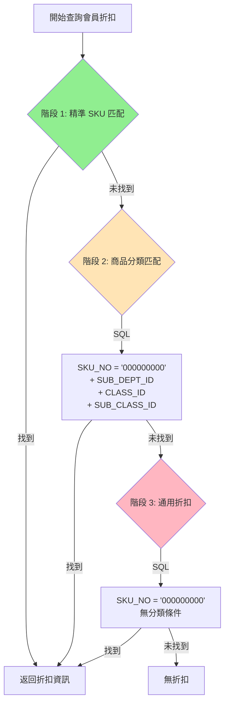

**查詢效能分析**:

| 階段 | 查詢條件 | 預期命中率 | 索引使用 |
|------|---------|-----------|---------|
| 1 | SKU_NO IN (:skus) | 高 (常見商品) | PK 索引 |
| 2 | SKU_NO='000000000' + 分類 | 中 (類別折扣) | 複合索引 |
| 3 | SKU_NO='000000000' only | 低 (全館折扣) | 部分索引 |

### 21.4 促銷計算的 OMS 決策機制

**關鍵發現**: SOM 系統**沒有**促銷優先級解決邏輯，OMS 是唯一決策者

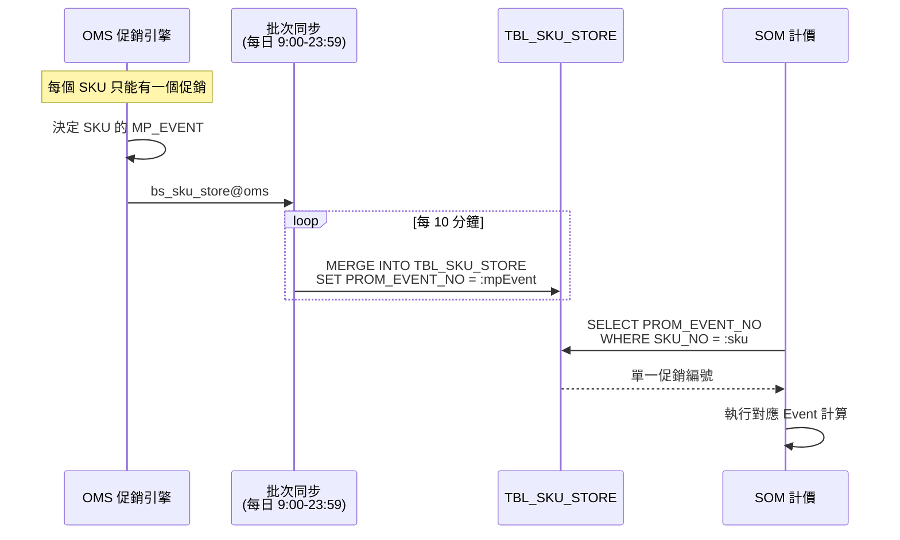

**風險**: 促銷過期窗口

```
時間線:
23:59 ─────────────────────────────────────────── 09:30 (隔天)
  │                                                   │
  │  促銷 A 過期                                       │
  │  但 TBL_SKU_STORE.PROM_EVENT_NO 仍為 A            │
  │                                                   │
  └─────────── 過期促銷仍被使用的風險窗口 ──────────────┘
```

**DDD 重構建議**: 加入促銷效期驗證
```java
public boolean isPromotionValid(String eventNo) {
    TblPromEvent event = promEventMapper.selectByEventNo(eventNo);
    if (event == null) return false;

    LocalDate today = LocalDate.now();
    return !today.isBefore(event.getStartDate())
        && !today.isAfter(event.getEndDate());
}
```

#### 促銷過期處理規則 (Clarified)

當促銷在風險窗口（23:59 ~ 隔天 09:30）過期，但 `TBL_SKU_STORE.PROM_EVENT_NO` 仍指向已過期促銷時：

- **處理方式**: 靜默忽略
- **計價邏輯**: 當作無促銷處理，按原價計算
- **日誌記錄**: 記錄 Warning Log，包含 SKU_NO、過期 EVENT_NO、訂單編號
- **理由**: 最簡單且不影響用戶體驗，OMS 同步後自動恢復正常

```java
// 實作範例
public Optional<PromotionEvent> getValidPromotion(String eventNo) {
    TblPromEvent event = promEventMapper.selectByEventNo(eventNo);
    if (event == null || !isPromotionValid(event)) {
        log.warn("促銷已過期或無效: eventNo={}", eventNo);
        return Optional.empty();  // 靜默忽略
    }
    return Optional.of(mapToPromotion(event));
}
```

### 21.5 工種變價分攤餘數處理

**來源**: `BzSoServices.java:5375-5572`

**問題**: 四捨五入會產生累計誤差

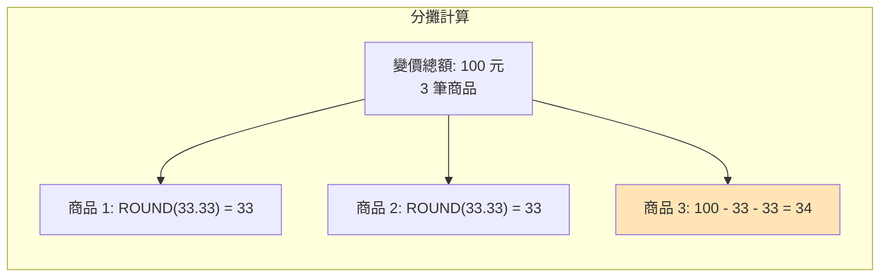

**Legacy 解決方案**:
```java
// 排序商品（金額小到大）
Collections.sort(lstInstallSkuByWorkType, comparator);

int totalApportionmentPrice = 0;
for (int i = 0; i < lstInstallSkuByWorkType.size(); i++) {
    OrderDetlVO sku = lstInstallSkuByWorkType.get(i);
    int ratio = sku.getActInstallPrice() / totalInstallPrice;
    int apportionmentPrice;

    if (i + 1 == lstInstallSkuByWorkType.size()) {
        // 最後一筆：承擔餘數
        apportionmentPrice = changePriceForInstall - totalApportionmentPrice;
    } else {
        // 其他筆：四捨五入
        apportionmentPrice = Math.round(ratio * changePriceForInstall);
    }

    totalApportionmentPrice += apportionmentPrice;
    sku.setWorkTypeChangPriceDisc(apportionmentPrice);
}
```

#### 餘數分攤優化算法 (Clarified)

當工種變價產生餘數時，採用 **按 detlSeq 逐一分攤 $1** 的方式：

1. 先計算每筆商品的基礎分攤金額（整數除法）
2. 計算餘數 = 變價總額 - 所有基礎分攤金額總和
3. 將餘數按 detlSeq 順序逐一分配 $1，直到餘數為 0

**計算範例**:
```
變價總額: 100 元，3 筆商品

Step 1: 基礎分攤
  商品 1: 100 / 3 = 33 元
  商品 2: 100 / 3 = 33 元
  商品 3: 100 / 3 = 33 元
  小計: 99 元

Step 2: 餘數分攤
  餘數: 100 - 99 = 1 元
  商品 1 (detlSeq=1): +1 元 → 34 元

最終結果: [34, 33, 33] = 100 元
```

```java
// DDD 重構實作
public void apportionWorkTypeChange(List<OrderLine> lines, Money changeAmount) {
    int total = changeAmount.intValue();
    int count = lines.size();
    int base = total / count;  // 基礎分攤
    int remainder = total % count;  // 餘數

    // 按 detlSeq 排序
    lines.sort(Comparator.comparing(OrderLine::getSerialNo));

    for (int i = 0; i < count; i++) {
        int amount = base;
        if (i < remainder) {
            amount += 1;  // 餘數逐一分攤
        }
        lines.get(i).setWorkTypeChangeDiscount(Money.of(amount));
    }
}
```

**優點**:
- 效能較佳（避免逐元迭代）
- 結果可預測且穩定
- 不會產生負數安裝費問題

### 21.6 快取機制詳細說明

#### 21.6.1 會員快取 (CRM Fallback)

**來源**: `MemberService.java`

```java
private final Map<String, CachedMember> memberCache = new ConcurrentHashMap<>();
private static final Duration CACHE_TTL = Duration.ofMinutes(30);

// Timeout 時自動 Fallback
private Optional<MemberResponse> callCrmWithTimeout(String memberId) {
    Future<Optional<MemberResponse>> future = executor.submit(() -> callCrmApi(memberId));

    try {
        return future.get(timeoutMillis, TimeUnit.MILLISECONDS);
    } catch (TimeoutException e) {
        future.cancel(true);
        return getCachedMember(memberId);  // Fallback 到快取
    }
}
```

#### CRM 長時間不可用處理 (Clarified)

當會員快取過期且 CRM API 持續不可用超過 30 分鐘時：

**三層降級策略**:
1. **優先使用過期快取**: 使用過期的快取資料，並標記警告 Log
2. **若快取不存在**: 採用「臨時卡」機制，視為一般會員（無折扣）
3. **訂單繼續**: 不中斷訂單流程，保障業務連續性

```java
// 實作範例
public MemberInfo getMemberInfo(String memberId) {
    // 1. 嘗試 CRM API
    try {
        return callCrmApi(memberId);
    } catch (CrmUnavailableException e) {
        log.warn("CRM 不可用: memberId={}", memberId);
    }

    // 2. 使用過期快取
    CachedMember cached = memberCache.get(memberId);
    if (cached != null) {
        log.warn("使用過期快取: memberId={}, cachedAt={}",
                 memberId, cached.getCachedAt());
        return cached.getMemberInfo();
    }

    // 3. 降級為臨時卡
    log.warn("降級為臨時卡: memberId={}", memberId);
    return MemberInfo.temporaryCard(memberId);
}
```

**臨時卡規則**:
- 會員等級: 一般會員
- 折扣類型: 無 (discType = null)
- 紅利點數: 0
- 備註: 記錄「CRM 降級」標記，後續可人工追溯

#### 21.6.2 冪等鍵快取 (防重複提交)

**來源**: `IdempotencyService.java`

```java
private final ConcurrentHashMap<String, IdempotencyRecord> keyStore = new ConcurrentHashMap<>();
private static final int TTL_SECONDS = 5;
private static final int CLEANUP_INTERVAL_SECONDS = 10;

// 定期清理
private void cleanupExpiredKeys() {
    keyStore.entrySet().removeIf(entry -> entry.getValue().isExpired());
}
```

#### 21.6.3 商品查找快取 (O(1) 優化)

**來源**: `SoFunctionMemberDisServices.java:361`

```java
// 建立 HashMap 快速查找
private class OrderDetlVOMap extends HashMap<String, OrderDetlVO> {
    public OrderDetlVOMap(List<OrderDetlVO> list) {
        for (OrderDetlVO vo : list) {
            this.put(vo.getDetlSeqId(), vo);  // O(1) 插入
        }
    }

    public OrderDetlVO getByDetlSeqId(String id) {
        return this.get(id);  // O(1) 查找
    }
}

// 使用場景：避免 O(n²) 巢狀迴圈
OrderDetlVOMap map = new OrderDetlVOMap(items);
for (MemberDiscVO disc : discounts) {
    OrderDetlVO sku = map.getByDetlSeqId(disc.getSeqId());  // O(1)
    // 而非 items.stream().filter(...).findFirst()  // O(n)
}
```

### 21.7 8 種促銷類型詳細計算

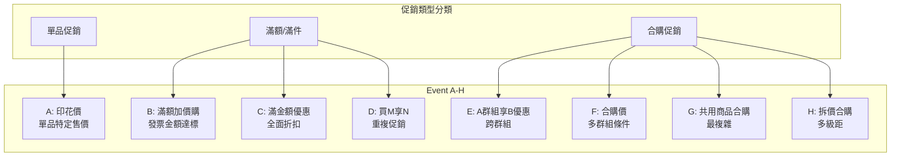

**各類型計算公式**:

| Type | 公式 | 短路條件 |
|------|------|---------|
| A | `newPrice = CEIL(posAmt × (1 - discRate))` 或 `fixedPrice` | 無符合商品 |
| B | `優惠組數 = FLOOR(發票金額 / 條件金額)` | 金額未達標 |
| C | `全商品折扣 = 達標後統一折扣率` | 金額/數量未達標 |
| D | `優惠數量 = (總數量 / M) × N` | 數量不足 M |
| E | `A群組達標 → B群組享折扣` | A群組未達標 |
| F | `所有群組達標 → 合購價` | 任一群組未達標 |
| G | `多級距共用商品 → 取最大級距` | 無符合級距 |
| H | `單品拆價 → 多級距合購` | 無符合群組 |

---

## 22. DDD Refactoring Strategy

### 22.1 簡化目標

```mermaid
flowchart LR
    subgraph "Before (疊床架屋)"
        L1[Legacy JSP<br/>計算+驗證]
        L2[Angular<br/>計算+驗證]
        L3[Spring<br/>計算+驗證]
    end

    subgraph "After (單一職責)"
        N1[Angular<br/>格式驗證+展示]
        N2[Spring<br/>所有計算+驗證]
    end

    L1 -.->|移除| N2
    L2 -.->|簡化| N1
    L3 -.->|強化| N2
```

### 22.2 效能優化策略

#### 86 萬 SKU 查詢優化

| 策略 | 實作方式 | 預期效益 |
|------|---------|---------|
| **索引優化** | SKU_NO + STORE_ID 複合索引 | 查詢 < 10ms |
| **批次查詢** | IN 子句分批 999 筆 | 避免 ORA-01795 |
| **分頁控制** | SKU_COMPUTE_LIMIT = 500 | 控制記憶體 |
| **快取層** | Redis/Caffeine 商品快取 | 減少 DB 查詢 |
| **預載入** | 啟動時載入熱門 SKU | 加速首次查詢 |

#### 試算效能優化

```mermaid
flowchart TB
    subgraph "現有問題"
        P1[500 SKU 試算 > 3秒]
        P2[促銷查詢 N+1]
        P3[會員折扣三階段]
    end

    subgraph "優化方案"
        S1[批次預載入促銷]
        S2[並行計算 ComputeType]
        S3[快取會員折扣結果]
    end

    P1 --> S1
    P2 --> S1
    P3 --> S3

    S1 --> R1[試算 < 1.5秒]
    S2 --> R1
    S3 --> R1
```

### 22.3 DDD 領域服務設計

```mermaid
classDiagram
    class OrderPricingService {
        +calculate(Order): PriceCalculation
        -revertAllSkuAmt(lines)
        -apportionmentDiscount(lines, workTypes)
        -assortSku(lines): AssortedSkus
    }

    class MemberDiscountService {
        +calculateDiscount(lines, member): List~MemberDiscVO~
        -calculateType0(lines, discRate)
        -calculateType1(lines, discRate)
        -calculateType2(lines, markupRate, cost)
    }

    class PromotionService {
        +applyPromotions(lines): List~PromotionResult~
        -getEventCalculator(eventType): EventCalculator
        -validatePromotionDate(eventNo): boolean
    }

    class CouponService {
        +validateAndApply(couponId, order): CouponResult
        -allocateDiscount(lines, amount)
        -applyCap(discount, maxAmount)
    }

    OrderPricingService --> MemberDiscountService
    OrderPricingService --> PromotionService
    OrderPricingService --> CouponService
```

### 22.4 SQL 優化建議

#### 索引設計

```sql
-- SKU 查詢索引
CREATE INDEX IDX_SKU_STORE_LOOKUP
ON TBL_SKU_STORE (STORE_ID, SKU_NO, ALLOW_SALES);

-- 促銷查詢索引
CREATE INDEX IDX_PROM_EVENT_ACTIVE
ON TBL_PROM_EVENT (EVENT_NO, START_DATE, END_DATE);

-- 會員折扣索引
CREATE INDEX IDX_CDISC_MEMBER_SKU
ON TBL_CDISC (CHANNEL_ID, DISCOUNT_ID, SKU_NO, START_DATE, END_DATE);
```

#### 批次查詢模式

```java
// MyBatis 批次查詢
@Select("""
    <script>
    SELECT * FROM TBL_SKU_STORE
    WHERE STORE_ID = #{storeId}
    AND SKU_NO IN
    <foreach item="sku" collection="skuNos" open="(" separator="," close=")">
        #{sku}
    </foreach>
    </script>
    """)
List<TblSkuStore> findBySkuNos(@Param("storeId") String storeId,
                                @Param("skuNos") List<String> skuNos);

// 使用時分批
public List<TblSkuStore> findAllBySkuNos(String storeId, List<String> skuNos) {
    return Lists.partition(skuNos, 999).stream()
        .flatMap(batch -> mapper.findBySkuNos(storeId, batch).stream())
        .toList();
}
```

---

## 23. Verification Summary

### 23.1 規格與程式碼一致性

| 規格項目 | Legacy 程式碼 | 一致性 | 備註 |
|---------|-------------|--------|------|
| 12 步驟計價流程 | `BzSoServices.java:4367-4512` | ✅ 完全一致 | - |
| 會員折扣 Type 0/1/2 | `SoFunctionMemberDisServices.java` | ✅ 完全一致 | - |
| 工種變價分攤 | `BzSoServices.java:5375-5572` | ✅ 完全一致 | 餘數處理已補充 |
| 8 種促銷類型 | `SoEvent[A-H].java` | ✅ 完全一致 | OMS 決策機制已補充 |
| 折價券分攤 | 規格已定義 | ✅ 一致 | - |
| 稅額計算 | 規格已定義 | ✅ 一致 | - |

### 23.2 遺漏細節補充

| 遺漏項目 | 補充位置 | 說明 |
|---------|---------|------|
| Oracle 1000 IN 限制 | Section 21.2 | 分批查詢策略 |
| 三階段會員折扣查詢 | Section 21.3 | 精準→分類→通用 |
| OMS 促銷決策機制 | Section 21.4 | SOM 無優先級邏輯 |
| 促銷過期風險窗口 | Section 21.4 | 午夜到 9:30 |
| 工種變價餘數處理 | Section 21.5 | 最後一筆承擔餘數 |
| 快取機制詳細說明 | Section 21.6 | 三種快取類型 |
| 促銷計算公式 | Section 21.7 | 8 種 Event 公式 |

### 23.3 DDD 重構 vs Legacy 差異

| 面向 | Legacy | DDD 重構 | 理由 |
|------|--------|---------|------|
| 促銷優先級 | OMS 決定 | 維持 OMS | 不重複實作 |
| 計算位置 | 三處重複 | 後端唯一 | 避免不一致 |
| 快取策略 | 各自實作 | 統一 Spring Cache | 可維護性 |
| 批次處理 | 分批 IN | WITH 子句或臨時表 | 效能提升 |
| 驗證邏輯 | 前後端重複 | 後端唯一 | 安全性 |

### 23.4 效能基準目標

| 操作 | Legacy | 目標 | 優化方式 |
|------|--------|------|---------|
| 商品查詢 (單筆) | ~50ms | <20ms | 索引優化 |
| 商品查詢 (100筆) | ~500ms | <100ms | 批次+快取 |
| 試算 (100 SKU) | ~1s | <500ms | 並行計算 |
| 試算 (500 SKU) | ~3s | <1.5s | 批次預載入 |
| 促銷計算 | ~500ms | <200ms | 快取促銷資料 |
| 會員折扣 | ~300ms | <100ms | 快取三階段結果 |

---

## 24. 優惠互斥與優先序規則

本章節定義各類優惠之間的互斥關係、疊加規則與執行優先序。

### 24.1 優惠類型總覽

```
┌─────────────────────────────────────────────────────────────────┐
│                        優惠類型架構                              │
├─────────────────────────────────────────────────────────────────┤
│  Layer 1: 會員折扣 (Member Discount)                            │
│    ├── Type 0: 折扣 (Discounting) - 乘以折扣率                   │
│    ├── Type 1: 降價 (Down Margin) - 減固定金額                   │
│    ├── Type 2: 成本加成 (Cost Markup) - 成本 × 加成率            │
│    └── Type CT: 通用折扣 - 全訂單級別                            │
├─────────────────────────────────────────────────────────────────┤
│  Layer 2: 促銷活動 (Event A-H)                                   │
│    ├── Event A: 印花價 (Stamp Price)                             │
│    ├── Event B: 發票金額滿額加價購                                │
│    ├── Event C: 商品滿額/滿件全面優惠                             │
│    ├── Event D: 買 M 送 N                                        │
│    ├── Event E: 買 A 群組享 B 商品優惠                            │
│    ├── Event F: 合購價                                           │
│    ├── Event G: 共用商品合購價                                    │
│    └── Event H: 單品拆價合購價                                    │
├─────────────────────────────────────────────────────────────────┤
│  Layer 3: 折價券 (Coupon)                                        │
│    └── 依 OTHER_FLAG 決定互斥模式                                 │
├─────────────────────────────────────────────────────────────────┤
│  Layer 4: 紅利點數 (Bonus Points)                                │
│    └── 使用紅利將排除該商品參與促銷                               │
└─────────────────────────────────────────────────────────────────┘
```

### 24.2 會員折扣與促銷疊加規則

```mermaid
graph TD
    subgraph "會員折扣類型"
        T0["Type 0: 折扣<br/>price × discount_rate"]
        T1["Type 1: 降價<br/>price - discount_amount"]
        T2["Type 2: 成本加成<br/>cost × markup_rate"]
        TCT["Type CT: 通用折扣<br/>全訂單適用"]
    end

    subgraph "促銷活動"
        EVT["Event A-H<br/>OMS 指定促銷"]
    end

    T0 -->|"可疊加"| EVT
    T1 -->|"可疊加"| EVT
    T2 -->|"互斥"| EVT
    TCT -.->|"條件排除"| T0
    TCT -.->|"條件排除"| T1
    TCT -.->|"條件排除"| T2

    style T2 fill:#ffcccc
    style EVT fill:#ccffcc
```

**疊加規則矩陣**:

| 會員折扣 | Event A-H | 說明 |
|---------|-----------|------|
| Type 0 (折扣) | 可疊加 | Event 先計算，再乘折扣率 |
| Type 1 (降價) | 可疊加 | Event 先計算，再減金額 |
| Type 2 (成本加成) | **互斥** | Type 2 改變基價，排除參與 Event |
| Type CT | 條件適用 | 若訂單有任何 Type 0/1/2，則 CT 不適用 |

**執行順序**:

```
1. Event A-H 先執行 (OMS 指定的促銷)
2. Type 0/1 再計算 (基於 Event 折後價)
3. Type 2 單獨計算 (不與 Event 並存)
4. Type CT 最後檢查 (全訂單級別)
```

### 24.3 Type CT 全或無規則

```mermaid
flowchart TD
    START["開始計算 Type CT"] --> CHECK{"訂單中是否有任何商品<br/>已套用 Type 0/1/2?"}
    CHECK -->|"是"| SKIP["跳過 Type CT<br/>所有商品不適用"]
    CHECK -->|"否"| APPLY["套用 Type CT<br/>全訂單商品適用"]

    SKIP --> END["結束"]
    APPLY --> END

    style SKIP fill:#ffcccc
    style APPLY fill:#ccffcc
```

**規則說明**:
- Type CT 是訂單級別的通用折扣
- 只要訂單中有**任一商品**適用 Type 0/1/2，**所有商品**都不套用 Type CT
- 這是「全或無」邏輯，不是逐項判斷

**程式碼參考**: `BzSoServices.java` 會員折扣計算邏輯

### 24.4 折價券互斥規則 (OTHER_FLAG)

```mermaid
graph TD
    subgraph "折價券互斥模式"
        M10["Mode 10: 全部可使用<br/>無限制"]
        M20["Mode 20: 全部不可使用<br/>獨佔模式"]
        M30["Mode 30: 部分可使用<br/>白名單模式"]
        M40["Mode 40: 部分不可使用<br/>黑名單模式"]
    end

    C1["折價券 A"] --> CHECK{"檢查 OTHER_FLAG"}
    CHECK -->|"10"| M10
    CHECK -->|"20"| M20
    CHECK -->|"30"| M30
    CHECK -->|"40"| M40

    M10 --> OK1["可與任何折價券併用"]
    M20 --> FAIL1["不可與任何其他折價券併用"]
    M30 --> WL["檢查 TBL_CRM_COUPON_EXC<br/>只能與白名單內折價券併用"]
    M40 --> BL["檢查 TBL_CRM_COUPON_EXC<br/>不能與黑名單內折價券併用"]

    style M20 fill:#ffcccc
    style M10 fill:#ccffcc
```

**互斥模式詳細說明**:

| Mode | OTHER_FLAG | 名稱 | 邏輯 | 資料表查詢 |
|------|------------|------|------|-----------|
| 10 | '10' | 全部可使用 | 無限制，可與任何折價券併用 | 不需查詢 |
| 20 | '20' | 全部不可使用 | 獨佔模式，不可與任何其他折價券併用 | 不需查詢 |
| 30 | '30' | 部分可使用 | 白名單模式，只能與指定折價券併用 | TBL_CRM_COUPON_EXC.SAMETIME_REBATE_VALUE |
| 40 | '40' | 部分不可使用 | 黑名單模式，不能與指定折價券併用 | TBL_CRM_COUPON_EXC.SAMETIME_REBATE_VALUE |

**驗證邏輯 (BzSoServices.java:4859-4900)**:

```java
// Mode 20: 獨佔模式
if ("20".equals(coupon.getOtherFlag()) && coupons.size() > 0) {
    return "折價券 " + skuNo + " 不可與其他折價券一起使用";
}

// Mode 30: 白名單模式 (自動加入自己)
if ("30".equals(coupon.getOtherFlag()) && coupons.size() > 0) {
    sametimeRebateValue.add(coupon.getGrno()); // 自己加入白名單
    for (CouponVO existingCoupon : coupons) {
        if (!sametimeRebateValue.contains(existingCoupon.getGrno())) {
            return "折價券 " + sku + " 不可與 折價券 " + existingSku + " 一起使用";
        }
    }
}

// Mode 40: 黑名單模式
if ("40".equals(coupon.getOtherFlag()) && coupons.size() > 0) {
    for (CouponVO existingCoupon : coupons) {
        if (sametimeRebateValue.contains(existingCoupon.getGrno())) {
            return "折價券 " + sku + " 不可與 折價券 " + existingSku + " 一起使用";
        }
    }
}
```

#### 多張折價券計算順序 (Clarified)

當訂單同時套用多張折價券且互斥檢查通過時：

- **計算順序**: 依加入順序 (FIFO)
- **先套用的折價券先計算**，後續折價券基於折後金額繼續計算
- **理由**: 簡單且可預測，符合 Legacy 系統行為

**計算範例**:
```
訂單金額: $1000
折價券 A (先加入): 固定 $100 折扣 → $1000 - $100 = $900
折價券 B (後加入): 8 折 → $900 × 0.8 = $720
最終金額: $720
```

```java
// 實作範例
public Money applyCoupons(Money originalAmount, List<Coupon> coupons) {
    Money result = originalAmount;
    for (Coupon coupon : coupons) {  // 依加入順序迭代
        result = coupon.apply(result);
    }
    return result;
}
```

### 24.5 紅利點數排除規則

```mermaid
flowchart TD
    ITEM["商品項目"] --> BONUS{"BonusTotal > 0?<br/>(使用紅利點數)"}
    BONUS -->|"是"| EXCLUDE["排除參與 Event A-H<br/>只計算原價或會員折扣"]
    BONUS -->|"否"| EVENT["可參與 Event A-H 促銷"]

    EXCLUDE --> REPRICE["需重新試算<br/>移除已套用促銷"]
    EVENT --> CALC["正常促銷計算"]

    style EXCLUDE fill:#ffcccc
    style EVENT fill:#ccffcc
```

**關鍵規則**:
- 若商品使用紅利點數折抵 (BonusTotal > 0)，該商品**排除**參與所有 Event A-H 促銷
- 這意味著使用紅利後需要**重新試算**，移除該商品原本套用的促銷優惠
- 程式碼參考: `SoComputeFunctionMain.java:155`

### 24.6 促銷優先序機制 (OMS 權威模式)

```mermaid
sequenceDiagram
    participant OMS as OMS<br/>(訂單管理系統)
    participant SOM as SOM<br/>(特殊訂單系統)
    participant DB as TBL_PROM_EVENT

    Note over OMS,DB: 促銷優先序由 OMS 決定，SOM 只執行

    OMS->>DB: 指定商品促銷 (EVENT_NO)
    Note over OMS: OMS 內部決定優先級<br/>SOM 不參與決策

    SOM->>DB: 查詢商品促銷標記
    DB-->>SOM: EVENT_NO = 'A'/'B'/.../H

    alt 有促銷標記
        SOM->>SOM: 執行對應 Event 邏輯
    else 無促銷標記
        SOM->>SOM: 只計算會員折扣
    end

    Note over SOM: SOM 無優先級選擇邏輯<br/>不比較 "哪個促銷更優"
```

**架構說明**:
- **OMS 權威模式**: 促銷優先級完全由 OMS 決定，SOM 只負責執行
- **無優先比較**: SOM 不實作「選擇最優促銷」邏輯
- **單一促銷**: 每個商品只會被標記一個 Event 類型
- **TBL_PROM_EVENT 無優先級欄位**: 資料表設計即反映此架構

### 24.7 Event 數量超限處理差異

不同 Event 類型對於數量超限有不同處理邏輯:

```mermaid
flowchart TD
    subgraph "Event A: 印花價"
        A_CHECK{"數量 > LIMIT_QTY?"} -->|"是"| A_FAIL["整筆促銷失敗<br/>全部回歸原價"]
        A_CHECK -->|"否"| A_OK["全部享優惠價"]
    end

    subgraph "Event B/D/E: 階梯式"
        B_CHECK{"數量 > LIMIT_QTY?"} -->|"是"| B_PARTIAL["限額內享優惠<br/>超額部分原價"]
        B_CHECK -->|"否"| B_OK["全部享優惠價"]
    end

    style A_FAIL fill:#ffcccc
    style A_OK fill:#ccffcc
    style B_PARTIAL fill:#ffffcc
    style B_OK fill:#ccffcc
```

| Event 類型 | 超限模式 | 行為 | 範例 |
|-----------|----------|------|------|
| Event A | 全或無 | 超限 = 整筆失敗 | 限買 5 件，買 6 件 → 6 件全原價 |
| Event B | 階梯式 | 超限 = 部分優惠 | 限買 5 件，買 6 件 → 5 件優惠 + 1 件原價 |
| Event D | 階梯式 | 超限 = 部分優惠 | 買 3 送 1 限 2 組，買 9 件 → 6 件計算 + 3 件原價 |
| Event E | 階梯式 | 超限 = 部分優惠 | 條件商品超限時，優惠商品部分適用 |

**程式碼參考**:
- Event A: `SoEventA.java:159-170` - 檢查超限後直接 return 錯誤
- Event B: `SoEventB.java:195` - 計算完一層後繼續下一層

### 24.8 Event B 堆積 (HEAP) 模式

```mermaid
flowchart TD
    subgraph "HEAP = 'Y' (堆積模式)"
        Y1["滿 1000 減 50"] --> Y2["滿 2000 再減 80"]
        Y2 --> Y3["滿 3000 再減 100"]
        Y3 --> YTOTAL["總折扣: 50 + 80 + 100 = 230"]
    end

    subgraph "HEAP = 'N' (擇優模式)"
        N1["滿 1000 減 50"] --> N_CHECK{"金額 >= 3000?"}
        N_CHECK -->|"是"| N3["只套用: 滿 3000 減 100"]
        N_CHECK -->|"否"| N2["檢查下一層..."]
    end

    style YTOTAL fill:#ccffcc
    style N3 fill:#ffffcc
```

| HEAP | 模式 | 說明 | 範例 (消費 3500 元) |
|------|------|------|-------------------|
| 'Y' | 堆積 | 所有符合條件的層級都累計 | 50 + 80 + 100 = 230 |
| 'N' | 擇優 | 只取最高層級一次 | 100 |

### 24.9 互斥規則摘要表

```
┌────────────────────────────────────────────────────────────────────────┐
│                          互斥規則快速參照表                              │
├─────────────────┬──────────────────┬───────────────┬──────────────────┤
│ 組合            │ 關係             │ 執行順序      │ 備註             │
├─────────────────┼──────────────────┼───────────────┼──────────────────┤
│ Type 0/1 + Event│ 可疊加           │ Event → Type  │ 先促銷再會員折扣 │
│ Type 2 + Event  │ 互斥             │ 只取 Type 2   │ 成本加成獨立計算 │
│ Type CT + 0/1/2 │ 條件排除         │ 0/1/2 優先    │ 有其他則 CT 不用 │
│ Bonus + Event   │ 排除             │ 只算會員折扣  │ 用紅利排除促銷   │
│ Coupon + Coupon │ 視 OTHER_FLAG    │ 依加入順序    │ 查 TBL_CRM_COUPON│
│ Event + Event   │ 單一指定         │ OMS 決定      │ 每商品只有一個   │
└─────────────────┴──────────────────┴───────────────┴──────────────────┘
```

### 24.10 DDD 重構建議

基於互斥規則分析，建議的 Domain Model 設計:

```mermaid
classDiagram
    class DiscountPolicy {
        <<interface>>
        +canStackWith(other: DiscountPolicy): boolean
        +getPriority(): int
        +calculate(price: Money): Money
    }

    class MemberDiscount {
        -type: DiscountType
        -rate: BigDecimal
        +canStackWith(other): boolean
    }

    class PromotionEvent {
        -eventType: EventType
        -limitQty: int
        -heapMode: boolean
        +canStackWith(other): boolean
    }

    class Coupon {
        -otherFlag: CouponMode
        -exclusionList: List~String~
        +canStackWith(other): boolean
    }

    class BonusRedemption {
        -points: int
        +excludesPromotions(): boolean
    }

    class DiscountResolver {
        +resolve(policies: List~DiscountPolicy~): List~DiscountPolicy~
        -filterExclusive(policies): List~DiscountPolicy~
        -sortByPriority(policies): List~DiscountPolicy~
    }

    DiscountPolicy <|.. MemberDiscount
    DiscountPolicy <|.. PromotionEvent
    DiscountPolicy <|.. Coupon
    DiscountPolicy <|.. BonusRedemption
    DiscountResolver --> DiscountPolicy
```

**關鍵設計決策**:

1. **DiscountPolicy 介面**: 統一所有優惠類型的行為
2. **canStackWith() 方法**: 封裝互斥邏輯，每種優惠知道自己能否與其他優惠疊加
3. **DiscountResolver**: 負責解決優惠衝突，過濾互斥項目

```java
// 範例: MemberDiscount 互斥邏輯
public class MemberDiscount implements DiscountPolicy {
    @Override
    public boolean canStackWith(DiscountPolicy other) {
        if (this.type == DiscountType.COST_MARKUP) {
            // Type 2 不能與促銷疊加
            return !(other instanceof PromotionEvent);
        }
        return true; // Type 0/1 可以疊加
    }
}

// 範例: Coupon 互斥邏輯
public class Coupon implements DiscountPolicy {
    @Override
    public boolean canStackWith(DiscountPolicy other) {
        if (!(other instanceof Coupon)) return true;

        Coupon otherCoupon = (Coupon) other;
        return switch (this.otherFlag) {
            case MODE_10 -> true;  // 全部可用
            case MODE_20 -> false; // 全部不可用
            case MODE_30 -> this.whitelist.contains(otherCoupon.getGrno());
            case MODE_40 -> !this.blacklist.contains(otherCoupon.getGrno());
        };
    }
}
```

---

## 25. 延伸規格文件

為避免本文件過大，以下規則已拆分至獨立文件:

### 25.1 工種-商品對照規則

**文件**: [worktype-mapping-spec.md](./worktype-mapping-spec.md)

**涵蓋內容**:
- TBL_WORKTYPE_SKUNO_MAPPING 查詢邏輯
- DISCOUNT_BASE vs DISCOUNT_EXTRA 折數選擇
- 安裝成本計算公式
- GoodsType 與折數對應表

**快速參照**:
| GoodsType | 說明 | 使用折數 |
|-----------|------|---------|
| I, IA, IS | 標安/提前/補充 | DISCOUNT_BASE |
| IE | 其他安裝 | DISCOUNT_EXTRA |
| IC | 安裝調整 | 成本 = 0 |

### 25.2 運費與配送規則

**文件**: [delivery-fee-spec.md](./delivery-fee-spec.md)

**涵蓋內容**:
- 6 種配送方式 (N/D/V/F/C/P) 總覽
- 免運條件完整規則
- 直送費用計算 (ComputeType 5)
- 大型家具配送規則
- 宅配工種規則 (0167)
- 當場自取驗收邏輯

**快速參照**:
| 配送方式 | 代碼 | 運費 | 安裝 |
|---------|:----:|:----:|:----:|
| 運送 | N | 有 | 有 |
| 純運 | D | 有 | 無 |
| 直送 | V | 有 | 無 |
| 宅配 | F | 有 | 無 |
| 當場自取 | C | 無 | 無 |
| 下次自取 | P | 無 | 無 |

### 25.3 文件索引

```
specs/002-create-order/
├── pricing-calculation-spec.md   # 本文件: 試算主規格
├── worktype-mapping-spec.md      # 工種-商品對照規則
└── delivery-fee-spec.md          # 運費與配送規則
```
