# Pricing Calculation Specification

> **Feature**: 002-create-order
> **Version**: 1.0.0
> **Last Updated**: 2025-12-20
> **Status**: Draft

## Overview

本文件定義訂單價格計算的完整規格，包含 12 步驟計價流程、會員折扣計算公式、促銷邏輯、分攤機制等詳細規則。

**來源驗證**: 所有計算公式均來自 `C:/projects/som` Legacy 程式碼驗證。

---

## 1. 12 Steps Calculation Flow

### 1.1 Flow Overview

```text
doCalculate(Order)
  |
  +-- Step 1: revertAllSkuAmt()
  |            還原所有商品的銷售單價至原始 POS 價
  |
  +-- Step 2: apportionmentDiscount()
  |            工種變價分攤（安裝/運送費變價時按比例分攤到各商品）
  |
  +-- Step 3: assortSku()
  |            商品分類（P/I/FI/DD/VD/D）
  |
  +-- Step 4: memberDiscountType2()
  |            Cost Markup 會員折扣（成本加價）
  |
  +-- Step 5: promotionCalculation()
  |            多重促銷計算（8 種促銷類型）
  |
  +-- Step 6: memberDiscountType0()
  |            Discounting 會員折扣（折價率折扣）
  |
  +-- Step 7: memberDiscountType1()
  |            Down Margin 會員折扣（固定降價）
  |
  +-- Step 8: specialMemberDiscount()
  |            特殊會員折扣（VIP/員工價）
  |
  +-- Step 9: generateComputeType1()
  |            生成商品小計試算記錄
  |
  +-- Step 10: generateComputeType2()
  |             生成安裝小計試算記錄
  |
  +-- Step 11: generateComputeType3()
  |             生成運送小計試算記錄
  |
  +-- Step 12: generateComputeType456()
               生成會員折扣/直送/折價券試算記錄
```

### 1.2 Step Dependency

```text
Step 1 ─────────────────────────────────────────────────────────┐
                                                                 |
Step 2 ────────────────────────────────────────────────────────>|
                                                                 |
Step 3 ────────────────────────────────────────────────────────>|
                                                                 |
Step 4 (Type 2) ──> Step 5 (Promotion) ──> Step 6 (Type 0) ──> |
                                                                 |
                                           Step 7 (Type 1) ──> |
                                                                 |
                                           Step 8 (Special) ──>|
                                                                 |
Step 9-12 ←─────────────────────────────────────────────────────┘
(可並行執行)
```

### 1.3 Step Details

#### Step 1: Revert All SKU Amount

**目的**: 還原商品價格至原始狀態，確保每次試算從相同基準開始

**規則**:
- `actPosAmt` = `posAmt`
- `actInstallPrice` = `installPrice` × `quantity`
- `actDeliveryPrice` = `deliveryPrice` × `quantity`
- 清除所有折扣記錄

**程式碼來源**: `BzSoServices.java` revertAllSkuAmt()

---

#### Step 2: Apportionment Discount (工種變價分攤)

**目的**: 當安裝/運送工種有變價授權時，將變價差額分攤到該工種下的各商品

**觸發條件**:
- `installAuthEmpId` IS NOT NULL AND `installPrice` != `actInstallPrice`
- `deliveryAuthEmpId` IS NOT NULL AND `deliveryPrice` != `actDeliveryPrice`

**分攤公式**:

```
changePriceForInstall = installPrice - actInstallPrice
changePriceForDelivery = deliveryPrice - actDeliveryPrice

For each SKU in workType:
  ratio = skuSubtotal / workTypeTotal
  apportionmentAmount = ROUND(changePriceAmount × ratio)

  newUnitPrice = originalUnitPrice - (apportionmentAmount / quantity)
  newTotalPrice = newUnitPrice × quantity - remainder

  Where:
    remainder = apportionmentAmount MOD quantity
```

**最後一筆修正**:
```
lastApportionment = changePriceAmount - sumOfPreviousApportionments
```

**程式碼來源**: `BzSoServices.java:5375-5572`

---

#### Step 3: Assort SKU (商品分類)

**目的**: 按商品類型分群，供後續計算使用

**分類規則**:

| GoodsType | 分類 | 說明 |
|-----------|------|------|
| P | lstGoodsSku | 一般商品 |
| I, IA, IE, IC, IS | lstInstallSku | 安裝商品 |
| FI | lstFreeInstallSku | 免安商品 |
| DD | lstDeliverSku | 運送商品 |
| VD | lstDirectShipmentSku | 直送商品 |
| D | lstWorkTypeSku | 工種商品 |

**程式碼來源**: `BzSoServices.java` AssortSku()

---

#### Step 4: Member Discount Type 2 (Cost Markup)

**目的**: 成本加價折扣 - 以成本為基準計算售價

**執行時機**: 所有促銷計算之前（因為會完全替換 actPosAmt）

**計算公式**:

```
discountPercent = discountPer / 100

For 商品類型 P:
  newPrice = CEIL(unitCost × (1 + discountPercent))

  IF !taxZero AND taxType == '1':
    newPrice = FLOOR(newPrice × 1.05)  // 加營業稅

  discountAmt = posAmt - newPrice
  actPosAmt = newPrice
  totalPrice = newPrice × quantity
```

**特殊處理**:
- Type 2 執行後必須重新分類商品（因 actPosAmt 完全替換）
- 計算結果為負數時 → 歸零並發送告警信

**程式碼來源**: `SoFunctionMemberDisServices.java:474-511`

---

#### Step 5: Promotion Calculation (多重促銷)

**目的**: 執行 8 種促銷類型計算

**促銷類型**:

| Type | Class | 說明 | 優先級 |
|------|-------|------|--------|
| A | SoEventA | 印花價 | 1 (最高) |
| B | SoEventB | 發票金額滿額加價購 | 2 |
| C | SoEventC | 商品滿額/滿件全面優惠 | 3 |
| D | SoEventD | 每買 M 個享 N 個優惠 | 4 |
| E | SoEventE | 買 A 群組享 B 群組優惠 | 5 |
| F | SoEventF | 合購價 | 6 |
| G | SoEventG | 共用商品合購價 | 7 |
| H | SoEventH | 單品拆價合購價 | 8 |

**執行順序**:
1. 依 EVENT_NO 分群商品
2. 依促銷類型優先級執行
3. 已參與促銷的商品不再參與其他促銷

**程式碼來源**: `SoComputeFunctionMain.java:76-105`

---

#### Step 6: Member Discount Type 0 (Discounting)

**目的**: 折價率折扣 - 不修改 actPosAmt，僅記錄折扣金額

**計算公式**:

```
discountPercent = discountPer / 100

For 商品類型 P:
  totalPrice = CEIL(
    posAmt
    + (bonusTotal / quantity)     // 紅利折抵
    + (promotionDisc / quantity)  // 組促折扣
  )

  discountAmt = CEIL(totalPrice × discountPercent)
  memberDisc = discountAmt × quantity

For 安裝商品 (I/IA/IE/IC/IS):
  discountAmt = CEIL(installPrice × discountPercent)
  memberDisc = discountAmt × quantity

For 運送商品 (DD/VD):
  discountAmt = CEIL(deliveryPrice × discountPercent)
  memberDisc = discountAmt × quantity
```

**特性**:
- 不修改 actPosAmt
- 折扣記錄於 memberDisc 欄位
- 最終在 ComputeType 4 中匯總

**程式碼來源**: `SoFunctionMemberDisServices.java:405-437`

---

#### Step 7: Member Discount Type 1 (Down Margin)

**目的**: 固定降價折扣 - 直接修改 actPosAmt

**計算公式**:

```
discountPercent = discountPer / 100

For 商品類型 P:
  discountAmt = CEIL((actPosAmt + FLOOR(promotionDisc / quantity)) × discountPercent)

  newPrice = actPosAmt - discountAmt
  actPosAmt = newPrice
  totalPrice = newPrice × quantity
  posAmtChangePrice = true

For 安裝商品:
  discountAmt = CEIL(installPrice × discountPercent)
  newPrice = installPrice - discountAmt
  actInstallPrice = newPrice × quantity
  installChangePrice = true

For 運送商品:
  discountAmt = CEIL(deliveryPrice × discountPercent)
  newPrice = deliveryPrice - discountAmt
  actDeliveryPrice = newPrice × quantity
  deliveryChangePrice = true
```

**特性**:
- 直接修改實際價格欄位
- 設定變價標記

**程式碼來源**: `SoFunctionMemberDisServices.java:440-471`

---

#### Step 8: Special Member Discount

**目的**: 執行特殊會員折扣（VIP、員工價等）

**觸發條件**:
- 會員卡別符合特殊會員類型
- 前面步驟無任何會員折扣

**程式碼來源**: `BzSoServices.java` soComputeMemberDisForSpecial()

---

#### Steps 9-12: Generate ComputeType Records

**目的**: 生成 6 種試算記錄

**ComputeType 定義**:

| Type | 名稱 | 計算來源 |
|------|------|----------|
| 1 | 商品小計 | SUM(lstGoodsSku.actPosAmt × quantity) |
| 2 | 安裝小計 | SUM(lstInstallSku.actInstallPrice) |
| 3 | 運送小計 | SUM(lstDeliverSku.actDeliveryPrice) |
| 4 | 會員卡折扣 | SUM(all.memberDisc) (負數) |
| 5 | 直送費用小計 | SUM(lstDirectShipmentSku.actDeliveryPrice) |
| 6 | 折價券折扣 | SUM(all.couponDisc) (負數) |

**每種 ComputeType 的欄位**:

| 欄位 | 說明 |
|------|------|
| totalPrice | 總額（折扣前） |
| discount | 折扣金額 |
| actTotalPrice | 實際總額（= totalPrice + discount） |
| actTotalPriceTx | 應稅金額 |
| actTotalPriceNtx | 免稅金額 |

**程式碼來源**: `BzSoServices.java:4961-5046` setOrderCompute()

---

## 2. Member Discount Calculation

### 2.1 Discount Type Overview

| Type | Name | Behavior | Price Field Modified |
|------|------|----------|---------------------|
| 0 | Discounting | 折價率折扣，不改價 | memberDisc only |
| 1 | Down Margin | 固定降價，改價 | actPosAmt/actInstallPrice/actDeliveryPrice |
| 2 | Cost Markup | 成本加價，完全替換價格 | actPosAmt (全部替換) |

### 2.2 Discount Percent Interpretation

```
discountPer = 0   → 無折扣 (100% 原價)
discountPer = 25  → 75 折 (付 75%)
discountPer = 60  → 4 折 (付 40%)
discountPer = 100 → 0 折 (免費)
```

### 2.3 Execution Priority

```
Type 2 (Cost Markup)
  ↓
Promotion Calculation
  ↓
Type 0 (Discounting)
  ↓
Type 1 (Down Margin)
  ↓
Special Member Discount
```

### 2.4 Tax-Aware Calculation

Type 2 營業稅處理：
```java
IF !taxZero AND taxType == '1':
  newPrice = FLOOR(newPrice × 1.05)  // 5% 營業稅
```

Type 0/1 應稅/免稅分離：
```java
IF taxType == '1':  // 應稅
  taxDisc += discountAmt
ELSE IF taxType == '2' OR taxZero:  // 免稅或零稅
  freeTaxDisc += discountAmt
```

---

## 3. Installation Fee Calculation

### 3.1 Installation Fee Components

```
安裝費 = 標準安裝費 + 進階安裝費 + 其他安裝費 - 免安折扣
```

**商品類型對應**:

| GoodsType | 說明 | 計算方式 |
|-----------|------|----------|
| I | 基本安裝 | installPrice × quantity |
| IA | 進階安裝 | installPrice × quantity |
| IE | 其他安裝 | installPrice × quantity |
| IC | 安裝調整 | installPrice × quantity |
| IS | 補安裝費 | installPrice × quantity |
| FI | 免安折扣 | 負數金額，抵扣安裝費 |

### 3.2 Worktype Cost Discount

**標安折數** (WORKTYPE_DISCOUNT_BASE): 有免安時適用
**非標折數** (WORKTYPE_DISCOUNT_EXTRA): 無免安時適用

```
IF hasFreeInstall:
  discountRate = WORKTYPE_DISCOUNT_BASE
ELSE:
  discountRate = WORKTYPE_DISCOUNT_EXTRA

adjustedCost = baseCost × discountRate
```

### 3.3 Minimum Wage Check

```
IF totalInstallFee < sumOfFreeInstallDiscount:
  WARNING: "工種 {workTypeId} 變價金額不可小於免安金額"
```

**例外**: 純運(D)和宅配除外

---

## 4. Delivery Fee Calculation

### 4.1 Delivery Fee Formula

**基礎公式**:
```
deliveryFee = volumeRate × volume
```

**材積計算**:
```
volume = (length × width × height) / 5000  // cm → 材積
```

### 4.2 Delivery Types

| DeliveryFlag | 說明 | 費用計算 |
|--------------|------|----------|
| N | 運送 | 標準運送費 |
| D | 純運 | 純運費（無安裝） |
| V | 直送 | 直送費（廠商送） |
| C | 當場自取 | 0 |
| P | 下次自取 | 0 |

### 4.3 Free Delivery Conditions

```
IF freeDelivery == 'Y' OR freeDeliveryShipping == 'Y':
  deliveryFee = 0

IF orderTotal >= freeDeliveryThreshold:
  deliveryFee = 0
```

---

## 5. Coupon Apportionment

### 5.1 Fixed Amount Coupon (Type 0)

**分攤公式**:
```
For each eligibleSku:
  ratio = skuPrice / totalEligiblePrice
  apportionedAmount = CEIL(couponAmount × ratio)

// 最後一筆修正
lastSkuApportionment = couponAmount - sumOfPreviousApportionments
```

### 5.2 Discount Rate Coupon (Type 1)

```
discountAmount = CEIL(skuPrice × couponDiscountRate)
```

### 5.3 Cap Processing (封頂處理)

```
IF totalCouponDiscount > totalEligibleAmount:
  actualDiscount = totalEligibleAmount
  excessAmount = totalCouponDiscount - totalEligibleAmount  // 不退
```

### 5.4 Tax Separation

```
FOR each sku in eligibleSkus:
  IF taxType == '1':  // 應稅
    taxCouponDisc += skuCouponDisc
  ELSE:               // 免稅
    freeTaxCouponDisc += skuCouponDisc
```

---

## 6. Tax Calculation

### 6.1 Tax Types

| TaxType | 說明 | 稅率 |
|---------|------|------|
| 1 | 應稅 | 5% |
| 2 | 免稅 | 0% |
| 0 | 零稅 | 0% (特殊) |

### 6.2 Tax Calculation Rules

**應稅商品**:
```
taxAmount = FLOOR(actTotalPrice / 1.05 × 0.05)
// 或
taxAmount = actTotalPrice - FLOOR(actTotalPrice / 1.05)
```

**免稅/零稅商品**:
```
taxAmount = 0
```

### 6.3 Tax Zero Order

當訂單標記為零稅 (`taxZero = true`) 時：
- 所有商品視為零稅計算
- Type 2 不加營業稅
- 試算結果全部歸入 actTotalPriceNtx

---

## 7. Rounding Rules

### 7.1 Rounding Methods

| 方法 | Java 實作 | 使用場景 |
|------|-----------|----------|
| 無條件進位 | `Math.ceil(value)` | 折扣金額計算 |
| 四捨五入 | `Math.round(value)` | 分攤金額計算 |
| 無條件捨去 | `BigDecimal.ROUND_FLOOR` | 營業稅計算 |

### 7.2 Application Rules

```
Type 0/1 折扣: CEIL
Type 2 新價格: CEIL
Type 2 營業稅: FLOOR
分攤金額: ROUND
最後一筆分攤: 差額修正（不使用舍入）
```

---

## 8. Data Structures

### 8.1 MemberDiscVO

```java
public record MemberDiscVO(
    String discountId,      // 折扣代號
    String discPer,         // 折扣率 (00~100)
    String discType,        // 折扣類型 (0/1/2)
    String startDate,       // 生效日
    String endDate,         // 失效日
    String discAmt,         // 折扣金額 (應稅)
    String ndiscAmt,        // 折扣金額 (免稅)
    String taxType,         // 稅別
    String skuNo,           // 商品編號
    String detlSeqId        // 明細流水號
) {}
```

### 8.2 OrderComputeVO

```java
public record OrderComputeVO(
    String orderId,
    String computeType,       // 1-6
    String storeId,
    BigDecimal totalPrice,    // 總額
    BigDecimal discount,      // 折扣 (負數)
    BigDecimal actTotalPrice, // 實際總額
    BigDecimal actTotalPriceTx,  // 應稅
    BigDecimal actTotalPriceNtx, // 免稅
    String authorizedEmpId,
    String authorizedEmpName,
    String authorizedReason,
    LocalDateTime authorizedDate,
    BigDecimal discountFrcms  // 加盟折扣
) {}
```

### 8.3 Price Fields in OrderDetlVO

| 欄位 | 說明 | 修改時機 |
|------|------|----------|
| posAmt | 原始 POS 價 | 不修改 |
| actPosAmt | 實際 POS 價 | Type 1/2 修改 |
| totalPrice | 商品總價 | Type 1/2 修改 |
| installPrice | 安裝單價 | 不修改 |
| actInstallPrice | 安裝實際總價 | Type 1 修改 |
| deliveryPrice | 運送單價 | 不修改 |
| actDeliveryPrice | 運送實際總價 | Type 1 修改 |
| memberDisc | 會員折扣 | Type 0 記錄 |
| discountAmt | 組促折扣 | 促銷計算記錄 |
| coupon0Disc | 固定面額折價券 | 折價券分攤 |
| coupon1Disc | 折扣率折價券 | 折價券計算 |
| preApportion | 分攤前金額 | 工種變價記錄 |
| workTypeChangPriceDisc | 工種變價分攤額 | 工種變價記錄 |

---

## 9. Flowcharts

### 9.1 Complete Calculation Flow


### 9.2 Member Discount Type Selection


---

## 10. Validation Rules

### 10.1 Pre-calculation Validation

| Rule | Description | Action |
|------|-------------|--------|
| V-001 | 商品明細數量 ≤ 500 | 超過則阻止試算 |
| V-002 | 至少一項商品 | 無商品則阻止試算 |
| V-003 | 會員資料已載入 | 無會員則跳過會員折扣 |

### 10.2 Post-calculation Validation

| Rule | Description | Action |
|------|-------------|--------|
| V-010 | Type 2 結果為負數 | 歸零並發送告警信 |
| V-011 | 安裝費低於免安金額 | 顯示警告（不阻擋） |
| V-012 | 試算結果合計不為負 | 異常則記錄日誌 |

---

## 11. Legacy Code References

| 功能 | 檔案 | 方法/行號 |
|------|------|----------|
| 主計價流程 | BzSoServices.java | doCalculate():4367 |
| 商品分類 | BzSoServices.java | AssortSku() |
| 工種變價分攤 | BzSoServices.java | apportionmentDiscount():5375-5572 |
| 會員折扣 Type 0 | SoFunctionMemberDisServices.java | updateMemberDiscForDiscountType0():405-437 |
| 會員折扣 Type 1 | SoFunctionMemberDisServices.java | updateMemberDiscForDiscountType1():440-471 |
| 會員折扣 Type 2 | SoFunctionMemberDisServices.java | updateMemberDiscForDiscountType2():474-511 |
| 促銷計算 | SoComputeFunctionMain.java | init():76-105 |
| 生成試算記錄 | BzSoServices.java | setOrderCompute():4961-5046 |
| 折價券分攤 | BzSoServices.java | :1613-1684 |
| 應稅免稅分離 | SoFunctionMemberDisServices.java | :595-628 |

---

## 12. Appendix

### A. GoodsType Constants

```java
public enum GoodsType {
    P("P", "一般商品"),
    I("I", "基本安裝"),
    IA("IA", "進階安裝"),
    IE("IE", "其他安裝"),
    IC("IC", "安裝調整"),
    IS("IS", "補安裝費"),
    FI("FI", "免安折扣"),
    DD("DD", "運送"),
    VD("VD", "直送"),
    D("D", "工種"),
    VT("VT", "會員卡折扣"),
    CP("CP", "折價券"),
    CK("CK", "折扣券"),
    CI("CI", "酷卡折扣"),
    BP("BP", "紅利折抵"),
    TT("TT", "總額折扣");
}
```

### B. ComputeType Constants

```java
public static final String COMPUTE_TYPE_1 = "1";  // 商品小計
public static final String COMPUTE_TYPE_2 = "2";  // 安裝小計
public static final String COMPUTE_TYPE_3 = "3";  // 運送小計
public static final String COMPUTE_TYPE_4 = "4";  // 會員卡折扣
public static final String COMPUTE_TYPE_5 = "5";  // 直送費用小計
public static final String COMPUTE_TYPE_6 = "6";  // 折價券折扣
```

### C. Member Discount Type Constants

```java
public static final String MEMBER_DISCOUNT_TYPE_0 = "0";  // Discounting
public static final String MEMBER_DISCOUNT_TYPE_1 = "1";  // Down Margin
public static final String MEMBER_DISCOUNT_TYPE_2 = "2";  // Cost Markup
```

### D. Tax Type Constants

```java
public static final String SKU_TAX_TYPE_0 = "0";  // 零稅
public static final String SKU_TAX_TYPE_1 = "1";  // 應稅
public static final String SKU_TAX_TYPE_2 = "2";  // 免稅
```

---

## 13. Frontend/Backend Responsibility Analysis

> **分析日期**: 2025-12-20
> **來源**: Angular 前端、Spring 後端、Legacy JSP 逆向工程

### 13.1 現況問題總覽


### 13.2 Calculation Layer Comparison

#### 三層計算邏輯比對

| 計算項目 | Legacy JSP | Angular Frontend | Spring Backend | 問題 |
|---------|------------|------------------|----------------|------|
| 商品小計 `posAmt × qty` | ✅ `soSKUSubPage.jsp:1042` | ✅ `order-summary:65` | ✅ `PriceCalculationService:62` | **三重計算** |
| 紅利點數 `bonus × qty` | ✅ `soSKUSubPage.jsp:998` | ❌ | ✅ `BonusService` | 二重計算 |
| 優惠券單位攤提 | ✅ `soSKUSubPage.jsp:1044` | ❌ | ✅ `CouponService:206` | 二重計算 |
| 安裝費總額 | ✅ `soSKUSubPage.jsp:1190` | ✅ `order-summary:93` | ✅ `PriceCalculationService:65` | **三重計算** |
| 運送費總額 | ✅ JSP | ✅ `order-summary:100` | ✅ `PriceCalculationService:68` | **三重計算** |
| 會員折扣總額 | ✅ JSP | ✅ `order-summary:72` | ✅ `MemberDiscountService` | **三重計算** |
| 應付總額 | ✅ `soComputeSubPage.jsp` | ✅ `order-summary:107` (Fallback) | ✅ `PriceCalculationService:91` | **三重計算 + Fallback 風險** |
| 試算後回填計算 | ✅ `soSKUSubPage.jsp:2163` | ❌ | ✅ (來源) | 畫蛇添足 |

### 13.3 Validation Layer Comparison

#### 檢核邏輯比對

| 檢核項目 | Legacy JSP | Angular Frontend | Spring Backend | 建議保留 |
|---------|------------|------------------|----------------|----------|
| SKU 格式驗證 | ❌ | ✅ `product.service:45` | ✅ `ProductEligibilityService:88` | **後端唯一** |
| SKU 存在性驗證 | ✅ (AJAX) | ✅ `product-list:417` | ✅ `ProductEligibilityService:94` | **後端唯一** |
| 變價條碼重複 | ✅ `soSKUSubPage.jsp:125` | ❌ | ❌ | **後端新增** |
| 票券訂單商品 | ✅ `soSKUSubPage.jsp:132` | ❌ | ❌ | **後端新增** |
| DC 商品庫存 | ✅ `soSKUSubPage.jsp:156` | ❌ | ❌ | **後端新增** |
| 商品數量限制 500 | ✅ `soComputeSubPage.jsp:40` | ❌ | ✅ (應有) | **後端唯一** |
| 會員卡號格式 | ❌ | ✅ `member.service:56` | ✅ | 前端 + 後端 |
| 手機號碼格式 | ❌ | ✅ `member.service:65` | ✅ | 前端 + 後端 |
| 運送/備貨相容性 | ❌ | ✅ `service-config:362` (Effect) | ✅ `OrderService:597` | **後端唯一** |
| 紅利點數足夠 | ❌ | ✅ `order-summary:228` | ✅ `BonusService:105` | **後端唯一** |
| 紅利最低 10 點 | ❌ | ✅ `order-summary:223` | ✅ `BonusService:113` | **後端唯一** |
| 優惠券門檻 | ❌ | ❌ | ✅ `CouponService:135` | 後端唯一 |
| 安裝費最低工資 | ❌ | ❌ | ✅ `PriceCalculationService:272` | 後端唯一 |
| Type 2 負數歸零 | ❌ | ❌ | ✅ `MemberDiscountService:127` | 後端唯一 |

---

## 14. Redundancy & N+1 Issues

### 14.1 疊床架屋問題清單


#### 問題 #1: 商品金額三重計算 (Critical)

| 位置 | 程式碼 | 計算公式 |
|------|--------|----------|
| JSP | `soSKUSubPage.jsp:1042` | `totalPosAmt = posAmt × quantity` |
| Angular | `order-summary.component.ts:65-67` | `lines.reduce((sum, line) => sum + line.subtotal, 0)` |
| Backend | `PriceCalculationService.java:62` | ComputeType 1 generation |

**風險**: 三處邏輯不同步時金額不一致
**解決**: 移除前端計算，信任後端 `CalculationResponse.grandTotal`

---

#### 問題 #2: 試算後回填再計算 (High)

| 位置 | 程式碼 | 問題 |
|------|--------|------|
| JSP | `soSKUSubPage.jsp:2163-2177` | 後端回傳後，前端又計算 `actPosAmt + (bonusTotal/quantity)` |

```javascript
// 問題程式碼 (soSKUSubPage.jsp:2163-2177)
var eachSkuBonusTotal = Math.abs(bonusTotal / quantity);
var actPosAmtInSku = parseFloat(actPosAmt) + eachSkuBonusTotal;
el.find('[name="actPosAmt"]').val(actPosAmtInSku);  // 覆蓋後端值！
```

**風險**: 覆蓋後端正確計算結果
**解決**: 直接使用後端回傳值，不再前端計算

---

#### 問題 #3: Angular grandTotal Fallback (High)

| 位置 | 程式碼 | 問題 |
|------|--------|------|
| Angular | `order-summary.component.ts:107-118` | 無 CalculationResponse 時自行計算 |

```typescript
// 問題程式碼 (order-summary.component.ts:107-118)
grandTotal = computed(() => {
  const calc = this.calculation();
  if (calc) {
    return calc.grandTotal;  // 正確：使用後端值
  }
  // 問題：Fallback 自行計算
  return this.productTotal() + this.installationTotal() + this.deliveryTotal()
         - Math.abs(this.memberDiscountTotal())
         - Math.abs(this.couponDiscountTotal())
         - Math.abs(this.bonusDiscountTotal());
});
```

**風險**: Fallback 計算結果與後端不一致
**解決**: 移除 Fallback，強制要求先試算

---

### 14.2 N+1 API 呼叫問題


#### N+1 問題清單

| # | 場景 | 涉及 API | 位置 | 解決方案 |
|---|------|----------|------|----------|
| 1 | 試算後查詢訂單 | `calculate` + `getOrder` | `create-order:281,285` | calculate 回傳完整資料 |
| 2 | 優惠券後查詢 | `applyCoupon` + `refreshOrder` | `order-summary:171,335` | applyCoupon 回傳更新後訂單 |
| 3 | 紅利取消後查詢 | `cancelBonus` + `loadBonusPoints` | `order-summary:267,277` | cancelBonus 回傳剩餘點數 |
| 4 | 服務設定儲存 | `attachInstallation` + `attachDelivery` | `service-config:516,539` | 合併為 `updateLineServices` |

---

## 15. Unified Validation Rules (取聯集)

### 15.1 Validation Classification


### 15.2 Final Validation Rules (Unified)

#### 前端驗證 (Frontend Only)

| 規則 ID | 驗證項目 | 目的 | 後端是否重複 |
|---------|----------|------|--------------|
| FE-001 | SKU 格式 `^[A-Za-z0-9]{5,}$` | UX 即時回饋 | 是 (可接受) |
| FE-002 | 會員卡號格式 `^[A-Za-z]\d{5,}$` | UX 即時回饋 | 是 (可接受) |
| FE-003 | 手機格式 `^09\d{8}$` | UX 即時回饋 | 是 (可接受) |
| FE-004 | 郵遞區號格式 `^\d{3}$` | UX 即時回饋 | 是 (可接受) |
| FE-005 | 運送/備貨相容性提示 | Toast 提醒 | 是 (後端強制) |

#### 後端驗證 (Backend Authoritative)

| 規則 ID | 驗證項目 | 來源 | 前端是否重複 | 建議 |
|---------|----------|------|--------------|------|
| BE-001 | 8 層商品資格驗證 | `ProductEligibilityService` | 部分 | **後端唯一** |
| BE-002 | 變價條碼唯一性 | (待新增) | JSP 有 | **後端新增** |
| BE-003 | 票券訂單商品限制 | (待新增) | JSP 有 | **後端新增** |
| BE-004 | DC 商品庫存檢查 | (待新增) | JSP 有 | **後端新增** |
| BE-005 | 商品數量限制 500/1000 | `OrderService` | JSP 有 | **後端唯一** |
| BE-006 | 優惠券 8 層驗證 | `CouponService:88-154` | 否 | 後端唯一 |
| BE-007 | 紅利 5 層驗證 | `BonusService:91-160` | 部分 | **後端唯一** |
| BE-008 | 運送/備貨相容性 | `OrderService:597-607` | 是 | **後端強制** |
| BE-009 | 安裝費最低工資 | `PriceCalculationService:272` | 否 | 後端唯一 |
| BE-010 | Type 2 負數處理 | `MemberDiscountService:127` | 否 | 後端唯一 |
| BE-011 | 變價授權驗證 | `AuthorizationService` | JSP 有 | **後端唯一** |

#### 應移除的前端驗證 (Deprecated)

| 規則 ID | 驗證項目 | 原位置 | 移除原因 |
|---------|----------|--------|----------|
| ~~DEP-001~~ | 紅利最低 10 點 | `order-summary:223` | 後端已驗證 |
| ~~DEP-002~~ | 紅利點數足夠 | `order-summary:228` | 後端已驗證 |
| ~~DEP-003~~ | grandTotal Fallback | `order-summary:107-118` | 禁止前端計算 |
| ~~DEP-004~~ | 商品小計計算 | `order-summary:65-67` | 使用後端值 |
| ~~DEP-005~~ | 安裝費總額計算 | `order-summary:93-95` | 使用後端值 |
| ~~DEP-006~~ | 運送費總額計算 | `order-summary:100-102` | 使用後端值 |

---

## 16. Optimized Calculation Flow

### 16.1 Target Architecture


### 16.2 API Consolidation

#### Before (N+1 問題)


#### After (單一查詢)


### 16.3 Service Configuration API Merge

#### Before

```typescript
// 兩次 API 呼叫
await orderService.attachInstallation(orderId, lineId, { workTypeId, serviceTypes });
await orderService.attachDelivery(orderId, lineId, { stockMethod, deliveryMethod });
```

#### After

```typescript
// 單一 API 呼叫
await orderService.updateLineServices(orderId, lineId, {
  workTypeId,
  serviceTypes,
  stockMethod,
  deliveryMethod,
  receiverInfo
});
```

---

## 17. State Machine Diagrams

### 17.1 Order Calculation State Machine


### 17.2 Member Discount Type State Machine


### 17.3 Coupon Validation State Machine


---

## 18. ER Diagram (Calculation Related)

### 18.1 Core Calculation Entities

```mermaid
erDiagram
    TBL_ORDER ||--o{ TBL_ORDER_DETL : contains
    TBL_ORDER ||--o{ TBL_ORDER_COMPUTE : has
    TBL_ORDER_DETL ||--o{ TBL_ORDER_INSTALL : has

    TBL_ORDER {
        string ORDER_ID PK "訂單編號"
        string PROJECT_ID "專案代號"
        string MEMBER_CARD_ID "會員卡號"
        string DISC_TYPE "折扣類型 0/1/2"
        decimal DISC_PER "折扣率"
        boolean TAX_ZERO "零稅訂單"
        string ORDER_STATUS "訂單狀態"
    }

    TBL_ORDER_DETL {
        string ORDER_ID PK,FK
        string DETL_SEQ_ID PK "明細序號"
        string SKU_NO "商品編號"
        string GOODS_TYPE "商品類型 P/I/FI/DD/VD"
        int QUANTITY "數量"
        decimal POS_AMT "原始單價"
        decimal ACT_POS_AMT "實際單價"
        decimal TOTAL_PRICE "商品總價"
        decimal INSTALL_PRICE "安裝單價"
        decimal ACT_INSTALL_PRICE "實際安裝費"
        decimal DELIVERY_PRICE "運送單價"
        decimal ACT_DELIVERY_PRICE "實際運送費"
        decimal MEMBER_DISC "會員折扣"
        decimal DISCOUNT_AMT "組促折扣"
        decimal COUPON_0_DISC "固定券折扣"
        decimal COUPON_1_DISC "折扣券折扣"
        decimal BONUS_TOTAL "紅利折抵"
        decimal PRE_APPORTION "分攤前金額"
        decimal WORKTYPE_CHANGE_PRICE "工種變價分攤"
        string TAX_TYPE "稅別 0/1/2"
    }

    TBL_ORDER_COMPUTE {
        string ORDER_ID PK,FK
        string COMPUTE_TYPE PK "類型 1-6"
        string STORE_ID "店別"
        decimal TOTAL_PRICE "總額"
        decimal DISCOUNT "折扣"
        decimal ACT_TOTAL_PRICE "實際總額"
        decimal ACT_TOTAL_PRICE_TX "應稅"
        decimal ACT_TOTAL_PRICE_NTX "免稅"
        string AUTH_EMP_ID "授權人"
        string AUTH_REASON "授權原因"
    }

    TBL_ORDER_INSTALL {
        string ORDER_ID PK,FK
        string DETL_SEQ_ID PK,FK
        string INSTALL_TYPE PK "安裝類型"
        decimal INSTALL_PRICE "安裝單價"
        decimal ACT_INSTALL_PRICE "實際安裝費"
        boolean INSTALL_SELECTED "是否選取"
    }
```



### 18.2 Member Discount Related


### 18.3 Coupon & Bonus Related


---

## 19. Implementation Recommendations

### 19.1 優先級排序

| 優先級 | 項目 | 影響 | 工作量 |
|--------|------|------|--------|
| P0 | 移除 Angular grandTotal Fallback | 防止金額不一致 | 小 |
| P0 | 移除 JSP 試算後回填計算 | 防止覆蓋後端值 | 小 |
| P1 | 後端新增變價條碼唯一性驗證 | 防止重複使用 | 中 |
| P1 | 後端新增票券訂單商品驗證 | 防止篡改 | 中 |
| P1 | 合併 calculate + getOrder API | 減少 N+1 | 中 |
| P2 | 合併 attachInstallation + attachDelivery | 減少 N+1 | 中 |
| P2 | 移除前端金額計算 (order-summary) | 統一來源 | 小 |
| P3 | 前端紅利驗證改為提示 | 保留後端強制 | 小 |

### 19.2 Code Changes Summary

#### Angular Frontend

```typescript
// order-summary.component.ts - 移除 Fallback
grandTotal = computed(() => {
  const calc = this.calculation();
  if (!calc) {
    return 0;  // 或顯示「請先試算」
  }
  return calc.grandTotal;  // 永遠使用後端值
});

// 移除這些 computed，改用後端值
// productTotal, memberDiscountTotal, couponDiscountTotal,
// bonusDiscountTotal, installationTotal, deliveryTotal
```

#### Legacy JSP

```javascript
// soSKUSubPage.jsp:2163-2177 - 移除重複計算
function setComputeInfo2Sku(jsonData) {
  // 直接使用後端值，不再計算
  el.find('[name="actPosAmt"]').val(jsonData.actPosAmt);
  // 移除: var actPosAmtInSku = parseFloat(actPosAmt) + eachSkuBonusTotal;
}
```

#### Spring Backend

```java
// OrderController.java - 合併 API 回應
@PostMapping("/api/v1/orders/{orderId}/calculate")
public CalculationWithOrderResponse calculate(@PathVariable String orderId) {
    CalculationResponse calc = orderService.calculate(orderId);
    Order order = orderService.getOrder(orderId);
    return new CalculationWithOrderResponse(calc, order);  // 合併回傳
}

// 新增驗證
@Component
public class SkuValidationService {
    public void validateQrcodeUnique(String qrcode, String orderId) {
        // 資料庫級別驗證條碼唯一性
    }

    public void validateTicketOrderProduct(String orderSource, String subDeptId, String classId) {
        // 票券訂單只能添加票券商品
    }
}
```

### 19.3 Testing Checklist

- [ ] 試算結果與 Legacy 系統一致 (誤差 ±1 元)
- [ ] 移除 Fallback 後無回歸問題
- [ ] 合併 API 後效能提升
- [ ] 後端驗證可阻擋前端繞過
- [ ] N+1 問題消除確認

---

## 20. Summary

### 20.1 關鍵發現

1. **三重計算問題**: JSP + Angular + Backend 重複計算商品金額，風險高
2. **N+1 查詢**: 試算/優惠券/服務設定後都有額外查詢
3. **前端過度檢驗**: 紅利點數、金額計算應由後端唯一控制
4. **JSP 遺留問題**: 變價條碼、票券商品驗證僅在 JSP，後端未實作

### 20.2 優化效益

| 指標 | 優化前 | 優化後 |
|------|--------|--------|
| API 呼叫次數 (試算) | 2 | 1 |
| 金額計算來源 | 3 處 | 1 處 (後端) |
| 可繞過的驗證 | 6 項 | 0 項 |
| 程式碼維護點 | JSP + Angular + Java | Java only |
