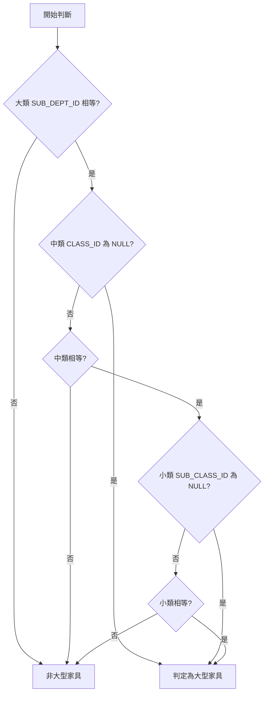
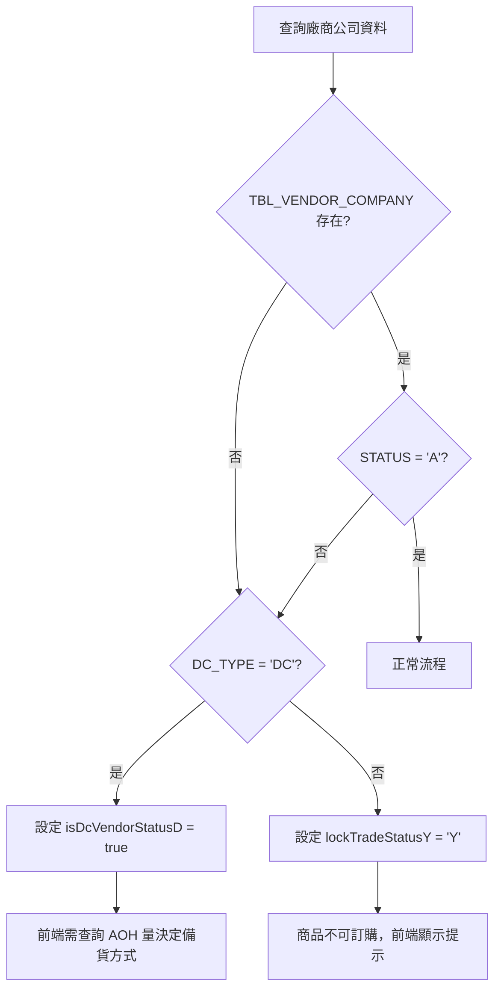
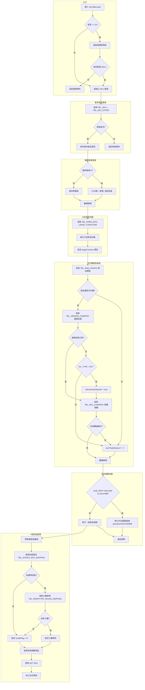
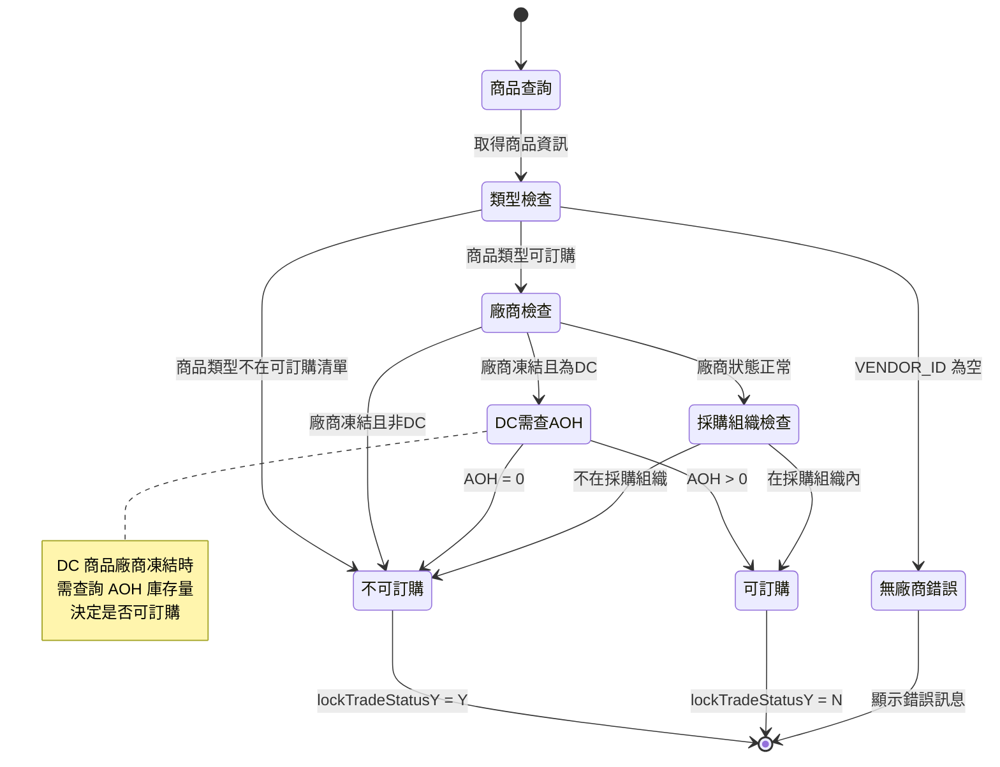
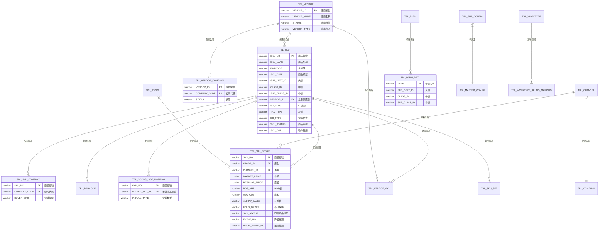

# 商品查詢規格補充文件

**Feature Branch**: `002-create-order`
**建立日期**: 2025-12-20
**狀態**: 完整規格

本文件補充商品查詢的完整細節，包括 SKU 顯示欄位、可訂購規則、直送條件、採購組織設定、例外處理等。

---

## 程式碼證據索引

| 項目 | 檔案路徑 | 行號 |
|------|----------|------|
| 商品查詢主服務 | `C:/projects/som/so-bzservices/src/main/java/com/trihome/som/bz/service/BzSkuInfoServices.java` | 全檔 |
| 商品查詢入口 | `BzSkuInfoServices.java` | 130-152 |
| 商品資訊查詢 | `BzSkuInfoServices.java` | 202-436 |
| 可訂購規則判斷 | `BzSkuInfoServices.java` | 237-275 |
| 外包服務商品判斷 | `BzSkuInfoServices.java` | 748-750 |
| 外包服務商品處理 | `BzSkuInfoServices.java` | 555-638 |
| 大型家具服務 | `C:/projects/som/so-bzservices/src/main/java/com/trihome/som/bz/service/LargeFurnitureService.java` | 31-60 |
| 工種類別常數 | `C:/projects/som/so-bzservices/src/main/java/com/trihome/som/bz/common/constant/WorktypeClassSettingConstant.java` | 21-39 |
| 運送/備貨常數 | `C:/projects/som/so-bzservices/src/main/java/com/trihome/som/bz/common/constant/SoConstant.java` | 93-207 |
| 商品 VO | `C:/projects/som/so-bzservices/src/main/java/com/trihome/som/bz/bean/SkuInfoVO.java` | 全檔 |
| 商品查詢 SQL | `C:/projects/som/so-bzservices/src/main/resources/sqlMap/CustomSkuInfoOpenCloseMapper.xml` | 158-276 |
| 直送服務 | `C:/projects/som/so-bzservices/src/main/java/com/trihome/som/bz/service/DirectlyFunctionMainServices.java` | 60-92 |

---

## 一、商品查詢 UI 顯示欄位

### 1.1 基本商品資訊 (來源: TBL_SKU)

| 欄位 | 資料庫欄位 | 類型 | 說明 | 程式碼證據 |
|------|-----------|------|------|-----------|
| 商品編號 | SKU_NO | VARCHAR2(9) | 主鍵 | SkuInfoVO.java:29 |
| 商品名稱 | SKU_NAME | VARCHAR2(50) | | SkuInfoVO.java:30 |
| 條碼 | BARCODE | VARCHAR2(14) | 商品主條碼 | SkuInfoVO.java:31 |
| 商品類型 | SKU_TYPE | VARCHAR2(10) | NORM/DIEN/COUP 等 | SkuInfoVO.java:32 |
| 大類 | SUB_DEPT_ID | VARCHAR2(3) | 子部門代碼 | SkuInfoVO.java:33 |
| 中類 | CLASS_ID | VARCHAR2(3) | 類別代碼 | SkuInfoVO.java:34 |
| 小類 | SUB_CLASS_ID | VARCHAR2(3) | 子類別代碼 | SkuInfoVO.java:35 |
| SO旗標 | SO_FLAG | VARCHAR2(1) | Y:客製化商品 | SkuInfoVO.java:36 |
| 主要供應商 | VENDOR_ID | VARCHAR2(10) | FK → TBL_VENDOR | SkuInfoVO.java:37 |
| 商品狀態 | SKU_STATUS | VARCHAR2(10) | A:正常, D:停止採購 | SkuInfoVO.java:38 |
| 稅別 | TAX_TYPE | VARCHAR2(1) | 0:零稅, 1:應稅, 2:免稅 | SkuInfoVO.java:39 |
| 包裝入數 | PACKS | NUMBER(9,2) | | SkuInfoVO.java:40 |
| 危險商品 | DANGER_FLAG | VARCHAR2(1) | Y/N | SkuInfoVO.java:41 |
| 開放售價 | OPEN_PRICE | VARCHAR2(1) | Y:可變價, N:不可變價 | SkuInfoVO.java:42 |
| 免費宅配 | FREE_DELIVER | VARCHAR2(1) | Y/N | SkuInfoVO.java:43 |
| 採購屬性 | DC_TYPE | VARCHAR2(2) | XD/DC/VD | SkuInfoVO.java:53 |
| 物料種類 | SKU_CAT | VARCHAR2(2) | 00:single, 10:saleset | SkuInfoVO.java:55 |

### 1.2 門店商品資訊 (來源: TBL_SKU_STORE)

| 欄位 | 資料庫欄位 | 類型 | 說明 | 程式碼證據 |
|------|-----------|------|------|-----------|
| 店別 | STORE_ID | VARCHAR2(5) | 複合主鍵 | SkuInfoVO.java:57 |
| 通路 | CHANNEL_ID | VARCHAR2(5) | | SkuInfoVO.java:58 |
| 市價 | MARKET_PRICE | NUMBER(9,2) | | SkuInfoVO.java:60 |
| 原價 | REGULAR_PRICE | NUMBER(9,2) | | SkuInfoVO.java:61 |
| POS價 | POS_AMT | NUMBER(9,2) | 實際售價 | SkuInfoVO.java:62 |
| 成本 | AVG_COST | NUMBER(9,2) | | SkuInfoVO.java:63 |
| 可否銷售 | ALLOW_SALES | VARCHAR2(1) | Y/N | SkuInfoVO.java:64 |
| 允許退貨 | ALLOW_RETURN | VARCHAR2(10) | A/B/C | SkuInfoVO.java:65 |
| 不可採購 | HOLD_ORDER | VARCHAR2(1) | A/B/C/D/E/N | SkuInfoVO.java:66 |
| 降價檔期 | EVENT_NO | VARCHAR2(10) | FK → TBL_PROM_EVENT | SkuInfoVO.java:67 |
| 組促檔期 | PROM_EVENT_NO | VARCHAR2(10) | FK → TBL_PROM_EVENT | SkuInfoVO.java:68 |
| 展示品 | DISPLAY_FLAG | VARCHAR2(1) | Y/N | SkuInfoVO.java:71 |
| 商品店狀態 | SKU_STATUS | VARCHAR2(10) | A/D | SkuInfoVO.java:54 |

### 1.3 計算與控制欄位

| 欄位 | 說明 | 預設值 | 程式碼證據 |
|------|------|--------|-----------|
| lockTradeStatusY | 商品是否可訂購 | "N" | SkuInfoVO.java:145 |
| isDcVendorStatusD | DC商品廠商凍結 | false | SkuInfoVO.java:152 |
| largeFurniture | 大型家具標記 | false | SkuInfoVO.java:179 |
| stockAOH | 庫存量 | "0" | SkuInfoVO.java:80 |
| installFlag | 可否安裝 | - | SkuInfoVO.java:78 |
| tradeStatus | 備貨方式 | - | SkuInfoVO.java:97 |
| deliveryFlag | 運送註記 | - | SkuInfoVO.java:98 |
| goodsType | 商品類別 | - | SkuInfoVO.java:114 |

---

## 二、可訂購規則 (Orderability Rules)

### 2.1 判斷流程

```java
// 來源: BzSkuInfoServices.java 行號 237-275

// Step 1: 商品類型檢查
TblSubConfigCriteria subConfigCriteria = new TblSubConfigCriteria();
subConfigCriteria.createCriteria()
    .andSubConfigNameEqualTo(skuInfoVO.getSkuType())
    .andMasterConfigIdEqualTo(ConfigConstant.PURCHASABLE_SKU_TYPE);
List<TblSubConfig> list = tblSubConfigMapper.selectByCriteria(subConfigCriteria);
if(CollectionUtils.isEmpty(list)){
    skuInfoVO.setLockTradeStatusY(CommonConstant.YES_FLAG); // 不可訂購
}

// Step 2: 廠商凍結檢查
else if (StringUtils.isNotBlank(skuInfoVO.getVendorId())) {
    TblVendorCompanyKey key = new TblVendorCompanyKey();
    key.setVendorId(skuInfoVO.getVendorId());
    key.setCompanyCode(tblChannel.getCompanyCode());
    TblVendorCompany tblVendorCompany = tblVendorCompanyMapper.selectByPrimaryKey(key);

    if (tblVendorCompany == null || !"A".equals(tblVendorCompany.getStatus())) {
        if (StringUtils.equals(skuInfoVO.getDcType(), "DC")) {
            // DC商品廠商凍結 → 需查詢 AOH 量
            skuInfoVO.setIsDcVendorStatusD(true);
        } else {
            // 非DC商品廠商凍結 → 不可訂購
            skuInfoVO.setLockTradeStatusY(CommonConstant.YES_FLAG);
        }
    }
}

// Step 3: 採購組織檢查
TblSkuCompanyCriteria scc = new TblSkuCompanyCriteria();
scc.createCriteria()
    .andSkuNoEqualTo(skuNo)
    .andCompanyCodeEqualTo(tblChannel.getCompanyCode());
List<TblSkuCompany> scList = tblSkuCompanyMapper.selectByCriteria(scc);
if (CollectionUtils.isEmpty(scList)) {
    skuInfoVO.setLockTradeStatusY(CommonConstant.YES_FLAG); // 不可訂購
}
```

### 2.2 可訂購規則明細

#### 2.2.1 後端規則 (BzSkuInfoServices.java)

| 規則編號 | 規則名稱 | 判斷條件 | 結果 | 資料表 | 程式碼行號 |
|---------|---------|---------|------|--------|-----------|
| OD-001 | 商品類型限制 | SKU_TYPE 不在 TBL_SUB_CONFIG.PURCHASABLE_SKU_TYPE | lockTradeStatusY='Y' | TBL_SUB_CONFIG | 238-244 |
| OD-002 | 廠商凍結(非DC) | TBL_VENDOR_COMPANY.STATUS ≠ 'A' AND DC_TYPE ≠ 'DC' | lockTradeStatusY='Y' | TBL_VENDOR_COMPANY | 252-259 |
| OD-003 | 廠商凍結(DC) | TBL_VENDOR_COMPANY.STATUS ≠ 'A' AND DC_TYPE = 'DC' | isDcVendorStatusD=true | TBL_VENDOR_COMPANY | 254-255 |
| OD-004 | 採購組織限制 | SKU 不在門市公司的 TBL_SKU_COMPANY | lockTradeStatusY='Y' | TBL_SKU_COMPANY | 268-275 |
| OD-005 | 無廠商ID | VENDOR_ID 為空 | 顯示錯誤訊息 | TBL_SKU | 261-265 |

#### 2.2.2 前端規則 (soSKUSubPage.jsp)

| 規則編號 | 規則名稱 | 判斷條件 | 結果 | 程式碼位置 |
|---------|---------|---------|------|-----------|
| OD-006 | 票券商品限制 | 訂單來源='0002' 且商品非 068-011 | 拒絕新增，顯示"請輸入票券商品編號" | 137-142 |
| OD-007 | 非票券訂單排除 | 訂單來源≠'0002' 且商品為 068-011 | 拒絕新增，顯示"此商品限票券使用" | 143-148 |
| OD-008 | MINI通路限制 | channelId = 'MINI' | 禁用訂購選項 | 1327-1363 |
| OD-009 | CASA通路限制 | channelId = 'CASA' | 禁用訂購選項 | 1327-1363 |
| OD-010 | DIEN商品限制 | SKU_TYPE = 'DIEN' | 強制現貨(X)+下次自取(P)，禁用所有選項 | 2518-2536 |
| OD-011 | 變價條碼唯一性 | QRCode 已存在於當前訂單 | 拒絕新增 | 122-136 |
| OD-012 | DC廠商凍結-大型家具 | isDcVendorStatusD=true AND largeFurniture=true | 允許訂購 | 1078-1095 |
| OD-013 | DC廠商凍結-庫存足 | isDcVendorStatusD=true AND AOH >= quantity | 允許訂購 | 1078-1095 |
| OD-014 | DC廠商凍結-庫存不足 | isDcVendorStatusD=true AND AOH < quantity | 強制現貨，顯示警告 | 1078-1095 |
| OD-015 | 主配檔檢查 | masterConfigId ≠ 'Y' | 禁用訂購選項 | newCheckTradeStatusY |
| OD-016 | 宅配重量限制 | weight = 0 | 禁用宅配選項 | checkDeliveryFlagF |
| OD-017 | 宅配店別限制 | 出貨店不支援宅配 | 禁用宅配選項 | checkDeliveryFlagF |
| OD-018 | 免安效期檢查 | 免安商品已過期 | 從可選清單移除 | 2559-2650 |
| OD-019 | 免安售價驗證 | eventAmt > installPosAmt | 移除該免安商品 | BzSkuInfoServices:348-350 |
| OD-020 | 工種查詢失敗 | 找不到對應工種 | 設為無安裝 | BzSkuInfoServices:420 |

#### 2.2.3 holdOrder 採購權限對照表

| holdOrder 值 | 說明 | PO商品可訂 | DC商品可訂 |
|-------------|------|-----------|-----------|
| N | 無HOLD ORDER | ✅ | ✅ |
| A | 暫停採購及調撥 | ❌ | ✅ |
| B | 暫停店對店調撥 | ✅ | ❌ |
| C | 暫停所有採購調撥 | ❌ | ❌ |
| D | 暫停但允許MD下單及調撥 | ✅ | ✅ |
| E | 暫停但允許MD調撥 | ✅ | ✅ |

#### 2.2.4 商品狀態組合判斷

| skuStatus | skuStoreStatus | dcType | 結果 | 說明 |
|-----------|----------------|--------|------|------|
| A | A | - | 可用 | 正常商品 |
| D | - | - | 不可用 | 商品已刪除 |
| A | D | ≠DC | 不可用 | 門店停用(非DC) |
| A | D | DC | 可用 | DC商品門店停用(特例) |

### 2.3 DC 類型說明 (DC_TYPE)

| 代碼 | 英文 | 中文 | 廠商凍結處理 |
|------|------|------|-------------|
| XD | Cross Docking | 交叉轉運 | 直接鎖定不可訂購 |
| DC | Stock Holding | 庫存持有 | 設定 isDcVendorStatusD，需查AOH |
| VD | Vendor Direct | 供應商直送 | 直接鎖定不可訂購 |

---

## 三、直送條件 (Direct Shipment)

### 3.1 直送判斷邏輯

```java
// 來源: SoConstant.java 行號 99-101
public static final String DELIVERY_FLAG_V = "V"; // 直送

// 來源: DirectlyFunctionMainServices.java 行號 62-66
// 直送商品條件: GOODS_TYPE='P' AND DELIVERY_FLAG='V'
TblOrderDetlCriteria orderDetlCriteria = new TblOrderDetlCriteria();
orderDetlCriteria.createCriteria()
    .andOrderIdEqualTo(orderId)
    .andGoodsTypeEqualTo(GoodsType.P)
    .andDeliveryFlagEqualTo(SoConstant.DELIVERY_FLAG_V);
```

### 3.2 直送規則

| 規則編號 | 規則名稱 | 條件 | 結果 | 程式碼證據 |
|---------|---------|------|------|-----------|
| DS-001 | 直送備貨方式 | DELIVERY_FLAG='V' | TRADE_STATUS 強制為 'Y' (訂購) | spec.md:443 |
| DS-002 | 直送商品篩選 | GOODS_TYPE='P' AND DELIVERY_FLAG='V' | 寫入直送單明細 | DirectlyFunctionMainServices.java:62-66 |
| DS-003 | 非負項檢查 | NSKU_FLAG='N' AND QUANTITY > 0 | 才寫入直送單 | DirectlyFunctionMainServices.java:70-73 |

### 3.3 運送方式枚舉

| 代碼 | 常數名稱 | 中文 | 備貨方式限制 | 程式碼證據 |
|------|---------|------|-------------|-----------|
| N | DELIVERY_FLAG_N | 運送 | 無限制 | SoConstant.java:93 |
| D | DELIVERY_FLAG_D | 純運 | 無限制 | SoConstant.java:97 |
| V | DELIVERY_FLAG_V | 直送 | 僅限訂購(Y) | SoConstant.java:101 |
| C | DELIVERY_FLAG_C | 當場自取 | 僅限現貨(X) | SoConstant.java:105 |
| F | DELIVERY_FLAG_F | 宅配 | 無限制 | SoConstant.java:109 |
| P | DELIVERY_FLAG_P | 下次自取 | 無限制 | SoConstant.java:113 |

---

## 四、大型家具判斷

### 4.1 判斷邏輯

```java
// 來源: LargeFurnitureService.java 行號 31-60
public boolean checkIsBigFurniture(
    String subDeptId,     // 大類
    String classId,       // 中類
    String subClassId,    // 小類
    List<TblParmDetl> furnitureList
) {
    for (TblParmDetl tblParmDetl : furnitureList) {
        // 大類相等
        if (tblParmDetl.getSubDeptId() != null &&
            tblParmDetl.getSubDeptId().equals(subDeptId)) {
            // 中類為NULL → 直接判大型家具
            if (tblParmDetl.getClassId() == null) {
                return true;
            } else {
                // 中類相等
                if (tblParmDetl.getClassId().equals(classId)) {
                    // 小類為NULL → 判大型家具
                    if (tblParmDetl.getSubClassId() == null) {
                        return true;
                    } else {
                        // 大中小類皆相等 → 判大型家具
                        if (tblParmDetl.getSubClassId().equals(subClassId)) {
                            return true;
                        }
                    }
                }
            }
        }
    }
    return false;
}

// 取得大型家具設定 (行號 67-73)
public List<TblParmDetl> getFurnitureSettingList() {
    TblParmDetlCriteria criteria = new TblParmDetlCriteria();
    criteria.createCriteria().andParmEqualTo("LARGE_FURNITURE");
    return tblParmDetlMapper.selectByCriteria(criteria);
}
```

### 4.2 大型家具判斷流程



### 4.3 大型家具設定來源

| 資料表 | 欄位 | 說明 |
|--------|------|------|
| TBL_PARM_DETL | PARM | 固定值 'LARGE_FURNITURE' |
| TBL_PARM_DETL | SUB_DEPT_ID | 大類代碼 |
| TBL_PARM_DETL | CLASS_ID | 中類代碼 (可為 NULL) |
| TBL_PARM_DETL | SUB_CLASS_ID | 小類代碼 (可為 NULL) |

---

## 五、外包純服務商品 (026-888)

### 5.1 判斷條件

```java
// 來源: BzSkuInfoServices.java 行號 748-750
public static boolean isServiceSku(String subDeptId, String classId) {
    return WorktypeClassSettingConstant.TRANSPORT_SUB_DEPT_026.equals(subDeptId)
           && "888".equals(classId);
}

// 常數定義: WorktypeClassSettingConstant.java 行號 30
public static final String TRANSPORT_SUB_DEPT_026 = "026"; // 安裝子部門
```

### 5.2 外包服務商品特殊處理

當商品為 026-888 類別時，進入特殊處理流程：

```java
// 來源: BzSkuInfoServices.java 行號 277-281
if(isServiceSku(skuInfoVO.getSubDeptId(), skuInfoVO.getClassId())){
    qerySkuInfoFor026888(skuInfoVO, taxZero, systemFlag);
    return skuInfoVO;
}
```

特殊處理內容 (行號 555-638):
- 庫存量固定為 "0"
- 成本、市價、原價、POS價 皆為 "0"
- 開放售價 = "N"
- 安裝註記 = "Y" (強制需要安裝)
- 商品類型 = "P" (主要商品)

---

## 六、採購組織設定

### 6.1 採購組織關係

```
TBL_CHANNEL
    └── COMPANY_CODE (公司代碼)
           └── TBL_SKU_COMPANY
                  ├── SKU_NO (商品編號)
                  └── COMPANY_CODE (公司代碼)
```

### 6.2 採購組織檢查

```java
// 來源: BzSkuInfoServices.java 行號 268-275
TblChannel tblChannel = tblChannelMapper.selectByPrimaryKey(
    commonInfoServices.findLoginUserChannelId()
);
TblSkuCompanyCriteria scc = new TblSkuCompanyCriteria();
scc.createCriteria()
    .andSkuNoEqualTo(skuNo)
    .andCompanyCodeEqualTo(tblChannel.getCompanyCode());
List<TblSkuCompany> scList = tblSkuCompanyMapper.selectByCriteria(scc);

if (CollectionUtils.isEmpty(scList)) {
    skuInfoVO.setLockTradeStatusY(CommonConstant.YES_FLAG);
}
```

### 6.3 相關資料表

| 資料表 | 主鍵 | 說明 | 程式碼證據 |
|--------|------|------|-----------|
| TBL_CHANNEL | CHANNEL_ID | 通路主檔，含 COMPANY_CODE | BzSkuInfoServices.java:269 |
| TBL_SKU_COMPANY | SKU_NO + COMPANY_CODE | 商品公司對照 | BzSkuInfoServices.java:270-272 |
| TBL_VENDOR_COMPANY | VENDOR_ID + COMPANY_CODE | 廠商公司對照 | BzSkuInfoServices.java:248-251 |

---

## 七、寫死常數整理與 Enum 化建議

### 7.1 子部門代碼 (SubDeptId)

| 代碼 | 常數名稱 | 說明 | 來源 | 建議 |
|------|---------|------|------|------|
| 025 | TRANSPORT_SUB_DEPT_025 | 運費子部門 | WorktypeClassSettingConstant.java:26 | 保留常數或移至 TBL_PARM |
| 026 | TRANSPORT_SUB_DEPT_026 | 安裝子部門 | WorktypeClassSettingConstant.java:30 | 保留常數或移至 TBL_PARM |
| 027 | TRANSPORT_SUB_DEPT_027 | 折扣子部門 | WorktypeClassSettingConstant.java:34 | 保留常數或移至 TBL_PARM |
| 880 | TRANSPORT_SUB_DEPT_880 | TRCB運費 | WorktypeClassSettingConstant.java:38 | 保留常數或移至 TBL_PARM |

### 7.2 類別代碼 (ClassId)

| 代碼 | 用途 | 來源 | 建議 |
|------|------|------|------|
| 888 | 外包純服務中類 | BzSkuInfoServices.java:749 | 移至 TBL_PARM 或建立 Enum |

### 7.3 建議 Enum 設計

```java
/**
 * 安運子部門類型
 */
public enum TransportSubDept {
    DELIVERY("025", "運費"),
    INSTALLATION("026", "安裝"),
    DISCOUNT("027", "折扣"),
    TRCB_DELIVERY("880", "TRCB運費");

    private final String code;
    private final String description;

    // constructor, getters
}

/**
 * 運送方式
 */
public enum DeliveryMethod {
    DELIVERY("N", "運送"),
    PURE_DELIVERY("D", "純運"),
    DIRECT_SHIPMENT("V", "直送"),
    PICKUP_NOW("C", "當場自取"),
    HOME_DELIVERY("F", "宅配"),
    PICKUP_LATER("P", "下次自取");

    private final String code;
    private final String description;

    // constructor, getters
}

/**
 * 備貨方式
 */
public enum TradeStatus {
    SPOT("X", "現貨"),
    ORDER("Y", "訂購");

    private final String code;
    private final String description;

    // constructor, getters
}

/**
 * DC 類型 (採購屬性)
 */
public enum DcType {
    CROSS_DOCKING("XD", "交叉轉運"),
    STOCK_HOLDING("DC", "庫存持有"),
    VENDOR_DIRECT("VD", "供應商直送");

    private final String code;
    private final String description;

    // constructor, getters
}

/**
 * 廠商狀態
 */
public enum VendorStatus {
    ACTIVE("A", "正常"),
    FROZEN("D", "凍結");

    private final String code;
    private final String description;

    // constructor, getters
}
```

### 7.4 建議移至 TBL_PARM 的設定

| 設定項 | 目前位置 | 建議 PARM 名稱 | 說明 |
|--------|---------|---------------|------|
| 外包服務中類 888 | 硬編碼 | SERVICE_SKU_CLASS_ID | 方便未來調整 |
| 可訂購商品類型 | TBL_SUB_CONFIG | PURCHASABLE_SKU_TYPE | 已在設定表 |
| 大型家具類別 | TBL_PARM_DETL | LARGE_FURNITURE | 已在設定表 |
| 安裝調整商品 | TBL_PARM | OTHER_INSTALL_SKU | 已在設定表 |

---

## 八、商品查詢例外處理

### 8.1 廠商凍結例外



### 8.2 採購組織例外

| 情況 | 處理方式 | UI 行為 |
|------|---------|---------|
| SKU 不在門市公司採購組織 | lockTradeStatusY = 'Y' | 禁用訂購選項 |
| SKU 在採購組織但廠商凍結 | 依 DC_TYPE 處理 | 參考廠商凍結流程 |

### 8.3 無廠商ID例外

```java
// 來源: BzSkuInfoServices.java 行號 261-265
} else {
    skuInfoVO.setMsg("該SKU未設定廠商ID，無法新增");
    return skuInfoVO;
}
```

### 8.4 大型家具例外

大型家具商品的特殊處理：
1. 前端需顯示大型家具標記
2. 運送安排需考慮大型家具運送限制
3. 安裝服務可能有額外收費
4. DC廠商凍結時，大型家具可跳過 AOH 檢查直接允許訂購

### 8.5 前端警告訊息清單

| 訊息 | 觸發條件 | 程式碼位置 |
|------|---------|-----------|
| "變價條碼已使用" | 變價條碼重複 | skuBlur (122-136) |
| "請輸入票券商品編號" | 票券訂單選非票券商品 | skuBlur (137-142) |
| "此商品限票券使用" | 非票券訂單選票券商品 | skuBlur (143-148) |
| "該SKU未設定廠商ID，無法新增" | VENDOR_ID 為空 | BzSkuInfoServices:262 |
| "廠商狀態已停用，該商品購買量已大於DC倉AOH量，僅能勾選【現貨】" | DC廠商凍結+非大型家具+庫存不足 | isDCVendorDCheck (1091-1093) |
| "該商品購買量已大於DC倉AOH量，僅能勾選【現貨】" | 訂購勾選+DC商品+AOH<quantity | tradeStatusYQuantityCheck |
| "請輸入數量，數量不可為空。" | 數量欄留空 | quantityChange (985-987) |
| "目前會員點數：X，此次使用點數：Y，點數不足抵扣" | 紅利點數不足 | quantityChange (1011-1012) |
| "SKU:XXX/SKU:YYY為刪除品無法下單" | 商品狀態='D' | showChkMsg (2550-2551) |

### 8.6 前端欄位禁用條件

| 欄位 | 禁用條件 | 說明 |
|------|---------|------|
| quantity | 初始禁用 / openPrice='Y' / 外包服務 / 票券 / 變價條碼存在 | 數量欄位 |
| actPosAmt | 初始禁用 / 外包服務 / 票券 | 實際售價欄位 |
| tradeStatusY (訂購) | lockTradeStatusY='Y' / 通路限制 / holdOrder限制 / 廠商凍結庫存不足 | 備貨方式 |
| deliveryFlagV (直送) | lockTradeStatusY='Y' / 非自運商品 / 無免運 / 庫存不足 | 運送方式 |
| deliveryFlagF (宅配) | 商品重量=0 / 出貨店不支援宅配 | 運送方式 |
| deliveryFlagC (當場自取) | 訂購+有安 / 訂購+純運 / 下次+訂購 | 運送方式 |
| installFlag | 外包服務商品以外的免安過期 / 安裝商品<=1個 / DIEN商品 | 安裝選項 |
| taxZero | 任何商品加入後 | 稅額設定 |

---

## 九、商品類型 (GoodsType)

### 9.1 商品類型枚舉

| 代碼 | 說明 | 是否為商品 | 來源 |
|------|------|-----------|------|
| P | 主要商品 (Primary) | 是 | GoodsType.P |
| I | 標準安裝 (Installation) | 是 | GoodsType.I |
| IA | 進階安裝 (Installation Advanced) | 是 | GoodsType.IA |
| IE | 其他安裝 (Installation Extra) | 是 | GoodsType.IE |
| IC | 其他安裝調整 (Installation Adjust) | 是 | GoodsType.IC |
| IS | 補安裝費 (Installation Supplement) | 是 | GoodsType.IS |
| FI | 免安折扣 (Free Installation) | 負項 | GoodsType.FI |
| D | 工種 (Work Type) | 否 | GoodsType.D |
| DD | 運費商品 (Delivery) | 是 | GoodsType.DD |
| VD | 直送運送商品 (Vendor Delivery) | 是 | GoodsType.VD |
| VT | 會員卡折扣 | 負項 | GoodsType.VT |
| CP | 折價券 | 負項 | GoodsType.CP |
| CK | 折扣券 | 負項 | GoodsType.CK |
| CI | 酷卡折扣 | 負項 | GoodsType.CI |
| BP | 紅利折抵 | 負項 | GoodsType.BP |
| TT | 總額折扣 | 負項 | GoodsType.TT |

### 9.2 安裝類型對照

| 安裝類型 | INSTALL_TYPE | GoodsType | 說明 | 來源 |
|---------|-------------|-----------|------|------|
| 標準安裝 | B | I | Basic Installation | SoConstant.java:73 |
| 進階安裝 | A | IA | Advance Installation | SoConstant.java:77 |
| 其他安裝 | E | IE | Extra Installation | SoConstant.java:81 |
| 其他安裝調整 | C | IC | Extra Adjust | SoConstant.java:85 |
| 補安裝費 | S | IS | Supplement | SoConstant.java:89 |
| 免安折扣 | - | FI | Free Installation | BzSkuInfoServices.java:355 |

---

## 十、Mermaid 圖表

### 10.1 商品查詢統一流程圖



### 10.2 可訂購規則狀態機



### 10.3 商品相關 ER 圖



---

## 十一、整合至現有規格的建議

### 11.1 更新 FR-010 商品資格驗證

建議將現有的 6 層驗證擴充為 8 層：

| 層級 | 名稱 | 說明 | 新增 |
|------|------|------|------|
| 1 | 格式驗證 | SKU 符合編碼規則 | - |
| 2 | 存在性驗證 | SKU 存在於商品主檔 | - |
| 3 | 系統商品排除 | allowSales ≠ 'N' | - |
| 4 | 稅別驗證 | taxType 為有效值 | - |
| 5 | 銷售禁止 | allowSales = true AND holdOrder = false | - |
| 6 | 類別限制 | 類別不在禁售清單 | - |
| 7 | 廠商凍結 | 廠商狀態為 'A' 或 DC 商品有 AOH | 新增 |
| 8 | 採購組織 | 商品在門市公司採購組織內 | 新增 |

### 11.2 新增 Domain Service

```java
/**
 * 商品可訂購性判斷服務
 */
public class ProductOrderabilityService {

    /**
     * 判斷商品是否可訂購
     *
     * @param skuNo 商品編號
     * @param channelId 通路代碼
     * @param storeId 店別
     * @return OrderabilityResult
     */
    public OrderabilityResult checkOrderability(
        String skuNo,
        String channelId,
        String storeId
    ) {
        // 1. 商品類型檢查
        // 2. 廠商凍結檢查
        // 3. 採購組織檢查
        // 4. 大型家具標記
        // 5. 外包服務判斷
    }
}
```

### 11.3 新增 Value Objects

```java
/**
 * 商品可訂購性結果
 */
public record OrderabilityResult(
    boolean orderable,           // 是否可訂購
    String lockReason,           // 鎖定原因
    boolean isDcVendorFrozen,    // DC商品廠商凍結
    boolean isLargeFurniture,    // 大型家具
    boolean isServiceSku         // 外包服務商品
) {}
```

---

## 十二、驗證報告

詳細的規格驗證報告請參考: [product-query-verification-report.md](./product-query-verification-report.md)

該報告包含：
- 規格正確性驗證結果
- 前端遺漏例外處理清單
- 後端邊界情況分析
- 資料表和欄位遺漏清單
- 常數遺漏清單
- 風險評估和後續行動建議

---

## 變更歷史

| 日期 | 版本 | 變更內容 | 作者 |
|------|------|---------|------|
| 2025-12-20 | 1.0.0 | 初版建立 | Claude Code |
| 2025-12-20 | 1.1.0 | 新增前端規則 OD-006~OD-020、holdOrder對照表、商品狀態組合判斷、前端警告訊息清單、欄位禁用條件、驗證報告連結 | Claude Code |
