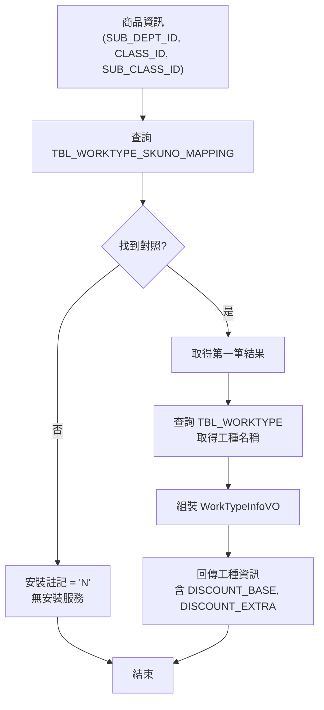
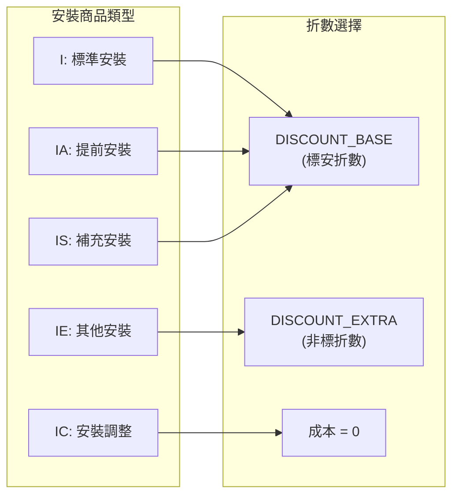

# 工種-商品對照規則規格

> 本文件定義工種 (WorkType) 與商品的對照查詢規則，以及安裝費成本折數的選擇邏輯。

## 1. 資料表結構

### 1.1 TBL_WORKTYPE_SKUNO_MAPPING (工種-商品對照表)

| 欄位 | 類型 | PK | 說明 |
|------|------|:--:|------|
| SUB_DEPT_ID | VARCHAR(3) | Y | 大類代碼 |
| CLASS_ID | VARCHAR(3) | Y | 中類代碼 |
| SUB_CLASS_ID | VARCHAR(3) | Y | 子類代碼 |
| SUB_CLASS_NAME | VARCHAR(60) | | 子類名稱 |
| WORKTYPE_ID | VARCHAR(4) | | 工種代碼 |
| DISCOUNT_BASE | DECIMAL(5,2) | | 標安成本折數 |
| DISCOUNT_EXTRA | DECIMAL(5,2) | | 非標成本折數 |
| UPDATE_DATE | DATE | | 更新日期 |
| UPDATE_EMP_ID | VARCHAR(10) | | 更新人員 |
| UPDATE_EMP_NAME | VARCHAR(20) | | 更新人員姓名 |

### 1.2 TBL_WORKTYPE (工種主檔)

| 欄位 | 類型 | 說明 |
|------|------|------|
| WORKTYPE_ID | VARCHAR(4) | 工種代碼 (PK) |
| WORKTYPE_NAME | VARCHAR(40) | 工種名稱 |
| LOW_SALARY | DECIMAL(10,0) | 最低工資 |
| WARRANTY | VARCHAR(1) | 保固註記 |

## 2. 查詢邏輯

### 2.1 工種查詢流程



### 2.2 查詢條件

```sql
SELECT SUB_DEPT_ID, CLASS_ID, SUB_CLASS_ID, SUB_CLASS_NAME,
       WORKTYPE_ID, DISCOUNT_BASE, DISCOUNT_EXTRA
FROM TBL_WORKTYPE_SKUNO_MAPPING
WHERE SUB_DEPT_ID = :subDeptId
  AND CLASS_ID = :classId
  AND SUB_CLASS_ID = :subClassId
```

**查詢規則**:
- 三個欄位 (大類+中類+子類) **完全匹配**
- 若有多筆結果，取第一筆 (`get(0)`)
- 若無匹配，商品視為不需安裝服務

### 2.3 程式碼參考

```java
// BzSkuInfoServices.java:668-690
private WorkTypeInfoVO generateWorkType(String subDeptId, String classId, String subClassId) {
    WorkTypeInfoVO vo = null;

    List<TblWorktypeSkunoMapping> listWorkTypeSkuNo =
        queryWorkTypeSkuMapping(subDeptId, classId, subClassId);

    if (!listWorkTypeSkuNo.isEmpty()) {
        vo = new WorkTypeInfoVO();
        TblWorktypeSkunoMapping sku = listWorkTypeSkuNo.get(0);

        // 取得工種主檔
        List<TblWorktype> workType = queryWorkType(sku.getWorktypeId());
        if (!workType.isEmpty()) {
            vo.setWorkTypeName(workType.get(0).getWorktypeName());
        }

        vo.setSubDeptId(sku.getSubDeptId());
        vo.setClassId(sku.getClassId());
        vo.setSubClassId(sku.getSubClassId());
        vo.setWorkTypeId(sku.getWorktypeId());
        vo.setDisCountBase(sku.getDiscountBase().toString());
        vo.setDiscountExtra(sku.getDiscountExtra().toString());
        vo.setGoodsType(GoodsType.D);
    }
    return vo;
}
```

## 3. 折數選擇邏輯

### 3.1 GoodsType 與折數對應



### 3.2 折數選擇規則表

| GoodsType | 中文說明 | 使用折數 | 成本計算公式 |
|-----------|----------|---------|-------------|
| I | 標準安裝 | DISCOUNT_BASE | `amt × DISCOUNT_BASE ÷ 營業稅率` |
| IA | 提前安裝 | DISCOUNT_BASE | `amt × DISCOUNT_BASE ÷ 營業稅率` |
| IS | 補充安裝 | DISCOUNT_BASE | `amt × DISCOUNT_BASE ÷ 營業稅率` |
| IE | 其他安裝 | DISCOUNT_EXTRA | `amt × DISCOUNT_EXTRA ÷ 營業稅率` |
| IC | 安裝調整 | 無 | 成本固定為 0 |
| FI | 免安折價券 | - | 折扣金額 (負項) |

### 3.3 程式碼參考

```java
// BzSoServices.java:934-948
switch (insSku.getGoodsType()) {
    case GoodsType.I:   // 標準安裝
    case GoodsType.IA:  // 提前安裝
    case GoodsType.IS:  // 補充安裝
        amt = amt * discountBase / salesTaxFee;  // 使用標安折數
        break;

    case GoodsType.IE:  // 其他安裝
        amt = amt * discountExtra / salesTaxFee; // 使用非標折數
        break;

    case GoodsType.IC:  // 安裝調整
        amt = 0;         // 不計成本
        break;
}
```

## 4. 成本計算公式

### 4.1 安裝成本計算

```
安裝成本 = 安裝金額 × 成本折數 ÷ 營業稅率
```

**範例**:
- 安裝金額: 1,000 元
- DISCOUNT_BASE: 0.85 (85%)
- 營業稅率: 1.05

```
安裝成本 = 1000 × 0.85 ÷ 1.05 = 809.52 → 810 元 (四捨五入)
```

### 4.2 零稅率特殊處理

當商品為零稅率時，計算公式調整為:

```
零稅額 = floor(安裝金額 ÷ 營業稅率)
```

## 5. VO 資料結構

### 5.1 WorkTypeInfoVO

```java
public class WorkTypeInfoVO {
    private String workTypeId;      // 工種代碼
    private String workTypeName;    // 工種名稱
    private String subDeptId;       // 大類
    private String classId;         // 中類
    private String subClassId;      // 子類
    private String subClassName;    // 子類名稱
    private String disCountBase;    // 標安成本折數 (字串)
    private String discountExtra;   // 非標成本折數 (字串)
    private String goodsType;       // 商品性質
}
```

## 6. DDD 重構建議

### 6.1 Value Object 設計

```java
public record WorkTypeMapping(
    CategoryPath categoryPath,      // SUB_DEPT_ID + CLASS_ID + SUB_CLASS_ID
    WorkTypeId workTypeId,
    DiscountRate baseDiscount,      // DISCOUNT_BASE
    DiscountRate extraDiscount      // DISCOUNT_EXTRA
) {
    public DiscountRate getDiscountFor(InstallationType type) {
        return switch (type) {
            case STANDARD, ADVANCE, SUPPLEMENT -> baseDiscount;
            case OTHER -> extraDiscount;
            case ADJUSTMENT -> DiscountRate.ZERO;
        };
    }
}
```

### 6.2 Repository 介面

```java
public interface WorkTypeMappingRepository {
    Optional<WorkTypeMapping> findByCategoryPath(CategoryPath path);
}
```

## 7. Legacy Code 參考

| 功能 | 檔案 | 行號 |
|------|------|------|
| 工種查詢方法 | BzSkuInfoServices.java | 668-690 |
| 查詢 Mapper | BzSkuInfoServices.java | 712-723 |
| 折數應用 | BzSoServices.java | 906-999 |
| 工種主檔查詢 | BzSkuInfoServices.java | 731-738 |
